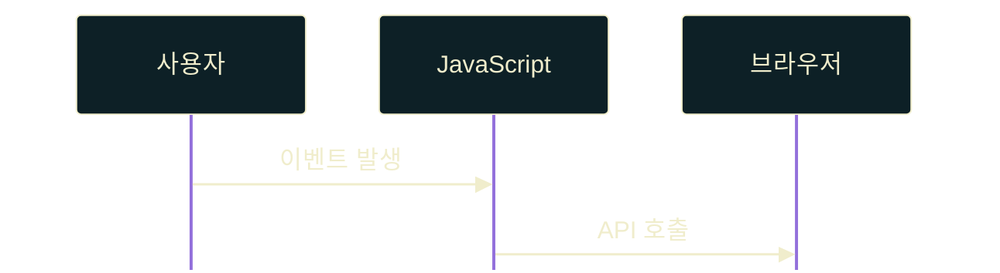

# 다이어그램 및 시각 요소 규칙 (Diagram Rules)

## 6.1 다이어그램 단순화 (Diagram Simplicity)
- 다이어그램은 시각적 유희가 아니라 **이해를 돕는 도구로써만 제한적으로 허용**한다.
- 런타임 흐름, 메모리 주소 관계, 단순 흐름도(Flowchart), 또는 아키텍처 구도만 보여준다.
- 장식적 요소, 과도하게 연결된 노드, 수많은 아이콘 및 무작위 색상 배치는 인지 부하를 높이므로 전면 금지하며, 오직 텍스트 기반 Mermaid 도식으로 간결하게 구조화한다.

## 6.2 Mermaid 설정 표준화 (Mermaid Configuration Standard)
- `slides.md` headmatter에는 Mermaid 전역 설정을 반드시 두어 기본 색상계를 고정한다.
- 전역 Mermaid 테마는 `theme: base`를 사용하고, 배경·노드·선·텍스트 색상은 기본 색상 토큰을 사용한다.
- 각 Mermaid 코드 블록에는 블록 내부 frontmatter `config`를 추가하여 다이어그램별 간격과 렌더링 변수를 명시한다.
- Flowchart는 `flowchart.padding`, `nodeSpacing`, `rankSpacing`을 반드시 지정하여 PDF export 시 노드 간격이 흔들리지 않게 한다.
- Flowchart 노드는 `class`, `classDef`로 역할별 스타일을 명시하고, 연결선은 `linkStyle default stroke:#F0EDCC,stroke-width:4px` 형태로 고정한다. (프로젝트 테마 색상에 연동)
- Flowchart에서 `예`, `아니오`, `성공`, `실패`처럼 분기 결과를 노드 내부에 표기할 때는 반드시 `(예)`, `(아니오)`처럼 괄호로 감싸 첫 줄에 배치한다.
- Sequence Diagram은 `sequence.actorMargin`, `messageMargin`, `mirrorActors`를 명시하고, actor·signal·activation 색상을 전역 색상계와 일치시킨다.
- **`loop`/`alt`/`opt` 라벨 필수 색상 지정**: Sequence Diagram에 `loop`, `alt`, `opt` 등 라벨 박스를 사용할 경우, `labelBoxBkgColor`/`labelBoxBorderColor`/`labelTextColor`/`loopTextColor`를 블록 내부 `themeVariables`에 반드시 함께 명시한다. 누락 시 라벨 텍스트가 mermaid 기본값인 검정색으로 폴백되어 다크 배경 위에서 시인성이 사라지는 사고가 실제로 발생한다.
- Mermaid 내부에서 네온색, 그라데이션, 임의 강조색을 사용하지 않는다. 강조가 필요하면 전경색 반전 정도로 제한한다.
- Mermaid 블록은 설명 Bullet과 한 슬라이드에 과밀하게 배치하지 않는다. 다이어그램만으로 개념이 전달되지 않으면 별도 설명 슬라이드로 분리한다.

**Flowchart 기본 패턴:**

**Sequence Diagram 기본 패턴:**

## 6.3 Mermaid Flowchart 라벨 스타일 지정 (Label Styling)
- **필수 규칙 (조건부 아님)**: `themeVariables.edgeLabelBackground` 지정만으로는 화살표 위 텍스트 라벨(Edge Label)의 글자색이 배경색과 구분되지 않아 **중간 텍스트가 렌더링 시 아예 보이지 않는 사고가 실제로 발생**한다. 전역 CSS 오버라이드가 Scope 격리로 정상 적용되지 않기 때문이며, "이상 있을 때만" 대응하는 것이 아니라 **`-->|"텍스트"|` 형태로 화살표에 텍스트 라벨을 넣는 모든 경우** 처음부터 인라인 HTML span 서식을 예외 없이 선언한다.
- **선두 패딩 배치 규칙 (Gotcha)**: Mermaid 자체 HTML Label 파서 및 Sanitizer의 내부 구현 한계로 인해, `style` 속성의 맨 앞에 `padding`을 먼저 선언하고 뒤에 `color`를 배치해야만 두 스타일이 모두 유실 없이 렌더러에 도달한다.
  - **Preferred:** `-->|"입력 조립"|`
  - **Avoid:** `-->|"입력 조립"|` (뒤에 위치한 padding 속성이 정규식 오버라이드 및 세미콜론 파싱 과정에서 유실될 수 있음)
  - **Avoid:** `-->|persist|` (span 없이 순수 텍스트만 넣으면 글자색이 배경과 겹쳐 텍스트가 안 보이는 상태로 렌더링될 수 있음)
