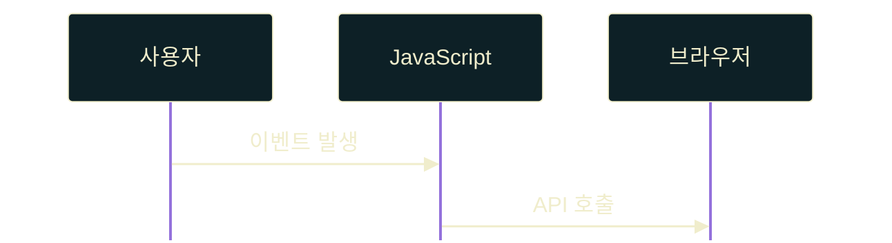

# AGENTS.md — Programming Lecture Slide Rules (Slidev)

> [!CRITICAL]
> 본 문서는 Slidev를 활용하여 프로그래밍 교안 슬라이드를 작성 및 편집할 때 준수해야 하는 **최상위 지배 규칙**이다.
> 모든 슬라이드는 교육적 명확성, 가독성, 정적 PDF 출력 호환성, 일관된 레이아웃을 엄격히 유지해야 한다.

---

# 1. 교육 기획 및 교수 설계 원칙 (Pedagogical Principles)

## 1.1 슬라이드당 단일 개념 원칙 (One Concept Per Slide)
- 각 슬라이드는 오직 **하나의 핵심 개념**만을 다룬다.
- **Good:** 변수 선언, `this` 키워드 동작, 프로토타입 공유 메서드 등 독립된 주제.
- **Bad:** 여러 개념의 혼용 또는 전체 단원의 서머리를 한 슬라이드에 우겨넣는 구성.
- 복잡하거나 조밀한 개념은 압축하려 하지 말고 **공격적인 슬라이드 분할**을 수행한다.

## 1.2 초심자 지향 가독성 (Beginner-Friendly Language)
- 학습자가 컴퓨터 과학(CS) 전문 용어에 익숙하지 않다고 가정한다.
- 어려운 추상화나 사양(Spec) 중심 설명은 지양하고, 점진적으로 용어를 학습시킨다.
- **Preferred:** "함수가 생성될 때 주변 변수를 기억하여 나중에도 접근 가능한 특성"
- **Avoid:** "자바스크립트의 Lexical Environment 기반 Execution Context의 외부 바인딩 참조 구조..."

## 1.3 직관 우선 설계 (Explanation Before Detail)
- 강의 자료의 전달 순서는 항상 다음 흐름을 따른다:
  1. **직관 (Intuition):** 비유 및 실생활 접근
  2. **간단한 예제 (Simple Example):** 코드 형태
  3. **공식 용어 (Terminology):** 공식 학술 명칭
  4. **심화 동작 (Mechanics):** 메모리 및 구동 방식
  5. **예외 처리 / 경계 조건 (Edge Cases)**
- 절대로 복잡한 정의나 명세(Spec) 내부 규격부터 설명하지 않는다.

## 1.4 점진적 코드 확장 (Progressive Code Expansion)
- 예제 코드는 한 번에 완성형 코드를 제시하기보다 점진적으로 추가 확장한다.
- **Preferred:** 기본 예제 제공 $\rightarrow$ 조금 더 확장된 예제 $\rightarrow$ 실무 활용 $\rightarrow$ 특수한 엣지 케이스 처리 순서로 단계적으로 공개.

---

# 2. 슬라이드 구조 및 정보 밀도 원칙 (Slide Density & Structure)

## 2.1 공격적 슬라이드 분할 (Aggressive Slide Splitting)
- 줄글 형식의 장황한 긴 설명문이나 백과사전식 텍스트 복사-붙여넣기는 전면 금지한다.
- 슬라이드당 **3~5개의 짧은 글머리 기호(Bullet)** 구성을 지향한다.
- **Bottom Margin Rule (하단 20% 여백 규칙):**
  - 슬라이드 하단 영역의 최소 20%는 항상 빈 공간으로 남겨둔다.
  - 슬라이드가 하단 경계까지 차올라 답답함을 준다면 무조건 두 개 이상의 슬라이드로 쪼갠다.

## 2.2 코드와 설명 슬라이드 원천 분리 (Code & Concept Separation)
- Slidev 환경에서 **설명글(Bullet)과 소스 코드 블록이 한 장에 혼재하면 여백 부족으로 100% 렌더링 넘침(Overflow)이 발생**한다.
- 설명이 들어가는 **개념 슬라이드**와 실제 소스코드를 보여주는 **예시 슬라이드**를 무조건 상호 독립적으로 격리 분리한다.

## 2.3 클래스 정의와 활용의 단일 코드 분리 (Class Definition & Usage Segregation)
- 클래스나 생성자 함수의 경우, 클래스 본문 정의(fields, constructor, methods)와 인스턴스 생성 및 호출(new, console.log) 코드를 한 블록에 넣으면 세로줄이 급증하여 넘침이 발생하므로 이를 완전히 쪼갠다.
- **구현 예시 슬라이드:** 클래스/생성자의 선언 및 명세 코드만 단독 노출 (주석 최소화)
- **활용 예시 슬라이드:** 선언된 클래스를 인스턴스화하고 실제로 출력하는 가벼운 테스트 코드만 단독 노출

## 2.4 대문 슬라이드 미니멀리즘 (Minimal Cover Slide)
- 첫 장(Cover Slide)은 고도로 절제된 단일 타이틀 디자인을 유지한다.
- **프론트매터 설정:** 반드시 `layout: cover`와 `class: text-center`를 적용하여 완벽한 수직/수평 정중앙 정렬을 부여한다.
- **콘텐츠 미니멀리즘:** 슬라이드 내에 **부제, 부연 설명, 강의 일자, 작성자 정보(morgan 등)를 전격 배제**하고, 오직 대제목 `#` 하나만 정중앙에 배치한다.
- **타이틀 스타일링:** 대문용 메인 제목은 `border-bottom` 데코레이션을 생략하고 웅장하게 키워 모던하고 깔끔하게 연출한다.

---

# 3. 텍스트 포맷팅 및 UI 디자인 규칙 (Formatting & UI Elements)

## 3.1 체크리스트 작성 규칙 (Checklist Format)
- 체크리스트 항목은 반드시 `- [ ]` 구문을 사용한다. (별표 `*` 형태의 선언은 금지한다)
- 학습 성취감을 부여하기 위해 반투명 미션 카드 플레이트 배경(`background: rgba(240, 237, 204, 0.03)`)과 테두리가 적용되도록 설계한다.
- 단일 슬라이드당 체크리스트는 **최대 4~5개**까지만 허용하며, 5개를 초과하면 반드시 `(1/2)`, `(2/2)` 형태로 여러 장의 슬라이드로 분할한다.

## 3.2 용어 정의 블록쿼트 규칙 (Blockquote Term Convention)
- 핵심 용어를 정의할 때 사용하는 인용구(`blockquote`)는 다음 규칙을 준수한다:
  1. **첫 번째 라인:** 용어명 단독 표기 — 굵은 글씨, **한글명 (영문명)** 형식
  2. **두 번째 라인:** 빈 `>` 기호 배치 (시각적 구분선 역할 확보)
  3. **나머지 라인:** 평이한 한글로 작성된 간결한 정의
- **Preferred:**
  ```md
  > **프로토타입 (Prototype)**
  >
  > 모든 객체가 상위 객체 역할을 하는 숨겨진 프로토타입 객체와 연결되어 기능을 상속받는 구조
  ```

## 3.3 일관된 코드 헤더 네이밍 (Standardized Code Headers)
- 코드 슬라이드 제목에 진부한 표현인 "실전 코드"는 물론, 기계적이고 정형화된 **"구현 예시" 및 "활용 예시"라는 상투적인 표현의 사용을 전면 금지**한다.
- 대신 학습자가 코드의 기능과 교육 목적을 제목만 보고도 즉각 인지할 수 있도록, **코드의 역할과 맥락을 구체적으로 설명하는 자연스러운 대체 표현**을 사용한다.
  - **Bad (상투적 표현):** `## try-catch 구현 예시`, `## try-catch 활용 예시`, `## finally 구현 예시`
  - **Good (자연스러운 대체 표현):** `## 커스텀 에러 클래스 선언`, `## 예외 감지 및 분기 처리`, `## finally 내 return 덮어쓰기`, `## 상위 스코프 공통 변수 설계`

---

# 4. 코드 블록 작성 및 분량 제약 (Code Block Constraints)

## 4.1 코드 예제 기본 정책 (Code Example Policy)
- 코드 예제는 매우 짧고, 독립적이며, 하나의 핵심 사상에만 조명을 비춰야 한다.
- 예제와 무관한 외부 라이브러리 임포트, 보일러플레이트 코드, 불필요하게 장황한 로그 출력은 배제한다.
- 주석은 코드 라인 옆에 붙이는 짧은 행단위 주석으로 최소화하고, 장황한 설명문 주석은 생략한다.

## 4.2 물리적 줄 수 제약 (Physical Line Limits)
- 코드 블록의 물리적 길이는 **8줄 이하(권장)**, 아무리 길어도 **최대 10줄 이내**로 작성한다.
- 하나의 코드 블록이 **12줄 이상**을 차지하게 되면 화면 아래로 100% 레이아웃 넘침이 발생하므로, 슬라이드를 쪼개거나 3항 연산자 등을 사용해 소스코드 자체를 간결하게 압축 재설계해야 한다.

---

# 5. 시각 테마 및 스타일 오버라이드 규칙 (Styling & CSS Rules)

## 5.1 배경 우선 색상계 (Background-First Colors)
- **배경색 (Primary Background):** `#02343F` (딥 틸 그린)
- **전경색/텍스트색 (Primary Foreground):** `#F0EDCC` (따뜻한 라이트 옐로우 크림)
- **코드 블록 배경색 (Code Background):** `#0d2026` (맑은 틸-차콜 네이비)
- 슬라이드는 전체적으로 차분하고 집중도 높게 다크 테마를 고수한다.
- 네온, 그라데이션, 글로우(glow), 블러, 드롭 섀도우, 임의의 포인트 컬러 남발을 절대 금지한다.

## 5.2 전역 타이포그래피 (Global Typography)
- 모든 폰트는 시스템 기본 폰트를 배제하고 다음 웹폰트를 엄격히 일관되게 사용한다:
  - **제목 (Titles):** `A2z` (에이투지체)
  - **본문 및 내용 (Body):** `KoddiUDOnGothic` (국립재활원 온고딕)
  - **코드 및 에디터 (Code):** `D2Coding`
- 모든 제목, 리스트, 테이블, 캡션, 다이어그램 내 글자체에 동일하게 투영한다.

## 5.3 수직 처짐(my-auto) 무력화 및 상단 고정 (Vertical Alignment Reset)
- Slidev 컴파일러가 본문 요소를 수직 가운데로 밀어버려 내용이 아래로 처지는 현상을 완전 차단한다.
- `cover` 레이아웃을 제외한 일반 슬라이드는 최상위 래퍼의 마진을 조정하여 상단으로 강제 밀착 정렬(`flex-start`, `margin-top: 0 !important`) 시킨다.
- 대제목 뒤에 오는 첫 형제 요소(`h1 + *`)는 `margin-top: 2rem !important;`로 스페이싱을 고정하여 모든 슬라이드의 본문이 일률적인 위치에서 쾌적하게 시작되도록 통제한다.

## 5.4 가로 100% 확장 및 조밀한 줄간격 (100% Width & Line-Height Spacing)
- 블록 요소가 반토막 나거나 뭉개지지 않도록 코드 블록(`pre`), 인용구(`blockquote`), 체크리스트(`ul`)는 가로 100% 너비(`width: 100%`)로 확장 사용한다.
- 텍스트가 분산되지 않고 한눈에 파악되도록 본문 줄 간격(`line-height`)은 **`1.65`**로 정갈하게 제한한다.
- 단락 여백은 `margin-bottom: 0.8rem !important;`, 리스트 여백은 `margin-bottom: 0.55rem !important;`로 밀착하여 조밀하게 조율한다.

## 5.5 style.css 전역 중앙 관리 (style.css Centralization)
- `slides.md` 메인 마크다운 파일 내부에는 `<style>` 태그를 일체 기입하지 않는다.
- 모든 서체 로더, 색상 토큰 변수, 전역 요소 재지정 등 스타일 및 스타일 오버라이드 커스터마이징은 반드시 루트 폴더의 `style.css`에서 중앙 지배 관리한다.

---

# 6. 다이어그램 및 시각 요소 규칙 (Diagram Rules)

## 6.1 다이어그램 단순화 (Diagram Simplicity)
- 다이어그램은 시각적 유희가 아니라 **이해를 돕는 도구로써만 제한적으로 허용**한다.
- 런타임 흐름, 메모리 주소 관계, 단순 흐름도(Flowchart), 또는 아키텍처 구도만 보여준다.
- 장식적 요소, 과도하게 연결된 노드, 수많은 아이콘 및 무작위 색상 배치는 인지 부하를 높이므로 전면 금지하며, 오직 텍스트 기반 Mermaid 도식으로 간결하게 구조화한다.

## 6.2 Mermaid 설정 표준화 (Mermaid Configuration Standard)
- `slides.md` headmatter에는 Mermaid 전역 설정을 반드시 두어 기본 색상계를 고정한다.
- 전역 Mermaid 테마는 `theme: base`를 사용하고, 배경·노드·선·텍스트 색상은 5.1의 색상 토큰(`#02343F`, `#0d2026`, `#F0EDCC`, `#BDBA9B`)만 사용한다.
- 각 Mermaid 코드 블록에는 블록 내부 frontmatter `config`를 추가하여 다이어그램별 간격과 렌더링 변수를 명시한다.
- Flowchart는 `flowchart.padding`, `nodeSpacing`, `rankSpacing`을 반드시 지정하여 PDF export 시 노드 간격이 흔들리지 않게 한다.
- Flowchart 노드는 `class`, `classDef`로 역할별 스타일을 명시하고, 연결선은 `linkStyle default stroke:#F0EDCC,stroke-width:4px` 형태로 고정한다.
- Flowchart에서 `예`, `아니오`, `성공`, `실패`처럼 분기 결과를 노드 내부에 표기할 때는 반드시 `(예)`, `(아니오)`처럼 괄호로 감싸 첫 줄에 배치한다.
- Sequence Diagram은 `sequence.actorMargin`, `messageMargin`, `mirrorActors`를 명시하고, actor·signal·activation 색상을 전역 색상계와 일치시킨다.
- Mermaid 내부에서 네온색, 그라데이션, 임의 강조색을 사용하지 않는다. 강조가 필요하면 전경색 반전(`fill:#F0EDCC`, `color:#02343F`) 정도로 제한한다.
- Mermaid 블록은 설명 Bullet과 한 슬라이드에 과밀하게 배치하지 않는다. 다이어그램만으로 개념이 전달되지 않으면 별도 설명 슬라이드로 분리한다.

**Flowchart 기본 패턴:**

````md

````

**Sequence Diagram 기본 패턴:**

````md

````

---

# 7. 출력 및 에이전트 실행 지침 (Rendering & Agent Behavior)

## 7.1 정적 렌더링 보장 (Static Rendering Only)
- 모든 슬라이드는 PDF로 내보내기(Export) 되었을 때 화면 깨짐이나 누락 없이 완벽히 정적으로 인쇄되어야 한다.
- 다음의 실시간 컴파일 기반 동적 인터랙션 및 애니메이션 기법은 **사용을 엄격히 금지**한다:
  - `v-click`, `v-clicks` 등 클릭 기반 노출 시스템
  - transition 효과 및 모션 연출
  - 호버(hover)를 통해서만 정답이나 설명이 밝혀지는 구조
- 슬라이드가 열리자마자 모든 필수 교육 정보가 화면에 즉각적으로 표출되어 고착되어 있어야 한다.

## 7.2 에이전트 실행 및 우선순위 정책 (Agent Priority & Execution)
- AI 에이전트는 교안 작성 시 화려한 기교나 복잡한 레이아웃을 피하고 오직 **가독성, 교육적 효과, 여백 확보**에 모든 역량을 집중한다.
- 우선순위 순서:
  1. **교육적 전달력 및 구조적 명확성** (Pedagogical Clarity)
  2. **초심자 중심의 간결성** (Beginner Readability)
  3. **코드 분량 및 세로 10줄 이내 규칙 준수** (Code Block Limits)
  4. **Bottom Margin Rule 여백 보장** (Bottom Margin Rule)
  5. **정적 PDF 출력 호환성** (Static Compatibility)
  6. **전역 스타일 시트 일관성** (Visual Consistency)
