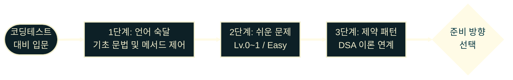
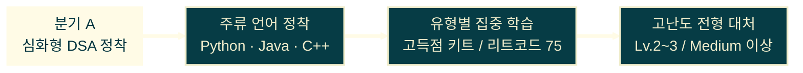
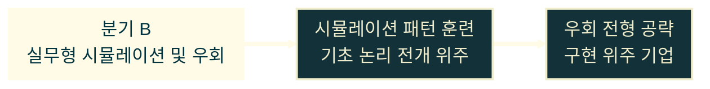

# DSA

---
layout: default
---

## 학습 체크리스트

- [ ] 코딩테스트의 두 핵심 평가 축(정확성·효율성) 이해 및 DSA·PS 개념 구분
- [ ] 자바스크립트 코딩테스트 응시의 장단점과 언어 전환 고려 기준 파악
- [ ] 언어 숙달 → 문제 도전 → 심화 DSA 분기까지의 단계별 준비 흐름 파악
- [ ] 로드맵·교재·필수 문제·추가 문제 단계별 핵심 리소스 인지

---
layout: default
---

## 코딩테스트의 두 핵심 축

> **정확성 · 효율성 (Correctness · Efficiency)**
>
> 알고리즘 평가는 모든 입력에서 정답을 내는 정확성과, 제한 시간·메모리 안에 연산을 끝내는 효율성으로 구성됨

<br>

* **정확성**: 경계값·예외 입력 포함 모든 케이스에서 정답 출력
* **효율성**: 시간·메모리 제한(예: 1초, 128MB) 이내 연산 종료
* **DSA** (Data Structures & Algorithms): 데이터를 가공·저장하는 구조와 이를 활용한 문제 해결 절차의 총칭
* **PS** (Problem Solving): 실무·학문 영역에서 DSA를 적용한 문제 해결 역량을 지칭하는 용어

---
layout: default
---

## 코딩테스트 준비 적기

> **학습 집중도가 가장 높은 진입 시점**
>
> 기초 자료구조(`Array`, `Map`, `Set`) 학습 직후, 외부 프레임워크 진입 이전

<br>

* **자료구조 연계 가능**: 제약 조건에 맞는 자료구조 매칭 훈련 시작 가능 시점
* **제어 흐름 기반 확보**: 조건 분기·반복문 숙지 상태로 다중 루프 최적화 접근 가능
* **학습 집중도 확보**: 서버·DB·보안 등 대형 스택 학습 이전이므로 알고리즘 단독 집중 가능

---
layout: default
---

## JS 코딩테스트의 득실

> **JavaScript는 웹 직군 지원에 유리하나 핵심 자료구조를 직접 구현해야 함**

<br>

* **내장 라이브러리 부재**: `Queue`, `Stack`, `Priority Queue`, `Linked List` 등 직접 구현 필요
* **웹 직군 응시 시 유리**: Node.js·프런트엔드·풀스택 직군은 JS 응시로 언어 최적화 실력 어필 가능
* **타 언어 전환 고려 기준**: 고난도 알고리즘 전형(주요 포털·대기업 시스템 직군) 목표 시 Python·C++·Java 등 표준 라이브러리 지원 언어 선택지로 검토

---
layout: default
---

## Java의 빌트인 Queue 선언

```java
import java.util.LinkedList;
import java.util.Queue;

public class Main {
    public static void main(String[] args) {
        Queue<String> q = new LinkedList<>();
        q.offer("이름");
        q.offer("이메일");
        System.out.println(q.poll()); // "이름" — O(1) 추출
    }
}
```

---
layout: default
---

## JS의 `Array.shift()` 성능 문제

> **`Array.shift()`의 $O(N)$ 문제**
>
> 배열에서 맨 앞 요소를 꺼낼 때 뒤따르는 모든 요소의 인덱스를 재정렬하여 선형 시간이 발생

<br>

* **`Array.shift()`**: 호출할 때마다 배열 전체를 한 칸씩 앞으로 당기므로 $O(N)$ 부하 발생
* **Object 기반 설계**: 숫자 키(`head`, `tail`)로 포인터만 이동하면 $O(1)$ 추출 실현 가능

---
layout: default
---

## FastQueue: 내부 필드 및 enqueue 선언

```javascript
class FastQueue {
  #storage = {};
  #head = 0;
  #tail = 0;

  enqueue(item) {
    this.#storage[this.#tail++] = item; // O(1) 삽입
  }
```

---
layout: default
---

## FastQueue: dequeue 및 size 선언

```javascript
  dequeue() {
    if (this.size === 0) return undefined;
    const item = this.#storage[this.#head];
    delete this.#storage[this.#head++]; // 메모리 정리
    return item; // O(1) 추출
  }

  get size() { return this.#tail - this.#head; }
}
```

---
layout: default
---

## FastQueue 동작 확인

```javascript
const q = new FastQueue();
q.enqueue("이름");
q.enqueue("이메일");

console.log(q.dequeue()); // "이름"  — O(1) 추출
console.log(q.size);      // 1
```

---
layout: default
---

## 코딩테스트 준비 단계

> **언어 숙달 → 쉬운 문제 해결 → DSA 이론 연계 → 방향 분기 선택**

<br>

* **1단계**: 기초 문법 및 메서드 제어 (언어 숙달)
* **2단계**: 프로그래머스 Lv.0~1 / 리트코드 Easy 도전
* **3단계**: 제약 패턴 인식 및 DSA 이론 연계
* **분기 A (심화형)**: Python·Java·C++ 정착 → 유형별 집중 학습 → 고난도 전형 대처
* **분기 B (실무형)**: 시뮬레이션 패턴 훈련 → 구현 위주 기업 우회 전형 공략

---
layout: default
---

## 준비 절차

> **언어 숙달 → 쉬운 문제 해결 → DSA 이론 연계 → 분기 선택**



---
layout: default
---

## 심화 DSA 대비



고난도 알고리즘 전형을 목표로 언어와 자료구조·알고리즘 유형을 깊게 다지는 경로

---
layout: default
---

## 실무/우회 대비



구현력 중심 기업이나 과제형 전형에 맞춰 시뮬레이션·문제 해석 훈련을 강화하는 경로

---
layout: default
---

## 학습 추천 순서 (A → D)

> **로드맵 확인 → 교재 개념 정립 → 필수 문제 풀이 → 추가 문제 반복**

<br>

| 단계 | 목적 | 대표 리소스 |
|:----:|------|------------|
| **A** | 얼마나, 어느 순서로 | SW마에스트로 기준표, roadmap.sh DSA |
| **B** | 교재 개념 정립 | 바킹독, Hello-Algo|
| **C** | 필수 문제 풀이 | 프로그래머스 고득점 키트, 리트코드 75 |
| **D** | 추가 문제 반복 | SWEA, 현대 NGV |

---
layout: two-cols-header
---

## 단계별 핵심 리소스 (A · B)

::left::

**[A] 얼마나, 어느 순서로**

  * [SW마에스트로 기초/심화 코딩테스트 기준표](https://swmaestro.ai/sw/main/notifyMentee.do?menuNo=200091)
  * 국내
    * [소프티어(Softeer) 로드맵](http://web.archive.org/web/20241005131540/https://softeer.ai/class/roadmap)
    * [코드트리 101 커리큘럼](https://www.codetree.ai/ko/trails/complete/dashboard/codetree-101)
  * 해외
    * [알고마스터 DSA 코스](https://algomaster.io/learn/dsa/course-roadmap)
    * [roadmap.sh DSA 로드맵](https://roadmap.sh/datastructures-and-algorithms)

::right::

**[B] 교재**

* 국내
  * [SWEA 코스](https://swexpertacademy.com/main/learn/course/courseList.do)
  * [바킹독](https://github.com/encrypted-def/basic-algo-lecture)
* 해외
  * [Hello-Algo](https://www.hello-algo.com/en/chapter_hello_algo/)

---
layout: two-cols-header
---

## 단계별 핵심 리소스 (C · D)

::left::

**[C] 필수 문제**

* [프로그래머스 고득점 키트](https://school.programmers.co.kr/learn/challenges?tab=algorithm_practice_kit)
* [프로그래머스 카카오 기출문제](https://school.programmers.co.kr/learn/challenges?order=recent&page=1&partIds=94316%2C94315%2C58464%2C37527%2C31236%2C25448%2C20069%2C17214%2C12286%2C9317%2C22586%2C18498%2C17931%2C300%2C301)
* [리트코드 75 스터디 플랜](https://leetcode.com/studyplan/leetcode-75/)
* [리트코드 Top Interview 150](https://leetcode.com/studyplan/top-interview-150/)

::right::

**[D] 더 많은 문제**

* [SWEA](https://swexpertacademy.com/main/code/problem/problemList.do)
* [현대 NGV](https://exam.hyundai-ngv.com/practice?type=ALGORITHM&page=0)
* [코드트리 기출문제](https://www.codetree.ai/ko/frequent-problems)
