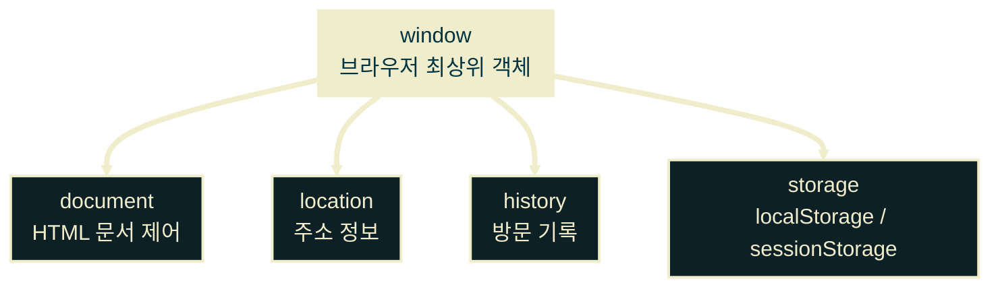
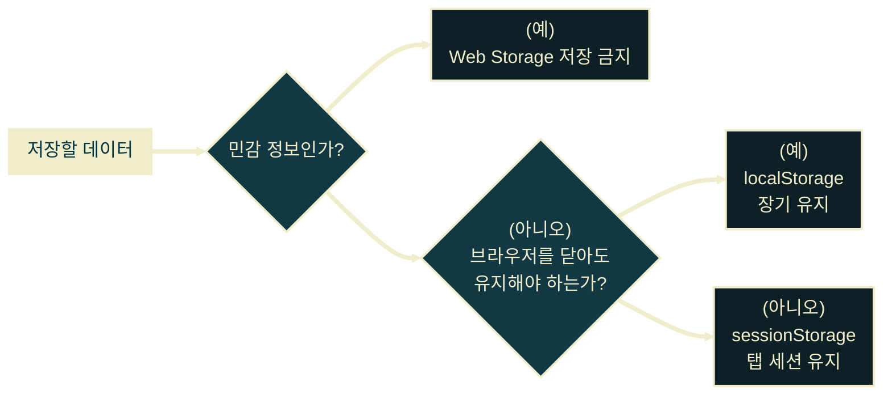
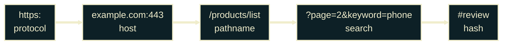
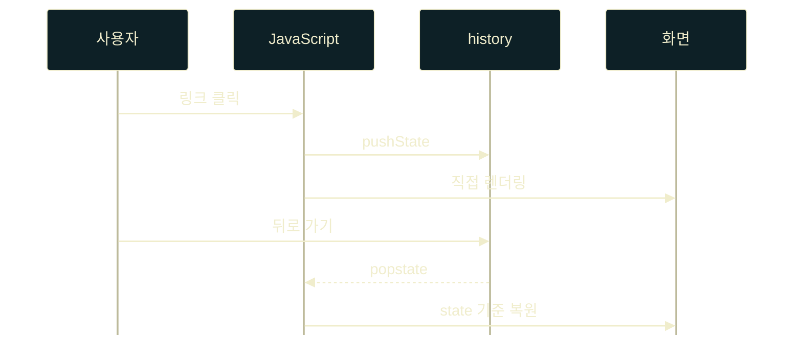

# Browser Object Model

---
layout: default
---

## 학습 체크리스트 (1/3)

- [ ] BOM의 역할: 브라우저 실행 환경 제어
- [ ] DOM과 BOM의 차이 구분
- [ ] `window` 객체의 전역 객체 특성 이해
- [ ] 브라우저 전역 객체와 Node.js 전역 객체 비교

---
layout: default
---

## 학습 체크리스트 (2/3)

- [ ] 타이머 API 사용: `setTimeout`, `setInterval`
- [ ] 대화창 API 사용: `alert`, `confirm`, `prompt`
- [ ] Web Storage 구분: `localStorage`, `sessionStorage`
- [ ] Clipboard API의 비동기 처리와 보안 제약 이해

---
layout: default
---

## 학습 체크리스트 (3/3)

- [ ] URL 구성 요소 구분: scheme, host, port, path, query, fragment
- [ ] History API 사용: `back`, `forward`, `pushState`, `popstate`

---
layout: default
---

## BOM이란?

> **브라우저 객체 모델 (Browser Object Model)**
>
> JavaScript가 브라우저의 창, 주소, 방문 기록, 저장소 같은 실행 환경 기능을 제어하도록 제공하는 객체 묶음

- **제어 대상**: 웹 페이지 바깥의 브라우저 기능
- **대표 객체**: `window`, `location`, `history`, `navigator`, `localStorage`
- **사용 목적**: 주소 이동, 저장소 사용, 타이머 실행, 권한 기반 기능 호출

---
layout: default
---

## DOM과 BOM의 기준점

- **DOM**: HTML 문서의 구조, 내용, 스타일을 다루는 모델
- **BOM**: 브라우저 탭과 실행 환경을 다루는 모델
- **핵심 관계**: `document`는 브라우저 최상위 객체인 `window` 아래에 있음
- **구분 기준**: 문서 자체를 바꾸면 DOM, 브라우저 환경을 제어하면 BOM

---
layout: default
---

## DOM과 BOM의 포함 관계



---
layout: default
---

## window와 하위 객체 확인

```javascript
console.log(window.document === document); // true
console.log(window.location === location); // true
console.log(window.history === history); // true
```

---
layout: default
---

## 전역 객체 window

> **윈도우 객체 (window)**
>
> 브라우저 탭 또는 창 하나를 대표하며, 브라우저 JavaScript의 전역 객체 역할을 하는 최상위 객체

- **탭 단위 객체**: 탭마다 독립된 `window`가 존재
- **BOM의 입구**: 주소, 기록, 저장소, 타이머 API에 접근
- **접두사 생략**: `window.alert()`는 보통 `alert()`로 호출 가능

---
layout: default
---

## window 접두사 생략

```javascript
console.log(window.innerWidth);
console.log(innerWidth);

window.alert('window.를 붙여도 됩니다.');
alert('window.를 생략해도 됩니다.');
```

---
layout: default
---

## 전역 변수와 window

- **`var` 전역 선언**: `window`의 프로퍼티로 등록됨
- **`let`, `const` 전역 선언**: 전역 스코프에는 있지만 `window` 프로퍼티가 아님
- **실무 권장**: 전역 변수 자체를 최소화하고 모듈 스코프를 사용
- **학습 포인트**: 오래된 코드에서 `var`와 `window`가 엮이는 이유 이해

---
layout: default
---

## var와 let/const의 전역 등록 차이

```javascript
var legacyName = 'var 변수';
let modernName = 'let 변수';
const appVersion = '1.0.0';

console.log(window.legacyName); // 'var 변수'
console.log(window.modernName); // undefined
console.log(window.appVersion); // undefined
```

---
layout: default
---

## 브라우저와 Node.js 전역 객체

- **브라우저**: 전역 객체는 `window`
- **Node.js**: 전역 객체는 `global`
- **공통 표준 접근**: 두 환경 모두 `globalThis` 사용 가능
- **환경 차이**: 브라우저에는 DOM과 BOM, Node.js에는 파일 시스템과 프로세스 API가 중심

---
layout: default
---

## globalThis로 환경 차이 보기

```javascript
// 브라우저
console.log(globalThis === window); // true
console.log(window.document);

// Node.js
console.log(globalThis === global); // true
console.log(global.process);
```

---
layout: default
---

## 타이머 API의 역할

> **타이머 API (Timer API)**
>
> 일정 시간이 지난 뒤 함수를 실행하거나, 일정한 간격으로 함수를 반복 실행하게 해 주는 브라우저 API

- **`setTimeout`**: 지정 시간 뒤 콜백을 1회 실행
- **`setInterval`**: 지정 시간 간격으로 콜백을 반복 실행
- **시간 단위**: 지연 시간은 밀리초(ms)로 지정

---
layout: default
---

## setTimeout 예약과 취소

```javascript
const timeoutId = setTimeout(() => {
  console.log('1초 뒤 실행');
}, 1000);

clearTimeout(timeoutId);
```

---
layout: default
---

## setInterval 반복과 중단

```javascript
let count = 0;

const intervalId = setInterval(() => {
  count += 1;
  console.log(`${count}회 실행`);
}, 2000);

clearInterval(intervalId);
```

---
layout: default
---

## 대화창 API의 특징

- **`alert`**: 사용자에게 단순 안내 메시지 표시
- **`confirm`**: 확인 또는 취소 선택을 받아 `boolean` 반환
- **`prompt`**: 텍스트 입력을 받아 문자열 또는 `null` 반환
- **주의점**: 사용자가 응답하기 전까지 코드 흐름이 멈춤

---
layout: default
---

## 기본 대화창 호출

```javascript
alert('저장이 완료되었습니다.');

const agreed = confirm('정말 삭제하시겠습니까?');
console.log(agreed);

const nickname = prompt('닉네임을 입력하세요.', 'guest');
console.log(nickname);
```

---
layout: default
---

## Web Storage의 역할

> **웹 스토리지 (Web Storage)**
>
> 브라우저가 같은 출처 단위로 문자열 키-값 데이터를 저장하도록 제공하는 간단한 저장소 API

- **저장 형태**: 키와 값 모두 문자열
- **전송 방식**: 쿠키와 달리 서버로 자동 전송되지 않음
- **분리 기준**: 프로토콜, 도메인, 포트가 같은 출처 단위

---
layout: default
---

## 저장소 선택 기준



---
layout: default
---

## Storage 공통 메서드

- **`setItem(key, value)`**: 데이터 저장
- **`getItem(key)`**: 데이터 조회
- **`removeItem(key)`**: 특정 데이터 삭제
- **`clear()`**: 전체 데이터 삭제

---
layout: default
---

## Storage 기본 조작

```javascript
localStorage.setItem('theme', 'dark');

const theme = localStorage.getItem('theme');
console.log(theme);

localStorage.removeItem('theme');
localStorage.clear();
```

---
layout: default
---

## localStorage와 sessionStorage

- **`localStorage`**: 브라우저를 닫아도 데이터가 유지됨
- **`sessionStorage`**: 현재 탭 세션 동안만 데이터가 유지됨
- **새로고침**: 두 저장소 모두 새로고침 후에도 유지
- **탭 공유**: `sessionStorage`는 새 탭과 공유되지 않음

---
layout: default
---

## localStorage에 환경설정 저장

```javascript
localStorage.setItem('theme', 'dark');

const theme = localStorage.getItem('theme');
console.log(theme); // 'dark'
```

---
layout: default
---

## sessionStorage에 탭 상태 저장

```javascript
sessionStorage.setItem('currentStep', '2');

const step = sessionStorage.getItem('currentStep');
console.log(step); // '2'
```

---
layout: default
---

## 객체 저장은 JSON 변환

- **문제**: Web Storage는 객체와 배열을 그대로 저장하지 못함
- **저장 전 처리**: `JSON.stringify`로 문자열 변환
- **조회 후 처리**: `JSON.parse`로 다시 객체 복원
- **주의점**: 저장된 값이 없으면 `null`이므로 파싱 전에 확인 필요

---
layout: default
---

## 객체를 문자열로 저장하고 복원

```javascript
const user = { id: 1, name: 'Kim', role: 'admin' };

localStorage.setItem('user', JSON.stringify(user));

const rawUser = localStorage.getItem('user');
const savedUser = JSON.parse(rawUser);

console.log(savedUser.name); // 'Kim'
```

---
layout: default
---

## Web Storage 보안 주의

- **저장 금지**: 비밀번호, 인증 토큰, 주민등록번호, 결제 정보
- **위험 이유**: XSS 공격이 발생하면 JavaScript로 저장소 접근 가능
- **판단 기준**: 노출되면 계정 탈취나 금전 피해로 이어지는 값은 저장하지 않음
- **실무 방향**: 민감 정보는 서버와 보안 쿠키 정책으로 다룸

---
layout: default
---

## Clipboard API의 역할

> **클립보드 API (Clipboard API)**
>
> 사용자의 클립보드에 텍스트를 쓰거나 클립보드의 텍스트를 읽도록 제공되는 비동기 브라우저 API

- **접근 경로**: `navigator.clipboard`
- **처리 방식**: Promise 기반 비동기 API
- **보안 제약**: HTTPS, 사용자 동작, 권한 정책의 영향을 받음

---
layout: default
---

## 클릭 후 텍스트 복사

```javascript
const copyButton = document.querySelector('#copy-btn');

copyButton.addEventListener('click', async () => {
  await navigator.clipboard.writeText('복사할 텍스트');
  console.log('복사 완료');
});
```

---
layout: default
---

## 클립보드 읽기 실패 처리

```javascript
const pasteButton = document.querySelector('#paste-btn');

pasteButton.addEventListener('click', async () => {
  try {
    const text = await navigator.clipboard.readText();
    console.log(text);
  } catch (error) {
    console.error('읽기 실패:', error);
  }
});
```

---
layout: default
---

## location과 URL의 차이

- **`location`**: 현재 브라우저 주소창을 나타내는 객체
- **`URL`**: URL 문자열을 분석하고 조립하기 위한 객체
- **이동 제어**: `location.href` 변경은 실제 페이지 이동을 발생시킴
- **문자열 처리 대체**: 쿼리 조작은 `split`보다 `URLSearchParams`가 안전함

---
layout: default
---

## URL 기본 구조

```text
https://example.com:443/products/list?page=2&keyword=phone#review
```



---
layout: default
---

## URL 구성 요소 이름

- **scheme / protocol**: `https:`
- **host**: `example.com:443`
- **hostname**: `example.com`
- **port**: `443`
- **path / pathname**: `/products/list`

---
layout: default
---

## URL 뒤쪽 구성 요소

- **query / search**: `?page=2&keyword=phone`
- **fragment / hash**: `#review`
- **origin**: `https://example.com`
- **기억 기준**: 앞쪽은 접속 위치, 뒤쪽은 페이지 안에서 필요한 조건과 위치

---
layout: default
---

## location 구성 요소 조회

```javascript
console.log(location.href);
console.log(location.protocol);
console.log(location.host);
console.log(location.pathname);
console.log(location.search);
console.log(location.hash);
```

---
layout: default
---

## URL 객체로 쿼리 다루기

```javascript
const url = new URL('https://example.com/products?page=2');

console.log(url.pathname); // '/products'
console.log(url.searchParams.get('page')); // '2'

url.searchParams.set('page', '3');
url.searchParams.append('sort', 'price');
```

---
layout: default
---

## History API의 역할

> **히스토리 API (History API)**
>
> 브라우저의 방문 기록을 이동하거나, 새로고침 없이 주소와 화면 상태를 맞추기 위해 사용하는 API

- **기본 이동**: 뒤로 가기, 앞으로 가기, 상대 위치 이동
- **SPA 활용**: 화면은 JavaScript가 바꾸고 URL만 기록에 반영
- **상태 저장**: 히스토리 항목마다 작은 상태 객체를 함께 저장 가능

---
layout: default
---

## SPA에서 History API가 하는 일



---
layout: default
---

## 기본 이동 메서드

- **`history.back()`**: 뒤로 한 칸 이동
- **`history.forward()`**: 앞으로 한 칸 이동
- **`history.go(-1)`**: 뒤로 한 칸 이동
- **`history.go(1)`**: 앞으로 한 칸 이동

---
layout: default
---

## 버튼으로 뒤로 가기

```javascript
const backButton = document.querySelector('#back-btn');

backButton.addEventListener('click', () => {
  history.back();
});
```

---
layout: default
---

## pushState의 핵심

- **문법**: `history.pushState(state, title, url)`
- **동작**: 새 히스토리 항목을 추가하고 주소를 변경
- **새로고침 없음**: 페이지 요청 없이 주소만 바뀜
- **중요한 주의**: `pushState`만 호출해도 화면은 자동으로 바뀌지 않음

---
layout: default
---

## 새 히스토리 항목 추가

```javascript
history.pushState(
  { page: 'profile', userId: 7 },
  '',
  '/users/7'
);

renderProfile(7);
```

---
layout: default
---

## replaceState의 핵심

- **문법**: `history.replaceState(state, title, url)`
- **동작**: 현재 히스토리 항목을 새 값으로 교체
- **차이점**: 뒤로 가기 기록을 하나 더 만들지 않음
- **활용**: 로그인 리다이렉트 후 임시 쿼리스트링 제거

---
layout: default
---

## 현재 히스토리 항목 교체

```javascript
history.replaceState(
  { page: 'home' },
  '',
  '/home'
);
```

---
layout: default
---

## popstate 이벤트

- **발생 시점**: 사용자가 뒤로 가기 또는 앞으로 가기를 실행할 때
- **코드 이동**: `history.back()`, `forward()`, `go()` 호출 시에도 발생
- **확인 정보**: `event.state`에서 저장했던 상태 객체 확인
- **주의점**: `pushState` 호출 자체는 `popstate`를 발생시키지 않음

---
layout: default
---

## popstate로 화면 복원

```javascript
window.addEventListener('popstate', (event) => {
  console.log('히스토리 이동:', event.state);

  if (event.state?.page === 'profile') {
    renderProfile(event.state.userId);
  }
});
```
