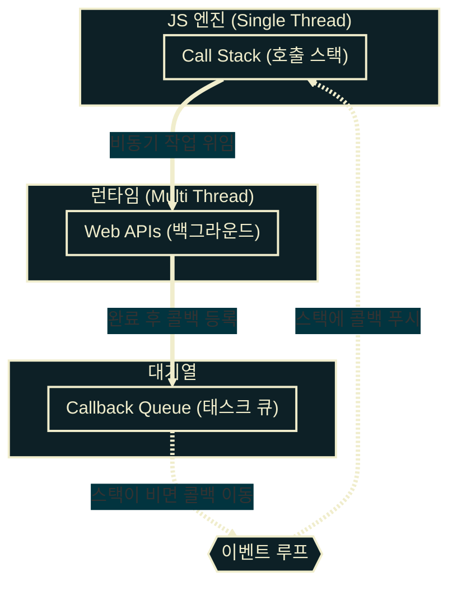

# JavaScript Callback

---
layout: default
---

## 학습 체크리스트 (1/2)

- [ ] 동기(Synchronous)와 비동기(Asynchronous) 차이 및 비동기 처리의 필요성 이해
- [ ] 일급 객체(First-Class Object) 특성을 활용한 콜백(Callback) 함수 구현 및 제어
- [ ] `setTimeout` / `setInterval` 등 Timer API의 예약 및 해제 기법 숙지

---
layout: default
---

## 학습 체크리스트 (2/2)

- [ ] Call Stack, Web APIs, Task Queue, Event Loop 간의 협업 메커니즘 이해
- [ ] 콜백 헬(Callback Hell)의 문제점 및 비동기 스택 내 예외 처리(Error Handling) 한계 인지

---
layout: default
---

## 동기(Sync) vs 비동기(Async) 개요

> **싱글 스레드와 비동기**
>
> 자바스크립트는 싱글 스레드(Single Thread) 언어로, 한 번에 하나의 작업만 수행할 수 있습니다. 단일 스레드의 한계를 극복하기 위해 **비동기 처리**가 필수적입니다.

- **동기 (Synchronous)**: 요청한 작업 완료 시까지 제어권을 점유(Blocking)하여 대기하는 방식
- **비동기 (Asynchronous)**: 요청 작업 완료 여부와 무관하게 제어권을 즉시 반환(Non-blocking)하는 방식

---
layout: default
---

## 동기 (Synchronous)

> **동기 (Synchronous)**
>
> 요청한 작업이 완료될 때까지 실행 흐름의 제어권을 독점(Blocking)하여 대기하는 방식

- **순차 실행**: 앞의 작업이 완전히 종료된 후 다음 작업을 순차적으로 실행함
- **비유**: 카페에서 앞사람의 음료가 나올 때까지 다음 사람의 주문을 대기시키는 방식
- **동작 방식**: 함수가 실행되는 동안 제어권은 계속 해당 함수에 붙잡혀 있음

---
layout: default
---

## 비동기 (Asynchronous)

> **비동기 (Asynchronous)**
>
> 요청 작업 완료 여부와 무관하게 제어권을 즉시 반환(Non-blocking)하여 다음 코드를 실행하는 방식

- **위임 실행**: 다음 작업을 바로 수행하며, 완료된 작업은 추후 통보받음
- **비유**: 카페 주문 후 진동벨(콜백 함수)을 받아 자리에서 대기하는 방식
- **동작 방식**: 무거운 작업은 백그라운드에 인계하고 제어권은 즉각 복귀함

---
layout: default
---

## 동기 vs 비동기 흐름도

```mermaid
---
config:
  themeVariables:
    lineColor: "#F0EDCC"
    actorBkg: "#0d2026"
    actorBorder: "#F0EDCC"
    actorTextColor: "#F0EDCC"
    signalColor: "#F0EDCC"
    signalTextColor: "#F0EDCC"
    activationBkgColor: "#123943"
    activationBorderColor: "#F0EDCC"
  sequence:
    actorMargin: 48
    messageMargin: 36
    mirrorActors: false
---
sequenceDiagram
    autonumber
    rect rgb(18, 57, 67)
    Note over Sync: 동기(Sync): 작업 A 완료 후 B 실행
    Sync->>Call Stack: 작업 A 실행 (Blocking)
    Call Stack-->>Sync: 작업 A 완료
    Sync->>Call Stack: 작업 B 실행
    Call Stack-->>Sync: 작업 B 완료
    end

    rect rgb(13, 32, 38)
    Note over Async: 비동기(Async): 작업 A 위임 후 즉시 B 실행
    Async->>Web API: 작업 A 위임 (Non-blocking)
    Async->>Call Stack: 작업 B 실행
    Web API-->>Callback Queue: 작업 A 완료 콜백 적재
    Event Loop-->>Call Stack: 스택이 비면 콜백 A 실행
    end
```



---
layout: default
---

## 콜백 함수 (Callback)

> **콜백 함수 (Callback Function)**
>
> 다른 함수의 인자(Argument)로 전달되어, 특정 이벤트나 조건 충족 시 시스템에 의해 역호출(Call back)되는 함수

- **일급 객체 특성**: 자바스크립트에서 함수는 변수 할당, 인자 전달, 반환이 모두 가능한 일급 객체임
- **콜백 지원**: 일급 객체라는 기반 특성 덕분에 자바스크립트에서는 콜백 패턴이 자연스럽게 지원됨

---
layout: default
---

## 1. 동기 콜백 (Synchronous Callback)

- **즉시 실행**: 호출 즉시 동기적으로 실행되며 별도의 스케줄링을 거치지 않음
- **블로킹 동작**: 콜백 실행이 완전히 종료될 때까지 다음 코드의 실행을 정지(Blocking)시킴
- **용도**: 배열 고차 함수(`map`, `filter`) 등 연산 결과를 즉시 반환해야 하는 작업에 쓰임

---
layout: default
---

## greetUser 동기 함수 정의

```javascript
function greetUser(userName, callback) {
  console.log(`[시작] ${userName}님 환영합니다.`);
  callback(); // 즉시 동기적 실행
  console.log(`[종료] 인사말 출력이 끝났습니다.`);
}
```

---
layout: default
---

## greetUser 동기 호출과 실행 흐름

```javascript
greetUser('Brendan', () => {
  console.log(' -> 반갑습니다! 오늘 배울 내용은 Callback입니다.');
});

// [출력 순서]
// 1. [시작] Brendan님 환영합니다.
// 2.  -> 반갑습니다! 오늘 배울 내용은 Callback입니다.
// 3. [종료] 인사말 출력이 끝났습니다.
```

---
layout: default
---

## 2. 비동기 콜백 (Asynchronous Callback)

- **백그라운드 위임**: 호출 즉시 실행되지 않고 브라우저/런타임 백그라운드 영역에 인계됨
- **논블로킹 동작**: 특정 조건(시간 경과, 이벤트 발생) 충족 시 비동기적으로 실행됨
- **용도**: 타이머 예약, 네트워크 통신, 사용자 입력 감지 등 대기가 발생하는 모든 작업에 필수적임

---
layout: default
---

## greetUserAsync 비동기 함수 정의

```javascript
function greetUserAsync(userName, callback) {
  console.log(`[시작] ${userName}님 환영합니다.`);
  setTimeout(callback, 1000); // 1초 뒤 실행 위임 (비동기)
  console.log(`[종료] 제어권이 즉시 반환되었습니다.`);
}
```

---
layout: default
---

## greetUserAsync 비동기 호출과 실행 흐름

```javascript
greetUserAsync('Ryan', () => {
  console.log(' -> 1초 뒤 호출된 비동기 콜백입니다!');
});

// [출력 순서]
// 1. [시작] Ryan님 환영합니다.
// 2. [종료] 제어권이 즉시 반환되었습니다.
// 3. (1초 대기 후)  -> 1초 뒤 호출된 비동기 콜백입니다!
```

---
layout: default
---

## Timer API 개요

> **타이머 API (Timer API)**
>
> 브라우저 및 Node.js 런타임 환경에서 비동기 타이머를 조작하기 위해 제공하는 호스트 환경 기본 API

- **`setTimeout(callback, delay)`**: 지정된 밀리초(ms) 후에 콜백 함수를 단 **1회** 실행
- **`clearTimeout(timerId)`**: 대기열에 등록된 `setTimeout` 예약을 명시적으로 취소
- **`setInterval(callback, delay)`**: 지정된 밀리초(ms) 간격으로 콜백 함수를 **주기적으로 반복** 실행
- **`clearInterval(timerId)`**: 실행 중인 `setInterval` 반복 작업을 영구 중지

---
layout: default
---

## 단발성 타이머 예약 및 해제

```javascript
const timerId = setTimeout(() => {
  console.log('실행되지 않는 메시지');
}, 2000);

clearTimeout(timerId); // 타이머 취소
```

---
layout: default
---

## 주기적 타이머 반복 및 해제

```javascript
let count = 0;
const intervalId = setInterval(() => {
  count++;
  console.log(`${count}초 경과`);
  if (count === 3) {
    clearInterval(intervalId); // 반복 해제
  }
}, 1000);
```

---
layout: default
---

## 이벤트 루프 (Event Loop) 개요

- **핵심 질문**: 자바스크립트는 싱글 스레드인데 어떻게 논블로킹 비동기 멀티태스킹이 가능할까?
- **해결 원리**: 자바스크립트 엔진과 런타임(브라우저 / Node.js) 환경의 **다중 영역 협업**을 통해 처리함
- **작동 지표**: 런타임의 이벤트 루프가 엔진 내부 호출 스택의 비어있음 상태를 추적하여 작업을 이관함

---
layout: default
---

## 이벤트 루프 아키텍처



---
layout: default
---

## 이벤트 루프 구성요소

- **Call Stack (호출 스택)**
  - 현재 실행 중인 동기 코드와 함수 호출 실행 컨텍스트를 기록하는 스택 (LIFO)
- **Web APIs (Background)**
  - 브라우저/런타임 제공 멀티 스레드 영역. 비동기 작업(`setTimeout`, HTTP 요청 등)이 대기/수행됨
- **Callback Queue (Task Queue)**
  - Web API에서 비동기 처리가 종료된 후 넘어온 콜백 함수들이 대기하는 큐 (FIFO)
- **Event Loop (이벤트 루프)**
  - Call Stack의 비어있음 여부를 지속 감시함. 스택이 비면 Callback Queue의 콜백을 스택으로 이동시킴

---
layout: default
---

## 지연 시간 0ms 타이머의 실행

- **실행 순서**: 지연시간이 `0ms`이더라도 동기 코드가 전부 실행된 이후에 비동기 콜백이 처리됨
- **우선순위**: 이벤트 루프는 스택에 활성 실행 프레임이 단 하나라도 남아 있으면 큐에서 작업을 꺼내지 않음
- **구동 영향**: 브라우저는 화면 그리기를 방해하지 않으면서 무거운 연산을 뒤로 미룰 때 이 기법을 씀

---
layout: default
---

## 0ms 지연 타이머의 실행 흐름

```javascript
console.log('1. 시작');

setTimeout(() => {
  console.log('2. 타이머 콜백');
}, 0);

console.log('3. 끝');

// [출력 결과]
// 1. 시작 -> 3. 끝 -> 2. 타이머 콜백
```

---
layout: default
---

## 0ms 지연 타이머의 동작 단계

1. **`1. 시작` 출력**: `console.log('1. 시작')`이 호출 스택에 진입하여 실행된 후 제거됨
2. **타이머 위임**: `setTimeout(fn, 0)`이 스택에 진입하고, 비동기 `fn`을 Web APIs에 넘긴 뒤 제거됨
3. **대기열 등록**: Web APIs는 즉시 `fn`을 Callback Queue(대기열)에 등록함
4. **`3. 끝` 출력**: 동기 코드 `console.log('3. 끝')`이 스택에 진입하여 즉시 실행 및 제거됨
5. **루프 감지**: 이벤트 루프가 호출 스택이 완전히 비었음을 확인하고 큐의 `fn`을 스택으로 이동시킴
6. **`2. 타이머 콜백` 출력**: 스택으로 이관된 `fn`이 최종 작동하여 출력을 완료함

---
layout: default
---

## 콜백 헬 (Callback Hell)

> **콜백 헬 (Callback Hell)**
>
> 비동기 연쇄 처리를 위해 콜백 함수 내부에 또 다른 콜백을 무한 중첩하여 발생하는 가독성 및 유지보수성 저하 현상

- **피라미드 구조**: 과도한 들여쓰기로 코드의 시각적 분석과 디버깅 효율이 급감하는 형태 (Pyramid of Doom)
- **제어 오염**: 예외 처리와 로직 변경 시 각 계층별 스코프 결합으로 인해 구조 수정이 불가능해짐

---
layout: default
---

## 다중 비동기 호출의 콜백 중첩

```javascript
fetchUser('user123', (user) => {
  fetchPosts(user.id, (posts) => {
    fetchComments(posts[0].id, (comments) => {
      fetchLikes(comments[0].id, (likes) => {
        console.log(`최종 라이크 수: ${likes.count}`);
      });
    });
  });
});
```

---
layout: default
---

## 비동기 예외 처리의 구조적 한계

- **감지 불가능**: 비동기 콜백 내부에서 발생한 에러는 바깥쪽 동기식 `try-catch`문으로 잡아낼 수 없음
- **원인**: `try-catch` 블록은 동기 스택 프레임 내에서만 동작하며 실행 직후 메모리에서 제거됨
- **격리 호출**: 1초 뒤 트리거되는 타이머 콜백은 `try-catch` 소멸 이후 이벤트 루프에 의해 스택으로 단독 호출됨

---
layout: default
---

## 비동기 콜백 내 에러 발생과 예외

```javascript
try {
  setTimeout(() => {
    throw new Error('비동기 에러 발생!'); // (1) 에러 발생 시점
  }, 1000);
} catch (error) {
  console.error('에러 캐치 성공:', error.message); // (2) 작동 안 함
}
console.log('프로그램이 종료되지 않고 계속 실행될까요?'); // (3) 동기식 즉시 실행
```

---
layout: default
---

## 예외 처리 실패의 세부 원인

1. **감시 스코프 이탈**: `try-catch`와 하단 로그가 동기 스택에서 빠르게 먼저 평가되고 종료됨
2. **컨텍스트 제거**: 동기 실행 종료와 함께 호출 스택의 `try-catch` 프레임은 메모리에서 소멸함
3. **독립 스택 실행**: 1초 뒤 타이머가 만료되면 콜백 함수만 큐를 거쳐 스택으로 **단독 복구**되어 실행됨
4. **치명적 예외**: 감시할 주체가 없는 스택에서 터진 에러는 Uncaught Error가 되어 앱이 비정상 종료됨
