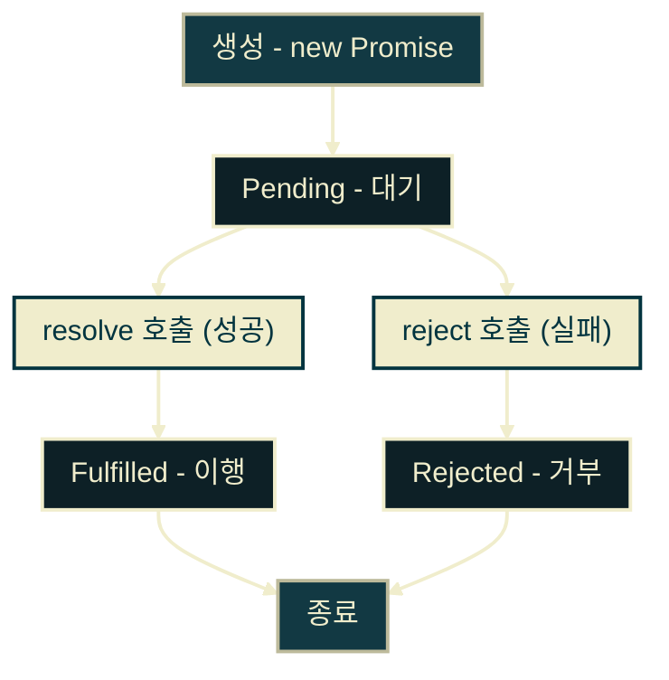
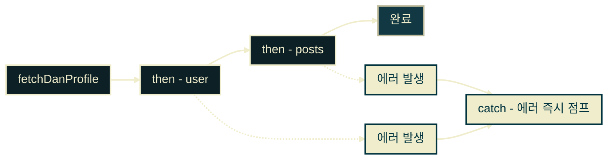
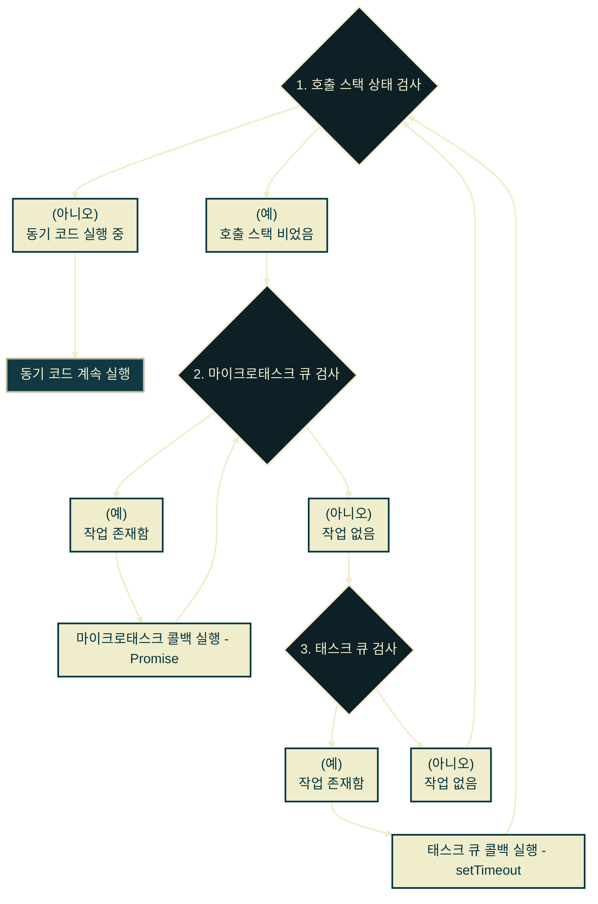

# JavaScript Promise

---
layout: default
---

## 학습 체크리스트 (1/2)

- [ ] 프로미스(Promise)의 핵심 정의 및 콜백 패턴 대비 장점 이해
- [ ] 프로미스의 3가지 상태(Pending, Fulfilled, Rejected) 개념 및 전이 과정 이해
- [ ] `.then()`, `.catch()`, `.finally()`를 활용한 프로미스 체이닝 구현

---
layout: default
---

## 학습 체크리스트 (2/2)

- [ ] 마이크로태스크 큐(Microtask Queue)와 태스크 큐의 실행 우선순위 차이 파악
- [ ] Promise 조합자(`all`, `allSettled`, `race`, `any`)의 기능 및 사용 기준 구분
- [ ] `async`/`await` 문법을 통한 비동기 코드의 동기식 흐름 전환 및 예외 처리 구현

---
layout: default
---

## 프로미스 (Promise) 개요

- **도입 배경**: 연속적인 비동기 작업을 작성할 때 발생하는 콜백 헬과 에러 핸들링 한계를 보완하기 위해 도입되었습니다.
- **상태 관리 표준**: 비동기 연산의 성공 혹은 실패 상태와 최종 결과 값을 표준적인 자바스크립트 객체 형식으로 다룰 수 있게 합니다.

---
layout: default
---

## 프로미스 (Promise) 정의

> **프로미스 (Promise)**
>
> 비동기 연산의 최종 완료 또는 실패, 그리고 그 결과 값을 나타내는 자바스크립트 표준 객체

- **객체 캡슐화**: 비동기 처리 상태를 일반적인 데이터 객체(값)로 캡슐화하여 전달 및 반환이 자유롭습니다.
- **선형 구조**: 중첩되어 들어가는 콜백 구조를 선형적 체이닝 구조(`.then()`)로 펴줍니다.
- **제어 일원화**: 흐름 제어와 비동기 에러 핸들링을 약속된 단일 인터페이스로 통제합니다.

---
layout: default
---

## Promise의 3가지 상태 (States)

> 프로미스는 인스턴스화되는 시점부터 비동기 처리 결과에 따라 다음과 같이 3가지의 명확한 상태 변화를 겪음.

| 상태 | 설명 | 상태 전이 조건 |
|:---:|---|---|
| **Pending (대기)** | 비동기 연산이 아직 처리 완료되지 않은 초기 상태 | `new Promise()` 호출 즉시 |
| **Fulfilled (이행)** | 비동기 연산이 성공적으로 완료되어 결과 값을 반환한 상태 | `resolve(value)` 호출 시 |
| **Rejected (거부)** | 비동기 연산 도중 에러 또는 실패가 발생한 상태 | `reject(error)` 호출 시 |

---
layout: default
---

## 프로미스 상태 전이도



---
layout: default
---

## 프로미스 생성과 소비

- **생성 단계**: `new Promise((resolve, reject) => { ... })` 빌더 형식을 사용해 비동기 환경을 명세합니다.
- **소비 단계**: 성공 시 반환되는 값은 `.then()`, 거부 시 전달되는 에러 객체는 `.catch()` 블록으로 나누어 소비합니다.
- **인스턴스 반환**: 생성된 프로미스는 변수에 담겨 평가가 완료될 때까지 비동기 상태를 보존합니다.

---
layout: default
---

## fetchDanProfile 프로미스 생성

```javascript
const fetchDanProfile = new Promise((resolve, reject) => {
  const success = true; // 비동기 성공 가정
  if (success) {
    resolve({ name: 'Dan', role: 'React Core' });
  } else {
    reject(new Error('네트워크 상태 불량'));
  }
});
```

---
layout: default
---

## fetchDanProfile 프로미스 소비

```javascript
fetchDanProfile
  .then(user => {
    console.log(`성공: ${user.name} (${user.role})`);
  })
  .catch(error => {
    console.error(`실패: ${error.message}`);
  });
```

---
layout: default
---

## 프로미스 체이닝 (Promise Chaining)

> **프로미스 체이닝 (Promise Chaining)**
>
> 연속적인 비동기 작업을 순차적으로 실행하기 위해 여러 개의 `.then()`을 일렬로 연결하는 기법

- **암묵적 생성**: 각 `.then()` 메서드는 명시적인 반환 값이 없더라도 항상 새로운 Promise 객체를 생성하여 반환합니다.
- **값의 이월**: 앞선 콜백에서 반환한 값은 자동으로 프로미스에 담겨 다음 `.then()`의 인자로 순차 전달됩니다.
- **에러 단일 통제**: 체인 도중 에러가 터지면 모든 단계를 생략하고 꼬리에 위치한 단 하나의 `.catch()`로 일괄 복귀합니다.

---
layout: default
---

## 프로미스 체이닝 흐름도



---
layout: default
---

## 프로미스 체이닝 예제


```javascript
fetchDanProfile
  .then(user => fetchPosts(user.name)) // 포스트 조회 Promise 반환 가정
  .then(posts => {
    console.log(`조회된 포스트: ${posts[0].title}`);
  })
  .catch(error => {
    console.error(`비동기 연쇄 작업 중 에러 감지: ${error.message}`);
  });
```

---
layout: default
---

## 마이크로태스크 큐 (Microtask Queue)

> **마이크로태스크 큐 (Microtask Queue)**
>
> 이벤트 루프가 관리하는 비동기 대기열 중 하나로, 일반 태스크 큐보다 실행 우선순위가 훨씬 높음

| 구분 | 마이크로태스크 큐 (Microtask Queue) | 태스크 큐 (Task Queue / Macrotask) |
|:---:|---|---|
| **실행 우선순위** | **최상위 (가장 먼저 처리)** | 일반 (마이크로태스크 대기열이 비면 처리) |
| **적재 대상** | `Promise.then / catch / finally` 콜백, `MutationObserver` | `setTimeout`, `setInterval`, 이벤트 리스너 등 |
| **이벤트 루프 제어** | 스택이 비면 큐에 있는 모든 콜백을 연속해서 다 비울 때까지 처리 | 한 번에 하나의 콜백만 스택으로 이동시켜 처리 |

---
layout: default
---

## 이벤트 루프와 큐 간의 스케줄링

- **호출 스택 감시**: 실행 엔진 내 호출 스택이 완전히 비는 순간 이벤트 루프가 가동을 개시합니다.
- **우선 비우기**: 이벤트 루프는 마이크로태스크 큐에 예약된 대기 콜백들을 **태스크 큐(setTimeout 등)보다 우선적으로 큐가 완전히 바닥날 때까지 차례대로 전부 실행**시킵니다.
- **지연 평가**: 마이크로태스크가 전부 해소되어야 비로소 태스크 큐의 콜백들이 스택으로 밀려 올라갑니다.

---
layout: default
---

## 이벤트 루프 스케줄링 흐름도



---
layout: default
---

## 매크로태스크와 마이크로태스크 혼합 코드


```javascript
console.log('1. 시작 (동기)');
setTimeout(() => {
  console.log('2. 태스크 큐 콜백 (setTimeout)');
}, 0);
Promise.resolve().then(() => {
  console.log('3. 마이크로태스크 콜백 (Promise)');
});
console.log('4. 끝 (동기)');
```

---
layout: default
---

## 큐 간의 실행 결과 및 순서

```javascript
// [출력 순서]
// 1. 시작 (동기)
// 4. 끝 (동기)
// 3. 마이크로태스크 콜백 (Promise)
// 2. 태스크 큐 콜백 (setTimeout)
```

- **구동 분석**:
  1. 동기 코드 `1`과 `4`가 즉각 스택에서 평가 완료됨
  2. 스택이 빈 시점에 우선순위가 높은 **마이크로태스크 큐**의 `3`이 먼저 트리거됨
  3. 모든 마이크로태스크가 비워진 후 **태스크 큐**의 `2`가 최종 이관되어 실행됨

---
layout: default
---

## 프로미스 조합자 (Combinators)

> **프로미스 조합자 (Combinators)**
>
> 복수의 비동기 작업을 병렬적으로 처리하거나, 서로 경쟁시켜 효율적으로 조율하기 위해 제공되는 내장 스태틱 API

- **동시성 제어**: 개별적으로 대기할 필요 없이 여러 비동기 연산을 묶어 동시에 트리거합니다.
- **요구 충족**: 상황에 맞게 전체 성공, 최초 성공, 혹은 전체 완료 결과를 유연하게 취득합니다.

---
layout: default
---

## 조합자 4종 비교 요약

| 조합자 API | 이행(Fulfilled) 조건 | 거부(Rejected) 조건 |
|---|---|---|
| **`Promise.all`** | **모든** 프로미스가 성공적으로 완료 시 | **하나라도** 거부(Rejected)되면 즉시 실패 반환 |
| **`Promise.allSettled`** | **모든** 프로미스 완료 시 (성공/실패 여부 무관) | 결코 거부되지 않음 (항상 결과 객체 배열 반환) |
| **`Promise.race`** | **가장 먼저** 완료된 프로미스 성공 시 | **가장 먼저** 완료된 프로미스 실패 시 |
| **`Promise.any`** | **가장 먼저** 이행(성공)된 프로미스 성공 시 | **모든** 프로미스가 전부 실패했을 시 (AggregateError) |

---
layout: default
---

## async / await 개요

> **async / await**
>
> ES8(ES2017)에서 도입되어, Promise의 비동기 작업을 동기식 절차형 코드와 일치하는 구조로 다룰 수 있게 해주는 문법 설탕(Syntactic Sugar)

- **순차 가독성**: 메서드 체이닝(`.then()`)마저 생략하고 완전히 아래로 떨어지는 직관적 제어를 지원합니다.
- **예외 통합**: 파편화되어 작성되던 에러 처리를 표준 동기식 `try-catch`문으로 흡수합니다.

---
layout: default
---

## async / await 사용 규칙

- **`async` 함수**
  - 비동기 로직이 들어가는 함수 선언부에 위치하며, 함수는 항상 Promise 인스턴스를 반환합니다.
- **`await` 구문**
  - 반드시 `async` 함수 내부에서만 사용 가능합니다.
  - Promise 객체 앞에서 작동하며, 프로미스가 해결 완료될 때까지 함수의 내부 제어권을 일시 정지(논블로킹 홀딩)합니다.
- **에러 핸들링**: `await`가 수행되는 구간을 표준 `try-catch` 블록으로 래핑합니다.

---
layout: default
---

## showDouglasProfile 비동기 처리

```javascript
async function showDouglasProfile() {
  try {
    const result = await fetchDouglasProfile(); // Promise 반환 가정
    console.log(`프로필: ${result.name} - ${result.author}`);
  } catch (error) {
    console.error(`에러 검출: ${error.message}`);
  }
}
showDouglasProfile();
```

---
layout: default
---

## 최상위 레벨 await 제약

- **Top-level await**: `async` 함수 래퍼 없이 문서 루트(최상단)에서 직접 `await`를 사용하는 기법입니다.
- **일반 스크립트의 오류**: 표준 스크립트 환경의 최상위 스코프에서는 `await` 단독 호출 시 `SyntaxError`를 유발합니다.
- **ES 모듈 요구 조건**: 브라우저 런타임에서 Top-level await를 동작시키려면 반드시 스크립트가 ES 모듈(`type="module"`) 타입으로 지정되어 실행되어야 합니다.

---
layout: default
---

## 일반 스크립트의 구문 오류

```html
<script>
  // SyntaxError: await is only valid in async functions
  const result = await fetchDouglasProfile(); 
</script>
```

---
layout: default
---

## ES 모듈 환경에서의 정상 동작

```html
<script type="module">
  // ES 모듈 내부 최상위 레벨에서는 await 사용이 전면 허용됨
  const result = await fetchDouglasProfile(); 
  console.log(result.name);
</script>
```

---
layout: default
---

## 비동기 처리의 진화 여정 요약

| 세대 | 기술 | 비동기 제어 및 에러 핸들링 특징 | 대표적 문제점 및 의의 |
|:---:|---|---|---|
| **1세대** | **Callback** | 함수 호출 파라미터로 동작 전달 / 내부 catch 어려움 | 콜백 헬(Pyramid of Doom), 예외 소실 |
| **2세대** | **Promise (ES6)** | `.then()` 선형 체인 연결 / `.catch()` 일괄 통제 | 객체 캡슐화를 통한 비동기 상태의 데이터화 |
| **3세대** | **async / await (ES8)** | `await`를 통한 동기식 흐름 / 동기 `try-catch` 적용 | 절차적 가독성과 안전성 극대화 (최종 형태) |
