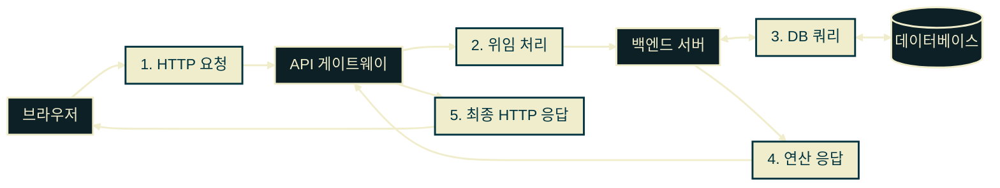
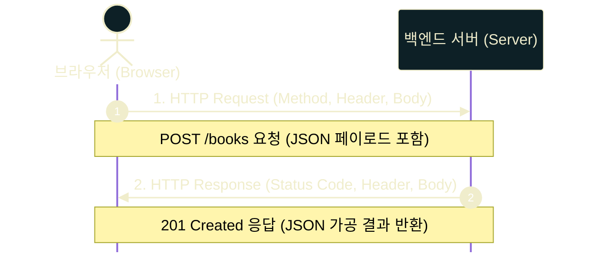
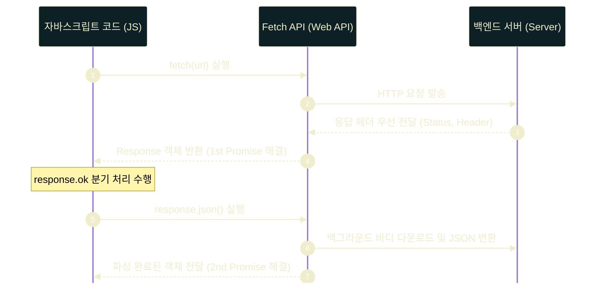

# JavaScript Fetch

---
layout: default
---

## 학습 체크리스트 (1/2)

- [ ] API 핵심 정의 및 프런트엔드/백엔드 관점의 차이 구분
- [ ] OpenAPI 명세서와 Open API(Public API) 서비스의 개념 구분 및 활용
- [ ] HTTP Request(요청) 및 Response(응답) 패킷 핵심 구성 요소 식별
- [ ] REST API 아키텍처 특성 및 CRUD 자원 제어 매핑 규칙 이해

---
layout: default
---

## 학습 체크리스트 (2/2)

- [ ] 웹 서비스 데이터 통신의 다양한 프로토콜(SOAP, GraphQL 등) 용도 구분
- [ ] AJAX 비동기 통신 아키텍처의 구동 메커니즘 및 7단계 프로세스 파악
- [ ] 1/2/3세대 AJAX(XHR, Fetch, Axios) 기술 진화 특징 및 단독 코드 구현
- [ ] Fetch API 2단계 Promise(Header 수신 $\rightarrow$ Body 파싱) 구조 해독

---
layout: default
---

## API 개요

> `API (Application Programming Interface)`
>
> 시스템 간 데이터 송수신을 위해 합의된 통신 규약 및 상호작용 매개 창구

- **역할 합의**: 약속된 전용 인터페이스를 매개로 안전하고 일관된 시스템 간 소통 보장
- **결합도 완화**: 내부 코드 의존성을 배제하고 데이터 레이어만으로 연동되는 분리 구조 제공

---
layout: default
---

## 프런트엔드와 백엔드의 API 관점

- **프런트엔드 (클라이언트) 관점**
  - 백엔드 제공 게이트웨이를 경유해 정적/동적 자원을 조회(GET) 및 조작(POST/PUT/DELETE)하기 위한 규약
- **백엔드 (서버) 관점**
  - DB 및 핵심 비즈니스 로직을 외부 공격으로부터 보호하며 일부 기능과 데이터만 정밀 제어하여 공유하는 도구

---
layout: default
---

## API 통신 아키텍처



---
layout: default
---

## OpenAPI vs Open API (or Public API)

- **띄어쓰기 여부에 따른 개념 분리**
  - `OpenAPI` (띄어쓰기 없음): 기술 표준 단위의 **API 명세(Specification) 규격**
  - `Open API` / `Public API` (띄어쓰기 있음): 대중 개방 목적의 **API 서비스 자체**
- **역할 및 지향점의 차이**
  - **OpenAPI**: API 구조 설계 표준안 및 문서 작성을 위한 기술적 약속
  - **Open API (Public API)**: 외부 개발자와의 데이터 연동을 지원하는 개방형 인터페이스

---
layout: default
---

## OpenAPI (API 설계 표준 명세)

> **OpenAPI (OpenAPI Specification)**
>
> API의 엔드포인트, 입력 매개변수, 출력 포맷 등을 기계와 인간이 모두 해독할 수 있는 형식으로 기술하는 개방형 표준 명세서 포맷 (구 Swagger 규격)

- **기계 가독성 (Machine-Readable)**: YAML/JSON 포맷 기술을 통한 소스 코드 및 문서 자동 생성 지원
- **설계 우선 개발 (API-First)**: 코드 구현 전 설계 명세 선정을 통한 클라이언트-서버 협업 효율 향상

---
layout: default
---

## Open API / Public API (개방형 API 서비스)

> **Open API (Open API / Public API)**
>
> 서비스 규약 및 데이터 연동 명세서를 일반 대중 또는 파트너사에게 공개하여 연동할 수 있도록 개방한 API 서비스

- **개념적 동일성**: 실무적 용어 혼용성 및 외부 생태계 대상의 기능/데이터 개방 구조
- **인가 및 비용 조건의 제약**:
  - 명세서 개방과 실제 호출 권한(인가) 및 비용 정산 간의 상호 독립성
  - 승인 심사, 인증 키 발급 의무, 트래픽 초과 시 유료 전환 가능성 상존

---
layout: default
---

## 대표적인 Open API (Public API) 안내처

- **네이버 개발자 센터**: [검색·지도·번역 API](https://developers.naver.com/main/) 연동 및 기술 지원
- **카카오 개발자 센터**: [로그인·메시지·지도 API](https://developers.kakao.com/) 인터페이스 제공
- **공공데이터포털**: 정부 및 공공기관 보유 데이터 통합 [공공 데이터 개방 창구](https://www.data.go.kr/)
- **public-apis-4Kr GitHub**: 국내 무료 활용 가능 API 정보 수집·공유 [저장소](https://github.com/yybmion/public-apis-4Kr)

---
layout: default
---

## HTTP Request (요청) 구조

- `Method (요청 메서드)`
  - 수행할 자원 제어 행위의 방향성 명시 (`GET`, `POST`, `PUT`, `DELETE` 등)
- `Header (헤더)`
  - 클라이언트 환경 정보, 본문 타입(`Content-Type`), 보안 인증(`Authorization`) 등 요청 메타데이터 적재
- `Body / Payload (본문)`
  - 전송할 실제 데이터 적재 영역 (주로 JSON 문자열 포맷, Form 바이너리 데이터 등)

---
layout: default
---

## HTTP Response (응답) 구조

- `Status Code (상태 코드)`
  - 요청에 대한 서버 측 처리 결과 범주화 지표
  - `2xx` (성공), `3xx` (리다이렉션), `4xx` (클라이언트 오류), `5xx` (서버 오류)
- `Response Body (응답 본문)`
  - 요청 처리 결과물로 반환되는 자원 데이터 (JSON 또는 HTML/Text 포맷)
- **상태 코드 학습 가이드**
  - 고양이/강아지 이미지를 매핑해 시각화한 [HTTP Cat](https://http.cat/) 혹은 [HTTP Dog](https://http.dog/) 활용

---
layout: default
---

## HTTP 요청 & 응답 흐름



---
layout: default
---

## REST API 개념

> `REST API (Representational State Transfer API)`
>
> HTTP의 핵심 구성 요소(URI, Method, Payload)를 있는 그대로 적합하게 활용하여 특정 자원을 제어하는 설계 방식

- **URI 지향성**: URI 경로 식별 방식(`POST /books`)을 통한 조작 대상 지정
- **직관적 해석**: HTTP 메서드와 자원 경로 결합만으로 자원 제어 목적의 직관적 파악 가능

---
layout: default
---

## REST API의 CRUD 매핑

| 동작 (CRUD) | HTTP 메서드 | 예시 URI 경로 | 데이터 처리 목적 |
|---|---|---|---|
| **Create** | `POST` | `/books` | 지정한 컬렉션 하위에 신규 도서 정보 등록 |
| **Read** | `GET` | `/books/12` | 식별 번호가 12인 특정 도서 자원의 상세 조회 |
| **Update** | `PUT` / `PATCH` | `/books/12` | 도서 정보 전체를 덮어쓰거나(PUT), 특정 항목만 갱신(PATCH) |
| **Delete** | `DELETE` | `/books/12` | 12번 식별 번호를 가지는 도서 자원을 완전 파괴 |

---
layout: default
---

## 데이터 통신의 진화와 프로토콜 비교

| 프로토콜 | 포맷 / 특징 | 핵심 용도 및 장점 |
|:---:|---|---|
| **SOAP** | XML 기반 / 엄격함 | 엔터프라이즈 통합용 통신 계약 규약 |
| **REST** | HTTP 표준 / URI 지향 | 현대 웹 리소스 제어 아키텍처 표준 |
| **GraphQL** | JSON 기반 / 스키마 | 필요한 속성만 선별 요청 (오버페칭 제거) |
| **gRPC** | Protobuf / 바이너리 | MSA 내부 컴포넌트 간 초고속 데이터 통신 |
| **WebSocket** | TCP 양방향 / 지속 연결 | 실시간 거래소, 채팅 등 양방향 데이터 처리 |

---
layout: default
---

## AJAX 비동기 통신 개요

> `AJAX (Asynchronous JavaScript and XML)`
>
> 웹페이지 전체 새로고침 없이 백그라운드에서 데이터를 송수신하여 DOM 영역만 부분 갱신하는 비동기 통신 기술

- **비동기성**: 네트워크 응답 대기 중에도 자바스크립트 스레드는 멈추지 않고 후속 스크립트 실행 지속
- **성능 최적화**: 불필요한 전체 페이지 새로고침, 깜빡임 현상 및 중복 리소스 다운로드 회피

---
layout: default
---

## AJAX 비동기 통신 5단계

- `1. 이벤트 발생 (Event Trigger)`
  - 클릭 등 사용자 액션 기반 비동기 프로세스 유발
- `2. XMLHttpRequest 객체 생성 (Create Object)`
  - 통신 의뢰를 위한 브라우저 내장 XMLHttpRequest 인스턴스 준비
- `3. 비동기 요청 구성 및 전송 (Configure & Send)`
  - HTTP 메서드 및 URI를 설정(`open`)하고 서버로 비동기 요청 패킷 발송(`send`)
- `4. 서버 연산 및 응답 반환 (Process & Respond)`
  - 서버에서 요청 수신 후 비즈니스 로직 및 DB 조작을 처리하고 가공 데이터 반환
- `5. 화면 DOM 부분 갱신 (DOM Update)`
  - 전달된 응답 데이터를 파싱해 전체 리로드 없이 특정 화면 요소 부분 동적 갱신

---
layout: default
---

## AJAX 비동기 통신 단계


---
layout: default
---

## 1세대 AJAX: XMLHttpRequest

- **정의**: 브라우저 엔진 내장 오리지널 로우 레벨 데이터 송수신 통신 객체
- **한계점**
  - Promise 표준 명세 이전 설계로, 콜백 함수 기반 흐름 제어에 의존
  - 다수 이벤트를 수동 바인딩해야 하여 소스 코드 복잡도 급증
  - 비동기 에러 핸들링 한계로 인한 유지보수 생산성 저하

---
layout: default
---

## XHR 비동기 데이터 요청

```javascript
const xhr = new XMLHttpRequest();
xhr.open('GET', 'https://api.example.com/data', true);
xhr.onreadystatechange = function () {
  if (xhr.readyState === 4 && xhr.status === 200) {
    const data = JSON.parse(xhr.responseText);
    console.log('XHR 응답 성공:', data);
  }
};
xhr.send();
```

---
layout: default
---

## 2세대 AJAX: Fetch API

- **정의**: 복잡한 XHR 인터페이스를 대체하기 위해 ES6에 도입된 브라우저 표준 내장 API
- **의의 및 가치**
  - 자바스크립트 표준 **Promise** 아키텍처 연동으로 비동기 체이닝 지원
  - 비동기 연쇄 프로세스를 `.then()`, `.catch()` 단일 흐름 스트림으로 제어

---
layout: default
---

## Fetch API 데이터 수집 및 파싱

```javascript
fetch('https://api.example.com/data')
  .then(response => {
    if (!response.ok) throw new Error('네트워크 응답 불량');
    return response.json(); // Body 데이터를 JSON 객체로 파싱
  })
  .then(data => console.log('성공 수집:', data))
  .catch(error => console.error('네트워크 에러:', error));
```

---
layout: default
---

## Fetch 요청 패킷 구성 규약

- `Payload (Body)`
  - 서버에 전송하는 메타데이터(헤더)를 제외한 `실제 순수 데이터 화물 (적재량)`
  - *유래*: 운송업에서 연료/승무원 무게를 뺀 `순수 유료 수송 화물 무게 (Pay + Load)`에서 기원
- `Header (Content-Type)`
  - 수신 서버가 Payload를 올바른 포맷으로 해독할 수 있도록 보조하는 각종 요청 메타데이터 명세

---
layout: default
---

## 직렬화와 역직렬화

- `직렬화 (Serialization / 인코딩)`
  - 메모리 상의 객체 구조를 네트워크 전송이 가능한 순차적 데이터 스트림(텍스트/바이너리)으로 변환하는 연산
  - 특정 문자셋이나 포맷 규격으로 데이터 형태를 가공하는 **인코딩(Encoding)** 과정 포함
- `역직렬화 (Deserialization / 디코딩)`
  - 수신된 데이터 스트림(JSON 등)을 다시 자바스크립트 엔진이 조작 가능한 메모리 상의 객체로 해독 및 복원하는 연산
  - 전송용 원시 데이터를 원래 의미 있는 구조적 자원으로 환원하는 **디코딩(Decoding)** 과정 포함

---
layout: default
---

## JSON 직렬화와 파싱

- `JSON.stringify(object)`
  - 자바스크립트 메모리 객체를 네트워크 패킷 전송용 JSON 문자열(String) 데이터로 직렬화
- `JSON.parse(text)`
  - 수신된 JSON 포맷 텍스트를 다시 자바스크립트 스크립트가 읽고 제어할 수 있는 메모리 객체로 환원
- **JSON 전송 주의 조건**
  - JSON 문자열을 Payload로 보낼 때, 반드시 헤더에 `Content-Type: application/json`을 명시적으로 적재해야 함

---
layout: default
---

## FormData 페이로드 전송

- `FormData 객체 (new FormData())`
  - HTML `<form>`의 입력 양식 키-값 데이터를 파일 업로드 등을 포함해 일괄 전송할 때 활용
- **전송 Payload 형태**
  - 바이너리 형태가 혼합된 `multipart/form-data` 포맷으로 데이터 인코딩 전송
- **헤더 필수 조건 (주의)**
  - 브라우저가 경계값(Boundary)이 포함된 헤더를 **자동 생성**함
  - 개발자가 수동으로 `Content-Type`을 선언하면 Boundary 누락으로 전송 실패하므로 **헤더 설정을 강제 생략**해야 함

---
layout: default
---

## Fetch API의 2단계 Promise 구조

- `1단계: Response Header 취득 즉시 (1st Promise 해결)`
  - `fetch()` 호출 시 서버로부터 응답 헤더(Status, Header 메타데이터 등) 수신 직후 1단계 Promise 즉시 해결
  - 이 시점에는 실제 본문 데이터(Payload)의 대용량 스트림 다운로드가 백그라운드에서 진행 중일 수 있음
- `2단계: Response Body 파싱 완료 즉시 (2nd Promise 해결)`
  - 본문 데이터를 온전히 가공하려면 `response.json()` 또는 `response.text()` 호출을 거쳐야 함
  - 해당 파싱 동작도 비동기(Promise 반환)로 대기 처리

---
layout: default
---

## Fetch API 2단계 Promise 흐름



---
layout: default
---

## 3세대 AJAX: Axios HTTP 클라이언트

- **정의**: 브라우저 및 Node.js 통합 환경을 위해 설계된 기능성 서드파티 HTTP 클라이언트 라이브러리
- **Axios만의 특화 기능**
  - **응답 데이터 자동 파싱**: 파싱 호출 생략, `response.data`에 JS 객체 자동 적재
  - **에러 자동 분기**: HTTP Status가 4xx, 5xx인 경우 명시적 검증문 없이 catch 블록으로 자동 점프
  - **요청/응답 인터셉터**: 송수신 전역 가로채기(Interceptor)를 통한 공통 헤더 주입 및 토큰 갱신 자동화

---
layout: default
---

## Axios를 통한 자동 파싱 요청

```html
<!-- CDN 의존성 추가 및 Axios 요청 수행 -->
<script src="https://cdn.jsdelivr.net/npm/axios/dist/axios.min.js"></script>
<script>
  axios.get('https://api.example.com/data')
    .then(res => console.log('자동 파싱 데이터:', res.data))
    .catch(err => console.error('에러 분기 처리:', err.message));
</script>
```
