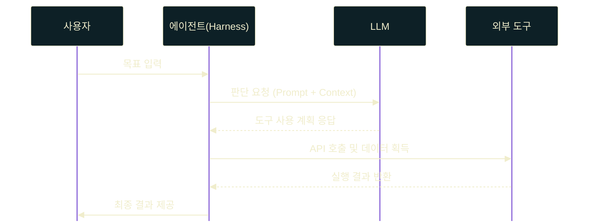
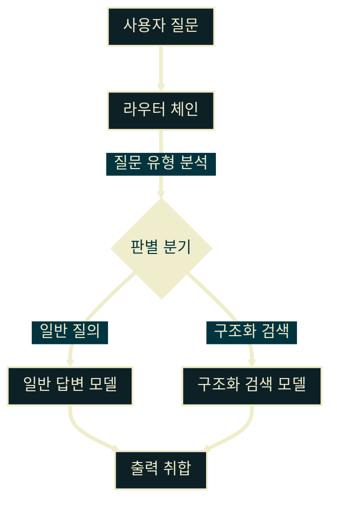

# LangChain과 에이전트 개발

---
layout: default
---

# 학습 체크리스트 (1/2)

- [ ] LangChain 및 LangChainJS의 핵심 오케스트레이션 설계 이해
- [ ] Google AI Studio 환경 구축 및 통합 설정
- [ ] LLM 실행 제어 파라미터 및 프롬프트 빌더 템플릿 설계
- [ ] LCEL 파이프라인 구성과 단일 실행(.invoke) 제어법 활용
- [ ] String/JSON 출력 파서 및 구조화된 데이터 추출 기법

---
layout: default
---

# 학습 체크리스트 (2/2)

- [ ] ChatMessageHistory 기반 대화 세션 및 메모리 관리 기법
- [ ] Fallbacks를 활용한 장애 복구 및 예외 처리 자동화
- [ ] LLM과 에이전트(Agent)의 시스템적 역할 구분 및 위상 정립
- [ ] 기본 인지 패턴(이진/다중 분류, 유사 회귀 예측) 설계
- [ ] 동적 제어 라우팅 및 다중 모델 합의/앙상블 패턴 분석

---
layout: default
---

# LangChain & LangChainJS 개요

> **오케스트레이션 프레임워크 (Orchestration Framework)**
>
> LLM 기반 애플리케이션 개발 프로세스를 간소화하고 표준화하기 위한 도구와 아키텍처의 집합

- **다양한 환경 지원**: Node.js, Express 서버 등 백엔드 런타임 통합 대응
- **컴포넌트 추상화**: 프롬프트, 모델, 파서 등의 일관된 객체 모델화
- **통합 인터페이스**: 언어 환경에 무관하게 유지되는 개념적 설계

---
layout: default
---

# Runnable & Expression Language

> **Runnable 인터페이스 (Runnable Interface)**
>
> 모든 컴포넌트가 공유하는 일관되고 표준화된 데이터 실행 규격

- **일관된 실행 메서드**: 단일 처리를 담당하는 `.invoke()` 완비
- **LCEL (LangChain Expression Language)**: 선언적으로 체인을 형성하는 결합 문법
- **데이터 흐름 최적화**: 체인 구성을 통한 파이프라인 가독성 및 유지보수성 향상

---
layout: default
---

# 데이터 흐름 파이프라인


---
layout: default
---

# AI Provider 환경 설정

- **Google AI Studio**: `@langchain/google-genai` 패키지 사용
- **Gemini 단일화**: 라이브러리 간 일관성을 위해 구글 에코시스템에 집중
- **서버 환경 중심**: Express 등 API 서버 내부에서 안전하게 API Key 로드
- **호환 연결성**: 호환 패키지 적용만으로 이종 엔진에 유연하게 접근

---
layout: default
---

# 예) Gemini 모델 연동 설정

```javascript
const { ChatGoogleGenerativeAI } = require("@langchain/google-genai");

const model = new ChatGoogleGenerativeAI({
  model: "gemini-3.1-flash-lite",
  apiKey: process.env.GEMINI_API_KEY,
});
```

---
layout: default
---

# LLM 실행 파라미터 제어

- **`temperature`**: 답변의 다양성과 무작위성을 제어하는 수치 (0 ~ 2)
- **`maxTokens`**: 생성되는 답변의 물리적 한계 길이를 제한하여 요금 통제
- **Reasoning Control**: 추론형 모델의 사고 수준과 예산 할당
- **최적의 설정**: 태스크 성격에 따라 자유도와 결정론적 속성 조정

---
layout: default
---

# 추론 전용 제어 매개변수 적용

```javascript
const { ChatGoogleGenerativeAI } = require("@langchain/google-genai");

const model = new ChatGoogleGenerativeAI({
  model: "gemini-3.1-flash-lite",
  thinkingBudget: 2048,
});
```

---
layout: default
---

# 프롬프트 빌더와 시스템 지침

> **System Message (System Message)**
>
> 모델에게 페르소나, 어조, 행동 제약 등을 부여하는 최우선 순위 지침

- **`PromptTemplate`**: 동적 문자열 변수를 삽입하여 완성형 텍스트 생성
- **`ChatPromptTemplate`**: 역할(System, Human, AI) 중심의 대화식 구조화
- **효율적 지침**: 구조적 템플릿 사용으로 일관된 입출력 형태 보장

---
layout: default
---

# 다중 역할 기반 프롬프트 템플릿 설계

```javascript
const { ChatPromptTemplate } = require("@langchain/core/prompts");

const prompt = ChatPromptTemplate.fromMessages([
  ["system", "당신은 요약 전문 AI 비서입니다."],
  ["human", "다음 내용을 {format} 형태로 요약해 줘:\n{text}"],
]);
```

---
layout: default
---

# LCEL 파이프라인 구성

> **파이프라인 결합 (Pipeline Chaining)**
>
> `.pipe()` 메서드로 데이터를 앞 단계에서 뒷 단계로 자연스럽게 흘려주는 것

- **선언적 선언**: 비동기 호출이나 복잡한 미들웨어 없이 직관적으로 연결
- **단일 호출 기법**: 동기/비동기 흐름 제어에 적합한 `.invoke()` 활용
- **유연한 변경**: 체인 중간에 파서나 가드레일을 쉽게 교체 삽입

---
layout: default
---

# 체인 구성 및 동적 호출

```javascript
const { StringOutputParser } = require("@langchain/core/output_parsers");

const chain = prompt.pipe(model).pipe(new StringOutputParser());

const response = await chain.invoke({
  format: "개조식",
  text: "자바스크립트는...",
});
```

---
layout: default
---

# 출력 파서 및 구조화된 데이터

- **`StringOutputParser`**: 복잡한 AI 메시지 객체에서 본문 텍스트만 정제
- **`JsonOutputParser`**: JSON 포맷의 문자열을 받아 즉시 JS 객체로 파싱
- **`withStructuredOutput`**: 스키마 구조를 모델에 연동하여 특정 포맷의 출력 강제
- **데이터 신뢰성**: 정형화된 응답을 제공하여 파이프라인 안정성 제공

---
layout: default
---

# 대화 세션 유지 및 관리 기법

- **`ChatMessageHistory`**: 이전 대화 메시지 기록을 순차적으로 관리
- **서버 지향 설계**: 브라우저 스토리지가 아닌 서버 내 세션/메모리 영속화
- **토큰 최적화**: 컨텍스트가 넘치지 않게 메시지를 정리하는 과정 필수
- **메시지 압축 기법**: 슬라이딩 윈도우 및 누적 대화 요약 기법 활용

---
layout: default
---

# 서버 내 메모리 기반 메시지 관리

```javascript
const { ChatMessageHistory } = require("langchain/stores/message/in_memory");

const history = new ChatMessageHistory();
await history.addUserMessage("사용자 질문");
await history.addAIChatMessage("AI 응답");

const messages = await history.getMessages();
```

---
layout: default
---

# 예외 처리 및 Fallbacks 대응

> **대체 복구 장치 (Fallback Mechanism)**
>
> 특정 AI API 에러 발생 시, 준비된 대안 모델이나 체인으로 백업을 넘기는 복구 시스템

- **장애 요인**: Rate Limit 도달, API 서비스 장애, 네트워크 지연
- **`RunnableRetry`**: 일시적인 오류 시 자동 재시도를 처리하는 복원 장치
- **서비스 복원력**: 다중 장애 상황에서도 시스템 정지 없이 대응

---
layout: default
---

# 백업 모델 지정 및 Fallback 선언

```javascript
const { ChatGoogleGenerativeAI } = require("@langchain/google-genai");

const primaryModel = new ChatGoogleGenerativeAI({ model: "gemini-3.1-flash-lite" });
const backupModel = new ChatGoogleGenerativeAI({ model: "gemma-4-26b-a4b-it" });

const resilientModel = primaryModel.withFallbacks({
  fallbacks: [backupModel],
});
```

---
layout: default
---

# AI와 에이전트의 역할 구분

- **AI (LLM)의 주요 위상**: 비정형 텍스트 이해, 번역 및 요약 등 추상적인 연산
- **에이전트 (Agent)의 위상**: 목표 지향 판단, 도구 실행, 피드백 순환 구조 통제
- **설계 방향성**: 복잡한 비즈니스 로직을 LLM 단일 모델에 의존하지 않음
- **결과**: 구조화된 통제 시스템(Harness) 내부에 모델을 안착시키는 설계

---
layout: default
---

# 에코시스템 컴포넌트의 위상

- **모델 (Model)**: 텍스트 생성과 추론만을 담당하는 확률적 연산 단위
- **에이전트 (Agent)**: 프롬프트와 도구(Tools)를 바인딩하여 작동하는 Harness 구조
- **완제품 에이전트 (Deep Agents)**: 자체 파일 시스템, 다중 에이전트 관리 기능 내장형
- **시스템 아키텍처**: 단순 추론에서 자율적 행동 제어로 이어지는 진화 과정

---
layout: default
---

# 에이전트 구조 아키텍처



---
layout: default
---

# 기본 태스크 및 인지 패턴

- **이진 분류 (Binary)**: 두 가치(긍/부정, 정상/이상)를 판별하여 흐름 결정
- **다중 분류 (Categorical)**: 다수 옵션 중 알맞은 라벨 매핑 수행
- **유사 회귀 (Pseudo-Regression)**: Few-shot 예제를 힌트로 삼아 정량 수치 예측
- **콘텐츠 생성**: 기획, 요약, 문맥 변환 등 고수준의 작업 수행

---
layout: default
---

# 동적 제어 및 라우팅 패턴

- **조건부 체이닝**: 분류 결과에 따라 타깃 서브체인으로 다이나믹 라우팅
- **피드백 루프**: 오차가 임계치보다 크다면 프롬프트/매개변수를 보정하여 재시도
- **결과 검증**: 출력이 스키마 및 비즈니스 룰에 맞는지 기계적 자동 확인
- **복잡도 극복**: 고정된 절차 대신 실행 시점 상태에 기반한 동적 제어 실현

---
layout: default
---

# 라우팅 파이프라인 흐름도



---
layout: default
---

# 멀티 모델 합의 및 최적화

- **자기일관성 (Self-Consistency)**: 다수 추론 경로 투표를 통한 신뢰도 극대화
- **모델 앙상블 (Ensemble)**: 특성이 다른 복수 모델 결과의 논리적 병합
- **상호 검증**: 생성 모델의 출력을 평가 모델이 정밀 검사하는 설계
- **장점**: 개별 LLM의 할루시네이션(환각)을 시스템적으로 최소화

---
layout: default
---

# 후발 LLM 프레임워크의 대두

- **개발 생태계의 다양화**: LangChain의 성공 이후 특정 언어 환경이나 아키텍처에 특화된 도구들이 등장
- **핵심 사상의 공유**: 프레임워크가 달라도 LLM을 추상화하여 도구와 연동하고 제어하는 본질은 동일
- **공통점**: 모델 독립성 확보(Provider 스왑), 체이닝/파이프라인화, 스키마 기반 구조화 출력
- **학습 목표**: LangChain의 오케스트레이션 개념을 충실히 학습하여 타 도구로의 확장 기반 마련

---
layout: default
---

# 프레임워크별 특화 지향점 (1/2)

- **LangGraph (순환 흐름과 상태 관리)**:
  - 단순 선형 체인(`.pipe()`)의 한계를 넘는 순환 그래프(Cyclic) 아키텍처 지원
  - 다단계 에이전트 판단 과정에서 데이터 유실 없는 영속적 상태(State) 보존 기능
  - 고도로 복잡하고 자율적인 멀티 에이전트 간의 협업 및 조율에 최적화
- **Spring AI (엔터프라이즈 Java 생태계)**:
  - Java/Kotlin 개발자를 위해 Spring Boot의 표준적인 의존성 주입(DI) 방식으로 설계
  - 기업용 레거시 연동에 검증된 엔터프라이즈 환경 및 POJO 프로그래밍 패러다임 밀착 지원

---
layout: default
---

# 프레임워크별 특화 지향점 (2/2)

- **Pydantic AI (Python 타입 안정성 제어)**:
  - Python 타입 힌트 시스템과 강력한 런타임 데이터 검증(Pydantic) 기반의 LLM 연동
  - Fast API 개발진에 의해 설계되어 초정밀 타입 제어 및 스키마 검증 중심의 파이프라인 형성
- **지식의 자산화 (Harness의 본질)**:
  - 어떤 프레임워크든 결국 'LLM 판단 루프 + 프롬프트 + 도구 바인딩'의 하네스 구조는 불변
  - 하나의 프레임워크를 깊이 있게 파악하면 후발 주자로의 유연한 개념 이식 가능
