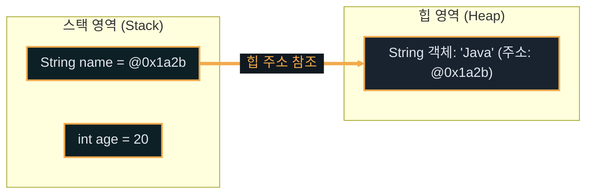
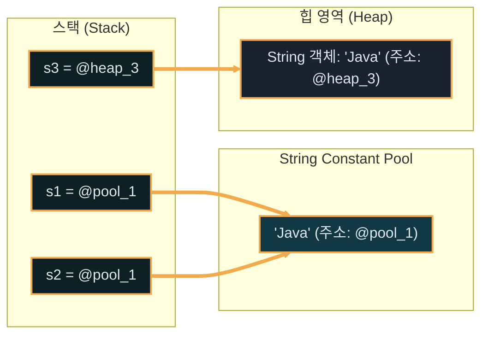

# Java 문법

---
layout: default
---

# 학습 체크리스트 (1/2)

- [ ] JavaScript와 Java의 타입 및 런타임 차이를 구분할 수 있다.
- [ ] 파스칼, 카멜, 스네이크 등 상황에 알맞은 표기법을 적용한다.
- [ ] 명령문의 종료를 선언하는 세미콜론(;)을 정상 작성한다.
- [ ] Javadoc 표준 주석과 일반 주석의 쓰임새를 구분할 수 있다.
- [ ] 자바 어플리케이션의 규격화된 main 진입점 구조를 서술할 수 있다.

---
layout: default
---

# 학습 체크리스트 (2/2)

- [ ] Scanner 사용 시 발생하는 개행 문자 버퍼 잔류 오류를 해결한다.
- [ ] 원시 타입 8가지의 종류와 메모리(스택) 저장 성향을 설명한다.
- [ ] 참조 타입의 메모리(힙) 주소 참조 구조와 불변성을 이해한다.
- [ ] 자동 형변환과 강제 형변환 및 문자열 파싱법을 기술한다.
- [ ] == 연산자와 .equals() 메서드의 비교 대상의 차이를 비교한다.

---
layout: default
---

# 들어가며: 정적 타입과 동적 타입

- **정적 타입 언어 (Java)**: 변수를 선언할 때 자료형(Type)을 명시해야 하며, 컴파일 시점에 타입 일치 여부를 엄격히 검사
- **동적 타입 언어 (JavaScript)**: 변수 선언 시 타입을 명시하지 않고, 런타임(실행 시점)에 대입되는 값에 따라 타입이 유연하게 결정
- **실행 흐름의 안정성**: Java는 잘못된 타입 사용을 실행 전에 컴파일 에러로 잡아내어 대규모 프로젝트에서 뛰어난 안정성을 제공

---
layout: default
---

# 들어가며: 컴파일러와 인터프리터

- **자바 컴파일러 (javac)**: 소스코드(`.java`)를 JVM이 이해할 수 있는 중간 코드인 바이트코드(`.class`)로 변환
- **자바 가상 머신 (JVM)**: 변환된 바이트코드를 로드하여 실행 장치의 OS에 맞게 해석하고 구동
- **차이점 요약**: JavaScript처럼 브라우저나 엔진이 소스코드를 즉시 실행(인터프리터)하지 않고, 사전에 바이트코드 검증 단계를 반드시 거침

---
layout: default
---

# 자바의 엄격한 문법 구조

- **세미콜론 (;) 생략 불가**: 자바의 모든 명령문(Statement) 끝에는 반드시 세미콜론을 작성해야 하며, 생략 시 컴파일 에러가 발생 (JavaScript의 자동 삽입과 대조됨)
- **엄격한 블록 스코프**: 중괄호 `{ }` 영역을 기준으로 스코프가 완전히 격리되어 동일 영역 내 변수 재선언 등이 불가능
- **클래스 기반 구조**: 모든 코드는 클래스 블록 내부에서 시작하고 종료되어야 함

---
layout: default
---

# 식별자 표기법 규칙 (Naming Convention)

- **카멜케이스 (camelCase)**: 변수명, 메서드명에 적용. 첫 단어는 소문자, 이어지는 단어의 첫 글자는 대문자 (예: `userName`, `calculateTotal`)
- **파스칼케이스 (PascalCase)**: 클래스명, 인터페이스명에 적용. 모든 단어의 첫 글자를 대문자로 표기 (예: `HelloWorld`, `OrderService`)
- **스네이크케이스 (snake_case)**: 자바에서는 상수를 대문자로 표기할 때 주로 사용 (`UPPER_SNAKE_CASE`, 예: `MAX_LIMIT`)
- **케밥케이스 (kebab-case)**: 변수명 대시(`-`) 사용 불가. 주로 URL 경로나 HTML/CSS 서식에서 활용 (예: `user-profile`)

---
layout: default
---

# 자바 코드의 구성 단위

- **표현식 (Expression)**: 계산을 거쳐 하나의 값으로 평가되는 코드 조각
- **명령문 (Statement)**: 컴퓨터가 수행해야 하는 동작을 나타내는 실행 단위로, 반드시 끝에 세미콜론 `;`을 요구함
- **블록 (Block)**: 중괄호 `{ }`로 감싸인 스코프 영역으로 여러 명령문을 묶어 처리하며, 블록 끝에는 세미콜론을 붙이지 않음

---
layout: default
---

## 변수 할당 명령문과 스코프 블록

```java
public class StatementBlock {
    public static void main(String[] args) {
        int result = 10 + 20; // 명령문
        { // 스코프 블록
            int localValue = 100;
            System.out.println(result + localValue);
        }
    }
}
```

---
layout: default
---

# 자바의 주석 (Comment)

- **한 줄 주석 (`//`)**: 코드 내 임시 설명 작성 시 활용하며 슬래시 뒤의 해당 라인 끝까지 무시
- **여러 줄 주석 (`/* ... */`)**: 블록 단위로 긴 설명을 적거나 일시적으로 여러 줄의 코드를 실행 제외시킬 때 사용
- **문서화 주석 (Javadoc, `/** ... */`)**: 소스코드로부터 표준 API 설명서(HTML 문서)를 자동 생성하기 위해 사용하는 전용 규격

---
layout: default
---

# 문서화 주석 (Javadoc)과 태그

> **문서화 주석 (Javadoc)**
>
> 클래스, 인터페이스, 메서드 선언 바로 직전에 기입하여 코드의 구조와 매개변수 정보를 명세화하는 특수 주석
>
- **API 명세 연동**: 빌드 도구를 실행하면 주석 내용과 태그를 조합한 고가시성 HTML 문서 파일이 자동 빌드됨
- **핵심 Javadoc 태그**:
  - `@param`: 메서드가 입력받는 매개변수의 의미와 역할 기술
  - `@return`: 메서드가 최종 반환하는 값의 의미와 범위 설명

---
layout: default
---

## 클래스 메서드 내 문서화 주석

```java
/**
 * @param a 첫 번째 입력 정수
 * @return 입력값에 10을 더한 값
 */
public int addTen(int a) {
    /* 복수 줄 주석으로 로직 격리
       간단한 연산 수행 */
    return a + 10;
}
```

---
layout: default
---

# 메인 메서드와 프로그램 진입점

- **순수 객체지향 언어**: 자바는 모든 기능과 함수가 특정 클래스 블록의 내부에만 종속될 수 있음 (전역 함수 존재 불가)
- **시작 제어**: 프로그램 실행 시 JVM이 가장 먼저 찾는 약속된 규격의 진입점(Entry Point)이 존재
- **진입점 규격**: 반드시 `public static void main(String[] args)` 형태로 작성된 정적 메서드가 포함되어야 정상 실행됨

---
layout: default
---

## HelloWorld 클래스 선언과 실행 진입점

```java
public class HelloWorld {
    // 프로그램 실행 시 JVM이 호출하는 진입점
    public static void main(String[] args) {
        System.out.println("Hello, Java!");
    }
}
```

---
layout: default
---

# 메인 메서드 간소화 트렌드

- **간소화 기능 도입**: JDK 21(Preview)부터 초심자의 학습 장벽을 낮추기 위해 **Simple Source Files / Instance Main Methods** 기능이 제안됨
- **주요 특징**: 명시적인 `class` 선언이나 `public static void main(String[] args)` 등의 복잡한 상용구 코드를 생략하고 가볍게 실행 가능
- **실무 표준 준수**: 그러나 모든 엔터프라이즈 프로젝트와 Spring Framework 백엔드 개발에서는 기존 클래스 래퍼 기반의 진입점이 표준으로 강제됨

---
layout: default
---

# 표준 출력과 리터럴의 엄격한 구분

- **단일 문자 (`char`)**: 홑따옴표(`'`)를 사용하며, 2바이트 크기의 단 한 글자만 저장 및 대입 가능 (예: `'A'`)
- **문자열 (`String`)**: 쌍따옴표(`"`)를 사용하며 객체(참조 타입)로 취급됨 (예: `"Hello"`). JavaScript처럼 홑/쌍따옴표 혼용 불가
- **출력 메서드**:
  - `System.out.print()`: 전달된 값을 콘솔에 출력하되 자동 줄 바꿈을 하지 않음
  - `System.out.println()`: 전달된 값을 콘솔에 출력한 후 개행 문자(`\n`)를 삽입

---
layout: default
---

## 단일 문자와 문자열 표준 출력 비교

```java
public class PrintExample {
    public static void main(String[] args) {
        char initial = 'J'; // 단일 문자 (홑따옴표)
        String name = "Java"; // 문자열 (쌍따옴표)
        System.out.print(initial); // 줄바꿈 없음
        System.out.println(name); // 줄바꿈 포함
    }
}
```

---
layout: default
---

# Scanner를 활용한 사용자 입력

- **Scanner 클래스**: 콘솔, 파일 등으로부터 텍스트 데이터를 정밀하게 읽어들이는 Java 표준 라이브러리 객체
- **단어 단위 읽기 (`next()`)**: 공백 문자(스페이스, 탭, 줄 바꿈)를 기준으로 데이터를 쪼개어 첫 번째 단어만 조회
- **줄 단위 읽기 (`nextLine()`)**: 사용자가 엔터(Enter) 키를 누르기 전까지 입력한 전체 문자열을 한 줄 통째로 조회

---
layout: default
---

# 개행 문자 버퍼 잔류 현상

> **입력 버퍼 (Input Buffer)**
>
> 키보드로부터 입력된 텍스트와 개행 문자가 임시 저장되는 가상 공간
>
- **오류 발생 메커니즘**: `nextInt()`나 `next()`를 호출해 공백 전까지의 값만 가져온 후 `nextLine()`을 순차 호출할 때 발생
- **오동작 현상**: 버퍼에 미처 처리되지 않고 남아있던 엔터 개행 문자(`\n`)를 `nextLine()`이 즉시 읽어 들여 프로그램이 입력을 받지 않고 그냥 건너뜀
- **해결 방안**: 중간 단계에 `scanner.nextLine()`을 한 번 수동으로 단독 실행하여 버퍼를 깨끗이 청소해 주어야 함

---
layout: default
---

## Scanner 개행 문자 버퍼 문제 해결 코드

```java
import java.util.Scanner;
public class InputClear {
    public static void main(String[] args) {
        Scanner sc = new Scanner(System.in);
        int age = sc.nextInt(); // 숫자만 읽고 개행문자는 버퍼 잔류
        sc.nextLine(); // 잔류 개행문자(\n)를 버퍼에서 비움
        String name = sc.nextLine(); // 정상적으로 이름 입력 대기
    }
}
```

---
layout: default
---

# 변수와 상수 (Java vs JavaScript)

- **변수 선언**: 타입을 가장 앞에 명시적으로 명명하여 할당 (JavaScript의 `let` 선언에 상응)
- **상수 선언**: 타입명 앞에 `final` 키워드를 붙여 지정하며, 초기화 이후 수정 불가 (JavaScript의 `const` 선언에 상응)
- **재선언 불가**: 동일 스코프 블록 내부에서 한 번 지정된 변수명은 어떠한 상황에서도 재생성할 수 없음

---
layout: default
---

# 초기화와 변수 유효 범위

- **선언과 초기화**: 변수 선언 시 메모리에 방이 잡히고, 최초의 데이터 값을 집어넣어 할당할 때 공간의 사용 준비 완료(초기화)
- **블록 스코프**: 변수는 본인이 직접 선언된 중괄호 `{ }` 스코프 내부에서만 숨 쉬고 동작
- **소멸 메커니즘**: `for` 루프 초기화식의 제어 변수나 `if` 블록 내 지역 변수는 블록을 벗어나는 즉시 메모리에서 완전히 소각

---
layout: default
---

## 변수 스코프 경계와 상수 선언

```java
public class VariableScope {
    public static void main(String[] args) {
        final int MAX = 100; // 상수
        int score = 85; // 변수
        if (score < MAX) {
            int gap = MAX - score; // if 블록 지역 변수
            System.out.println(gap);
        } // gap 변수 메모리 소멸
    }
}
```

---
layout: default
---

# 8가지 원시 타입 (Primitive Type)

- **정수형**: `byte`(1바이트), `short`(2바이트), `int`(4바이트, 정수형 연산 표준), `long`(8바이트, 값 끝에 `L` 접미사 기입)
- **실수형**: `float`(4바이트, 끝에 `f` 접미사 기입), `double`(8바이트, 실수형 연산 표준, 정밀도가 우수하여 기본 권장)
- **문자형 (`char`)**: 2바이트 크기의 단일 유니코드 부호 저장
- **논리형 (`boolean`)**: `true` 혹은 `false` 두 가지 값만 존재하며 정수(0, 1)나 null 값과 호환되지 않음

---
layout: default
---

# 원시 타입의 메모리 저장 방식

> **스택 영역 (Stack Area)**
>
> 메서드 내에서 선언된 지역 변수와 연산 시 임시 생성되는 데이터를 저장하는 메모리 공간
>
- **값 자체 보관**: 원시 타입 변수는 변수를 위해 할당된 스택 메모리 공간에 실제 리터럴 데이터 값을 즉시 다이렉트로 저장
- **고속 접근**: 복잡한 주소 참조나 포인터 이동 없이 스택의 메모리 오프셋을 통해 해당 값에 직접 고속으로 다가가 사용

---
layout: default
---

## 원시 타입 리터럴 표현과 문자 연산

```java
public class PrimitiveExample {
    public static void main(String[] args) {
        long largeVal = 10_000_000_000L; // L 접미사
        double decVal = 3.141592; // 기본 실수
        char code = 'A'; // 유니코드 정수 대응
        int nextCode = code + 1; // 정수로 계산 가능 (66)
        System.out.println((char) nextCode); // B 출력
    }
}
```

---
layout: default
---

# 참조 타입 (Reference Type) 개요

- **참조 타입**: 클래스(Class), 인터페이스(Interface), 배열(Array) 형태로 표현되는 모든 논원시 타입
- **힙 영역 (Heap Area)**: 인스턴스 객체나 대형 배열과 같이 가변적이고 크기가 큰 데이터를 자유롭게 동적 보관하는 전용 메모리
- **참조 주소 연동**: 참조 타입 변수는 **스택 영역**의 변수 보관함에 객체 자체가 아닌, 객체가 위치한 **힙 영역의 시작 주소값(참조 주소)**만을 간직

---
theme: default
---

# 스택과 힙 메모리 참조 관계



---
layout: default
---

# java.lang.Object 계층 구조

- **최상위 부모 클래스**: Java에 존재하는 모든 클래스는 최상위에 위치한 `java.lang.Object` 클래스를 묵시적으로 상속
- **자동 상속 메커니즘**: 클래스 선언 뒤에 `extends` 구문을 적지 않아도 컴파일러가 알아서 상속 체인을 `Object`로 귀결시킴
- **다형성 설계 핵심**: 모든 객체 참조형 변수를 `Object` 타입으로 일괄 묶어 전달하거나 보관할 수 있는 객체 간 호환성 기반 마련

---
layout: default
---

# 문자열 (String) 클래스의 불변성

- **참조 타입의 예외적 지위**: 원시 타입처럼 빈번히 쓰이나 엄밀히 클래스 기반의 참조 타입 객체임
- **불변성 (Immutability)**: 한 번 생성 및 할당된 내부의 문자 데이터 내용은 메모리 공간 내부에서 절대 변경될 수 없음
- **재할당 동작 방식**: 문자열 변수에 덧셈 연산 등을 수행하면, 기존 공간의 값이 수정되는 것이 아니라 **새로운 힙 메모리 공간에 결합된 문자열을 생성하고 주소만 갱신**함

---
layout: default
---

## 문자열의 불변 재할당 현상

```java
public class StringImmutable {
    public static void main(String[] args) {
        String msg = "Java"; // 힙 영역 상수 풀 할당
        String updated = msg + " 17"; // 새 String 객체 힙 할당
        System.out.println(msg); // Java 출력 (기존 데이터 유지)
        System.out.println(updated); // Java 17 출력
    }
}
```

---
layout: default
---

# 리터럴 (Literal)

> **리터럴 (Literal)**
>
> 변수나 상수에 대입하기 위해 소스코드 내에 직접 작성한 데이터 값 자체의 물리적 표현 방식
>
- **리터럴 분류**:
  - 정수형 리터럴 (예: `100`, `10_000_000L`)
  - 실수형 리터럴 (예: `3.14`, `1.2f`)
  - 문자형 및 문자열 리터럴 (예: `'A'`, `"Java"`)
  - 논리형 리터럴 (예: `true`, `false`)

---
layout: default
---

# 형변환 (Type Casting)

- **묵시적 형변환 (자동 형변환)**: 데이터 표현의 허용 범위가 좁은 타입에서 넓은 타입으로 변수를 대입할 때 컴파일러가 자동 변환해 주는 기능 (예: `int` -> `double`)
- **강제 형변환 (명시적 캐스팅)**: 데이터가 소실되어 잘려 나갈 수 있는 위험을 감수하고, 개발자가 소괄호 `(타입)` 구문으로 타입을 좁혀서 강제로 밀어 넣는 기법 (예: 실수형 소수점 절삭)

---
layout: default
---

# 문자열을 숫자로 변환하는 파싱 (Parsing)

- **연산용 타입 변환**: 웹 입력창이나 외부 통신 등으로 유입된 `"123"` 등의 문자열을 실제 사칙연산이 가능한 수치로 변환
- **Integer.parseInt()**: 인자로 들어온 숫자 형태 문자열을 분석해 4바이트 정수형 `int` 타입 값으로 즉각 복원
- **Double.parseDouble()**: 문자열 형태의 소수점 데이터를 8바이트 정밀 실수형 `double` 타입 값으로 복원

---
layout: default
---

## 강제 타입 캐스팅 및 파싱 메서드

```java
public class CastingParse {
    public static void main(String[] args) {
        double original = 9.99;
        int parsedInt = (int) original; // 강제 캐스팅 (9로 소수점 절삭)
        
        String input = "250";
        int value = Integer.parseInt(input); // 문자열 파싱 (250)
        System.out.println(parsedInt + value); // 259 출력
    }
}
```

---
layout: default
---

# 자바 고유 및 유의 연산자

- **기본 사칙연산**: 덧셈, 뺄셈, 곱셈, 나눗셈 및 대입 등은 JavaScript와 온전히 일치함
- **문자열 연결 연산 (`+`)**: 수식 연산식 내부에서 어느 한쪽의 피연산자가 `String`일 경우, `+` 연산자는 결합 연산자로 전환되어 상대방을 문자열로 강제 변환 후 붙임
- **단축 평가 연산 (Short-circuit)**: 논리곱(`&&`), 논리합(`||`) 계산 시 앞선 항의 결과로 이미 논리값이 확정되면 뒤쪽 조건은 해석하지 않고 통과

---
layout: default
---

# 주소값 비교 (==) vs 동등성 검증 (.equals)

- **일치 연산자 (`==`)**: 두 변수가 간직한 **메모리 시작 주소값(참조값)**을 직접 비교
- **동등성 메서드 (`equals()`)**: 객체의 내부로 들어가 간직한 **실제 내용 데이터가 동일한지** 검증
- **String Constant Pool**: 리터럴로 생성된 문자열은 메모리 절약을 위해 JVM 내부 상수 풀에서 공유되어 `==` 주소 비교 결과가 참일 수 있으나, `new String()`으로 힙에 독립 할당된 객체는 주소값 비교 시 거짓이 출력됨
- **문자열 값 검증 표준**: 문자열의 텍스트 자체를 비교할 때는 절대 `==`를 금지하고 반드시 `.equals()`를 사용해야 함

---
theme: default
---

# String Constant Pool과 new String의 참조 관계



---
layout: default
---

## 문자열의 주소값 참조 비교와 동등성 비교

```java
public class StringComparison {
    public static void main(String[] args) {
        String s1 = "Java";
        String s2 = new String("Java");
        System.out.println(s1 == s2); // false (주소값이 다름)
        System.out.println(s1.equals(s2)); // true (문자열 값 동일)
    }
}
```

---
layout: default
---

# 엄격한 조건 검증과 타입 비교

- **Truthy/Falsy 부재**: JavaScript와 달리 숫자가 `0`이거나 객체가 `null`이라고 해서 조건절에서 거짓(`false`)으로 자동 취급되지 않음
- **컴파일 에러 발생**: `if (1)`이나 `if (obj)` 등은 엄격하게 컴파일 차단되며, 반드시 `boolean`을 직접 리턴하는 명확한 조건식만 삽입 가능
- **instanceof 연산자**: 런타임에 객체가 특정 클래스나 인터페이스를 상속/구현한 실체인지 참/거짓으로 판별하는 기능

---
layout: default
---

## 명확한 Boolean 조건 제어와 타입 감지

```java
public class OperatorCheck {
    public static void main(String[] args) {
        Object obj = "Hello Java";
        // if (obj) -> 컴파일 에러 발생
        if (obj != null && obj instanceof String) {
            String str = (String) obj;
            System.out.println(str.length());
        }
    }
}
```

---
layout: default
---

# 비트 연산과 비트마스킹 (Bitmasking)

- **비트 연산자**: 정수 데이터 내부에 나열된 2진수 비트(0과 1)들을 직접 연산
  - `&` (AND), `|` (OR), `^` (XOR), `~` (반전)
  - `<<` (왼쪽 이동), `>>` (부호 유지 오른쪽 이동), `>>>` (부호 무관 오른쪽 0 채움)
- **비트마스킹 (Bitmasking)**: 여러 개의 상태나 방문 여부를 0과 1의 조합으로 이루어진 하나의 정수 변수 비트에 매핑하여 저장
- **메모리 절약과 초고속 처리**: 배열을 별도 생성할 필요 없이 빠른 비트 연산으로 집합 조회와 데이터 마킹이 가능하여 알고리즘에 자주 채택

---
layout: default
---

## 비트 연산을 통한 방문 상태 제어

```java
public class BitmaskingExample {
    public static void main(String[] args) {
        int visited = 0; // 방문 여부 플래그
        int targetNode = 3; // 3번 노드 (2진수로 1 << 3)
        visited = visited | (1 << targetNode); // 방문 마킹
        boolean isVisited = (visited & (1 << targetNode)) != 0;
        System.out.println(isVisited); // true
    }
}
```
