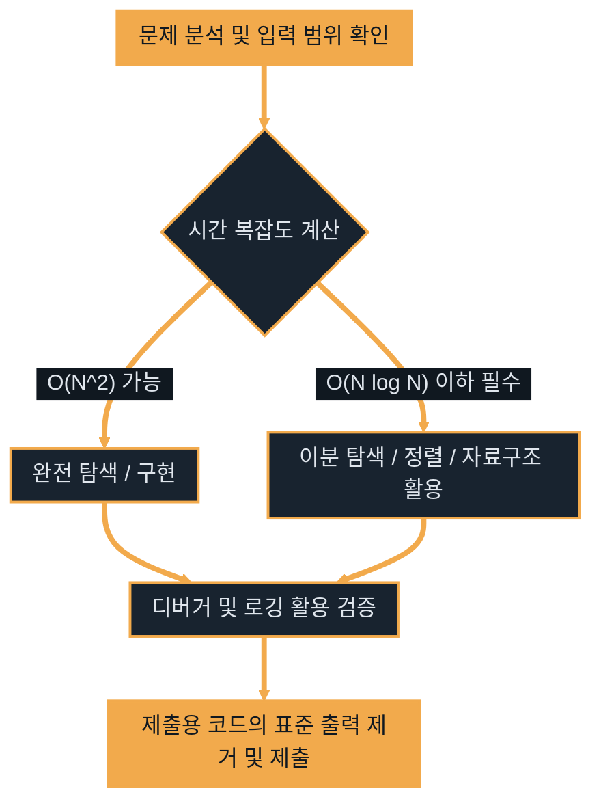

# 코딩테스트와 DSA

---
layout: default
---

# 학습 체크리스트 (1/2)

- [ ] 코딩테스트의 본질과 Java 핵심 자료구조 API 매핑 이해
- [ ] 빈출 알고리즘 유형(완전 탐색, DFS/BFS, 그리디, DP 등) 파악
- [ ] 인터넷/AI 도구가 차단된 현실적인 코딩테스트 제약사항 대비

---
layout: default
---

# 학습 체크리스트 (2/2)

- [ ] 정확성(Accuracy)과 효율성(Efficiency)의 개념 및 평가 차이 이해
- [ ] 시간/공간 복잡도의 분석 방법과 빅오(Big-O) 표기법 숙지
- [ ] 입력 데이터 크기에 따른 역추적 및 IntelliJ 디버거 활용법 체화

---
layout: default
---

# 자료구조의 정의

> **자료구조 (Data Structure)**
>
> 데이터를 메모리에 효율적으로 저장하고 관리하는 논리적인 구조

- **목적**: 데이터를 무작정 쌓아두는 것이 아니라, 해결하려는 문제의 특성에 맞게 가공하여 탐색, 삽입, 삭제의 속도를 최적화함
- **Java의 대응**: 언어 내부적으로 컬렉션 프레임워크(Collection Framework)를 통해 검증된 자료구조 표준 API를 제공함

---
layout: default
---

# 알고리즘의 정의

> **알고리즘 (Algorithm)**
>
> 입력받은 데이터를 처리하여 원하는 출력을 얻기 위한 명확한 절차와 연산의 집합

- **목적**: 주어진 문제를 해결하기 위해 컴퓨터가 수행해야 할 논리적인 단계들을 구축함
- **평가 기준**: 같은 목적을 달성하더라도 사용한 알고리즘에 따라 실행 속도(시간)와 소모 메모리(공간)가 판이하게 달라짐

---
layout: default
---

# Java 자료구조 API 매핑 (1/2)

- **배열 / 동적 배열**: `Array` / `ArrayList` (인덱스 기반의 빠른 무작위 조회 지원)
- **연결 리스트**: `LinkedList` (자바에서는 양방향 연결 리스트 및 덱의 인터페이스 구현체로 제공)
- **스택 / 큐 / 덱(이중 큐)**:
  - `Stack` 클래스는 동기화 오버헤드가 크므로 실무와 알고리즘에서 전면 지양
  - 코딩테스트에서는 스택과 큐 모두 **`ArrayDeque`를 최우선 구현체로 선택**하여 구현 (속도 및 메모리 사용 효율성 극대화)

---
layout: default
---

# Java 자료구조 API 매핑 (2/2)

- **해시 맵 / 해시 셋**: `HashMap` / `HashSet` (키-값 쌍 또는 중복 없는 고유 집합을 탐색할 때 사용하며, 대다수의 탐색 연산을 $O(1)$에 수행)
- **우선순위 큐 (힙)**: `PriorityQueue` (내부적으로 이진 힙 구조를 취하며, `Comparator` 인터페이스 정의를 통해 최소 힙 또는 최대 힙을 구현)

---
layout: default
---

# 빈출 알고리즘 유형 (1/2)

- **완전 탐색 (Brute Force)**:
  - 모든 가능한 경우의 수를 전부 대입하여 정답을 찾는 기법
  - 자바에서는 주로 재귀 호출(DFS 뼈대)이나 다중 반복문을 통해 구현
- **깊이/너비 우선 탐색 (DFS/BFS)**:
  - 그래프나 2차원 격자 지도를 탐색하는 기법 (큐 구현체로는 `ArrayDeque` 활용)
  - 메모리 동적 할당 오버헤드가 큰 인접 리스트 대신, **인접 배열(이중 배열 `int[][]`)을 주로 활용**하여 성능 최적화
- **탐욕법 (Greedy)**:
  - 미래의 결과를 고려하지 않고, 매 순간 국소적으로 가장 최선의 선택을 취하는 기법

---
layout: default
---

# 빈출 알고리즘 유형 (2/2)

- **동적계획법 (Dynamic Programming, DP)**:
  - 큰 문제를 작은 하위 문제들로 쪼갠 뒤, 그 결과를 1차원/2차원 배열 등의 메모이제이션(기록 테이블)에 저장하여 반복 연산을 줄이는 기법
- **이분 탐색 (Binary Search)**:
  - 정렬된 데이터에서 탐색 범위를 절반씩 줄여가며 값을 찾는 기법
  - 자바 내장 `Arrays.binarySearch()`를 활용하거나 직접 구현
- **투 포인터 / 슬라이딩 윈도우**:
  - 배열 내에서 두 인덱스를 가리키는 포인터를 이동하며 특정 조건의 구간을 탐색하는 기법

---
layout: default
---

# 코딩테스트의 현실적 제약

- **환경 통제**: 대부분의 코딩테스트 환경에서는 외부 라이브러리 사용이 전면 금지되며, 인터넷 검색이나 AI 도구 활용 또한 차단됨
- **API 명세 암기**: 핵심 자료구조의 Java API 명세(`java.util.*` 계열의 메서드들)를 암기 수준으로 체화해야 함
- **알고리즘 템플릿(Template) 숙지**: DFS, BFS, 이분 탐색 등 빈출 알고리즘의 기본 뼈대 코드는 즉석에서 작성할 수 있도록 훈련되어야 함

---
layout: default
---

# 정확성과 효율성 평가

- **정확성 (Accuracy)**:
  - 기본 테스트 케이스 외에도 엣지 케이스(Edge Case: 최소/최대 입력값, 빈 값, 음수 값 등)를 포함한 모든 숨겨진 테스트 케이스를 올바르게 해결하는지 검증함
- **효율성 (Efficiency)**:
  - 대규모 데이터셋(예: 10만, 100만 건 이상)이 입력되었을 때 정해진 시간 제한(일반적으로 1~2초) 내에 연산을 마칠 수 있는지 측정함
  - 비효율적인 자료구조나 다중 루프를 무분별하게 사용하면 시간 초과(Time Limit Exceeded)로 탈락하게 됨

---
layout: cover
class: text-center
---

# 효율성 분석

---
layout: default
---

# 시간 복잡도와 공간 복잡도

- **자원 사용량 분석**: 알고리즘이 소모하는 컴퓨터 자원을 수학적으로 분석하는 척도
- **시간 복잡도 (Time Complexity)**:
  - 입력 데이터 크기($N$)에 따라 수행하는 **기본 연산 횟수의 추이**를 나타냄
  - 코딩테스트 통과 여부를 결정짓는 가장 핵심적인 지표
- **공간 복잡도 (Space Complexity)**:
  - 알고리즘이 실행되는 동안 사용하는 **메모리 공간의 양**을 나타냄
  - 불필요하게 거대한 다차원 배열 선언을 피하고, 과도한 재귀 호출로 인한 스택 오버플로우(Stack Overflow)를 주의해야 함

---
layout: default
---

# 빅오 표기법 (Big-O Notation)

- **정의**: 입력값 $N$이 무한히 커질 때의 최악의 경우(상한선)를 단순화하여 표현하는 방식
- **원칙**: 가장 영향력이 큰 지배적인 항만 남기고 상수는 무시함 (예: $3N^2 + 5N + 10 \rightarrow O(N^2)$)
- **실행 속도 비교 (빠른 순 $\rightarrow$ 느린 순)**:
  $$O(1) < O(\log N) < O(N) < O(N \log N) < O(N^2) < O(2^N) < O(N!)$$

---
layout: default
---

# 시간 복잡도 계산

- **$O(1)$ (상수)**: 단일 연산, 배열 인덱스 직접 참조, 단순 값 대입 및 사칙 연산
- **$O(\log N)$ (로그)**: 연산마다 탐색 범위가 반씩 줄어드는 구조 (예: 이분 탐색, 트리 탐색)
- **$O(N)$ (선형)**: 데이터 크기만큼 도는 단일 반복문 (`N`회 순회)
- **$O(N \log N)$ (선형 로그)**: 데이터를 반씩 쪼갠 뒤 결합하여 정렬하는 연산 (예: `Arrays.sort()`)
- **$O(N^2)$ (제곱)**: 2차원으로 순회하는 이중 반복문 (예: 이중 for문)

---
layout: cover
class: text-center
---

# 절차적으로 접근하기

---
layout: default
---

# 입력/출력 분석 및 전략적 로깅

- **전략 수립**: 문제를 읽고 곧바로 코딩하지 않고, 입력 범위와 제한 시간을 파악하여 적합한 시간 복잡도의 알고리즘을 먼저 결정함
- **로깅 (Logging) 시 주의점**:
  - 디버깅 용도로 흔히 사용하는 `System.out.println()`은 표준 입출력 오버헤드가 극도로 큼
  - **제출할 최종 코드에서는 모든 출력 코드를 반드시 삭제**해야 함
  - 그렇지 않으면 로깅 자체의 시간 소모로 인해 효율성 테스트에서 탈락할 수 있음

---
layout: default
---

# IntelliJ 디버거 활용

- **디버깅 모드 활용**: 소스코드 곳곳에 로그 출력문을 작성하는 구시대적 방식을 버리고 디버거를 활용해야 함
- **중단점 (Breakpoint)**: 코드 라인 왼쪽을 클릭하여 중단점을 설정한 뒤 디버그 모드로 구동
- **메모리 추적**: 프로그램이 멈춘 특정 시점의 메모리 적재 상태, 변수의 실제 값 및 객체의 힙 주소를 실시간으로 추적 가능

---
layout: default
---

# 디버거 주요 단축키 (1/2)

| 기능 | Mac | Win / Linux | 설명 |
| :--- | :--- | :--- | :--- |
| **Step Over** | `F8` (또는 `Fn + F8`) | `F8` | 현재 라인을 실행하고 다음 줄로 이동 |
| **Step Into** | `F7` (또는 `Fn + F7`) | `F7` | 현재 라인의 호출 메서드 내부로 진입 |
| **Resume Program** | `Option + Cmd + R` | `F9` | 다음 중단점까지 프로그램 계속 진행 |

---
layout: default
---

# 디버거 주요 단축키 (2/2)

| 기능 | Mac | Win / Linux | 설명 |
| :--- | :--- | :--- | :--- |
| **Evaluate Expression** | `Option + F8` | `Alt + F8` | 디버그 중단 시점에 임의 Java 식 실행 |
| **Stop** | `Cmd + F2` | `Ctrl + F2` | 실행 중인 디버그 프로세스를 즉시 종료 |

---
layout: default
---

# 시각화의 중요성

- **손 코딩의 필요성**: 머릿속으로만 구상하면 복잡한 그래프나 트리 구조, 인덱스 변화를 놓치기 쉽으므로 펜과 종이로 시각적 흐름을 먼저 그려야 함
- **Mermaid를 통한 문서화**:
  - 마크다운 파일 내에 텍스트 기반으로 그래프나 흐름도를 즉각 시각화할 수 있음
  - 교안 작성 및 풀이 공유 시 협업과 분석에 유용하게 활용됨

---
layout: default
---

# 알고리즘 설계의 표준 흐름도

