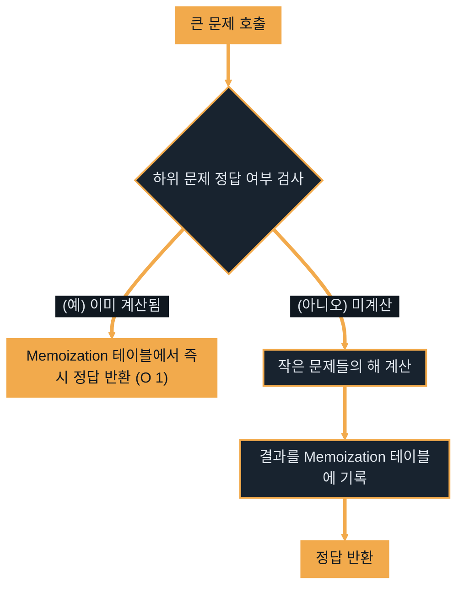
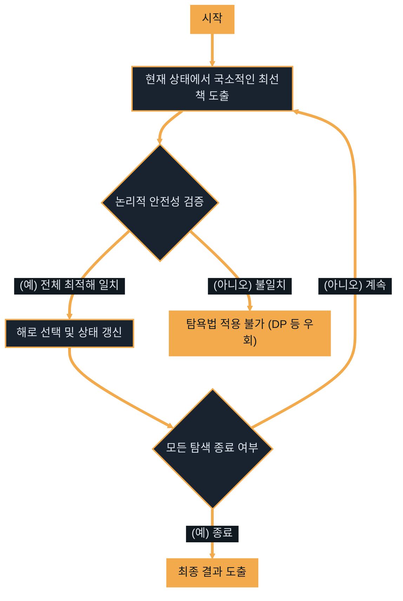
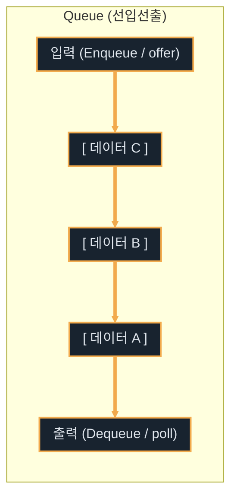
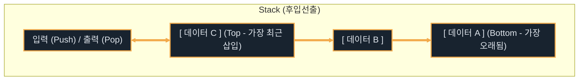

# Java DSA II

---
layout: default
---

# 학습 체크리스트 (1/2)

- [ ] 큰 문제를 하위 문제로 쪼개어 해결하는 동적계획법(DP)의 작동 원리 이해
- [ ] 하위 문제의 정답을 메모이제이션(Memoization)하여 중복 연산을 줄이는 설계법 습득
- [ ] 아래서부터 정답을 누적하는 상향식(Bottom-up) 반복문 구현 방식 숙지

---
layout: default
---

# 학습 체크리스트 (2/2)

- [ ] 매 순간 국소적으로 최선의 선택을 내리는 탐욕법(Greedy)의 성립 조건 이해
- [ ] 선입선출(FIFO) 구조인 큐(Queue)와 후입선출(LIFO) 구조인 스택(Stack)의 활용법 체화
- [ ] 스택과 큐의 고속 처리를 위한 구현체로서 ArrayDeque의 필요성 및 사용법 습득

---
layout: cover
class: text-center
---

# 동적계획법

---
layout: default
---

# 동적계획법의 정의

> **동적계획법 (Dynamic Programming, DP)**
>
> 연산량이 거대하여 단순 재귀 등으로 풀면 시간 초과가 나는 문제를 해결하는 최적화 기법

- **하위 문제 분할**: 큰 문제를 작은 단위의 중복되는 하위 문제들로 분할하여 접근
- **기록 테이블 활용**: 한 번 도출된 하위 문제의 정답은 메모리 공간(1차원/2차원 배열 등)에 **메모이제이션(Memoization)**하여 연산 낭비 차단
- **자바 표준 기법**: 아래서부터 순차적으로 연산 결과를 누적해 올라가는 **상향식 (Bottom-up)** 반복문 구현이 정석

---
layout: default
---

# 문제 1: 멀리 뛰기 (Lv. 2)

- **경우의 수 분할**: $N$번째 칸에 도달하는 방법은 오직 $N-1$번째 칸에서 1칸을 뛰거나, $N-2$번째 칸에서 2칸을 뛰는 두 경로뿐임
- **점화식 설계**: $dp[N] = dp[N-1] + dp[N-2]$ 이며 피보나치 수열과 수학적으로 동일한 규칙을 가짐
- **오버플로우 방지**: 값이 무한히 증폭될 수 있으므로, 각 단계의 덧셈 연산 직후 $1234567$로 나눈 나머지를 축적
- **상향식 순회**: 1차원 dp 배열을 확보하고 $dp[1]$과 $dp[2]$를 채운 뒤, 3부터 $N$까지 반복문을 구동

---
layout: default
---

## 피보나치 점화식을 이용한 상향식 DP

```java
dp[1] = 1; 
dp[2] = 2;

for (int i = 3; i <= n; i++) {
    // 점화식 대입 및 매 단계마다 나머지 연산 처리
    dp[i] = (dp[i - 1] + dp[i - 2]) % 1234567;
}
```

---
layout: default
---

# 문제 2: 정수 삼각형 (Lv. 3)

- **격자형 경로 최적화**: 꼭대기 `(0, 0)`에서 시작하여 바닥 행까지 대각선 아래 방향으로 전진하며 가중치를 계산
- **이전 경로 추적**: 특정 위치 `(i, j)`로 도달 가능한 직전 경로는 `(i-1, j-1)` 또는 `(i-1, j)` 두 군데로 제한됨
- **그리디한 누적**: 현재 칸에 이전 두 대각선 위 경로에서 온 값 중 더 큰 최댓값(`Math.max`)을 선택하여 가산
- **공간 복잡도 최소화**: 새로 메모리를 할당하지 않고 입력 데이터 `triangle[][]` 배열에 바로 가중치를 덮어씌워 공간 오버헤드 억제

---
layout: default
---

## 위에서 아래로의 누적합 최댓값 갱신

```java
for (int i = 1; i < triangle.length; i++) {
    for (int j = 0; j < triangle[i].length; j++) {
        // 열 위치(맨 왼쪽, 맨 오른쪽, 중간)에 따른 이전 최댓값 누적
        if (j == 0) triangle[i][j] += triangle[i - 1][j];
        else if (j == triangle[i].length - 1) triangle[i][j] += triangle[i - 1][j - 1];
        else triangle[i][j] += Math.max(triangle[i - 1][j - 1], triangle[i - 1][j]);
    }
}
```

---
layout: default
---

# 동적계획법 메모이제이션 흐름



---
layout: cover
class: text-center
---

# 탐욕법

---
layout: default
---

# 탐욕법의 정의

> **탐욕법 (Greedy)**
>
> 미래를 내다보지 않고, 오직 매 연산 분기점마다 현재 상황에서 국소적으로 가장 이득이 되는 최선의 선택을 취하는 알고리즘

- **제약 조건**: 개별 단계에서의 탐욕적 선택이 전체의 최종 최적해를 보장해야만 정답 도출이 성립
- **정렬과의 결합**: 탐욕적으로 가장 큰/가장 작은 대상을 선별하기 위해, 대다수의 그리디 문제는 사전 정렬이 핵심 전제조건으로 쓰임
- **탐색 기법**: 정렬 완료된 데이터를 단방향으로 선형 스캔하며 짝을 짓거나 선택하는 경우가 많음

---
layout: default
---

# 문제 1: 체육복 (Lv. 1)

- **순차 처리의 필요성**: 학생 번호가 차례대로 매칭되어야 꼬임 없이 분배되므로, `lost`와 `reserve` 배열의 오름차순 정렬이 필수
- **중복 요건 제외**: 여벌이 있으면서 도난당한 학생은 본인이 입어야 하므로 타인 대여가 불가능해 사전 필터링 처리
- **그리디한 대여**: 도난 학생이 번호 순서대로 순회하며, 바로 앞 번호(`i-1`)에게 먼저 빌려달라고 요청한 뒤 거절되면 뒷 번호(`i+1`)에게 요청
- **시간 복잡도**: 정렬 수행 후 중복 연산을 수행하므로 정렬 성능이 전체 속도를 지배함

---
layout: default
---

## 정렬 기반의 체육복 우선 분배

```java
Arrays.sort(lost); 
Arrays.sort(reserve);

// 여벌 소유자 중 도난당한 학생 제외 처리 후 대여 진행
for (int i = 0; i < lost.length; i++) {
    // 앞번호(lost-1) 또는 뒷번호(lost+1) 학생 체크 후 대여
    if (reserve[j] == lost[i] - 1 || reserve[j] == lost[i] + 1) {
        reserve[j] = -1; // 대여 완료 마킹
        lostCount--; 
        break;
    }
}
```

---
layout: default
---

# 문제 2: 구명보트 (Lv. 2)

- **그리디 매칭 아이디어**: 한 보트에 최대 두 명만 탈 수 있다면, 가장 무거운 사람과 가장 가벼운 사람을 짝짓는 것이 최선
- **양단 포인터 운용**: 몸무게를 오름차순 정렬한 뒤 가벼운 끝단을 가리키는 `left`와 무거운 끝단을 가리키는 `right` 포인터 배치
- **동적 경계 조정**:
  - 두 사람 몸무게 합이 제한 `limit` 이하이면 보트에 둘 다 태우고 `left++`, `right--`
  - 초과되면 무거운 사람만 혼자 보트에 태우고 `right--`

---
layout: default
---

## 양 끝단 그리디 매칭과 투 포인터

```java
Arrays.sort(people);

while (left <= right) {
    // 가장 무거운 사람과 가장 가벼운 사람의 합 검증
    if (people[left] + people[right] <= limit) {
        left++; // 가벼운 사람 합류
    }
    right--; // 무거운 사람은 단독 탑승 처리
    boats++;
}
```

---
layout: default
---

# 탐욕적 해법의 탐색 흐름



---
layout: cover
class: text-center
---

# 큐

---
layout: default
---

# 큐의 정의

> **큐 (Queue)**
>
> 데이터가 들어간 순서대로 먼저 방출되는 선입선출 (FIFO, First-In First-Out) 구조의 선형 자료구조

- **핵심 쓰임새**: 대기열 기반 이벤트 처리, 프로세스 스케줄링, 데이터 버퍼 및 그래프 탐색에서의 BFS 구현
- **구현체 정책**: 자바 Queue는 인터페이스이므로, 고속 단방향 연산이 최적화된 **`ArrayDeque`**를 최우선 구현체로 채택하여 운용
- **핵심 메서드**: 데이터 삽입(`offer()`), 최선두 삭제 및 반환(`poll()`), 최선두 값 단순 확인(`peek()`)

---
layout: default
---

# 문제 1: 기능개발 (Lv. 2)

- **필요 시간 정량화**: 진행률과 배포 속도를 기초로 각 기능별 완료에 소요되는 총 일수를 계산하여 큐에 차례대로 적재
- **선입선출 배포**: 큐의 첫 번째 기능 소요 일수를 배포 기준일(`first`)로 지정
- **일괄 배포 처리**: 기준일보다 작거나 같은 완료일을 가지는 후속 기능들을 큐에서 연달아 `poll`하여 동시에 배포할 개수 계산
- **기준 갱신**: 기준일보다 오래 걸리는 작업을 만나면 배포 개수를 합산해 그룹화하고 새로운 기준일로 리셋

---
layout: default
---

## 완료 일수를 기준으로 한 일괄 배포

```java
while (!queue.isEmpty()) {
    int first = queue.poll(); // 기준이 되는 첫 작업 완료일
    int count = 1;

    // 기준일보다 작거나 같은 완료 일수를 가진 후속 작업은 묶어서 함께 배포
    while (!queue.isEmpty() && queue.peek() <= first) {
        queue.poll();
        count++;
    }
    list.add(count);
}
```

---
layout: default
---

# 문제 2: 다리를 지나는 트럭 (Lv. 2)

- **물리 공간의 큐 구현**: 다리 길이 크기의 큐를 `ArrayDeque`로 생성하고, 0(빈 공간)으로 채워 고정 크기 유지
- **시간별 상태 전개**: 매 루프 1초마다 맨 앞 트럭/빈공간을 `poll()`하고 다리 위 총 무게(`totalWeight`)에서 차감
- **조건별 트럭 진입**:
  - 다음 대기 트럭 무게가 다리 허용 하중 이하이면 `offer(트럭무게)`
  - 허용 하중을 초과하면 `offer(0)`을 삽입해 차량 전진

---
layout: default
---

## 다리 무게 공간 시뮬레이션

```java
while (index < truck_weights.length) {
    totalWeight -= bridge.poll(); // 대기 만료 트럭 탈출

    // 대기 중인 다음 트럭이 올라올 수 있는지 여부 검사
    if (totalWeight + truck_weights[index] <= weight) {
        bridge.offer(truck_weights[index]);
        totalWeight += truck_weights[index++];
    } else {
        bridge.offer(0); // 무게 초과 시 빈 공간(0) 추가
    }
}
```

---
layout: default
---

# 큐 선입선출 (FIFO) 흐름



---
layout: cover
class: text-center
---

# 스택

---
layout: default
---

# 스택의 정의

> **스택 (Stack)**
>
> 가장 마지막에 저장된 데이터가 가장 먼저 방출되는 후입선출 (LIFO, Last-In First-Out) 구조의 선형 자료구조

- **핵심 쓰임새**: 작업 취소(Undo) 히스토리 관리, 괄호 매칭 수식 검사, 재귀 콜 스택 및 DFS 탐색
- **자바 구현체 정책**: 기존 동기화 락 이슈가 있는 `Stack` 클래스 사용은 전면 지양하고, **`ArrayDeque`**를 대입해 활용하는 것이 권장
- **핵심 메서드**: 데이터 적재(`push()` / `addLast()`), 최상단 원소 삭제 및 반환(`pop()` / `pollLast()`)

---
layout: default
---

# 문제 1: 같은 숫자는 싫어 (Lv. 1)

- **순차 중복 방어**: 입력값을 선형 순회하며 이전에 삽입된 값과 다를 때만 스택에 등록
- **최상단 값 대조**: 스택의 맨 위 원소(`peek()`)를 확인해 현재 입력값과 같은지 검사
- **자바 최적 덱 연산**: `ArrayDeque`를 기반으로 `peekLast()`를 통해 맨 뒤에 들어간 요소를 조회하고, 중복이 아닐 때만 `addLast()`로 삽입

---
layout: default
---

## Deque를 이용한 순차 중복 제거

```java
for (int num : arr) {
    // 스택이 비어 있거나 최상단(마지막 삽입값)에 있는 숫자와 다를 때만 스택에 적재
    if (stack.isEmpty() || stack.peekLast() != num) {
        stack.addLast(num);
    }
}
```

---
layout: default
---

# 문제 2: 올바른 괄호 (Lv. 2)

- **소거식 구조 매칭**: 문자열을 앞에서부터 차례로 읽으며 괄호 매칭 확인
- **적재 및 소거 규칙**:
  - 열린 괄호 `'('`는 나중 짝을 매칭하기 위해 스택에 `push`
  - 닫힌 괄호 `')'`는 스택에서 직전 열린 괄호를 하나 꺼내어 `pop`으로 쌍 소거
- **오류 판정 분기**:
  - `')'`을 감지했는데 스택이 비어 있다면 열린 괄호 부족으로 즉시 `false` 반환
  - 문자열을 끝까지 순회한 시점에 스택에 열린 괄호가 남아 있으면 짝이 맞지 않으므로 `false` 처리

---
layout: default
---

## 괄호 짝 맞추기 및 예외 차단

```java
for (int i = 0; i < s.length(); i++) {
    if (s.charAt(i) == '(') {
        stack.push('('); // 열린 괄호 임시 적재
    } else {
        // 닫힌 괄호 출현 시 매칭할 열린 괄호가 스택에 없다면 비정상 구조
        if (stack.isEmpty()) return false;
        stack.pop(); // 정상 매칭 시 열린 괄호 소거
    }
}
boolean answer = stack.isEmpty(); // 남은 괄호 확인
```

---
layout: default
---

# 스택 후입선출 (LIFO) 흐름


