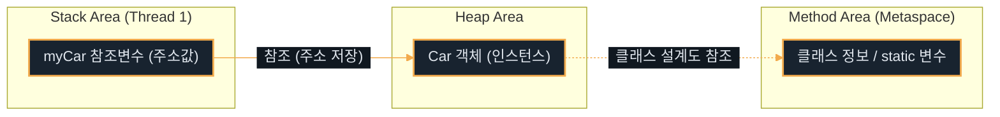
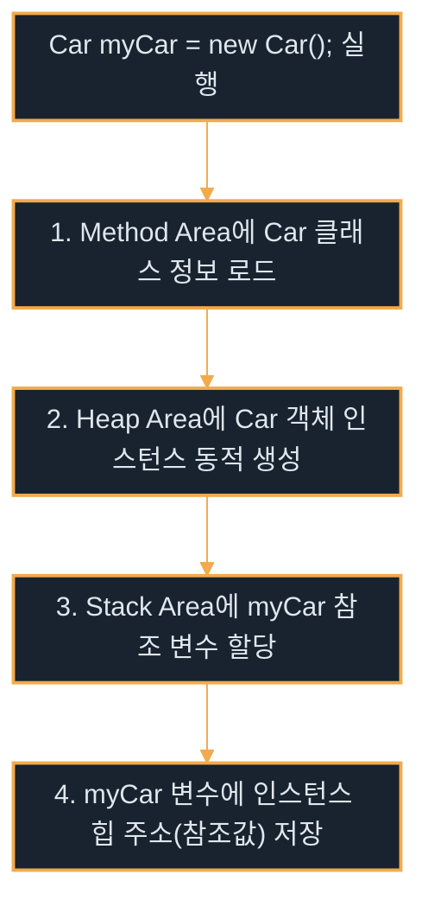
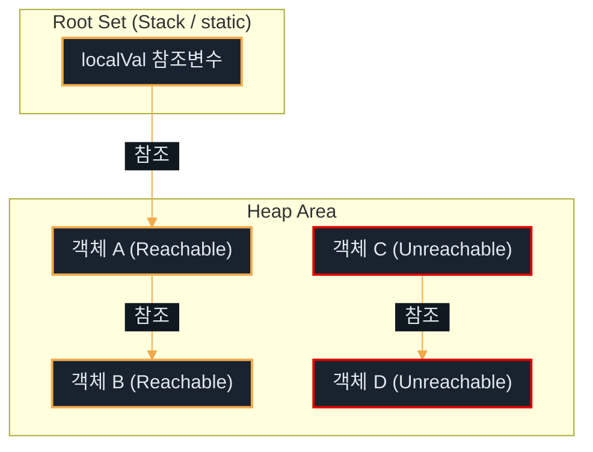

# 객체와 클래스

---
layout: default
---

# 학습 체크리스트

- [ ] 클래스, 객체, 인스턴스의 정의와 메모리 할당 차이
- [ ] 멤버 변수(인스턴스 변수)와 지역 변수의 스코프 및 Lifecycle 구분
- [ ] 생성자 호출 메커니즘과 기본 생성자 자동 주입 조건 숙지
- [ ] `this` 참조와 `this()` 생성자 체이닝 활용법 습득
- [ ] 메서드 시그니처, 가변인자, 오버로딩의 성립 조건 이해

---
layout: cover
class: text-center
---

# JVM과 3대 메모리 영역

---
layout: default
---

# JVM (Java Virtual Machine)

> **JVM (자바 가상 머신)**
>
> 컴파일된 Java 바이트코드(`.class` 파일)를 실행하기 위해 컴퓨터의 물리적인 메모리 상에 가상의 실행 환경을 제공하는 프로그램

- **OS 독립성 제공**: 개발자가 작성한 프로그램이 특정 OS(Windows, macOS, Linux 등)에 종속되지 않음
- **WORA 실현**: "Write Once, Run Anywhere" — 소스코드 수정 없이 어느 OS에서나 동일하게 동작 가능
- **메모리 자동 관리**: 가비지 컬렉터(GC)를 통해 개발자가 직접 메모리를 해제하지 않도록 지원

---
layout: default
---

# 3대 핵심 메모리 영역 개요

| 메모리 영역 | 주요 적재 대상 | 생명 주기 (Lifecycle) | 공유 범위 |
| :--- | :--- | :--- | :--- |
| **메서드 영역** | 클래스 메타데이터, static 변수, 상수 풀 | JVM 기동 ~ 프로그램 종료 | 모든 스레드 공유 |
| **힙 영역** | `new` 연산자로 생성된 인스턴스, 배열 | 생성 시점 ~ 가비지 컬렉터(GC) 수거 | 모든 스레드 공유 |
| **스택 영역** | 지역 변수, 매개변수, 연산 임시 값 | 메서드 호출(Push) ~ 메서드 종료(Pop) | 스레드별 개별 소유 |

---
layout: default
---

# 1. 메서드 영역 (Method Area)

- **클래스 로딩**: JVM이 기동되며 `.class` 파일의 바이트코드를 읽을 때 생성 및 보관되는 공간
- **적재 정보**: 클래스 구조(메타데이터), 메소드 바이트코드, 상수 풀(Constant Pool)
- **static 변수 관리**: 클래스 레벨의 공유 변수인 `static` 변수가 적재되며 프로그램 종료 시까지 유지
- **영역 특성**: 모든 스레드가 이 메모리 영역을 공유하여 접근 가능

---
layout: default
---

# 2. 힙 영역 (Heap Area)

- **동적 메모리 할당**: JVM 실행 중 런타임에 동적으로 생성되는 데이터의 보관 장소
- **적재 정보**: `new` 키워드로 할당된 인스턴스(객체) 및 배열
- **가비지 컬렉터(GC) 관리**: 참조가 끊어져 Unreachable 상태가 된 객체는 GC가 감지하여 수거
- **영역 특성**: 모든 스레드가 동일한 힙 영역을 공유하므로 멀티스레드 동기화 이슈의 대상이 됨

---
layout: default
---

# 3. 스택 영역 (Stack Area)

- **스레드 개별 영역**: 각 스레드가 고유하게 생성하여 독립적으로 관리하는 메모리
- **프레임(Frame) 단위 작동**: 메서드가 호출될 때 프레임이 Push되고, 메서드가 완료(리턴)되면 즉시 Pop되어 메모리 자동 정리
- **적재 정보**: 메서드 내의 지역 변수, 매개변수, 연산 결과 보관용 임시 값
- **명시적 초기화 필요**: 스택 내부의 지역 변수는 기본값이 지정되지 않으므로 사용 전 반드시 명시적 초기화가 강제됨

---
layout: default
---

# JVM 3대 메모리 관계도



---
layout: cover
class: text-center
---

# 객체와 클래스

---
layout: default
---

# 클래스, 객체, 인스턴스

> **클래스 (Class)**
>
> 객체를 생성하기 위한 설계도(템플릿)로, 물리적인 메모리를 차지하지 않는 논리적 틀

> **인스턴스 (Instance)**
>
> 설계도인 클래스로부터 JVM의 힙(Heap) 영역에 실제 메모리를 할당받아 고유한 상태값을 가지게 된 구체적인 실체

- **객체 (Object)**: 클래스를 토대로 구현될 수 있는 모든 실체(구체적 대상체)를 지칭하는 포괄적 용어

---
layout: default
---

# 개념 간 비교 정리

| 구분 | 클래스 (Class) | 객체 (Object) | 인스턴스 (Instance) |
| :--- | :--- | :--- | :--- |
| **역할** | 개념 설계도 (Template) | 대상체 (Concept) | 메모리에 실체화된 객체 |
| **메모리** | 할당 안 됨 (논리적 정보) | 논리적 / 물리적 혼용 | 힙(Heap) 영역에 할당 |
| **예시** | `class Car` 정의 | "자동차"라는 개념 | `new Car()`로 만들어진 실체 |

---
layout: default
---

# 객체 생성 과정의 메모리 매핑

- **선언과 할당**: `Car myCar = new Car();`
- **Stack 영역**: 참조 변수 `myCar`가 생성되며, 힙 메모리에 생성된 실제 인스턴스의 시작 주소값을 저장
- **Heap 영역**: `new` 연산자에 의해 `Car` 클래스 인스턴스가 동적 할당되며, 필드(멤버 변수) 공간 확보
- **Method 영역**: `Car` 클래스의 메타데이터 및 메서드 바이트코드가 로드되어 공유 참조 가능 상태로 대기

---
layout: default
---

# 객체 생성의 메모리 매핑 흐름



---
layout: default
---

# 파일명과 클래스명 일치 규칙

- **파일명 일치 원칙**: 자바 소스 파일(`.java`) 내에 `public class`가 선언된 경우, 클래스명과 소스 파일명은 대소문자까지 일체형으로 동일해야 함
- **컴파일 제약**: 예컨대 `public class Car {}`는 반드시 `Car.java` 파일에 저장되어야 하며, 불일치 시 컴파일 에러 발생
- **단일 파일 제약**: 하나의 소스 파일 안에는 `public` 클래스가 오직 **단 하나**만 존재할 수 있음

---
layout: default
---

# 다중 클래스 정의 제약

- **비공개 클래스 동거**: 하나의 `.java` 파일 내에 `public`이 붙지 않은 클래스들은 추가 선언 가능
- **컴파일 개별 산출**: 파일 컴파일 시, 단일 소스 파일 내부라 하더라도 각 클래스별로 독립된 `.class` 바이트코드 파일이 각각 생성됨
- **실무 표준 개발 규칙**: 소스 관리의 용이성, 가독성, 유지보수 효율을 극대화하기 위해 **1개 파일당 1개 클래스 선언**을 정석으로 삼음

---
layout: cover
class: text-center
---

# 변수와 스코프, 생성자, this

---
layout: default
---

# 멤버 변수와 지역 변수의 특징

| 구분 | 멤버 변수 (인스턴스 변수) | 지역 변수 (Local Variable) |
| :--- | :--- | :--- |
| **선언 위치** | 클래스 블록 내부 | 메서드, 생성자, 초기화 블록 내부 |
| **메모리 위치** | 힙(Heap) 영역 (인스턴스 내부) | 스택(Stack) 영역 (스레드 프레임) |
| **초기화 정책** | 미지정 시 데이터 타입 기본값 자동 대입 | 자동 초기화 없음 (선언 후 사용 시 에러) |
| **기본 초기값** | `0`, `0.0`, `false`, `null` 등 | 없음 |

---
layout: default
---

# 변수의 메모리 수명 (Lifecycle)

- **멤버 변수 (인스턴스 변수)**:
  - **생성**: `new` 연산자로 인스턴스가 힙에 생성되는 시점에 메모리 확보
  - **소멸**: 인스턴스를 더 이상 아무도 참조하지 않아 가비지 컬렉터(GC)에 의해 소멸되는 시점
- **지역 변수 (Local Variable)**:
  - **생성**: 해당 변수가 선언된 코드 블록`{ }`에 제어 흐름이 도달하여 스택에 로드될 때
  - **소멸**: 선언된 코드 블록`{ }`을 벗어나는 즉시 스택 프레임 정리와 함께 소멸

---
layout: default
---

# 생성자 (Constructor)

- **핵심 역할**: 인스턴스 생성 시점에 힙 메모리 상의 변수들을 초기화하고 필수적인 설정을 보장하는 특수 메서드
- **선언 제약**: 반환 타입(Return Type) 자체가 아예 선언되지 않으며, 메서드명은 소속 클래스명과 완벽히 일치해야 함
- **호출 메커니즘**: `new` 연산자를 통해서 객체를 메모리에 적재할 때 자동으로 단 한 번 호출됨

---
layout: default
---

# 기본 생성자 (Default Constructor)

- **자동 주입**: 클래스 소스파일 내부에 어떠한 형태의 생성자도 직접 선언되어 있지 않을 때, 자바 컴파일러가 매개변수와 수행문이 비어 있는 기본 생성자를 컴파일 타임에 자동 삽입
- **주입 중단 조건**: 클래스 내부에 매개변수가 있는 생성자가 **단 하나라도 명시적으로 정의되는 즉시** 기본 생성자의 자동 주입은 차단됨

---
layout: default
---

# this 키워드

- **개념 정의**: 힙(Heap) 메모리 상에 동적으로 생성된 인스턴스 자기 자신을 가리키는 고유한 참조 주소값
- **가장 흔한 활용**: 메서드 매개변수(Parameter)명과 멤버 변수명이 동일할 경우, 둘을 구별하기 위해 멤버 변수명 앞에 `this.` 접두사 부착
- **사용 대상 제한**: 인스턴스가 없는 static 메서드 내부에서는 인스턴스를 가리키는 `this` 호출 불가능

---
layout: default
---

# 생성자 체이닝 (this())

- **코드 중복 제거**: 같은 클래스 내의 다른 생성자를 연쇄적으로 호출하여 공통된 초기화 로직을 일괄 처리할 수 있도록 지원
- **구조적 배치 제약**: `this()` 호출문은 호출하는 생성자 블록의 **반드시 첫 번째 라인**에 단독 기입되어야 함

---
layout: default
---

## 생성자 연쇄 호출 처리

```java
public class Member {
    String name; int age;
    public Member(String name) {
        this(name, 20); // 다른 생성자 호출 (첫 줄 배치)
    }
    public Member(String name, int age) {
        this.name = name; this.age = age;
    }
}
```

---
layout: cover
class: text-center
---

# 메서드와 오버로딩

---
layout: default
---

# 메서드 선언 구조

- **접근 제어자**: 메서드를 호출할 수 있는 범위를 `public`, `protected`, `private` 등으로 지정
- **반환 타입**: 실행 결과로 돌려줄 값의 타입을 작성하며, 반환값이 없으면 `void` 사용
- **메서드명**: 수행할 동작을 드러내는 이름으로 작성하고 호출할 때 동일한 이름 사용
- **매개변수 목록**: 외부에서 받을 값의 `타입 이름`을 쉼표로 구분하여 선언

---
layout: default
---

## 입력을 받아 결과를 반환하는 메서드

```java
public int add(int left, int right) {
    int result = left + right;
    return result;
}
```

---
layout: default
---

# 메서드 시그니처 (Method Signature)

> **메서드 시그니처 (Method Signature)**
>
> 컴파일러가 메서드를 서로 구별하는 기준인 **메서드명과 매개변수 타입·순서**의 조합

- **포함 요소**: 메서드명, 매개변수의 타입·순서·개수
- **제외 요소**: 매개변수명, 반환 타입, 접근 제어자는 시그니처에 포함되지 않음
- **호출 연결**: 전달한 인자의 타입과 순서를 바탕으로 일치하는 메서드 선택

---
layout: default
---

# 매개변수와 인자

- **매개변수 (Parameter)**: 메서드 선언부에서 입력을 받기 위해 정의한 지역 변수
- **인자 (Argument)**: 메서드를 호출할 때 매개변수에 실제로 전달하는 값
- **타입과 순서 일치**: 각 인자는 대응하는 매개변수에 대입 가능한 타입이어야 함
- **사용 범위**: 매개변수는 해당 메서드 블록 내부에서만 사용할 수 있음

---
layout: default
---

# 반환 타입과 return

- **반환 타입 일치**: `return` 값은 선언된 반환 타입에 대입할 수 있어야 함
- **반환 즉시 종료**: `return`이 실행되면 남은 문장을 건너뛰고 호출 위치로 제어가 이동
- **void 메서드**: 반환값이 없으며 `return;`으로 실행만 조기에 종료 가능
- **반환 경로 보장**: `void`가 아닌 메서드는 가능한 모든 실행 경로에서 값을 반환해야 함

---
layout: default
---

# 가변인자 (Varargs)

> **가변인자 (Variable Arguments)**
>
> 같은 타입의 인자를 호출할 때마다 0개 이상 유연하게 전달할 수 있는 매개변수 문법

- **선언 문법**: `타입... 이름` 형태로 작성하며 메서드 내부에서는 배열처럼 사용
- **배치 제약**: 매개변수 목록의 마지막에만 선언할 수 있고 한 메서드에 하나만 허용
- **호출 방법**: 값을 쉼표로 나열하거나 같은 타입의 배열을 직접 전달

---
layout: default
---

## 전달 개수가 달라도 처리하는 메서드

```java
public int sum(int... numbers) {
    int total = 0;
    for (int number : numbers) total += number;
    return total;
}
```

---
layout: default
---

# 메서드 오버로딩 (Overloading)

- **정의**: 동일한 이름을 갖는 메서드라도 매개변수의 사양을 각기 다르게 하여 여러 개 선언하는 다형성 구현 방법
- **오버로딩 성립 조건**:
  - 매개변수의 **타입**이 다름
  - 매개변수의 **개수**가 다름
  - 매개변수의 **순서**가 다름
- **호출 매칭**: 컴파일 타임에 인자값 타입을 기준으로 매핑될 메서드가 정적으로 결정됨

---
layout: default
---

# 오버로딩 불가 요건

- **반환 타입 무관**: 메서드의 **반환 타입** (Return Type)만 다르고 매개변수가 같을 경우 오버로딩이 성립하지 않으며 컴파일 에러 발생
- **접근 제어자 무관**: 메서드의 **접근 제어자** (Access Modifier)만 다른 경우 역시 오버로딩으로 인정되지 않음
- **원인**: 호출하는 시점에 단순히 메서드를 구별할 기준이 매개변수의 형태뿐이기 때문

---
layout: default
---

# Java Parameter Passing

- **100% Call by Value**: 자바의 모든 변수 전달 방식은 **값 복사(Call by Value) 방식** 단 한 가지만 존재함
- **전달의 대상**: 변수가 스택 프레임에 실제로 보유하고 있는 데이터 리터럴 값 또는 객체의 주소값 자체가 고스란히 복사되어 수신 측 매개변수로 흘러감
- **구별 기준**: 매개변수의 자료형이 기본 타입(Primitive)인가, 참조 타입(Reference)인가에 따라 조작 결과가 다르게 체감됨

---
layout: default
---

# 기본 타입(Primitive) 값 전달

- **복사 방식**: 스택 프레임 내부에 기입된 원시 리터럴 값 자체가 복사되어 수신 메서드의 지역 변수로 할당됨
- **원본 격리**: 수신 메서드 내부에서 해당 값을 수정 및 재대입하여도, 호출한 송신 측 스택 프레임 상의 원본 변수에는 어떠한 파동도 미치지 않음

---
layout: default
---

# 참조 타입(Reference) 값 전달

- **복사 방식**: 스택에 저장되어 있는 **'힙 영역의 객체 시작 주소값'** (참조값 복사본)이 메서드의 매개변수로 전달됨
- **상태 전이**: 두 참조 변수가 힙(Heap) 영역 내의 동일한 객체 주소를 가리키고 있기 때문에, 수신 메서드 내에서 매개변수를 통해 객체 속성을 수정하면 원본 객체 상태도 동일하게 바뀜

---
layout: default
---

# 참조 변수 자체 대입의 한계

- **주소 분리**: 메서드 내부에서 매개변수 참조 변수에 새로운 객체를 대입(`param = new Car()`)하더라도, 이는 수신 측 메서드 스택 프레임 내 복사된 주소 변수의 지향점만 바꾼 것임
- **영향 범위**: 송신 측의 원본 참조 변수는 여전히 기존 객체의 주소를 들고 있으며, 새로운 객체 할당의 영향을 일체 받지 않음

---
layout: cover
class: text-center
---

# static 키워드

---
layout: default
---

# static 멤버와 공유 구조

- **클래스 종속**: `static` 지시어가 부착된 필드와 메서드는 개별 인스턴스에 속하지 않고, 클래스 자체에 단 하나만 배속되어 관리됨
- **로딩 시점 적재**: JVM 기동 후 클래스 정보가 로딩되는 즉시 **메서드 영역** (Method Area)에 단 한 번 상시 고정 확보됨
- **인스턴스 무관**: 객체를 따로 `new`로 찍어내지 않더라도 `클래스명.정적멤버` 경로를 통해 공통 자원에 무제한 즉시 접근 가능

---
layout: default
---

# 정적 멤버와 인스턴스 멤버의 비교

| 구분 | 정적 멤버 (static) | 인스턴스 멤버 (Non-static) |
| :--- | :--- | :--- |
| **배속 기준** | 클래스 단위 | 개별 인스턴스 객체 단위 |
| **저장 영역** | 메서드 영역 (Method Area) | 힙 영역 (Heap Area) |
| **접근 방법** | `ClassName.member` (권장) | `instanceName.member` |
| **생성 시점** | 클래스 로딩 시점 (프로그램 시작 시) | 인스턴스 생성 시 (`new` 호출 시) |

---
layout: default
---

# 정적 메서드의 제약 조건

- **인스턴스 접근 불가**: static 메서드는 힙에 실제 인스턴스가 단 하나도 활성화되지 않은 클래스 로드 시점부터 호출이 가능함
- **인스턴스 멤버 접근 차단**: 따라서 static 메서드 내부에서는 인스턴스 변수나 인스턴스 메서드를 **직접 가져와 사용할 수 없음**
- **this 사용 불가**: 호출 주체 자체가 특정 인스턴스가 아니기 때문에 인스턴스를 뜻하는 지칭 키워드 `this`도 static 메서드 내부에서 사용 불가능

---
layout: cover
class: text-center
---

# 가비지 컬렉터 (GC)

---
layout: default
---

# 가비지 컬렉터를 통한 자동 관리

- **자동 해제**: 개발자가 코드상에서 객체를 명시적으로 해제할 필요가 없으며, JVM의 가비지 컬렉터가 백그라운드에서 메모리를 주기적으로 소거함
- **소거 대상**: 힙(Heap) 영역에 상주하는 객체 중, 프로그램 내에서 더 이상 참조하지 않아 생명이 소진된 가비지 대상 인스턴스
- **작동 타이밍**: 메모리가 부족하거나 특정 임계점에 도달했을 때 JVM 시스템의 판단에 의해 활성화됨

---
layout: default
---

# 도달 가능성 (Reachability)

- **Reachable (도달 가능)**: 실행 스레드의 스택 지역 변수나 메서드 영역의 static 변수 등에서 출발해, 참조 링크를 타고 어떻게든 찾아갈 수 있는 생존 인스턴스
- **Unreachable (도달 불가)**: 참조 사슬이 끊겨 프로그램 내에서 어떠한 경로로도 도달·접근할 수 없어 소멸 대기 상태가 된 인스턴스
- **Root Set**: Reachability를 판정하는 출발점 (스택의 로컬 참조 변수, JNI 참조, Metaspace의 static 참조 등)

---
layout: default
---

# Reachability 참조 추적 구조



---
layout: cover
class: text-center
---

# 내부 클래스

---
layout: default
---

# 중첩 클래스의 네 가지 갈래

| 유형 | 특징 및 선언 위치 | 외부 인스턴스 의존성 |
| :--- | :--- | :--- |
| **인스턴스 내부 클래스** | 클래스 멤버 레벨에 비정적(`static` 없음)으로 정의 | 아웃터 객체가 먼저 있어야 인스턴스화 가능 |
| **정적 내부 클래스 (static)** | 클래스 멤버 레벨에 `static` 지정 하에 정의 | 아웃터 객체 없이 단독 생성 가능 |
| **지역 클래스 (Local)** | 메서드나 초기화 블록 내부에 한정 정의 | 메서드 스코프 안에서만 수명 한정 |
| **익명 클래스 (Anonymous)**| 일회용으로 클래스 정의와 객체 생성을 동시 수행 | 인터페이스 구현 및 이벤트 리스너에 다용 |

---
layout: default
---

# 아웃터 참조와 메모리 누수

- **바깥 객체 참조 누출**: 비정적 내부 클래스(일반 Inner Class)의 인스턴스는 생성될 때 자신을 소유한 바깥 객체(Outer)를 향한 **숨겨진 참조 주소**(`Outer.this`)를 강제로 품게 됨
- **소거 방해**: 바깥 객체(Outer)가 역할이 끝나 프로그램에서 버려졌더라도, 내부 클래스의 인스턴스가 외부에 이벤트 리스너 등으로 묶여 참조되고 있다면 바깥 객체도 GC가 메모리에서 해제하지 못함
- **결과**: 메모리가 낭비 및 누수되는 치명적인 누수(Memory Leak) 유발

---
layout: default
---

# static 내부 클래스를 이용한 안전 설계

- **아웃터 참조 제거**: 내부 클래스가 바깥 클래스 인스턴스 필드를 활용할 필요가 전혀 없다면, 무조건 **정적 내부 클래스**(`static`)로 선언하는 것이 정석
- **동작 특징**: static 내부 클래스는 바깥 객체에 대한 암묵적 지향점(`Outer.this`)을 물리적으로 해제하므로 메모리 누수 위험이 완벽히 봉쇄됨

---
layout: default
---

## 내부 클래스 안전 선언

```java
public class Outer {
    // 바깥 참조를 자동으로 물고 있어 GC 해제 불가 우려
    public class MemoryLeakInner {}

    // 아웃터 참조가 제거되어 독립 생존이 가능한 정석
    public static class SafeStaticInner {}
}
```
