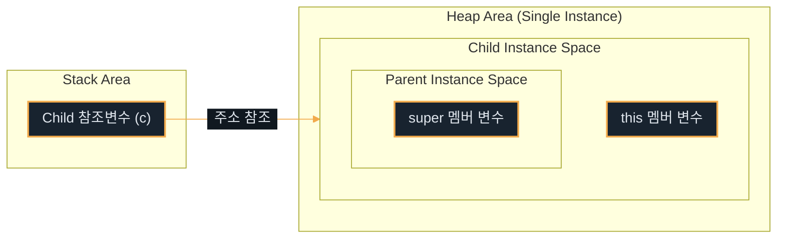

# 추상화와 다형성 I

---
layout: default
---

# 학습 체크리스트

- [ ] 패키지 네임스페이스와 임포트 와일드카드 사용 시의 리스크 이해
- [ ] 접근 제어자 4단계의 스코프 차이 및 캡슐화 설계 원칙 숙지
- [ ] Getter/Setter의 역할과 자율적 객체를 위한 행위 메서드 설계법 습득
- [ ] 상속 객체 생성 시 JVM 메모리 구조 및 super/super() 호출 조건 이해
- [ ] 메서드 오버라이딩 규칙과 정적/동적 바인딩의 다형성 메커니즘 체화

---
layout: cover
class: text-center
---

# 패키지와 임포트

---
layout: default
---

# 패키지 (Package)

- **물리적 경로**: 클래스 파일들이 보관되는 파일 시스템의 폴더 구조를 지칭
- **네임스페이스 관리**: 고유한 네임스페이스를 제공하여 서로 다른 패키지에 속한 동일 이름의 클래스 충돌 방지
- **격리 지원**: 패키지 단위로 접근 제어를 적용하여 클래스의 노출 범위를 안전하게 차단

---
layout: default
---

# 임포트 (Import)

- **경로 명시**: 다른 패키지에 정의된 외부 클래스를 사용하기 위해 컴파일러에게 클래스의 전체 패키지 경로를 선언하는 구문
- **와일드카드 리스크**: `import java.util.*;`와 같이 사용 시 간결하지만 클래스명 중복 시 문제 발생
- **이름 충돌 사례**: `java.util.Date`와 `java.sql.Date`가 둘 다 와일드카드로 선언될 경우, 모호성 컴파일 에러 발생
- **실무 설계 권장**: 명확성과 유지보수를 위해 핵심 클래스는 풀 패키지 경로를 개별 선언하는 것이 유리

---
layout: default
---

# static import

- **멤버 명칭 단독 호출**: 특정 클래스의 static 변수나 static 메서드 호출 시 클래스명을 생략할 수 있게 해주는 선언
- **가독성 향상**: 테스트 코드의 단언문 (`Assertions.assertThat`) 등 공통 static 유틸리티 메서드 작성 시 빈번히 활용

---
layout: default
---

## 정적 임포트 호출 처리

```java
import static java.lang.Math.max;

public class App {
    public void run() {
        int maxVal = max(10, 20); // Math 생략 가능
    }
}
```

---
layout: cover
class: text-center
---

# 접근 제어자

---
layout: default
---

# 정보 은닉 (Information Hiding)

- **캡슐화 제어**: 클래스, 필드, 메서드, 생성자의 노출 스코프를 제한하여 객체의 정합성을 지키는 제어 도구
- **private**: 오직 해당 멤버가 선언된 클래스 내부에서만 접근 허용 (외부 격리)
- **default** (package-private): 동일한 패키지 폴더 내부의 클래스 사이에서만 사용 허용
- **protected**: 동일 패키지 내부, 또는 다른 패키지라도 상속을 맺은 하위 클래스 내부에서 접근 허용
- **public**: 모든 클래스, 모든 패키지 영역에서 조건 없는 노출과 공유 허용

---
layout: default
---

# 접근 수준 4단계 요약

| 접근 제어자 | 클래스 내부 | 동일 패키지 | 하위 클래스 (상속) | 전체 영역 |
| :--- | :--- | :--- | :--- | :--- |
| **private** | O | X | X | X |
| **default** | O | O | X | X |
| **protected** | O | O | O (상속 관계 한정) | X |
| **public** | O | O | O | O |

---
layout: default
---

# 캡슐화 설계 규칙

- **필드 격리**: 외부 객체가 클래스의 내부 필드를 조작하여 정합성을 깨뜨리는 상황을 원천 방지
- **최소 노출 원칙**: 모든 멤버 변수는 무조건 가장 폐쇄적인 `private` 수준으로 먼저 격리하는 것이 정석
- **인터페이스 개방**: 객체의 상태 변경과 상호작용은 검증 과정을 거쳐 안전하게 마련된 최소한의 public 메서드로만 개방

---
layout: cover
class: text-center
---

# 접근자 (Getter / Setter)

---
layout: default
---

# Getter와 Setter

- **Getter**: `private` 필드 데이터를 안전하게 조회할 수 있도록 제공하는 읽기 전용 접근 통로
- **Setter**: 값 유효성을 사전에 검증하여 필드 상태를 변경하도록 지원하는 대입용 public 관례 메서드

---
layout: default
---

# Setter 남용 시의 폐해

- **무제한 대입 개방**: 롬복 (`@Setter`) 등으로 모든 멤버 변수에 Setter를 두는 습관은 객체 캡슐화를 치명적으로 저해
- **스파게티화**: 외부에서 임의로 객체 상태를 마구 덮어씌울 수 있어 상태 오염 시 추적 및 변경점 확인이 불가능
- **Anemic Domain Model**: 스스로 아무런 규칙적 행동을 하지 못하고 오직 상태 조작만 당하는 수동적 객체를 양산하게 됨

---
layout: default
---

# 행위 중심 설계 지향

- **Setter 제거**: 단순 상태 덮어쓰기 식의 Setter 메서드를 전격 삭제
- **자율성 보장**: 비즈니스 의도가 뚜렷하게 반영된 **행위 메서드** (도메인 메서드)를 제공하여 객체 스스로 상태를 바꾸도록 유도
- **의미 중심**: 데이터 복사·대입이 아닌 '역할과 비즈니스 행동'을 인터페이스로 노출

---
layout: default
---

## 무분별한 Setter 노출 사례

```java
// 자율성이 상실된 나쁜 코드 설계
member.setGrade("VIP");
member.setPoint(member.getPoint() + 10000);
```

---
layout: default
---

## 비즈니스 행위 메서드 정의

```java
// 스스로 상태를 변경하는 안전한 객체 설계
member.promoteToVip();
member.accumulatePoints(10000);
```

---
layout: cover
class: text-center
---

# 상속과 메모리 구조

---
layout: default
---

# 상속 (Inheritance)의 정의와 원칙

- **정의** (`extends`): 상위 클래스(Super Class)의 멤버 변수와 메서드를 물려받아 하위 클래스(Sub Class)가 확장하여 재사용하는 OOP 기능
- **단일 상속 원칙**: 클래스 다중 상속 시 발생하는 **다이아몬드 문제** (다중 부모의 메서드명 중복 시 모호해지는 현상)를 원천 차단하기 위해 단일 상속만 지원

---
layout: default
---

# 상속의 JVM 메모리 배치

- **선언과 생성**: `Child c = new Child();` 실행 시 힙(Heap) 영역에 객체 인스턴스 적재
- **이중 적재 구조**: 힙에 메모리 영역을 잡을 때, 부모(Parent) 객체 공간을 먼저 생성하고 그 주위로 자식(Child) 객체 영역을 결합하여 생성
- **단일 주소 블록**: 부모와 자식 인스턴스가 물리적으로 하나의 단일 메모리 블록 내부에 결합해 공존하므로, 하나의 주소 참조를 통해 상위 부모 멤버에 즉시 도달할 수 있음

---
layout: default
---

# 객체 생성 시 메모리 매핑 구조



---
layout: default
---

# super 참조와 super()

- **super 참조**: 하위 클래스에서 이름이 겹치는 부모 클래스의 멤버 변수나 오버라이딩 전 원본 메서드를 특정하여 가리키는 참조 식별자
- **super() 생성자 호출**: 부모 객체가 먼저 힙 메모리에 초기화되어야 하므로, 자식 생성자 블록의 **반드시 첫 번째 라인**에 부모 생성자 호출문 기입
- **컴파일러 자동 주입**: 생성자 첫 줄에 명시가 없는 경우 매개변수가 없는 `super()`를 컴파일러가 자동 주입. 부모에게 기본 생성자가 없고 매개변수 생성자만 있다면 반드시 자식 생성자에서 직접 알맞은 부모 생성자 (`super(args)`)를 호출해야 컴파일 성공

---
layout: default
---

## 부모 생성자 수동 명시 호출

```java
public class Child extends Parent {
    private String name;
    public Child(String familyName, String name) {
        super(familyName); // 첫 줄 호출 강제
        this.name = name;
    }
}
```

---
layout: default
---

# 상속 vs 합성

- **Is-A 관계** (상속): "하위는 상위 클래스이다"가 자연스러운 규칙일 때 채택 (예: `Dog is an Animal`)
  - **단점**: 부모-자식 간 결합이 강해져 부모 설계 변경 시 자식이 통째로 오작동하고 캡슐화가 흐려짐
- **Has-A 관계** (합성): "클래스 A가 클래스 B를 가진다"의 구조일 때 적용 (예: `Car has an Engine`)
  - **구조**: 멤버 변수 필드로 타 객체의 참조 주소를 소유하여 사용
- **실무 설계 원칙**: 다형적 인터페이스 확장이 목적이 아닌 단순 코드 재사용만을 위함이라면, 결합도가 낮아 부품 교체가 유연한 **합성** (Composition)을 최우선 적용함

---
layout: cover
class: text-center
---

# 메서드 오버라이딩

---
layout: default
---

# 메서드 오버라이딩 (Overriding)

- **정의**: 부모 클래스로부터 제공받은 메서드의 처리 로직을 자식 클래스 내부에서 다시 재정의하는 오버라이드 기법
- **시그니처 일치**: 메서드 명칭, 매개변수 사양 (타입, 순서, 개수)이 부모의 원본과 완벽하게 똑같아야 함
- **공변 반환 타입**: JDK 5+ 이후부터, 부모 메서드 반환 타입의 자식 하위 호환 타입으로 변환하는 리턴형 재정의 허용

---
layout: default
---

# 오버라이딩 제약 사항

- **접근 제어자 확장 제한**: 부모가 선언한 접근 수준보다 좁은 스코프로 오버라이딩 변경 불가 (예: `protected` -> `private` 차단)
- **예외 선언 제한**: 부모가 던지는 예외 범주보다 더 상위의 Checked Exception을 하위 메서드에서 새로 선언 불가

---
layout: default
---

# @Override 애노테이션

- **컴파일러 검증**: 선언된 메서드가 부모 클래스의 메서드를 올바르게 오버라이딩하는지 컴파일러가 강제 체크
- **실수 예방**: 부모 메서드명이나 매개변수 타입을 잘못 기입했을 때, 단순 오버로딩(새로운 메서드 추가)으로 오처리되는 현상 방지
- **가독성 확보**: 소스코드를 읽는 다른 개발자에게 이 메서드가 상속받아 재정의된 것임을 즉각 전달

---
layout: default
---

## 오버라이딩 실수 방지 예시

```java
public class Child extends Parent {
    // 오타 발생 시 컴파일러가 "부모에 해당 메서드가 없음" 에러 검출
    @Override
    public void printInfo() { 
        System.out.println("Child");
    }
}
```

---
layout: cover
class: text-center
---

# 정적 바인딩과 동적 바인딩

---
layout: default
---

# 바인딩 (Binding)의 두 갈래

- **개념**: 메서드 호출문과 해당 실행 코드가 상주하는 실제 메모리 기계어 주소를 연결하는 행위
- **정적 바인딩** (Static Binding): 컴파일 시점에 실행될 메서드 주소가 결정됨. `private`, `final`, `static` 메서드와 모든 멤버 변수 (필드)가 대상
- **동적 바인딩** (Dynamic Binding): 컴파일 시에는 판단을 보류하고, 실행 (런타임) 도중 실제 가리키고 있는 객체 타입을 추적해 메서드 호출 주소 결정. 일반 인스턴스 메서드가 대상

---
layout: default
---

# 두 바인딩의 차이점 요약

| 구분 | 정적 바인딩 (Static) | 동적 바인딩 (Dynamic) |
| :--- | :--- | :--- |
| **주소 결정 시점** | 컴파일 타임 | 런타임 (실행 중) |
| **대상 멤버** | 필드, `private` / `final` / `static` 메서드 | 오버라이딩 가능한 일반 인스턴스 메서드 |
| **속도** | 결정 비용이 없어 더 빠름 | vtable 참조 조회를 위한 실행 연산 필요 |

---
layout: default
---

# 가상 메서드 테이블 (vtable)

- **주소록 관리**: JVM은 힙 영역에 인스턴스 객체가 적재될 때, 오버라이딩 가능 메서드들의 기계어 포인터를 기록한 **가상 메서드 테이블** (Virtual Method Table)을 유지함
- **참조 추적**: 참조형 타입이 부모 타입이라 하더라도, 런타임에 vtable을 조회하여 자식이 오버라이딩한 실제 자식 메서드 구현 주소를 꺼내어 호출
- **필드 바인딩 예외**: 필드 (멤버 변수)는 vtable을 타지 않고 컴파일 시점의 정적 바인딩 방식을 따르므로, 참조 변수의 선언 타입에 속한 부모 필드를 출력함

---
layout: default
---

## 필드와 메서드의 바인딩 동작 차이

```java
Parent p = new Child();
System.out.println(p.val); // 필드는 정적 바인딩 -> 부모 val
p.printInfo();             // 메서드는 동적 바인딩 -> 자식 printInfo
```
