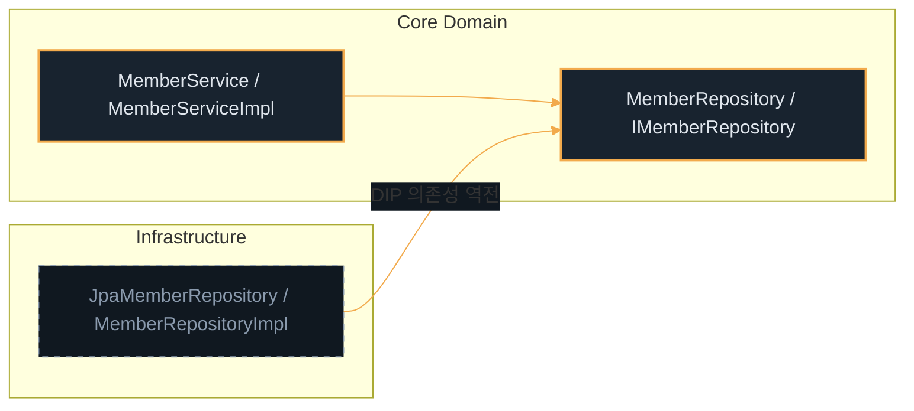

# 추상화와 다형성 II

---
layout: default
---

# 학습 체크리스트

- [ ] 업캐스팅과 다운캐스팅의 형변환 규칙 및 위험성 구분
- [ ] JDK 16+ 패턴 매칭 `instanceof` 활용을 통한 안전한 캐스팅 구현
- [ ] 추상 클래스와 인터페이스의 역할 분담 및 실무적 차이점 비교
- [ ] 추상 골격 구현 클래스 아키텍처 패턴을 통한 보일러플레이트 코드 최적화
- [ ] Wrapper 클래스 오토 박싱 성능 주의점 및 제네릭 타입 이레이저의 런타임 제약 이해

---
layout: cover
class: text-center
---

# 다형성과 참조 타입 캐스팅

---
layout: default
---

# 다형성과 캐스팅 개요

- **다형성** (Polymorphism): 하나의 참조형 변수가 상속 계층상 존재하는 다양한 하위 타입의 인스턴스를 유연하게 참조하는 성질
- **참조 타입 캐스팅**: 참조 변수의 타입을 상위 또는 하위 타입으로 변경하여 다형적 개체의 실제 속성에 도달하는 작업
- **구별 규칙**: 형변환 방향이 상위로 향하는가 (Upcasting), 하위로 향하는가 (Downcasting)에 따라 런타임 안전성이 극명하게 갈림

---
layout: default
---

# 업캐스팅과 다운캐스팅

| 구분 | 업캐스팅 (Upcasting) | 다운캐스팅 (Downcasting) |
| :--- | :--- | :--- |
| **정의** | 하위 객체 주소를 상위 타입 변수에 대입 | 상위 타입 참조를 하위 타입으로 강제 변환 |
| **문법** | 묵시적 자동 변환 가능 | 명시적 강제 형변환 표기 필수 |
| **안전성** | 상위 공간이 항상 존재하므로 100% 안전 | 실제 인스턴스 불일치 시 런타임 에러 발생 |
| **예외** | 없음 | `ClassCastException` 발생으로 프로그램 중단 |

---
layout: default
---

# 참조 타입 캐스팅의 메모리 구조

- **업캐스팅** (묵시적): 자식 인스턴스가 생성될 때 상위 클래스의 메모리 영역이 내부에 함께 할당됨
  - 부모 타입 참조 변수로 자식 객체를 가리키는 동작은 언제나 메모리상으로 안전하므로 묵시적 캐스팅을 허용
- **다운캐스팅** (명시적): 부모 타입 참조 변수가 실제로 가리키고 있는 구체적인 인스턴스 타입을 확인하는 작업
  - 실제 가리키는 객체가 하위 타입과 일치하지 않는 상태에서 강제 형변환 시 `ClassCastException`이 발생하므로 명시적 표기 강제

---
layout: default
---

# 패턴 매칭 instanceof

- **기존 방식의 한계**: `instanceof`로 실제 타입을 검증한 뒤, 조건문 블록 내부에서 다시 하위 타입으로 명시적 캐스팅을 수행해야 하는 보일러플레이트 존재
- **JDK 16+ 개선 방식**: 타입 검증과 동시에 조건절 내에서 다운캐스팅이 완료된 바인딩 변수를 즉각 생성하여 이중 선언 코드를 완전히 소거

---
layout: default
---

## 기존 다운캐스팅 캐스팅 코드

```java
if (obj instanceof String) {
    // 불필요한 이중 캐스팅 작업 진행
    String s = (String) obj; 
    System.out.println(s.toLowerCase());
}
```

---
layout: default
---

## 패턴 매칭을 적용한 타입 캐스팅

```java
if (obj instanceof String s) {
    // 검증과 동시에 s 변수가 생성되어 사용 가능
    System.out.println(s.toLowerCase());
}
```

---
layout: cover
class: text-center
---

# 추상 클래스

---
layout: default
---

## 추상 클래스 및 추상 메서드 선언

```java
public abstract class Animal {
    protected String name; // 상태 보존용 필드
    public abstract void sound(); // 추상 메서드
    public void breathe() { // 일반 메서드 구현
        System.out.println("숨을 쉽니다.");
    }
}
```

---
layout: default
---

# 추상 클래스 (Abstract Class)

- **정의**: 미완성된 구조를 내포하여 단독으로 객체화할 수 없는 설계 템플릿 클래스
- **제어자 선언**: 클래스 선언부에 `abstract` 키워드를 반드시 기입
- **인스턴스 생성 불가**: 불완전한 상태이므로 `new AbstractClass()` 호출 시 컴파일 오류 발생
- **상속 강제**: 자식 클래스가 부모의 추상 메서드를 상속받아 구현을 완전히 채워 넣어야만 실체 사용 가능

---
layout: default
---

# 추상 메서드 (Abstract Method)

- **선언부 전용**: 구현 바디 `{ }`가 존재하지 않고 세미콜론 `;`으로 마치는 메서드
- **구현 책임 위임**: 추상 클래스를 상속받은 자식 구체 클래스는 모든 추상 메서드를 **반드시 오버라이딩**해야 컴파일 성공
- **연쇄 추상화**: 자식 클래스에서 추상 메서드를 구현하지 않는 경우, 자식 클래스 자체도 반드시 `abstract` 클래스로 선언되어야 함

---
layout: default
---

# 추상 클래스의 구성 제약

- **상태 보존**: 일반 클래스와 동일하게 멤버 변수 (인스턴스 필드)를 소유할 수 있어 고유 상태 값을 저장하고 관리 가능
- **일반 메서드 제공**: 하위 클래스들이 공통으로 사용할 수 있는 완성된 일반 메서드 바디 기입 허용
- **단일 상속 제약**: 클래스에 속하므로 `extends`를 통한 단일 상속 규칙을 그대로 따름

---
layout: default
---

# 추상 클래스의 설계 목적

- **불완전한 상태 제약**: 단독으로 객체를 생성할 수 없도록 컴파일 단계에서 차단하여 반드시 상속 후 구현하도록 강제
- **공통 속성 및 구현 공유**: 하위 구체 클래스들이 상속받아 사용할 수 있는 필드 상태와 공통 일반 메서드 로직을 제공
- **동작 가이드라인 제시**: 하위 클래스에서 각기 다르게 구현해야 하는 핵심 기능을 추상 메서드로 정의하여 통일성 유지

---
layout: cover
class: text-center
---

# 인터페이스

---
layout: default
---

## 인터페이스 정의 및 구현

```java
public interface Vehicle {
    int MAX_SPEED = 120; // public static final 상수
    void move(); // public abstract 메서드
    default void stop() { // default 구현 메서드
        System.out.println("정지합니다.");
    }
}
```

---
layout: default
---

# 인터페이스 (Interface)

- **정의**: 객체들이 외부에 공개하여 준수해야 하는 동작들을 선언한 완전한 추상 스펙 설계서
- **멤버 변수 묵시적 규칙**: 정의된 모든 필드는 자동으로 `public static final` 처리되어 전역 상수가 됨
- **메서드 묵시적 규칙**: 정의된 모든 일반 메서드는 자동으로 `public abstract` 가 붙어 바디가 없는 추상 메서드됨
- **실무 명명 관례**: C# 스타일의 접두사(`IRepository`) 혹은 자바 진영의 접미사(`ServiceImpl` 또는 `JpaRepository`) 패턴을 상황에 맞게 차용

---
layout: default
---

# 언어별 인터페이스 개념 차이

| 비교 항목 | Java 인터페이스 | TypeScript 인터페이스 |
| :--- | :--- | :--- |
| **런타임 존재성** | 바이트코드에 실체로 상주하며 다형성 주도 | 컴파일 이후 완전히 제거되어 흔적 없음 |
| **타입 시스템** | 명시적 선언 (Nominal) 기반의 동적 바인딩 | 구조적 형태 (Structural) 검증용 정적 타입 |
| **바인딩 동작** | vtable을 매개로 런타임에 동적 매핑 처리 | 런타임 바인딩 동작과 직접 무관함 |

---
layout: default
---

# 인터페이스 스펙의 진화

- **디폴트 메서드** (`default`): 인터페이스 내부에서 완성된 구현 바디 `{ }`를 탑재할 수 있는 메서드 (하위 호환성 유지 목적)
- **정적 메서드** (`static`): 인터페이스 이름으로 인스턴스 없이 즉시 호출하는 유틸리티적 메서드 제공
- **비공개 메서드** (`private`): 디폴트나 정적 메서드 내부에서 공통 로직을 캡슐화하여 숨길 수 있는 프라이빗 메서드 (JDK 9+)

---
layout: default
---

# 인터페이스의 설계 목적

- **결합도 완화 (Loose Coupling)**: 구체적인 구현 클래스 대신 인터페이스 규격에 의존하도록 설계하여 코드 간의 결합도를 낮춤
- **역할 정의**: 클래스의 본질적 계통(Is-A)과 관계없이, 객체가 수행할 수 있는 부가적인 행위 계약(Contract)을 선언
- **다중 구현 지원**: 여러 인터페이스를 구현함으로써 하나의 클래스가 다양한 참조 타입으로 동작할 수 있도록 다형성을 극대화

---
layout: default
---

# 인터페이스와 설계 원칙 (SOLID)

- **DIP (의존성 역전)**: 구체 클래스가 아닌 인터페이스에 의존하게 하여 클래스 간의 직접적인 결합을 해제
- **ISP (인터페이스 분리)**: 거대한 인터페이스를 클라이언트 목적에 맞게 세분화하여 불필요한 메서드 의존을 차단
- **OCP (개방-폐쇄)**: 기존 호출부 코드를 변경하지 않고 새로운 인터페이스 구현 클래스를 추가하여 기능 확장

---
layout: default
---

# 클린 아키텍처와 의존성 역전

- **도메인 보호**: 도메인 핵심 비즈니스(Use Case)가 하부 기술(DB, UI 등)의 변화에 영향을 받지 않도록 인터페이스 경계 설정
- **의존성 방향 통제**: 제어 흐름과 관계없이, 모든 소스코드 의존성은 외곽 세부사항에서 안쪽의 핵심 도메인 영역을 향하게 역전
- **구현 명명 매핑**: `IMemberRepository`(인터페이스)와 `MemberServiceImpl` 또는 `JpaMemberRepository`(구현체)가 상호작용하는 대표적 명명 예시



---
layout: default
---

# 실무적 아키텍처 비교

- **추상 클래스** (`extends`):
  - **Is-A 관계**: 개념적 계통 분류가 명확하여 상태 및 공통 필드 공유, 부분 코드 재사용이 핵심일 때 사용
- **인터페이스** (`implements`):
  - **행위 계약** (Contract): 계층과 상관없이 "특정 기능을 탑재함"을 약속하는 규격 선언에 활용 (다중 구현 가능)
- **현대적 설계 권장**: 결합도를 최소화하고 유연성을 보장하는 **인터페이스 중심 설계** (Design to Interface)가 사실상 업계 표준

---
layout: default
---

# 상속과 구현의 설계 기준

- **클래스 상속** (`extends`): 밀접하게 결합된 부모-자식 간의 계층 구조를 형성하여 멤버 변수와 공통 메서드를 재사용
  - 단일 상속만 허용되며, 부모 클래스의 수정이 자식 클래스 전체에 직접적인 영향을 주는 밀접한 결합 상태를 가짐
- **인터페이스 구현** (`implements`): 구현 세부사항을 숨긴 채 외부에 제공할 행위 규격(스펙)만을 정의
  - 다중 구현을 허용하여 수평적인 관계의 다양한 클래스들이 동일한 기능을 독립적으로 구현할 수 있도록 유연성을 제공

---
layout: cover
class: text-center
---

# 실무 아키텍처 패턴: 추상 골격 구현

---
layout: default
---

# 추상 골격 구현 (Skeleton Implementation)

- **도입 배경**: 자바의 다중 상속 불가 제약으로 인해, 여러 인터페이스를 다중 구현할 때 중복되는 보일러플레이트 코드가 반복될 위험이 큼
- **해결 패턴**: 규격을 이루는 인터페이스와, 그 인터페이스를 구현하는 추상 클래스를 조합하여 재사용성과 유연성을 동시 확보

---
layout: default
---

# 골격 구현 3단계 아키텍처

- **1단계 (인터페이스)**: 외부 계약 사양을 정의하는 인터페이스들을 선언
- **2단계 (추상 골격 클래스)**: 인터페이스를 구현 (`implements`)하는 추상 클래스를 두어 공통 필드 상태 및 보일러플레이트 메서드를 미리 작성
- **3단계 (구체 구동 클래스)**: 추상 클래스를 상속 (`extends`)받아 핵심 비즈니스 로직만 간단히 오버라이딩하여 완성

---
layout: default
---

# 추상 골격 구현의 동작 설계

- **스펙 선언 (인터페이스)**: 외부 호출자가 활용할 수 있는 기능을 순수 규격(API)으로 정의
- **중복 로직 소거 (추상 클래스)**: 인터페이스를 구현하는 동시에 공통 상태 필드와 재사용 메서드를 작성하여 보일러플레이트를 최소화
- **독자 사양 구체화 (구체 클래스)**: 골격 추상 클래스를 상속받아 구현되지 않은 핵심 추상 메서드만 재정의하여 기능을 완전하게 구성

---
layout: cover
class: text-center
---

# Wrapper 클래스

---
layout: default
---

# Wrapper 클래스

- **참조 타입 객체화**: 기본 타입 (Primitive) 리터럴 값을 객체 (Object)만 수용하는 컬렉션 프레임워크나 제네릭 구조에 적재할 수 있도록 래핑한 클래스군
- **오토 박싱** (Auto-boxing): 기본 타입을 이에 매칭되는 Wrapper 클래스로 자동 전환하는 작업
- **오토 언박싱** (Auto-unboxing): Wrapper 객체 내에 포장된 알맹이 기본 값을 자동으로 꺼내어 할당하는 작업

---
layout: default
---

# 박싱 연산의 성능 경고

- **임시 객체 쓰레기 누적**: 오토 박싱 연산 시, 힙 (Heap) 영역에 매번 임시 Wrapper 인스턴스가 계속 생성됨
- **GC 부하 가중**: 연산 집약적이거나 횟수가 거대한 루프 내부에서 누적 연산 시 Wrapper를 대입하면 대량의 단명 객체가 힙을 낭비
- **실무 원칙**: 연산 중에는 반드시 기본 타입 (`int`, `long`) 위주로 연산을 수행하고, 최종 보관 지점에서만 객체화 진행

---
layout: default
---

## 비효율적인 오토 박싱 연산

```java
Integer sum = 0; // 누적 변수를 Wrapper로 선언
for (int i = 0; i < 10_000_000; i++) {
    sum += i; // 천만 번의 객체 생성 및 GC 유발
}
```

---
layout: default
---

# 오토 박싱의 성능 영향도

- **메모리 할당 비용**: 기본 타입 값은 스택(Stack) 영역에 직접 저장되나, Wrapper 객체는 힙(Heap) 영역에 객체 형식으로 할당되어 메모리를 추가 사용함
- **불필요한 인스턴스화**: 박싱/언박싱이 연쇄적으로 일어날 때마다 JVM 내부에서 `Integer.valueOf()` 등이 호출되어 새로운 객체를 생성함
- **가비지 컬렉션 부하**: 대규모 반복 연산에서 무수히 많은 단명 Wrapper 객체가 가비지로 생성되면 GC가 실행되며 런타임 성능을 대폭 저하시킴

---
layout: cover
class: text-center
---

# 제네릭

---
layout: default
---

# 제네릭 (Generics)

- **정의**: 클래스나 메서드 내부에서 취급할 객체의 구체적인 타입을 외부 인스턴스화 선언 시점에 지정하는 기술
- **타입 안정성** (Type Safety): 엉뚱한 타입의 인스턴스가 내부로 혼입되는 실수를 컴파일 타임에 철저히 방지
- **형변환 생략**: 객체를 저장소에서 꺼내 쓸 때 매번 수행하던 명시적 다운캐스팅 코드를 생략하여 가독성 증대

---
layout: default
---

# 제네릭 제약 및 타입 추론

- **참조 타입 한정**: 제네릭 파라미터 `<T>`의 인자로는 원시 기본 타입 지정 불가 (반드시 Wrapper 클래스 사용)
- **타입 추론** (Type Inference): 컴파일러가 좌변 대입 정보를 읽고 생략된 제네릭 파라미터를 식별하는 기능
- **구문 단축**: 우변 생성자에 다이아몬드 연산자 `<>` 사용 가능 및 로컬 변수 선언 시 `var` 키워드 혼용 지원

---
layout: default
---

# 타입 이레이저 (Type Erasure)

- **컴파일 시점 검사**: 제네릭 미지원 과거 버전 바이트코드와의 하위 호환성을 지키기 위해 컴파일 시점에만 엄격하게 검증 진행
- **런타임 소거**: 컴파일이 성공하여 바이트코드 (`.class`)가 산출될 때 제네릭 타입 정보를 완전히 제거
- **타입 치환**: 경계가 없는 `<T>`는 `Object`로 일괄 치환되며, 경계가 정의된 타입은 해당 상위 타입으로 치환되고 형변환 코드가 자동 삽입됨

---
layout: default
---

## 제네릭 클래스 선언 코드

```java
public class Box<T> {
    private T val;
    public void set(T val) { this.val = val; }
    public T get() { return val; }
}
```

---
layout: default
---

## 타입 이레이저 반영 결과

```java
public class Box {
    private Object val; // T가 Object로 소거됨
    public void set(Object val) { this.val = val; }
    public Object get() { return val; }
}
```

---
layout: default
---

# 타입 소거에 의한 런타임 제약

- **타입 판별 불가**: 런타임에는 `<T>` 사양이 소멸되므로 `obj instanceof T` 검사 구문은 컴파일 오류로 전격 금지됨
- **동적 인스턴스화 금지**: 객체화할 정확한 타입 주소가 소멸되어 `T obj = new T();` 와 같이 직접 생성 불가
- **제네릭 배열 생성 금지**: 배열은 런타임에 타입을 기억하지만 제네릭은 지우므로 `T[] arr = new T[10];` 배열 생성 불가

---
layout: default
---

# 타입 이레이저의 동작 원리

- **컴파일 시점 타입 검사**: 코드를 빌드할 때 컴파일러가 지정된 타입 파라미터(예: `<T>`)를 기반으로 정적 타입 일치 여부를 완벽히 차단 및 검증
- **바이트코드 변환 시 정보 소거**: 컴파일이 완료되면 하위 호환성 유지 및 런타임 가벼움을 위해 제네릭 명시를 `Object` 또는 선언된 경계 타입으로 일괄 치환
- **런타임 시 정보 소실**: 실행 중에는 바이트코드 내에 실제 타입 파라미터 정보가 존재하지 않아 `instanceof T`, `new T()`, `new T[10]` 같은 조작이 원천 불가능
