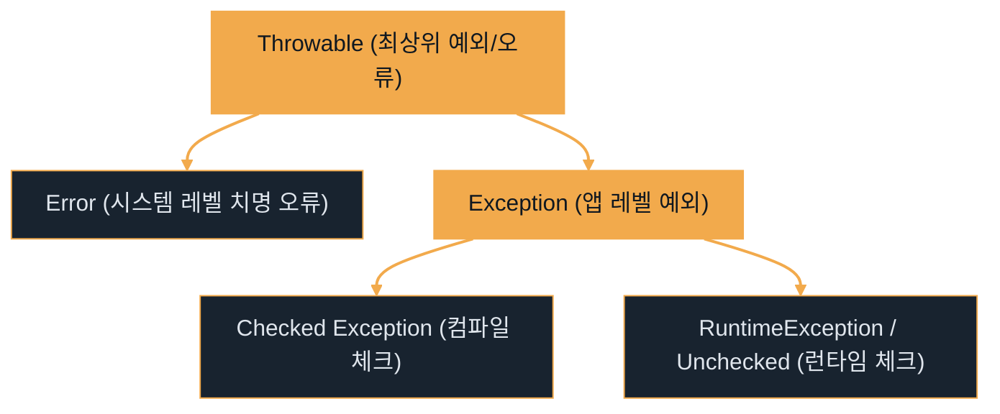

# 예외 처리 (Exception Handling)

---
layout: default
---

# 학습 체크리스트

- [ ] 자바와 자바스크립트 예외 처리의 공통점과 차이점 (검사 예외 유무, 멀티 catch) 숙지
- [ ] Throwable 계층 구조와 다형성 기반 다중 catch 블록의 순서 규칙 이해
- [ ] AutoCloseable과 try-with-resources를 통한 자원의 안전한 자동 반환 메커니즘 습득
- [ ] 예외 전파(throws)의 메커니즘과 Checked 예외를 Unchecked 예외로 포장하는 전파 전략 이해

---
layout: default
---

# 예외 처리의 개념과 공통점

> **예외 처리 (Exception Handling)**
>
> 프로그램 실행 중 발생하는 예기치 못한 비정상 상태를 감지하고 대처하는 메커니즘

- 런타임 에러 대응을 위한 `try-catch-finally` 블록 구조를 자바와 자바스크립트가 동일하게 사용함
- `throw` 키워드를 사용해 예외 객체를 생성하고 상위 호출부로 전파하는 처리 메커니즘 유사함
- 예외 발생 시 애플리케이션의 비정상적인 강제 종료를 막고 예외 상황을 복구하는 목적을 공유함

---
layout: default
---

# 자바와 자바스크립트의 차이점

| 비교 항목 | Java (자바) | JavaScript (자바스크립트) |
| :--- | :--- | :--- |
| **검사 예외 (Checked)** | 예외 처리를 컴파일 시점에 강제함 (`IOException` 등) | 개념 자체가 부재함 (모든 에러가 런타임에 감지) |
| **비검사 예외 (Unchecked)** | 실행 시점에 발생하는 예외 (`RuntimeException` 계열) | 모든 에러가 비검사 예외로만 구성됨 |
| **다형성 기반 catch** | 다중 catch 및 멀티 캐치(`catch (A \| B e)`) 지원 | 단일 `catch(e)` 블록 내 `instanceof`로 수동 분기 |

---
layout: default
---

# 예외 클래스 계층 구조



---
layout: default
---

# 다형성 기반 catch 설계

> **예외 업캐스팅 (Exception Upcasting)**
>
> 하위 클래스 타입의 예외 객체가 상위 클래스 타입의 catch 블록으로 자동 형변환되어 처리되는 현상

- **구체성 우선 선언**: 다중 catch 블록 구성 시 **구체적인 하위 예외를 먼저 선언**하고 넓은 범위의 상위 예외를 뒤에 배치함
- **컴파일 에러 예방**: 상위 예외를 먼저 선언하면 하위 catch 블록이 unreachable code가 되어 컴파일러가 에러를 발생시킴
- **멀티 캐치 구문**: 연관된 여러 개의 구체 예외들을 `|` 기호로 묶어 하나의 catch 블록에서 타입 안전하게 동시 처리 가능

---
layout: default
---

## 다중 예외 처리 및 상위 예외 분기

```java
try {
    execute(); // ArithmeticException 또는 NullPointerException 발생
} catch (ArithmeticException | NullPointerException e) {
    System.out.println("구체적 예외 처리: " + e.getMessage());
} catch (RuntimeException e) {
    System.out.println("기타 런타임 예외 처리");
} catch (Exception e) {
    System.out.println("기타 모든 예외 처리");
}
```

---
layout: default
---

# 자동 자원 해제 (try-with-resources)

> **AutoCloseable**
>
> 자원을 닫는 close() 메서드를 지원하여, 블록 종료 시 자동으로 자원이 반환될 수 있도록 설계된 인터페이스

- **기존 방식의 단점**: `finally` 블록 내에서 `close()`를 강제 호출할 시 추가 예외 처리가 발생하여 보일러플레이트가 극도로 복잡해짐
- **자동 해제 원리**: `AutoCloseable`을 구현한 외부 자원을 `try (자원 선언)` 안에 선언하면 JVM이 블록 종료 시 `close()`를 자동 호출함

---
layout: default
---

# 자원 수명 및 Effectively Final 제약

- **변수 스코프의 제한**: `try (자원)` 내에 선언된 자원 변수의 스코프는 **오직 try 블록 내부**로 국한되어 외부 및 catch/finally 내 참조 불가능
- **Effectively Final 자원**: 외부에서 이미 선언되었고 값이 변경되지 않는 자원 변수는 `try (자원명)` 형태로 관리를 위임할 수 있음
- **소멸 후 재사용 금지**: 관리를 위임받은 자원은 try 블록이 끝나면 자동으로 반환되므로, 그 이후 외부에서 다시 사용 시 런타임 에러가 발생함

---
layout: default
---

## 자원 스코프 제한과 자동 소멸

```java
try (Scanner scanner = new Scanner(new File("data.txt"))) {
    System.out.println(scanner.nextLine());
} catch (FileNotFoundException e) {
    // scanner.close()는 이미 실행됨
    // scanner.nextLine(); -> 컴파일 에러 (변수 접근 불가)
}
```

---
layout: default
---

## 외부 자원 위임 및 소멸 이후 재사용 금지

```java
Scanner scanner = new Scanner(new File("data.txt"));
try (scanner) { // 외부 변수를 자원 관리 대상으로 지정
    System.out.println(scanner.nextLine());
} // try 블록 종료 시 scanner.close() 자동 수행
// scanner.nextLine(); -> 런타임 에러 발생 (이미 닫힌 자원 접근)
```

---
layout: default
---

# 예외 위임과 전파 메커니즘

> **예외 전파 (Exception Propagation)**
>
> 메서드 내 발생한 예외의 직접 처리를 피하고, throws를 통해 자신을 호출한 상위 메서드로 예외 처리를 위임하는 기법

- **throws 키워드**: 메서드 선언부에 예외 클래스를 명시하여 상위 호출자(Caller)가 이를 강제로 처리하도록 예외 의무를 전파함
- **Unchecked 자동 전파**: `RuntimeException` 계열의 언체크 예외는 `throws` 선언을 명시하지 않아도 호출 스택을 통해 자동으로 최상위까지 전파됨

---
layout: default
---

# 전역 예외 처리기 기반의 관심사 분리

- **AOP 기반 일괄 포착**: 예외를 호출자로 끝까지 전파하여 애플리케이션 진입점인 **Global Exception Handler**(스프링의 `@ControllerAdvice`)에서 포착함
- **비즈니스 로직 분리**: 개별 비즈니스 메서드 내에 예외 처리 로직(`try-catch`)이 중복 설계되는 현상을 소거하여 가독성을 향상시킴
- **정형 응답 가공**: 전역 예외 처리기가 포착한 예외를 분석하여 에러 로그를 남기고, 클라이언트에게 일정한 JSON 규격(Error Response)으로 응답함

---
layout: default
---

# Checked 예외의 Unchecked 포장 전환

> **예외 포장 (Exception Wrapping)**
>
> 발생한 원본 예외를 그대로 전파하지 않고, 새로운 런타임 예외 객체 내부에 원인 예외(Cause)로 감싸서 다시 던지는 기법

- **Checked 예외 전파의 한계**: `SQLException` 등을 상위로 던지면 거쳐가는 모든 상위 메서드 시그니처에 `throws` 선언을 강제하여 OCP를 위반함
- **해결 방안 (포장)**: Checked 예외 발생 시 `try-catch`로 포착한 뒤 `RuntimeException`을 상속하는 Custom Exception으로 감싸서(Wrapping) 던짐
- **디버깅 단절 방지**: 포장 시 생성자를 통해 반드시 **근본 원인 예외(cause)**를 함께 보관하여 에러 원인 추적성을 보존함

---
layout: default
---

## 사용자 정의 런타임 예외 선언

```java
public class BusinessException extends RuntimeException {
    // 근본 원인이 된 예외(cause)를 상위 클래스에 전달하여 보관
    public BusinessException(String message, Throwable cause) {
        super(message, cause);
    }
}
```

---
layout: default
---

## 체크 예외를 언체크로 전환하여 전파

```java
public void service() {
    try {
        throw new SQLException("데이터베이스 조회 실패"); // Checked
    } catch (SQLException e) {
        // 커스텀 런타임 예외로 포장하여 던짐 (throws 선언 불필요)
        throw new BusinessException("서비스 오류가 발생했습니다.", e);
    }
}
```

---
layout: default
---

## 상위 호출부 예외 포착 및 원인 예외 확인

```java
try {
    service();
} catch (BusinessException e) {
    System.out.println("에러 메시지: " + e.getMessage());
    // getCause()를 통해 내부에 포장된 원본 Checked 예외 추출
    Throwable cause = e.getCause();
    System.out.println("근본 원인 예외: " + cause.getClass().getName());
}
```