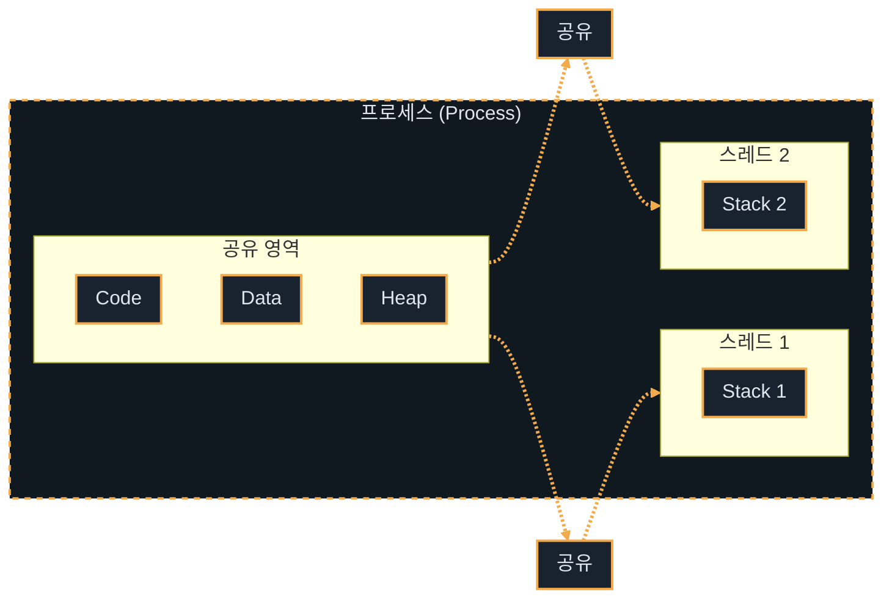

# Java Concurrency (동시성)

---
layout: default
---

# 학습 체크리스트

- [ ] 프로세스와 스레드의 개념적 차이 및 Java와 JS의 동시성 모델 이해
- [ ] JVM 메모리 구조(Heap, Stack) 기반의 Thread-Safe 영역 구별
- [ ] WAS의 Thread-per-Request 모델과 싱글톤 서블릿의 동시성 위험성 인지
- [ ] 자바 동시성 유틸리티(Synchronized, Lock, Atomic)와 비동기 파이프라인 활용
- [ ] 분산 환경에서의 동시성 이슈 및 분산 락, Saga 패턴의 이해

---
layout: default
---

# 동시성의 본질

> **동시성**(Concurrency)
>
> 여러 작업이 아주 짧은 시간 간격으로 교대로 실행되어, 동시에 실행되는 것처럼 보이게 하는 논리적 개념

- **실제로는 동시가 아님**(논리적 동시)
  - 물리적으로 같은 순간에 여러 작업을 실행하는 병렬성(Parallelism)과 달리, 단일 CPU 코어가 작업들을 빠르게 번갈아 실행(시분할)하는 구조임

---
layout: default
---

# OS 동시성과 자원 효율화

- **데스크톱 멀티태스킹의 실체**
  - 음악 감상, 문서 편집, 메신저 수신 등 여러 프로그램이 끊김 없이 동시에 작동하는 듯한 일상적인 환경
  - 이는 운영체제가 CPU 제어권을 밀리초(ms) 단위로 아주 잘게 쪼개어 프로세스 간에 빠르게 배정하고 교체한 결과임
- **자원 활용의 극대화 (I/O Efficiency)**
  - 특정 작업이 디스크 읽기나 네트워크 응답(I/O 블로킹)을 대기하는 유휴 시간 동안 CPU가 놀지 않고 다른 연산을 수행하게 하여 하드웨어 사용 효율을 극대화함

---
layout: default
---

# 프로세스 (Process)

> **프로세스**(Process)
>
> 운영체제로부터 시스템 자원(메모리, CPU 등)을 할당받는 독립적인 실행 단위

- **자원 독점**: 각각 독자적인 가상 주소 공간(Code, Data, Heap, Stack)을 소유함
- **격리 실행**: 운영체제에 의해 독립된 메모리 영역을 보장받으므로 안전하게 구동됨

---
layout: default
---

# 스레드 (Thread)

> **스레드**(Thread)
>
> 프로세스 내부에서 실행되는 여러 작업 흐름의 단위

- **자원 공유**: 프로세스가 보유한 공용 자원(Code, Data, Heap)을 공유하여 효율성을 높임
- **독립 Stack**: 각 스레드는 자신만의 독자적인 Stack 영역을 가짐
- **낮은 전환 비용**: 스레드 간 전환(Context Switch) 비용은 프로세스에 비해 현저히 낮음
- **동시성 노출**: 공유 영역을 동시에 제어하기 때문에 동시성 문제에 취약함

---
layout: default
---

# 프로세스 내 스레드 메모리 공유 구조



---
layout: default
---

# Java와 JavaScript 동시성 모델 비교

| 비교 항목 | Java (멀티스레드) | JavaScript (Node.js) |
| :--- | :--- | :--- |
| **동작 구조** | 실제 다중 CPU 코어를 활용하는 멀티스레드 | 하나의 메인 스레드로 구동되는 싱글스레드 |
| **동시성 처리** | 여러 스레드를 생성하여 병렬 연산 처리 | 무거운 I/O는 백그라운드 위임 후 콜백 논블로킹 처리 |
| **자원 제어** | 공유 자원에 대한 락(Lock) 경합 및 동기화 필수 | 이벤트 루프 기반으로 작동하여 메모리 경합에서 자유로움 |
| **주요 장벽** | 데드락, 경쟁 상태 등 동기화 관리 복잡도 높음 | CPU 집중 연산 수행 시 메인 스레드 병목 발생 가능 |

---
layout: two-cols
---

# JVM 메모리 구조와 동시성


::right::

<div class="pl-6 pt-14">

- **Heap (공용 테이블)**
  - 모든 스레드가 공유하는 열린 메모리 영역
  - 여러 스레드가 동시에 값을 변경할 수 있어 **동시성 문제**가 발생함
- **Stack (개인 서랍장)**
  - 스레드마다 개별적으로 할당되는 전용 영역
  - 다른 스레드에서 접근할 수 없어 완벽하게 안전함 (**Thread-Safe**)

</div>

---
layout: default
---

# JVM 메모리 영역별 제어 정책

- **Heap 영역과 상태 제어**: 객체 인스턴스(상태 정보)는 Heap에 저장됨. 여러 스레드가 동시에 참조하고 변경할 수 있으므로 반드시 동시성 제어(Synchronization)가 수반되어야 함
- **Stack 영역과 연산 격리**: 메서드 실행 시 할당되는 지역 변수와 매개변수는 각 스레드의 Stack 프레임에 독단적으로 할당됨. 이 영역은 다른 스레드와 완전히 차단되므로 동시성 위험에서 안전함

---
layout: default
---

# WAS의 Thread-per-Request 모델

> **Thread-per-Request**
>
> 웹 요청이 들어올 때마다 스레드 풀에서 스레드를 배정하여 해당 HTTP 요청을 독립 처리하는 방식

- **웹 애플리케이션 서버 (WAS)**: 비즈니스 로직을 실행하고 동적 콘텐츠를 처리하기 위해 자바 서블릿 컨테이너 등을 제공하는 서버 소프트웨어 (예: Tomcat)
- **스레드 배정**: WAS는 유입되는 HTTP 요청마다 스레드 풀(Thread Pool)의 스레드를 하나씩 배정하여 작업을 병렬로 수행함
- **격리 처리**: 각 요청은 독립된 스레드 상에서 격리되어 처리되며, 작업 완료 시 해당 스레드는 다시 풀로 반환됨

---
layout: default
---

# 싱글톤 서블릿과 Heap의 위험성

- **싱글톤 상주**: 웹 애플리케이션의 서블릿이나 스프링 빈은 자원 효율성을 위해 기본적으로 **싱글톤**(Singleton)으로 생성되어 Heap 영역에 단 하나만 상주함
- **공유 필드 위험성**: 배정된 수많은 요청 스레드가 동일한 하나의 서블릿 인스턴스 멤버 변수를 동시에 변경하면 데이터가 오염되는 대형 동시성 사고가 발생함
- **무상태**(Stateless) 설계: 컨트롤러/서비스는 공유 상태를 가지지 않도록 설계하고, 데이터는 매개변수나 지역 변수(Stack 영역) 형태로만 전달해 격리해야 함

---
layout: default
---

# 자바 동시성 역사 (JDK 8, JDK 17)

- **JDK 8 (비동기 파이프라인)**: `CompletableFuture` 도입으로 메서드 체이닝을 통한 논블로킹 비동기 작업 제어 지원. Metaspace 도입으로 힙 영역 외부에서 클래스 메타데이터를 관리하여 런타임 안정성 제고.
- **JDK 17 (인프라 고도화)**: ZGC(Z Garbage Collector) 도입으로 Stop-The-World 시간을 획기적으로 줄여 대용량 멀티스레드 WAS의 Tail Latency를 크게 개선함. JVM 모니터 락 메커니즘 최적화로 동기화 락 경합 시 발생하는 오버헤드 감소.

---
layout: default
---

# 가상 스레드와 Kotlin 코루틴

- **JDK 21+ 가상 스레드 (Virtual Thread)**: OS 스레드에 1:1 매핑되는 무거운 플랫폼 스레드 대신 JVM이 관리하는 경량 스레드 도입. 자원 제한 없이 수백만 개의 동시 스레드를 생성해 Thread-per-Request 한계 돌파.
- **구조화된 동시성 (Structured Concurrency)**: 하위 비동기 작업들을 단일 블록으로 묶어 관리. 예외 발생 시 자식 스레드 누수나 중단 제어를 안전하게 구조화함.
- **Kotlin 코루틴 (Coroutines)**: 컴파일러 수준의 `suspend`/`resume` 기법을 통해 물리 스레드를 블로킹하지 않고 작업을 일시 중단함. 비동기 코드를 일반 동기식 코드 스타일로 직관적으로 설계 가능.

---
layout: default
---

# 멀티스레딩과 동기화

> **경쟁 상태 (Race Condition)**
>
> 공유 자원에 여러 스레드가 동시에 쓰기 작업을 수행할 때 타이밍에 따라 데이터 정합성이 깨지는 현상

- **synchronized의 역할**: 특정 객체의 모니터 락(Monitor Lock)을 획득하게 하여 임계 영역(Critical Section)에 하나의 스레드만 진입하도록 제어함
- **동기화의 한계**: 락을 획득할 때까지 대기(Blocked 상태)하므로 컨텍스트 스위칭 오버헤드가 발생하며, 교착 상태(Deadlock)나 전반적인 성능 저하를 초래할 수 있음

---
layout: default
---

## synchronized를 활용한 동기화

```java
class Counter {
    private int count = 0;

    public synchronized void increment() {
        count++;
    }
}
```

---
layout: default
---

# 자바 동시성 유틸리티 (java.util.concurrent)

- **ExecutorService**: 스레드 풀(Thread Pool)을 제공하여 스레드를 직접 생성하고 소멸시키는 비효율과 자원 낭비를 줄임
- **Lock 인터페이스 (`ReentrantLock`)**: `synchronized`보다 더 세밀한 락 제어 기능(락 시도 시간 제한, 공정성 설정 등)을 지원함
- **원자적 변수 (Atomic Variables)**: CAS(Compare-And-Swap) 하드웨어 명령어를 활용하여 락 없이도(Lock-Free) 멀티스레드 환경에서 안전한 값 업데이트 처리 제공

---
layout: default
---

# 비동기 처리와 CompletableFuture

> **비동기 처리 (Asynchronous Processing)**
>
> 작업을 호출한 스레드가 호출된 작업의 완료를 기다리지 않고(Non-blocking) 즉시 다른 작업을 계속 수행하는 제어 방식

- **CompletableFuture**: JDK 8에서 제공되는 비동기 프로그래밍 도구. 기존 Future의 블로킹 방식 한계를 극복하고 메서드 체이닝을 통해 비동기 작업 흐름과 예외 처리를 유연하게 결합함
- **비동기 병렬화**: 비동기 연산 시 백그라운드 스레드 풀(`ForkJoinPool` 등)의 다른 스레드에게 작업을 위임해 병렬 처리를 달성함

---
layout: default
---

## CompletableFuture 비동기 파이프라인

```java
CompletableFuture.supplyAsync(() -> "작업 완료")
    .thenApply(result -> result + " -> 가공 완료")
    .exceptionally(ex -> "에러 발생: " + ex.getMessage())
    .thenAccept(System.out::println);
```

---
layout: default
---

# Spring WebFlux와 리액티브 모델

- **리액티브 웹 프레임워크**: Project Reactor의 `Mono`와 `Flux` 발행자를 핵심으로 활용하며, 이벤트 기반 비동기 데이터 스트림을 논블로킹으로 안전하게 처리함
- **Netty 이벤트 루프**: MVC의 1:1 요청 매핑 방식 대신, 적은 수의 고정 스레드 풀만 구동함. I/O 블로킹 대기 지점에서 제어권을 즉시 양도하여 자원 효율성을 극대화함. 외부 API 연동이나 대용량 I/O 시스템에 적합함.

---
layout: default
---

# 분산 환경 동시성과 Saga 패턴

> **분산 락 (Distributed Lock)**
>
> 다중 WAS 서버(Scale-out) 환경에서 공통으로 참조할 수 있는 외부 저장소를 활용해 전체 클러스터 내 유일한 락을 취득하는 방식

- **단일 JVM의 한계**: `synchronized`나 `ReentrantLock`은 단일 JVM의 로컬 메모리상에서만 유효하여 다중 서버 간의 동시성 제어는 불가능함
- **Saga 패턴**: MSA 환경에서 개별 로컬 트랜잭션을 순차 실행하며, 중간 단계 실패 시 이미 성공한 이전 단계들에 대해 **보상 트랜잭션**(Compensating Transaction)을 역순 실행하여 최종 일관성을 달성함

---
layout: default
---

# Redis와 이벤트 기반 분산 락

- **화장실 노크 (기존 스핀 락)**
  - 문 앞을 서성이며 1초마다 "나왔어요?" 하고 문을 계속 두드리는 방식
  - 락이 풀릴 때까지 반복적으로 요청을 전송하므로 서버와 네트워크에 과부하를 줌
- **커피숍 진동벨 (Redisson 방식)**
  - 대기자에게 진동벨을 쥐여주고 대기석에 앉힌 뒤, 차례가 오면 벨을 울려 호출하는 방식
  - 락이 해제되었다는 **알림**(이벤트)을 받기 전까지는 대기하며, 호출받은 스레드만 락을 재시도하여 자원을 획기적으로 아낌

---
layout: default
---

# Kafka와 락 없는 메시지 순차 처리

- **전용 대기열 배정 (메시지 키)**
  - 동일한 업무 키(예: 특정 주문 ID)를 가진 요청은 항상 똑같은 대기열(파티션)에 순서대로 줄을 서게 함
- **전담 직원 배치 (1:1 매핑)**
  - 각 대기열(파티션)에는 오직 **단 하나의 스레드**(컨슈머)만 1:1로 배치하여 처리하게 함
- **락 없는 순서 보장**
  - 스레드끼리 자원을 두고 다투며 경쟁할 필요 없이, 자기 대기열에 들어온 요청만 순서대로 받아 처리하면 자동으로 완벽한 순서(FIFO)가 보장됨

---
layout: default
---

# 요약: 동시성 vs 비동기

| 구분 | 동시성 (Concurrency) | 비동기 (Asynchrony) |
| :--- | :--- | :--- |
| **주요 관점** | "여러 작업을 동시에 어떻게 효율적으로 구동할 것인가?" | "작업을 호출한 스레드가 대기(Blocking)를 겪을 것인가?" |
| **자바 구현체** | `Thread`, `ExecutorService` (스레드 풀) | `CompletableFuture`, `Reactive Streams` (Mono/Flux) |
| **핵심 화두** | Heap 영역 내 공유 자원 데이터 오염 방지 및 Lock 경합 최소화 | I/O 대기 시간 중 스레드 유휴 상태 방지를 통한 자원 극대화 |
