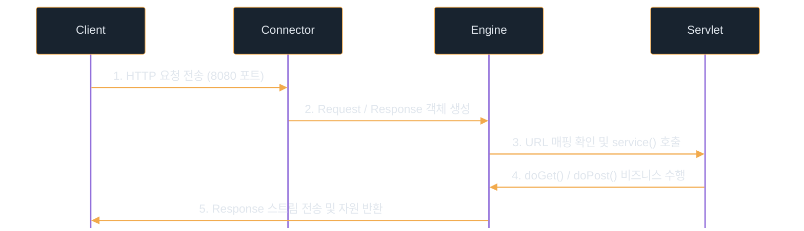

# Maven & Tomcat

---
layout: default
---

# 학습 체크리스트

- [ ] Maven의 개념과 빌드 라이프사이클 이해
- [ ] pom.xml의 구조와 의존성 적용 방법 숙달
- [ ] JAR와 WAR 패키징 차이 및 최신 배포 트렌드 분석
- [ ] Java EE에서 Jakarta EE로의 역사적 전환 인지
- [ ] Web Server와 WAS의 차이 및 톰캣의 동작 원리 파악

---
layout: default
---

# 자바 빌드 도구 Maven

> **메이븐 (Maven)**
>
> 자바 프로젝트의 빌드 라이프사이클 관리, 컴파일, 테스트, 패키징 및 외부 라이브러리(의존성)를 다운로드하고 관리하는 표준 빌드 도구

- **표준화된 빌드 관리**: 소스코드 컴파일부터 테스트, 패키징, 배포에 이르는 일련의 작업을 표준화함
- **중앙화된 의존성 관리**: 프로젝트가 필요로 하는 외부 라이브러리들을 일관되게 다운로드하고 버전을 관리함
- **프로젝트 모델링**: `pom.xml` 설정을 기반으로 프로젝트의 구조와 빌드 옵션을 선언적으로 정의함

---
layout: default
---

# Maven과 npm의 핵심 비교

| 비교 항목 | npm (Node.js) | Maven (Java) |
| :--- | :--- | :--- |
| **의존성 저장소** | 로컬 저장 (`node_modules`) | 로컬 캐싱 공유 (`~/.m2/repository`) |
| **설정 파일** | JSON (`package.json`) | XML (`pom.xml`) |
| **라이프사이클** | 자유로운 스크립트 실행 | 표준화된 정형화 프로세스 |

- **저장소 방식 차이**: npm은 프로젝트마다 라이브러리를 중복 저장하나, Maven은 로컬 홈 캐시를 공유하여 디스크를 효율적으로 씀
- **빌드 절차 차이**: npm은 스크립트가 자유롭게 정의되는 반면, Maven은 정형화된 빌드 프로세스를 따름

---
layout: default
---

# Maven 빌드 라이프사이클


- **clean**: 이전 빌드에서 생성된 모든 가공 파일(`target/`)을 삭제함
- **compile / test**: 자바 소스코드를 컴파일하고 단위 테스트를 수행함
- **package / deploy**: 컴파일된 코드를 압축(JAR/WAR)하고 저장소에 배포함

---
layout: default
---

# Maven 의존성 검색 및 적용

- **MVNRepository 활용**:
  - [mvnrepository.com](https://mvnrepository.com)에서 필요한 라이브러리(예: `jakarta.servlet-api`, `Lombok` 등)를 검색함
  - 프로젝트 스펙에 맞는 안정 버전을 선택 후 **Maven 탭**의 XML 설정 코드를 복사함
- **dependency 적용**:
  - 복사한 `<dependency>` 블록을 `pom.xml` 파일의 `<dependencies>` 태그 내부에 붙여넣음
- **IDE 동기화**:
  - IntelliJ 우측 상단의 **Maven 로고 버튼 (Load Maven Changes, 🔁)** 또는 `Cmd + Shift + I` (Windows는 `Ctrl + Shift + O`) 단축키로 로드함

---
layout: default
---

# pom.xml 작성 시 주의사항

- **JDK 버전 불일치 방지**:
  - `<properties>` 블록 내에 정의된 `<maven.compiler.source>`와 `<maven.compiler.target>` 버전은 실제 로컬에 설치된 JDK 및 IDE SDK 설정과 반드시 일치해야 함
  - 로컬 JDK 버전이 설정보다 낮을 경우 `Unsupported Class Version Error` 컴파일/런타임 에러가 발생함
- **소스 파일 인코딩 명시**:
  - 운영체제에 상관없이 한글 주석이나 문자열이 깨지지 않도록 `<project.build.sourceEncoding>UTF-8</project.build.sourceEncoding>` 옵션을 명시하여 인코딩을 UTF-8로 고정함

---
layout: default
---

# pom.xml 기본 설정 예시

```xml
<project>
    <modelVersion>4.0.0</modelVersion>
    <groupId>com.example</groupId>
    <artifactId>web-project</artifactId>
    <version>1.0-SNAPSHOT</version>
    <packaging>war</packaging>

    <properties>
        <maven.compiler.source>17</maven.compiler.source>
        <maven.compiler.target>17</maven.compiler.target>
        <project.build.sourceEncoding>UTF-8</project.build.sourceEncoding>
    </properties>
</project>
```

---
layout: default
---

# pom.xml Servlet 의존성 선언

```xml
<dependencies>
    <dependency>
        <groupId>jakarta.servlet</groupId>
        <artifactId>jakarta.servlet-api</artifactId>
        <version>6.0.0</version>
        <scope>provided</scope> 
        <!-- 런타임 시 WAS(톰캣)가 직접 라이브러리를 공급함 -->
    </dependency>
</dependencies>
```

---
layout: default
---

# JAR vs WAR 패키징 비교

> **JAR (Java Archive)**
>
> 자바 클래스 파일(`.class`), 메타데이터, 리소스 등을 모은 범용 압축 포맷
>
> **WAR (Web Application Archive)**
>
> 서블릿 스펙에 정의된 웹 전용 압축 포맷

- **JAR**: 웹 전용 구조가 없으며, 자바 애플리케이션이나 재사용 가능한 라이브러리 배포에 사용됨
- **WAR**: JSP, 서블릿 클래스, HTML/JS/CSS, `web.xml`을 포함하며 내부적으로 `WEB-INF/` 디렉토리를 구축해 격리된 자원을 관리함

---
layout: default
---

# JAR vs WAR 구동 방식

| 비교 항목 | WAR (Web Application Archive) | JAR (Java Archive) |
| :--- | :--- | :--- |
| **WAS 탑재 여부** | 외부 WAS 의존형 | 내장 WAS 내장형 |
| **실행 및 배포** | 톰캣의 `webapps/` 폴더에 배치 | `java -jar app.jar` 명령어로 단독 실행 |
| **컨테이너 환경** | 외부 서블릿 컨테이너 환경 필요 | 내장 서블릿 엔진 라이브러리 포함 |

- **WAR**: 스스로 구동할 수 없으며, 호스트 서버에 독립적으로 설치된 외부 WAS(Tomcat 등)에 배포해야 실행 가능함
- **JAR**: 애플리케이션 내부에 서블릿 컨테이너(Embedded Tomcat) 엔진 라이브러리를 포함해 가볍고 즉각적인 구동이 가능함

---
layout: default
---

# 최신 배포 트렌드 변화

- **전통적인 WAR 방식 (과거)**:
  - 단일 물리 서버의 고성능 대형 WAS 하나에 수많은 개별 서비스(`.war`)를 올려 자원을 아껴 씀
  - 그러나 서비스 간 상호 간섭이나 한 사이트 장애가 서버 전체로 전파되는 위험성을 가짐
- **현대적인 JAR 컨테이너 방식 (현재)**:
  - 클라우드 인프라와 마이크로서비스 아키텍처(MSA)의 확산으로 독립성과 격리 보장이 중요해짐
  - WAS 엔진을 단일 패키지로 품은 독립 실행형 JAR가 표준이 되었으며, 이를 **Docker 컨테이너**로 묶어 배포 및 수평 확장(Scale-out)을 제어하는 방식이 정착함

---
layout: default
---

# Jakarta EE와 Java EE 역사

- **Java EE 시절**:
  - 표준 비즈니스 서버 기술 스펙들은 Sun Microsystems와 Oracle 주도하에 **Java EE**로 관리되었으며 패키지 명칭은 `javax.servlet.*`였음
- **이클립스 재단 이관 (2017년)**:
  - Oracle은 자바 상업 라이선스의 복잡성과 관리 비용 이슈로 Java EE 오픈소스 제어권을 **이클립스 재단**에 이관함
- **상표권 분쟁과 Jakarta EE**:
  - Oracle이 `Java` 브랜드의 독점권을 갖고 있어 `Java` 상표와 `javax` 명칭 사용을 금지함
  - 이에 따라 **Jakarta EE**로 리브랜딩되며 패키지명 역시 `javax.servlet.*`에서 `jakarta.servlet.*`으로 변경됨

---
layout: default
---

# 톰캣 버전과 스펙 매핑

- **톰캣 9 이하 버전**: 기존의 `javax` 스펙을 지원함
- **톰캣 10 이상 버전**: 리브랜딩된 `jakarta` 스펙만 지원함
- **톰캣 10 이상 사용 시 주의점**: 톰캣 10 이상을 사용하기 위해서는 소스코드 컴파일 시 반드시 `jakarta.servlet` 패키지를 임포트하여 사용해야 함

| Tomcat 버전 | 지원 스펙 | 패키지 경로 prefix |
| :--- | :--- | :--- |
| **Tomcat 9.x 이하** | Java EE | `javax.servlet.*` |
| **Tomcat 10.x 이상** | Jakarta EE | `jakarta.servlet.*` |

---
layout: default
---

# Web Server vs WAS

> **웹 서버 (Web Server)**
>
> HTTP 요청을 받아 주로 정적 콘텐츠 (HTML, CSS, 이미지 등)를 제공하는 서버
>
> **웹 애플리케이션 서버 (WAS)**
>
> 데이터베이스 연동, 비즈니스 로직 연산 등 동적인 요청을 처리하기 위한 서버

- **Web Server**: Apache HTTP Server, Nginx 등이 있으며, 요청을 WAS로 넘겨주는 리버스 프록시 역할도 수행함
- **WAS**: 내부에 서블릿 컨테이너를 구동하여 자바 애플리케이션 코드를 실행하고 동적 응답을 만듦 (예: Tomcat, WildFly)

---
layout: default
---

# 톰캣 버전 선택 및 수동 설치

- **톰캣 버전 선택**:
  - 최신 Java 생태계 및 **Spring Boot 3.5** 이상의 스펙에 맞추어, **Jakarta EE 10** 사양을 충족하는 **Tomcat 10.1.x** 버전을 표준으로 사용함
- **수동 설치의 필요성**:
  - 패키지 매니저(Homebrew, apt 등)를 활용한 설치는 백그라운드 구동으로 인한 포트 충돌(8080 포트)을 제어하기 어렵고 설정 파일 경로가 복잡함
  - 공식 사이트에서 **Core > zip** 포맷을 다운로드하여 작업 폴더에 직접 압축을 풀고 경로 제어를 단순화하는 것을 강력히 권장함

---
layout: default
---

# 톰캣의 요청 처리 흐름



---
layout: default
---

# 톰캣의 웹 애플리케이션 구동 및 요청 처리

- **배포 및 초기 로딩**:
  - 톰캣이 시작되면 `webapps/` 디렉토리 아래에 위치한 `.war` 파일의 압축을 해제하고 JVM 메모리에 로딩함
- **스레드 할당 및 실행**:
  - 톰캣의 스레드 풀(Thread Pool)에서 가용한 작업 스레드를 하나 배정하여 서블릿의 `service()` 메서드를 호출함
- **응답 전송 및 자원 반환**:
  - `HttpServletResponse` 객체에 작성된 출력 스트림(HTML, JSON 등) 데이터를 네트워크로 전송한 후, 할당했던 객체를 소멸·정리하고 스레드를 풀에 반환함

---
layout: default
---

# 최신 실무 웹 서버 구성 트렌드

- **과거**:
  - 운영 환경에 독립형(Standalone) 톰캣 서버를 먼저 수동 설치하고, 개발 완료된 웹 소스코드를 `.war` 파일로 빌드하여 톰캣의 `webapps` 폴더에 배포·실행함
- **현재**:
  - 가상화 및 클라우드(Docker) 기반의 컨테이너 환경으로 배포판을 경량 패키징함
  - 또는 **Spring Boot** 프레임워크와 같이 내장 WAS(Embedded Tomcat)를 소스코드 내부에서 구성하여 단독 실행 가능한 `.jar` 파일 하나로 배포함

---
layout: default
---

# IntelliJ 실행 구성 연동

- **IDE 내 Tomcat Server (Local) 구성**:
  - 로컬 개발 실습 과정에서는 톰캣 서버를 터미널에서 스크립트 명령어로 직접 실행하고 종료하는 대신, IntelliJ 내 실행 구성에 압축 해제한 톰캣 디렉토리 경로를 지정함
- **연동 장점**:
  - IDE 내부의 단축키나 버튼 조작만으로 안전하게 WAS 구동이 가능함
  - 디버깅 및 소스 코드 핫 스왑(Hot Swap)을 실시간으로 연동할 수 있어 개발 생산성이 향상됨

---
layout: default
---

# 핵심 정리: Maven & Tomcat

- **Maven**: 자바 표준 빌드 도구로, `pom.xml`을 사용해 중앙화된 의존성 관리 및 정형화된 빌드 라이프사이클을 제공함
- **JAR vs WAR**: 독립 실행형 JAR(내장 WAS 포함)가 현대 클라우드 및 Docker MSA 환경의 표준 배포판으로 정착함
- **Jakarta EE**: 상표권 분쟁으로 Java EE에서 이관 및 리브랜딩되어 패키지 경로가 `javax.*`에서 `jakarta.*`로 변경됨
- **Tomcat**: HTTP 요청을 처리하는 동적 서블릿 컨테이너로, Spring Boot 3.x 스펙에 맞춰 Tomcat 10.1.x 이상을 사용함
