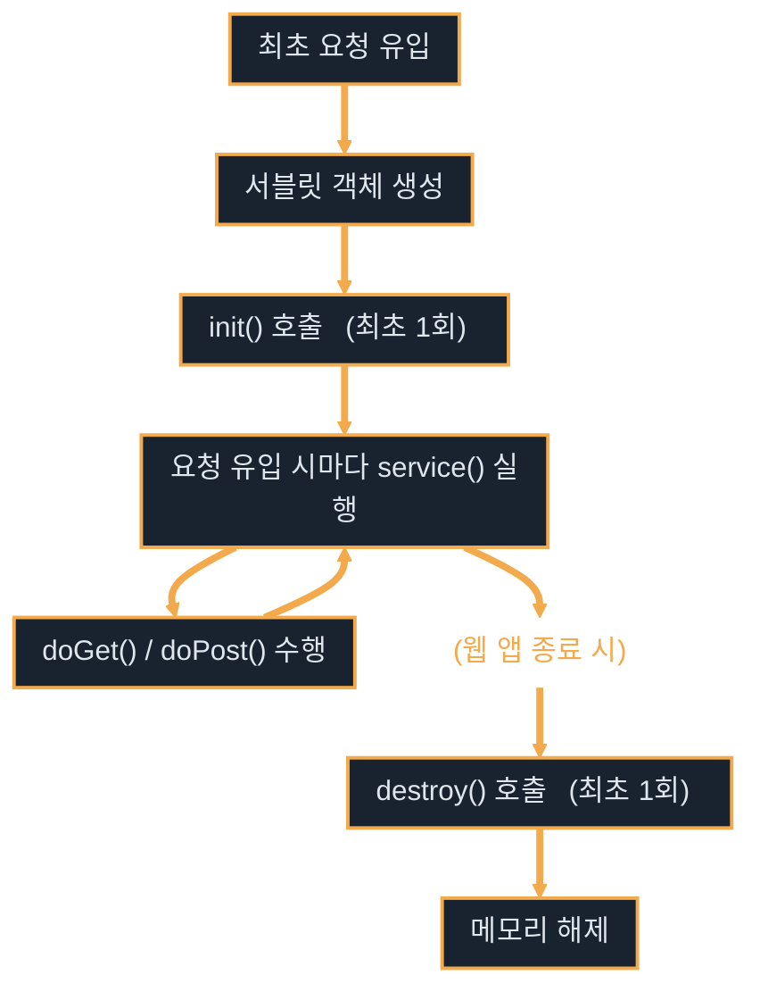

# Servlet

---
layout: default
---

# 학습 체크리스트

- [ ] 애플릿의 역사적 한계와 서블릿 등장 배경
- [ ] 서블릿의 경로 매핑 및 생명주기 관리 원리
- [ ] Servlet 3대 공유 영역(Scope) 및 페이지 이동 방식 비교
- [ ] GET/POST 요청 처리 및 입력 파라미터 유효성 검증
- [ ] 한글 깨짐 방지를 위한 입출력 인코딩 설정

---
layout: default
---

# 서블릿 이전의 자바 애플릿

> **자바 애플릿 (Java Applet)**
>
> 웹 브라우저(클라이언트) 환경에 포함된 JVM 플러그인을 통해 브라우저 내부에서 직접 실행되던 소형 자바 프로그램

- **클라이언트 사이드 실행**: 웹 서버로부터 컴파일된 클래스 파일(`.class`)을 다운로드하여 사용자 브라우저 내부에서 실행함
- **풍부한 UI 제공**: 당시 HTML/CSS 수준에서 구현이 어려웠던 동적 그래픽, 애니메이션, 게임 등을 브라우저 화면에 렌더링함
- **네트워크 및 다운로드 부하**: 매 접속마다 용량이 큰 자바 실행 바이너리를 브라우저가 다운로드해야 하므로 구동 시간이 매우 느렸음

---
layout: default
---

# 애플릿의 한계와 서블릿의 등장 배경

- **클라이언트 리소스 및 호환성 한계**: 90년대 후반 당시 PC 성능 한계로 브라우저 내 무거운 JVM 구동은 프리징을 유발했으며, 브라우저 제조사별 플러그인 호환 편차가 극심했음
- **서버 중심 아키텍처로의 전환**: 동적 연산과 데이터베이스 연동 등 무거운 처리는 고성능 서버에서 일괄 처리하고, 클라이언트는 렌더링 결과(HTML)만 받는 가벼운 구조로 회귀함
- **기존 CGI(Common Gateway Interface)의 한계**:
  - 기존 서버 사이드 기술인 CGI는 요청마다 프로세스를 새로 포크(Fork)하여 메모리를 심각하게 고갈시키는 병목이 있었음
  - **스레드 기반 처리**: 서블릿(Servlet)은 프로세스가 아닌 **스레드(Thread) 풀 기반**으로 동작해 메모리를 극도로 절약하며 동시 요청을 고속 처리함

---
layout: default
---

# 자바 서블릿 개요

> **서블릿 (Servlet)**
>
> 클라이언트의 요청을 처리하고, 동적인 웹 콘텐츠를 생성하여 응답을 돌려주는 자바 기반의 웹 컴포넌트

- **애플리케이션 컨트롤러 역할**: 클라이언트 요청의 진입점이 되어 비즈니스 로직을 연결해주는 주춧돌 역할을 함
- **JSP와의 명확한 역할 분담**: 서블릿 내에서 문자열로 HTML 태그를 작성하는 대신 비즈니스 로직에 집중하고, 완성된 화면 렌더링은 JSP에 위임함
- **가상 경로 매핑**: 클라이언트가 요청하는 특정 URL 주소와 서블릿 클래스를 연결하여 요청을 라우팅함

---
layout: default
---

# 요청의 종착지를 결정하는 라우팅과 매핑

> **라우팅 (Routing) & 매핑 (Mapping)**
>
> 클라이언트의 요청 URL을 분석하여 이를 처리할 서버 내 최적의 경로(클래스 또는 파일)로 안내하고 연결해 주는 행위

- **경로 매핑**: "이 URL 요청(`/hello`)이 오면 이 서블릿 클래스(`HelloServlet`)를 기동해라"라고 주소를 연결하는 작업임
- **라우팅**: 길을 안내한다는 뜻으로, 웹 요청 패킷이 알맞은 종착지로 흘러가도록 제어하는 네트워크 및 웹 스펙 용어임

---
layout: default
---

# 서비스 식별을 위한 포트와 통신 중계 게이트웨이

> **포트 (Port)**
>
> 하나의 서버 내에서 기동되는 다양한 프로그램(웹 서버, DB 등) 중 특정 대상을 구별하여 접속하기 위한 가상의 논리 통로 번호
>
> **게이트웨이 (Gateway)**
>
> 서로 다른 프로토콜이나 기술 스택 간에 데이터를 전달할 수 있도록 중계해 주는 관문 장치 혹은 통신 방식 (예: CGI)

- **포트의 비유**: 서버의 IP 주소가 '아파트 건물 주소'라면, 포트 번호(예: `8080`)는 특정 가구를 찾아 들어가는 '동·호수'에 해당함
- **게이트웨이의 비유**: 웹 브라우저의 HTTP 요청을 자바나 파이썬 같은 외부 가공 프로그램이 알아들을 수 있도록 다리를 놓아주는 통신 스펙을 의미함

---
layout: default
---

# 서블릿 등록 및 경로 매핑

- **과거의 XML 등록 방식 (Java EE)**:
  - `web.xml` 설정 파일에 서블릿 클래스의 정규화된 이름과 클라이언트가 접속할 매핑 경로를 일일이 대조 등록해 사용함
- **모던 Jakarta EE의 애너테이션 방식**:
  - 소스코드 내 클래스 선언부 상단에 `@WebServlet` 애너테이션을 활용하여 별도 설정 없이 직관적으로 경로를 지정함
  - 설정 파일의 중복을 막고 소스코드와의 응집력을 비약적으로 증대시킴

---
layout: default
---

# 가상 경로 요청 매핑 서블릿

```java
@WebServlet("/hello")
public class HelloServlet extends HttpServlet {
    @Override
    protected void doGet(HttpServletRequest request, HttpServletResponse response) 
            throws ServletException, IOException {
        response.getWriter().println("Hello Servlet!");
    }
}
```

---
layout: default
---

# URL의 표준 구조와 오리진

- **URL 구성 규격**:
  `[Scheme]://[Host]:[Port][Path]?[QueryString]`
- **오리진 (Origin)**:
  - `Scheme + Host + Port` 조합 정보를 의미하며 브라우저 동일 출처 정책(SOP) 및 CORS의 핵심 판단 기준이 됨
- **Form Method**:
  - HTML `<form>`의 `method` 속성(GET 또는 POST)에 따라 요청을 구성하며, 서블릿의 `doGet()` 혹은 `doPost()` 메서드로 최종 분기 매핑됨

---
layout: default
---

# URL 구조와 데이터 매핑 사례

- 예시 주소: `https://localhost:8080/api/users?id=admin&page=2`

| 구성 요소 | 예시 값 | 설명 |
| :--- | :--- | :--- |
| **Scheme** | `https` | 통신을 관할하는 프로토콜 규약 |
| **Host** | `localhost` | 대상 서버의 도메인 / IP 주소 |
| **Port** | `8080` | 서버 내부 가상 관문 번호 (생략 시 80/443 자동 지정) |
| **Path** | `/api/users` | 대상 서버 내 리소스 경로 |
| **Query String** | `id=admin&page=2` | 전달되는 부가 데이터 파라미터 쌍 |

---
layout: default
---

# GET vs POST 요청 방식

- **GET 요청 방식**:
  - 전송할 데이터를 URL 경로 뒤에 `?`를 시작으로 쿼리 스트링(Query String) 형태로 노출하여 송신함
  - 길이 제한이 엄격하고 주소창에 데이터가 드러나므로 **단순 조회(Read)**에만 사용함
- **POST 요청 방식**:
  - 데이터를 HTTP 요청 패킷의 Body(본문) 영역에 심어서 전송함
  - 길이 제한이 없고 주소창에 노출되지 않으므로 **데이터의 생성/수정/삭제(CUD)** 및 대용량 파일 전송에 표준으로 선택됨

---
layout: default
---

# 서블릿 생명주기

> **서블릿 생명주기 (Servlet Lifecycle)**
>
> 서블릿 객체의 생성, 실행, 소멸 과정이 개발자의 수동 제어가 아닌 서블릿 컨테이너(Tomcat)에 의해 자동으로 관리되는 흐름

- **`init()`**: 서블릿 요청이 처음 들어왔을 때 인스턴스를 메모리에 로딩한 후 **최초 1회만** 실행되며, 초기화 작업을 담당함
- **`service()`**: HTTP 요청이 유입될 때마다 매번 호출되어 요청 방식(GET, POST 등)에 맞는 핸들러 메서드(`doGet`, `doPost`)를 중계 구동함
- **`destroy()`**: 컨텍스트가 종료되거나 WAS 서버가 정지될 때 인스턴스 해제 직전 **최초 1회만** 호출되어 외부 연결 자원을 정상 반환함

---
layout: default
---

# 서블릿 생명주기 흐름



---
layout: default
---

# 서블릿 인스턴스 공유와 동시성 제어

- **싱글톤 (Singleton) 관리**:
  - 서블릿 객체는 서블릿 컨테이너 내에서 단 하나만 인스턴스화되어 재사용되는 싱글톤 구조로 운용됨
- **멀티스레드 기반 처리**:
  - 동일 서블릿에 여러 클라이언트가 동시 접근할 때, 스레드 풀에서 각각의 스레드가 배정되어 하나의 서블릿 객체를 참조함
- **가변 변수 저장 금지 (Race Condition)**:
  - 서블릿의 멤버 변수(필드)에 가변 상태를 가지면 여러 사용자 스레드가 값을 덮어써 **동시성 오류**가 유발됨
  - 상태 데이터는 서블릿 필드 대신 **DB** 혹은 **세션(Session)** 같은 외부 영역에서 처리함

---
layout: default
---

# 요청 및 응답 인스턴스

- **HttpServletRequest**:
  - 클라이언트가 보낸 HTTP 요청 정보(파라미터, 헤더, 세션, 쿠키 정보 등)를 담은 객체
  - 요청 데이터를 분석하여 사용자 의도에 따라 다른 흐름을 탈 수 있도록 지원함
- **HttpServletResponse**:
  - 서버에서 클라이언트로 보낼 HTTP 응답 메시지를 생성하는 데 활용됨
  - 콘텐츠 타입 설정, HTTP 상태 코드 조작 및 화면 출력을 위한 `getWriter()` 스트림 등을 공급함

---
layout: default
---

# 브라우저 한글 인코딩 깨짐 방지

- **깨짐 유발 원인**:
  - 클라이언트 브라우저와 WAS 간 기본 문자 셋 해석 포맷이 일치하지 않을 때 발생함
- **요청 문자 인코딩 설정**:
  - POST 전송 데이터에 한글이 있는 경우 파라미터를 읽어들이는 **`request.getParameter()`를 처음 호출하기 전** 선언해야 함
- **응답 문자 인코딩 설정**:
  - 서버 측 데이터를 한글로 응답할 때 출력 스트림인 **`response.getWriter()`를 얻어오기 전** 선언해야 함

---
layout: default
---

# 인코딩 설정 및 한글 깨짐 방지

```java
// POST 요청 파라미터 한글 수신 인코딩 지정
request.setCharacterEncoding("UTF-8");

// 응답 Content-Type 및 한글 깨짐 방지 선언
response.setContentType("text/html; charset=UTF-8");

// 출력 스트림 획득
PrintWriter out = response.getWriter();
```

---
layout: default
---

# 파라미터 입력값 유효성 검증

- **서버 측 검증의 중요성**:
  - 클라이언트단 검증은 브라우저 개발자 도구를 통해 쉽게 위변조되므로 서버측 백엔드 진입점에서 2차 유효성 체크를 철저히 진행해야 함
- **기본 검증 프로세스**:
  - **필수 값 존재 체크**: 파라미터가 null이거나 공백인지 검사
  - **형식 / 타입 형변환 체크**: 정수가 들어와야 할 자리에 에러 문자열이 들어오는지 제어
  - **유효 범위 체크**: 비즈니스 정책상 수용 불가한 범위 수치 필터링

---
layout: default
---

# 파라미터 데이터 유효성 검증

```java
String user = request.getParameter("username");
String ageRaw = request.getParameter("age");

if (user == null || user.trim().isEmpty()) {
    response.sendError(400, "이름 필수");
    return;
}
try {
    int age = Integer.parseInt(ageRaw);
    if (age < 0 || age > 150) response.sendError(400, "나이 범위 오류");
} catch (Exception e) { response.sendError(400, "나이 형식 오류"); }
```

---
layout: default
---

# 서블릿 환경의 3대 공유 영역

| 공유 영역 (Scope) | 데이터의 보관 수명 | 주요 활용 용도 |
| :--- | :--- | :--- |
| **Request Scope** | 하나의 HTTP 요청이 완료되어 응답될 때까지 | 컨트롤러에서 가공한 결과 데이터를 JSP 뷰로 전달 |
| **Session Scope** | 웹 브라우저(클라이언트)가 닫히기 전까지 | 사용자 로그인 인증 정보, 장바구니 상태 보존 |
| **Application Scope** | 웹 애플리케이션 서버가 구동 중인 동안 | 시스템 설정 값 정보 등 웹 앱 전체 전역 자원 관리 |

---
layout: default
---

# 포워드와 리다이렉트의 제어 흐름 대조

- **Forward (포워드)**:
  - 서버 내부에서 다른 서블릿이나 JSP로 제어권을 위임하여 흐름을 넘김
  - 브라우저는 흐름의 전환을 전혀 모름 (**주소창의 URL 변경 없음**)
  - 기존 Request 객체가 그대로 전달되므로 **Request Scope 데이터 공유 가능**
- **Redirect (리다이렉트)**:
  - 브라우저에게 특정 URL로 다시 접속하라는 302 응답 명령을 보냄
  - 브라우저가 신규 접속을 시도하므로 **주소창의 URL이 지정 경로로 변경됨**
  - 새로운 Request 객체가 생성되므로 **이전 Request Scope 데이터는 소멸함**

---
layout: default
---

# 페이지 제어권 포워드 구현

```java
// Request 영역에 데이터 저장
request.setAttribute("msg", "전달할 데이터");

// JSP 파일 경로로 제어권 이동 (브라우저 URL은 그대로 유지)
request.getRequestDispatcher("/WEB-INF/views/result.jsp")
       .forward(request, response);
```

---
layout: default
---

# HTTP 리다이렉트 지시

```java
// 작업 완료 후 홈 화면으로 재요청 지시 (브라우저 URL이 "/home"으로 변경)
response.sendRedirect("/home");
```

---
layout: default
---

# 핵심 정리: Servlet

- **Servlet**: `@WebServlet` 가상 매핑을 권장하며 컨트롤 로직에 집중하고 화면 표시 기능은 JSP로 위임함
- **생명주기 및 싱글톤**: 컨테이너가 로딩(`init()`), 서비스(`service()`), 소멸(`destroy()`)을 제어하며 멤버 필드 변수의 동시성 데이터 오염을 방지함
- **GET/POST & Encoding**: HTTP 메소드 차이를 이해하고 인코딩 불일치 방지를 위해 데이터 조작 전 UTF-8 설정이 필수임
- **Scope & Forward/Redirect**: `Request/Session/Application Scope`로 데이터를 공유하고, 서버 내부 위임(Forward)과 브라우저 재요청 지시(Redirect)를 용도에 맞게 선택함
