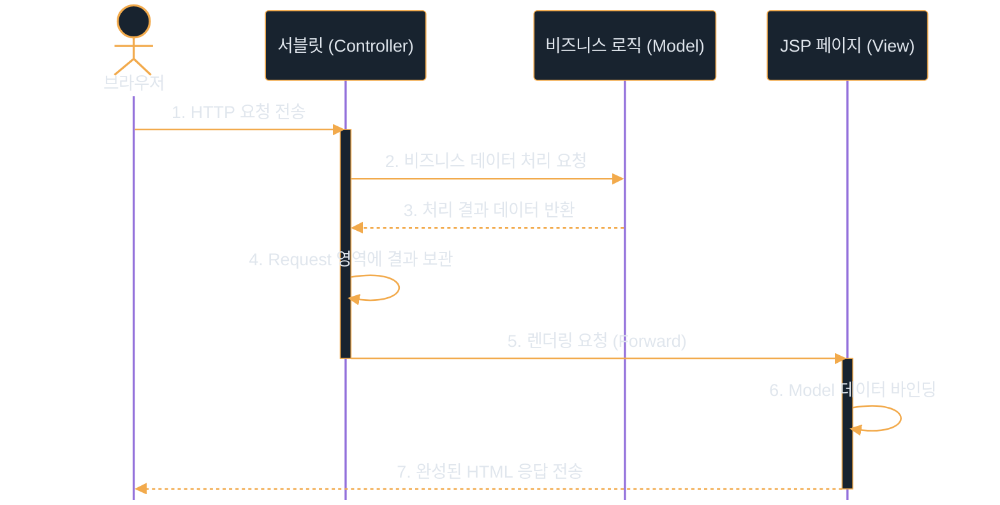
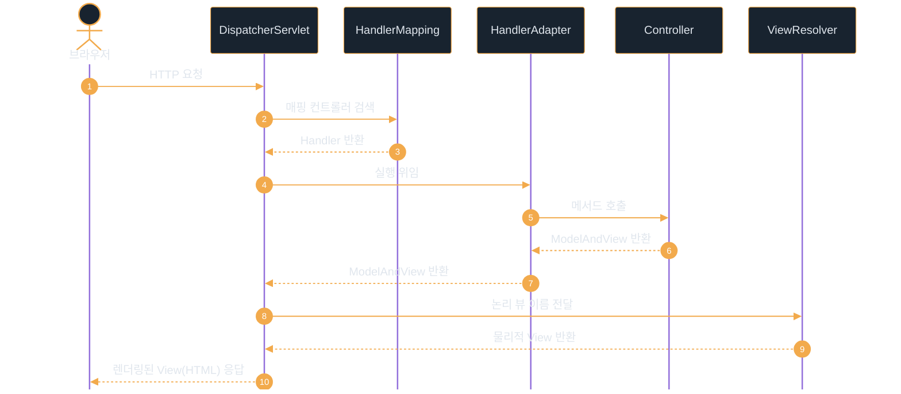
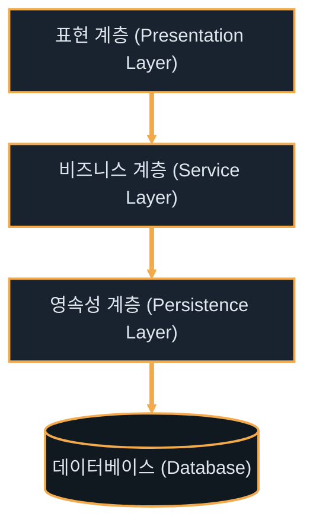

# 소프트웨어 아키텍처 패턴

---
layout: default
---

# 학습 체크리스트

- [ ] 소프트웨어 아키텍처 패턴의 도입 목적과 모듈성 가치 이해
- [ ] MVC 1, MVC 2 및 Spring Boot 웹 요청 흐름의 구조적 차이 파악
- [ ] 레이어드 아키텍처의 의존성 규칙과 SOLID 기반의 설계 의도 숙달
- [ ] 클린/헥사고날 아키텍처를 통한 비즈니스 로직 격리 및 테스트성 이해
- [ ] 프로젝트 규모와 생산성을 고려한 실무적인 아키텍처 타협점 분석

---
layout: default
---

# 아키텍처 패턴 개요

> **소프트웨어 아키텍처 패턴 (Software Architecture Pattern)**
>
> 소프트웨어 시스템의 전반적인 구조를 조직화하고 설계하기 위한 보편적이고 재사용 가능한 설계 템플릿

- **검증된 해결책**: 반복적으로 발생하는 대규모 설계 문제에 대해 검증된 모범 답안을 제공함
- **아키텍처 도입의 핵심 목적**:
  - **모듈성 (Modularity)**: 시스템을 독립적인 단위로 분리하여 복잡도를 낮춤
  - **관심사 분리 (Separation of Concerns)**: 각 모듈은 고유한 역할에만 집중함
  - **유지보수 및 확장성**: 코드의 변경이 전체 시스템에 미치는 영향을 최소화함
  - **공통 언어 제공**: 개발팀 간 일관되고 명확한 의사소통 기준을 수립함

---
layout: default
---

# MVC 아키텍처 개요

> **MVC 패턴 (Model-View-Controller)**
>
> 사용자 인터페이스, 데이터 및 제어 로직을 상호 독립적인 세 가지 컴포넌트로 분리하는 아키텍처 패턴

- **Model (모델)**:
  - 애플리케이션의 상태, 데이터 구조, 비즈니스 로직을 온전히 표현함
  - 화면(View)이나 컨트롤러(Controller)에 의존하지 않고 독립적으로 동작함

---
layout: default
---

# MVC 핵심 컴포넌트: View & Controller

- **View (화면)**:
  - 모델의 데이터를 사용자에게 시각적으로 표시해 주는 렌더링을 전담함
  - 모델의 상태 정보를 읽어와 출력하며, 모델 데이터를 직접 변경하지 않음
- **Controller (컨트롤러)**:
  - 사용자의 요청을 수신 및 유효성 검증을 수행하고, 모델의 비즈니스 로직을 호출함
  - 처리 결과에 따라 적절한 뷰를 선택하여 제어권을 넘김

---
layout: default
---

# MVC 1 vs MVC 2 아키텍처

- **MVC 1 아키텍처**:
  - 브라우저의 HTTP 요청을 JSP가 직접 받아 비즈니스 로직과 화면 출력을 동시에 수행하는 모델
  - 구조가 극도로 단순하여 소규모 프로젝트를 단기간에 개발할 때 높은 속도를 냄
  - 그러나 JSP 내부에 Java, HTML, JS, CSS가 강하게 결합되어 스파게티화 및 유지보수 불능을 야기함
- **MVC 2 아키텍처**:
  - HTTP 요청의 진입점(Controller 역할)을 JSP가 아닌 서블릿(Servlet)이 도맡도록 흐름을 완전히 분리한 구조
  - 서블릿이 비즈니스 로직을 처리한 뒤 결과 데이터를 Request Scope에 보관함
  - 이후 내부 포워드(Forward)를 통해 가려진 JSP(View)를 호출하여 사용자 화면을 렌더링함

---
layout: default
---

# MVC 아키텍처 진화 비교

| 비교 항목 | MVC 1 아키텍처 | MVC 2 아키텍처 |
| :--- | :--- | :--- |
| **요청 진입점** | JSP 페이지 | 서블릿 (Servlet) |
| **개발 난이도** | 낮음 (단순한 페이지 단위 개발) | 보통 (구조 정의 및 협업 필요) |
| **관심사 분리** | 미흡 (로직과 UI 마크업이 결합됨) | 완벽 (로직 서블릿, 화면 JSP 격리) |
| **유지보수성** | 매우 낮음 (수정 시 오작동 위험 높음) | 매우 높음 (역할이 명확하여 독립 수정 가능) |
| **적합한 규모** | 소형 프로토타입 개발 | 중대형 엔터프라이즈 시스템 |

---
layout: default
---

# MVC 2 아키텍처 처리 흐름



---
layout: default
---

# Spring MVC와 프론트 컨트롤러

> **프론트 컨트롤러 패턴 (Front Controller Pattern)**
>
> 서블릿 컨테이너 입구에 단 하나의 대표 서블릿을 배치하여, 모든 HTTP 요청을 중앙에서 일괄 수집하여 처리하는 디자인 패턴

- **DispatcherServlet (디스패처 서블릿)**:
  - Spring MVC의 심장이자 유일한 웹 진입점으로서 요청을 가장 먼저 수신함
  - 기존 MVC 2 구조에서 다수의 서블릿을 개발해야 했던 중복 코드를 제거함
  - 공통 로직(보안, 인코딩, 다국어 처리, 예외 감지)을 프론트 단에서 일괄 처리함
  - 세부 비즈니스 로직 처리는 다수의 하부 컨트롤러 빈(Bean)으로 처리를 배분함

---
layout: default
---

# Spring MVC 핵심 구성 요소

- **HandlerMapping (핸들러 매핑)**:
  - 디스패처 서블릿이 요청을 받으면, 요청 URL 및 HTTP 메서드에 매핑된 적절한 컨트롤러 빈(`Handler`)을 검색하여 탐색함
- **HandlerAdapter (핸들러 어댑터)**:
  - 조회한 컨트롤러 메서드를 실제로 호출해 주는 가교 역할을 수행함
  - 요청 매개변수의 형식 변환 및 바인딩(Argument Resolving)을 자동 대행함
- **ViewResolver (뷰 리졸버)**:
  - 컨트롤러가 처리를 끝낸 후 반환한 논리적 뷰 명칭(예: `"home"`)을 가로챔
  - 실제 화면 물리적 템플릿 경로(예: `/templates/home.html`)로 변환하고 렌더링을 실행함

---
layout: default
---

# Spring MVC 내부 요청 라이프사이클



---
layout: default
---

# 레이어드 아키텍처 (Layered Architecture)

> **레이어드 아키텍처 (Layered Architecture)**
>
> 소프트웨어 시스템의 구성 요소들을 역할과 성격에 따라 몇 개의 층(Layer)으로 나누어 배치하고 통제하는 방식

- **단방향 하향 의존성 (Downwards Dependency)**:
  - 상위 계층은 인접한 하위 계층을 사용할 수 있으나, 하위 계층은 상위 계층의 존재를 전혀 알지 못함
- **관심사 분리 (SoC) 극대화**:
  - 오직 자신에게 주어진 계층적 책임만 전담함
- **SOLID 원칙과의 연계**:
  - **단일 책임 원칙 (SRP)**: 변경의 이유가 오직 한 계층으로 국한됨
  - **개방-폐쇄 원칙 (OCP)**: 내부 구현 변경이 상위 레이어 인터페이스를 해치지 않음

---
layout: default
---

# 레이어드 아키텍처의 3대 계층

- **Presentation Layer (표현 계층 - Controller)**:
  - 사용자의 요청(HTTP, CLI 등)을 받고 가공되지 않은 데이터를 수집함
  - 요청 파라미터의 유효성 검사 및 데이터 전달 객체(DTO)로의 상호 변환을 수행함
- **Service Layer (비즈니스 계층 - Service)**:
  - 애플리케이션의 핵심 비즈니스 로직을 총괄하며 비즈니스 트랜잭션 경계를 수립함
  - 표현 계층과 데이터 액세스 계층 사이를 유연하게 중재함
- **Persistence Layer (영속성 계층 - Repository)**:
  - 데이터베이스, 파일 시스템 등 외부 매체와의 직접적 CRUD 통신을 전담함
  - 데이터 접근 구현 상세를 캡슐화하여 상위 서비스 계층을 기술 스펙으로부터 분리함

---
layout: default
---

# 레이어드 아키텍처 데이터 흐름도



---
layout: default
---

# 추상화를 통한 결합도 완화

- **강한 결합의 위험성**:
  - 서비스가 구체적인 영속성 라이브러리(JPA, MyBatis)에 직접 의존하면, 데이터베이스 연동 기술 교체 시 서비스의 핵심 비즈니스 로직 코드도 동반 수정되는 대재앙이 유발됨
- **의존성 역전 원칙 (DIP)**:
  - 서비스가 구체 클래스가 아닌 추상화된 인터페이스(`Repository`)에 결합하도록 의존 방향을 개선함
  - 런타임 시점에 스프링의 **의존성 주입 (DI)** 메커니즘을 사용해 구현체를 전달받음
- **단위 테스트 가시성 향상**:
  - 데이터베이스가 없는 환경에서도 서비스 레이어에 대한 모의 객체(Mock) 테스트 작성이 매우 용이함

---
layout: default
---

# 생성자 주입을 통한 의존성 역전

```java
// 의존성을 분리한 Repository 인터페이스
public interface MemberRepository { void save(Member m); }

// 생성자 주입(DI)을 통해 구현체를 제공받는 서비스
@Service
public class MemberService {
    private final MemberRepository repository;
    public MemberService(MemberRepository repo) { this.repository = repo; }
}
```

---
layout: default
---

# 레이어드 아키텍처의 내재적 한계

- **데이터베이스 중심 설계 (Database-Centric Design)**:
  - 전통 레이어드 아키텍처는 보통 물리적인 데이터베이스(영속성 계층)가 최하단에 위치함
  - 이로 인해 비즈니스 로직(Service)이 영속성 계층에 직접 종속되어, DB 스키마 변경 시 최상위 계층까지 영향이 연쇄 전파됨
- **기술 스펙 오염**:
  - 도메인 중심의 핵심 비즈니스 코어가 JPA 영속성 상태나 SQL 쿼리 사양에 의도치 않게 오염됨
- **의존성의 내향성 극대화**:
  - 비즈니스 핵심 도메인을 아키텍처 최중앙(Core)에 격리 배치하고 데이터베이스나 프레임워크를 바깥쪽 주변부로 이동시킴
  - 소스코드의 결합 방향이 외부 기술에서 핵심 도메인을 향해 안쪽으로만 흐르도록 의존성을 완전히 역전시킴

---
layout: default
---

# 도메인 보호를 위한 아키텍처 비교

| 아키텍처 유형 | 창시자 / 핵심 개념 | 도메인 보호 및 통제 방식 |
| :--- | :--- | :--- |
| **클린 아키텍처** | Robert C. Martin | 의존성 규칙(Dependency Rule)으로 안쪽 원(도메인 엔티티)으로만 흐르게 강제 |
| **헥사고날 아키텍처** | Alistair Cockburn | 포트(Port - 인터페이스)와 어댑터(Adapter - 구현체) 구조로 코어 결합 |
| **도메인 주도 설계 (DDD)** | Eric Evans | 기술 영역과 도메인 모델을 분리, 바운디드 컨텍스트 내에서 에그리게이트 협동 |

---
layout: default
---

# 클린 아키텍처의 구조적 계층

- **도메인 계층 (Domain Entities)**:
  - 비즈니스 핵심 규칙과 순수한 도메인 객체가 상주하는 아키텍처의 심장부
  - 특정 프레임워크나 외부 데이터베이스 라이브러리에 전혀 오염되지 않은 순수 자바(POJO)로 작성됨
- **애플리케이션 계층 (Use Cases)**:
  - 시스템이 수행해야 할 구체적인 비즈니스 유스케이스 흐름을 관장함
  - 도메인 엔티티들의 실행 절차를 관리하고 외부 통신을 위한 포트(Port) 인터페이스를 정의함
- **프레젠테이션 계층 (Presentation Adapter)**:
  - HTTP 요청 수신, JSON 파싱, 파라미터 유효성 검사 등 외부 유입 접점을 연결함
- **인프라 계층 (Infrastructure Adapter)**:
  - JPA 리포지토리 실제 구현, 외부 통신 API 클라이언트, 메시지 큐 연동 등 구체적 하드웨어 및 외부 기술 구현체가 위치함

---
layout: default
---

# 헥사고날 아키텍처의 흐름 구조


---
layout: default
---

# 테스트와 모니터링 편의성 향상

- **TDD (테스트 주도 개발) 가속화**:
  - 핵심 도메인 코드가 웹 서버나 특정 DBMS 등 어떠한 외부 인프라 기술에도 결합되지 않음
  - 데이터베이스 커넥션 설정이나 무거운 Mock 객체 생성 없이, 초고속으로 작동하는 순수 Java 단위 테스트 작성이 수월해져 TDD 피드백 루프가 안정적으로 보장됨
- **오염 없는 관찰 가능성 (Observability) 이식**:
  - 유스케이스 단위로 비즈니스 실행 흐름이 일목요연하게 통제됨
  - 비즈니스 메트릭 측정, 분산 추적용 트레이스 아이디 부여, 보안 감사 로그 수집 코드를 AOP나 어댑터 레이어를 통해 주입함
  - 이로 인해 핵심 도메인 내부 소스코드를 오염시키지 않고 깔끔하게 모니터링을 이식함

---
layout: default
---

# 실무 타협점: MVC와 레이어드 결합

- **보편적인 선택**:
  - 대부분의 스타트업 서비스 및 중소규모 비즈니스에서 생산성이 가장 강력하게 입증된 실무 표준임
  - 직관적인 흐름 덕분에 신규 개발자의 진입 장벽이 낮고 즉시 구현 속도를 극대화할 수 있음
- **수평적 직접 흐름 구조**:
  - 불필요한 포트 인터페이스 생성을 건너뛰고, 상위 계층이 하위 계층을 다이렉트로 호출하여 이동함
  - 이로 인해 중복 보일러플레이트 파일 개수가 획기적으로 감소함
- **JPA 엔티티(Entity)의 역할 일원화**:
  - 영속성 계층의 JPA 엔티티와 도메인 모델을 따로 분리하지 않고 일원화함
  - 서비스 계층이 JPA의 변경 감지(Dirty Checking) 및 지연 로딩(Lazy Loading) 등 프레임워크 편리 기능을 그대로 직간접 수용함

---
layout: default
---

# MVC + 레이어드 패키지 구조 예시

```text
com.example.project
├── controller      // 표현 계층 (HTTP 요청 처리 및 유효성 검증)
│   └── dto         // 데이터 전송 객체 패키지 (Request, Response)
├── service         // 비즈니스 계층 (핵심 로직 처리 및 트랜잭션 경계 설정)
├── repository      // 데이터 접근 계층 (인터페이스 및 쿼리 메소드 정의)
│   └── entity      // 데이터베이스 테이블과 1:1 매핑되는 객체 패키지
└── config          // 보안, 데이터베이스, 프레임워크 설정 등
```

---
layout: default
---

# 레이어드 결합 아키텍처 특징 요약

- [ ] **높은 생산성**: 추상화 레이어가 얇아 파일 생성이 최소화되며 구현 변경이 매우 직관적임
- [ ] **데이터베이스 직접 의존**: 서비스 레이어가 엔티티를 직접 조작하므로 DB 상태에 조밀하게 의존함
- [ ] **기술 침투 허용**: 스프링 빈이나 JPA 영속성 컨텍스트 기술이 비즈니스 영역 깊숙이 침투함
- [ ] **간단한 테스트 가능**: 모의 객체 프레임워크(Mockito)의 도움을 받으면 무리 없이 비즈니스 테스트가 가능함

---
layout: default
---

# 실무 타협점: 약식 클린 아키텍처

- **정석 클린 아키텍처의 현실적 문제**:
  - 수많은 변환용 DTO와 포트(Port) 인터페이스를 반복 정의해야 하므로, 개발 생산성이 지나치게 하락함
- **약식 헥사고날 / 클린 아키텍처 지향**:
  - 핵심 비즈니스 로직을 도메인 모델 내에 강하게 응집시키되, 컨트롤러 및 데이터베이스와의 직접적인 의존성만 차단함
- **핵심 타협 방식**:
  - **엔티티 통합**: 도메인 객체와 JPA 엔티티를 하나로 결합해 필드 매핑 리소스를 절감함
  - **아웃고잉 포트 적용**: DB 및 외부 PG사 등 외부 연동에 대해서는 인터페이스(`Port`)를 정의하고 인프라 폴더에서 이를 구현(`Adapter`)하여 서비스의 직접 의존을 차단함
  - **인커밍 포트 생략**: 컨트롤러가 서비스를 직접 호출하여 보일러플레이트 파일을 생략함

---
layout: default
---

# 약식 클린 아키텍처 패키지 구조

```text
com.example.project
├── domain          // 도메인 계층 (핵심 비즈니스 규칙 및 비즈니스 엔티티)
│   ├── model       // 핵심 도메인 모델 패키지 (Entity, Value Object)
│   └── service     // 도메인 단위 service 패키지
├── application     // 애플리케이션 계층 (유스케이스 흐름 조율 및 기술적 추상화)
│   ├── port        // 외부 통신 및 흐름 진입을 위한 추상 포트 (out만 정의)
│   └── service     // 애플리케이션 서비스 구현체 패키지 (흐름 제어)
├── infrastructure  // 인프라 계층 (구체 어댑터)
│   ├── persistence // 데이터베이스 접근 어댑터 패키지 (Repository 구현체 등)
│   └── external    // 외부 API, PG 연동 어댑터 패키지
└── presentation    // 프레젠테이션 계층 (클라이언트 인터페이스)
    ├── controller  // HTTP 요청을 매개하는 컨트롤러 패키지
    └── dto         // 표현 계층 전용 데이터 전송 객체 패키지
```

---
layout: default
---

# 약식 클린 아키텍처 타협 요약

- [ ] **JPA 엔티티 오버라이드 허용**: 도메인 모델에 JPA 매핑 어노테이션 기입을 허용하여 데이터 변환 비용을 최소화함
- [ ] **인커밍 포트 제거**: 유스케이스 단위의 `In-Port`를 생략해 표현 계층이 애플리케이션 서비스를 다이렉트로 호출하게 함
- [ ] **아웃고잉 포트 유지**: 데이터베이스 및 외부 서버 연동은 반드시 포트 인터페이스를 통과하도록 유지함
- [ ] **핵심 가치 보존**: 외부 DB 기술 교체나 외부 파트너사 통신 로직 변경으로부터 비즈니스 유스케이스 코드를 안전하게 격리 방어함
