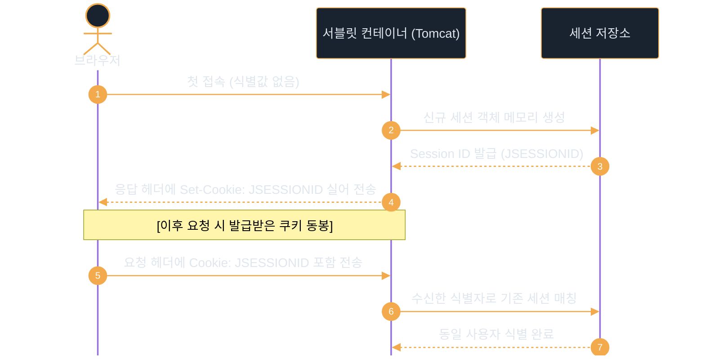

# 쿠키와 세션

---
layout: default
---

# 학습 체크리스트

- [ ] HTTP 무상태성 보완을 위한 쿠키와 세션의 존재 이유 이해
- [ ] XSS, 스니핑, CSRF에 대응하는 쿠키 3대 보안 속성 작동 원리 습득
- [ ] JSESSIONID 발급과 검증을 통한 세션 식별 라이프사이클 분석
- [ ] 인메모리, 데이터베이스, Redis 세션 저장소의 아키텍처별 특징 비교

---
layout: default
---

# HTTP 프로토콜의 특성

> **무상태성 (Stateless)**
>
> 서버가 클라이언트의 상태 정보를 보존하지 않으며, 각 요청을 독립적인 거래로 취급하는 특성

> **비연결성 (Connectionless)**
>
> 클라이언트의 요청에 대한 응답을 마친 직후, 즉시 물리적인 네트워크 연결을 끊어버리는 특성

- **상태 유지의 한계**: 페이지를 이동할 때마다 사용자의 이전 로그인 여부나 선택 상태를 알 수 없음
- **해결 방안**: 상태 비보존을 극복하기 위해 클라이언트 측(쿠키) 및 서버 측(세션) 상태 관리 기법이 등장함

---
layout: default
---

# 쿠키의 기본 개념

> **쿠키 (Cookie)**
>
> HTTP의 무상태성을 보완하기 위해 클라이언트 브라우저 측에 저장되는 키-값 쌍의 작은 텍스트 데이터

- **전송 메커니즘**:
  - **응답 헤더 주입**: 서버가 HTTP 응답의 `Set-Cookie` 헤더를 통해 쿠키를 주입함
  - **자동 요청 동봉**: 브라우저는 저장된 쿠키를 이후 동일 도메인의 모든 HTTP 요청 헤더(`Cookie`)에 실어 자동 전송함
- **클라이언트 측 상태 관리**: 사용자의 환경 설정, 오늘 하루 보지 않기 팝업 기록, 가벼운 장바구니 정보 등을 브라우저가 직접 저장하고 관리함

---
layout: default
---

# 쿠키의 분류와 생명주기

- **쿠키의 수명 결정**: `Max-Age` 또는 `Expires` 속성을 어떻게 지정하느냐에 따라 생명주기가 통제됨

| 쿠키 유형 | 유효 수명 (Lifetime) | 영속성 및 삭제 여부 |
| :--- | :--- | :--- |
| **세션 쿠키 (Session Cookie)** | 만료 기간을 명시하지 않음 | 브라우저 종료 시 즉각 소멸함 |
| **지속성 쿠키 (Persistent Cookie)** | 특정 유효 기간을 지정함 | 브라우저를 닫아도 수명만큼 기기에 하드웨어 보존됨 |

- **임의 소멸**: 서버가 특정 쿠키를 지우고 싶다면, `Max-Age` 속성을 `0`으로 지정한 쿠키를 다시 응답하면 즉각 삭제 처리됨

---
layout: default
---

# 쿠키 보안 핵심 속성: HttpOnly

- **쿠키의 보안 위협 (XSS 공격)**:
  - 공격자가 악성 자바스크립트를 삽입하여 타 사용자의 브라우저에서 실행되도록 유도함
  - 실행된 스크립트가 `document.cookie`에 접근해 인증 토큰을 읽고 외부 해커 서버로 전송(유출)함
- **HttpOnly 속성의 방어 원리**:
  - 브라우저 환경에서 자바스크립트를 이용한 쿠키 접근을 원천 차단함
  - 악성 스크립트가 실행되더라도 쿠키 데이터를 읽을 수 없어 토큰 유출을 완벽히 예방함

---
layout: default
---

# 쿠키 보안 핵심 속성: Secure & SameSite

- **Secure 속성 (네트워크 스니핑 방어)**:
  - **네트워크 스니핑**: 해커가 공용 Wi-Fi 등 동일 네트워크 망에서 전송되는 비암호화(HTTP) 패킷을 가로채어 쿠키 평문 데이터를 탈취하는 도청 공격
  - **방어 메커니즘**: SSL/TLS가 적용된 HTTPS 암호화 접속 상태에서만 쿠키가 브라우저 외부로 송출되도록 강제하여, 통신 도청으로 인한 쿠키 노출을 원천 방지함
- **SameSite 속성 (CSRF 공격 방어)**:
  - **CSRF 공격**: 로그인된 사용자가 악성 메일/링크를 클릭해 위조 요청을 보내면, 브라우저가 사용자의 인증 쿠키를 자동 동봉하여 악의적 동작을 자동 수행시키는 취약점
  - **방어 메커니즘**: 교차 출처(Cross-Site) 요청 시 쿠키 전송 여부의 엄격성(`Strict`, `Lax`, `None`)을 지정하여, 제3자 사이트에서의 쿠키 자동 동봉을 원천 차단함

---
layout: default
---

# 쿠키 제어 API 명세

- **생성자**:
  - `new Cookie(String name, String value)`: 특정 키와 값으로 쿠키 객체를 로컬 선언함
- **속성 설정 및 제어**:
  - `cookie.setHttpOnly(boolean isHttpOnly)`: 브라우저 JS 접근 권한 차단 설정
  - `cookie.setSecure(boolean isSecure)`: HTTPS 채널 전송 한정 여부 부여
  - `cookie.setMaxAge(int seconds)`: 초 단위 유효 수명 지정 (`0`은 삭제, 음수는 세션 쿠키)
- **전송 및 조회**:
  - `response.addCookie(Cookie cookie)`: 응답 헤더에 빌드된 쿠키 객체를 담아 전송
  - `request.getCookies()`: 클라이언트 요청으로 들어온 전체 쿠키 배열(`Cookie[]`) 반환

---
layout: default
---

# 쿠키 발행 및 보안 속성 적용

```java
// 보안 옵션을 부여한 쿠키 생성
Cookie cookie = new Cookie("userToken", "XYZ123");
cookie.setHttpOnly(true);   // XSS 방어
cookie.setSecure(true);     // HTTPS 전송 강제
cookie.setMaxAge(60 * 60);  // 1시간 유지

// 응답 객체에 탑재하여 전송
response.addCookie(cookie);
```

---
layout: default
---

# 세션의 기본 개념

> **세션 (Session)**
>
> 클라이언트의 상태 정보를 브라우저가 아닌 서버 측의 안전한 보관소에서 일괄 저장하고 관리하는 기술

- **서버 중심 통제**:
  - 민감한 개인 정보나 중요한 로그인 인증 데이터를 서버 내부의 안전한 힙 영역에 유지함
  - 클라이언트 기기나 네트워크상에 중요 데이터가 절대 노출되지 않도록 은닉함
- **유연한 데이터 수집**:
  - 서블릿 생태계에서는 `HttpSession` 인터페이스를 제공함
  - 단순 텍스트뿐만 아니라 자바 객체(Object) 전체를 메모리에 가둔 채 연계하여 활용함

---
layout: default
---

# 세션 ID 식별 메커니즘

- **JSESSIONID 협업 구조**:
  - 세션 데이터는 서버에 저장되지만, "이 세션이 누구의 것인가"를 식별하기 위해 쿠키 기술을 매개체로 차용함
- **세션 ID 발급**:
  - 브라우저가 최초 접속 시 서버는 고유한 **JSESSIONID** (세션 ID)를 발행하고 이를 쿠키에 실어 전송함
- **요청 식별**:
  - 브라우저는 재요청할 때마다 해당 `JSESSIONID`를 요청 헤더에 자동으로 실어 보냄
  - 서버는 요청에 포함된 세션 ID로 메모리 맵(Map)을 조회하여 해당 클라이언트 세션 객체를 정확히 매칭함

---
layout: default
---

# 세션 식별 라이프사이클



---
layout: default
---

# 세션 저장소의 아키텍처 비교

| 저장 방식 | 저장 메커니즘 | 장점 및 단점 |
| :--- | :--- | :--- |
| **JVM 인메모리** | 서블릿 컨테이너 JVM 힙에 저장 | 단순하고 빠르나, 다중 서버 간 불일치가 발생하고 서버 리부팅 시 소멸함 |
| **JDBC Session** | 관계형 DB(MySQL 등) 테이블에 기록 | 다중 WAS 간 공유가 쉽고 안전하나, 매 요청마다 DB 조회 오버헤드가 발생함 |
| **Shared Redis** | 외부 고속 분산 캐시 시스템에 통합 | 고속 세션 공유가 보장되는 분산 시스템 환경의 실무 표준 (De facto standard) |

---
layout: default
---

# 세션 상태 관리 및 생명주기

- **세션 리소스 회수 기법**:
  - 서버 메모리는 유한하므로 미사용 세션을 자동으로 만료시켜 자원을 회수해야 함
- **세션 타임아웃 (Timeout)**:
  - 사용자의 마지막 요청으로부터 일정 유효 시간(기본 30분) 동안 활동이 없으면 세션을 소멸시킴
- **동작 원리**:
  - 클라이언트 요청이 들어올 때마다 해당 세션 객체의 마지막 액세스 시각(`LastAccessedTime`)을 갱신함
  - 설정된 대기 주기를 초과하도록 유입이 단절되면, WAS 백그라운드 스레드가 세션을 파괴함

---
layout: default
---

# 세션 제어 API 명세

- **세션 획득**:
  - `request.getSession(true)`: 현재 연동된 세션을 조회하되, 없을 경우 신규 생성하여 반환함
  - `request.getSession(false)`: 기존 연동된 세션만 조회하며, 없을 경우 `null`을 반환함
- **데이터 보관 및 처리**:
  - `session.setAttribute(String name, Object value)`: 세션 스코프에 임의 객체 등록
  - `session.getAttribute(String name)`: 저장된 보관 키로 객체 리턴 (다운캐스팅 필요)
  - `session.removeAttribute(String name)`: 저장된 특정 바인딩 객체 제거
- **세션 무효화**:
  - `session.invalidate()`: 현재 세션을 즉시 완전 소멸시키고 바인딩 데이터를 해제함

---
layout: default
---

# 세션 속성 바인딩 및 무효화

```java
// 세션 획득 및 로그인 데이터 바인딩
HttpSession session = request.getSession(true);
session.setAttribute("loginUser", loginMember);

// 로그아웃 수행 시 바인딩 파괴 및 세션 소멸
session.removeAttribute("loginUser");
session.invalidate();
```

---
layout: default
---

# 인증과 인가 개요

> **인증 (Authentication)**
>
> 사용자가 주장하는 신원이 실제로 부합하는지 신뢰 가능한 정보(아이디/비밀번호 등)로 식별하여 검증하는 과정

> **인가 (Authorization)**
>
> 신원이 검증된 사용자에게 시스템 내부의 특정 리소스에 접근하거나 비즈니스 기능을 수행할 수 있도록 권한을 부여하는 과정

- **개념의 차이**:
  - **인증**: "이 사용자가 우리 시스템 회원(`userA`)이 맞는가?"에 대한 답
  - **인가**: "이 사용자(`userA`)가 관리자 전용 웹 메뉴(`/admin`)에 진입할 수 있는가?"에 대한 판단

---
layout: default
---

# 서블릿 기반 인증 제어 흐름

- **로그인 인증 처리**:
  - 사용자 유입 시 입력 암호를 DB 암호화 해시와 검증 대조함
  - 검증 성공 시 `request.getSession(true)`을 호출해 전용 세션을 확보함
  - 식별 멤버 정보나 권한 등급을 `"loginUser"` 키로 세션 맵에 동적으로 등록함
- **로그아웃 인증 무효화**:
  - 로그아웃 비즈니스 API가 호출되면 `session.invalidate()`를 수행함
  - 서버 측의 모든 로그인 정보 보관 맵을 완전 파괴하여 재인증을 유도함

---
layout: default
---

# 서블릿 필터를 활용한 공통 인가 제어

- **컨트롤러 중복 코드의 한계**:
  - 보호되는 모든 페이지의 비즈니스 컨트롤러마다 매번 로그인 세션 체크 코드를 중복 기입하는 것은 매우 비효율적임
- **공통 필터를 통한 요청 가로채기 (향후 학습)**:
  - 공통 영역인 **서블릿 필터 (Servlet Filter)**를 이용해 특정 보호 경로(예: `/admin/*`)로의 모든 요청을 사전 차단 및 가로챌 수 있음
  - 필터가 세션의 권한을 가로채 검증한 후, 인증되지 않은 사용자는 로그인 화면(`/login`) 등으로의 제어권 전환(Redirect)을 일괄 대행함

---
layout: default
---

# 향후 확장 학습: Spring Security와 JWT

- **Spring Security 연계**:
  - 서블릿 필터(`Filter`) 기반 보안 메커니즘을 정형화하고 고도화한 프레임워크가 바로 Spring Security임
  - 앞서 습득한 필터 기반의 가로채기 메커니즘이 Spring Security의 핵심 동작 토대가 됨
- **JWT (JSON Web Token)의 안전한 관리**:
  - 발급된 토큰(특히 수명이 긴 Refresh Token)을 로컬 스토리지에 보관하면 XSS 공격에 취약함
  - 이를 보완하기 위해 **보안 옵션(`HttpOnly`, `Secure`)이 활성화된 쿠키**에 토큰을 저장하여 토큰 탈취를 원천 방어함

---
layout: default
---

# 핵심 요약: 쿠키와 세션

- **쿠키 (Cookie)**:
  - 브라우저에 저장되는 텍스트로, 보안 위협 극복을 위해 `HttpOnly`, `Secure`, `SameSite` 지정 필수
- **세션 (Session)**:
  - 서버 측 안전 보관소로, `JSESSIONID` 식별 키 쿠키와 협업해 클라이언트를 식별함
  - 분산 대규모 WAS 아키텍처 환경에서는 **Shared Redis** 저장소가 실무적 De facto 표준임
- **인증 및 인가**:
  - 세션 멤버 상태 저장을 통해 인증을, **서블릿 필터** (Filter)를 활용해 공통 인가 처리를 제어함
