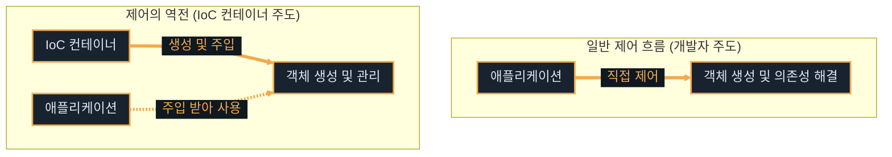
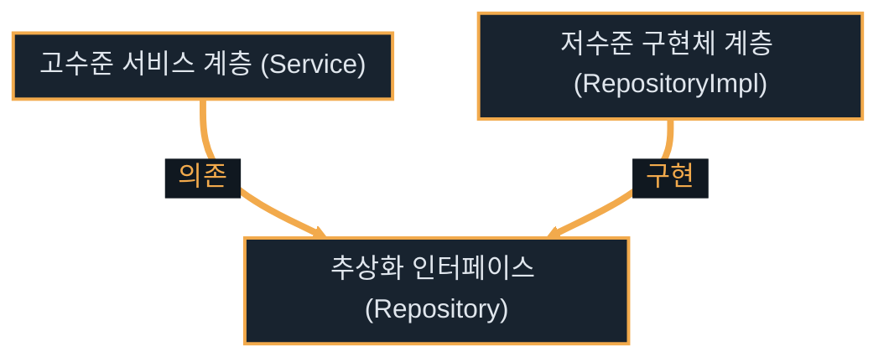

# Spring Core

---
layout: default
---

# 학습 체크리스트

- [ ] Spring Framework의 탄생 배경과 스프링 부트 버전별 차이점 이해
- [ ] Spring의 3대 개념인 IoC, DI, AOP의 역할 및 차이점 숙지
- [ ] Spring Bean의 생명주기와 싱글톤/프로토타입 스코프 혼용 시 주의점 분석
- [ ] SOLID 설계 원칙(DIP/OCP) 및 클린 아키텍처 실현 도구로서의 DI 이해
- [ ] 빈 등록 방식(수동 vs 자동)과 생성자 주입의 필요성 및 Lombok 활용 패턴 학습

---
layout: default
---

# EJB의 한계와 Spring의 탄생

> **EJB (Enterprise JavaBeans)**
>
> 과거 Java 진영의 표준 기술이었으나, 높은 복잡성과 프레임워크 기술의 침투적 오염으로 POJO 개발을 저해했던 중량 기술

- **과도한 기술적 복잡도**: EJB 컨테이너 구동을 위해 고가의 무거운 WAS 장비가 강제됨
- **프레임워크 비종속성**: 프레임워크 기술에 코드가 침투적으로 오염되어 비즈니스 로직 격리 불가능
- **POJO 지향 경량화**: 로드 존슨 등이 단순하고 투명한 자바 객체 중심의 POJO 개발을 표방하며 Spring 창시

---
layout: default
---

# Spring Framework의 초기 발전사

- **2002년 (시작점)**: 로드 존슨이 저서 *Expert One-on-One J2EE Design and Development*를 출간하며 EJB 대안 코드 제시
- **2003년 (1.0)**: 오픈소스 프레임워크로 공식 등록 및 XML 설정 기반의 핵심 컨테이너 기능 제공
- **2006년 (2.0)**: XML 스키마 도입으로 설정 편의성 증대 및 커스텀 XML 네임스페이스 지원
- **2009년 (3.0)**: 자바 어노테이션 기반 설정(`@Configuration`, `@Bean`) 도입 및 SpEL 공식 지원

---
layout: default
---

# Spring Framework의 현대적 진화

- **2013년 (4.0)**: Java 8 스펙을 전면 지원하고 조건부 빈 등록(`@Conditional`) 제공
- **2014년 (Boot 1.0)**: 설정의 복잡도를 혁신적으로 낮춘 스프링 부트(Spring Boot) 출시
- **2017년 (5.0)**: WebFlux를 통한 리액티브 프로그래밍 표준 제시 및 Reactive Stack 공식 탑재
- **2022년 (6.0 / Boot 3.0)**: Java 17 최소 요구 스펙 지정 및 Jakarta EE 9/10 전면 도입
- **2025년 (7.0 / Boot 4.0)**: Jakarta EE 11 채택, Java 25 공식 지원 및 JSpecify 기반 Null Safety 도입

---
layout: default
---

# Spring Boot 및 Framework 버전 대응

| Spring Boot 버전 | 대응 Spring Framework 버전 | 최소 요구 JDK 버전 | 주요 핵심 변화 및 특징 |
| :--- | :--- | :--- | :--- |
| **Boot 1.x** | Spring 4.x | JDK 6 또는 7 (1.5 이후 7) | 내장 Tomcat 최초 지원 및 자바 설정 파일 대중화 |
| **Boot 2.x** | Spring 5.x | JDK 8 | 함수형 인터페이스/람다 표준화 및 WebFlux 도입 |
| **Boot 3.x** | Spring 6.x | **JDK 17** (21 권장) | **Jakarta EE 9/10 전면 전환** 및 가상 스레드 지원 |
| **Boot 4.x** | Spring 7.x | **JDK 17** (25 권장) | **Jakarta EE 11 전면 전환**, JSpecify 도입, 내장 Resilience 제공 |

---
layout: default
---

# Spring 7 및 Boot 4 핵심 특징

- **Jakarta EE 11 규격 채택**: Servlet 6.1 및 JPA 3.2 등 최신 엔터프라이즈 표준 규격 탑재
- **JSpecify Null Safety**: 프레임워크 전반에 JSpecify 애너테이션 도입으로 컴파일 시점 null 안전성 확보
- **내장형 회복탄력성 (Resilience)**: 외부 라이브러리 없이 자체적 `@Retryable` 등의 패턴 연동
- **AOT 및 Native Image 최적화**: GraalVM 빌드 고속화 및 Spring Data AOT 리포지토리 도입

---
layout: default
---

# Spring 3대 핵심 개념 (IoC, DI, AOP)

- **IoC (제어의 역전)**: 객체의 생성, 구성, 수명주기 등 제어 주도권이 컨테이너로 이동
- **DI (의존성 주입)**: 객체 간의 연관 관계를 스스로 맺지 않고 외부 컨테이너가 런타임에 주입
- **AOP (관점 지향 프로그래밍)**: 로깅, 트랜잭션 등 공통 관심사를 핵심 비즈니스 로직과 분리

---
layout: default
---

# 제어의 역전(IoC) 제어 흐름 비교



---
layout: default
---

# 제어 주도권의 위임

> **밀키트 배송 서비스**
>
> 요리사(개발자)가 식재료를 직접 장보고 고르는 대신, 이미 용량에 맞게 완포장 배송된 재료를 받아 조리(비즈니스 실행)에만 집중하는 방식

- **기존 방식**: 개발자가 코드 내부에서 `new` 키워드로 필요한 인스턴스를 직접 인스턴스화
- **역전된 방식**: 프레임워크가 객체의 생성 및 라이프사이클을 통제하고 개발자는 로직 수행만 전담

---
layout: default
---

# Spring Container와 Bean

> **스프링 컨테이너 (Spring Container)**
>
> 개발자를 대신해 자바 객체(Bean)의 생명주기를 직접 제어하고, 객체 간의 연관 관계를 매핑·조립하는 실행 엔진

- **ApplicationContext**: 컨테이너 역할을 하며, 지정된 설정 정보(Java Config)를 바탕으로 동작
- **스프링 빈 (Spring Bean)**: 스프링 컨테이너가 스스로 인스턴스화하고 관리하여 조립 완료된 자바 객체

---
layout: default
---

# Bean Scope - 싱글톤 vs 프로토타입

| 비교 항목 | 싱글톤 (Singleton) 스코프 | 프로토타입 (Prototype) 스코프 |
| :--- | :--- | :--- |
| **생성 시점** | 컨테이너 초기 기동 시 (Eager) | 빈 요청 시마다 동적 생성 (Lazy) |
| **인스턴스 수** | 스프링 컨테이너 내 단 1개 공유 | 요청할 때마다 항상 새로운 인스턴스 |
| **소멸 콜백** | 컨테이너 종료 시 `@PreDestroy` 수행 | 관리 안 함 (리소스 해제 책임은 호출자) |
| **주의 사항** | **무상태(Stateless)** 설계 필수 | 생성 이후 스프링이 소멸을 관리하지 않음 |

---
layout: default
---

# 의존성 주입(DI)의 기본 원리

> **의존성 주입 (Dependency Injection)**
>
> 객체가 스스로 필요한 협력 대상을 찾거나 생성하지 않고, 컨테이너가 런타임에 의존 관계를 외부에서 직접 결합해 주는 디자인 패턴

- **추상화 의존**: 컴파일 시점에는 구현체가 아닌 인터페이스에만 결합하도록 설계
- **동적 바인딩**: 애플리케이션 실행 시점(Runtime)에 스프링 컨테이너가 실제 구현체 인스턴스를 주입

---
layout: default
---

# 외부와의 협력 결합 구조

> **스마트폰과 충전 단자**
>
> 기기 내부에 특정 충전 케이블을 직접 납땜(강한 결합)하지 않고, 표준 C타입 단자(인터페이스)를 배치하여 외부에서 충전선(구현 객체)을 갈아 끼우는 방식

- **기기 내부 독립**: 충전 단자 규격만 맞으면 어떤 제조사의 케이블이든 유연하게 결합 가능
- **부품 교체 용이**: 스마트폰 본체 코드를 분해하거나 훼손하지 않고 외부 케이블만 쉽게 교체

---
layout: default
---

# DI와 SOLID 설계 원칙

- **DIP (의존역전 원칙) 완성**: 고수준 모듈이 하위 구현체에 의존하지 않고 인터페이스를 의존하게 강제
- **OCP (개방-폐쇄 원칙) 만족**: 기존 비즈니스 로직 변경 없이 새로운 구현 클래스를 플러그인처럼 교체
- **결합도 완화**: 구체적인 타입 결합을 낮춰 유지보수 및 코드 확장성을 향상시킴

---
layout: default
---

# DIP (의존역전 원칙) 의존성 구조



---
layout: default
---

# DI와 클린 아키텍처

- **의존성 방향의 통제**: 의존성 방향이 웹이나 DB가 아닌 고수준의 핵심 비즈니스(도메인/엔티티)를 향함
- **제어 흐름과 의존 방향 역전**: 웹/DB가 비즈니스를 호출하지만, 물리적 코드는 비즈니스의 인터페이스를 의존
- **도메인 영역 기술 독립성**: 순수 POJO 형태를 유지하여 데이터베이스나 외부 API 기술 오염 차단

---
layout: default
---

# 스프링 빈 등록 방식 비교

| 비교 항목 | 수동 빈 등록 (`@Configuration` + `@Bean`) | 자동 빈 등록 (`@ComponentScan` + `@Component`) |
| :--- | :--- | :--- |
| **설정 위치** | 설정 클래스 내부에 자바 코드로 통합 관리 | 각 컴포넌트 클래스 선언부에 어노테이션 추가 |
| **등록 주체** | 개발자가 명시적으로 반환 메서드 작성 | 스프링 컴포넌트 스캐너가 자동 수집 |
| **주요 용도** | 외부 라이브러리 객체, 전역 기술 및 설정 빈 | 일반 업무 비즈니스 로직 (Controller, Service) |

---
layout: default
---

# 수동 빈 등록 문법 (Java Config)

```java
@Configuration
public class AppConfig {
    @Bean
    public MemberRepository memberRepository() {
        return new MemoryMemberRepository();
    }
}
```

---
layout: default
---

# 자동 빈 등록 및 주입 문법

```java
@Component
public class MemberService {
    private final MemberRepository memberRepository;

    @Autowired // 생성자가 1개인 경우 생략 가능
    public MemberService(MemberRepository memberRepository) {
        this.memberRepository = memberRepository;
    }
}
```

---
layout: default
---

# 의존성 주입 방식 비교

| 비교 항목 | 필드 주입 | Setter (수정자) 주입 | 생성자 주입 |
| :--- | :--- | :--- | :--- |
| **문법 스타일** | `@Autowired private Field f;` | `@Autowired public void setF(F f)` | `public Class(Field f) { ... }` |
| **불변성 확보** | 불가능 | 불가능 (임의 변경 가능) | **가능** (`final` 키워드 지정) |
| **의존성 누락** | NPE 발생 (런타임) | NPE 발생 (런타임) | **컴파일 타임 차단** (빌드 에러) |
| **순환 참조** | 메서드 실행 시 에러 | 메서드 실행 시 에러 | **컨테이너 기동 시 차단** (기동 에러) |

---
layout: default
---

# 생성자 주입을 권장하는 이유

- **불변성 (Immutability) 보장**: `final` 필드 사용으로 런타임에 의존성 오염 원천 차단
- **주입 누락 방지**: 생성자 생성 시 필수 객체가 비어있다면 컴파일 오류로 빠른 발견 가능
- **순환 참조 예방**: 기동 시점에 `BeanCurrentlyInCreationException` 발생으로 예방 가능
- **순수 자바 테스트**: 스프링 컨테이너 기동 없이 JUnit 등으로 Mock 인스턴스 주입 테스트 편리

---
layout: default
---

# Lombok 기반 생성자 주입 자동화 문법

```java
@Component
@RequiredArgsConstructor
public class MemberService {
    private final MemberRepository memberRepository;
}
```

---
layout: default
---

# AOP 개념 및 동작 원리

> **AOP (Aspect Oriented Programming)**
>
> 로깅, 트랜잭션 등 여러 비즈니스 로직에 공통적으로 나타나는 횡단 관심사를 핵심 비즈니스 영역과 분리하여 모듈화하는 기술

- **프록시 기반 동작**: 스프링은 런타임에 프록시 객체를 생성하여 실제 객체의 메서드 호출을 가로챔
- **선언적 트랜잭션 (`@Transactional`)**: 비즈니스 메서드 시작 시 트랜잭션을 열고, 종료 시 자동으로 커밋/롤백을 대행하는 AOP의 대표적 활용 문법

---
layout: default
---

# 공통 관심사의 분리

> **생산 공장과 안전 점검원**
>
> 작업자(핵심 로직)가 제품 조립 시마다 안전모 확인 및 보고서 작성(공통 관심사)을 수동으로 하지 않고, 출입문 앞의 점검원(프록시)이 이를 일괄 처리 및 기록하는 방식

- **비즈니스 고립**: 핵심 업무 코드는 오직 자신의 본업 비즈니스 수행에만 집중
- **일괄 제어**: 공통 로깅이나 트랜잭션 등은 비즈니스 코드 침투 없이 외부 프록시 단에서 처리

---
layout: default
---

# AOP 커스텀 구현을 지양하는 이유

- **높은 개념 학습 장벽**: Aspect, Pointcut, Advice 등 생소하고 복잡한 AOP 특유의 전용 언어와 개념 숙지 필요
- **디버깅 및 흐름 분석의 난해함**: 런타임에 프록시가 보이지 않게 개입하므로 에러 발생 시 호출 스택 디버깅이 극도로 까다로움
- **완성형 어노테이션 제공**: 트랜잭션(`@Transactional`) 등 빈번한 횡단 관심사는 프레임워크가 이미 제공하므로 초심자가 직접 짤 일이 없음

---
layout: default
---

# 핵심 정리: Spring Core

- **POJO 지향**: 복잡한 EJB의 침투성을 배제하고 자바 단순 객체 중심으로 설계
- **IoC / DI**: 객체 생명주기 및 의존 관계 바인딩을 스프링 컨테이너로 위임하여 결합도 완화
- **싱글톤 / 프로토타입**: 기본 싱글톤 빈은 무상태로 설계하고, 혼용 시 생성 시점 주입 한계 인지
- **생성자 주입**: 불변성 확보 및 순환 참조 방지를 위해 생성자 주입을 사용하며 Lombok으로 자동화
