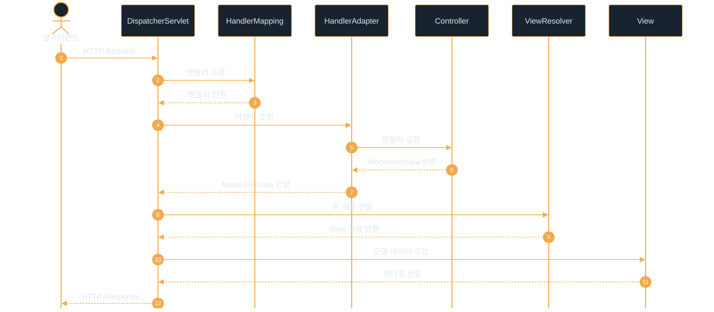

# Spring Web MVC

---
layout: default
---

# 학습 체크리스트 (1/2)

- [ ] Spring Web MVC의 핵심 역할과 MVC 디자인 패턴 구조 이해
- [ ] 컴포넌트 애너테이션(@Controller, @RestController)의 데이터 반환 메커니즘 파악
- [ ] 요청 처리 애너테이션(@RequestMapping, @RequestParam, @RequestBody)의 바인딩 동작 숙지
- [ ] 뷰 리졸버(ViewResolver)의 논리 경로 변환 및 정적 리소스 우회 설정 학습

---
layout: default
---

# 학습 체크리스트 (2/2)

- [ ] 프론트 컨트롤러 패턴과 DispatcherServlet의 요청 처리 라이프사이클 분석
- [ ] WebApplicationInitializer 구현을 통한 Tomcat 구동 시 스프링 컨텍스트 연동 이해
- [ ] 계층형 스프링 컨테이너(Root WAC, Servlet WAC)의 구조와 의존 관계 파악
- [ ] 웹 애플리케이션 전용 빈 스코프(Request & Session)의 특징 및 역할 숙지

---
layout: default
---

# Spring Web MVC 개요

> **스프링 웹 MVC (Spring Web MVC)**
>
> 서블릿 API를 기반으로 동작하며, MVC 디자인 패턴을 통해 웹 애플리케이션을 구조화하는 스프링 프레임워크의 웹 모듈

- **서블릿 기반 엔진**: 내부적으로 Java 서블릿 기술을 표준으로 삼아 웹 요청 처리
- **유기적 아키텍처**: 비즈니스 로직과 화면 영역을 물리적으로 격리하여 독립적 개발 가능
- **풍부한 생태계**: 필터, 인터셉터, 예외 처리기 등 다양한 웹 기술 모듈 제공

---
layout: default
---

# MVC 패턴의 핵심 구성요소

- **Model (모델)**: 비즈니스 도메인 데이터와 로직을 포함하며, 뷰로 보낼 데이터를 유지
- **View (뷰)**: 모델 데이터를 수신하여 클라이언트 브라우저에 표시할 최종 화면을 생성
- **Controller (컨트롤러)**: 사용자의 HTTP 요청을 수신하여 분석하고 서비스 호출 및 결과 매핑
- **역할의 분리**: 데이터 관리, 화면 표현, 흐름 제어의 단계를 분리하여 유지보수성 향상

---
layout: default
---

# 컨트롤러 컴포넌트 계열 비교

| 구분 항목 | @Controller | @RestController |
| :--- | :--- | :--- |
| **기본 반환 타입** | 논리적 뷰 이름 (String) | 데이터 객체 (DTO, Collection 등) |
| **렌더링 방식** | 뷰 리졸버가 매핑된 템플릿(HTML/JSP) 반환 | HTTP 응답 바디에 직접 데이터 작성 |
| **자동 적용 기능** | 일반 웹 MVC 전용 컴포넌트 스캔 대상 | `@Controller`와 `@ResponseBody`가 결합됨 |
| **주요 사용처** | 전통적인 JSP / Thymeleaf 웹 페이지 | REST API 개발 및 JSON 데이터 응답 |

---
layout: default
---

# HTTP 메시지 컨버터

> **HTTP 메시지 컨버터 (HttpMessageConverter)**
>
> HTTP 요청 바디나 응답 바디의 데이터를 자바 객체 또는 특정 텍스트 포맷으로 자동 변환해 주는 변환 엔진

- **ObjectMapper 자동 매핑**: Jackson 라이브러리를 통해 JSON 데이터와 자바 DTO 상호 직렬화 수행
- **동작 트리거**: `@RequestBody` 및 `@ResponseBody` 선언 시 컨버터가 가동되어 형식 변환 수행
- **타입별 분기**: 미디어 타입(JSON, XML, Text)에 따라 적절한 컨버터가 우선순위대로 선택됨

---
layout: default
---

# 요청 경로 및 파라미터 매핑

- **`@RequestMapping`**: 클래스 또는 메서드 레벨에 URL 경로와 HTTP 메서드 매핑
- **HTTP 전용 매핑**: `@GetMapping`, `@PostMapping` 등 가독성을 높인 직관적 전용 애너테이션 제공
- **`@PathVariable`**: RESTful API 경로상의 변수 값(예: `/users/{userId}`)을 메서드 매개변수로 추출
- **`@RequestParam`**: URL 쿼리 스트링 또는 POST 폼 파라미터 값을 1:1로 매핑 (필수 여부 설정 가능)

---
layout: default
---

# 요청 바디 및 모델 바인딩

- **`@ModelAttribute`**: 요청 파라미터들을 자바 객체(Command Object) 필드에 자동 매핑하고 모델에 추가
- **`@RequestBody`**: HTTP 요청 바디의 페이로드(주로 JSON)를 자바 객체로 역직렬화하여 수신
- **`@ResponseBody`**: 메서드의 반환값을 뷰 리졸버에 보내지 않고 HTTP 응답 바디에 직접 출력

---
layout: default
---

# Model 객체를 통한 데이터 전달

- **데이터 전달 매개체**: 컨트롤러가 데이터를 화면(뷰)으로 넘겨주기 위한 Map 구조의 스프링 전용 저장소
- **의존성 자동 주입**: 컨트롤러 메서드 파라미터로 선언 시 스프링이 실행 시점에 인스턴스를 알아서 전달
- **뷰 바인딩**: `model.addAttribute(key, value)`로 저장하며, 뷰 템플릿(JSP, Thymeleaf)에서 꺼내어 활용

---
layout: default
---

## 컨트롤러 데이터 전달 및 뷰 반환

```java
@Controller
public class HelloController {
    @GetMapping("/hello")
    public String hello(Model model) {
        model.addAttribute("greeting", "Hello, Spring MVC!");
        return "hello"; // hello.jsp로 포워딩
    }
}
```

---
layout: default
---

# 뷰 리졸버 (ViewResolver)

> **뷰 리졸버 (ViewResolver)**
>
> 컨트롤러가 반환한 논리적 뷰 이름을 기반으로 실제 화면을 렌더링할 뷰 객체를 찾아 매핑해 주는 웹 컴포넌트

- **물리 경로 조합**: 접두사(prefix)와 접미사(suffix)를 결합하여 실제 파일의 상세 위치 결정
- **JSP 특화 구현**: `InternalResourceViewResolver`가 대표적이며 서블릿의 포워딩 기술 활용
- **다양한 구현체**: ThymeleafViewResolver, FreeMarkerViewResolver 등 뷰 기술에 맞게 확장 가능

---
layout: default
---

# 정적 리소스 설정

- **루트 매핑 문제**: 디스패처 서블릿이 `/` 요청을 처리하도록 설정되면 CSS, JS 등 정적 리소스까지 가로채는 문제 발생
- **우회 처리**: `WebMvcConfigurer`를 구현하여 특정 경로 패턴에 대해 정적 파일 리소스 폴더로 직접 매핑
- **캐싱 및 최적화**: 리소스 매핑 시 HTTP 캐싱 헤더를 자동으로 설정하여 클라이언트 성능 향상 가능

---
layout: default
---

## 뷰 리졸버 빈 등록 및 경로 매핑

```java
@Bean
public ViewResolver customViewResolver() {
    InternalResourceViewResolver resolver = new InternalResourceViewResolver();
    resolver.setPrefix("/WEB-INF/views/");
    resolver.setSuffix(".jsp");
    return resolver;
}
```

---
layout: default
---

## 정적 리소스 요청의 물리 경로 매핑

```java
@Override
public void addResourceHandlers(ResourceHandlerRegistry registry) {
    registry.addResourceHandler("/resources/**")
            .addResourceLocations("/resources/");
}
```

---
layout: default
---

# 프론트 컨트롤러 패턴

> **프론트 컨트롤러 패턴 (Front Controller Pattern)**
>
> 웹 애플리케이션의 최전방에 단 하나의 서블릿을 배치하여 모든 요청을 통합 접수하고 공통 작업을 일괄 처리하는 디자인 패턴

- **중복 코드 제거**: 공통 로깅, 문자 인코딩, 예외 처리 등을 각 서블릿마다 개별 구현할 필요가 없어짐
- **체계적 요청 제어**: 입구를 하나로 통제하여 개별 비즈니스 핸들러로 유연하게 요청을 분기 처리함
- **유지보수성 향상**: 웹 요청의 라이프사이클을 단일 접점에서 중앙 통제 및 모니터링 가능

---
layout: default
---

# DispatcherServlet 개요

- **스프링 MVC의 심장**: 프론트 컨트롤러 패턴을 구체화한 서블릿으로, 모든 HTTP 요청의 흐름을 지휘함
- **컨테이너 바인딩**: 스프링 컨테이너와 연결되어 관리 빈들을 검색하고 적절한 핸들러를 가동시킴
- **확장과 위임**: 자체적으로 로직을 다 처리하지 않고 핸들러 매핑, 핸들러 어댑터 등 인터페이스를 통해 역할 위임

---
layout: default
---

# DispatcherServlet 요청 처리 흐름



---
layout: default
---

# 서블릿 컨테이너와 스프링 컨테이너

- **서블릿 컨테이너(Tomcat)**: 서블릿의 라이프사이클을 관리하며 HTTP 요청을 서블릿으로 연결해 줌
- **스프링 컨테이너**: 비즈니스 컴포넌트(빈)들의 생성과 결합(DI)을 관리하는 영역
- **다리 놓기 (Bridge)**: 톰캣이 켜질 때 스프링 컨텍스트를 기동하여 디스패처 서블릿에 바인딩함으로써 연동

---
layout: default
---

# WebApplicationInitializer

> **웹애플리케이션 초기화기 (WebApplicationInitializer)**
>
> Servlet 3.0+ 환경에서 XML 설정 없이 자바 코드만으로 서블릿 컨텍스트를 동적으로 구성할 수 있는 스프링 인터페이스

- **자동 감지**: 서블릿 컨테이너 구동 시 `SPI` 메커니즘에 의해 해당 구현체가 자동 탐색 및 실행됨
- **서블릿 수동 등록**: `DispatcherServlet` 인스턴스를 직접 생성하고 서블릿 컨텍스트에 추가 매핑 처리
- **현대적 애플리케이션 표준**: 기존 `web.xml`을 대체하는 자바 기반 스프링 부트 및 스프링 MVC의 구성 표준

---
layout: default
---

# 계층형 스프링 컨테이너 구조

- **Root WebApplicationContext**: DB 접근 및 비즈니스 서비스 등 웹 기술에 무관한 핵심 빈을 관리
- **Servlet WebApplicationContext**: Controller, ViewResolver 등 웹 전용 빈을 관리하며 Root Context를 부모로 참조
- **참조 구조**: 자식 컨테이너(Servlet)는 부모 컨테이너(Root)의 빈을 가져다 쓸 수 있으나, 역방향 참조는 차단됨
- **관심사 분리**: 백엔드 인프라 빈과 프론트 웹 컨트롤 빈을 논리적 계층으로 분리하여 의존성 오염 최소화

---
layout: default
---

## 초기화기 클래스 구성 및 설정 등록

```java
public class MyInitializer implements WebApplicationInitializer {
    @Override
    public void onStartup(ServletContext ctx) {
        AnnotationConfigWebApplicationContext wCtx = new AnnotationConfigWebApplicationContext();
        wCtx.register(WebConfig.class);
        ServletRegistration.Dynamic reg = ctx.addServlet("app", new DispatcherServlet(wCtx));
        reg.addMapping("/");
    }
}
```

---
layout: default
---

# 웹 스코프 - Request & Session

| 구분 항목 | Request 스코프 (`@RequestScope`) | Session 스코프 (`@SessionScope`) |
| :--- | :--- | :--- |
| **생명 주기** | HTTP 요청이 수신되고 응답이 나갈 때까지 | 웹 브라우저 사용자 세션이 만료될 때까지 |
| **인스턴스 특징**| 요청별로 완전히 격리된 별도 객체 생성 | 웹 사용자(세션 ID)별 고유 객체 생성·유지 |
| **주요 사용처** | HTTP 헤더나 클라이언트 IP 등 요청 정보 저장 | 로그인 회원 정보, 사용자 장바구니 관리 |
| **리소스 관리** | 요청 완료 시 인스턴스가 즉각 소멸함 | 브라우저 종료나 타임아웃 전까지 메모리 점유 |

---
layout: default
---

# 핵심 정리: Spring Web MVC

- **MVC 디자인 패턴**: Model-View-Controller의 엄격한 역할 분담을 통한 구조적 유연성 확보
- **DispatcherServlet**: 프론트 컨트롤러로서 핵심 요청 흐름 통제 및 하위 컴포넌트 지휘
- **어노테이션 기반**: `@Controller`, `@RequestParam` 등 선언적 바인딩으로 생산성 극대화
- **자바 설정 연동**: `WebApplicationInitializer` 구현으로 톰캣 구동 시 동적 서블릿 및 컨테이너 연동
- **웹 스코프**: HTTP 요청 및 세션 범위로 제한되는 빈 관리를 통해 객체지향적 상태 정보 유지
