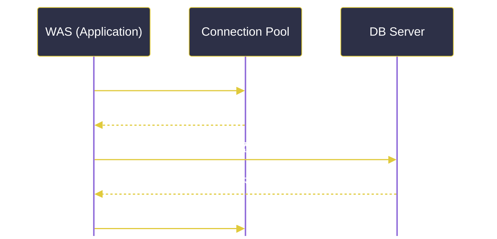

# 데이터베이스 (DB / SQL / NoSQL)

---
layout: default
---

# 학습 체크리스트 (1/2)

- [ ] 데이터베이스의 기본 정의와 독립성, 무결성 개념 이해
- [ ] 백엔드 서버에서 RAM 한계를 극복하기 위해 DB가 필요한 이유 파악
- [ ] RDBMS의 구조와 설계 절차(E-R 모델, 정규화, 이상 현상) 학습
- [ ] 서버와 DB 간 연동(네트워크, 커넥션 풀, 트랜잭션, 아키텍처) 이해

---
layout: default
---

# 학습 체크리스트 (2/2)

- [ ] SQL의 선언적 의미와 SQL 엔진의 쿼리 실행 과정 숙지
- [ ] Enterprise, Open Source, Cloud Managed RDBMS 분류 파악
- [ ] NoSQL의 등장 배경 및 비정형 데이터의 특징 이해
- [ ] Document, Key-Value, Search, Vector DB 모델별 핵심 용도 학습

---
layout: cover
class: text-center
---

# 데이터베이스(DB)의 기초

---
layout: default
---

# 데이터베이스의 정의

> **데이터베이스 (Database / DB)**
>
> 여러 사용자와 애플리케이션이 공유하여 사용할 수 있도록 구조화하여 비휘발성 저장소에 보관한 데이터의 집합

- **데이터의 독립성**: 물리적 저장 방식이나 논리 구조가 변경되어도 애플리케이션에 영향을 주지 않음
- **데이터 무결성**: 데이터가 현실 세계의 규칙과 일치하며 정확성, 일관성, 유효성을 항상 유지하는 성격

---
layout: default
---

# 도서관과 데이터베이스

- **서류 더미 (무질서한 데이터)**:
  - 방 바닥에 사방으로 흐트러진 서류들은 원하는 정보를 찾는 데 오랜 시간이 걸림
- **도서관 서가 (구조화된 DB)**:
  - 책장마다 번호가 있고, 도서 장르별 분류에 따라 정돈되어 사서가 관리하는 체계적인 구조
  - 사용자는 서가 인덱스만 보고도 필요한 책을 10초 만에 찾아낼 수 있음

---
layout: default
---

# 백엔드 개발자에게 DB가 필요한 이유 (1/2)

- **휘발성 메모리(RAM)의 한계 극복**:
  - 서버 앱이 상주하는 RAM은 재부팅 시 모든 데이터가 초기화됨
  - 영구적인 상태 보존을 위해 물리적 디스크에 연동된 DB가 필수적임
- **효율적인 파일 I/O 대처**:
  - 텍스트 파일에 직접 대량의 데이터를 읽고 쓰면 파일 잠금 및 입출력 병목 발생
  - 데이터 무결성 훼손 가능성이 매우 높아 이를 안전하게 처리해 주는 DB가 필요함

---
layout: default
---

# 백엔드 개발자에게 DB가 필요한 이유 (2/2)

- **동시성 제어 및 트랜잭션 보장**:
  - 다중 스레드로 동작하는 서버 환경에서는 여러 사용자가 동시에 동일 데이터 수정을 요청할 수 있음
  - 데이터 유실이나 꼬임(Race Condition) 없이 안정적으로 다루기 위해 DB의 트랜잭션 제어가 필수적임
- **비즈니스 데이터의 안전한 적재**:
  - 회원 정보, 결제 내역 등 서비스의 핵심 자산을 안전하고 체계적으로 영속화

---
layout: default
---

# 칠판과 일기장

- **칠판 낙서 (RAM)**:
  - 분필로 적은 메모는 수업이 끝나고 칠판 지우개로 슥 지워버리면 흔적도 없이 사라짐 (서버 재부팅)
- **종이 일기장 (디스크 / DB)**:
  - 펜으로 꾹꾹 눌러 적어둔 일기는 공책을 덮고 밤이 지나 내일이 되어도 영구히 보존됨
  - 백엔드 서버는 중요한 기록을 칠판(RAM)이 아닌 일기장(DB)에 옮겨 적는 역할임

---
layout: default
---

# RDBMS의 정의

> **관계형 데이터베이스 (RDBMS)**
>
> 데이터를 행(Row)과 열(Column)로 구성된 2차원 표(Table) 형태로 관리하고, 테이블 간의 연결 고리(Relation)를 정의하여 일관성을 다루는 대표적인 시스템

- **표 형태의 데이터 관리**: 관계형 모델을 기반으로 직관적인 행과 열의 구조 구축
- **관계성 정의**: 기본키(PK)와 외래키(FK)를 통해 테이블 간의 연관 관계 설정

---
layout: default
---

# 엑셀 시트와 RDBMS

- **단일 엑셀 시트**:
  - 모든 고객 정보와 주문 내역을 한 시트에 다 적으면 이름이나 주소가 바뀔 때마다 수백 행을 다 고쳐야 함
- **연결된 스프레드시트 (RDBMS)**:
  - `고객 정보 시트`와 `주문 내역 시트`를 별개로 만듦
  - 주문 내역 시트에는 회원 이름 대신 `고객 번호`만 적어두어 두 표 사이의 선(Relation)을 연결해 관리함

---
layout: default
---

# RDBMS의 기본 구조 (1/2)

- **테이블 (Table) / 릴레이션 (Relation)**:
  - 데이터를 구조화하여 저장하는 가장 기본적인 2차원 표 구조
- **행 (Row) / 튜플 (Tuple) / 레코드 (Record)**:
  - 테이블의 가로 줄에 해당하며, 실세계의 특정 단일 개체 정보를 담는 논리적 데이터 단위
- **열 (Column) / 속성 (Attribute) / 필드 (Field)**:
  - 테이블의 세로 줄에 해당하며, 개체가 가지는 구체적인 성격이나 데이터 타입

---
layout: default
---

# RDBMS의 기본 구조 (2/2)

- **도메인 (Domain)**:
  - 하나의 속성(Attribute)이 안전하게 가질 수 있는 원자값들의 유효 범위 (예: 성별 필드의 '남', '여')
- **차수 (Degree)**:
  - 테이블 내에 정의된 전체 열(Attribute)의 개수
- **카디널리티 (Cardinality)**:
  - 테이블 내에 현재 누적되어 있는 전체 행(Tuple)의 개수

---
layout: default
---

# RDBMS의 핵심 키와 제약조건

- **기본키 (Primary Key, PK)**:
  - 각 레코드를 유일하게 식별할 수 있는 대표 속성
  - 중복값을 가질 수 없으며(Unique), 빈 값(Null)도 허용하지 않음 (Not Null)
- **외래키 (Foreign Key, FK)**:
  - 다른 테이블의 기본키를 참조하여 관계를 연결
  - 참조 무결성을 유지하며, 존재하지 않는 대상으로의 잘못된 참조를 차단

---
layout: default
---

# 데이터베이스 설계와 E-R 모델

> **개체-관계 모델 (E-R Model)**
>
> 현실 세계의 업무 흐름을 개체(Entity), 속성(Attribute), 관계(Relationship)로 시각화하여 표현하는 설계 모델링 기법

- **구조화의 첫 단추**: 비즈니스 요구사항을 수집한 뒤 논리적인 구조를 설계하는 과정
- **시각적 의사소통**: 다이어그램을 활용해 개발자와 기획자 간의 도메인 이해 일치

---
layout: default
---

# 정규화와 이상 현상

> **정규화 (Normalization)**
>
> 데이터 중복을 최소화하여 삽입·삭제·수정 시 발생하는 이상 현상을 예방하고, 효율적인 저장 구조를 도출하기 위해 테이블을 단계별로 분해하는 과정

- **이상 현상 (Anomaly)**:
  - 잘못 설계된 데이터 모델 구조로 인해 데이터를 조작(삽입, 삭제, 수정)할 때 데이터 불일치가 일어나는 현상
- **무결성 극대화**: 중복을 제거해 저장 공간을 아끼고 정합성을 강화

---
layout: default
---

# 영수증과 서랍장 카드

- **한 장의 영수증 (비정규화)**:
  - 영수증 한 장에 구매자 주소, 상품 공장 주소까지 다 적으면 공장 주소가 바뀔 때 수천 장의 주소를 고쳐야 함 (이상 현상)
- **서랍 카드 분리 (정규화)**:
  - `고객 카드`, `상품 카드`, `제조 공장 카드`를 따로 분리해 서랍장에 보관
  - 영수증에는 각각의 카드 식별 번호만 적어두어 데이터의 꼬임과 중복을 원천 봉쇄함

---
layout: default
---

# 서버와 DB 간의 물리 연동

- **네트워크 통신**:
  - 백엔드 서버(WAS)와 DB 서버는 각각 독립된 프로세스로 작동
  - TCP/IP 프로토콜과 전용 포트(Port)를 통해 질의와 응답을 송수신하는 물리적 방식
- **영속성 (Persistence)**:
  - 메모리에 임시 적재된 데이터가 서버 프로세스 종료 후에도 디스크에 영구히 저장되는 성질

---
layout: default
---

# 커넥션 풀을 통한 자원 관리

> **커넥션 풀 (Connection Pool)**
>
> 서버 기동 시 DB 물리 커넥션을 메모리에 미리 확보해 둔 뒤, 필요할 때마다 대여 및 반납하여 연결 비용을 줄이는 자원 관리 방식

- **연결 오버헤드 방지**: 매 요청마다 무거운 TCP 핸드셰이크와 보안 인증 단계를 거치지 않음
- **동시성 통제**: DB 서버가 견디기 힘든 과도한 동시 접속 요청을 한계선 안에서 통제

---
layout: default
---

# 콜택시와 커넥션 풀

- **매번 부르는 콜택시**:
  - 직원이 외출할 때마다 택시를 부르고, 배차를 기다리고, 결제하는 과정을 매번 반복 (커넥션 생성 비용 발생)
- **상시 대기 전용 택시 (Connection Pool)**:
  - 회사 정문에 전용 택시 10대를 미리 계약해서 세워둠
  - 직원은 나오자마자 바로 타서 이동하고, 돌아와 정문에 반납하면 다음 직원이 즉시 이용함

---
layout: default
---

# 커넥션 풀 동작 구조

---
layout: default
---

# 트랜잭션의 개념

> **트랜잭션 (Transaction)**
>
> 데이터 정합성을 확보하기 위해, 여러 개의 데이터 조작 명령을 쪼갤 수 없는 하나의 논리적 최소 작업 단위로 처리하는 메커니즘

- **더 이상 쪼갤 수 없는 단위**: 비즈니스 로직(예: 송금 - 내 돈 차감 후 상대 돈 증가)의 완결성 보장
- **All or Nothing**: 작업 도중 하나라도 실패하면 전체 과정을 되돌림(Rollback)

---
layout: default
---

# 계좌 이체

- **쪼개진 연산의 위험성**:
  - 내 계좌에서 1만 원이 출금(성공)되었는데, 은행 서버 전산 오류로 상대 계좌에 1만 원이 입금(실패)됨
  - 내 1만 원은 공중 분해되는 치명적인 금융 사고가 일어남
- **트랜잭션 처리 (All or Nothing)**:
  - '출금 + 입금'을 묶어 하나로 취급
  - 입금이 실패하면 이미 성공했던 출금마저 없었던 일로 강제 롤백시킴

---
layout: default
---

# 트랜잭션 완결성을 위한 ACID (1/2)

- **원자성 (Atomicity)**:
  - 트랜잭션 내부 연산은 모두 반영되거나(Commit) 전혀 반영되지 않아야 함(Rollback)
- **일관성 (Consistency)**:
  - 트랜잭션이 성공한 후에도 데이터베이스의 제약조건과 무결성은 깨지지 않고 유지되어야 함

---
layout: default
---

# 트랜잭션 완결성을 위한 ACID (2/2)

- **격리성 (Isolation)**:
  - 동시에 실행되는 여러 트랜잭션들이 서로의 연산 도중 임시 데이터를 훔쳐보거나 방해하지 못함
- **지속성 (Durability)**:
  - 성공적으로 완결된 트랜잭션의 결과는 시스템 장비 고장이나 정전이 발생하더라도 디스크에 영구 보존됨

---
layout: default
---

# 백엔드 아키텍처 패턴과 DB 접근 분리

- **MVC (Model-View-Controller)**:
  - 비즈니스 데이터 및 DB 접근 로직(Model), 사용자 화면(View), 비즈니스 제어(Controller)를 철저히 분리
- **레이어드 아키텍처 (Layered Architecture)**:
  - 프레젠테이션, 서비스, 데이터 액세스(DB 접근) 계층으로 책임을 수평 분배
- **클린 아키텍처 (Clean Architecture)**:
  - 프레임워크나 DB 기술을 외곽 계층으로 밀어내고 핵심 도메인 비즈니스 코드를 격리 보호

---
layout: cover
class: text-center
---

# SQL과 RDBMS 엔진

---
layout: default
---

# SQL의 정의와 본질

> **구조화 질의 언어 (SQL)**
>
> 관계형 데이터베이스(RDBMS)의 데이터와 구조를 생성, 조회, 수정, 제어하기 위해 선언적으로 작성하는 표준 언어

- **선언형 언어**: "어떻게(How)" 경로를 찾아낼 것인지 지시하지 않고, "무엇(What)"을 원하는지 선언
- **추상화 인터페이스**: 디스크 탐색 방식이나 B-Tree 인덱스 구조를 몰라도 일관성 있게 데이터 질의

---
layout: default
---

# 식당의 요리사 주문

- **절차형 명령 (개발 언어)**:
  - 요리사에게 "칼을 쥐고 당근을 1cm로 썰어서 올리브유 두 스푼에 소금을 뿌려 팬에 볶으세요"라고 요리 과정을 세세히 지시
- **선언형 명령 (SQL)**:
  - 주방 구조나 레시피 과정을 몰라도, 테이블에 앉아 메뉴판을 짚으며 "**봉골레 파스타 하나 주세요 (What)**"라고 선언적으로 요청서만 내밀면 알아서 음식이 나옴

---
layout: default
---

# SQL의 논리적 구성

- **DDL (데이터 정의어)**:
  - 테이블이나 인덱스 등의 객체 구조 생성 및 관리 (`CREATE`, `ALTER`, `DROP`)
- **DML (데이터 조작어)**:
  - 실질적인 레코드 검색 및 수정 작업 수행 (`SELECT`, `INSERT`, `UPDATE`, `DELETE`)
- **DCL & TCL (제어어)**:
  - 사용자 권한 설정(`GRANT`, `REVOKE`) 및 트랜잭션 영구 반영/롤백(`COMMIT`, `ROLLBACK`)

---
layout: default
---

# SQL 엔진과 실행 과정

> **SQL 엔진 (SQL Engine)**
>
> 구문 분석(Parsing), 컴파일, 쿼리 최적화(Optimization)를 거쳐 디스크 접근을 제어하고 최적의 실행 계획(Execution Plan)을 생성하는 핵심 모듈

- **SQL 방언 (Dialect)**:
  - 표준 SQL을 존중하되 성능 향상 및 편의성을 위해 DB 벤더사마다 고유하게 구현한 독자적인 함수와 문법

---
layout: default
---

# SQL 실행 파이프라인

---
layout: default
---

# RDBMS 엔진 분류 (1/2)

- **Enterprise 솔루션 (상용 유료 DB)**:
  - 강력한 트래픽 감당, 엔터프라이즈 레벨 기술 지원 및 정합성 보증
  - 주로 금융권이나 대형 전통 제조업 등에서 채택 (예: Oracle, MS-SQL Server)
- **Open Source 솔루션 (무료 오픈소스 DB)**:
  - 라이선스 비용이 없고 커뮤니티가 거대하여 웹 서비스 전반에 걸쳐 가장 널리 사용
  - 대표적으로 MySQL, MariaDB, PostgreSQL, SQLite가 존재함

---
layout: default
---

# RDBMS 엔진 분류 (2/2)

- **Cloud Managed 서비스 (클라우드 전용 DB)**:
  - 클라우드 공급사가 이중화 구성, 장애 복구, 백업, OS 패치 및 확장성을 대행하는 완전 관리형 모델
  - 인프라 관리 비용을 비약적으로 줄이고 고가용성을 즉시 확보 가능
  - 대표 예시: AWS RDS, Amazon Aurora

---
layout: cover
class: text-center
---

# NoSQL과 비정형 데이터

---
layout: default
---

# NoSQL의 정의와 배경

> **비관계형 데이터베이스 (NoSQL)**
>
> 엄격한 스키마 설계 및 테이블 간 조인(Join) 구조를 탈피하여, 스키마 제약 없이 대량의 동적 데이터와 수평 분산 확장(Scale-out)을 쉽게 처리하는 데이터 저장 시스템군

- **비정형 데이터 (Unstructured Data)**:
  - 고정된 테이블 구조나 사전 규칙 없이 유연한 형태를 지닌 로그 파일, 멀티미디어, 메일 본문 등의 데이터

---
layout: default
---

# 양식 서류철과 포스트잇 메모판

- **격자 서류철 (RDBMS)**:
  - 이름, 나이, 주소 등 칸이 철저히 나눠져 있는 보고서
  - 한 칸이라도 바뀌거나 규격이 틀어지면 서류 전체 인쇄 양식을 뜯어고쳐야 함 (스키마 제약)
- **자유 포스트잇 보드 (NoSQL)**:
  - 적고 싶은 내용이 생길 때마다 크기도 모양도 다른 포스트잇을 칠판에 붙임 (유연한 적재)
  - 필요한 데이터가 늘어나면 옆에 포스트잇을 더 넓게 붙여 확장(Scale-out)하기 수월함

---
layout: default
---

# Document DB (문서 지향형)

> **문서 지향 데이터베이스 (Document DB)**
>
> 데이터의 구조를 JSON과 유사한 문서(Document) 파일 단위로 적재하여 각 레코드마다 가변 구조를 허용하는 유연한 데이터베이스 (예: MongoDB)

- **가변적 스키마**: 데이터 구조가 자유로워 필드 추가/제거가 빈번한 애자일 개발에 유리
- **쉬운 구조 맵핑**: 프론트엔드의 JSON 객체와 서버 도메인 모델 간의 변환 오버헤드 최소화

---
layout: default
---

# Key-Value DB (키-값 데이터베이스)

> **키-값 데이터베이스 (Key-Value DB)**
>
> 속도가 가장 빠른 인메모리 구조로, 유일한 식별자인 Key와 이에 대칭되는 데이터 Value의 간단한 구조로 데이터를 저장하는 데이터베이스 (예: Redis, Valkey)

- **인메모리 고속 처리**: 극단적인 읽기/쓰기 성능을 제공해 임시 캐싱이나 세션 관리에 특화
- **Valkey의 등장**: Redis가 폐쇄적 라이선스로 전환한 후, 리눅스 재단이 포크하여 생태계를 보존 중인 오픈소스 프로젝트

---
layout: default
---

# Search Engine (검색 엔진)

> **검색 엔진 (Search Engine)**
>
> 텍스트에 포함된 단어들을 형태소 단위로 쪼개고 역색인(Inverted Index) 인덱스를 구축하여 대규모 텍스트 검색을 근실시간으로 수행하는 분산 시스템 (예: ElasticSearch, OpenSearch)

- **역색인 색인 기술**: 텍스트 분석기를 통한 고속 검색 및 키워드 유사도 일치
- **OpenSearch**: ElasticSearch의 유료 라이선스화에 대응하여 AWS 등이 협력하여 이끌어 나가는 오픈소스 검색 엔진

---
layout: default
---

# Vector DB (벡터 데이터베이스)

> **벡터 데이터베이스 (Vector DB)**
>
> 이미지, 음성, 자연어를 기계가 해독할 수 있는 다차원의 고밀도 벡터 좌표(Embedding Vector)로 압축 및 저장한 후 유사도 거리 연산을 수행하는 차세대 인공지능용 데이터베이스

- **RAG (검색 증강 생성)**: LLM 외부의 거대 Vector DB를 지식 베이스로 사용해 답변 환각 억제
- **pgvector 플러그인**: 관계형 데이터베이스인 PostgreSQL 내에서 고차원 벡터 인덱스 검색을 가능하게 해 주는 플러그인

---
layout: default
---

# 단어 사전 찾기 vs 유사 성향 매칭

- **단어 사전식 검색 (RDBMS)**:
  - 색인에서 '사과'라는 단어가 위치한 페이지를 정확히 찾아 정보를 꺼내는 방식
- **성향 분포 그래프 탐색 (Vector DB)**:
  - 맛의 달콤함, 상큼함, 수분량 등 100가지 성향 좌표상에 수많은 과일들을 점으로 찍어둠
  - 인공지능이 "사과와 가장 성향(취향)이 유사한 과일"을 요청하면 가장 가까운 거리의 점('배')을 찾아냄

---
layout: default
---

# 핵심 정리 : 데이터베이스와 SQL & NoSQL

- **데이터베이스 (DB & RDBMS)**:
  - 표(Table) 형태로 데이터를 보관하고 기본키(PK)/외래키(FK) 관계로 연결하여 무결성을 유지하는 시스템
- **트랜잭션 (ACID)**:
  - 송금 작업처럼 더 쪼갤 수 없는 논리적 최소 단위로, 전부 성공하거나 완전히 취소(Rollback)됨을 보장
- **SQL (구조화 질의 언어)**:
  - 디스크 검색 과정을 몰라도 "무엇(What)"을 원하는지 RDBMS에 지시하는 선언형 통신 언어
- **NoSQL (비관계형)**:
  - 엄격한 표(Schema)를 탈피해 JSON 문서(Document)나 Key-Value 형태로 대량의 데이터를 분산 저장

