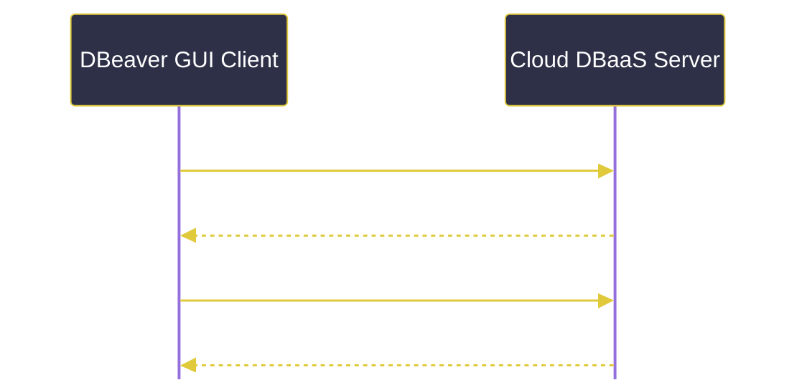

# 데이터베이스 실습 환경 구축 및 클라이언트 도구

---
layout: default
---

# 학습 체크리스트 (1/2)

- [ ] 로컬 PC 직접 설치의 한계점(성능, 포트, Java, OS 차이) 이해
- [ ] 클라우드 완전관리형 데이터베이스(DBaaS)의 개념과 구독 방식 숙지
- [ ] 실습용 Supabase, Aiven, Neon 솔루션의 특징 비교
- [ ] AWS RDS 프리티어 소진 리스크와 초기 실습 제외 배경 인지

---
layout: default
---

# 학습 체크리스트 (2/2)

- [ ] 데이터베이스 클라이언트 GUI 도구(DBeaver, IntelliJ DB Tool) 역할 파악
- [ ] DBaaS 서버와 클라이언트 간 커넥션 수립 및 연결 확인 방법 습득
- [ ] 엔터티 관계 다이어그램(ERD)의 자동 생성 및 스키마 시각화 학습
- [ ] IntelliJ Data Source 구성 및 지능형 콘텍스트 자동완성 기능 숙달

---
layout: cover
class: text-center
---

# 데이터베이스 로컬 설치와 환경적 한계

---
layout: default
---

# 로컬 직접 설치의 보류

- **가상화 환경으로의 유예**:
  - 본 과정에서는 개별 PC에 데이터베이스(MySQL, PostgreSQL 등)를 직접 설치하여 운영하지 않음
  - 향후 도커(Docker) 컨테이너 기술을 배운 이후에 가상화 환경으로 구성
- **과정 초기의 리스크 최소화**:
  - 로컬 환경의 수많은 환경 충돌 요인을 배제하고 즉시 실습에 돌입하기 위함

---
layout: default
---

# 로컬 설치의 4대 장벽 (성능 & 포트)

- **성능 문제**:
  - 데이터베이스 엔진은 백그라운드에서 메모리와 CPU를 지속적으로 점유함
  - 개발 PC의 가용 리소스를 크게 소모하여 다른 툴의 로딩 지연을 유발함
- **포트 (Port) 충돌 문제**:
  - 로컬 환경에 이미 설치된 레거시 DB나 다른 솔루션이 동일 포트를 선점하고 있는 경우 충돌 발생
  - (예: MySQL 3306 포트, PostgreSQL 5432 포트 선점 시 기동 불가)

---
layout: default
---

# 포트(Port)의 개념과 충돌 원인

- **포트(Port)의 의미**:
  - IP 주소가 컴퓨터의 '아파트 주소'라면, 포트 번호는 특정 애플리케이션을 찾아가는 '동/호수(채널 번호)'에 비유할 수 있음
  - 한 컴퓨터 내에서 실행되는 다양한 네트워크 프로그램(프로세스)을 서로 구분하기 위한 통로 번호
- **중복 사용 불가의 원칙**:
  - 하나의 포트 번호는 동시에 하나의 프로그램만 점유(Bind)할 수 있음
  - 두 DB 엔진이 동일 포트를 요구하면, 운영체제는 패킷을 전달할 대상을 구분할 수 없어 기동을 차단함 (Address Already in Use)
- **대표적인 표준 포트 번호**:
  - **웹 서비스**: HTTP(80) / HTTPS(443)
  - **데이터베이스**: MySQL(3306) / PostgreSQL(5432) / Oracle(1521)

---
layout: default
---

# 로컬 설치의 4대 장벽 (자바 & OS 차이)

- **자바 (Java) 충돌 문제**:
  - 특정 데이터베이스 제품군은 설치 과정에서 시스템의 JDK 환경 변수를 강제로 변경함
  - 기존에 세팅해 둔 자바 환경이나 IDE의 번들 자바와 충돌하여 코딩 환경 교란
- **개발 환경 차이**:
  - OS(Mac, Windows, Linux)의 버전 및 칩셋 아키텍처(M 시리즈 vs Intel)에 따라 설치/설정법 상이
  - 실습 표준화가 불가능하여 동일 속도로 강의 진행 곤란

---
layout: default
---

# 원룸의 세탁기 설치와 셀프 빨래방

- **로컬 직접 설치 (원룸에 세탁기 설치)**:
  - 좁은 원룸 공간을 차지하고, 탈수 시 진동과 소음(리소스 점유)이 발생함
  - 배수관 연결 불량이나 누수(설정/포트 충돌) 리스크를 직접 해결해야 함
- **클라우드 연동 (셀프 빨래방 이용)**:
  - 내 공간에 무거운 기계를 둘 필요 없이, 동네 빨래방에 가서 비어 있는 세탁기만 이용하고 나옴
  - 사용료만 내고(구독형/프리 티어) 관리나 정비 걱정 없이 세탁물만 들고 연결 주소로 접속하는 방식

---
layout: cover
class: text-center
---

# DBaaS와 클라우드 완전관리형 DB

---
layout: default
---

# 클라우드 완전관리형 데이터베이스

> **클라우드 데이터베이스 (DBaaS)**
>
> 클라우드 제공업체가 DB의 물리 서버, OS, 백업, 보안 패치를 전담하여 관리하고, 사용자는 인터넷 연결 정보(Connection URI)만 받아 사용하는 구독형 데이터베이스

- **설치 및 운영 부담 제거**: 인프라 관리 부담을 클라우드가 전담하여 백엔드 로직에만 집중 가능
- **즉각적인 사용**: 클릭 몇 번으로 즉시 프로비저닝되어 주소 하나로 원격 연결 수립

---
layout: default
---

# 실습용 대표 DBaaS 솔루션 (1/2)

- **Supabase**:
  - PostgreSQL을 기반으로 구축된 오픈소스 Firebase 대안 솔루션
  - 별도의 백엔드 API 작성 없이 실시간 데이터 동기화와 웹 콘솔을 통한 관리를 제공하는 플랫폼
- **Neon**:
  - 서버리스(Serverless) 아키텍처 기반의 PostgreSQL 호스팅 서비스
  - 쿼리가 유입될 때만 컴퓨팅 자원을 구동하고 사용량 합산 내에서 유연한 프로젝트 생성을 지원

---
layout: default
---

# 실습용 대표 DBaaS 솔루션 (2/2)

- **Aiven**:
  - 다양한 오픈소스 DB(MySQL, PostgreSQL, Valkey, OpenSearch, Kafka 등)를 프리 티어로 생성하여 호스팅할 수 있는 멀티 클라우드 DBaaS 플랫폼
- **AWS RDS**:
  - 아마존 웹 서비스의 업계 표준 관계형 데이터베이스 서비스
  - 단, 실습 초기에 프리 티어 소진 우려 및 의도치 않은 요금 청구 방지를 위해 도입을 보류함

---
layout: default
---

# 데이터베이스 인프라 구축 모델 비교

| 비교 항목 | 로컬 직접 설치 | DBaaS (Neon/Supabase) | AWS RDS 프리티어 |
| :--- | :--- | :--- | :--- |
| **초기 비용** | 무료 (로컬 점유) | 무료 (프리 티어 범위 내) | 조건부 무료 (과금 리스크 존재) |
| **자원 점유** | 개발 PC RAM/CPU 소모 | PC 자원 소모 없음 (클라우드) | PC 자원 소모 없음 (클라우드) |
| **포트/JDK 충돌**| 있음 (로컬 레거시와 충돌) | 없음 (원격 통신) | 없음 (원격 통신) |
| **운영 인프라** | 개발자가 직접 패치/백업 | 공급사 자동 이중화 백업 | 공급사 자동 이중화 백업 |

---
layout: cover
class: text-center
---

# 데이터베이스 관리 툴과 클라이언트 GUI

---
layout: default
---

# 데이터베이스 관리 툴의 역할

- **GUI를 통한 한계 극복**:
  - 텍스트 기반 CLI의 불투명한 검은 화면 대신 visual한 그래픽 인터페이스 제공
- **개발 생산성 도구**:
  - 원격 데이터베이스에 손쉽게 붙어 SQL을 작성하고 실행 결과를 엑셀처럼 탭으로 열람
  - 복잡한 데이터베이스 설계 및 스키마 시각화 지원

---
layout: default
---

# DBeaver Community

> **디비버 커뮤니티 (DBeaver Community)**
>
> 자바 기반의 크로스 플랫폼 오픈소스 DB 클라이언트 도구로, 플러그인 드라이버를 통해 거의 모든 관계형/비관계형 데이터베이스에 손쉽게 연결할 수 있는 소프트웨어

- **통합 관리성**: 단 한 개의 도구로 MySQL, PostgreSQL, Oracle 등을 전부 연동 통제
- **글로벌 표준**: 라이선스 부담이 없는 무료 툴로 금융권부터 IT 스타트업까지 표준 사용

---
layout: default
---

# DBeaver를 통한 DB 연결 수립

- **데이터베이스 커넥션**:
  - DBaaS 서버의 호스트 주소, 포트, 계정 정보, 암호를 입력하여 클라이언트와 물리적으로 통신망을 수립하는 과정
- **연결 확인 쿼리**:
  - 연결이 정상적인지 확인하기 위해 가벼운 기본 쿼리를 전송하여 상태를 점검하는 단순 질의
  - 대표적인 테스트용 쿼리: `SELECT 1;` 또는 `SELECT NOW();`

---
layout: default
---

# 데이터베이스 커넥션 수립 흐름

---
layout: default
---

# 엔터티 관계 다이어그램 (ERD)

> **엔터티 관계 다이어그램 (ERD)**
>
> 테이블 스키마 구조와 테이블 간의 기본키-외래키(PK-FK) 관계선을 시각적인 그래픽 다이어그램으로 자동 렌더링해 주는 시각화 기능

- **설계 흐름 분석**: 복잡하게 꼬인 테이블들의 관계를 단번에 그래픽 지도로 가독
- **구조 추출**: 물리 테이블들의 명세를 읽어 클릭 한번으로 ERD 레이아웃 구성

---
layout: default
---

# IntelliJ 내장 Database Tool

> **데이터 소스 (Data Source)**
>
> IDE가 데이터베이스 서버에 접근하기 위해 프로젝트 내부 또는 글로벌 환경에 등록해 둔 연결 참조 객체

- **IntelliJ 내장 Database Tool (DataGrip)**:
  - 젯브레인즈(JetBrains) IDE 생태계에 완전히 통합된 데이터베이스 관리 기능
  - 개발 프로젝트 코드 창 바로 옆 탭에서 편리하게 쿼리를 조회하고 조작하는 통합 도구
  - **콘텍스트 자동 완성**: SQL 파일이나 코드에서 실시간으로 스키마 정보를 읽어 안전하고 지능적인 자동 완성 지원

---
layout: default
---

# 파일 탐색기와 DB 클라이언트 GUI

- **블라인드 터미널 (CLI)**:
  - 마우스 클릭 없이 오직 파일의 전체 경로와 커맨드를 키보드로만 치며 폴더를 헤매는 것
- **시각화 탐색기 (GUI Client)**:
  - 윈도우 바탕화면의 폴더를 클릭해 파일을 보고, 더블클릭하여 엑셀 데이터를 수정하듯이 DB 내 테이블을 즉시 제어하고 열람하는 쾌적한 인터페이스 환경

---
layout: default
---

# 두 주요 GUI 클라이언트 도구 비교

| 비교 항목 | DBeaver Community | IntelliJ 내장 Database Tool |
| :--- | :--- | :--- |
| **라이선스** | 무료 오픈소스 (Community 버전) | 유료 (Ultimate 이상 IDE 라이선스 필요) |
| **작업 통합성** | 독립형 프로그램으로 별도 구동 | IDE 개발창 내부 툴 윈도우로 완벽 통합 |
| **코드 연동 자동완성**| SQL 스크립트 에디터 내부에서만 작동 | Java/Kotlin 소스 내 SQL 문자열까지 스키마 자동완성 |
| **ERD 렌더링** | 테이블 우클릭 시 관계도 즉각 자동 생성 | 등록된 Data Source 우클릭으로 도식화 자동 지원 |

---
layout: default
---

# 핵심 정리 : 데이터베이스 실습 환경 및 도구

- **로컬 설치 지양**: 자원 잠식, 포트 충돌, Java 경로 교란 한계로 클라우드 연동 실습 우선
- **DBaaS 활용**: Supabase, Neon 등 하드웨어 관리와 비용 청구 리스크 없는 구독형 인프라 활용
- **클라이언트GUI**: DBeaver와 IntelliJ Database Tool로 원격 커넥션을 맺고 ERD 시각화 및 SQL 개발 진행

