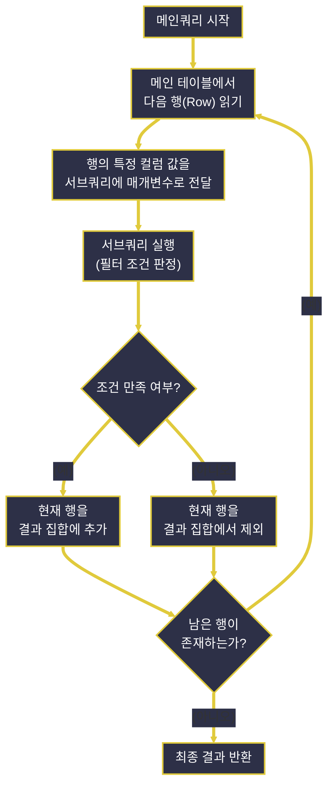
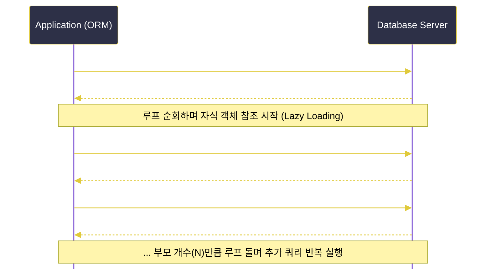

# 서브쿼리와 조인 및 데이터베이스 아키텍처

---
layout: default
---

# 학습 체크리스트 (1/2)

- [ ] 서브쿼리(Subquery)의 정의와 동작 모델별 분류 파악
- [ ] 스칼라, 비상관, 상관 서브쿼리의 특징 및 구동 차이 이해
- [ ] 조인(JOIN)의 개념과 물리 구조에 따른 다양한 조인 종류 습득
- [ ] LEFT JOIN과 UNION을 통한 MySQL의 FULL OUTER JOIN 구현법 학습

---
layout: default
---

# 학습 체크리스트 (2/2)

- [ ] PK와 FK 제약조건을 통한 참조 무결성과 인덱스 성능 최적화 이해
- [ ] 정규화와 반정규화 설계 기법의 트레이드오프 분석
- [ ] 백엔드 연동 시 발생하는 N+1 문제의 원인과 해결 방향 파악

---
layout: cover
class: text-center
---

# 서브쿼리 (Subquery)

---
layout: default
---

# 서브쿼리 정의

> **서브쿼리 (Subquery)**
>
> 하나의 SQL 쿼리문 내부의 괄호 안에 중첩되어 독립적으로 혹은 의존적으로 수행되는 하위 SELECT 질의문

- **하위 SELECT 질의문**:
  - 메인쿼리 내부에서 실행 경로를 제어하거나 추가 필터링을 걸기 위해 괄호 안에 중첩되어 작성함
- **독립성과 의존성**:
  - 메인쿼리와 분리되어 독립 실행되는 형태(비상관)와 메인쿼리 데이터를 참조해 연동되는 형태(상관)로 분류됨

---
layout: default
---

# 마트 심부름과 냉장고 정리

- **비상관 서브쿼리** (마트 심부름):
  - "오늘 아침 마트의 식빵 가격(서브쿼리: 3,000원)을 확인하고, 그 예산에 맞는 빵들을 사오너라."
  - 가격 확인 작업은 단 한 번만 수행하여 상수 예산으로 고정해 둔 채 심부름을 완수함
- **상관 서브쿼리** (냉장고 유통기한 검사):
  - "냉장고의 모든 반찬통을 하나씩 꺼내보며(메인쿼리), 각 반찬통의 제조일자를 기준표와 대조해 상한 것만 버려라."
  - 반찬통 개수(N)만큼 매번 꺼내어 유통기한을 일일이 확인하는 반복 평가(Loop)를 동반함

---
layout: default
---

# 스칼라 서브쿼리

> **스칼라 서브쿼리 (Scalar Subquery)**
>
> 단 하나의 행(Row)과 하나의 열(Column)만을 결과로 반환하여 단일값(Scalar)처럼 대입하는 서브쿼리

- **단일값(Scalar) 대입**:
  - 결과 집합이 오직 하나의 상수처럼 취급되어, 일반 변수나 리터럴 값이 위치할 수 있는 영역에 대입 가능함
- **SELECT 절의 컬럼 매핑**:
  - 주로 SELECT 절 컬럼 위치에 작성되어 외부 테이블의 데이터를 레코드별로 1:1 결합하여 추출함

---
layout: default
---

# 스칼라 서브쿼리와 성능

- **반복 평가 연산**:
  - 메인쿼리에서 추출되는 결과 행 수만큼 서브쿼리 구문이 반복적으로 해석되고 실행됨
- **성능을 위한 인덱스**:
  - 서브쿼리 내부 필터 조건식에 사용되는 대상 테이블의 컬럼에는 **반드시 인덱스가 생성**되어 있어야 함
- **캐싱 활용**:
  - 입력값 대비 결과값을 내부 메모리에 캐싱하여 재활용하므로, 데이터 중복도가 높을수록 탐색 효율이 극대화됨

---
layout: default
---

# 비상관 서브쿼리

> **비상관 서브쿼리 (Uncorrelated Subquery)**
>
> 메인쿼리의 컬럼이나 상태를 전혀 참조하지 않고 단독으로 실행되어 상수와 같은 값을 반환하는 서브쿼리

- **독자적인 실행 경로**:
  - 메인쿼리의 데이터 상태와 무관하게 서브쿼리 혼자 독립적으로 단 1회 실행되는 형태임
- **상수화 및 캐싱**:
  - DB 엔진은 이 서브쿼리를 먼저 단 한번 구동하여 결과 값을 확보한 뒤, 메인쿼리 실행 시 상숫값처럼 재활용함
- **주요 배치 위치**:
  - `WHERE` 절 조건식의 피연산자, `FROM` 절(인라인 뷰), `HAVING` 절 등 다양한 위치에서 폭넓게 응용됨

---
layout: default
---

# 비상관 서브쿼리의 절별 활용

- **WHERE** 절 활용:
  - 서브쿼리 결과셋을 우변에 배치하여 비교 연산자(`=`, `!=`)나 다중 비교 연산자(`IN`, `ANY`, `ALL`)와 연동해 필터링함
- **FROM** 절 활용 (인라인 뷰):
  - 결과를 임시 가상 테이블(파생 테이블)처럼 취급하여 사용하며, 표준 SQL에 따라 **반드시** 고유 별칭(Alias)을 지정해야 함
- **HAVING** 절 활용:
  - GROUP BY 연산 후 그룹화된 집계 결과 집합에 다른 테이블의 값을 대조하여 추가적인 조건 필터링을 걸 때 사용함

---
layout: default
---

# 상관 서브쿼리

> **상관 서브쿼리** (Correlated Subquery)
>
> 메인쿼리의 컬럼 값을 서브쿼리 내부 조건식에 전달받아, 메인쿼리의 모든 레코드 건수만큼 매번 반복적으로 해석되는 의존형 서브쿼리

- **이중 루프** 매커니즘:
  - 메인쿼리 테이블의 각 행(Row)을 하나씩 검사하면서, 해당 행의 특정 컬럼 값을 서브쿼리에 대입하여 조건 부합 여부를 매번 판정함

---
layout: default
---

# 상관 서브쿼리 실행 흐름도

---
layout: default
---

# 상관 서브쿼리의 성능 특징

- **비상관 서브쿼리와의 차이**:
  - 비상관 서브쿼리는 단 1회 실행 후 캐싱하여 재활용 가능하나, 상관 서브쿼리는 메인쿼리 행 수(N)만큼 서브쿼리가 매번 반복 평가됨
- **연산 부하 대비**:
  - 데이터 규모가 커질수록 기하급수적으로 반복 실행 횟수가 급증하므로, 테이블 간 결합도 및 인덱스 활용 여부를 면밀히 튜닝해야 함

---
layout: default
---

# 존재 판별 연산자 (EXISTS)

- **EXISTS** 및 **NOT EXISTS**:
  - 상관 서브쿼리 내에서 조건에 부합하는 레코드가 **단하나라도** 발견되는 즉시 연산을 종료(Short-circuit)하는 판별자
- **IN** 연산자와의 차이점:
  - `IN`은 모든 조건 목록을 다 메모리에 올려 풀스캔 비교하지만, `EXISTS`는 존재 확인 후 즉시 참을 반환하여 연산을 마침
- **대용량** 데이터 최적화:
  - 조건에 매칭되는 대상 데이터 양이 거대할 때, 불필요한 스캔 범위를 없애주므로 성능이 압도적으로 향상됨

---
layout: default
---

# 상관 서브쿼리 주요 활용 사례

- **극값** 행 추출:
  - "부서별 최고 급여를 받는 사원의 세부 정보"처럼 전체 집합 내의 그룹별 최대/최소값 조건에 매칭되는 온전한 행을 선별할 때 사용
- **이력** 필터링:
  - 이력(History) 테이블에서 "고객별 최신 상태의 변경 이력 단일 레코드"만을 골라내고자 할 때 조인 조건으로 상관 관계를 연결함

---
layout: default
---

# 서브쿼리 3대 동작 모델 비교

| 분류 | 반환 데이터 형식 | 메인쿼리 참조 | 실행 횟수 | 주요 배치 절 |
| :--- | :--- | :--- | :--- | :--- |
| **스칼라** | 단일 행 & 단일 열 (1x1) | 참조 가능 (주로 참조) | 메인 행 건수만큼 | SELECT, WHERE |
| **비상관** | 단일값 또는 다중 결과셋 | 참조하지 않음 | 단 1회 실행 | WHERE, FROM, HAVING |
| **상관** | 서브쿼리 정의에 따라 가변 | 참조함 (의존형) | 메인 행 건수만큼 | WHERE (EXISTS 등) |

---
layout: cover
class: text-center
---

# JOIN (조인)

---
layout: default
---

# JOIN 정의 및 기본 결합

> **조인** (JOIN)
>
> 테이블의 물리적 관계 구조에 따라 2개 이상의 서로 다른 테이블을 가로 방향으로 결합하여 하나의 통합 결과셋을 만드는 연산

- **수평 결합**:
  - 관계형 데이터베이스의 핵심 연산으로, 2개 이상의 테이블을 가로 방향으로 이어 붙여 하나의 가상 레코드를 생성함
- **관계 도식화**:
  - 기본키(PK)와 외래키(FK)의 참조 관계를 중심으로 조인 조건(ON 절)을 걸어 상호 연관 데이터를 도출함

---
layout: default
---

# 사원 명찰 매칭과 출석부

- **내부 조인** (사원과 부서 매칭 행사):
  - 사원 명찰과 부서 푯말을 대조하여, 소속 부서가 명확히 지정된 사원들만 식장에 입장시킴
  - 부서가 없는 신입사원이나 사원이 배치되지 않은 유령 부서 정보는 식장에서 제외(탈락)됨
- **외부 조인** (전체 사원 출석부 작성):
  - 소속 부서 유무와 무관하게 일단 회사의 모든 사원 카드를 가로로 길게 나열함
  - 아직 부서가 정해지지 않은 대기 발령 사원은 부서명 칸을 빈 칸(NULL)으로 둔 채 출석부를 완성함

---
layout: default
---

# 내부 조인 (INNER JOIN)

> **내부 조인** (INNER JOIN)
>
> 조인하고자 하는 양쪽 테이블 모두에서 지정된 조인 조건 (ON)을 충족하는 일치하는 레코드들만 선별해 결합하는 방식

- **교집합** 매칭:
  - 두 테이블 모두 조건에 일치하는 데이터가 매핑되어 있는 행들만 최종 결과셋에 노출됨
- **데이터** 누락 필터링:
  - 매칭되는 상대 데이터가 상대 테이블에 존재하지 않으면, 기준 테이블에 데이터가 있더라도 최종 결과에서 완전히 누락됨

---
layout: default
---

# 외부 조인 (OUTER JOIN)

> **외부 조인** (LEFT/RIGHT OUTER JOIN)
>
> 한쪽 기준 테이블의 전체 레코드를 보존하되, 상대 테이블에 매칭되는 데이터가 없으면 해당 열을 NULL로 채워 출력하는 조인 방식

- **레코드** 보존:
  - 기준 테이블(LEFT 또는 RIGHT)의 전체 레코드는 조인 조건 부합 여부와 무관하게 100% 결과셋에 출력됨
- **NULL** 채움:
  - 기준 테이블 레코드와 매칭되는 값이 상대 테이블에 존재하지 않을 경우, 상대 테이블 컬럼 데이터는 모두 `NULL`로 채워짐

---
layout: default
---

# 완전 외부 조인과 UNION

> **완전 외부 조인** (FULL OUTER JOIN)
>
> 양쪽 테이블의 모든 레코드를 출력하며, 상호 매칭되지 않는 레코드는 상대 테이블 영역의 컬럼들을 NULL로 채워 보여주는 전체 결합 방식

- **MySQL**에서의 우회 구현:
  - MySQL은 `FULL OUTER JOIN` 문법을 직접 제공하지 않으므로, `LEFT JOIN`과 `RIGHT JOIN` 결과를 `UNION`으로 결합함
- **UNION** 및 **UNION ALL**:
  - `UNION`은 수직으로 결합된 결과셋에서 중복 행을 제거하고 정렬을 수행함
  - `UNION ALL`은 중복 제거와 정렬 과정 없이 단순 수직 병합만 수행하여 실행 속도가 매우 빠름

---
layout: default
---

# 교차 조인과 자체 조인

- **교차 조인** (CROSS JOIN):
  - 조인 조건 없이 양 테이블의 모든 행을 각각 곱하여 조합 가능한 모든 행의 데이터셋(데카르트 곱, Cartesian Product)을 형성함
- **자체 조인** (SELF JOIN):
  - 단일 테이블을 가상으로 2개의 별칭(Alias)으로 나누어, 자기 자신을 매핑하여 결합하는 기법
- **핵심** 용도:
  - 교차 조인은 모든 경우의 수 생성 테스트에 활용되며, 자체 조인은 조직도(상사-부하 관계), 카테고리 계층 구조 조회 등에 주로 사용됨

---
layout: default
---

# 주요 조인(JOIN) 종류별 특징 비교

| 조인 종류 | 결합 방식 | 매칭 실패 시 처리 | MySQL 직접 지원 |
| :--- | :--- | :--- | :--- |
| **INNER** | 양쪽 모두 일치하는 행만 결합 | 결과셋에서 완전 제외 | 지원 |
| **LEFT OUTER** | 왼쪽 기준 테이블 보존 | 오른쪽 영역을 `NULL`로 채움 | 지원 |
| **FULL OUTER**| 양쪽 모든 테이블 보존 | 매칭 실패 영역을 `NULL`로 채움 | 미지원 (UNION 우회) |
| **CROSS** | 모든 행의 조합 생성 | 조건 없음 (데카르트 곱 생성) | 지원 |

---
layout: cover
class: text-center
---

# JOIN과 데이터베이스 아키텍처

---
layout: default
---

# 기본키와 외래키의 역할

> **기본키와 외래키** (PK & FK)
>
> 테이블 간 관계를 매핑하고 논리적 결합을 가능케 하는 고유 식별 컬럼 쌍

- **조인 기준 조건**:
  - 부모의 PK와 자식의 FK를 결합 조건(`ON` 절)으로 매칭하여 데이터를 연결함
- **참조 무결성**:
  - 존재하지 않는 부모 데이터를 참조하는 오류 레코드의 유입을 원천 차단함
- **외래키 인덱스**:
  - 자식 테이블의 FK에 인덱스를 생성하여 조인 시 풀 스캔 병목을 방지함

---
layout: default
---

# 정규화와 반정규화의 트레이드오프

- **정규화** (Normalization):
  - 중복을 최소화하여 삽입/삭제/수정 이상 현상을 방지하는 스키마 설계 기법
  - 데이터 정합성은 강화되나, 조회 시 다중 조인(Multi-way Join)을 초래하여 디스크 I/O 병목 및 조회 속도 저하를 겪을 수 있음
- **반정규화** (Denormalization):
  - 시스템 조회 트래픽이 몰릴 때, 잦은 조인을 피하고자 인위적으로 데이터를 중복 배치하거나 테이블을 물리적으로 합쳐놓는 설계
  - 조인 비용은 줄어들어 조회 속도는 대폭 향상되나, 데이터 변경 시 일관성 유지 비용 및 저장 용량 오버헤드가 발생함

---
layout: default
---

# 공구 분할 수납과 일체형 도구함

- **정규화** (부품별 분할 수납):
  - 공구함에 나사, 볼트, 너트를 종류별로 세분화하여 서랍에 나누어 보관하는 서랍장 정리법
  - 찾을 때는 서랍을 여러 번 열어야 해서 번거롭지만(조인 비용), 보관할 때 섞이거나 유실될 걱정이 없음
- **반정규화** (일체형 조립 도구함):
  - 가장 자주 쓰는 공구 세트를 한 통에 몽땅 섞어서 작업대 옆에 두는 방식
  - 꺼내 쓰기는 즉시 가능해 매우 빠르나(조회 성능), 도구 규격이 바뀔 때 통 안을 다 뒤집어 고쳐야 함

---
layout: default
---

# 정규화 vs 반정규화 핵심 대조

| 비교 항목 | 정규화 (Normalization) | 반정규화 (Denormalization) |
| :--- | :--- | :--- |
| **주요 목적** | 데이터 중복 최소화 및 무결성 확보 | 잦은 조인 회피를 통한 조회 성능 향상 |
| **물리 구조** | 테이블 분해 (테이블 수 증가) | 테이블 병합 또는 컬럼 중복 배치 |
| **장점** | 삽입/수정/삭제 이상 현상 원천 예방 | 다중 조인 비용 감소로 조회 속도 대폭 향상 |
| **단점** | 조회 시 잦은 조인으로 성능 저하 리스크 | 데이터 일관성 깨짐 및 동기화 오버헤드 |

---
layout: default
---

# 백엔드 ORM의 복병, N+1 문제

> **N+1 문제** (N+1 Query Problem)
>
> 백엔드 애플리케이션의 영속성 프레임워크(ORM) 계층에서 흔히 범하는 관계형 데이터베이스 질의 병목 현상

- **발생** 원인:
  - 최초 부모 엔티티 목록 조회(1) 이후, 연관 자식 엔티티들을 참조할 때 지연 로딩(Lazy Loading) 또는 반복 구문으로 인해 각 부모 개수(N)만큼 상세 추가 쿼리가 독립적으로 매번 구동됨
- **자원** 낭비:
  - 하나의 쿼리로 한 번에 결합해 가져올 수 있는 데이터를 수십 번 쪼개어 요청하므로, 디스크 I/O와 DB 커넥션 풀이 빠르게 잠식됨

---
layout: default
---

# 개별 차량 호출과 대형 버스 대절

- **N+1 문제** (개별 셔틀버스 호출):
  - 단체 관광객 10명을 호텔로 이동시키기 위해, 1인용 소형차 10대를 차례로 호출하여 도로로 내보내는 비효율
  - 도로 정체와 배차 대기 시간(I/O, 커넥션 대기)이 승객 수만큼 누적되어 시스템 성능이 저하됨
- **단일 쿼리 결합** (대형 관광버스 대절):
  - 대형 버스 한 대를 대기시켜 승객 전원을 한꺼번에 태우고 동시에 목적지로 출발함
  - 단 1회의 운행(1번의 조인 쿼리)으로 모든 수송을 신속하게 완료하여 체증을 유발하지 않음

---
layout: default
---

# ORM N+1 문제 발생 매커니즘

---
layout: default
---

# N+1 문제의 해결 방향

- **SQL 조인(JOIN) 조회**:
  - 부모와 자식 테이블을 SQL 조인(JOIN)으로 묶어 단 1회의 쿼리로 한 번에 조회하도록 처리함
- **ORM 프레임워크 설정**:
  - 연관 객체 조회 시 ORM의 즉시 로딩(Fetch Join) 설정을 활성화하여 필요한 데이터를 일괄 로딩함
- **배치(Batch) 설정 활용**:
  - 지정한 단위 개수(Batch Size)만큼 자식 데이터를 한꺼번에 조회하여 쿼리 발생 빈도를 획기적으로 낮춤

---
layout: default
---

# 핵심 정리 : 서브쿼리와 조인 및 데이터베이스 아키텍처

- **서브쿼리 모델**:
  - 스칼라(SELECT), 비상관(단독 실행), 상관(의존형 루프)으로 나뉘며, `EXISTS`를 통해 대량 조건 판별을 최적화함
- **수평 조인 연산**:
  - 일치하는 행을 뽑는 `INNER`, 누락을 NULL로 보존하는 `OUTER`, 그리고 MySQL에서 합집합을 구현하는 `UNION` 결합을 활용함
- **데이터베이스 아키텍처**:
  - PK/FK 관계 구축과 인덱스 튜닝을 선행하고, 정규화의 트레이드오프 및 N+1 조회 병목의 SQL 조인 해결 방향을 정립함
