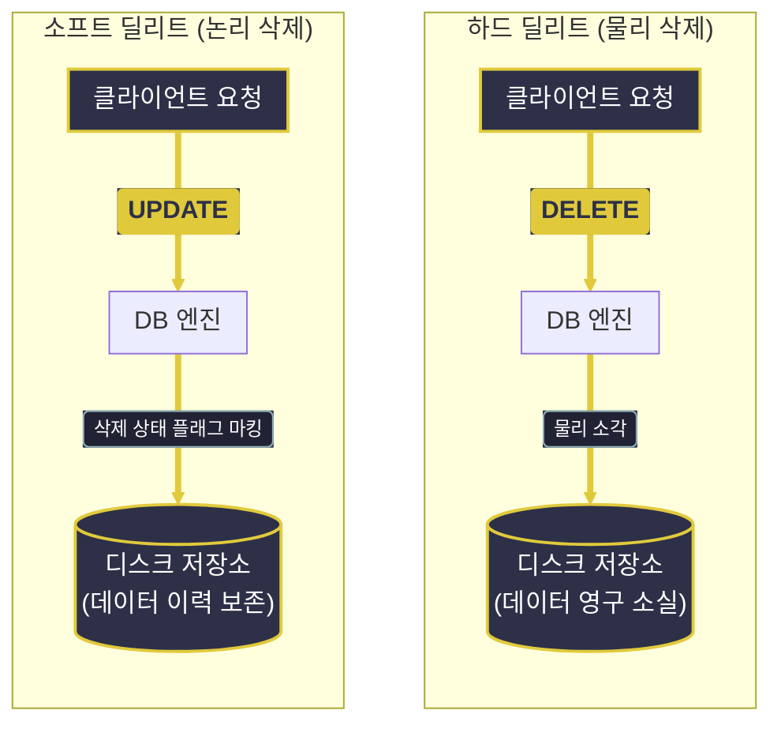

# DML (Data Manipulation Language)과 데이터 조작

---
layout: default
---

# 학습 체크리스트 (1/2)

- [ ] DML(Data Manipulation Language)의 정의와 특징 이해
- [ ] INSERT 구문을 활용한 단일 행, 다중 행, 서브쿼리 기반 데이터 삽입 습득
- [ ] UPDATE 연산 구조와 WHERE 절 누락 방지 및 서브쿼리 조건식 활용 학습

---
layout: default
---

# 학습 체크리스트 (2/2)

- [ ] MySQL의 UPDATE 대상 테이블 참조 제약(Error 1093) 우회 방법 습득
- [ ] DELETE 연산과 서브쿼리를 활용한 데이터 일괄 삭제 방식 파악
- [ ] 하드 딜리트와 소프트 딜리트의 동작 방식 및 설계상 트레이드오프 분석

---
layout: cover
class: text-center
---

# 데이터 조작어 (DML)

---
layout: default
---

# 데이터 조작어 개요

> **데이터 조작어 (Data Manipulation Language)**
>
> 테이블의 스키마 구조를 변경하지 않고, 테이블 내에 저장된 레코드(데이터)를 삽입, 수정, 삭제하기 위해 사용하는 데이터 조작어

- **스키마 보존**:
  - 테이블 자체의 물리적/논리적 설계 구조(DDL)는 그대로 둔 채 내부 인스턴스 데이터만 가공함
- **핵심 명령어로 구성**:
  - 신규 데이터 적재를 위한 `INSERT`, 필드 값 변경을 위한 `UPDATE`, 불필요한 행 제거를 위한 `DELETE`
- **트랜잭션의 보호**:
  - DDL과 달리 DML의 실행 결과는 즉시 영구 반영되지 않으며 Commit/Rollback의 제어를 받음

---
layout: cover
class: text-center
---

# 데이터 삽입 (INSERT)

---
layout: default
---

# 데이터 삽입 연산

> **데이터 삽입 (INSERT)**
>
> 테이블 내에 사전에 정의된 컬럼 순서나 지정된 컬럼 목록에 맞추어 새로운 레코드를 추가하는 명령

- **단일 행 삽입**:
  - 단 하나의 튜플 레코드를 지정된 테이블에 추가하는 가장 기본적인 동작 모델
- **다중 행 삽입**:
  - 콤마(,) 구분자를 기준으로 다수의 레코드를 나열하여 단일 쿼리로 한 번에 처리하는 일괄 적재 기법
- **서브쿼리 활용 삽입**:
  - 사전에 조회(SELECT)된 데이터셋 결과를 그대로 타겟 테이블에 고속 복사하는 이관 기법

---
layout: default
---

# 회원 테이블 데이터 삽입

```sql
-- 단일 행 삽입
INSERT INTO users (name, email) 
VALUES ('Alice', 'alice@example.com');

-- 다중 행 일괄 삽입
INSERT INTO users (name, email) 
VALUES 
  ('Bob', 'bob@example.com'),
  ('Charlie', 'charlie@example.com');
```

---
layout: default
---

# 서브쿼리를 활용한 데이터 이관

```sql
-- 특정 기간 가입자를 기록 보관 테이블로 복사
INSERT INTO archive_users (name, email)
SELECT name, email 
FROM users 
WHERE created_at < '2026-01-01';
```

---
layout: cover
class: text-center
---

# 데이터 수정 (UPDATE)

---
layout: default
---

# 데이터 수정 연산

> **데이터 수정 (UPDATE)**
>
> 테이블에 저장되어 있는 기존 행들의 특정 필드 값을 새로운 데이터로 변경하는 명령

- **SET 절 매핑**:
  - 지정한 컬럼명에 새로운 데이터를 직접 대입하며 쉼표(,)를 통해 복수 개의 컬럼을 동시 수정 가능함
- **WHERE 절 필수 지정**:
  - 조건을 지정하여 대상을 필터링하지 않으면 테이블 내의 모든 행이 동일하게 일괄 갱신되는 치명적 사고 발생
- **서브쿼리 조건식 활용**:
  - 수정 값 또는 필터 조건식 내부에 다른 테이블의 통계나 상태 값을 참조하는 서브쿼리를 결합함

---
layout: default
---

# WHERE 절 누락과 무결성 리스크

- **전체 데이터 오염**:
  - 단 한 줄의 조건절이 누락되어도 테이블의 전수 데이터가 지정 값으로 강제 덮어쓰기됨
- **세션 안전 조치**:
  - 실무 DB 설정에서 Safe Updates 옵션을 켜두면 WHERE 절이 없는 무조건적 UPDATE를 엔진이 거부함
- **트랜잭션 격리 검증**:
  - 작업 개시 전 자동 커밋을 끄고 수정한 결과를 검증한 뒤 `COMMIT` 또는 `ROLLBACK`을 판단함

---
layout: default
---

# 회원 이메일 정보 수정

```sql
-- 특정 식별자(ID)를 타겟으로 컬럼 값 갱신
UPDATE users 
SET email = 'new_alice@example.com' 
WHERE id = 1;
```

---
layout: default
---

# MySQL의 서브쿼리 참조 제약

> **MySQL 에러 1093 (Error 1093)**
>
> 데이터를 수정/삭제하는 대상 테이블을 서브쿼리의 FROM 절에서 직접 참조하여 조건으로 사용할 수 없는 MySQL의 문법적 제약

- **동시성 충돌 방지**:
  - 수정 연산이 가해지는 타겟 데이터를 동일 쿼리 내에서 순차 조회할 때 발생 가능한 정합성 모순을 방지함
- **임시 인라인 뷰 우회**:
  - 서브쿼리를 `FROM (SELECT ...)` 형태로 가상의 임시 뷰로 한 차례 더 감싸 별도의 공간에서 격리 연산함
- **가상 뷰의 별칭 지정**:
  - Derived Table 형식을 만족하기 위해 우회 뷰 블록 끝에 반드시 `AS 별칭` 명세가 누락되지 않아야 함

---
layout: default
---

# 수정 대상 테이블 직접 참조 시 에러

```sql
-- [에러 발생] UPDATE 대상인 users 테이블을 FROM에서 직접 조회
UPDATE users
SET status = 'inactive'
WHERE id IN (
  SELECT id FROM users WHERE last_login < '2026-01-01'
);
```

---
layout: default
---

# 임시 인라인 뷰를 통한 우회 해결

```sql
-- [정상 구동] 임시 뷰(temp)를 생성해 격리된 공간에서 먼저 조회
UPDATE users
SET status = 'inactive'
WHERE id IN (
  SELECT temp.id FROM (
    SELECT id FROM users WHERE last_login < '2026-01-01'
  ) AS temp
);
```

---
layout: cover
class: text-center
---

# 데이터 삭제 (DELETE)

---
layout: default
---

# 데이터 삭제 연산

> **데이터 삭제 (DELETE)**
>
> 테이블 내에서 조건에 매칭되는 행(Row)들을 물리적으로 영구 제거하는 명령

- **행 단위 삭제**:
  - 특정 필드 값만 비우는 것이 아닌 조건에 들어맞는 행 전체를 테이블 스토리지에서 탈거함
- **WHERE 절 생략의 위험성**:
  - 실수로 조건절을 기입하지 않으면 모든 레코드가 유실되므로 실행 전 반드시 격리 조치를 취해야 함
- **TRUNCATE(DDL)와의 차이**:
  - 고속 비우기인 TRUNCATE는 스토리지 공간을 즉시 OS에 반환하나 롤백이 불가한 DDL적 특성을 가짐

---
layout: default
---

# 특정 조건 데이터의 물리적 삭제

```sql
-- 만료된 세션 레코드 삭제
DELETE FROM sessions 
WHERE expired_at < NOW();
```

---
layout: default
---

# 서브쿼리 조건을 활용한 일괄 삭제

```sql
-- 비활성 회원들의 관련 접속 이력 제거
DELETE FROM user_logs
WHERE user_id IN (
  SELECT id FROM users WHERE is_deleted = 1
);
```

---
layout: default
---

# 하드 딜리트 vs 소프트 딜리트

> **물리 삭제와 논리 삭제 (Hard vs Soft Delete)**
>
> DELETE 구문을 사용하여 실제 디스크에서 레코드를 소각하는 방식(하드)과 UPDATE를 활용해 상태만 마킹하는 방식(소프트)

- **하드 딜리트 (물리 삭제)**:
  - `DELETE` 쿼리를 호출하여 테이블 내부 공간에서 대상 정보를 실제로 증발시킴
- **소프트 딜리트 (논리 삭제)**:
  - `is_deleted`나 `deleted_at` 컬럼을 설계한 후, 삭제 요청 시 삭제 플래그만 참(True)으로 업데이트함
- **비즈니스 정합성**:
  - 결제 정보 등 다른 데이터와 연동이 깊거나 감사 추적이 필요한 정보는 소프트 딜리트가 권장됨

---
layout: default
---

# 물리 및 논리 삭제의 트레이드오프

- **하드 딜리트의 특징**:
  - *장점*: 물리 디스크 영역이 즉각 확보되고, 검색용 인덱스 크기가 자동 축소되어 유지 관리가 수월함
  - *단점*: 실수로 유실된 레코드의 롤백이 불가능하며, 과거 이력 분석이 불가능해 연동 정합성이 깨질 수 있음
- **소프트 딜리트의 특징**:
  - *장점*: 삭제 데이터가 보존되어 복구가 간편하며, 데이터 히스토리 감사를 위한 통계 분석에 유용함
  - *단점*: 모든 조회(SELECT)에 `WHERE is_deleted = false` 필터가 필요해 쿼리가 복잡해지며 디스크 용량이 누적됨

---
layout: default
---

# 하드 및 소프트 딜리트 구조도

<style>
.slidev-layout .mermaid .engine rect {
  fill: #E0CA3C !important;
  stroke: #E0CA3C !important;
}
.slidev-layout .mermaid .engine .nodeLabel,
.slidev-layout .mermaid .engine tspan,
.slidev-layout .mermaid .engine text {
  fill: #2D3047 !important;
  color: #2D3047 !important;
}
</style>



---
layout: default
---

# 학습 요약 (Summary)

- **데이터 조작어 (DML)**:
  - 테이블의 스키마 구조 변경 없이 데이터를 삽입(`INSERT`), 수정(`UPDATE`), 삭제(`DELETE`)하는 SQL 집합
- **INSERT & UPDATE**:
  - 단일/다중 행 및 서브쿼리 활용이 가능하며, `UPDATE` 시 WHERE 절 누락 방지를 위해 Safe Updates 모드 활용 권장
- **MySQL Error 1093 우회**:
  - 동일 테이블 직접 참조 수정 제약을 해결하기 위해 하위 쿼리를 임시 인라인 뷰(`FROM (SELECT ...) AS temp`)로 감싸 처리
- **물리 및 논리 삭제**:
  - 스토리지에서 데이터를 소각하는 하드 딜리트와 플래그를 마킹하여 과거 이력을 보존하는 소프트 딜리트의 트레이드오프 고려
