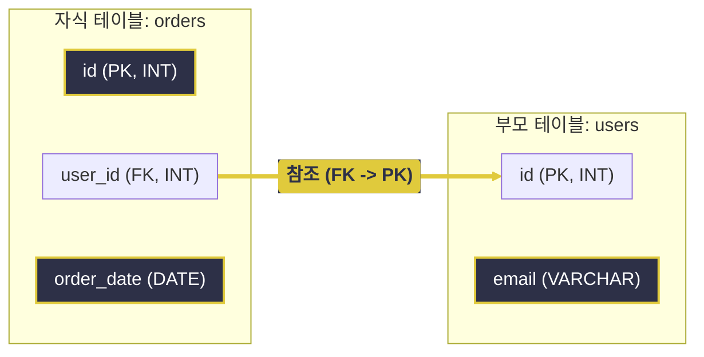
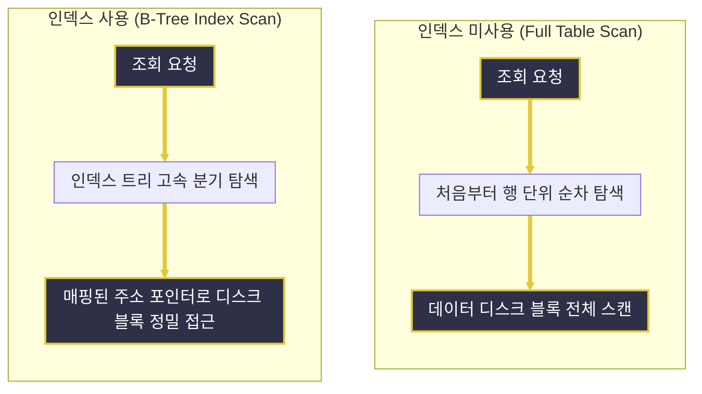

# DDL (Data Definition Language)과 데이터베이스 구조 설계

---
layout: default
---

# 학습 체크리스트 (1/2)

- [ ] DDL(Data Definition Language)의 정의와 트랜잭션 미적용 특성 이해
- [ ] MySQL의 주요 데이터 타입(수치형, 문자형, 날짜/시간형) 분류 습득
- [ ] 데이터 무결성을 보장하기 위한 5가지 핵심 제약 조건(Constraints) 파악

---
layout: default
---

# 학습 체크리스트 (2/2)

- [ ] DDL 명령어(CREATE, ALTER, DROP, TRUNCATE)의 역할과 차이점 이해
- [ ] TRUNCATE와 DELETE의 내부 동작 및 성능적 차이점 비교
- [ ] 인덱스(INDEX)의 동작 원리 및 조회/쓰기 트레이드오프 분석
- [ ] 식별자 설계 시 자연키(Natural Key) 대비 인조키(Surrogate Key)의 우수성 인지

---
layout: cover
class: text-center
---

# 데이터 정의어 (DDL)

---
layout: default
---

# 데이터 정의어 개요

> **데이터 정의어 (Data Definition Language)**
>
> 데이터베이스 내 객체(데이터베이스, 테이블, 뷰, 인덱스 등)의 논리적/물리적 구조를 신규 정의, 수정, 삭제하기 위해 사용하는 데이터 정의어

- **구조적 명세**:
  - 데이터가 실제로 저장되는 컨테이너인 데이터베이스 스키마와 인프라의 뼈대를 생성하고 폐기함
- **즉시 커밋 (Auto-Commit)**:
  - DML과 달리 DDL 명령은 실행 시 데이터베이스 엔진에 의해 디바이스 상에 즉시 커밋되어 변경 사항이 영구 확정됨
- **롤백 불가**:
  - 실행된 구조적 작업은 트랜잭션 롤백(Rollback)을 통해 이전 상태로 복구하는 것이 원칙적으로 불가능함

---
layout: default
---

# 건물 구조 변경과 인테리어

- **DDL (건물 설계 및 뼈대 공사)**:
  - 아파트의 벽을 허물거나 방의 크기를 규정하듯, 데이터베이스 저장소의 구조(Schema) 자체를 올리는 기초 인프라 공사
- **DML (가구 배치 및 입주)**:
  - 지어진 방 안에 가구를 들이고(INSERT), 가구를 바꾸거나(UPDATE), 필요 없어진 가구를 내다 버리는(DELETE) 개별 데이터 가공
- **Auto-Commit (설계 변경의 즉시 적용)**:
  - 뼈대 공사(DDL)는 즉시 단행되어 돌이킬 수 없으나, 방 안 물건을 치우는 행위(DML)는 정리 도중 취소(Rollback)할 수 있음

---
layout: cover
class: text-center
---

# DDL 기본 및 제약 조건

---
layout: default
---

# 데이터 타입 분류 (수치형)

> **데이터 타입 (Data Types)**
>
> 테이블의 각 열(Column)에 담길 값의 성격과 데이터 한계치를 물리적으로 규정하는 도구

| 타입명 | 저장 범위 및 물리적 특성 | 주요 용도 |
| :--- | :--- | :--- |
| **`INT`** | 4바이트 정수형 (약 -21억 ~ 21억) | 일반 식별자(ID), 수량, 상태 코드 |
| **`BIGINT`** | 8바이트 대용량 정수형 | 대규모 트래픽 식별 ID, 누적 대금 |
| **`DECIMAL(M,D)`** | 고정 소수점 방식 (정밀한 십진수) | 소수점 오차 없는 자산 가치, 할인 비율 |

---
layout: default
---

# 데이터 타입 분류 (문자형)

| 타입명 | 저장 범위 및 물리적 특성 | 주요 용도 |
| :--- | :--- | :--- |
| **`CHAR(N)`** | 고정 길이 텍스트 (남는 공간은 공백으로 채움) | 국가코드, 고정코드성 식별자 |
| **`VARCHAR(N)`**| 가변 길이 텍스트 (저장 공간 효율 극대화) | 사용자 이메일, 회원 성명 |
| **`TEXT`** | 최대 65,535바이트 가변 대용량 텍스트 | 게시글 본문, 로그 메시지 |

---
layout: default
---

# 데이터 타입 분류 (날짜 및 시간)

| 타입명 | 저장 형식 | 타임존 연동 | 권장 용도 |
| :--- | :--- | :--- | :--- |
| **`DATE`** | `YYYY-MM-DD` | 미연동 (고정값) | 생년월일, 휴무일 |
| **`DATETIME`**| `YYYY-MM-DD HH:MM:SS` | 미연동 (정적 저장) | 예약 일시, 결제 일자 |
| **`TIMESTAMP`**| `YYYY-MM-DD HH:MM:SS` | **클라이언트 Timezone 연동** | 생성일시, 수정일시 (로그) |

---
layout: default
---

# 제약 조건의 역할 (1/2)

> **제약 조건 (Constraints)**
>
> 데이터의 부정 입력을 사전에 원천 차단하고 정합성과 데이터 무결성을 보장하기 위해 필드별로 설정하는 물리적 규칙

- **PRIMARY KEY (기본키)**:
  - 테이블당 단 한 개만 설정 가능한 식별 키로, `NOT NULL`과 `UNIQUE` 특징을 기본 장착하여 행 단위 고유성을 확보함
- **FOREIGN KEY (외래키)**:
  - 연관 부모 테이블의 고유 필드를 자식 테이블이 바라보게 지정하여 참조 무결성을 수호하며, 연동 상태 옵션(`CASCADE`, `SET NULL` 등)을 추가 탑재 가능함

---
layout: default
---

# 기본키(PK)와 외래키(FK)의 관계도

<style>
.slidev-layout .mermaid .engine rect {
  fill: #E0CA3C !important;
  stroke: #E0CA3C !important;
}
.slidev-layout .mermaid .engine .nodeLabel,
.slidev-layout .mermaid .engine tspan,
.slidev-layout .mermaid .engine text {
  fill: #2D3047 !important;
  color: #2D3047 !important;
}
</style>



---
layout: default
---

# 제약 조건의 비교

| 제약 조건 | 중복 허용 | NULL 허용 | 핵심 특성 |
| :--- | :---: | :---: | :--- |
| **PRIMARY KEY** | X | X | 테이블당 단 1개만 지정 가능, 각 행의 고유 식별자 |
| **FOREIGN KEY** | O | O | 타 테이블의 PK/UNIQUE 참조, 참조 무결성 수호 |
| **UNIQUE** | X | O | 컬럼 내 값 유일성 확보, 다중 NULL 입력 허용 |
| **NOT NULL** | O | X | 비어있는 값(`NULL`) 입력 차단, 필수 정보 누락 방지 |
| **DEFAULT** | O | O | 값 대입 생략 시 설정된 초기값(예: NOW()) 자동 주입 |

---
layout: default
---

# 놀이공원 자유이용권과 입장 계약

- **PRIMARY KEY (고유 입장권 번호)**:
  - 모든 관람객이 반드시 지녀야 하고 중복될 수 없는 유일무이한 바코드 식별자
- **FOREIGN KEY (미아 방지 연결끈)**:
  - 아이(자식 테이블)가 반드시 보호자(부모 테이블)의 손을 꼭 잡고 입장하도록 강제하는 링크 안전장치
- **NOT NULL (필수 작성 성명란)**:
  - 신청서에서 이름을 빼놓으면 가입 자체가 안 되게 통제하는 공란 방지 규칙
- **DEFAULT (기본 제공 생수)**:
  - 주문 시 식음료 요청을 생략해도 입장객 전원에게 기본적으로 한 병씩 나누어 주는 물품

---
layout: default
---

# DDL 기반 회원 테이블 생성

```sql
-- 테이블 구조 선언 및 제약 조건 지정
CREATE TABLE users (
  id INT AUTO_INCREMENT PRIMARY KEY,
  email VARCHAR(100) NOT NULL UNIQUE,
  status VARCHAR(10) DEFAULT 'ACTIVE',
  created_at TIMESTAMP DEFAULT CURRENT_TIMESTAMP
);
```

---
layout: cover
class: text-center
---

# DDL 명령어와 스키마 제어

---
layout: default
---

# 스키마 제어 명령어

> **구조 제어 명령어 (Structure Control Commands)**
>
> 데이터가 보관될 물리적인 프레임워크나 컨테이너 구조 자체를 관리하는 명령어군

- **CREATE**:
  - 테이블, 인덱스, 뷰 등 대상 구조의 초기 뼈대를 설계하여 물리적 저장 장치 상에 구획을 할당함
- **ALTER**:
  - 운영 중인 테이블 속성에 열을 주입(`ADD`), 필드 속성을 변경(`MODIFY`), 또는 지정 필드를 축출(`DROP`)하는 편집 연산을 수행함
- **DROP**:
  - 스키마 내 해당 구조물 전체와 내장 데이터를 한순간에 완전 회수하며 스토리지 공간을 증발시킴

---
layout: default
---

# 컬럼 추가 및 속성 수정

```sql
-- 기존 테이블의 스키마 구조 개편
ALTER TABLE users ADD age INT NOT NULL;
ALTER TABLE users MODIFY status VARCHAR(20) DEFAULT 'PENDING';
ALTER TABLE users DROP COLUMN status;
```

---
layout: default
---

# 고속 데이터 삭제, TRUNCATE

> **트런케이트 (TRUNCATE)**
>
> 테이블의 스키마 구조(뼈대)는 고스란히 온전케 둔 상태로, 내부 데이터 전체를 즉각 고속으로 제거하는 초기화 명령

- **일련번호 카운터 리셋**:
  - 테이블 내 기록 일체를 비우며 `AUTO_INCREMENT` 자동 순번 값 카운터를 다시 1(시발점)로 돌려놓음
- **동작 메커니즘**:
  - DML이 아닌 DDL로서 내부적으로 DROP 후 다시 CREATE하는 일관 연산을 수행해 자원 처리 효율이 극대화됨
- **스토리지 반환**:
  - 행 단위 삭제인 DML `DELETE`와 달리 물리적으로 물려있던 블록 세그먼트 저장 용량을 시스템으로 즉시 환원함

---
layout: default
---

# 데이터 삭제 명령어 비교

| 비교 항목 | `DROP` | `TRUNCATE` | `DELETE` |
| :--- | :---: | :---: | :---: |
| **명령어 종류** | DDL | DDL | DML |
| **대상 및 범위** | 테이블 및 데이터 전체 영구 파괴 | 데이터 전체 삭제 (구조 존치) | 조건에 부합하는 행 단위 삭제 |
| **트랜잭션 롤백** | **불가능 (Auto-Commit)** | **불가능 (Auto-Commit)** | **가능 (Commit/Rollback)** |
| **처리 속도** | 매우 빠름 | 압도적으로 빠름 | 느림 (행별 로그 기록 부하) |
| **AUTO_INCREMENT** | 삭제 (N/A) | **1로 리셋 초기화** | 기존 카운터 유지 |
| **디스크 자원 반환**| 즉시 반환 | 즉시 반환 | 데이터만 지움 (자원 미반환) |

---
layout: default
---

# 테이블의 모든 행 영구 고속 삭제

```sql
-- 테이블 구조만 남겨두고 전체 레코드 일괄 초기화
TRUNCATE TABLE users;
```

---
layout: cover
class: text-center
---

# DDL 응용 (인덱스 및 인조키)

---
layout: default
---

# 데이터 검색 최적화, 인덱스

> **인덱스 (Index)**
>
> 테이블 내부 검색 성능 향상을 위해 특정 열 값을 사전에 정렬하여 포인터 형태로 관리하는 B-Tree 기반의 물리적 색인 구조

- **검색 속도 극대화**:
  - `SELECT` 질의 조건절 및 `ORDER BY` 정렬 연산 수행 시 대량 탐색의 시간 복잡도를 비약적으로 축소함
- **쓰기 비용 패널티**:
  - `INSERT`/`UPDATE`/`DELETE` 시 색인을 지속 갱신해야 하므로 물리 쓰기 작업 부하와 지연이 누적됨
- **보관 영역 공간 비용**:
  - 구조적 색인 트리를 가동하기 위해 원본 테이블 외의 추가 디스크 영역을 확보하고 점유해야 함

---
layout: default
---

# 책 찾아보기 색인과 전수 독서

- **인덱스가 없을 때 (Full Table Scan)**:
  - 1,000페이지 분량의 역사 책에서 '세종대왕'이라는 단어를 찾기 위해 1페이지부터 끝까지 한 줄씩 읽는 무식한 방식
- **인덱스가 있을 때 (Index Scan)**:
  - 책 맨 뒤의 '찾아보기(색인)' 페이지에서 '세종대왕: 425p'를 확인한 뒤 곧바로 해당 장으로 점프하는 지능적 방식
- **쓰기 오버헤드 (색인 업데이트)**:
  - 본문 내용을 새로 쓰거나 수정할 때마다 맨 뒤의 찾아보기 페이지까지 매번 가나다순으로 새로 정렬해 수정해야 하는 번거로움

---
layout: default
---

# B-Tree 인덱스의 정의와 특징

> **B-Tree (Balanced Tree)**
>
> 루트 노드에서 단말 노드까지의 모든 경로의 깊이(높이)가 항상 같도록 보장하여 좌우 균형을 이루는 자가 균형 탐색 트리 구조

- **일정한 탐색 속도**:
  - 데이터 치우침이 없어 최악의 조건에서도 탐색, 삽입, 삭제 모두 $O(\log N)$의 성능을 균등하게 보장함
- **노드의 다중 분기 (Multi-way)**:
  - 노드 하나에 단 하나의 값만 가지는 이진 트리와 달리, 하나의 노드에 수십~수백 개의 키와 포인터를 함께 저장함
- **정렬 상태 유지**:
  - 노드 내부의 키들이 항상 오름차순 정렬 상태를 고수하여, 노드 내에서의 값 매칭 판단 역시 이진 탐색으로 매우 빠름

---
layout: default
---

# B-Tree가 디스크 탐색에 유리한 이유

- **트리의 높이 최소화**:
  - 한 노드가 가질 수 있는 자식의 수가 많아 데이터가 기하급수적으로 늘어도 트리 높이가 $3\sim4$ 단계 수준으로 조밀하게 억제됨
- **디스크 블록 단위 연동**:
  - 노드의 크기를 데이터베이스 페이지 크기(예: InnoDB 16KB)와 일치시켜 단 한 번의 디스크 I/O로 수백 개의 인덱스 키를 메모리에 로딩함
- **포인터 추적을 통한 고속 접근**:
  - 수천만 건의 레코드셋에서도 루트에서 리프 노드까지 단 $3\sim4$번의 노드 탐색만 거치면 대상 데이터 주소에 곧바로 당도함

---
layout: default
---

# 검색 성능 최적화를 위한 인덱스 생성

```sql
-- 사용자 이메일 검색 속도 가속을 위한 색인 구축
CREATE INDEX idx_users_email ON users (email);
```

---
layout: default
---

# 자연키 대비 인조키의 설계 이점 (1/2)

> **인조키 (Surrogate Key)**
>
> 주민등록번호 등 실세계 정보 기반의 자연키(Natural Key) 대신, 데이터베이스 자동 번호 부여 등을 통해 의미 없이 임시 발행한 식별용 기본키

- **도메인 종속 탈피**:
  - 자연키(이메일, 번호 등)는 비즈니스 변경, 법령 통제(개인정보 취급 제한) 등의 환경 변화에 따라 변경될 위험이 다분함
- **참조 불변성 수호**:
  - 비즈니스 의미가 완전히 결여된 가상의 값을 기본키로 지정하여 변경 요소를 사전에 차단함

---
layout: default
---

# 자연키 대비 인조키의 설계 이점 (2/2)

- **외래키 파괴 예방**:
  - 식별자로 설정된 자연키 값이 도중에 변경되면 하위 연관 테이블로의 CASCADE 전파 연산 등으로 시스템 부하 및 정합성 붕괴를 초래함
- **개인정보 취급 강화**:
  - 주민등록번호나 휴대폰 번호와 같이 유출 리스크가 높은 자연키를 식별자로 쓰는 설계 오류를 차단해 보안 규정을 충족함

---
layout: default
---

# 휴대폰 번호 변경과 임시 회원 식별자

- **자연키 (휴대폰 번호 식별)**:
  - 고객의 휴대폰 번호로 식별자를 삼았으나, 고객이 번호를 바꿀 때마다 그와 얽힌 결제, 배송 등 수많은 연동 정보 식별자를 전부 갱신해야 하는 정합성 대폭발 상태
- **인조키 (가입 즉시 부여되는 회원 순번)**:
  - 가입한 회원에게 즉시 의미 없는 번호(예: `1024번`)를 부여하고 이 번호로 모든 거래 이력을 묶어 관리함
  - 이메일이나 전화번호가 여러 번 변하더라도 회원번호 `1024`는 고정되어 있어 상호 연동 참조가 절대 깨지지 않음

---
layout: default
---

# 자연키와 인조키의 특징 비교

| 비교 항목 | 자연키 (Natural Key) | 인조키 (Surrogate Key) |
| :--- | :--- | :--- |
| **정의** | 도메인 비즈니스 속성에서 도출 | 시스템 편의상 생성한 가상의 일련번호 |
| **대표 예시** | 이메일, 전화번호, 주민등록번호 | `id (AUTO_INCREMENT)`, `UUID` |
| **값의 변경성** | 높음 (개인정보 수정, 법적 요구 등) | 없음 (시스템에서 고정 부여) |
| **참조 안전성** | 낮음 (부모 키 변경 시 연쇄 정합성 위기) | 매우 높음 (참조 불변성 확보) |
| **인덱스 성능** | 느림 (가변 문자열 비교 오버헤드) | 매우 빠름 (단순 정수형 단순 비교) |

---
layout: default
---

# 인덱스 생성 및 검색 최적화 흐름

<style>
.slidev-layout .mermaid .engine rect {
  fill: #E0CA3C !important;
  stroke: #E0CA3C !important;
}
.slidev-layout .mermaid .engine .nodeLabel,
.slidev-layout .mermaid .engine tspan,
.slidev-layout .mermaid .engine text {
  fill: #2D3047 !important;
  color: #2D3047 !important;
}
</style>



---
layout: default
---

# 학습 요약 (Summary)

- **데이터 정의어 (DDL)**:
  - 테이블, 인덱스 등 데이터베이스 객체 구조를 관리하며 즉시 반영(Auto-Commit) 및 롤백이 불가함
- **데이터 타입 및 제약 조건**:
  - 데이터 무결성을 위해 PK, FK, UNIQUE, NOT NULL, DEFAULT 등 물리적 제약을 명세함
- **TRUNCATE 초기화**:
  - 데이터 전체를 DROP 후 재성장시켜 고속 비우기를 단행하고 일련번호 카운터를 1로 리셋함
- **인덱스 및 인조키 설계**:
  - B-Tree 탐색 최적화(조회 향상, 쓰기 손실) 및 도메인 종속을 피하기 위해 자동 일련번호(인조키)를 식별자로 채택
