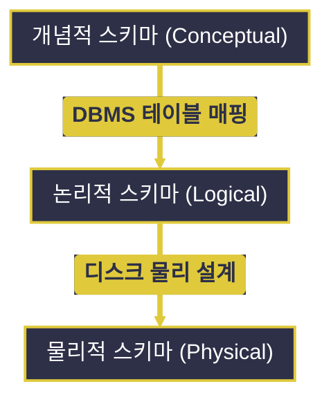
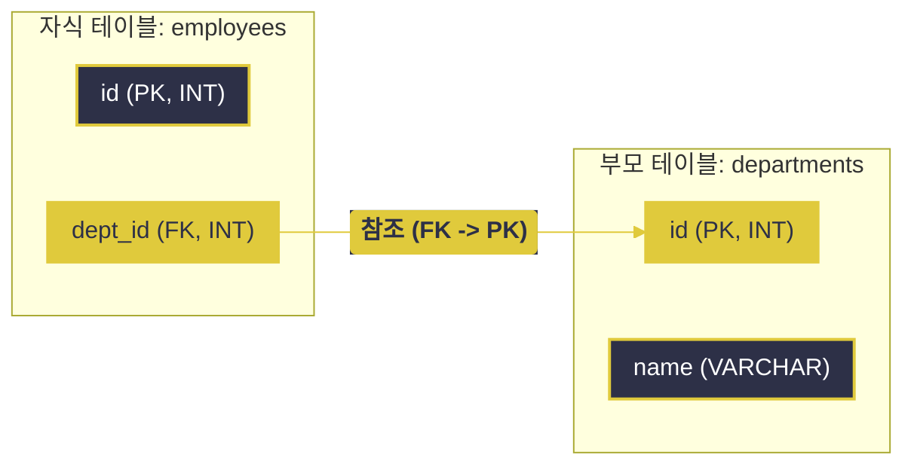

# 데이터베이스 설계와 정규화

---
layout: default
---

# 학습 체크리스트 (1/2)

- [ ] 현실 세계를 데이터로 변환하는 데이터 모델링 과정과 핵심 용어 이해
- [ ] 개념적, 논리적, 물리적 스키마(Schema)의 3단계 구조와 특징 파악
- [ ] 데이터베이스 시각화 및 설계 도구(ERD, ERD Cloud, Mermaid) 습득
- [ ] 튜플을 유일하게 식별하고 연결하는 6가지 데이터베이스 키 분류 숙지

---
layout: default
---

# 학습 체크리스트 (2/2)

- [ ] 식별자 선정 시 자연 키(Natural Key)와 인조 키(Surrogate Key)의 우수성 비교
- [ ] 인조 키 발급의 두 가지 형태인 Sequence와 UUID의 물리적 이점 및 한계 분석
- [ ] 데이터 중복 및 이상 현상(Anomaly)을 원천 예방하는 단계별 정규화 학습
- [ ] 고속 조회 및 트래픽 부하 해결을 위한 반정규화(Denormalization) 기법 파악

---
layout: cover
class: text-center
---

# 데이터 모델링

---
layout: default
---

# 데이터 모델링 개요

> **데이터 모델링 (Data Modeling)**
>
> 현실 세계의 복잡한 비즈니스 요구사항과 데이터를 추상화, 단순화, 명확화하여 데이터베이스 구조로 설계하는 일련의 과정

- **추상화 및 구조화**:
  - 현실의 업무 프로세스를 가시적인 데이터 구조(스키마)로 정돈하여 시스템의 기반을 설계함
- **데이터 무결성 확보**:
  - 데이터가 정합성을 유지하도록 구조적 형식과 각종 제약 사항을 선제적으로 통제함
- **협업 가속화**:
  - 개발자와 비즈니스 기획자 간의 요구사항 오해를 해소하는 표준 명세서 역할을 담당함

---
layout: default
---

# 관계형 모델의 핵심 용어 (1/2)

- **엔터티 (Entity / 개체)**:
  - 데이터베이스에서 관리하고자 하는 유무형의 대상체로, 고유한 식별자를 가지며 저장이 필요한 정보의 단위
- **릴레이션 (Relation / 테이블)**:
  - 엔터티 혹은 이들의 연관 관계를 2차원 표(Table) 형태로 구조화하여 나타낸 데이터 구조
- **튜플 (Tuple / 행 / 레코드)**:
  - 릴레이션을 구성하는 각 가로 줄로, 실세계의 구체적인 개체 인스턴스 하나를 나타내는 데이터 단위

---
layout: default
---

# 관계형 모델의 핵심 용어 (2/2)

- **속성 (Attribute / 열 / 필드)**:
  - 릴레이션의 세로 열에 해당하며, 엔터티가 가지는 구체적인 성격, 특징 또는 데이터 타입
- **도메인 (Domain)**:
  - 하나의 속성(Attribute)이 안전하게 가질 수 있는 원자값들의 논리적/물리적 유효 범위

---
layout: default
---

# 가구 설계와 실물 가구

- **엔터티 (가구 종류)**:
  - 관리실에서 입출고를 기록할 가구 종류(예: '책상', '의자')처럼 이름을 붙인 고유 대상
- **속성 (가구의 제원)**:
  - 가로 길이, 세로 길이, 재질, 색상 등 개별 가구의 구체적인 스펙을 명시하는 열(Column)
- **도메인 (색상 선택 폭)**:
  - 색상 칸에 '갈색', '검은색', '하얀색'만 칠할 수 있도록 허용 범위를 안전하게 차단해 둔 장치
- **튜플 (주문된 단 하나의 책상)**:
  - "1번 책상, 120cm, 80cm, 참나무, 갈색"이라는 특징이 실제로 결합되어 방 안에 안착한 실물

---
layout: default
---

# 데이터베이스 스키마 개요

> **데이터베이스 스키마 (Database Schema)**
>
> 데이터베이스의 구조와 제약 조건에 관해 전반적으로 기술한 메타데이터의 집합

- **구조적 뼈대 선언**:
  - 테이블 명세, 컬럼 속성, 인덱스 관계 및 기본키/외래키 등 모든 구조의 규칙을 담음
- **데이터 독립성 구현**:
  - 내부 구조가 바뀌거나 외부 뷰가 바뀌어도 데이터 처리 방식에 영향을 주지 않도록 매핑함
- **데이터 안정성 보장**:
  - 허용하지 않는 범위나 규칙에 어긋나는 잘못된 값이 들어오지 않도록 정합성을 수호함

---
layout: default
---

# 스키마의 3단계 구조

- **개념적 스키마 (Conceptual Schema)**:
  - 사용자나 조직 전체의 관점에서 표현한 논리 구조로, 물리 구현을 배제하고 전체 엔터티 관계(E-R 다이어그램)를 통합 정의함
- **논리적 스키마 (Logical Schema)**:
  - 개념 스키마를 특정 RDBMS가 이해할 수 있는 테이블 정의, 속성 타입, 키 관계 등으로 매핑하여 구체화한 모델
- **물리적 스키마 (Physical Schema)**:
  - 논리 스키마가 디스크 등의 실제 저장 장치에 보관되는 명세로, 인덱스 생성 및 파일 할당 크기 등을 상세 설계함

---
layout: default
---

# 스키마 구조의 계층적 연동 관계



---
layout: default
---

# 데이터베이스 설계 및 시각화 도구

> **ERD (Entity-Relationship Diagram)**
>
> 엔터티 간의 관계를 도식화하여 데이터베이스의 전체 구조를 시각화하는 설계 도구

- **ERD Cloud**:
  - 웹 브라우저 기반 실시간 동시 협업 모델링 툴로, 설치 없이 스키마 구축이 가능하며 SQL 생성 기능을 지원함
- **Mermaid**:
  - 마크다운 내에서 텍스트 문법을 통해 다이어그램을 코드로 즉시 생성하고 렌더링하는 오픈소스 스크립팅 도구
- **DB Tool (DBeaver, IntelliJ)**:
  - 실제 DB 서버에 이미 생성된 테이블 구조와 참조선 관계를 역공학(Reverse Engineering)하여 자동으로 ERD를 시각화해 줌

---
layout: default
---

# 회원 및 구매 데이터 관계 선언

```sql
CREATE TABLE customers (
  id INT AUTO_INCREMENT PRIMARY KEY,
  name VARCHAR(50) NOT NULL,
  registered_date DATE DEFAULT (CURRENT_DATE)
);
```

---
layout: cover
class: text-center
---

# 데이터베이스 키

---
layout: default
---

# 데이터베이스 키 개요

> **데이터베이스 키 (Database Keys)**
>
> 릴레이션 내에서 각 튜플들을 유일하게 식별하고 테이블 간의 참조 관계를 구성하여 데이터 무결성을 보장하는 속성들의 조합

- **유일 식별자 역할**:
  - 테이블 안에 저장된 수많은 행들이 겹치지 않고 온전히 분리될 수 있는 유일성을 부여함
- **참조 무결성 보장**:
  - 외래키를 통해 부모 테이블의 고유값을 가리키도록 설정하여 서로 어긋나는 참조를 영구 차단함
- **검색 및 조인 가속**:
  - 식별 키 값을 통해 탐색 범위가 압축되어 대용량 조회 성능의 속도를 끌어올림

---
layout: default
---

# 키의 분류와 정의 (1/2)

- **슈퍼 키 (Super Key)**:
  - 릴레이션 내의 모든 튜플을 유일하게 식별할 수 있는 속성 집합 (유일성 만족, 최소성 미만족)
- **후보 키 (Candidate Key)**:
  - 튜플을 유일하게 식별할 수 있는 최소한의 속성 집합 (유일성과 최소성을 모두 충족하는 기본키 후보군)
- **기본 키 (Primary Key / PK)**:
  - 후보 키 중 테이블을 대표하는 식별자로 지정된 키로, 중복 값과 `NULL` 값을 가질 수 없음

---
layout: default
---

# 키의 분류와 정의 (2/2)

- **대체 키 (Alternate Key)**:
  - 후보 키 중 기본키로 최종 발탁되지 못하고 남은 나머지 식별 키
- **외래 키 (Foreign Key / FK)**:
  - 다른 테이블의 기본키를 참조하여 테이블 간의 연관 관계를 맺고 데이터 참조 무결성을 보장하는 제약 조건
- **복합 키 (Composite Key)**:
  - 두 개 이상의 속성을 결합하여 하나의 기본키로 작동하도록 설계한 식별 키

---
layout: default
---

# 아파트 동호수와 입주자 관리

- **슈퍼 키 (동호수 + 이름 + 차종)**:
  - 주민을 식별하는 데 문제없으나 차종이나 이름 정보까지 굳이 포함할 필요는 없는 장황한 조합
- **후보 키 (동호수, 혹은 세대주 주민번호)**:
  - 중복되지 않으면서도 불필요한 군더더기가 없는 가장 심플하고 최소화된 식별자
- **기본 키 (동호수)**:
  - 아파트 관리사무소에서 단지 관리를 위해 최종 대표 식별자로 선택하여 못 박은 핵심 키
- **외래 키 (배달 차량 등록표의 동호수)**:
  - 배달 차량에 "101동 202호 방문"이라는 동호수(PK)를 적어두어 실체하는 동호수 주민과의 연계를 확실하게 인증하는 안전끈

---
layout: default
---

# 자연 키와 인조 키의 대립

> **자연 키와 인조 키 (Natural & Surrogate Keys)**
>
> 도메인 비즈니스적 의미의 포함 여부에 따른 기본키의 분류 체계

- **자연 키 (Natural Key)**:
  - 이메일, 전화번호, 주민등록번호처럼 현실 비즈니스 영역에서 고유성을 갖는 실제 데이터를 식별키로 채용하는 방식
- **인조 키 (Surrogate Key)**:
  - 비즈니스와는 전혀 무관한 가상의 일련번호나 해시 난수 등을 인위적으로 부여하여 기본키로 삼는 방식

---
layout: default
---

# 자연 키 설계의 아킬레스건

- **비즈니스 규칙 변경 위험**:
  - 회원 식별용 이메일 주소를 변경해야 하거나, 주민번호 수집이 법적으로 정면 금지되는 상황이 닥칠 때 키 설계 자체가 붕괴함
- **외래키 변경의 전파 부하 (Cascade Overhead)**:
  - 자연키 값이 도중에 변경되면, 이 키를 외래키로 참조하여 물려있던 수많은 자식 테이블의 필드까지 일괄 갱신해야 하므로 정합성 위기가 심화됨
- **개인정보 유출 리스크**:
  - 주민번호나 전화번호 같은 주요 정보를 키로 쓰면 자식 테이블마다 이 정보가 복제되어 퍼지므로 심각한 보안 침해 경로를 만듦

---
layout: default
---

# 인조 키의 강점 및 채번 전략

- **참조 불변성의 완벽한 만족**:
  - 의미 없는 가상의 값을 기본키로 고정하므로 비즈니스나 개인정보 법령이 바뀌어도 식별자는 영원히 변치 않고 안전함
- **대표적인 인조키 생성 유형**:
  - **Seq (Sequential Auto Increment)**: 1부터 1씩 순차적으로 자동 증가하는 정수 번호
  - **UUID (Universally Unique Identifier)**: 128비트 크기로 자동 생성되는 난수형 고유 식별자

---
layout: default
---

# 인조키 전략 비교 (Seq vs UUID)

| 비교 항목 | Seq (순차 증가 정수) | UUID (128비트 난수) |
| :--- | :--- | :--- |
| **저장 크기** | 4~8바이트 (매우 작음) | 16바이트/36문자 (상대적으로 큼) |
| **쓰기 성능** | 매우 뛰어남 (물리 순차 저장) | 현저히 낮음 (무작위 분산으로 페이지 분할 발생) |
| **분산 확장성** | 분산 발급 시 Sync 조율 비용 발생 | 중앙 조율 없이 독립 고유성 완전 보장 |
| **보안 유출** | 취약함 (규모 추정 및 URL 조작 가능) | 강함 (추적 및 순서 예측이 불가능) |

---
layout: default
---

# 부서와 사원 테이블의 기본 연결 설계

```sql
CREATE TABLE departments (
  id INT AUTO_INCREMENT PRIMARY KEY,
  name VARCHAR(50) NOT NULL
);

CREATE TABLE employees (
  id INT AUTO_INCREMENT PRIMARY KEY,
  dept_id INT,
  FOREIGN KEY (dept_id) REFERENCES departments(id)
);
```

---
layout: default
---

# 외래키를 활용한 상호 참조 관계도



---
layout: cover
class: text-center
---

# 정규화와 반정규화

---
layout: default
---

# 정규화 개요

> **정규화 (Normalization)**
>
> 데이터 중복을 최소화하여 삽입·수정·삭제 시 발생하는 이상 현상을 예방하고 데이터 정합성을 철저히 지키기 위해 테이블을 단계별로 분해하는 과정

- **이상 현상 (Anomaly) 차단**:
  - 설계 오류로 인해 발생하는 튜플 수정/삭제/삽입 시의 모순적 동작을 근본적으로 제거함
- **데이터 정합성(Consistency) 유지**:
  - 중복 저장을 차단하여 한 곳만 고쳐도 전체 데이터 일관성이 확보되게 정비함
- **저장 자원 최적화**:
  - 무의미하게 중복 축적되는 컬럼 값들을 분리해 저장 비용을 절감함

---
layout: default
---

# 설계 결함으로 인한 3대 이상 현상

- **삽입 이상 (Insertion Anomaly)**:
  - 새로운 데이터를 추가하고 싶으나, 관련 없는 다른 필수 칼럼 정보가 누락되어 입력을 거부당하거나 가짜 데이터를 넣어야 하는 현상
- **삭제 이상 (Deletion Anomaly)**:
  - 필요 없는 특정 내역을 골라 지우는 과정에서, 보관해야 할 무관한 유용 데이터까지 통째로 지워져 영구 소실되는 현상
- **갱신 이상 (Update Anomaly)**:
  - 복제/중복 보관된 일부 행만 수정이 이루어져 동일한 속성인데 서로 다른 값을 가리키는 정합성 파괴 모순

---
layout: default
---

# 패키지 등록과 회원 명부 파손

- **삽입 이상**:
  - 신규 고객 정보만 등록하려 했으나, 구매한 강습 프로그램(필수 속성) 번호가 미정이라 회원 가입 자체를 반려함
- **삭제 이상**:
  - 회원이 기간 만료된 개인 사물함 이용증을 해지했더니, 이용증 테이블에서 회원 고유 프로필까지 동시 영구 삭제됨
- **갱신 이상**:
  - 이사한 회원의 주소를 수정했는데, 회원 테이블의 주소는 수정되었으나 결제 테이블 상에 복사된 주소는 갱신되지 않고 방치됨

---
layout: default
---

# 단계별 정규화 규칙 (1/2)

- **제1정규형 (1NF) - 원자값 확보**:
  - 테이블 내 모든 컬럼의 값이 단 하나의 원자 값(Atomic Value)을 갖도록 보장하고, 중복 컬럼 그룹을 완전 제거함
- **제2정규형 (2NF) - 부분 함수 종속 제거**:
  - 1NF를 만족하고, 기본키가 여러 개일 때 일부 열에만 종속되는 부분 함수 종속을 분해하여 완전 함수 종속 구조를 세움
- **제3정규형 (3NF) - 이행적 함수 종속 제거**:
  - 2NF를 만족하고, 일반 컬럼 간의 이행적 함수 종속(A $\rightarrow$ B $\rightarrow$ C) 관계를 별도 테이블로 분리함

---
layout: default
---

# 단계별 정규화 규칙 (2/2)

- **보이스-코드 정규형 (BCNF) - 결정자 키 강제**:
  - 3NF를 만족하며, 후보키가 아닌 결정자(Determinant)가 존재하는 종속 구조를 쪼개어 모든 결정자가 후보키가 되게 함
- **제4정규형 (4NF) - 다치 종속 해소**:
  - 릴레이션에 존재하는 다치 종속(Multi-valued Dependency) 구조를 다른 테이블로 쪼개어 독립시킴
- **제5정규형 (5NF) - 조인 종속 제거**:
  - 조인 종속(Join Dependency)이 오직 후보키를 통해서만 성립되도록 하여 조인 복원 시 무손실 분해를 종결함

---
layout: default
---

# 반정규화 개요

> **반정규화 (Denormalization)**
>
> 대량의 웹 서비스 트래픽 환경에서 정규화된 테이블의 과도한 조인 연산으로 인한 성능 병목을 해소하기 위해, 의도적으로 데이터의 중복을 허용하는 물리 설계 조정 기법

- **조인 병목 해결**:
  - 분산된 테이블들을 엮어 읽을 때 수반되는 다중 디스크 I/O 조인 횟수를 줄여 초고속 조회를 유도함
- **데이터 정합성 트레이드오프**:
  - 쓰기/수정 시 갱신 부하가 늘고 데이터 중복 불일치 위험을 감수하는 대신, 극단적인 읽기 성능 향상을 위해 수행함
- **주요 배경**:
  - 조회 응답 지연 속도가 서비스 사용자 이탈에 직접적인 위협을 주는 웹 아키텍처에서 빈번하게 채용됨

---
layout: default
---

# 반정규화의 핵심 설계 기법

- **테이블 병합 및 분할**:
  - 1:1 관계의 테이블을 병합하여 Join 횟수를 아끼거나, 특정 기준(수평/수직)으로 테이블을 파티셔닝(Partitioning)하여 탐색 범위를 한정함
- **컬럼 반정규화**:
  - 자주 조회되는 상위 테이블 속성을 하위 테이블에 복사해 두는 '중복 컬럼 주입', 합계/평균을 미리 구해 기록해 두는 '파생 컬럼 생성'
- **관계 반정규화**:
  - 먼 조상 테이블까지 거슬러 올라가 조인하는 속도를 줄이기 위해 중간 단계를 뛰어넘어 직접 외래키(FK)를 연결함

---
layout: default
---

# 학습 요약 (Summary)

- **데이터 모델링**:
  - 현실 요구사항을 추상화하여 개념-논리-물리 스키마 3단계 설계를 수립해 가독성과 독립성을 보장하는 기초 공사
- **데이터베이스 키**:
  - 고유한 튜플 식별 및 참조 무결성을 수호하며, 도메인 규칙 변경에 유연하게 대응하기 위해 자연키 대비 인조키(Seq/UUID)를 전략적으로 배치함
- **정규화**:
  - 데이터 중복을 억제하고 이상 현상(삽입/삭제/갱신)을 제거하기 위해 테이블을 단계별(1NF~5NF, BCNF) 함수 종속으로 무손실 분해하는 절차
- **반정규화**:
  - 고트래픽 읽기 부하를 해결하기 위해 중복 위험을 감수한 채 의도적으로 구조를 타협하여 디스크 I/O 조인 병목을 해소하는 튜닝
