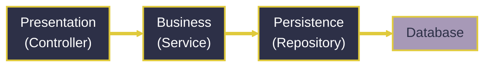
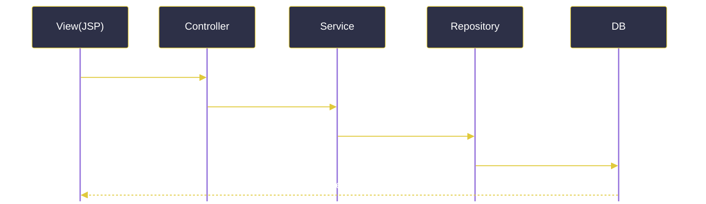
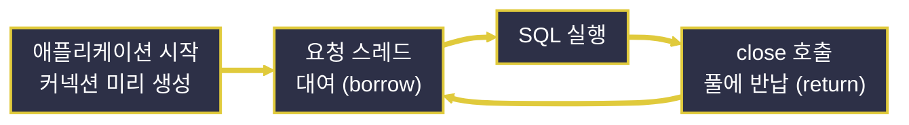

# Spring JDBC와 영속성

---
layout: default
---

# 학습 체크리스트 (1/2)

- [ ] 영속성(Persistence) 개념과 영속 계층의 분리 목적 이해
- [ ] DAO, Repository, DTO, VO, Entity 객체 패턴의 관점 차이 구분
- [ ] JDK 17의 Record를 활용한 불변 데이터 객체 선언 방법 습득
- [ ] MVC 패턴에서 Model의 책임과 관심사의 분리 원칙 파악
- [ ] Layered / Clean Architecture에서 영속 계층의 위치와 의존 방향 이해

---
layout: default
---

# 학습 체크리스트 (2/2)

- [ ] Spring JDBC의 JdbcTemplate과 RowMapper 활용 방법 습득
- [ ] View - Controller - Service - Repository 요청 처리 흐름 숙지
- [ ] 커넥션 풀 동작 원리와 application.properties 환경 구성 방법 습득
- [ ] 의존성 주입(DI)과 @Transactional 선언적 트랜잭션 처리 이해

---
layout: cover
class: text-center
---

# 영속성과 계층형 설계

---
layout: default
---

# 영속성 개념

> **영속성 (Persistence)**
>
> 프로그램이 종료되어 메모리의 데이터가 소멸되더라도, 파일 시스템이나 데이터베이스 등 비휘발성 저장소에 기록하여 데이터를 영구적으로 보존하는 성질

- **메모리의 휘발성 한계**:
  - 프로세스가 종료되면 변수와 객체 등 메모리상의 데이터는 모두 사라짐
- **비휘발성 저장소 기록**:
  - 데이터베이스에 저장(영속화)하여 재시작 이후에도 데이터를 유지
- **영속 계층 (Persistence Layer)**:
  - 데이터베이스 입출력(저장, 조회, 수정, 삭제)을 전담하도록 분리한 소프트웨어 계층
  - 비즈니스 로직과 데이터 접근 기술을 격리하여 유지보수성 확보

---
layout: default
---

# 데이터 접근 객체: DAO와 Repository

| 패턴 | 관점 | 핵심 역할 |
| :--- | :--- | :--- |
| **DAO** (Data Access Object) | 데이터베이스 중심 | DB(Database) 접근 로직을 캡슐화 |
| **Repository** | 도메인(객체) 중심 | 저장소를 컬렉션처럼 추상화하여 접근 |

- **같은 영속 계층, 다른 관점**:
  - DAO는 "어떤 SQL로 접근하는가", Repository는 "어떤 도메인 객체를 보관하는가"에 집중

---
layout: default
---

# 데이터 운반 객체: DTO · VO · Entity

| 패턴 | 관점 | 핵심 역할 |
| :--- | :--- | :--- |
| **DTO** (Data Transfer Object) | 계층 간 전달 | 로직 없는 데이터 운반 객체 |
| **VO** (Value Object) | 값 그 자체 | 불변 객체, 내부 값의 동등성으로 비교 |
| **Entity** | 테이블 대응 | 테이블 행(Row)과 1:1 매핑, 식별자(PK, Primary Key) 보유 |

- **역할별 분리 이유**:
  - 전달·값 표현·영속화라는 목적이 서로 달라 하나의 객체로 겸하면 책임이 뒤섞임

---
layout: default
---

# DTO · VO · Entity 구분 기준

| 구분 | 같음의 판단 기준 | 불변성 | 주 용도 |
| :--- | :--- | :--- | :--- |
| **DTO** | 식별 개념 없음 | 자유로움 | 계층 간 데이터 전달 |
| **VO** | 내부 값의 동등성 | 불변 필수 | 돈, 좌표, 주소 등 값 표현 |
| **Entity** | 식별자(PK) | 상태 변경 가능 | 테이블 행 표현, 영속화 대상 |

- **핵심 질문**: "이 객체는 무엇으로 같음을 판단하는가?"
  - 값이 모두 같아도 id가 다르면 다른 Entity, 값이 같으면 같은 VO

---
layout: default
---

# 계층 간 데이터를 나르는 DTO 클래스

```java
public class UserDto {
    private Long id;
    private String name;

    // 로직 없이 getter/setter만 보유
    public String getName() { return name; }
    public void setName(String name) { this.name = name; }
}
```

---
layout: default
---

# 레코드 (Record) 개념

> **레코드 (Record)**
>
> 불변 데이터 운반을 위해 필드 선언만으로 생성자, 조회 메서드, equals/hashCode, toString을 자동 생성해 주는 자바의 특수 클래스 — JDK(Java Development Kit) 16에서 도입, 17 LTS(Long-Term Support) 버전의 표준

- **보일러플레이트 제거**:
  - getter/setter, 생성자, equals/hashCode를 손으로 작성할 필요가 없음
- **불변성 기본 보장**:
  - 모든 필드가 `final`로 고정되어 생성 이후 값 변경이 불가능
- **DTO와 VO에 최적**:
  - 값 동등성 비교와 불변 전달 객체라는 요구사항을 문법 차원에서 충족

---
layout: default
---

# Record 한 줄로 압축한 DTO 선언

```java
// 클래스 버전과 동일한 역할을 한 줄로 선언
public record UserDto(Long id, String name) { }
```

```java
UserDto dto = new UserDto(101L, "홍길동");

String name = dto.name(); // getName()이 아닌 필드명 그대로 조회
```

---
layout: default
---

# Record VO의 값 동등성 비교

```java
public record Money(String currency, long amount) { }
```

```java
Money a = new Money("KRW", 1000L);
Money b = new Money("KRW", 1000L);

boolean same = a.equals(b); // true — 내부 값이 같으면 같은 값
```

---
layout: default
---

# 엔터티 (Entity) 개념

> **엔터티 (Entity)**
>
> 데이터베이스 테이블의 행(Row)과 1:1로 대응되며, 값이 아닌 식별자(PK)로 같음을 판단하는 영속화 대상 객체

- **식별자 기준 동등성**:
  - 이름과 이메일이 모두 같아도 id가 다르면 서로 다른 엔터티
- **상태 변경 가능**:
  - 조회 후 값을 수정하고 다시 저장하는 생명주기를 가지므로 일반 클래스로 작성
- **Record 부적합**:
  - Record는 불변이라 상태 변경이 필요한 Entity에는 적합하지 않음 (DTO/VO에 사용)

---
layout: default
---

# 테이블 행과 대응되는 User 엔터티

```java
public class User {
    private final Long id;  // 식별자(PK) — 변경 불가
    private String name;    // 상태 — 변경 가능

    public User(Long id, String name) {
        this.id = id;
        this.name = name;
    }
    public void changeName(String name) { this.name = name; }
}
```

---
layout: default
---

# Class와 Record의 선택 기준

| 상황 | 선택 | 이유 |
| :--- | :--- | :--- |
| **JPA Entity** | 클래스 강제 | 기본 생성자와 상태 변경(더티 체킹)이 필수 |
| **JSP/JSTL EL 표현식** | getter 클래스 | `${user.name}`이 `getName()` 규약을 탐색 |
| **REST API 요청/응답** | Record 편리 | JSON 직렬화 지원 + 불변으로 안전한 전달 |

- **판단 기준**: 사용하는 기술이 **JavaBeans 규약(getter/기본 생성자)을 요구하는가?**
  - 요구하면 클래스로 작성, 아니면 Record가 더 간결하고 안전
- **용어 풀이**: JPA(Jakarta Persistence API) · EL(Expression Language) · REST(Representational State Transfer) API · JSON(JavaScript Object Notation)

---
layout: default
---

# MVC 패턴에서의 Model

> **MVC 패턴 (Model-View-Controller)**
>
> 애플리케이션을 Model(데이터와 비즈니스 로직), View(화면 표현), Controller(요청 제어)로 분리하는 아키텍처 패턴

- **영속성은 Model의 책임**:
  - 데이터베이스 연동(영속화)은 Model 영역에서 담당
- **Model의 독립성**:
  - View나 Controller에 종속되지 않고 데이터 상태와 비즈니스 규칙을 처리
- **관심사의 분리 (SoC, Separation of Concerns)**:
  - 화면 로직과 데이터 로직을 분리하여 화면 변경이 데이터 처리 코드에 영향을 주지 않음
  - 재사용성과 테스트 용이성 향상

---
layout: default
---

# Layered Architecture의 단방향 의존



- **단방향 흐름 강제**: 상위 계층은 바로 아래 하위 계층에만 의존
- **책임 단위 수평 분할**: 각 계층이 자신의 역할에만 집중하는 전통적 구조

---
layout: default
---

# Clean Architecture와 의존성 역전

> **클린 아키텍처 (Clean Architecture)**
>
> 도메인(비즈니스 규칙)을 중심에 두고, 데이터베이스와 웹 프레임워크 등 세부 기술을 바깥 원에 배치하는 설계 구조

- **의존 방향의 역전**:
  - 의존성이 항상 바깥에서 안쪽(도메인)으로만 향하도록 설계
- **영속성은 세부사항 (Detail)**:
  - 데이터베이스 기술은 교체 가능한 바깥 원의 세부사항으로 취급
- **Layered와의 차이**:
  - 계층형은 위에서 아래로 의존, 클린은 바깥에서 중심(도메인)으로 의존

---
layout: cover
class: text-center
---

# Spring JDBC와 웹 요청 흐름

---
layout: default
---

# Spring JDBC 개요

> **Spring JDBC**
>
> 순수 JDBC(Java Database Connectivity)의 반복적인 보일러플레이트 코드를 스프링이 대신 처리해 주는 데이터 접근 기술

- **보일러플레이트 제거**:
  - 드라이버 로딩, 커넥션 획득/반납, 예외 처리를 프레임워크가 자동 수행
- **개발자의 집중 영역**:
  - SQL(Structured Query Language) 작성과 조회 결과의 객체 매핑에만 집중

---
layout: default
---

# JdbcTemplate과 RowMapper

- **JdbcTemplate**:
  - 커넥션 관리·Statement 생성·자원 반납을 템플릿 메서드 패턴으로 자동화한 핵심 클래스
  - `query()`, `queryForObject()`, `update()` 등의 메서드 제공
- **RowMapper**:
  - `ResultSet`의 각 행(Row)을 자바 객체(DTO)로 변환하는 매핑 규칙을 정의하는 함수형 인터페이스
  - 조회 결과의 객체화를 담당하며 람다식으로 간결하게 구현 가능

---
layout: default
---

# JdbcTemplate 조회와 RowMapper 매핑

```java
String sql = "SELECT id, name FROM users WHERE id = ?";

// RowMapper 람다가 한 행을 UserDto(record) 생성자로 변환
UserDto user = jdbcTemplate.queryForObject(sql,
    (rs, rowNum) -> new UserDto(
        rs.getLong("id"),
        rs.getString("name")
    ), 101);
```

---
layout: default
---

# 웹 계층 요청 처리 흐름



---
layout: default
---

# 계층별 어노테이션과 책임

| 계층 | 선언 | 핵심 책임 |
| :--- | :--- | :--- |
| **View** | JSP / JSTL | `<form>` 입력 전송, `<c:forEach>` 등으로 Model 출력 |
| **Controller** | `@Controller` | HTTP 요청 수신, 폼 파라미터를 DTO로 바인딩 |
| **Service** | `@Service` | 비즈니스 로직 전담, 트랜잭션 경계 설정 |
| **Repository** | `@Repository` | `JdbcTemplate`으로 실제 SQL 실행 |

- **협력 구조**: 사용자 입력이 데이터베이스까지 도달하고 결과가 다시 화면으로 반환
- **용어 풀이**: JSP(JavaServer Pages) · JSTL(JSP Standard Tag Library) · HTTP(HyperText Transfer Protocol)

---
layout: default
---

# 어노테이션 개념

> **어노테이션 (Annotation)**
>
> 클래스나 메서드에 `@` 기호로 부착하는 메타데이터 표식으로, 컴파일러나 프레임워크에게 해당 코드를 어떻게 처리할지 알려주는 문법

- **코드에 붙이는 설명 라벨**:
  - 코드 자체의 로직을 바꾸지 않고, "이 클래스는 이런 역할"이라는 정보를 부여
- **스프링의 활용 방식**:
  - 스프링이 어노테이션을 읽고 빈(Bean) 등록, 트랜잭션 처리 등 부가 기능을 자동 적용
- **컴포넌트 스캔 (Component Scan)**:
  - `@Component` 계열이 붙은 클래스를 찾아 스프링 컨테이너에 빈으로 자동 등록

---
layout: default
---

# 계층 어노테이션이 담고 있는 의미

| 어노테이션 | 의미 |
| :--- | :--- |
| `@Controller` | 웹 요청 창구 빈으로 등록, View 반환을 담당한다는 표식 |
| `@Service` | 비즈니스 로직 계층임을 알리는 역할 명시 표식 |
| `@Repository` | 영속 계층 표식 + DB 예외를 스프링 공통 예외로 자동 변환 |
| `@Transactional` | 메서드를 트랜잭션 경계로 감싸 커밋/롤백을 자동 처리 |

- **스테레오타입 (Stereotype) 어노테이션**:
  - `@Controller`/`@Service`/`@Repository`는 모두 `@Component`의 계층별 특화 버전

---
layout: default
---

# 클라우드 데이터베이스 활용 (DBaaS)

| 서비스 | DBMS | 특징 |
| :--- | :--- | :--- |
| **Aiven** | MySQL | 무료 티어 제공, 호스트/포트/계정을 JDBC URL(Uniform Resource Locator)로 조합 |
| **Neon** | PostgreSQL | 서버리스, 접속 문자열 한 줄 연결, 사용량 기반 자동 확장 |

- **DBaaS (Database as a Service)**:
  - 로컬 설치 없이 클라우드 데이터베이스를 프로비저닝하여 원격 접속으로 실습
- **DBMS (Database Management System)**:
  - MySQL, PostgreSQL 같은 데이터베이스 관리 시스템을 관리형 서비스로 제공받음
- **접속 정보 보안**:
  - 자격 증명의 소스코드 하드코딩을 배제하고 환경 변수나 외부 설정으로 주입

---
layout: cover
class: text-center
---

# Spring JDBC 환경 구성

---
layout: default
---

# 커넥션 풀 개념

> **커넥션 풀 (Connection Pool)**
>
> 애플리케이션 시작 시점에 데이터베이스 커넥션을 미리 여러 개 생성해 풀에 보관하고, 빌려주고 반납받으며 재사용하는 기법

- **고비용 작업 제거**:
  - 매 요청마다 커넥션을 새로 생성/소멸하는 TCP(Transmission Control Protocol) 연결 및 인증 비용을 제거
- **대여와 반납**:
  - 요청 스레드가 유휴 커넥션을 대여(borrow)하고, close 시 연결을 끊지 않고 풀에 반납(return)
- **DataSource**:
  - 커넥션 획득 방법을 추상화한 표준 인터페이스로, `DriverManager` 대신 사용

---
layout: default
---

# 커넥션 대여와 반납 사이클



- **HikariCP**: Spring Boot가 기본 채택한 초경량 고성능 커넥션 풀 구현체

---
layout: default
---

# application.properties 설정

> **application.properties**
>
> Spring Boot 애플리케이션의 설정 값(데이터소스, 포트, 로깅 등)을 코드 밖에서 선언적으로 관리하는 중앙 구성 파일

- **자동 구성 (Auto-Configuration)**:
  - 데이터소스 항목을 등록하면 Spring Boot가 커넥션 풀과 `DataSource` 빈을 자동 생성
- **환경 변수 참조**:
  - `${DB_URL}` 같은 플레이스홀더 문법으로 OS(Operating System) 환경 변수 값을 주입받아 민감 정보 노출 차단
- **풀 크기 조정**:
  - `spring.datasource.hikari.maximum-pool-size` 등으로 풀 크기와 타임아웃 제어

---
layout: default
---

# 데이터소스와 환경 변수 주입 선언

```properties
spring.datasource.url=${DB_URL}
spring.datasource.username=${DB_USER}
spring.datasource.password=${DB_PASSWORD}
spring.datasource.driver-class-name=com.mysql.cj.jdbc.Driver

spring.datasource.hikari.maximum-pool-size=10
```

---
layout: default
---

# 의존성 주입 (DI)

> **의존성 주입 (Dependency Injection)**
>
> 객체가 필요로 하는 의존 객체를 내부에서 직접 생성하지 않고, 외부의 스프링 IoC(Inversion of Control, 제어의 역전) 컨테이너가 대신 생성하여 주입해 주는 기법

- **생성자 주입 (권장)**:
  - 의존 객체를 생성자 매개변수로 전달받아 `final` 필드로 불변성을 보장
- **계층 자동 조립**:
  - Controller → Service → Repository → `JdbcTemplate` 순으로 스프링 컨테이너가 결합
- **낮은 결합도**:
  - 구현체 교체가 용이하고, 테스트 시 가짜 객체(Mock) 주입으로 단위 테스트가 수월

---
layout: default
---

# 생성자 주입 기반 Repository 조립

```java
@Repository
public class UserRepository {
    private final JdbcTemplate jdbcTemplate; // final로 불변 보장

    // 스프링 컨테이너가 JdbcTemplate을 대신 생성하여 주입
    public UserRepository(JdbcTemplate jdbcTemplate) {
        this.jdbcTemplate = jdbcTemplate;
    }
}
```

---
layout: default
---

# 트랜잭션 개념

> **트랜잭션 (Transaction)**
>
> 데이터베이스의 상태를 변화시키는 논리적으로 분리할 수 없는 작업의 최소 단위로, 전부 성공(Commit)하거나 전부 취소(Rollback)되어야 하는 원자적 작업 묶음

- **전부 아니면 전무**:
  - 여러 SQL이 반드시 함께 성공해야 하는 업무를 하나의 단위로 묶음
- **대표 사례**:
  - 계좌 이체(출금 + 입금), 주문 처리(주문 생성 + 재고 차감)의 데이터 정합성 보장
- **커밋과 롤백**:
  - 정상 완료 시 커밋으로 확정, 중간 실패 시 롤백으로 전체 취소

---
layout: default
---

# 트랜잭션 ACID 4대 원칙

| 성질 | 의미 |
| :--- | :--- |
| **원자성 (Atomicity)** | 전부 성공하거나 전부 취소 (전부 아니면 전무) |
| **일관성 (Consistency)** | 트랜잭션 전후로 무결성 규칙 유지 |
| **격리성 (Isolation)** | 동시 실행 트랜잭션 간 간섭 차단 |
| **지속성 (Durability)** | 커밋된 결과는 영구적으로 보존 |

---
layout: default
---

# @Transactional 계좌 이체 서비스

```java
@Service
public class TransferService {
    @Transactional // 시작 시 트랜잭션 개시
    public void transfer(Long from, Long to, int amount) {
        accountRepository.withdraw(from, amount); // 출금
        accountRepository.deposit(to, amount);    // 입금
    } // 정상 종료 시 커밋, 런타임 예외 시 롤백
}
```

---
layout: default
---

# 학습 요약 (Summary)

- **영속성과 데이터 객체 설계**:
  - 영속 계층은 DAO/Repository로 격리하고, DTO/VO는 Record(JDK 17)로, 상태가 변하는 Entity는 클래스로 작성
- **Spring JDBC**:
  - `JdbcTemplate`이 보일러플레이트를 자동화하고, `RowMapper`가 조회 결과를 자바 객체로 매핑
- **환경 구성**:
  - 커넥션 풀(HikariCP)과 `application.properties`의 환경 변수 참조로 성능과 보안을 동시 확보
- **DI와 트랜잭션**:
  - 생성자 주입으로 계층을 조립하고, `@Transactional`로 커밋/롤백을 선언적으로 처리
