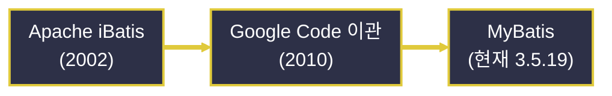
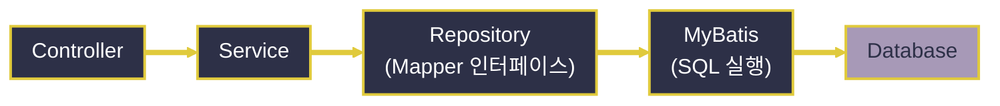

# MyBatis와 SQL Mapper

---
layout: default
---

# 학습 체크리스트 (1/2)

- [ ] MyBatis의 개념과 SQL Mapper로서의 정체성 이해
- [ ] iBatis에서 MyBatis로 이어지는 계보와 ORM·Query Builder와의 차이 구분
- [ ] Spring Boot 프로젝트에 mybatis-spring-boot-starter 설정 방법 습득
- [ ] 애노테이션 기반과 XML 기반 Mapper 작성 방식의 차이 파악

---
layout: default
---

# 학습 체크리스트 (2/2)

- [ ] 파라미터 바인딩(`#{}`)과 `useGeneratedKeys`를 통한 DML 매핑 이해
- [ ] `resultType`과 `resultMap`을 통한 조회 결과 매핑 방식 습득
- [ ] Record와 클래스 중 매핑 대상 객체 선택 기준 파악
- [ ] 영속 계층에서의 MyBatis 위치와 JPA 대비 트레이드오프 이해

---
layout: cover
class: text-center
---

# MyBatis 개념과 등장 배경

---
layout: default
---

# MyBatis란 무엇인가

> **마이바티스 (MyBatis)**
>
> 자바 객체와 SQL 문 사이의 수동 매핑 작업을 XML 서술자나 애노테이션을 통해 자동화해 주는 퍼시스턴스(Persistence) 프레임워크

- **핵심 철학**:
  - 원시 JDBC의 반복적인 파라미터 바인딩과 ResultSet 매핑 코드는 제거
  - SQL 문 자체는 개발자가 직접 작성하고 제어
- **자동화 범위의 절제**:
  - SQL을 대신 만들어주지 않고, 실행과 결과 변환만 자동화

---
layout: default
---

# iBatis에서 MyBatis로

- **아파치(Apache) 프로젝트로 출발**:
  - 2002년 iBatis라는 이름으로 아파치 산하에서 시작
- **구글 코드(Google Code) 이관**:
  - 2010년 이관되며 MyBatis라는 이름으로 재탄생
- **후속 계보의 단일화**:
  - 아파치 iBatis는 이후 유지보수 종료(EOL)
  - 2026년 7월 현재 MyBatis가 사실상 유일한 정식 후속 계보로 활발히 개발 중 (코어 최신 안정 버전 3.5.19)

---
layout: default
---

# MyBatis 계보 흐름



---
layout: default
---

# SQL Mapper라는 기술 범주

> **SQL 매퍼 (SQL Mapper)**
>
> 자바 메서드 호출을 특정 SQL 문 하나에 1:1로 대응(매핑)시키는 퍼시스턴스 계층 기술 범주

- **개발자가 SQL을 직접 관리**:
  - SQL 구문 자체는 개발자가 작성하고 통제
- **프레임워크가 대신하는 부분**:
  - 파라미터 바인딩과 결과 객체 변환이라는 반복 작업만 자동화

---
layout: default
---

# ORM과의 차이 (Hibernate/JPA 대비)

- **ORM (Object-Relational Mapping)**:
  - 객체 모델과 관계형 테이블을 프레임워크가 자동으로 SQL까지 생성하여 매핑
- **MyBatis의 위치**:
  - SQL을 자동 생성하지 않고, 개발자가 명시적으로 작성한 SQL의 실행과 결과 매핑만 지원
  - '세미(Semi) ORM' 내지 SQL Mapper로 분류

---
layout: default
---

# Query Builder와의 비교

- **QueryDSL 등 Query Builder**:
  - 자바 코드(메서드 체이닝)로 타입 세이프하게 쿼리를 조립
- **MyBatis의 차별점**:
  - SQL 문자열(또는 XML)을 그대로 다루므로 복잡한 조인이나 DB 벤더 특화 문법을 자유롭게 구사 가능

---
layout: default
---

# 퍼시스턴스 기술 3분류 비교

| 기술 | SQL 생성 주체 | 특징 |
| :--- | :--- | :--- |
| **ORM** (JPA/Hibernate) | 프레임워크 자동 생성 | 객체-테이블 자동 매핑 |
| **SQL Mapper** (MyBatis) | 개발자 직접 작성 | 파라미터 바인딩·결과 매핑만 자동화 |
| **Query Builder** (QueryDSL) | 코드로 조립 | 메서드 체이닝 기반 타입 세이프 |

- **판단 기준**: SQL을 누가 얼마나 직접 통제하는지가 세 기술을 가르는 축

---
layout: cover
class: text-center
---

# Spring Boot 프로젝트에서 MyBatis 설정

---
layout: default
---

# mybatis-spring-boot-starter

> **mybatis-spring-boot-starter**
>
> MyBatis를 스프링 부트의 자동 구성(Auto-Configuration) 메커니즘에 통합하여, `SqlSessionFactory`와 Mapper 빈 등록을 자동화해 주는 공식 스타터 라이브러리

- **의존성 버전 (Spring Boot 4.0.7 기준)**:
  - `mybatis-spring-boot-starter` 4.0.1 (MyBatis-Spring 4.0, 코어 3.5.19, Java 17+ 기반)
  - 상위 4.1.0은 아직 정식 활성화 전인 Spring Boot 4.1 대상이라 실습에서는 4.0.1 사용

---
layout: default
---

# Maven MyBatis 스타터 의존성 선언

```xml
<!-- Source: https://mvnrepository.com/artifact/org.mybatis.spring.boot/mybatis-spring-boot-starter -->
<dependency>
    <groupId>org.mybatis.spring.boot</groupId>
    <artifactId>mybatis-spring-boot-starter</artifactId>
    <version>4.0.1</version>
</dependency>
```

---
layout: default
---

# application.properties 설정 항목

- **`mybatis.mapper-locations`**:
  - XML 매퍼 파일 위치를 클래스패스 패턴으로 지정
- **`mybatis.type-aliases-package`**:
  - `resultType`에 쓸 패키지 별칭을 등록
- **`mybatis.configuration.map-underscore-to-camel-case`**:
  - DB의 스네이크 케이스 컬럼명(`user_id`)과 자바 카멜 케이스 필드명(`userId`)을 자동 변환

---
layout: default
---

# MyBatis 설정 프로퍼티 선언

```properties
mybatis.mapper-locations=classpath:mappers/**/*.xml
mybatis.type-aliases-package=com.example.dto
mybatis.configuration.map-underscore-to-camel-case=true
```

---
layout: default
---

# DataSource 연계

- **동일한 DataSource 재사용**:
  - MyBatis는 Spring JDBC와 마찬가지로 `spring.datasource.*` 설정(HikariCP 커넥션 풀 포함)을 그대로 재사용
- **자동 결합**:
  - 별도의 `SqlSessionFactory` 설정 없이도 스프링 부트가 두 기술을 동일한 `DataSource` 위에서 동작하도록 자동 결합

---
layout: default
---

# 스프링 프로파일을 통한 환경 분리

> **프로파일 (Profile)**
>
> 개발(dev), 테스트, 운영(prod) 등 실행 환경별로 서로 다른 설정값을 분리 관리하기 위한 스프링의 환경 프로파일링 기능

- **`application-dev.properties`**:
  - 기본 설정과 별도로 `application-{profile}.properties` 명명 규칙 파일에 개발 전용 DB 접속 정보나 SQL 로깅 레벨을 격리
- **프로파일 활성화**:
  - `spring.profiles.active=dev` 또는 VM 옵션(`-Dspring.profiles.active=dev`)으로 지정

---
layout: cover
class: text-center
---

# Mapper 작성 방식: 애노테이션 vs XML

---
layout: default
---

# 애노테이션 기반 Mapper

> **애노테이션 기반 Mapper**
>
> `@Select`, `@Insert`, `@Update`, `@Delete` 등의 애노테이션을 인터페이스 메서드 위에 직접 부착하여 SQL을 자바 코드 내부에 인라인으로 선언하는 매핑 방식

- **장점**: 파일 이동 없이 SQL을 한눈에 확인 가능, 단순 CRUD에 빠르고 직관적
- **한계**: SQL이 길어지거나 동적 조건이 늘어나면 문자열 이어붙이기로 가독성이 급격히 저하

---
layout: default
---

# @Select 애노테이션 인라인 SQL

```java
@Mapper
public interface UserMapper {
    @Select("SELECT * FROM users WHERE id = #{id}")
    User findById(Long id);
}
```

---
layout: default
---

# Interface + XML 기반 Mapper

> **Interface + XML 기반 Mapper**
>
> 자바 인터페이스는 메서드 시그니처(계약)만 선언하고, 실제 SQL 문은 별도의 XML 파일에 태그로 분리 작성한 뒤 네임스페이스로 연결하는 방식

- **관심사 분리**: SQL과 자바 코드가 물리적으로 분리되어 각각 관리
- **복잡한 동적 SQL에 적합**: `<if>`, `<choose>`, `<foreach>` 등 동적 태그 활용 가능 (심화 과정에서 다룸)

---
layout: default
---

# XML 매퍼의 select 태그 선언

```xml
<!-- resources/mappers/UserMapper.xml -->
<mapper namespace="com.example.mapper.UserMapper">
    <select id="findById" resultType="com.example.dto.User">
        SELECT * FROM users WHERE id = #{id}
    </select>
</mapper>
```

---
layout: default
---

# namespace와 id 매칭 규칙

- **namespace**:
  - XML의 `namespace`는 대응하는 Mapper 인터페이스의 완전한 클래스 경로와 일치해야 함
- **id**:
  - `<select id="...">`의 id 값이 인터페이스 메서드명과 동일해야 스프링이 둘을 자동으로 바인딩

---
layout: default
---

# 실무에서의 혼합 사용

- **단순/복잡 SQL의 병행**:
  - 단건 조회처럼 단순한 SQL은 애노테이션으로 작성
  - 조인이나 동적 조건이 얽힌 복잡한 SQL은 XML로 작성
- **선택 기준**:
  - SQL 한 줄로 표현 가능한지, 동적 조건 분기가 필요한지를 기준으로 팀 컨벤션에 맞게 구분

---
layout: default
---

# 애노테이션 vs XML 선택 기준

| 구분 | 애노테이션 기반 | XML 기반 |
| :--- | :--- | :--- |
| **SQL 위치** | 인터페이스 메서드 위 | 별도 XML 파일 |
| **적합한 상황** | 단순 CRUD | 조인·동적 조건이 많은 SQL |
| **가독성** | SQL이 길어지면 저하 | 길어도 유지보수 용이 |

---
layout: cover
class: text-center
---

# CRUD & Mapping (조인 없는 단순 매핑)

---
layout: default
---

# DML 매핑 개념

> **DML(Data Manipulation Language) 매핑**
>
> `<insert>`, `<update>`, `<delete>` 태그(또는 `@Insert`/`@Update`/`@Delete`)를 통해 데이터 변경 SQL을 실행하고, 영향받은 행(row) 수를 반환받는 매핑 방식

- **`#{필드명}` 파라미터 바인딩**:
  - 자바 객체(DTO)나 Map의 필드값을 `PreparedStatement`의 `?` 위치홀더로 안전하게 바인딩
  - JDBC와 동일하게 SQL Injection을 원천 차단

---
layout: default
---

# useGeneratedKeys로 PK 자동 채움

- **`useGeneratedKeys="true"`**:
  - DB가 자동 생성한 PK(AUTO_INCREMENT 등)를 삽입 직후 반환받도록 지정
- **`keyProperty`**:
  - 반환된 PK 값을 채워 넣을 자바 객체의 필드명을 지정

---
layout: default
---

# INSERT와 자동 생성 키 매핑

```xml
<insert id="save" useGeneratedKeys="true" keyProperty="id">
    INSERT INTO users (name) VALUES (#{name})
</insert>
```

---
layout: default
---

# resultType 개념

> **resultType**
>
> SELECT 결과의 각 행(row)을 지정된 자바 클래스나 기본 타입에 자동으로 매핑하되, 컬럼명과 필드명이 일치(또는 자동 변환)해야 하는 가장 단순한 결과 매핑 방식

- **적용 조건**:
  - 별도의 매핑 규칙 선언 없이 이름 매칭만으로 충분한, 조인이 없는 단일 테이블 조회에 주로 사용

---
layout: default
---

# resultType 기반 목록 조회

```xml
<select id="findAll" resultType="com.example.dto.User">
    SELECT id, user_name FROM users
</select>
```

---
layout: default
---

# resultMap 개념

> **resultMap**
>
> 컬럼명과 필드명이 불일치하거나 복잡한 매핑 규칙이 필요할 때, 컬럼-필드 대응 관계를 명시적으로 선언하는 방식

- **resultType과의 차이**:
  - resultType은 암묵적(이름 매칭) 자동 매핑
  - resultMap은 매핑 규칙을 재사용 가능한 별도 객체로 명시 선언

---
layout: default
---

# resultMap 컬럼-필드 대응 선언

```xml
<resultMap id="userMap" type="com.example.dto.User">
    <id property="id" column="user_id"/>
    <result property="userName" column="u_name"/>
</resultMap>
```

---
layout: default
---

# resultType vs resultMap

| 구분 | resultType | resultMap |
| :--- | :--- | :--- |
| **매핑 방식** | 이름 매칭 (암묵적) | 컬럼-필드 명시 선언 |
| **적합한 상황** | 컬럼명=필드명 일치 | 컬럼명 불일치·별칭 |
| **재사용성** | 불가 | `<resultMap>`으로 재사용 가능 |

---
layout: default
---

# 매핑 대상 객체: 클래스 vs Record

- **클래스 기반 매핑**:
  - 기본 생성자와 Setter가 필요한 전통적 방식, 리플렉션으로 필드에 값을 채움
- **Record 기반 매핑**:
  - MyBatis 3.5.6+부터 생성자 파라미터 이름 기준 자동 매핑 지원
  - 불변 객체를 그대로 결과 타입으로 사용 가능 (컴파일 시 `-parameters` 옵션 필요)

---
layout: default
---

# Record를 결과 타입으로 사용

```java
record User(Long id, String userName) { }
```

---
layout: cover
class: text-center
---

# 시스템 아키텍처 속의 MyBatis

---
layout: default
---

# 영속 계층(Repository)에서의 위치

- **원칙**:
  - MVC, Layered, Clean Architecture 등 어떤 구조든 MyBatis Mapper는 항상 Repository(영속 계층)에 위치
  - Service 계층에는 SQL의 존재 자체를 노출하지 않음
- **계층 간 흐름**:
  - Service는 Mapper 인터페이스의 시그니처만 알 뿐 내부 SQL 구현에는 관여하지 않음

---
layout: default
---

# 요청 처리 흐름 속 MyBatis 위치



---
layout: default
---

# MyBatis의 한계

- **DB 벤더별 파편화**:
  - MySQL, PostgreSQL 등 제품마다 SQL 문법 차이(페이징, 함수 등)가 존재
  - MyBatis는 이를 자동 흡수해주지 않아 벤더별로 SQL을 별도 작성/관리해야 함

---
layout: default
---

# Hibernate/JPA 성능 한계 보완

- **JPA(Hibernate)의 까다로운 지점**:
  - N+1 문제, 복잡한 동적 조회, 대량 배치 처리 등에서 성능 튜닝이 어려움
- **MyBatis의 이점**:
  - SQL을 직접 제어하므로 이런 상황에서 명시적이고 예측 가능한 최적화가 가능
  - JPA+QueryDSL vs MyBatis 조합은 실무에서 여전히 계속되는 논쟁거리

---
layout: default
---

# 상호 대체가 아닌 상황별 선택

| 구분 | JPA/Hibernate | MyBatis |
| :--- | :--- | :--- |
| **SQL 제어** | 자동 생성 (제한적 제어) | 직접 작성 (완전한 제어) |
| **진입 장벽** | 학습 곡선 있음 | SQL만 알면 빠르게 습득 |
| **적합 상황** | 간단한 CRUD, 생산성 우선 | 복잡한 조인, 벤더 특화 최적화 |

- **본 과정의 방향**: 진입 장벽 대비 안정적인 생산성(저점)이 보장되는 JPA를 기준으로 우선 진행

---
layout: default
---

# 학습 요약 (Summary)

- **MyBatis의 정체성**:
  - iBatis 계보를 잇는 SQL Mapper로, SQL은 개발자가 작성하고 바인딩·매핑만 자동화
- **Spring Boot 설정**:
  - `mybatis-spring-boot-starter`가 동일한 `DataSource` 위에서 `SqlSessionFactory`와 Mapper 빈을 자동 결합
- **Mapper 작성과 CRUD 매핑**:
  - 단순 SQL은 애노테이션, 복잡한 SQL은 XML로 작성하며, `resultType`/`resultMap`으로 조회 결과를 매핑
- **아키텍처 속 위치**:
  - Repository 계층에 격리되어 Service의 SQL 노출을 차단하고, JPA와는 상황별로 선택하는 관계
