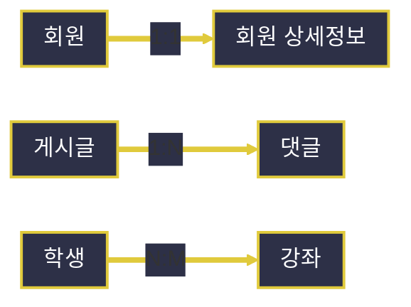
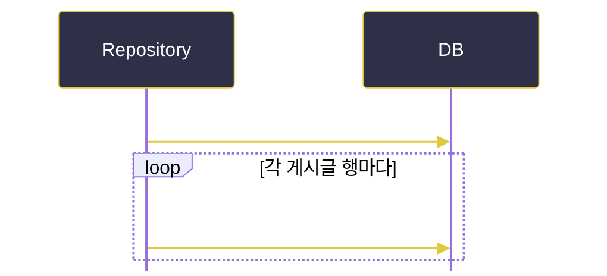

# MyBatis 동적 SQL과 연관관계 매핑

---
layout: default
---

# 학습 체크리스트 (1/2)

- [ ] 동적 SQL이 필요한 이유와 OGNL 표현식 기반 조건 평가 이해
- [ ] `<if>`, `<where>`, `<set>` 태그를 활용한 조건부 SQL 조립 방법 습득
- [ ] `<choose>`/`<when>`/`<otherwise>`의 배타적 분기 동작 파악
- [ ] `<foreach>`를 활용한 IN 절 및 컬렉션 순회 SQL 생성 기법 습득

---
layout: default
---

# 학습 체크리스트 (2/2)

- [ ] 관계형 데이터베이스의 1:1, 1:N, N:M 연관관계 유형 구분
- [ ] association과 collection을 통한 조인 결과 중첩 매핑 방법 이해
- [ ] N:M 관계에서 중개 테이블을 활용한 매핑 전략 파악
- [ ] Nested Results와 Nested Select 방식의 트레이드오프 이해

---
layout: cover
class: text-center
---

# 동적 SQL(Dynamic SQL)이 필요한 이유

---
layout: default
---

# 동적 SQL 개념

> **동적 SQL (Dynamic SQL)**
>
> 검색 조건의 유무나 개수가 요청마다 달라지는 상황에서, 문자열 이어붙이기 없이 XML 태그만으로 SQL 문의 구조를 조건부로 조립하는 MyBatis의 핵심 기능

- **정적 SQL의 한계**:
  - 조건 조합이 늘어날 때마다 쿼리를 따로 만들거나 문자열을 이어붙여야 함
  - 오타·SQL Injection 위험과 유지보수 부담 증가

---
layout: default
---

# OGNL 표현식 기반 조건 평가

- **OGNL (Object-Graph Navigation Language)**:
  - 동적 태그의 조건문(`test="..."`)이 파라미터 객체의 필드 값을 평가하는 표현식 언어
- **친숙한 문법**:
  - `null` 체크와 값 비교를 자바와 유사한 문법으로 작성

---
layout: cover
class: text-center
---

# 대표적 동적 SQL 태그

---
layout: default
---

# `<if>` 조건부 SQL 포함

> **`<if>`**
>
> 지정한 `test` 조건식이 참(true)일 때만 내부의 SQL 조각을 쿼리에 포함시키는 가장 기본적인 조건부 태그

- **`WHERE 1=1`의 한계**:
  - 조건이 없을 때 구문 오류를 막는 임시방편이나, 불필요한 상수 조건이 실행계획에 섞이는 비권장 패턴

---
layout: default
---

# `<if>`를 이용한 조건 분기

```xml
<select id="findUsers" resultType="User">
    SELECT * FROM users
    WHERE 1=1
    <if test="name != null">AND name = #{name}</if>
</select>
```

---
layout: default
---

# `<where>` 지능형 조건 조립

> **`<where>`**
>
> 내부 동적 조건 중 하나라도 결과 문자열을 생성하면 자동으로 `WHERE`를 붙이고, 맨 앞의 불필요한 `AND`/`OR`는 스스로 제거하는 태그

- **조건이 없는 경우**:
  - 모든 `<if>`가 거짓이면 `WHERE` 절 자체가 생략되어 전체 목록 조회로 자연스럽게 변환

---
layout: default
---

# `<where>`로 대체한 조건 조립

```xml
<select id="findUsers" resultType="User">
    SELECT * FROM users
    <where>
        <if test="name != null">AND name = #{name}</if>
    </where>
</select>
```

---
layout: default
---

# `<set>` 부분 수정 조립

> **`<set>`**
>
> `UPDATE` 문에서 실제로 값이 전달된 컬럼만 골라 `SET` 절을 구성하고, 마지막 항목 뒤 불필요한 콤마를 자동 제거하는 태그

- **부분 수정 (Partial Update)**:
  - 전달되지 않은(null) 필드는 SET 절에서 자동 제외되어 기존 값을 그대로 보존

---
layout: default
---

# `<set>`을 이용한 UPDATE 조립

```xml
<update id="updateUser">
    UPDATE users
    <set>
        <if test="name != null">name = #{name},</if>
    </set>
    WHERE id = #{id}
</update>
```

---
layout: default
---

# `<choose>` / `<when>` / `<otherwise>`

> **`<choose>`**
>
> 자바의 `switch-case`처럼 여러 조건 중 가장 먼저 참이 되는 하나의 분기만 선택하는 배타적 조건 태그

- **동작 방식**:
  - `<when>`을 순서대로 평가하다 하나라도 참이면 즉시 멈추고, 모두 거짓이면 `<otherwise>` 적용
  - 모든 `<if>`가 독립적으로 중복 적용되는 것과의 결정적 차이

---
layout: default
---

# 배타적 분기 SQL 조각 선택

```xml
<choose>
    <when test="type == 'A'">AND type = 'A'</when>
    <otherwise>AND type = 'B'</otherwise>
</choose>
```

---
layout: default
---

# `<foreach>` 컬렉션 순회

> **`<foreach>`**
>
> 배열, 리스트, 맵 등 컬렉션 파라미터를 순회하며 SQL 조각을 반복 생성하는 태그로, `IN` 절이나 다건(batch) INSERT에 필수

- **속성 구성**:
  - `collection`(순회 대상), `item`(원소 변수명)
  - `open`/`close`(전체 감싸는 문자), `separator`(원소 구분자)

---
layout: default
---

# `<foreach>`로 IN 절 동적 생성

```xml
<select id="findByIds" resultType="User">
    SELECT * FROM users WHERE id IN
    <foreach item="id" collection="list" open="(" separator="," close=")">
        #{id}
    </foreach>
</select>
```

---
layout: default
---

# `<trim>`, `<bind>` 세부 튜닝

- **`<trim>`**:
  - `<where>`/`<set>`이 처리하는 접두/접미 문자 제거를 더 세밀하게 커스터마이징
- **`<bind>`**:
  - 반복 계산되는 표현식(예: `LIKE` 검색용 `'%' + 검색어 + '%'`)을 변수로 미리 선언해 재사용

---
layout: default
---

# 동적 SQL 태그 요약

| 태그 | 역할 |
| :--- | :--- |
| `<if>` | 조건이 참일 때만 SQL 조각 포함 |
| `<where>` | 조건 결과에 따라 `WHERE`/`AND` 자동 처리 |
| `<set>` | 값이 있는 컬럼만 `SET` 절에 포함, 콤마 자동 제거 |
| `<foreach>` | 컬렉션을 순회하며 SQL 조각 반복 생성 |

---
layout: cover
class: text-center
---

# JOIN과 연관관계(Relationship) 매핑

---
layout: default
---

# 관계형 데이터베이스의 연관관계 유형

- **1:1 (일대일)**:
  - 한 레코드가 다른 테이블의 정확히 하나의 레코드와만 대응 (예: 회원 - 회원 상세정보)
- **1:N (일대다)**:
  - 한 레코드가 다른 테이블의 여러 레코드와 대응, FK는 항상 '다(N)' 쪽이 보유 (예: 게시글 - 댓글)
- **N:M (다대다)**:
  - 양쪽 모두 서로 여러 레코드와 대응 가능 (예: 학생 - 강좌)

---
layout: default
---

# 연관관계 유형 한눈에 보기



---
layout: default
---

# N:M 관계와 중개 테이블

- **직접 표현 불가**:
  - 관계형 DB는 N:M을 직접 표현할 수 없음
- **중개 테이블(Junction Table)로 분해**:
  - 두 테이블의 PK를 각각 FK로 보유하는 중개 테이블을 매개로 두 개의 1:N 관계로 분해 (예: 학생 - 수강신청 - 강좌)

---
layout: default
---

# N:M을 두 개의 1:N으로 분해


---
layout: default
---

# association: 단일 객체 연관관계

> **association**
>
> 조인 결과에서 '1'에 해당하는 연관 객체 하나를 현재 결과 객체의 필드로 중첩 매핑하는 `<resultMap>` 하위 태그

- **적용 대상**:
  - 1:1 관계, 또는 N:1 관계에서 '1' 쪽(예: 주문이 소속된 회원 한 명)을 표현할 때 사용

---
layout: default
---

# association으로 단일 회원 중첩

```xml
<resultMap id="orderMap" type="Order">
    <id property="id" column="order_id"/>
    <association property="user" javaType="User">
        <id property="id" column="user_id"/>
    </association>
</resultMap>
```

---
layout: default
---

# collection: 다건 리스트 연관관계

> **collection**
>
> 조인 결과에서 '다(N)'에 해당하는 연관 객체들을 리스트 필드로 중첩 매핑하는 `<resultMap>` 하위 태그

- **`ofType` 속성**:
  - 리스트 자체의 타입(`javaType`, 보통 `List`) 대신, 리스트 내부 원소의 타입을 `ofType`으로 지정한다는 점이 `association`의 `javaType`과 다름

---
layout: default
---

# collection으로 댓글 리스트 중첩

```xml
<resultMap id="boardMap" type="Board">
    <id property="id" column="board_id"/>
    <collection property="comments" ofType="Comment">
        <id property="id" column="comment_id"/>
    </collection>
</resultMap>
```

---
layout: default
---

# collection을 활용한 N:M 매핑

- **중개 테이블 은닉**:
  - 중개 테이블을 통해 조인한 뒤, 최종 목적 테이블의 컬럼까지 `<collection>` 내부에 매핑
  - 중개 테이블의 존재를 자바 객체 구조에서는 감춘 채 N:M 관계를 자연스럽게 표현

---
layout: default
---

# association vs collection

| 구분 | association | collection |
| :--- | :--- | :--- |
| **대응 관계** | 1:1, N:1 (단일 객체) | 1:N (리스트) |
| **타입 지정** | `javaType` | `ofType` |
| **결과 필드** | 단일 객체 | List |

---
layout: default
---

# 중첩 매핑 방식의 두 전략

> **Nested Results vs Nested Select**
>
> 연관 데이터를 가져오는 두 가지 전략으로, 성능과 SQL 실행 횟수에서 뚜렷한 트레이드오프 존재

- **Nested Results**: 하나의 JOIN 쿼리 결과를 `resultMap`이 한 번에 분해
- **Nested Select**: `select` 속성에 별도 쿼리 id를 지정해 행마다 추가 쿼리 실행

---
layout: default
---

# Nested Results (단일 조인 쿼리)

- **DB 왕복 1회**:
  - 하나의 JOIN 쿼리 결과를 `resultMap`이 한 번에 분해하여 매핑
- **중복 조회 특성**:
  - 1:N 조인 시 '1' 쪽 데이터가 N번 중복 조회됨

---
layout: default
---

# Nested Select (N+1 방식)

- **단순한 SQL**:
  - 메인 쿼리 조회 후, 연관 데이터를 위한 추가 쿼리를 각 행마다 실행
- **N+1 문제 유발**:
  - 대표적인 N+1 문제를 유발할 수 있어 대량 데이터에는 주의 필요

---
layout: default
---

# Nested Select의 N+1 실행 흐름



---
layout: default
---

# Nested Results vs Nested Select

| 구분 | Nested Results | Nested Select |
| :--- | :--- | :--- |
| **쿼리 실행 횟수** | 1회 (단일 JOIN) | N+1회 (행마다 추가 쿼리) |
| **SQL 복잡도** | JOIN으로 복잡 | 단순 |
| **주의점** | '1' 쪽 데이터 중복 조회 | 대량 데이터 시 성능 저하 |

---
layout: default
---

# 학습 요약 (Summary)

- **동적 SQL의 필요성**:
  - 조건 조합이 가변적인 요청에서 문자열 이어붙이기 없이 OGNL 기반 태그로 SQL 구조를 조립
- **대표 태그 활용**:
  - `<if>`/`<where>`/`<set>`은 조건부 조립, `<choose>`는 배타적 분기, `<foreach>`는 컬렉션 순회
- **연관관계 유형과 매핑**:
  - 1:1·1:N은 association/collection으로, N:M은 중개 테이블을 거쳐 collection으로 매핑
- **중첩 매핑 전략 선택**:
  - Nested Results는 단일 쿼리지만 중복 조회, Nested Select는 단순하지만 N+1 문제 유의
