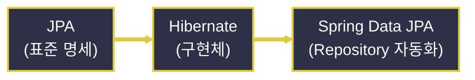
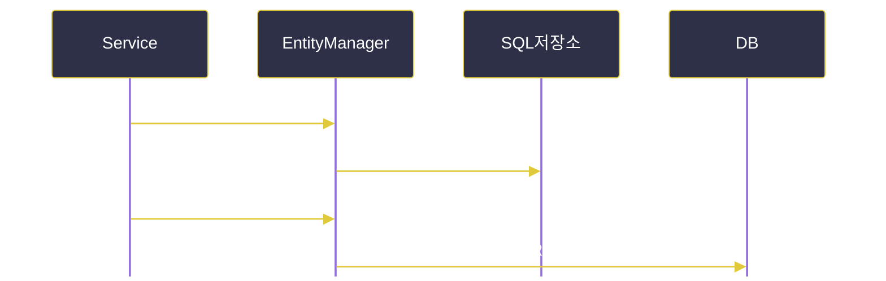
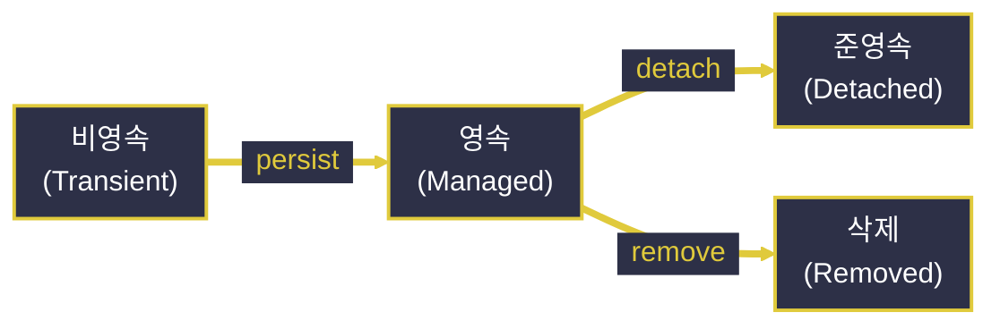

# JPA와 Hibernate

---
layout: default
---

# 학습 체크리스트 (1/2)

- [ ] JPA·ORM·Hibernate·Spring Data JPA의 개념과 관계 이해
- [ ] Spring Boot 프로젝트에 JPA와 H2를 세팅하는 방법 습득
- [ ] `@Entity`, `@Id`, `@Column` 등 매핑 애노테이션과 Lombok 관례 파악
- [ ] Auto DDL(`ddl-auto`) 옵션별 동작 차이 이해

---
layout: default
---

# 학습 체크리스트 (2/2)

- [ ] 영속성 컨텍스트의 1차 캐시·쓰기 지연·변경 감지 원리 습득
- [ ] 엔티티 생명주기(비영속·영속·준영속·삭제) 구분
- [ ] `JpaRepository`와 Query Methods로 CRUD 자동화하는 법 이해
- [ ] `save()`의 동작 방식과 변경 감지 기반 update 패턴 파악
- [ ] JPQL을 활용한 객체 지향 쿼리 작성법 습득

---
layout: cover
class: text-center
---

# JPA, Hibernate 그리고 ORM

---
layout: default
---

# JPA란 무엇인가

> **JPA (Jakarta Persistence API)**
>
> 자바 객체(Entity)와 관계형 데이터베이스 테이블 사이의 매핑 규칙을 정의한 자바 진영의 ORM 표준 명세(Specification)

- **인터페이스 집합**:
  - `@Entity`, `@Id` 같은 애노테이션과 `EntityManager` 등의 인터페이스로 구성됨
- **구현체 없음**:
  - 명세 자체는 실행 가능한 코드가 아니며, 실제 동작은 구현체가 담당

---
layout: default
---

# ORM: 객체와 테이블의 불일치 해소

> **ORM (Object-Relational Mapping)**
>
> 객체지향 언어의 객체 모델과 관계형 DB의 테이블 구조 사이의 불일치(임피던스 불일치)를 프레임워크가 자동으로 변환·매핑하는 기술

- **SQL 직접 작성 불필요**:
  - 개발자가 SQL을 손으로 작성하지 않아도 CRUD가 가능해짐

---
layout: default
---

# Hibernate: JPA의 대표 구현체

> **Hibernate**
>
> JPA 명세를 실제로 구현한 대표적인 구현체(Implementation)로, JPA 표준화에 가장 큰 영향을 준 사실상(de facto)의 표준 구현체

- **탄생 순서**:
  - JPA 등장 이전부터 독자적인 ORM 프레임워크로 먼저 존재
- **역할 분담**:
  - JPA는 "무엇을 할 수 있어야 하는가", Hibernate는 "어떻게 동작하는가"

---
layout: default
---

# DB 벤더 종속성 해소

- **MyBatis·JDBC**:
  - 개발자가 SQL을 직접 작성 → MySQL·Oracle 등 벤더별 문법 차이가 코드에 그대로 드러남
- **JPA·Hibernate**:
  - 엔티티와 JPQL만 작성하면 설정된 DB 방언(Dialect)에 맞춰 Hibernate가 실제 SQL을 생성
  - DB가 바뀌어도(H2 → MySQL) 애플리케이션 코드 수정 없이 Dialect 설정만 교체하면 됨

---
layout: default
---

# Spring Data JPA: 한 단계 더 높은 추상화

> **Spring Data JPA**
>
> JPA(및 Hibernate)를 스프링 생태계에 통합하여, Repository 인터페이스만 선언하면 구현 클래스를 스프링이 프록시로 자동 생성해 주는 계층

- **개발자 역할 축소**:
  - 구현 클래스를 직접 작성하지 않아도 기본 CRUD가 즉시 동작

---
layout: default
---

# 3단 계층 구조로 보는 관계



- 위로 갈수록 작성할 코드는 줄지만, 내부 동작에 대한 제어력은 낮아짐

---
layout: cover
class: text-center
---

# Spring Boot 프로젝트에서 JPA 세팅

---
layout: default
---

# spring-boot-starter-data-jpa

- **하나로 묶인 스타터**:
  - Hibernate, Jakarta Persistence API, Spring Data JPA, Spring ORM 등 JPA 사용에 필요한 라이브러리 일체를 제공
- **버전 관리**:
  - 별도 버전 명시 없이 Spring Boot BOM(버전 관리)을 그대로 따름

---
layout: default
---

# JPA 스타터 의존성 추가

```xml
<dependency>
    <groupId>org.springframework.boot</groupId>
    <artifactId>spring-boot-starter-data-jpa</artifactId>
</dependency>
```

---
layout: default
---

# application.properties로 JPA 동작 제어

- **데이터소스 접속 정보**와 더불어 JPA·Hibernate 고유 동작을 선언적으로 설정
- **show-sql / format-sql**:
  - Hibernate가 실행하는 실제 SQL을 콘솔에 출력하고 들여쓰기로 정렬
  - 의도한 쿼리가 나가는지 학습·디버깅 단계에서 눈으로 확인 가능

---
layout: default
---

# JPA 기본 설정 항목

```properties
spring.jpa.hibernate.ddl-auto=update
spring.jpa.show-sql=true
spring.jpa.properties.hibernate.format_sql=true
```

---
layout: default
---

# H2 인메모리 데이터베이스

> **H2**
>
> 별도의 DB 서버 설치 없이 애플리케이션과 동일한 JVM 메모리 위에서 동작하는 경량 데이터베이스

- **빠른 초기화**:
  - 실습·테스트 환경에서 빠르게 초기화·삭제가 가능해 JPA 학습에 널리 사용됨
- **h2-console**:
  - `/h2-console`에서 Auto DDL로 생성된 테이블과 데이터를 브라우저에서 직접 조회 가능

---
layout: default
---

# H2 의존성 추가

```xml
<dependency>
    <groupId>com.h2database</groupId>
    <artifactId>h2</artifactId>
    <scope>runtime</scope>
</dependency>
```

---
layout: cover
class: text-center
---

# Entity 매핑 애노테이션

---
layout: default
---

# @Entity / @Table

- **`@Entity`**:
  - 자바 클래스를 JPA가 관리하는 영속 객체(Entity)로 등록
- **`@Table(name = "...")`**:
  - 매핑될 실제 테이블명을 클래스명과 다르게 지정할 때 사용

---
layout: default
---

# User 엔티티 기본 형태

```java
@Entity
@Table(name = "users")
public class User {
    @Id
    @GeneratedValue(strategy = GenerationType.IDENTITY)
    private Long id;

    @Column(name = "user_name")
    private String userName;
}
```

---
layout: default
---

# 왜 기본 생성자가 필요한가

- **리플렉션 인스턴스화**:
  - Hibernate는 DB 로우를 엔티티로 되살릴 때, 개발자가 정의한 생성자가 아니라 리플렉션으로 먼저 빈 객체를 만든 뒤 필드를 채워 넣음
  - 인자 없는 생성자가 반드시 하나는 존재해야 예외 없이 엔티티 생성 가능
- **지연 로딩 프록시**:
  - 연관 엔티티를 지연 로딩할 때 Hibernate가 반환하는 프록시 객체도 상속으로 골격을 만들기 때문에 기본 생성자가 필수

---
layout: default
---

# 접근 제어자는 protected 이상

```java
public class User {
    protected User() {}  // JPA 스펙 요구사항

    public User(String userName) {
        this.userName = userName;
    }
}
```

- `new User()`로 불완전한 빈 객체를 직접 만드는 것은 막되, 같은 패키지의 Hibernate 프록시는 호출할 수 있게 열어 둠

---
layout: default
---

# Lombok을 활용한 Entity 관례

- **보일러플레이트 축소**:
  - 기본 생성자·Getter·전체 필드 생성자를 매번 손으로 작성하지 않도록 Lombok 애노테이션으로 대체
- **`@NoArgsConstructor(access = PROTECTED)`**:
  - JPA가 요구하는 기본 생성자를 접근 제한된 형태로 자동 생성
- **`@Setter`/`@Data`는 지양**:
  - 모든 필드에 Setter가 생겨 캡슐화가 깨지므로, `changeUserName()`처럼 의도가 드러나는 메서드로 상태 변경을 제한

---
layout: default
---

# Lombok 기반 Entity 구조

```java
@Entity
@Getter
@NoArgsConstructor(access = AccessLevel.PROTECTED)
@AllArgsConstructor(access = AccessLevel.PRIVATE)
@Builder
public class User {
    @Id @GeneratedValue(strategy = GenerationType.IDENTITY)
    private Long id;
    private String userName;
}
```

---
layout: default
---

# @Id / @GeneratedValue

- **`@Id`**:
  - 엔티티의 기본 키(PK) 필드를 지정
- **`GenerationType.IDENTITY`**:
  - DB의 AUTO_INCREMENT에 위임하여 INSERT 시점에 PK를 발급 (MySQL·H2 등에서 흔히 사용)
- **`GenerationType.SEQUENCE` / `AUTO`**:
  - `SEQUENCE`는 DB 시퀀스를 미리 채번(Oracle·PostgreSQL 선호), `AUTO`는 Dialect에 맞춰 Hibernate가 자동 선택

---
layout: default
---

# @Column 세부 지정

- **컬럼 이름, null 허용 여부, 길이, 유니크 제약** 등을 세부 지정하는 애노테이션
- 생략 시 필드명이 그대로(또는 스네이크 케이스로 변환되어) 컬럼명으로 사용됨

---
layout: cover
class: text-center
---

# Auto DDL: 테이블 자동 생성

---
layout: default
---

# spring.jpa.hibernate.ddl-auto

> **ddl-auto**
>
> 애플리케이션 기동 시 Hibernate가 엔티티 클래스 정보를 스캔하여 실제 테이블 스키마를 어떻게 처리할지 결정하는 옵션

- 옵션에 따라 기존 테이블을 삭제·유지·검증만 하는 등 동작 방식이 크게 달라짐

---
layout: default
---

# ddl-auto 옵션 비교

| 옵션 | 동작 |
| :--- | :--- |
| `create` | 기동마다 테이블 삭제 후 재생성 (데이터 초기화) |
| `update` | 기존 테이블 유지, 없는 컬럼·테이블만 추가 |
| `validate` | 스키마 변경 없이 엔티티와 실제 스키마 일치 여부만 검증 |
| `none` | 스키마에 전혀 관여하지 않음 |

---
layout: default
---

# 운영 환경에서의 주의사항

- **`create`/`update`의 위험성**:
  - 예측 불가능한 스키마 변경(컬럼 유실 등)의 위험이 있음
- **운영 배포 권장 방식**:
  - `validate` 또는 `none`으로 두고, Flyway·Liquibase 같은 별도 마이그레이션 도구로 DDL을 버전 관리

---
layout: cover
class: text-center
---

# 영속성 컨텍스트 (Persistence Context)

---
layout: default
---

# 영속성 컨텍스트란

> **영속성 컨텍스트**
>
> `EntityManager`가 엔티티 객체를 저장·관리하는 내부 1차 캐시(논리적 공간)로, 트랜잭션 하나의 생명주기 동안 조회한 엔티티를 보관

- **1차 캐시**:
  - 같은 트랜잭션 내 동일 PK 재조회 시 DB 쿼리 없이 동일한 객체 참조를 반환

---
layout: default
---

# 쓰기 지연과 변경 감지

- **쓰기 지연(Write-Behind)**:
  - `persist()` 호출 시 즉시 INSERT하지 않고 내부 저장소에 쌓아 두었다가 커밋(flush) 시점에 한꺼번에 전송
- **변경 감지(Dirty Checking)**:
  - 영속 상태 엔티티의 필드 값이 조회 시점 스냅샷과 달라지면, 별도 update 호출 없이 커밋 시 자동으로 UPDATE SQL 생성

---
layout: default
---

# 쓰기 지연 동작 흐름



---
layout: default
---

# 엔티티 생명주기 4단계

| 상태 | 설명 |
| :--- | :--- |
| 비영속 (Transient) | `new`로 생성되어 영속성 컨텍스트와 무관한 상태 |
| 영속 (Managed) | `persist()`/조회로 컨텍스트에 등록되어 변경 감지 대상이 되는 상태 |
| 준영속 (Detached) | 컨텍스트에서 분리되어 변경 감지가 더 이상 적용되지 않는 상태 |
| 삭제 (Removed) | `remove()`로 삭제가 예약되어 커밋 시 DELETE될 상태 |

---
layout: default
---

# 생명주기 상태 전이



---
layout: cover
class: text-center
---

# Repository와 Query Methods

---
layout: default
---

# Repository 계층 구조

- **상속 구조**:
  - `Repository` → `CrudRepository` → `PagingAndSortingRepository` → `JpaRepository` 순으로 하위가 상위 기능을 확장
- **구현체 자동 생성**:
  - 인터페이스와 제네릭 타입(엔티티, PK)만 선언하면 스프링이 프록시 빈을 자동 생성
- **`@Repository` 불필요**:
  - `JpaRepository`를 상속한 인터페이스는 컴포넌트 스캔 시점에 자동으로 빈 등록됨

---
layout: default
---

# UserRepository 선언

```java
public interface UserRepository
        extends JpaRepository<User, Long> {
}
```

- 선언만으로 `save()`, `findById()`, `findAll()`, `delete()` 등 기본 CRUD를 즉시 사용 가능

---
layout: default
---

# Query Methods: 이름만으로 쿼리 생성

> **Query Methods**
>
> 정해진 명명 규칙에 맞춰 메서드 이름을 지으면, Spring Data JPA가 이름을 파싱해 대응하는 JPQL/SQL을 런타임에 자동 생성

- **접두어 규칙**:
  - `findBy`, `existsBy`, `countBy`, `deleteBy` 등과 `And`/`Or`/`GreaterThan`/`Like`/`OrderBy` 키워드를 필드명과 조합

---
layout: default
---

# 메서드 이름으로 조회 조건 표현

```java
public interface UserRepository extends JpaRepository<User, Long> {
    List<User> findByUserName(String userName);
    Optional<User> findByUserNameAndAge(String userName, int age);
    boolean existsByUserName(String userName);
}
```

---
layout: cover
class: text-center
---

# save() vs 변경 감지

---
layout: default
---

# save() 하나로 Insert와 Update를 겸함

- **별도의 update() 없음**:
  - `save()`가 넘겨받은 엔티티의 PK 존재 여부에 따라 내부적으로 `persist()` 또는 `merge()`를 선택 실행
- **PK가 없거나 신규인 경우**:
  - `persist()`가 호출되어 새 엔티티로 INSERT
- **PK가 이미 존재하는 경우**:
  - `merge()`가 호출되어 기존 데이터와 병합(UPDATE)

---
layout: default
---

# 영속 상태 엔티티는 save() 없이도 갱신

- **변경 감지에 의한 자동 갱신**:
  - 트랜잭션 내에서 조회로 얻은 영속 상태 엔티티는 필드 값만 바꿔도 커밋 시 자동 UPDATE
- **실무 패턴**:
  - 단순 필드 수정에는 `save()`를 명시적으로 호출하지 않는 경우가 많음

---
layout: default
---

# 조회 후 필드 변경만으로 완성되는 update

```java
@Transactional
public void updateUserName(Long id, String newName) {
    User user = userRepository.findById(id)
            .orElseThrow();

    user.changeUserName(newName);
    // save() 호출 없이 커밋 시 자동 UPDATE
}
```

---
layout: default
---

# @Transactional이 핵심 전제조건

- **변경 감지의 동작 조건**:
  - 영속성 컨텍스트가 살아있는 트랜잭션 범위 안에서만 동작
- **`@Transactional`이 없다면**:
  - `findById()` 직후 컨텍스트가 닫혀 엔티티가 준영속 상태로 전환되고, 필드를 바꿔도 반영되지 않음

---
layout: default
---

# setter보다 의미 있는 변경 메서드

- **`setUserName()` 대신 `changeUserName()`**:
  - 도메인 의미가 드러나는 메서드 안에서 필드를 변경하도록 캡슐화
  - 어떤 트랜잭션이 어떤 이유로 값을 바꿨는지 추적하기 쉬움
- **save()가 여전히 필요한 경우**:
  - 컨트롤러에서 새로 만든 준영속 엔티티나 DTO 변환 엔티티는 원본 스냅샷이 없으므로 `save()`로 명시적 병합 필요

---
layout: cover
class: text-center
---

# JPQL: 객체 지향 쿼리

---
layout: default
---

# JPQL이란

> **JPQL (Java Persistence Query Language)**
>
> 테이블과 컬럼이 아닌 엔티티(클래스)와 필드를 대상으로 쿼리를 작성하는 객체지향 쿼리 언어

- **SQL과의 차이**:
  - `FROM User`처럼 테이블명이 아닌 엔티티 클래스명, `u.userName`처럼 컬럼명이 아닌 필드명을 사용
  - 특정 DB 벤더 문법에 종속되지 않음

---
layout: default
---

# @Query로 JPQL 직접 작성

```java
@Query("SELECT u FROM User u WHERE u.userName = :name")
List<User> findUsersByName(@Param("name") String name);
```

- Query Methods로 표현하기 어려운 복잡한 조건이나 조인이 필요할 때 사용

---
layout: default
---

# 학습 요약 (Summary)

- **JPA·Hibernate·Spring Data JPA**:
  - 표준 명세 → 구현체 → Repository 자동화 계층 순으로 추상화 단계가 높아짐
- **Entity 매핑**:
  - 기본 생성자는 리플렉션·프록시 생성에 필수이며, Lombok으로 보일러플레이트를 축소
- **영속성 컨텍스트**:
  - 1차 캐시·쓰기 지연·변경 감지로 트랜잭션 범위 내 엔티티 상태를 관리
- **save() vs 변경 감지**:
  - 영속 상태는 필드 변경만으로, 준영속 상태는 `save()`로 갱신
