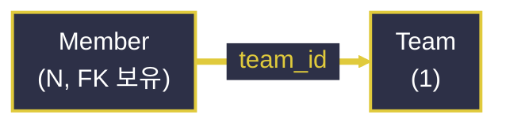
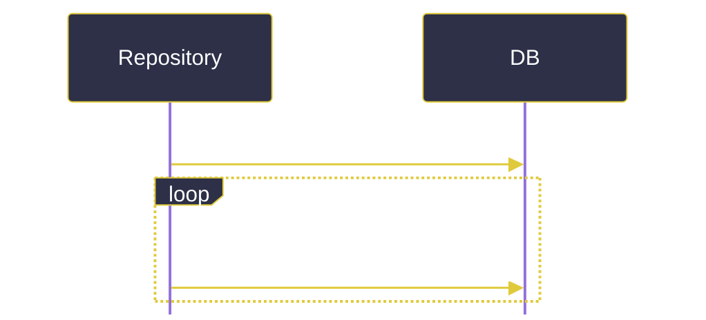
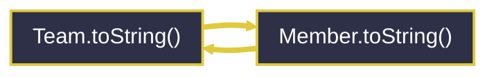

# JPA 연관관계 매핑과 N+1 문제

---
layout: default
---

# 학습 체크리스트 (1/2)

- [ ] 다중성(1:1, 1:N, N:M)과 연관관계의 주인(Owner)·`mappedBy` 개념 이해
- [ ] N:M 관계를 중개 엔티티로 승격해 설계하는 방식 파악
- [ ] `FetchType`(EAGER/LAZY)의 기본값 차이와 실무 관례 습득
- [ ] 지연 로딩 프록시의 동작 원리와 `LazyInitializationException` 이해

---
layout: default
---

# 학습 체크리스트 (2/2)

- [ ] N+1 문제의 발생 조건과 근본 원인 파악
- [ ] Fetch Join과 `@EntityGraph`를 활용한 N+1 해결법 습득
- [ ] 양방향 연관관계의 순환참조 문제와 원인 이해
- [ ] 엔티티를 API 응답으로 직접 노출하지 않고 DTO로 변환하는 이유 습득

---
layout: cover
class: text-center
---

# 연관관계 매핑의 기본: 다중성과 방향

---
layout: default
---

# 다중성(Multiplicity)이란

> **다중성 (Multiplicity)**
>
> 두 엔티티 사이의 관계가 몇 대 몇으로 맺어지는지를 나타내는 분류

- **네 가지 애노테이션**:
  - `@OneToOne`(1:1), `@ManyToOne`/`@OneToMany`(1:N), `@ManyToMany`(N:M)
- **FK는 항상 N(다) 쪽이 보유**:
  - "다"에 해당하는 테이블이 FK 컬럼을 가지므로, `@ManyToOne` 쪽에 `@JoinColumn`을 선언하는 것이 실제 FK와 대응됨

---
layout: default
---

# Team: 연관관계의 '1' 쪽

```java
@Entity
public class Team {
    @Id @GeneratedValue
    private Long id;

    @OneToMany(mappedBy = "team")
    private List<Member> members = new ArrayList<>();
}
```

---
layout: default
---

# Member: FK를 보유한 'N' 쪽

```java
@Entity
public class Member {
    @Id @GeneratedValue
    private Long id;

    @ManyToOne(fetch = FetchType.LAZY)
    @JoinColumn(name = "team_id")
    private Team team;
}
```

---
layout: default
---

# 다중성 관계 한눈에 보기



---
layout: default
---

# 연관관계의 주인(Owner)과 mappedBy

> **연관관계의 주인**
>
> 양방향 연관관계에서 실제 FK를 관리(등록·수정)하는 책임을 지는 쪽. 주인이 아닌 반대쪽은 `mappedBy`로 "나는 주인이 아니다"를 명시

- **주인만 FK를 변경 가능**:
  - `Member.team`(주인)에 값을 대입해야 실제 `team_id` UPDATE가 반영됨
  - `Team.members`(주인이 아님)에 값을 추가해도 FK에는 영향 없음 — 실무에서 가장 흔한 실수

---
layout: default
---

# 주인 선택 기준

- **FK를 실제로 갖는 쪽을 주인으로**:
  - FK 테이블에 대응하는 엔티티(보통 `@ManyToOne` 쪽)를 주인으로 두는 것이 자연스러움
- **잘못된 선택의 대가**:
  - `@OneToMany` 쪽을 주인으로 두면 불필요한 추가 UPDATE 쿼리가 발생

---
layout: default
---

# 연관관계 편의 메서드

```java
public class Team {
    public void addMember(Member member) {
        members.add(member);
        member.setTeam(this);
    }
}
```

- 양쪽 필드를 항상 함께 맞춰 주어, 주인과 비주인 값이 어긋나는 실수를 방지

---
layout: default
---

# N:M과 중개 테이블

- **`@ManyToMany`의 한계**:
  - 중간 테이블에 추가 컬럼(가입일, 상태 등)을 둘 수 없고, 실제 실행 SQL을 예측하기 어려움
- **실무 해법**:
  - 중간 테이블을 별도 엔티티로 승격해 두 개의 `@ManyToOne`(1:N 두 개)으로 분해

---
layout: default
---

# 중개 테이블을 엔티티로 승격

```java
@Entity
public class TeamMember {
    @Id @GeneratedValue
    private Long id;

    @ManyToOne private Team team;
    @ManyToOne private Member member;
    private LocalDate joinedAt;   // 중간 테이블만의 속성
}
```

---
layout: default
---

# N:M 설계 실무 권장

- **`@ManyToMany`**:
  - 학습·프로토타입 단계에서만 가볍게 사용
- **실제 서비스**:
  - 처음부터 중개 엔티티(조인 테이블) 방식으로 설계하는 것이 일반적

---
layout: cover
class: text-center
---

# Lazy Loading vs Eager Loading

---
layout: default
---

# FetchType이란

> **FetchType**
>
> 연관된 엔티티를 언제 DB에서 조회해 올지 결정하는 설정. 즉시 함께 조회하는 `EAGER`와 실제 사용 시점에 지연 조회하는 `LAZY`로 구분

- 명시하지 않으면 개발자 의도와 다르게 즉시 로딩이 일어날 수 있음

---
layout: default
---

# 기본값의 함정

| 애노테이션 | 기본 FetchType |
| :--- | :--- |
| `@ManyToOne` | `EAGER` |
| `@OneToOne` | `EAGER` |
| `@OneToMany` | `LAZY` |
| `@ManyToMany` | `LAZY` |

- 관계 종류마다 기본값이 서로 달라 혼란을 유발하기 쉬움

---
layout: default
---

# 실무 관례: 모두 LAZY로 명시

- **명시적 LAZY 지정**:
  - `@ManyToOne(fetch = FetchType.LAZY)`처럼 모든 연관관계에 `LAZY`를 명시
- **필요한 곳만 통제**:
  - 즉시 로딩이 필요한 경우에만 Fetch Join으로 로딩 범위를 직접 지정

---
layout: default
---

# 지연 로딩의 동작 원리(프록시)

> **지연 로딩 프록시**
>
> `LAZY`로 지정된 연관 필드는 실제 엔티티 대신 Hibernate가 만든 프록시 객체로 채워지며, 필드 메서드를 처음 호출하는 시점에 추가 SELECT가 발생

- **영속성 컨텍스트 필요**:
  - 프록시 초기화는 트랜잭션이 살아 있어야 하며, 준영속 상태에서 시도하면 `LazyInitializationException` 발생

---
layout: cover
class: text-center
---

# N+1 문제

---
layout: default
---

# N+1 문제란

> **N+1 문제**
>
> 목록 조회 쿼리 1번(N건) 실행 후, 각 결과 엔티티마다 연관 엔티티를 지연 로딩으로 추가 조회하면서 총 1+N번의 쿼리가 발생하는 성능 문제

---
layout: default
---

# 반복문에서 발생하는 추가 쿼리

```java
List<Team> teams = teamRepository.findAll();  // 쿼리 1번
for (Team team : teams) {
    team.getMembers().size();  // team마다 추가 쿼리 N번
}
```

---
layout: default
---

# N+1 쿼리 실행 흐름



---
layout: default
---

# 발생 조건과 오해

- **발생 조건**:
  - 연관관계 없이 엔티티만 조회한 뒤, 이후 로직에서 지연 로딩 필드를 실제 사용(접근)하는 순간마다 쿼리가 추가로 나감
- **EAGER라고 해결되지 않음**:
  - 즉시 로딩으로 바꿔도 Hibernate가 대상 엔티티마다 별도 쿼리를 날릴 수 있음(컬렉션 특히)
  - 근본 해결책은 조회 쿼리 자체를 한 번에 합치는 것

---
layout: cover
class: text-center
---

# N+1 해결 방법

---
layout: default
---

# Fetch Join

> **Fetch Join (페치 조인)**
>
> JPQL의 `JOIN FETCH` 구문으로 연관 엔티티를 별도 쿼리 없이 원본 조회 쿼리 한 번에 함께 SELECT하여 N+1의 "N"을 제거하는 기본 해결책

---
layout: default
---

# JOIN FETCH로 한 번에 조회

```java
@Query("SELECT t FROM Team t JOIN FETCH t.members")
List<Team> findAllWithMembers();
```

- 일반 `JOIN`은 필터링에만 관여하지만, `JOIN FETCH`는 연관 엔티티까지 결과 객체에 함께 담아 즉시 초기화

---
layout: default
---

# 컬렉션 페치 조인의 한계

- **페이징과 함께 쓸 수 없음**:
  - `@OneToMany`를 페치 조인하며 동시에 `Pageable`을 적용하면, Hibernate가 페이징을 메모리에서 처리하며 경고 발생
- **원칙**:
  - 컬렉션 페치 조인과 페이징은 함께 사용하지 않음

---
layout: default
---

# @EntityGraph

> **@EntityGraph**
>
> JPQL을 직접 작성하지 않고도, Query Method 실행 시 어떤 연관 필드까지 즉시 로딩할지 애노테이션으로 선언하는 Spring Data JPA 편의 기능

---
layout: default
---

# 애노테이션만으로 즉시 로딩 지정

```java
@EntityGraph(attributePaths = "members")
List<Team> findAll();
```

- 내부적으로 Fetch Join과 유사하게 동작하되, JPQL을 새로 작성하지 않고 기존 메서드에 애노테이션만 추가

---
layout: default
---

# Fetch Join vs @EntityGraph

| 구분 | Fetch Join | @EntityGraph |
| :--- | :--- | :--- |
| **작성 방식** | JPQL `JOIN FETCH` 직접 작성 | 애노테이션 선언만으로 적용 |
| **적용 대상** | `@Query` 메서드 | 기존 Query Method에도 적용 가능 |
| **동작 원리** | 하나의 쿼리로 즉시 로딩 | 내부적으로 Fetch Join과 유사 |

---
layout: cover
class: text-center
---

# 순환참조와 DTO 변환

---
layout: default
---

# 양방향 연관관계의 순환참조 문제

> **순환참조 문제**
>
> `Team`이 `List<Member>`를, `Member`가 다시 `Team`을 갖는 양방향 구조에서 `toString()`이나 JSON 직렬화를 그대로 수행하면 서로를 무한히 참조

- 결과적으로 `StackOverflowError`가 발생

---
layout: default
---

# 무한 순환 호출 흐름



---
layout: default
---

# Lombok과 JSON 직렬화에서의 동일 문제

- **Lombok `@ToString`/`@Data` 주의**:
  - 양방향 연관 필드까지 포함하면 무한 순환되므로, `@ToString.Exclude`로 제외하거나 `@Getter`만 사용
- **JSON 직렬화(API 응답)**:
  - 엔티티를 그대로 반환하면 Jackson이 무한 순환 직렬화를 시도하거나, 지연 로딩 프록시로 인해 `LazyInitializationException` 발생

---
layout: default
---

# 엔티티를 API 응답으로 직접 노출하지 않는 이유

- **순환참조·지연 로딩 예외** 외에도
- **테이블 구조 종속성**:
  - API 스펙이 테이블 변경에 그대로 흔들림
- **민감 정보 노출 위험**:
  - 비밀번호 등 노출되면 안 되는 필드까지 그대로 직렬화될 위험

---
layout: default
---

# 응답 전용 DTO로 변환

```java
public record TeamResponse(Long id, String name, List<String> memberNames) {
    public static TeamResponse from(Team team) {
        return new TeamResponse(
                team.getId(),
                team.getName(),
                team.getMembers().stream().map(Member::getName).toList()
        );
    }
}
```

---
layout: default
---

# 변환 시점의 지연 로딩 주의

- **Service 계층 안에서 변환**:
  - `from()` 내부에서 `team.getMembers()`처럼 지연 로딩 필드에 접근하므로, 트랜잭션(영속성 컨텍스트)이 살아 있는 Service 계층 안에서 변환해야 함
- **Controller까지 엔티티를 넘기면**:
  - 이후 변환 시 `LazyInitializationException`이 발생할 수 있음

---
layout: default
---

# 학습 요약 (Summary)

- **다중성과 주인**:
  - FK는 항상 'N' 쪽이 보유하며, 실제 FK를 관리하는 쪽이 연관관계의 주인
- **FetchType**:
  - 기본값이 관계마다 달라 혼란스러우므로, 실무에서는 모두 `LAZY`로 명시
- **N+1 문제**:
  - 지연 로딩 필드에 반복 접근할 때 발생하며, Fetch Join·`@EntityGraph`로 쿼리를 한 번에 합쳐 해결
- **DTO 변환**:
  - 순환참조와 지연 로딩 예외를 피하기 위해 엔티티 대신 Service 계층에서 DTO로 변환해 응답
