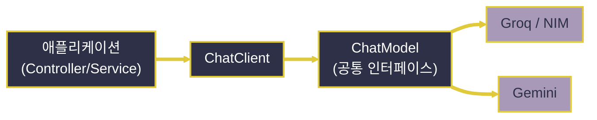

# Spring AI 기초

---
layout: default
---

# 학습 체크리스트 (1/2)

- [ ] Spring AI가 여러 LLM 제공자를 공통 추상화로 통일하는 방식 이해
- [ ] LangChain4j·LangGraph·직접 구현과 비교한 Spring AI의 선택 기준 파악
- [ ] BOM과 제공자별 스타터로 의존성을 구성하는 방법 습득
- [ ] `spring.config.import`로 `.env`의 API 키를 안전하게 주입하는 방법 습득

---
layout: default
---

# 학습 체크리스트 (2/2)

- [ ] Groq·NVIDIA NIM(OpenAI 호환)과 Gemini 연동 설정의 차이 이해
- [ ] `ChatOptions`의 temperature·max-tokens·top-p 역할 파악
- [ ] `ChatModel`과 `ChatClient`의 계층 차이와 사용 시점 구분
- [ ] `ChatClient`를 Service 계층에 두고 Controller가 위임하는 구조 습득

---
layout: cover
class: text-center
---

# Spring AI 개요

---
layout: default
---

# Spring AI란

> **스프링 AI (Spring AI)**
>
> OpenAI·Anthropic·Google 등 서로 다른 LLM 제공자의 API를 공통 인터페이스로 통일하여, 스프링의 관례 그대로 AI 기능을 붙일 수 있게 해 주는 공식 프레임워크

- **LLM (Large Language Model)**: 대규모 언어 모델
- 의존성 주입, 자동 구성, `application.properties` 등 익숙한 방식을 그대로 사용

---
layout: default
---

# 이식 가능한 추상화

- **Portable Abstraction (이식 가능한 추상화)**:
  - 제공자마다 다른 요청/응답 포맷을 `ChatModel` 인터페이스 뒤로 감춤
- **JPA와 같은 발상**:
  - JPA가 DB 벤더 차이를 Dialect로 감췄듯, Spring AI는 모델 제공자 차이를 감춤
- **교체 비용**:
  - OpenAI → Gemini로 바꿔도 애플리케이션 코드가 아닌 의존성·설정만 변경

---
layout: default
---

# 제공자를 감추는 구조



---
layout: default
---

# 버전 현황과 적용 범위

- **버전 (2026년 7월 기준)**:
  - 최신 안정 버전(GA)은 2.0.0 계열이며 Spring Boot 4.x의 자동 구성 위에서 동작
  - 실제 버전은 `spring-ai-bom`으로 일괄 관리하는 것이 권장됨
- **다루는 영역**:
  - Chat(대화), 임베딩, 벡터 DB 연동 RAG(검색 증강 생성)
  - 도구 호출(Tool Calling), MCP(Model Context Protocol), 멀티모달 처리

---
layout: default
---

# 다른 선택지와의 비교

| 접근 방식 | 특징 |
| :--- | :--- |
| **직접 구현** | `RestClient`로 REST 직접 호출, 자유도 최고 / 인증·재시도·메모리를 전부 수작업 |
| **LangChain4j** | 파이썬 LangChain의 자바 포팅, 컴포넌트 풍부 / 스프링과 별개 생태계 |
| **LangGraph** | 워크플로우를 그래프(상태 머신)로 모델링, 다단계 에이전트에 강점 |
| **Spring AI** | 스프링 관례(DI·자동 구성) 그대로 통합, 학습 곡선·유지보수 비용 낮음 |

---
layout: default
---

# Spring AI를 택하는 이유

- **이미 익숙한 관례의 재사용**:
  - `ChatClient.Builder` 주입, `application.properties` 설정, `@Configuration` 빈 등록
- **별도 생태계 학습 부담 없음**:
  - 이미 Spring Boot로 백엔드를 구성 중이라면 추가 학습 비용이 가장 낮음
- **판단 기준**: 자유도가 최우선이면 직접 구현, 복잡한 제어 흐름이면 LangGraph

---
layout: default
---

# BOM으로 버전 일괄 관리

```xml
<dependencyManagement>
  <dependencies>
    <dependency>
      <groupId>org.springframework.ai</groupId>
      <artifactId>spring-ai-bom</artifactId>
      <version>2.0.0</version>
      <type>pom</type>
      <scope>import</scope>
    </dependency>
  </dependencies>
</dependencyManagement>
```

---
layout: default
---

# 사용할 제공자의 스타터만 추가

```xml
<!-- version 생략 → BOM이 결정 -->
<dependency>
  <groupId>org.springframework.ai</groupId>
  <artifactId>spring-ai-starter-model-openai</artifactId>
</dependency>
<dependency>
  <groupId>org.springframework.ai</groupId>
  <artifactId>spring-ai-starter-model-google-genai</artifactId>
</dependency>
```

---
layout: default
---

# 제공자별 스타터 명명 규칙

| 제공자 | 스타터 아티팩트 |
| :--- | :--- |
| OpenAI 호환 (Groq · NVIDIA NIM) | `spring-ai-starter-model-openai` |
| Google Gemini | `spring-ai-starter-model-google-genai` |
| 로컬 모델 (Ollama) | `spring-ai-starter-model-ollama` |

- **BOM (Bill of Materials)**: 하위 모듈 버전을 한곳에서 통제하는 의존성 목록

---
layout: default
---

# 스타터가 대신 해 주는 일

- **자동 구성 (Auto-Configuration)**:
  - 스타터를 추가하면 해당 제공자의 `ChatModel` 구현 빈이 자동 등록됨
- **Builder 제공**:
  - `ChatClient.Builder`까지 함께 구성되어, 별도 설정 코드 없이 생성자 주입만으로 사용
- 필요한 제공자의 스타터만 골라 추가하는 선택적 구성

---
layout: cover
class: text-center
---

# LLM Provider 연동

---
layout: default
---

# 설정은 코드 밖에서

- **선언적 중앙 설정**:
  - API 키·엔드포인트·모델·옵션을 `application.properties`에 모아 관리
- **자격 증명 보호**:
  - 키는 하드코딩하지 않고 `${GROQ_API_KEY}`처럼 OS 환경 변수에서 주입
- **본 과정 대상**:
  - 무료 티어를 제공하는 Groq · NVIDIA NIM(OpenAI 호환)과 Google Gemini

---
layout: default
---

# .env 파일 불러오기

- **기본 미인식**:
  - Spring Boot는 `.env`를 자동으로 읽지 않으므로 불러올 위치를 직접 알려 줘야 함
- **`spring.config.import`**:
  - 외부 설정 파일을 `application.properties`에서 추가로 끌어오는 표준 기능
  - 별도 라이브러리 없이 `.env`를 설정 소스로 편입시킬 수 있음
- **필수 조치**:
  - `.env`는 반드시 `.gitignore`에 등록하여 Git에 커밋되지 않도록 차단

---
layout: default
---

# .env를 설정 소스로 편입

```properties
# application.properties
spring.config.import=optional:file:.env[.properties]

# .env 의 값을 그대로 참조
spring.ai.openai.api-key=${GROQ_API_KEY}
```

```properties
# .env  (Git 커밋 금지)
GROQ_API_KEY=gsk_xxxxxxxx
GEMINI_API_KEY=AIza_xxxxxxxx
```

---
layout: default
---

# import 구문 뜯어보기

- **`optional:`**:
  - 파일이 없어도 기동 실패하지 않음 — 배포 환경에서는 `.env` 없이 OS 환경 변수만 사용
- **`file:.env`**:
  - 클래스패스가 아닌 프로젝트 실행 디렉터리의 `.env` 파일을 지목
- **`[.properties]`**:
  - 확장자가 없는 파일을 어떤 형식으로 읽을지 알려 주는 지정자
  - `KEY=VALUE` 구조가 properties와 같으므로 그대로 해석됨

---
layout: default
---

# Groq 연동 설정

```properties
spring.ai.openai.api-key=${GROQ_API_KEY}
spring.ai.openai.base-url=https://api.groq.com/openai
spring.ai.openai.chat.options.model=qwen/qwen3.6-27b
spring.ai.openai.chat.options.temperature=0.7
```

- OpenAI 호환 스타터를 그대로 쓰고 `base-url`·모델만 교체

---
layout: default
---

# OpenAI 호환 규격의 원리

> **OpenAI 호환 (OpenAI-compatible)**
>
> OpenAI가 정의한 요청/응답 포맷이 사실상 업계 표준이 되어, 여러 제공자가 동일한 `/v1/chat/completions` 엔드포인트를 노출하는 상황

- `spring.ai.openai.*`는 "OpenAI사 전용"이 아니라 **"OpenAI 호환 규격용"** 프리픽스
- `base-url`을 각 제공자 주소로 바꾸고 그 제공자의 `api-key`·`model`만 지정

---
layout: default
---

# Groq와 NVIDIA NIM

- **Groq**:
  - 자체 LPU(Language Processing Unit) 하드웨어로 매우 빠른 추론 속도를 제공
  - 본 과정에서는 `qwen/qwen3.6-27b` 오픈 웨이트 모델을 사용
- **NVIDIA NIM**:
  - NVIDIA의 추론 마이크로서비스로 역시 OpenAI 호환 엔드포인트를 노출
  - `base-url`을 NIM 주소로 지정하고 `nvidia/nemotron-3-ultra-550b-a55b` 등을 사용

---
layout: default
---

# Gemini는 전용 스타터 사용

```xml
<dependency>
  <groupId>org.springframework.ai</groupId>
  <artifactId>spring-ai-starter-model-google-genai</artifactId>
</dependency>
```

- Gemini는 OpenAI 호환 규격이 아니므로 전용 스타터가 필요

---
layout: default
---

# Gemini 연동 설정

```properties
spring.ai.google.genai.api-key=${GEMINI_API_KEY}
spring.ai.google.genai.chat.options.model=gemini-3.5-flash-lite
spring.ai.google.genai.chat.options.temperature=0.5
```

- `api-key` 한 줄로 접속하는 Developer API 방식은 실습·개인 프로젝트에 간편

---
layout: default
---

# Developer API와 Vertex AI

- **Gemini Developer API**:
  - API Key 하나로 접속, 실습과 개인 프로젝트에 적합
- **Vertex AI 방식**:
  - `project-id`·`location`으로 Google Cloud 자격 증명을 사용, 조직 규모에 적합
- **유의점**:
  - 스타터를 여러 개 추가하면 각 제공자의 `ChatModel` 빈이 동시에 생성됨

---
layout: default
---

# 제공자별 설정 프리픽스와 모델

| 제공자 | 설정 프리픽스 | 본 과정 기준 모델 ID |
| :--- | :--- | :--- |
| Groq | `spring.ai.openai.*` | `qwen/qwen3.6-27b` |
| NVIDIA NIM | `spring.ai.openai.*` | `nvidia/nemotron-3-ultra-550b-a55b` |
| Google Gemini | `spring.ai.google.genai.*` | `gemini-3.5-flash-lite` |

- 모델 ID는 수시로 갱신되므로 실제 사용 시 제공자 콘솔에서 확인 필요

---
layout: default
---

# ChatOptions: 생성 파라미터

> **채팅 옵션 (ChatOptions)**
>
> 모델이 응답을 생성하는 방식(무작위성·길이·다양성 등)을 제어하는 옵션 묶음

- `application.properties`에서 전역 기본값으로 지정
- 필요하면 요청마다 코드로 덮어쓸 수 있음

---
layout: default
---

# 전역 기본값으로 옵션 지정

```properties
spring.ai.openai.chat.options.model=qwen/qwen3.6-27b
spring.ai.openai.chat.options.temperature=0.7
spring.ai.openai.chat.options.max-tokens=1024
spring.ai.openai.chat.options.top-p=1.0
```

- 해당 제공자의 모든 호출에 공통 적용되는 기본값

---
layout: default
---

# 주요 옵션의 의미

| 옵션 | 역할 |
| :--- | :--- |
| `temperature` | 다음 토큰 선택의 무작위성. 낮으면 일관·결정적, 높으면 창의·다양 |
| `max-tokens` | 생성할 응답의 최대 길이 상한. 잘림 방지와 비용·지연 통제 |
| `top-p` | 누적 확률 `p`까지의 후보 중에서만 샘플링(nucleus sampling) |

- 코드 생성·정보 추출은 낮게, 브레인스토밍·창작은 높게 두는 것이 일반적
- `temperature`와 `top-p`는 보통 둘 중 하나만 조정

---
layout: default
---

# 이 호출만 다르게: 런타임 오버라이드

```java
String answer = chatClient.prompt()
        .user("이 코드를 리팩터링해줘")
        .options(ChatOptions.builder()
                .temperature(0.0)   // 이 호출만 결정적으로
                .maxTokens(2048)
                .build())
        .call()
        .content();
```

---
layout: default
---

# 공통 옵션과 제공자 전용 옵션

- **공통 옵션 (`ChatOptions`)**:
  - `temperature`·`maxTokens`처럼 여러 제공자에 공통인 파라미터를 담음
- **제공자 전용 옵션**:
  - 고유 기능이 필요하면 `OpenAiChatOptions`·`GoogleGenAiChatOptions` 사용
- **값의 범위 차이**:
  - `temperature` 상한이 제공자마다 다름 (OpenAI 0~2, Gemini 0~1 등)

---
layout: cover
class: text-center
---

# ChatModel과 ChatClient

---
layout: default
---

# ChatModel: 저수준 통신 계약

> **채팅 모델 (ChatModel)**
>
> `Prompt`(메시지 묶음)를 받아 `ChatResponse`를 반환하는, LLM과의 저수준 요청-응답 인터페이스

- 스타터가 자동 구성한 구현 빈이 그대로 주입됨
- 가장 단순한 형태는 문자열 in → 문자열 out

---
layout: default
---

# ChatModel로 응답 받아 JSP로 전달

```java
@Controller
@RequiredArgsConstructor
public class SimpleChatController {

    private final ChatModel chatModel;

    @PostMapping("/chat")
    public String chat(@RequestParam String message, Model model) {
        model.addAttribute("answer", chatModel.call(message));
        return "chat";   // /WEB-INF/views/chat.jsp 로 forward
    }
}
```

---
layout: default
---

# 익숙한 MVC 흐름 그대로

- **입력**: `<form>` 전송을 `@RequestParam`으로 수신
- **출력**: 결과 문자열을 `Model`에 담고 뷰 이름을 반환하면 `ViewResolver`가 JSP 렌더링
- **화면 표시**: JSTL `<c:out value="${answer}"/>`로 출력
- **더 풍부한 호출**: `ChatResponse call(Prompt)`는 여러 메시지·옵션을 보내고 토큰 사용량 같은 메타데이터까지 반환

---
layout: default
---

# ChatClient: Fluent API 계층

> **채팅 클라이언트 (ChatClient)**
>
> `ChatModel` 위에 얹혀, 시스템/사용자 메시지·템플릿·Advisor·엔티티 매핑을 메서드 체이닝으로 선언하게 해 주는 고수준 API

- **Fluent API (유창한 API)**: 메서드를 연결해 문장처럼 읽히도록 구성하는 방식
- 대부분의 애플리케이션 코드는 `ChatModel`이 아닌 `ChatClient` 사용이 권장됨

---
layout: default
---

# AI 호출은 Service 계층에서

- **계층 책임 분리**:
  - `ChatClient`는 Controller가 아닌 `@Service`가 보유하고, Controller는 서비스에 위임
- **기존 계층 구조 그대로**:
  - 앞서 배운 Controller → Service → Repository 흐름에 AI 호출을 Service 자리에 배치
- **얻는 것**:
  - 프롬프트 조립·후처리 로직이 화면 코드와 섞이지 않고, 재사용과 테스트가 쉬워짐

---
layout: default
---

# ChatClient를 품는 Service

```java
@Service
public class ChatService {

    private final ChatClient chatClient;

    public ChatService(ChatClient.Builder builder) {
        this.chatClient = builder.build();   // 권장 패턴
    }
}
```

---
layout: default
---

# 체이닝으로 이어지는 호출

```java
public String ask(String userInput) {
    return chatClient.prompt()  // 요청 시작
            .user(userInput)    // 사용자 메시지
            .call()             // 동기 호출
            .content();         // 응답 본문(String)
}
```

---
layout: default
---

# Controller는 서비스에 위임

```java
@Controller
@RequiredArgsConstructor
public class ChatController {

    private final ChatService chatService;

    @PostMapping("/ai")
    public String generation(@RequestParam String userInput, Model model) {
        model.addAttribute("answer", chatService.ask(userInput));
        return "chat";
    }
}
```

---
layout: default
---

# 두 계층의 역할 구분

| 구분 | ChatModel | ChatClient |
| :--- | :--- | :--- |
| 위치 | 저수준 전송 계층 | 고수준 편의 계층 |
| 관심사 | "무엇을 호출하는가" | "어떻게 편하게 구성하는가" |
| 비유 | `JdbcTemplate` | `Repository` |

- 세밀한 제어(직접 `Prompt` 조립 등)가 필요할 때만 `ChatModel`을 직접 사용

---
layout: default
---

# 반환 형태의 선택지

| 메서드 | 반환값 |
| :--- | :--- |
| `.content()` | 응답 본문 문자열 |
| `.chatResponse()` | 메타데이터를 포함한 `ChatResponse` |
| `.entity(Xxx.class)` | 응답을 자바 객체(record 등)로 매핑 |
| `.stream().content()` | `Flux<String>` 스트리밍 응답 |

---
layout: default
---

# 공통 설정을 담은 빈 등록

```java
@Configuration
public class ChatClientConfig {

    @Bean
    public ChatClient chatClient(ChatClient.Builder builder) {
        return builder
                .defaultSystem("당신은 친절한 한국어 AI 도우미입니다.")
                .defaultAdvisors(new SimpleLoggerAdvisor())
                .build();
    }
}
```

---
layout: default
---

# Builder를 주입받는 이유

- **불변 객체**:
  - `ChatClient`는 불변이라 빌더를 통해서만 구성함
- **모델 무관성**:
  - 자동 구성된 `Builder`를 주입받으면 어떤 `ChatModel`이 연결됐는지 신경 쓸 필요 없음
- **다중 제공자 처리**:
  - 각 `ChatModel` 빈으로 `ChatClient.builder(model)`을 만들고 `@Primary`·`@Qualifier`로 구분

---
layout: default
---

# 학습 요약 (Summary)

- **Spring AI**:
  - 제공자별 요청/응답 차이를 `ChatModel` 뒤로 감춰, 설정만 바꿔 모델을 교체
- **의존성과 설정**:
  - `spring-ai-bom` + 제공자 스타터, 키는 `.env`를 `spring.config.import`로 주입
- **제공자 연동**:
  - Groq·NIM은 OpenAI 호환 스타터의 `base-url` 교체, Gemini는 전용 스타터
- **ChatModel과 ChatClient**:
  - 저수준 전송은 `ChatModel`, 실사용은 `ChatClient`를 Service 계층에서 주입
