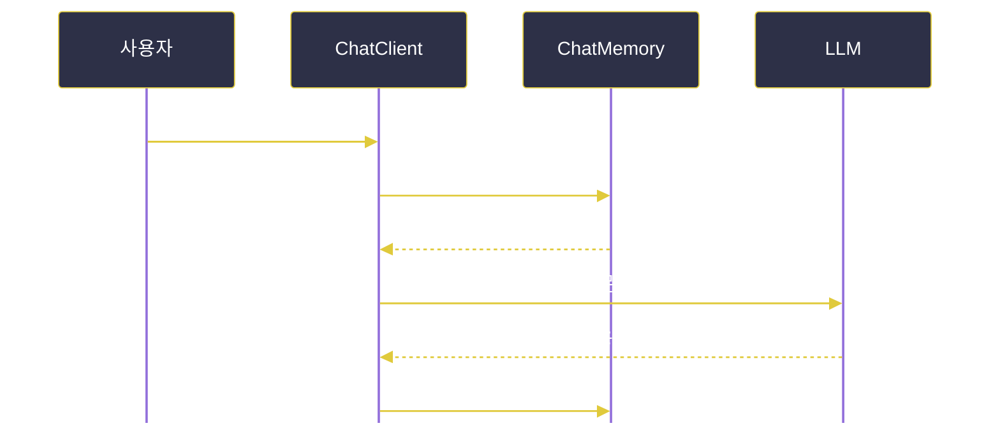

# Spring AI 활용

---
layout: default
---

# 학습 체크리스트 (1/2)

- [ ] `Prompt`와 메시지 역할(SYSTEM·USER·ASSISTANT·TOOL) 구분
- [ ] `PromptTemplate`으로 재사용 가능한 프롬프트를 만드는 방법 습득
- [ ] `.entity()`로 응답을 자바 객체로 매핑하는 구조화 출력 이해
- [ ] `StructuredOutputConverter`의 두 단계 동작 방식 파악

---
layout: default
---

# 학습 체크리스트 (2/2)

- [ ] Advisor로 로깅·RAG·메모리 같은 횡단 관심사를 끼워 넣는 구조 이해
- [ ] `ChatMemory`와 `conversationId`로 대화 맥락을 유지하는 방법 습득
- [ ] `ChatMemoryRepository`의 저장소 교체 구조 파악
- [ ] MyBatis·JPA로 커스텀 대화 저장소를 구현하는 방법 이해

---
layout: cover
class: text-center
---

# PromptTemplate

---
layout: default
---

# Prompt와 Message

> **프롬프트 (Prompt)**
>
> LLM에 보내는 요청 단위로, 역할(Role)이 부여된 `Message` 목록과 `ChatOptions`를 함께 담은 객체

- 같은 지시라도 어떤 역할에 담느냐에 따라 적용 범위가 달라짐

---
layout: default
---

# 메시지 역할(MessageType)

| 역할 | 담는 내용 |
| :--- | :--- |
| `SYSTEM` | AI의 성격·규칙 지시 (대화 전체를 관통하는 규칙) |
| `USER` | 사용자 입력 (일회성 요청) |
| `ASSISTANT` | AI의 이전 응답 (대화 맥락 추적용) |
| `TOOL` | 도구 호출 결과 반환 |

- "말투·제약"은 `SYSTEM`에, "이번 질문"은 `USER`에 담는 것이 관례

---
layout: default
---

# PromptTemplate이란

> **프롬프트 템플릿 (PromptTemplate)**
>
> 프롬프트 문자열에 `{변수}` 자리표시자를 두고, 실행 시점에 실제 값을 채워 넣어 재사용하는 기능

- 매번 문자열을 이어 붙이지 않고 하나의 틀을 반복 사용
- 기본 구분자는 `{ }`이며 내부적으로 StringTemplate 엔진이 치환 수행

---
layout: default
---

# 템플릿에 값을 채워 호출하기

```java
PromptTemplate promptTemplate =
        new PromptTemplate("{topic}에 대한 {adjective} 농담을 하나 해줘.");

Prompt prompt = promptTemplate.create(
        Map.of("topic", "자바", "adjective", "재미있는"));

String content = chatModel.call(prompt)
        .getResult().getOutput().getText();
```

---
layout: default
---

# ChatClient 안에서 바로 바인딩

```java
String movies = chatClient.prompt()
        .user(u -> u.text("{composer}의 영화 5편")
                    .param("composer", "John Williams"))
        .call()
        .content();
```

- 별도 `PromptTemplate` 객체 없이 호출 안에서 파라미터를 채워 넣는 방식

---
layout: default
---

# 템플릿 활용 시 알아둘 점

- **구분자 충돌**:
  - JSON 예시처럼 본문에 `{}`가 필요하면 빌더로 구분자를 `< >` 등으로 교체
- **시스템 메시지 전용**:
  - `SystemPromptTemplate`의 `createMessage(Map.of(...))`로 시스템 `Message` 생성
  - 채워진 `Message`를 사용자 메시지와 함께 `Prompt`에 조합

---
layout: cover
class: text-center
---

# 구조화 출력 (Structured Output)

---
layout: default
---

# StructuredOutputConverter

> **구조화 출력 변환기 (StructuredOutputConverter)**
>
> 자유 형식 문자열로 오는 LLM 응답을 자바 객체(record/DTO)·`List`·`Map` 같은 구조화된 타입으로 변환해 주는 장치

- 문자열 파싱 코드를 개발자가 직접 작성하지 않아도 됨

---
layout: default
---

# 요청 전과 응답 후, 두 단계 동작


---
layout: default
---

# 응답을 담을 타입 선언

```java
record MovieRecommendation(String title, int year, String genre) {}
```

- 응답 구조를 그대로 표현하는 가벼운 `record` 하나면 충분
- 이 타입이 곧 모델에 전달될 JSON 스키마의 근거가 됨

---
layout: default
---

# .entity()로 객체 받기

```java
// ChatService
public MovieRecommendation recommend(String keyword) {
    return chatClient.prompt()
            .user(u -> u.text("{keyword} 분위기의 영화를 추천해줘")
                        .param("keyword", keyword))
            .call()
            .entity(MovieRecommendation.class);
}
```

- Controller는 `model.addAttribute("movie", chatService.recommend(keyword))`로 위임

---
layout: default
---

# 화면 구성이 유연해진다

- **BeanOutputConverter**:
  - `.entity(SomeType.class)`가 JSON 스키마 기반으로 응답을 자바 객체로 변환
- **JSP에서의 활용**:
  - `${movie.title}`, `${movie.year}`처럼 필드 단위로 꺼내 쓸 수 있음
- 문자열 하나를 통째로 출력하던 방식보다 화면 구성 자유도가 크게 올라감

---
layout: default
---

# 컬렉션 타입으로 받기

| 목표 타입 | 지정 방법 |
| :--- | :--- |
| `List<String>` | `.entity(new ListOutputConverter(new DefaultConversionService()))` |
| `Map<String, Object>` | `.entity(new ParameterizedTypeReference<Map<String, Object>>() {})` |

- 제네릭 컬렉션은 타입 소거를 피하기 위해 `ParameterizedTypeReference`로 타입을 명시

---
layout: default
---

# ChatModel에서 직접 변환하기

```java
BeanOutputConverter<MovieRecommendation> converter =
        new BeanOutputConverter<>(MovieRecommendation.class);

Prompt prompt = PromptTemplate.builder()
        .template("{keyword} 분위기의 영화를 추천해줘.\n{format}")
        .variables(Map.of("keyword", "잔잔한",
                          "format", converter.getFormat()))
        .build()
        .create();
```

---
layout: default
---

# 응답 텍스트를 객체로 파싱

```java
String text = chatModel.call(prompt)
        .getResult().getOutput().getText();

MovieRecommendation rec = converter.convert(text);
```

- `converter.getFormat()`이 만든 포맷 지침을 `{format}` 자리에 넣어 구조를 유도
- `.entity()`는 이 두 단계를 대신 처리해 주는 것

---
layout: default
---

# 네이티브 구조화 출력

- **모델이 직접 스키마를 강제**:
  - 최신 모델은 프롬프트에 포맷 지침을 넣지 않고도 지정한 구조로 응답
- **신뢰성 향상**:
  - 파싱 실패 가능성이 줄어들어 운영 환경에서 더 안정적
- **전제 조건**:
  - 제공자·모델의 지원 여부에 따라 활성화됨

---
layout: cover
class: text-center
---

# Advisor

---
layout: default
---

# Advisor란

> **어드바이저 (Advisor)**
>
> 요청이 모델로 나가기 전과 응답이 돌아온 후를 가로채(intercept), 프롬프트를 가공하거나 부가 기능을 끼워 넣는 인터셉터

- AOP의 Advice와 같은 발상
- 대화 메모리·RAG·로깅 같은 횡단 관심사를 재사용 가능한 단위로 분리

---
layout: default
---

# 요청이 지나가는 경로


---
layout: default
---

# 호출마다 Advisor 얹기

```java
String answer = chatClient.prompt()
        .advisors(
            new SimpleLoggerAdvisor(),
            QuestionAnswerAdvisor.builder(vectorStore).build())
        .user("Spring AI에 대해 알려줘")
        .call()
        .content();
```

---
layout: default
---

# 대표적인 내장 Advisor

| Advisor | 역할 |
| :--- | :--- |
| `MessageChatMemoryAdvisor` | 이전 대화 이력을 프롬프트에 주입 |
| `QuestionAnswerAdvisor` | 벡터 스토어 검색 결과를 덧붙이는 RAG |
| `SimpleLoggerAdvisor` | 요청/응답 로깅 |

- **RAG (Retrieval-Augmented Generation)**: 검색으로 찾은 문서를 근거로 답을 생성하는 방식

---
layout: default
---

# 체이닝과 공통 적용

- **순서대로 통과**:
  - 여러 Advisor를 등록하면 요청 → 모델 → 응답 경로를 순서대로 통과
- **조합 가능**:
  - 로깅·메모리·RAG를 겹쳐 한 요청에 여러 기능을 동시에 적용
- **공통 적용**:
  - `Config`에서 `.defaultAdvisors(...)`로 등록하면 모든 호출에 자동 적용
  - 호출별 `.advisors(...)`로 추가·보강 가능

---
layout: cover
class: text-center
---

# ChatMemory

---
layout: default
---

# 왜 대화가 이어지지 않는가

> **무상태 (Stateless)**
>
> LLM API가 매 호출을 서로 독립적으로 처리하여, 이전 요청에서 오간 내용을 기억하지 못하는 특성

- "내 이름이 뭐라고 했지?" 같은 후속 질문에 답하려면
- 앞선 대화를 애플리케이션이 보관했다가 프롬프트에 다시 실어 보내야 함

---
layout: default
---

# 맥락을 다시 실어 보내는 흐름



---
layout: default
---

# ChatMemory의 범위

- **현재 맥락에 집중**:
  - `ChatMemory`는 "모델에 실어 보낼 현재 맥락"을 관리하는 컴포넌트
- **전체 대화 기록과의 차이**:
  - 감사·조회용 전체 이력(ChatHistory)과는 목적이 다름
- **연결 방식**:
  - 보통 `MessageChatMemoryAdvisor`를 통해 `ChatClient`에 연결됨

---
layout: default
---

# MessageWindowChatMemory

> **메시지 윈도우 (MessageWindowChatMemory)**
>
> 최근 N개의 메시지만 슬라이딩 윈도우로 유지하고 오래된 메시지는 밀어내는 기본 구현

- 토큰 한도 초과와 비용 증가를 막기 위한 장치
- 기본값은 최근 20개 메시지 유지

---
layout: default
---

# 메모리를 얹은 ChatClient 구성

```java
ChatMemory chatMemory = MessageWindowChatMemory.builder()
        .maxMessages(10)   // 최근 10개 유지
        .build();

ChatClient chatClient = ChatClient.builder(chatModel)
        .defaultAdvisors(
            MessageChatMemoryAdvisor.builder(chatMemory).build())
        .build();
```

---
layout: default
---

# 대화를 구분하는 conversationId

```java
String answer = chatClient.prompt()
        .user("내 이름은 제임스 본드야")
        .advisors(a -> a.param(ChatMemory.CONVERSATION_ID, "007"))
        .call()
        .content();
```

- 여러 사용자·세션의 대화가 섞이지 않도록 구분하는 필수 키 (생략 시 예외 발생)

---
layout: default
---

# ChatMemoryRepository

> **대화 저장소 (ChatMemoryRepository)**
>
> 대화 메시지를 실제로 어디에 저장할지 결정하는 저장소 추상화

| 구현체 | 특징 |
| :--- | :--- |
| `InMemoryChatMemoryRepository` | 메모리에 저장, 재시작 시 소멸 (기본값·실습용) |
| `JdbcChatMemoryRepository` | `JdbcTemplate`으로 RDB에 영속화 |

- 이 밖에 Redis·MongoDB·Cassandra 등도 지원됨

---
layout: default
---

# JDBC로 대화 영속화하기

```java
ChatMemoryRepository repository = JdbcChatMemoryRepository.builder()
        .jdbcTemplate(jdbcTemplate)
        .build();

ChatMemory chatMemory = MessageWindowChatMemory.builder()
        .chatMemoryRepository(repository)
        .maxMessages(10)
        .build();
```

---
layout: default
---

# 우리 프로젝트 스키마에 맞추기

- **인터페이스이므로 직접 구현 가능**:
  - MyBatis Mapper나 Spring Data JPA로 우리 엔티티·스키마에 맞춘 저장소 작성
- **얻는 것**:
  - 대화 이력을 기존 테이블·트랜잭션 규약 안에서 함께 관리
- **선택 기준**:
  - 실습·프로토타입은 내장 구현으로 충분, 도메인 통합이 필요할 때 커스텀 구현

---
layout: default
---

# 구현해야 할 네 가지 메서드

| 메서드 | 역할 |
| :--- | :--- |
| `findConversationIds()` | 대화 목록 조회 |
| `findByConversationId(String)` | 특정 대화의 메시지 조회 |
| `saveAll(String, List<Message>)` | 메시지 저장 |
| `deleteByConversationId(String)` | 대화 삭제 |

---
layout: default
---

# MyBatis로 구현할 때

- **`findByConversationId`**:
  - `<select>`로 `conversation_id` 기준 정렬 조회
- **`saveAll`**:
  - `<insert>`(또는 `foreach` 배치 INSERT)로 메시지 일괄 저장
- **`deleteByConversationId`**:
  - `<delete>`로 매핑
- 조회된 로우를 역할에 맞는 `Message` 타입으로 변환하는 작업이 필요

---
layout: default
---

# 대화 메시지 Mapper 선언

```java
@Mapper
public interface ChatMessageMapper {

    List<ChatMessageRow> findByConversationId(String conversationId);

    void insertAll(@Param("rows") List<ChatMessageRow> rows);

    void deleteByConversationId(String conversationId);
}
```

---
layout: default
---

# 대화를 순서대로 조회하는 SQL

```xml
<select id="findByConversationId" resultType="ChatMessageRow">
  SELECT message_type, content
    FROM chat_message
   WHERE conversation_id = #{conversationId}
   ORDER BY seq
</select>
```

- 정렬 기준 `seq`가 빠지면 대화 순서가 뒤섞임

---
layout: default
---

# 여러 메시지를 한 번에 저장하는 SQL

```xml
<insert id="insertAll">
  INSERT INTO chat_message
    (conversation_id, message_type, content, seq)
  VALUES
  <foreach item="r" collection="rows" separator=",">
    (#{r.conversationId}, #{r.messageType}, #{r.content}, #{r.seq})
  </foreach>
</insert>
```

---
layout: default
---

# Mapper를 감싸 저장소 완성

```java
@Repository
@RequiredArgsConstructor
public class MyBatisChatMemoryRepository implements ChatMemoryRepository {
    private final ChatMessageMapper mapper;

    public List<Message> findByConversationId(String id) {
        return mapper.findByConversationId(id)
                .stream().map(ChatMessageRow::toMessage).toList();
    }
}
```

---
layout: default
---

# 같은 계약을 JPA로 구현하기

```java
@Repository
@RequiredArgsConstructor
public class JpaChatMemoryRepository implements ChatMemoryRepository {
    private final ChatMessageJpaRepository jpaRepository;

    public List<Message> findByConversationId(String id) {
        return jpaRepository.findByConversationIdOrderBySeqAsc(id)
                .stream().map(ChatMessageEntity::toMessage).toList();
    }
}
```

---
layout: default
---

# JPA에서의 메시지 저장

```java
@Override
@Transactional
public void saveAll(String conversationId, List<Message> messages) {
    jpaRepository.saveAll(
            ChatMessageEntity.from(conversationId, messages));
}
```

- `Message`(UserMessage/AssistantMessage 등)를 엔티티로 변환해 저장
- SQL을 직접 쓰지 않아도 되는 대신, 변환 로직은 엔티티가 떠안음

---
layout: default
---

# 테이블 설계 시 유의점

| 컬럼 | 담는 값 |
| :--- | :--- |
| `conversation_id` | 대화 식별자 |
| `message_type` | 역할 (USER · ASSISTANT · SYSTEM) |
| `content` | 메시지 본문 |
| `seq` | 대화 내 순서 |

- 순서와 역할이 보존되어야 대화 맥락이 정확히 복원됨
- 도구 호출(TOOL) 메시지는 저장소 지원이 제한적이라 기초 단계에서는 제외

---
layout: default
---

# 학습 요약 (Summary)

- **PromptTemplate**:
  - `{변수}` 자리표시자로 프롬프트를 재사용하고, 역할별로 메시지를 분리
- **구조화 출력**:
  - `.entity()`가 포맷 지침 주입과 역직렬화를 대신 처리해 응답을 객체로 매핑
- **Advisor**:
  - 로깅·RAG·메모리 같은 횡단 관심사를 인터셉터 체인으로 분리
- **ChatMemory**:
  - `conversationId` 단위로 맥락을 유지하고, 저장소는 JDBC·JPA·MyBatis로 교체
