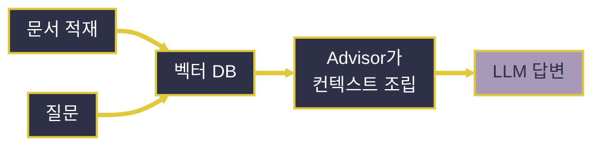

# Spring Boot 기반 RAG 구현

---
layout: default
---

# 학습 체크리스트 (1/2)

- [ ] Spring Boot에서 PostgreSQL과 pgvector를 연결하는 구조 이해
- [ ] `Document`와 `VectorStore`로 문서를 저장·검색하는 방식 습득
- [ ] SQL 대신 Spring AI 추상화로 벡터 저장소를 다루는 이유 이해

---
layout: default
---

# 학습 체크리스트 (2/2)

- [ ] `QuestionAnswerAdvisor`가 검색 결과를 프롬프트에 연결하는 과정 파악
- [ ] 문서 적재·청킹·임베딩·검색 흐름을 Spring AI로 구성
- [ ] `ChatClient`와 컨트롤러를 연결해 RAG 응답을 반환
- [ ] 검색 품질과 보안을 좌우하는 청킹·Top-K·메타데이터 필터 이해

---
layout: cover
class: text-center
---

# Spring Boot와 RAG 애플리케이션

---
layout: default
---

# Spring Boot에서 RAG가 동작하는 구조


- Spring Boot는 `DataSource`로 PostgreSQL 연결을 관리
- `PgVectorStore`는 문서의 임베딩 저장과 유사도 검색을 담당
- `QuestionAnswerAdvisor`가 검색 결과를 `ChatClient` 호출에 자동으로 결합

---
layout: default
---

# Spring AI가 SQL을 감추는 이유

- 애플리케이션 코드는 테이블·벡터 연산자를 직접 다루지 않고 `VectorStore`를 호출
- 저장은 `add()`, 검색은 `similaritySearch()`로 표현해 저장소 구현과 애플리케이션 로직을 분리
- Spring Boot 설정이 연결을 담당하고, Spring AI가 임베딩·검색·프롬프트 조립을 연결

---
layout: default
---

# Spring Boot 접속 설정

```properties
spring.datasource.url=jdbc:postgresql://ep-xxx.neon.tech/db
spring.datasource.username=${NEON_DB_USER}
spring.datasource.password=${NEON_DB_PASSWORD}
spring.datasource.hikari.maximum-pool-size=5
```

- Aiven은 서비스별 포트와 접속 정보를 제공하므로 Connection Details를 사용
- 무료 플랜은 커넥션 수 제한이 있어 HikariCP 풀 크기를 작게 설정

---
layout: cover
class: text-center
---

# Document와 VectorStore

---
layout: default
---

# Document 정의

> **Document**
>
> Spring AI에서 벡터 저장소가 다루는 데이터 단위로, 본문(content)·메타데이터(metadata)·식별자(id)로 구성

- 문서 조각 하나하나가 이 형태로 저장되고 검색됨

---
layout: default
---

# 본문과 메타데이터로 문서 만들기

```java
Document doc = new Document(
        "Spring AI는 VectorStore로 벡터 DB를 추상화한다.",
        Map.of("source", "guide.pdf", "category", "framework"));
```

---
layout: default
---

# 메타데이터의 역할

- 출처·페이지·작성일·부서 같은 부가 정보를 담음
- 검색 필터 조건으로 활용해 검색 범위를 좁힐 수 있음
- 화면에 출처를 표시하는 근거로도 사용됨

---
layout: default
---

# 왜 JSON으로 저장하는가

- Document마다 메타데이터 키가 제각각이라 고정 컬럼으로 정의하기 어려움
- JSON은 스키마 변경 없이 임의의 키를 담으면서도 필터링이 가능
- Spring AI 2.0 pgvector 자동 스키마의 metadata 컬럼은 `json` 타입 (`jsonb` 아님)

---
layout: default
---

# 임베딩은 언제 일어나는가

- Document를 만들 때는 벡터 필드가 비어 있는 상태
- `VectorStore.add()`를 호출하는 시점에 내부적으로 EmbeddingModel이 본문을 벡터화
- 개발자가 임베딩을 직접 호출할 필요가 없음

---
layout: default
---

# VectorStore 인터페이스

> **VectorStore**
>
> `add`(저장)·`similaritySearch`(검색)·`delete`(삭제)로 이루어진 단순한 계약

- 이 세 메서드만으로 벡터 저장소를 다룰 수 있음

---
layout: default
---

# 문서 저장하기

```java
vectorStore.add(List.of(doc1, doc2));
```

- 리스트로 여러 Document를 한 번에 전달하면 내부에서 배치 임베딩 수행

---
layout: default
---

# 유사한 문서 검색하기

```java
List<Document> results = vectorStore.similaritySearch(
        SearchRequest.builder()
                .query("벡터 DB를 어떻게 추상화하나요?")
                .topK(4)
                .similarityThreshold(0.7)
                .build());
```

---
layout: default
---

# filterExpression으로 범위 좁히기

- `category == 'framework' && year >= 2026`처럼 SQL과 비슷한 문자열로 메타데이터 조건을 표현
- Spring AI가 각 저장소의 네이티브 필터 문법으로 자동 번역
- "이 부서 문서 중에서만" 검색하는 식의 조건 적용에 사용

---
layout: default
---

# 저장소를 갈아 끼울 수 있다

- 위 `add`·`similaritySearch` 코드는 pgvector든 Chroma든 Pinecone이든 동일
- 저장소 교체는 의존성과 설정만 바꾸면 됨 = Portable Abstraction
- 애플리케이션 코드는 특정 벡터 DB에 종속되지 않음

---
layout: default
---

# PgVectorStore 의존성

```xml
<dependency>
    <groupId>org.springframework.ai</groupId>
    <artifactId>
        spring-ai-starter-vector-store-pgvector
    </artifactId>
</dependency>
```

---
layout: default
---

# PgVectorStore 설정

```properties
spring.ai.vectorstore.pgvector.initialize-schema=true
spring.ai.vectorstore.pgvector.dimensions=1536
spring.ai.vectorstore.pgvector.index-type=HNSW
spring.ai.vectorstore.pgvector.distance-type=COSINE_DISTANCE
```

- `PgVectorStore`는 `spring.datasource.*`의 커넥션을 그대로 사용

---
layout: default
---

# 자동 스키마 생성 주의점

- `initialize-schema=true`면 기동 시 테이블·인덱스를 자동 생성 (CREATE EXTENSION은 콘솔에서 미리 수행)
- 운영 환경에서는 false로 두고 마이그레이션 스크립트로 관리
- `dimensions` 값이 임베딩 모델과 불일치하면 저장 시점에 오류 발생

---
layout: cover
class: text-center
---

# 문서 적재하기

---
layout: default
---

# 적재의 3단계

| 단계 | 역할 |
| :--- | :--- |
| DocumentReader (Extract) | 원본 문서를 읽어 옴 |
| DocumentTransformer (Transform) | 조각내기 등 가공 수행 |
| DocumentWriter (Load) | 벡터 저장소에 기록 |

- `VectorStore` 자체가 DocumentWriter를 구현

---
layout: default
---

# 텍스트 파일을 벡터로 적재하기

```java
List<Document> docs = new TextReader(resource).get();
List<Document> chunks = TokenTextSplitter.builder().build().apply(docs);
vectorStore.add(chunks);
```

- `vectorStore.add(chunks)` 한 번으로 임베딩과 저장이 함께 이루어짐

---
layout: default
---

# 청킹이란

> **청킹 (Chunking)**
>
> 긴 문서를 검색 단위가 될 만한 크기의 조각으로 나누는 작업

- 조각 하나하나가 임베딩되어 벡터 저장소에 들어감

---
layout: default
---

# 조각이 너무 크면 / 너무 작으면

- **너무 크면**: 한 조각에 여러 주제가 섞여 벡터 의미가 흐려지고, 불필요한 내용까지 딸려와 토큰 낭비
- **너무 작으면**: 문맥이 끊겨 조각만으로 무슨 말인지 알 수 없고 정보가 흩어짐
- 적절한 크기는 문서 성격에 따라 실험으로 찾아야 함

---
layout: default
---

# 중첩 (Overlap)

- 조각 경계에서 문맥이 잘리는 것을 완화하려고 인접 조각을 일부 겹침
- 보통 조각 크기의 10~20% 정도를 중첩
- FAQ는 짧게, 기술 문서는 길게 — 몇 가지 설정으로 적재해 보고 검색 품질을 비교해 정하는 것이 실무 감각

---
layout: default
---

# 적재 운영에서 부딪히는 것들

- **중복 적재**: 같은 문서를 두 번 넣으면 검색 결과가 중복됨 — id를 원본 경로+조각 번호 해시로 고정해 재실행 시 덮어쓰기
- **RPM 제한**: 무료 티어 제약 때문에 적재를 기동 시 1회성 작업으로 분리하고 조각 수를 적당히 유지
- **갱신 전략**: 원본이 바뀌면 해당 문서 조각을 delete 후 재적재

---
layout: cover
class: text-center
---

# Advisor로 RAG 완성하기

---
layout: default
---

# QuestionAnswerAdvisor

> **QuestionAnswerAdvisor**
>
> 질문으로 벡터 저장소를 검색해 결과를 프롬프트에 자동으로 덧붙이는 내장 Advisor

- Spring AI 2.0에서는 별도 모듈 `spring-ai-vector-store-advisor` 의존성 필요

---
layout: default
---

# 의존성 추가

```xml
<dependency>
    <groupId>org.springframework.ai</groupId>
    <artifactId>spring-ai-vector-store-advisor</artifactId>
</dependency>
```

---
layout: default
---

# RAG용 ChatClient 구성

```java
@Bean
public ChatClient ragChatClient(
        ChatClient.Builder builder, VectorStore vectorStore) {
    return builder
            .defaultSystem("주어진 컨텍스트에만 근거해 한국어로 답하세요.")
            .defaultAdvisors(
                QuestionAnswerAdvisor.builder(vectorStore).build())
            .build();
}
```

---
layout: default
---

# Advisor가 대신 해 주는 네 가지

- ① 질문 임베딩
- ② `VectorStore.similaritySearch` 실행
- ③ 검색된 Document 본문을 컨텍스트로 조립해 사용자 메시지에 덧붙임
- ④ 그 상태로 LLM 호출

---
layout: default
---

# 시스템 메시지가 반드시 필요한 이유

- "컨텍스트에만 근거하라"는 제약이 없으면 모델이 검색 결과를 무시하고 자체 지식으로 답할 수 있음
- 환각을 억제하려면 이 지침을 시스템 메시지로 반드시 지정해야 함
- 근거 문서가 있어도 지침이 없으면 근거를 안 쓰는 경우가 생김

---
layout: default
---

# 호출마다 검색 범위 좁히기

```java
String answer = chatClient.prompt()
        .user(question)
        .advisors(a -> a.param(
            QuestionAnswerAdvisor.FILTER_EXPRESSION, "category == 'faq'"))
        .call()
        .content();
```

- 사용자 권한별 문서 격리 등 호출별로 검색 범위를 다르게 적용

---
layout: default
---

# 생성 모델 연결 — Groq

```properties
spring.ai.openai.api-key=${GROQ_API_KEY}
spring.ai.openai.base-url=https://api.groq.com/openai/v1
spring.ai.openai.chat.model=openai/gpt-oss-120b
spring.ai.openai.chat.temperature=0.2
```

- Spring AI 2.0에서는 `chat.options.*`가 아니라 위처럼 직접 지정

---
layout: default
---

# 빈 충돌과 temperature 주의

- Google GenAI 채팅 스타터와 OpenAI 호환(Groq) 스타터를 함께 쓰면 `ChatModel` 빈이 둘 생김 — `@Qualifier`나 `@Primary`로 명시
- RAG는 창작이 아니라 근거의 요약·인용이므로 temperature는 0~0.3으로 낮게
- topK를 크게 잡으면 토큰 한도에 먼저 걸림 — topK와 청크 크기가 비용에 직결

---
layout: default
---

# 질문을 받는 컨트롤러

```java
@PostMapping("/rag")
public String ask(@RequestParam String question, Model model) {
    String answer = ragChatClient.prompt()
            .user(question)
            .call()
            .content();
    model.addAttribute("answer", answer);
    return "rag";      // /WEB-INF/views/rag.jsp
}
```

- `ragChatClient`는 `RagConfig`에서 만든 빈을 생성자 주입으로 받음

---
layout: default
---

# 컨트롤러가 단순한 이유

- 검색·프롬프트 조립이 Advisor 안으로 숨겨져 애플리케이션 코드는 평범한 ChatClient 호출과 다르지 않음
- `.call().chatResponse()`로 받으면 컨텍스트에 사용된 Document 목록을 메타데이터에서 꺼내 출처로 표시 가능

---
layout: default
---

# 전체 흐름 한눈에 보기



---
layout: default
---

# RAG 품질을 좌우하는 요소

- **청킹**:
  - 조각 크기·중첩이 검색 품질에 가장 큰 영향을 줌
- **검색 파라미터**:
  - topK와 유사도 임계값 설정
- **프롬프트와 보안**:
  - 검색 문서는 신뢰할 수 없는 입력으로 취급, 사용자 권한 필터를 검색 전에 적용
- **임베딩 모델**:
  - 한국어 성능과 차원 수, 교체 시 전체 재임베딩이 필요하므로 초기에 신중히 결정

---
layout: default
---

# 학습 요약 (Summary)

- **Spring Boot 연결**:
  - `spring.datasource.*` 설정으로 PostgreSQL을 연결하고 `PgVectorStore`가 해당 연결을 사용
- **Spring AI 추상화**:
  - 애플리케이션은 SQL과 벡터 연산자 대신 `Document`·`VectorStore`의 저장·검색 API를 호출
- **RAG 자동화**:
  - `QuestionAnswerAdvisor`가 질문 임베딩, 유사도 검색, 컨텍스트 조립을 `ChatClient` 호출 앞에서 처리
- **애플리케이션 구조**:
  - 컨트롤러는 질문을 전달하고, Spring AI가 검색된 근거를 포함한 LLM 응답을 생성
