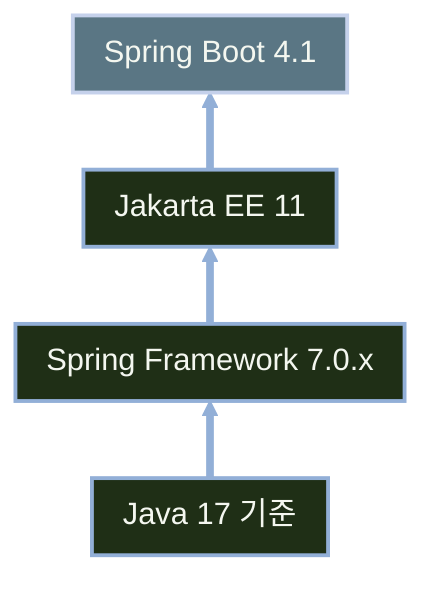
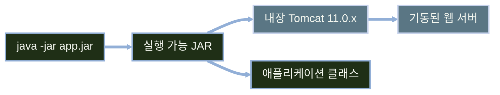

# Spring Boot 4와 Gradle

---
layout: default
---

# 학습 체크리스트 (1/2)

- [ ] Spring Boot 4.1을 기본으로 하되 라이브러리 호환성에 따라 4.0을 검토하는 기준 이해
- [ ] 본 과정의 JDK 17 기준과 실행 환경 확인
- [ ] 내장 서버(Embedded Server) 동작 방식과 실행 파일 형태 이해
- [ ] Spring Initializr를 이용한 프로젝트 생성 절차 습득

---
layout: default
---

# 학습 체크리스트 (2/2)

- [ ] Gradle 의존성 스코프(`implementation`·`compileOnly` 등)의 역할 구분
- [ ] BOM으로 의존성 버전을 일괄 관리하는 방법 이해
- [ ] Gradle Wrapper로 팀 전체의 Gradle 버전을 고정하는 방법 이해
- [ ] 내장 서버를 다른 서버로 교체하는 방법 습득

---
layout: cover
class: text-center
---

# Spring Boot 4 살펴보기

---
layout: default
---

# Spring Boot 4.1의 기반 스택



---
layout: default
---

# 구성 요소별 버전 요구사항

| 구성 요소 | 버전/요구사항 |
| :--- | :--- |
| Java | 17 (과정 기준) |
| Spring Framework | 7.0.x |
| Jakarta EE | 11 |
| Spring Boot | 4.1 |

---
layout: default
---

# Spring Boot 4.0과 4.1 선택 기준

- **기본 선택**: 신규 프로젝트는 유지보수 범위가 넓은 Spring Boot **4.1**을 우선 고려
- **호환성 예외**: MyBatis 등 일부 라이브러리는 아직 **Boot 4.0 전용 스타터**만 제공할 수 있음
- 사용하려는 스타터의 지원 버전을 확인한 뒤, 필요한 경우 프로젝트 전체를 **Boot 4.0**으로 맞춰 선택
- 두 버전 모두 본 과정의 **JDK 17 기준**에서 검토

---
layout: default
---

# JDK 17 기준과 가상 스레드의 범위

> **가상 스레드 (Virtual Threads)**
>
> OS 스레드보다 훨씬 가벼워 적은 자원으로 대량의 동시 요청을 처리할 수 있게 하는 JDK 경량 스레드

- 가상 스레드는 Java 21부터 정식 지원되지만, 본 과정의 JDK 17 기준에는 포함하지 않음

---
layout: default
---

# 본 과정의 Java 버전 기준

- **Java 17**: 강의·실습·예제 코드의 기본 실행 버전
- Spring Initializr 프로젝트 생성 시 Java 버전도 **17**로 설정
- Java 21 이상은 본 과정에서 요구하지 않으며, 별도 실습 범위로 다루지 않음

---
layout: default
---

# Spring Boot 3.5 지원 종료 일정

- **OSS 지원 종료**: 3.5 버전은 2026-06-30에 오픈소스 지원 종료
- **신규 프로젝트 기준**: 유지보수 중인 4.1을 기본값으로 선택
- 지원 종료 이후에는 보안 패치를 받을 수 없음

---
layout: default
---

# Spring Boot 4.1의 gRPC 지원 추가

- **Spring gRPC**: 서버·클라이언트·테스트 모듈이 4.0 대비 신규 추가
- **OpenTelemetry**: 분산 추적 관련 통합이 개선됨
- gRPC 통신을 스프링 관례(자동 구성·DI) 그대로 사용 가능

---
layout: default
---

# gRPC 테스트 전용 스타터

- `spring-boot-starter-grpc-client-test`
- `spring-boot-starter-grpc-server-test`
- 테스트 코드에서 gRPC 클라이언트·서버를 별도 목(mock) 구현 없이 검증 가능

---
layout: cover
class: text-center
---

# 실행 환경과 프로젝트 생성

---
layout: default
---

# 내장 서버란

> **내장 서버 (Embedded Server)**
>
> 별도의 WAS 설치 없이 애플리케이션 실행 파일 안에 서블릿 컨테이너를 함께 담아 배포하는 방식

- Boot 4는 **Servlet 6.1** 스펙을 기준으로 동작
- 스펙을 구현하는 서블릿 컨테이너 중 검증된 두 종을 내장 지원
- 별도 톰캣 설치·배포 과정 없이 `java -jar` 한 번으로 기동

---
layout: default
---

# 내장 서버 지원 현황

| 서블릿 컨테이너 | 버전 | Boot 4 지원 |
| :--- | :--- | :--- |
| Tomcat | 11.0.x | O |
| Jetty | 12.1.x | O |

---
layout: default
---

# 실행 가능 JAR의 내부 구조



---
layout: default
---

# 프로젝트 생성 시작점

- **`start.spring.io`**:
  - Spring Initializr 공식 사이트, 프로젝트 뼈대를 생성해 다운로드
- **본 과정 기준 선택**:
  - Spring Boot **4.1**, Java **17**, Gradle
- 의존성은 필요한 스타터만 검색해 추가하고, 지원 버전이 4.0으로 제한되는지 확인

---
layout: default
---

# Java 17 기준

- **Java 17**:
  - 본 과정의 개발·실행·배포 예제에서 사용하는 기준 버전
- IDE와 Gradle이 JDK 17을 사용하도록 환경을 먼저 확인
- 더 높은 JDK 버전은 본 과정의 필수 조건이 아님

---
layout: default
---

# 프로젝트 생성 항목 정리

| 항목 | 선택 값 |
| :--- | :--- |
| Project | Gradle - Groovy |
| Language | Java |
| Spring Boot | 4.1.x (기본) |
| Java | 17 |
| Dependencies | 실습 대상 스타터 |

- Project 항목의 "Groovy"는 빌드 스크립트(`build.gradle`) 문법을 뜻하며, Language는 Java로 유지
- Kotlin DSL(`build.gradle.kts`)도 사용할 수 있지만, 본 과정의 예제는 Groovy DSL을 기준으로 작성

---
layout: cover
class: text-center
---

# Gradle 의존성과 Wrapper

---
layout: default
---

# 의존성 범위(Scope) 구분

| 범위 | 용도 |
| :--- | :--- |
| `implementation` | 일반 애플리케이션 의존성 |
| `runtimeOnly` | 실행 시에만 필요 (예: JDBC 드라이버) |
| `compileOnly` | 컴파일에만 필요 (예: Lombok) |
| `testImplementation` | 테스트 전용 |

- 범위를 구분하면 빌드 결과물의 크기와 컴파일 속도가 최적화됨

---
layout: default
---

# 의존성 범위별 선언 예시

```groovy
dependencies {
    implementation 'org.springframework.boot:spring-boot-starter-webmvc'
    runtimeOnly 'com.mysql:mysql-connector-j'
    compileOnly 'org.projectlombok:lombok'
    testImplementation 'org.springframework.boot:spring-boot-starter-test'
}
```

- 실제 프로젝트에서 가장 자주 쓰이는 조합

---
layout: default
---

# BOM으로 버전 생략

> **자재 명세서 (BOM, Bill of Materials)**
>
> 하위 모듈들의 버전 조합을 한곳에서 관리하여, 개별 의존성마다 버전을 지정하지 않아도 되게 하는 목록

- Spring Boot Gradle 플러그인이 Boot BOM을 자동으로 관리함
- Boot가 관리하는 의존성은 버전 표기를 생략 가능
- Spring AI처럼 별도 BOM이 있는 프로젝트는 해당 BOM을 추가로 등록

---
layout: default
---

# 버전이 사라진 선언

```groovy
dependencies {
    // 버전 표기 없음 → Boot BOM이 결정
    implementation 'org.springframework.boot:spring-boot-starter-webmvc'
}
```

- 버전 불일치로 인한 충돌을 Boot BOM이 대신 방지

---
layout: default
---

# Gradle Wrapper로 빌드 버전 고정

- 팀원과 CI가 같은 Gradle 버전으로 빌드하도록 보장
- 별도 Gradle 설치 없이 `./gradlew`로 명령 실행

---
layout: default
---

# 의존성 확인 명령

| 명령 | 용도 |
| :--- | :--- |
| `./gradlew dependencies` | 전체 의존성 트리 확인 |
| `./gradlew dependencyInsight --dependency <name>` | 특정 라이브러리가 선택된 이유 확인 |

---
layout: default
---

# 내장 서버 교체

```groovy
dependencies {
    implementation('org.springframework.boot:spring-boot-starter-webmvc') {
        exclude module: 'spring-boot-starter-tomcat'
    }
    implementation 'org.springframework.boot:spring-boot-starter-jetty'
}
```

- 기본 Tomcat 스타터를 제외한 뒤 Jetty 스타터를 추가

---
layout: default
---

# 학습 요약 (Summary)

- **Spring Boot 4.1 스택**:
  - Spring Framework 7.0.x·Jakarta EE 11 기반이며 본 과정은 Java 17을 기준으로 실행
- **Boot 버전 선택**:
  - 4.1을 기본으로 검토하되, MyBatis 등 스타터 호환성이 필요한 경우 4.0을 선택
- **실행 환경과 내장 서버**:
  - 별도 WAS 설치 없이 내장 Tomcat으로 실행 가능한 독립 실행형 애플리케이션 구조
- **프로젝트 생성**:
  - Spring Initializr로 스타터를 선택해 표준화된 디렉터리 구조의 프로젝트를 생성
- **Gradle 의존성과 Wrapper**:
  - `implementation` 등 범위로 의존성을 구분하고, Wrapper로 팀 전체가 동일한 Gradle 버전 사용
