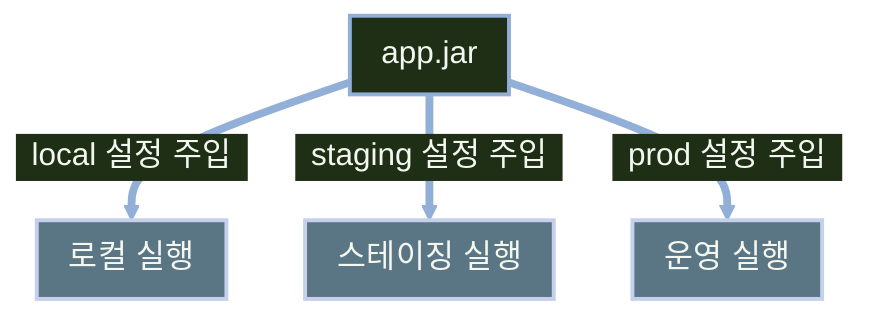

# application.yml과 외부 설정

---
layout: default
---

# 학습 체크리스트 (1/2)

- [ ] 외부화 설정 개념과 하나의 JAR를 여러 환경에서 재사용하는 방식 이해
- [ ] `application.properties`와 `application.yml`의 차이와 우선순위 파악
- [ ] 설정 값을 찾는 우선순위(커맨드라인·환경 변수·파일)의 원리 이해
- [ ] Relaxed Binding으로 환경 변수와 설정 키가 매핑되는 규칙 습득

---
layout: default
---

# 학습 체크리스트 (2/2)

- [ ] 프로파일(Profile)로 환경별 설정을 분리하고 활성화하는 방법 습득
- [ ] `@Value`로 단일 설정 값을 주입하는 방법 이해
- [ ] `@ConfigurationProperties`로 설정 묶음을 객체로 바인딩하는 방법 습득
- [ ] `spring.config.import`로 `.env` 파일의 설정을 가져오는 방법 습득

---
layout: cover
class: text-center
---

# 외부화 설정

---
layout: default
---

# 외부화 설정이란

> **외부화 설정 (Externalized Configuration)**
>
> 코드에 값을 직접 넣지 않고, 실행 환경에서 설정을 주입받아 동작을 결정하는 방식

- 코드와 환경별 설정 값을 분리해 관리
- 같은 산출물을 재빌드 없이 여러 환경에 배포 가능
- Spring Boot는 파일·환경 변수·인자 등 다양한 소스에서 설정을 읽어들임

---
layout: default
---

# 하나의 JAR, 여러 실행 환경



---
layout: default
---

# 설정 파일 형식 지원

| 형식 | 확장자 | 특징 |
| :--- | :--- | :--- |
| Properties | `.properties` | `key=value` 한 줄 표기 |
| YAML | `.yml` | 계층 구조를 들여쓰기로 표현 |
| 우선순위 | - | 같은 위치에 둘 다 있으면 `.properties`가 우선 적용 |

- 두 형식 모두 `application` 이름으로 자동 인식됨

---
layout: default
---

# 같은 설정, 두 가지 표기

```properties
spring.datasource.url=jdbc:mysql://localhost:3306/aibe
spring.datasource.username=aibe_user
```

```yaml
spring:
  datasource:
    url: jdbc:mysql://localhost:3306/aibe
    username: aibe_user
```

- YAML은 공통 접두사(`spring.datasource`)를 계층으로 묶어 표현

---
layout: default
---

# 운영 값 주입 원칙

- 설정 파일에는 로컬 개발 기준의 **기본값**만 기록
- 배포 환경의 실제 값은 **환경 변수**·**시스템 프로퍼티**·**커맨드라인 인자**로 주입
- 운영 값(DB 접속 정보 등)을 파일에 하드코딩하지 않음
- 같은 JAR가 값 주입만으로 각 환경에 맞게 동작

---
layout: cover
class: text-center
---

# 설정 우선순위

---
layout: default
---

# 같은 키, 여러 출처

- 같은 설정 키가 여러 출처에 동시에 존재할 수 있음
- 이때 **우선순위가 높은 출처의 값이 낮은 출처의 값을 덮어씀**
- 정확한 전체 순서는 Spring Boot 공식 문서 기준이며, 여기서는 실무에서 자주 쓰는 흐름만 정리
- 배포 단계(로컬 → 운영)에서 값을 바꾸는 핵심 원리

---
layout: default
---

# 우선순위 표 (실무 기준)

| 우선순위(높음→낮음) | 출처 | 예시 |
| :--- | :--- | :--- |
| 1 | 커맨드라인 인자 | `--server.port=9090` |
| 2 | 환경 변수·시스템 프로퍼티 | `SERVER_PORT=9090` |
| 3 | 외부 프로파일 설정 | `application-prod.yml` |
| 4 | 외부 기본 설정 | 외부 `application.yml` |
| 5 | JAR 내부 설정 | `classpath:/application.yml` |

---
layout: default
---

# 값이 덮어써지는 흐름


---
layout: default
---

# 실행 시 값 덮어쓰기

```bash
# 커맨드라인 인자로 덮어씀 (우선순위 1)
java -jar app.jar --server.port=9090

# 환경 변수로 덮어씀 (우선순위 2)
SERVER_PORT=9090 java -jar app.jar
```

- 둘 다 `application.yml`의 `server.port` 값보다 우선 적용됨

---
layout: default
---

# 완화된 바인딩(Relaxed Binding)

> **완화된 바인딩 (Relaxed Binding)**
>
> 환경 변수 표기 규칙(점·하이픈 미지원)에 맞춰 프로퍼티 키를 자동으로 변환해 매칭하는 방식

- 환경 변수는 대문자만 사용 가능하며 점·하이픈을 표현할 수 없음
- 점(`.`)은 밑줄(`_`)로, 하이픈(`-`)은 제거되어 매칭됨

---
layout: default
---

# 변환 규칙 표

| YAML/프로퍼티 표기 | 환경 변수 표기 |
| :--- | :--- |
| `.` (점) | `_` (밑줄) |
| `-` (하이픈) | 제거 |
| `my.service.remote-address` | `MY_SERVICE_REMOTEADDRESS` |

---
layout: cover
class: text-center
---

# 프로파일

---
layout: default
---

# 프로파일이란

> **프로파일 (Profile)**
>
> 환경(local·prod 등)에 따라 서로 다른 설정 값을 적용할 수 있게 하는 논리적 그룹

- 같은 애플리케이션 코드를 환경별로 다른 설정으로 구동
- 값 자체가 아니라 값의 집합을 환경 단위로 전환하는 개념

---
layout: default
---

# 설정 분리 방식 두 가지

| 방식 | 설명 |
| :--- | :--- |
| 파일 분리 | `application-local.yml`, `application-prod.yml`처럼 파일 자체를 나눔 |
| 문서 분리 | 한 파일 안에서 `---`로 여러 문서를 나눔 |

---
layout: default
---

# 문서 활성 조건 지정

- 문서 분리 방식에서는 `spring.config.activate.on-profile` 키로 활성 프로파일을 지정
- 해당 프로파일이 활성화된 경우에만 그 문서의 설정이 적용됨

---
layout: default
---

# 다중 문서 YAML 예시

```yaml
server:
  port: 8080
---
spring.config.activate.on-profile: prod
server:
  port: 9090
```

- `prod` 프로파일이 활성화되면 두 번째 문서가 `server.port`를 덮어씀

---
layout: default
---

# 활성 프로파일 지정

- 설정 파일에서 `spring.profiles.active=local`로 기본 활성 프로파일 지정
- 실행 시에는 `--spring.profiles.active=prod`로 재지정 가능
- 쉼표로 구분하면 여러 프로파일을 동시에 활성화 가능
- 커맨드라인 인자가 설정 파일의 값보다 우선 적용됨

---
layout: default
---

# 복수 프로파일 활성화 예시

```yaml
spring:
  profiles:
    active: "local,logging"
```

---
layout: default
---

# 빈 단위 조건부 등록

```java
@Bean
@Profile("prod")
public DataSource dataSource() {
    return new ProdDataSource();
}
```

- `@Profile("prod")`가 붙은 빈은 `prod` 프로파일 활성 시에만 등록됨

---
layout: default
---

# `@Profile`과 `@Qualifier` 비교

| 구분 | `@Profile` | `@Qualifier` |
| :--- | :--- | :--- |
| 판단 기준 | 활성 프로파일 | 같은 타입의 Bean 후보 |
| 역할 | Bean 등록 여부 결정 | 주입할 Bean 선택 |
| 사용 시점 | 환경별 구성 전환 | 같은 환경에서 구현체 구분 |
| 결과 | 비활성 Bean은 등록되지 않음 | 후보 중 지정 Bean을 주입 |

---
layout: cover
class: text-center
---

# 설정값 주입

---
layout: default
---

# 단일 값 주입: `@Value`

```java
@Value("${app.mail.host}")
String host;

// 기본값 지정 문법
@Value("${app.mail.timeout:5000}")
int timeout;
```

- 콜론(`:`) 뒤에 기본값을 지정하면 프로퍼티 부재 시 대체됨

---
layout: default
---

# `@Value` vs `@ConfigurationProperties`

| 구분 | `@Value` | `@ConfigurationProperties` |
| :--- | :--- | :--- |
| 대상 단위 | 단일 값 | 설정 묶음(prefix) |
| 타입 변환 | 제한적 | 폭넓게 자동 지원 |
| 검증 | 별도 처리 필요 | `@Validated`로 통합 지원 |
| 적합한 경우 | 값 한두 개 | 연관된 설정 그룹 |

---
layout: default
---

# 설정 묶음을 record로 바인딩

```java
@ConfigurationProperties("app.mail")
@Validated
record MailProperties(
    @NotBlank String host,
    Duration timeout
) {}
```

- 불변 객체로 설정값을 안전하게 보관

---
layout: default
---

# record 바인딩 대상 yml

```yaml
app:
  mail:
    host: smtp.example.com
    timeout: 5s
```

- 필드명과 프로퍼티 키가 relaxed binding 규칙으로 자동 매칭

---
layout: default
---

# `@ConfigurationProperties` 스캔 등록

```java
@SpringBootApplication
@ConfigurationPropertiesScan
class Application {}
```

- 어노테이션이 붙은 설정 클래스를 자동으로 찾아 빈으로 등록

---
layout: default
---

# 타입 변환과 기동 시점 검증

- **`Duration` 변환**: `5s`·`10m` 같은 문자열이 `Duration` 타입으로 자동 변환됨
- **`@Validated`**: `@NotBlank` 등 제약 조건 위반 시 애플리케이션 기동이 즉시 실패
- 운영 중 오류가 아닌 **기동 시점**에 잘못된 설정을 조기 발견

---
layout: default
---

# 설정값 주입 흐름


---
layout: cover
class: text-center
---

# 외부 `.env` 설정

---
layout: default
---

# `.env` 파일 가져오기

- Spring Boot는 `.env` 파일을 기본 설정 파일로 자동 로드하지 않음
- `spring.config.import`로 외부 설정 파일을 명시적으로 추가
- 확장자가 없는 `.env`는 `[.properties]` 힌트로 형식을 지정
- `optional:`을 붙이면 파일이 없어도 애플리케이션 기동 가능
- 비밀 값이 포함된 `.env`는 버전 관리에 커밋하지 않음

---
layout: default
---

# `application.yml`에서 `.env` 가져오기

```yaml
spring:
  config:
    import: "optional:file:./.env[.properties]"

app:
  name: ${APP_NAME}
  timeout: ${APP_TIMEOUT}
```

---
layout: default
---

# `.env` 설정 예시

```properties
APP_NAME=my-service
APP_TIMEOUT=5s
```

---
layout: default
---

# 학습 요약 (1/2)

- **외부화 설정**:
  - 코드와 분리된 설정 파일·환경 변수로 값을 주입해 배포 환경별 유연성 확보
- **설정 우선순위와 relaxed binding**:
  - 여러 설정 소스 간 우선순위 규칙과 대소문자·구분자 표기를 완화해 매칭하는 바인딩 방식 이해
- **프로파일**:
  - 환경별로 설정을 분리해 활성화하는 방법 습득

---
layout: default
---

# 학습 요약 (2/2)

- **설정값 주입**:
  - 단일 값은 `@Value`, 연관 설정 묶음은 `@ConfigurationProperties` record로 타입 변환·검증까지 함께 처리
- **외부 `.env` 설정**:
  - `spring.config.import`와 확장자 힌트로 `.env` 값을 Spring 설정에 추가
