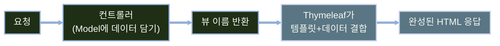

# Thymeleaf 기초

---
layout: default
---

# 학습 체크리스트 (1/2)

- [ ] SSR 개념과 Thymeleaf의 서버 사이드 렌더링 동작 방식 이해
- [ ] `templates` 디렉터리 규약과 캐시 설정(`spring.thymeleaf.cache`) 파악
- [ ] 컨트롤러의 뷰 이름 반환이 실제 템플릿 경로로 해석되는 방식 습득
- [ ] `${}`·`#{}`·`@{}` 표현식과 메시지 리소스 기반 국제화(i18n) 이해

---
layout: default
---

# 학습 체크리스트 (2/2)

- [ ] `th:text`와 `th:utext`의 이스케이프 차이와 XSS 위험 이해
- [ ] `th:if`·`th:switch`로 조건부 렌더링을 처리하는 방법 습득
- [ ] `th:each` 반복과 상태 변수(`index`·`count` 등) 활용법 이해
- [ ] `@{}` 표현식으로 URL을 생성하는 방법 습득

---
layout: cover
class: text-center
---

# Thymeleaf와 SSR

---
layout: default
---

# SSR이란

> **서버 사이드 렌더링 (SSR, Server-Side Rendering)**
>
> 컨트롤러가 `Model`에 데이터를 담고 뷰 이름을 반환하면, Thymeleaf가 템플릿과 데이터를 조합해 서버에서 HTML을 렌더링하는 방식

- 브라우저가 아닌 서버에서 완성된 HTML을 만들어 응답
- 클라이언트는 별도 렌더링 없이 완성된 화면을 즉시 받음

---
layout: default
---

# 요청 처리 흐름



---
layout: default
---

# 의존성과 디렉터리 규약

- `spring-boot-starter-thymeleaf` 의존성 추가만으로 자동 설정 적용
- 기본적으로 `src/main/resources/templates/` 아래의 HTML 파일을 템플릿으로 인식
- 정적 리소스(CSS·JS·이미지)는 템플릿과 별도 경로에 위치

---
layout: default
---

# 기본 경로 규약 표

| 항목 | 기본값 |
| :--- | :--- |
| 템플릿 위치 | `src/main/resources/templates/` |
| 접두사/확장자 | `.html` |
| 정적 리소스 | `src/main/resources/static/` |

---
layout: default
---

# 캐시 설정

```yaml
spring.thymeleaf.cache: false # 개발 시
```

- 개발 중엔 캐시를 꺼서 수정 사항이 즉시 반영되도록 설정, 운영에서는 기본값(캐시 사용) 유지

---
layout: default
---

# 컨트롤러의 뷰 이름 반환

```java
@GetMapping("/users")
String users(Model model) { return "users/list"; }
```

- 반환한 문자열은 `templates/` 아래 템플릿 경로로 해석됨

---
layout: default
---

# 뷰 이름과 파일 경로 매핑

| 반환값 | 실제 파일 |
| :--- | :--- |
| `"users/list"` | `templates/users/list.html` |

---
layout: cover
class: text-center
---

# 기본 표현식

---
layout: default
---

# 세 가지 표현식

| 표현식 | 이름 | 접근 대상 |
| :--- | :--- | :--- |
| `${...}` | 변수 표현식 | `Model`에 담긴 속성 |
| `#{...}` | 메시지 표현식 | 메시지 리소스와 국제화(i18n) |
| `@{...}` | 링크 표현식 | 컨텍스트 경로를 반영한 URL |

- 용도에 따라 셋 중 하나를 골라 사용

---
layout: default
---

# 변수 표현식: `${...}`

```html
<span th:text="${user.name}">이름</span>
```

- `Model`에 담긴 `user` 객체의 `name` 속성을 출력

---
layout: default
---

# 국제화(i18n)란

> **국제화 (Internationalization, i18n)**
>
> 하나의 애플리케이션이 사용자의 언어와 지역에 맞는 화면 문구를 제공하도록 설계하는 것

- `i18n`은 `i`와 `n` 사이의 18글자를 줄인 표현
- 화면 문구를 템플릿에서 분리해 언어별 메시지 리소스로 관리
- 현재 Locale에 맞는 리소스를 선택해 같은 화면을 여러 언어로 제공

---
layout: default
---

# 메시지 표현식: `#{...}`

> **메시지 표현식 (Message Expression)**
>
> `#{key}`로 현재 Locale에 맞는 외부 메시지를 조회하는 표현식

- 표현식 안에는 화면 문구가 아닌 메시지 키를 작성
- 같은 키라도 Locale에 따라 서로 다른 문구를 반환
- 조회된 값은 `th:text` 등의 속성을 통해 HTML에 출력

---
layout: default
---

# 메시지 리소스 파일 구성

| 파일 | 역할 |
| :--- | :--- |
| `messages.properties` | 기본 메시지와 Locale 미일치 시 대체값 |
| `messages_ko.properties` | 한국어 Locale 메시지 |
| `messages_en.properties` | 영어 Locale 메시지 |

- 기본 위치는 `src/main/resources`, 기본 basename은 `messages`
- 언어별 파일만 두지 않고 기본 `messages.properties`도 함께 작성

---
layout: default
---

# 메시지 리소스 정의 예시

```properties
# messages.properties
page.title=User List

# messages_ko.properties
page.title=사용자 목록
```

---
layout: default
---

# 메시지 표현식 사용 예시

```html
<h1 th:text="#{page.title}">제목</h1>
```

---
layout: default
---

# 링크 표현식: `@{...}`

```html
<a th:href="@{/users}">목록</a>
```

- 컨텍스트 경로를 자동으로 붙여 최종 URL을 생성

---
layout: default
---

# `th:` 속성의 동작 원리

- 태그 안의 기존 내용(`이름`, `제목`, `목록`)은 정적 목업용 더미 텍스트
- 서버 렌더링 시 더미 텍스트가 `th:` 속성 값으로 **치환됨**
- 디자이너가 서버 없이 브라우저에서 파일을 열어도 목업 화면 확인 가능
- 이러한 특성을 **내추럴 템플릿(Natural Template)이라 부름**

---
layout: default
---

# 세 표현식 조합

```html
<a th:href="@{/users/{id}(id=${user.id})}" th:text="${user.name}">사용자</a>
```

- `@{}`로 URL을 만들고 `${}`로 링크 텍스트를 채우는 조합

---
layout: cover
class: text-center
---

# 출력과 XSS

---
layout: default
---

# Spring Boot 세대와 인라인 문법

| Spring Boot | 기본 Thymeleaf | 인라인 문법의 변화 |
| :--- | :--- | :--- |
| 1.x | 2.1 | 이스케이프 출력 `[[...]]` 지원 |
| 2.x | 3.0 | 비이스케이프 출력 `[(...)]` 추가, 본문 인라이닝 기본 활성화 |
| 3.x / 4.x | 3.1 | 같은 문법을 유지하며 현재 환경에서도 그대로 사용 |

- 현재는 HTML 본문에서 `[[...]]`과 `[(...)]`을 별도 설정 없이 사용할 수 있음

---
layout: default
---

# 본문에서 쓰는 인라인 표기

```html
<p>안녕하세요, [[${user.name}]]님</p>
<p>[(${trustedHtml})]</p>
```

---
layout: default
---

# 이스케이프 여부 비교

| 문법 | 인라인 문법 | 이스케이프 | 용도 |
| :--- | :--- | :--- | :--- |
| `th:text` | `[[${...}]]` | O | 일반 텍스트 출력 |
| `th:utext` | `[(${...})]` | X | 신뢰할 수 있는 HTML 출력 |

- 기본은 항상 `th:text` 사용을 권장

---
layout: default
---

# XSS란

> **XSS (Cross-Site Scripting)**
>
> 악성 스크립트를 웹 페이지에 삽입해 사용자 브라우저에서 실행되게 하는 공격

- 사용자 입력을 이스케이프 없이 그대로 출력할 때 발생

---
layout: default
---

# 이스케이프 적용 비교

```html
<span th:text="${user.name}">이름</span>
<span th:utext="${trustedHtml}">신뢰할 수 있는 HTML</span>
```

- `th:text`는 특수 문자를 이스케이프, `th:utext`는 그대로 출력

---
layout: default
---

# `<script>` 입력 시 차이

| 속성 | 사용자 입력에 `<script>` 포함 시 |
| :--- | :--- |
| `th:text` | 문자 그대로 화면에 표시됨(실행 안 됨) |
| `th:utext` | 스크립트가 그대로 실행될 수 있음 |

- `th:utext`는 **신뢰할 수 있는 HTML에만** 제한적으로 사용

---
layout: cover
class: text-center
---

# 조건과 반복

---
layout: default
---

# 조건 속성 세 가지

| 속성 | 동작 |
| :--- | :--- |
| `th:if` | 조건이 참일 때만 태그를 렌더링 |
| `th:unless` | 조건이 거짓일 때만 태그를 렌더링 |
| `th:switch` / `th:case` | 값에 따라 여러 갈래 중 하나를 렌더링 |

---
layout: default
---

# `th:if` 조건부 렌더링

```html
<p th:if="${user.active}">활성 사용자</p>
```

- `user.active`가 `true`일 때만 `<p>` 태그가 생성됨

---
layout: default
---

# `th:switch` / `th:case` 분기

```html
<div th:switch="${user.role}">
  <p th:case="'ADMIN'">관리자</p>
  <p th:case="'USER'">일반 사용자</p>
  <p th:case="*">알 수 없음</p>
</div>
```

- `th:case="*"`는 앞선 값과 일치하지 않을 때의 기본값

---
layout: default
---

# 숨김이 아니라 미생성

- `th:if` 조건이 거짓이면 태그 자체가 결과 HTML에 존재하지 않음
- CSS로 감추는 방식(`display: none`)과는 다른 동작임
- 브라우저 개발자 도구에서도 해당 요소를 확인할 수 없음
- 조건이 거짓인 요소는 클라이언트로 전송조차 되지 않음

---
layout: default
---

# `th:each` 컬렉션 순회

```html
<ul>
  <li th:each="user : ${users}" th:text="${user.name}">사용자</li>
</ul>
```

- `users` 컬렉션의 각 항목마다 `<li>` 태그가 반복 생성됨

---
layout: default
---

# 반복 상태 변수

| 변수 | 의미 |
| :--- | :--- |
| `index` | 0부터 시작하는 순번 |
| `count` | 1부터 시작하는 순번 |
| `first` / `last` | 첫 번째 / 마지막 요소 여부 |
| `size` | 전체 요소 개수 |

---
layout: default
---

# 상태 변수 사용

```html
<li th:each="user, stat : ${users}">
  <span th:text="${stat.count}">1</span>번째: <span th:text="${user.name}"></span>
</li>
```

---
layout: default
---

# 컬렉션이 목록으로 렌더링되는 흐름

```mermaid
---
config:
  themeVariables:
    lineColor: "#92AFD7"
    arrowheadColor: "#92AFD7"
    edgeLabelBackground: "#1F2F16"
  flowchart:
    padding: 8
    nodeSpacing: 40
    rankSpacing: 40
---
flowchart LR
  M["Model 속성 users"] -->|"<span style='padding:8px;color:#F4F7F0;'>th:each 순회</span>"| E["항목별 반복 처리"]
  E -->|"<span style='padding:8px;color:#F4F7F0;'>항목마다 생성</span>"| L["li 태그 생성"]
  L --> H["완성된 목록 HTML"]

  class M,E step
  class L,H result
  classDef step fill:#1F2F16,stroke:#92AFD7,color:#F4F7F0,stroke-width:2px
  classDef result fill:#5A7684,stroke:#C5D1EB,color:#F4F7F0,stroke-width:2px
  linkStyle default stroke:#92AFD7,stroke-width:4px
```



---
layout: cover
class: text-center
---

# URL 표현식

---
layout: default
---

# URL 표현식 문법 패턴

| 용도 | 문법 |
| :--- | :--- |
| 경로 변수 | `@{/users/{id}(id=${user.id})}` |
| 쿼리 파라미터 | `@{/users(page=1)}` |
| 정적 경로 | `@{/css/app.css}` |

---
layout: default
---

# 경로 변수를 포함한 링크

```html
<a th:href="@{/users/{id}(id=${user.id})}">상세</a>
```

- `{id}` 자리에 괄호 안의 `id` 값이 치환됨

---
layout: default
---

# 문자열 연결 대신 `@{}`를 쓰는 이유

| 구분 | 문자열 직접 연결 | `@{}` URL 표현식 |
| :--- | :--- | :--- |
| 컨텍스트 경로 | 수동으로 반영해야 함 | 자동으로 반영됨 |
| 특수 문자 인코딩 | 직접 처리 필요 | 자동으로 안전하게 처리됨 |
| 배포 환경 변경 | 경로 하드코딩 위험 | 환경 변화에 안전함 |

---
layout: default
---

# 학습 요약 (1/2)

- **Thymeleaf와 SSR**:
  - 서버가 HTML을 완성해 응답하는 서버 사이드 렌더링 방식과 템플릿 엔진의 역할 이해
- **기본 표현식**:
  - `${}`·`#{}`·`@{}`의 용도와 메시지 리소스 기반 국제화(i18n) 출력 방식 이해
- **출력과 XSS**:
  - `th:text`의 자동 이스케이프와 `th:utext`의 위험성, XSS 방지 원칙 이해

---
layout: default
---

# 학습 요약 (2/2)

- **조건과 반복**:
  - `th:if`/`th:unless`/`th:switch`로 조건부 렌더링을, `th:each`와 상태 변수로 반복 렌더링을 처리
- **URL 표현식**:
  - `@{}` 문법으로 경로 변수·쿼리 파라미터를 안전하게 조합해 URL 생성
