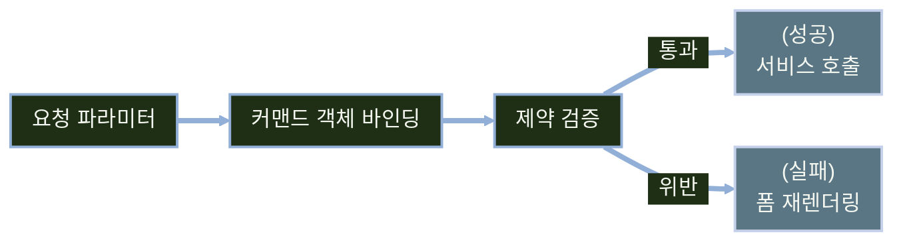
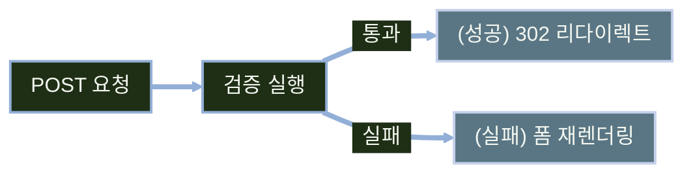

# 입력값 검증과 Bean Validation

---
layout: default
---

# 학습 체크리스트 (1/2)

- [ ] Bean Validation 표준과 Hibernate Validator 구현체의 관계 이해
- [ ] `spring-boot-starter-validation` 의존성과 자동 구성 파악
- [ ] 표준 제약 어노테이션과 `@NotNull`·`@NotEmpty`·`@NotBlank`의 차이 습득
- [ ] 대부분의 제약이 null을 통과시키는 특성과 필수 제약 병행 선언 이해

---
layout: default
---

# 학습 체크리스트 (2/2)

- [ ] `@Valid`와 `BindingResult`로 폼 검증 결과를 받아 처리하는 방법 습득
- [ ] 검증 실패 시 리다이렉트 대신 폼을 다시 렌더링하는 이유 이해
- [ ] `th:errors`·`th:errorclass`·`#fields`로 오류를 화면에 표시하는 방법 습득
- [ ] DTO·엔티티·DB 제약의 역할 분담과 검증 적용 지점 이해

---
layout: cover
class: text-center
---

# 선언적 검증의 도입

---
layout: default
---

# 같은 검증 규칙이 흩어지는 문제

- 컨트롤러 메서드마다 널·길이·형식 체크를 if문으로 반복하면 같은 규칙이 여러 곳에 중복됨
- 제약을 컨트롤러 코드가 아니라 DTO 타입 위에 어노테이션으로 선언하면 규칙이 한 곳에 모임
- 폼 처리·API 요청 등 여러 진입점에서 같은 DTO를 재사용하면 검증 로직도 함께 재사용됨

---
layout: default
---

# if문 반복 검증의 전형적인 모습

```java
if (form.getTitle() == null || form.getTitle().isBlank())
    throw new IllegalArgumentException("제목 필수");
if (form.getPrice() < 0)
    throw new IllegalArgumentException("가격 오류");
```

- 같은 형태의 검사가 다른 컨트롤러에도 그대로 반복됨

---
layout: default
---

# 제약의 표준과 구현체: Bean Validation

- 제약을 선언적으로 표현하는 표준이 Jakarta Validation(`jakarta.validation.*`)
- Hibernate Validator가 그 표준의 구현체

> **빈 검증 (Bean Validation)**
>
> 객체의 필드에 제약 어노테이션을 선언해 검증 규칙을 표현하는 표준 스펙

---
layout: default
---

# 표준 스펙과 구현체의 역할 분담

| 구분 | 역할 | 예 |
| :--- | :--- | :--- |
| 표준 스펙 | 제약 어노테이션과 검증 규약 정의 | `jakarta.validation.*` |
| 구현체 | 실제 검증 수행 | Hibernate Validator |
| 스프링 연동 | 검증 지점에서 구현체 호출 | Spring MVC / `@Valid` |

---
layout: default
---

# 검증 구현체를 가져오는 의존성 추가

- Spring Boot 4의 `spring-boot-starter-webmvc`만으로는 Bean Validation 구현체가 클래스패스에 포함되지 않음
- Spring Boot 3 프로젝트에서는 웹 스타터 이름으로 주로 `spring-boot-starter-web`을 사용
- 검증 구현체가 클래스패스에 없으면 제약 어노테이션을 선언해도 검증이 실행되지 않음
- 일반적으로 `spring-boot-starter-validation`을 추가해 Hibernate Validator를 구성
- 의존성을 추가하면 Spring Boot가 `Validator` 빈을 자동 구성하고 MVC 검증 지점에서 이를 사용함

---
layout: default
---

# validation 스타터 의존성 추가

```kotlin
implementation("org.springframework.boot:spring-boot-starter-validation")
```

---
layout: default
---

# 검증을 실제로 실행하는 주체

- Spring MVC 폼 처리에서는 개발자가 `Validator`를 직접 호출하지 않음
- 컨트롤러 매개변수에 `@Valid`(또는 `@Validated`)를 붙이면 바인딩 직후 프레임워크가 자동 실행
- 배치·메시지 처리처럼 MVC 바인딩을 거치지 않는 지점에서는 직접 호출 가능

---
layout: default
---

# 요청이 검증을 거쳐 처리되는 흐름



---
layout: cover
class: text-center
---

# 표준 제약 어노테이션

---
layout: default
---

# 필수 여부를 검사하는 제약 어노테이션

| 어노테이션 | 대상 | 의미 |
| :--- | :--- | :--- |
| `@NotNull` | 모든 타입 | null이 아니어야 함 |
| `@NotEmpty` | 문자열·컬렉션·배열·Map | null이 아니고 비어 있지도 않아야 함 |
| `@NotBlank` | 문자열 | null·빈 문자열·공백만 있는 문자열 모두 거부 |

---
layout: default
---

# 크기와 범위를 검사하는 제약 어노테이션

| 어노테이션 | 대상 | 의미 |
| :--- | :--- | :--- |
| `@Size` | 문자열·컬렉션·배열·Map | 길이·크기가 지정 범위 안에 있어야 함 |
| `@Min` / `@Max` | 숫자 | 지정한 값 이상/이하여야 함 |
| `@Positive` / `@PositiveOrZero` | 숫자 | 0보다 커야 함 / 0 이상이어야 함 |

---
layout: default
---

# 형식과 그 밖의 조건을 검사하는 제약 어노테이션

| 어노테이션 | 대상 | 의미 |
| :--- | :--- | :--- |
| `@Email` | 문자열 | 구현체가 지원하는 이메일 형식이어야 함 |
| `@Pattern` | 문자열 | 지정한 정규식과 일치해야 함 |
| `@Past` / `@Future` | 날짜·시간 | 과거/미래 시점이어야 함 |
| `@AssertTrue` | boolean | 값이 true여야 함 |

---
layout: default
---

# @NotNull·@NotEmpty·@NotBlank 통과 여부 비교

| 입력값 | `@NotNull` | `@NotEmpty` | `@NotBlank` |
| :--- | :---: | :---: | :---: |
| `null` | 실패 | 실패 | 실패 |
| `""` | 통과 | 실패 | 실패 |
| `"  "` (공백) | 통과 | 통과 | 실패 |
| `"제목"` | 통과 | 통과 | 통과 |

---
layout: default
---

# 세 어노테이션의 검사 강도 차이

- `@NotNull`은 null 여부만 판단하며, 빈 문자열(`""`)이나 공백(`"   "`)을 유효하게 패스시키는 실수를 범하기 쉬우므로 주의해야 함
- `@NotEmpty`는 null과 빈 값(`""`, 빈 컬렉션)까지 걸러내며 공백만 채워진 문자열은 통과시킴
- `@NotBlank`는 문자열 전용이며 null, 빈 값, 공백 문자열을 모두 완벽히 차단하고 실제 내용이 있는 문자열만 통과시킴
- 검사 강도는 `NotNull` < `NotEmpty` < `NotBlank` 순으로 강해지므로 목적에 맞게 선택해야 함

---
layout: default
---

# 대부분의 제약은 null을 그냥 통과시킴

- `@Size`·`@Min`·`@Positive`·`@Email`·`@Pattern` 등 대부분의 표준 제약은 null을 유효한 값으로 취급함
- 예를 들어 필수 필드에 `@Email`이나 `@Size`만 걸어두고 필수 지정을 누락하면 null이 그대로 통과하여 비어있는 상태로 등록되는 실수가 발생함
- 필수 여부와 값의 형식·범위는 서로 별개이므로, 필수 필드에는 `@NotNull` 또는 문자열용 `@NotBlank`를 반드시 결합 선언해야 함

---
layout: default
---

# 필수 여부와 형식 제약의 병행 선언

```java
@NotBlank @Email String email;
@NotNull @Positive Integer price;
```

---
layout: default
---

# 제약 어노테이션을 선언하는 두 위치

- 제약은 필드에 직접 선언하거나 getter 메서드에 선언 가능
- `record`를 DTO로 쓸 때는 컴포넌트(생성자 매개변수) 앞에 선언
- record 컴포넌트의 제약은 적용 대상에 따라 필드·접근자·생성자 매개변수에 전파됨

---
layout: default
---

# record DTO에 제약 선언하기

```java
record BookForm(
    @NotBlank(message = "제목은 필수입니다.") String title,
    @Positive Integer price
) {}
```

---
layout: default
---

# 오류 메시지 관리와 메시지 프로퍼티 파일

- **messages.properties**: 화면의 라벨명이나 유효성 검증 오류 텍스트를 소스 코드와 분리하여 한 곳에서 통합 관리하는 설정 파일
- **파일 배치 규칙**: `src/main/resources/messages.properties` 파일에 메시지 키와 값을 정의하면 스프링 부트가 기동 시 자동 로드
- **타임리프 #{...} 표현식**: HTML 템플릿 파일에서 정적 문자열을 하드코딩하지 않고 메시지 키를 통해 다국어 지원 텍스트를 불러와 렌더링

---
layout: default
---

# 제약 어노테이션별 오류 메시지 매핑

- 어노테이션의 `message` 속성에 `{메시지키}` 형태나 직접 문장을 지정하여 일괄 수정 가능
- 속성을 생략하면 검증 구현체가 제공하는 기본 메시지 번들에서 현재 Locale에 맞는 문구를 탐색함
- 사용자용 검증 안내 문구는 스프링 기본 에러 메시지 대신 프로젝트 메시지 번들 파일 내에 직접 명시해서 재정의하는 것이 안전함

---
layout: default
---

# 메시지 코드를 통한 국제화(i18n) 대응

- `messages_ko.properties`나 `messages_en.properties`처럼 언어 코드를 붙인 파일을 추가하면 요청 Locale에 맞는 문구를 출력
- 오류 코드 포맷에 대응하는 키값을 등록해 두면 자동 구성된 `MessageSource`가 에러 탐색 순위에 따라 알맞은 문구를 동적 해결

---
layout: default
---

# 검증 메시지에서 만나는 두 종류의 자리 표시자

| 구분 | 문법 | 값의 출처 |
| :--- | :--- | :--- |
| Spring 오류 메시지 | `{0}`, `{1}`, `{2}` | `FieldError`에 담긴 위치 기반 인자 |
| Jakarta Validation 메시지 | `{min}`, `{max}` | 제약 어노테이션의 같은 이름 속성 |

- 두 문법은 해석하는 주체와 값의 출처가 다르므로 서로 바꾸어 쓸 수 없음

---
layout: default
---

# Spring 오류 메시지의 위치 기반 인자

- `{0}`은 일반적으로 필드명이나 필드 표시 이름
- `@Size` 오류에서는 `{1}`이 `max`, `{2}`가 `min` 값으로 전달됨
- 위치와 개수는 제약 종류에 따라 달라질 수 있으므로 오류 코드별 인자 구성을 확인
- 의미가 드러나는 `{min}`·`{max}`와 달리 숫자 순서를 정확히 맞춰야 함

---
layout: default
---

# Spring 오류 코드에 위치 기반 메시지 등록

```properties
NotBlank.bookForm.title=제목은 공백일 수 없습니다.
Size.bookForm.title=제목은 {2}자에서 {1}자 사이여야 합니다.
```

---
layout: default
---

# Jakarta Validation의 이름 기반 메시지 보간

- 제약의 `message`에서는 어노테이션 속성명과 같은 `{min}`·`{max}`를 사용
- `@Size(min = 2, max = 50)`이면 `{min}`은 `2`, `{max}`는 `50`으로 치환
- 별도 키를 사용하면 `ValidationMessages.properties`에서 문구를 관리할 수 있음

---
layout: default
---

# 제약 속성명을 사용하는 메시지 등록

```properties
book.title.size=제목은 {min}자에서 {max}자 사이여야 합니다.
```

```java
@Size(min = 2, max = 50, message = "{book.title.size}")
String title;
```

---
layout: cover
class: text-center
---

# 폼 검증과 오류 표시

---
layout: default
---

# 등록·수정 폼에 검증 기능 얹기

- 기존에 구현한 `BookForm`과 `/books` CRUD 라우팅 구조는 그대로 유지
- 커맨드 객체에 제약을 걸고 실패를 화면에 보여주는 부분만 확장
- 폼 뷰와 컨트롤러 골격을 새로 설계하지 않고 검증 로직만 추가

---
layout: default
---

# @Valid로 커맨드 객체 제약 검증 실행하기

- 커맨드 객체 매개변수 앞에 `@Valid`(또는 `@Validated`)를 붙임
- 바인딩 직후 해당 객체의 제약 조건이 자동으로 검증됨
- 검증 결과는 바로 다음 매개변수의 `BindingResult`에 담김
- `hasErrors()`가 참이면 폼 뷰 이름을 그대로 반환해 같은 화면 재렌더링

---
layout: default
---

# BindingResult 위치 제약과 선언 순서 규칙

- `BindingResult`는 반드시 검증 대상 객체(예: `@Valid BookForm`) 바로 다음 매개변수 자리에 나란히 선언해야 작동함
- 순서가 어긋나면 검증 결과를 해당 객체와 연결하지 못해 컨트롤러 호출 전에 예외가 발생하며, 기본 MVC 처리에서는 400 응답이 될 수 있음
- 검증 대상 객체가 여러 개인 경우에는 각각의 객체 바로 뒤에 `BindingResult`를 하나씩 1:1로 매핑하여 차례대로 선언해야 함

---
layout: default
---

# 잘못된 요청을 의미하는 HTTP 400 Bad Request

- **HTTP 400 상태 코드**: 서버가 요청을 처리할 수 없을 정도로 요청 문법이나 데이터가 잘못되었음을 나타내는 클라이언트 오류
- **예외 처리 시점**: 바인딩·검증 오류를 받을 `BindingResult`가 없으면 Spring MVC의 기본 예외 처리로 400 응답이 반환될 수 있음
- **서버 렌더링 폼**: `BindingResult`로 오류를 받아 같은 폼을 렌더링하는 방식이 일반적이며, API에서는 400이나 422 응답을 선택할 수 있음

---
layout: default
---

# 검증 실패 시 폼으로 되돌아가는 컨트롤러

```java
@PostMapping("/books")
String create(@Valid @ModelAttribute("bookForm") BookForm form,
        BindingResult bindingResult) {
    if (bindingResult.hasErrors()) {
        return "books/form";
    }
    ...
}
```

- 실패 시 리다이렉트 없이 같은 뷰 이름을 그대로 반환

---
layout: default
---

# 성공은 Redirect, 실패는 폼 재렌더링

- 처리가 성공하면 PRG 패턴에 따라 리다이렉트하여 새로고침으로 인한 중복 저장을 차단
- 반면 검증에 실패했을 때 리다이렉트를 호출하는 실수를 범하면 브라우저 요청이 초기화되어 사용자의 입력값과 에러 정보가 소멸함
- 따라서 실패 시에는 `BindingResult`와 사용자 입력 상태가 모델에 보존되도록 폼 뷰 이름(예: `"books/form"`)을 반환해 직접 렌더링해야 함

---
layout: default
---

# Spring MVC 기본 리다이렉트와 HTTP 302 Found

- **HTTP 302 상태 코드**: 클라이언트가 `Location`에 제시된 다른 URI로 일시적으로 이동하도록 안내하는 리다이렉션 응답
- **브라우저의 보편적 동작**: POST에 대한 302 응답을 받으면 대체로 `Location` 주소로 GET 요청을 보냄
- **HTTP 의미를 명확히 하는 선택**: POST 처리 후 GET 조회를 명시하려면 303 See Other를 사용할 수 있음

---
layout: default
---

# 검증 결과에 따른 응답 분기 흐름



---
layout: default
---

# 리다이렉트 이후까지 일회성 메시지를 보관하는 방법

- 리다이렉트 처리를 하면 이전 요청의 일반 `Model`에 담은 데이터는 302 Found 동작 과정에서 모두 소멸하여 메시지가 노출되지 않는 실수가 생김
- `RedirectAttributes`의 `addFlashAttribute`를 사용하면 임시로 세션(Session)에 에러/안내 메시지를 저장해 둠
- 기본 구현에서 플래시 데이터는 대상 리다이렉트 요청에 전달된 뒤 소비되고 제거됨

---
layout: default
---

# 성공·실패 분기를 압축한 등록 처리 코드

```java
@PostMapping("/books")
String create(@Valid @ModelAttribute("bookForm") BookForm form,
        BindingResult bindingResult, RedirectAttributes ra) {
    if (bindingResult.hasErrors()) return "books/form";
    Book saved = bookService.create(form);
    ra.addFlashAttribute("message", "등록되었습니다");
    return "redirect:/books/%d".formatted(saved.getId());
}
```

---
layout: default
---

# 특정 필드의 오류 메시지를 화면에 표시하기

- `#fields.hasErrors('title')`로 특정 필드의 오류 여부를 확인
- `th:errors="*{title}"`로 해당 필드의 오류 메시지를 출력하며, 폼 내부 바인딩 표현식(`*{...}`)을 사용하므로 부모 태그에 반드시 `th:object` 지정이 되어 있어야 에러가 안 남
- `th:errorclass`는 오류가 있는 필드에만 지정한 클래스(예: 에러용 CSS 스타일)를 추가로 붙여줌

---
layout: default
---

# 필드 오류 표시 템플릿 구현

```html
<input type="text" th:field="*{title}" th:errorclass="field-error" />
<p th:if="${#fields.hasErrors('title')}" th:errors="*{title}">제목 오류</p>
```

---
layout: default
---

# 검증 실패 후에도 유지되는 사용자 입력값

- 검증에 실패해 폼을 다시 렌더링해도 `th:field`가 입력했던 값을 그대로 채움
- 스프링이 거부된 값을 `BindingResult`에 보관했다가 뷰 렌더링에 활용
- 오류가 난 필드 외의 값을 사용자가 다시 입력할 필요가 없음

> **거부된 값 (Rejected Value)**
>
> 검증에 실패했을 때 사용자가 입력했던 원래 값을 가리키며, 폼을 다시 그릴 때 그대로 복원되는 값

---
layout: default
---

# 필드에 속하지 않는 오류: 전역 오류

- 필드 하나로 표현되지 않는 오류는 전역 오류로 담김
- `#fields.hasGlobalErrors()`로 전역 오류 존재 여부를 확인
- `th:errors="*{global}"` 또는 `#fields.errors('global')`로 메시지를 출력

---
layout: default
---

# 전역 오류 메시지 반복 출력

```html
<div th:if="${#fields.hasGlobalErrors()}">
  <p th:each="err : ${#fields.errors('global')}" th:text="${err}">전역 오류</p>
</div>
```

---
layout: default
---

# 필드 간 규칙 위반을 수동으로 오류에 담기

- 할인가가 정가보다 큰 경우처럼 필드 하나로 표현 못 하는 규칙이 존재
- 전역 규칙 위반은 `bindingResult.reject("코드", "메시지")`로 추가
- 특정 필드에 결부된 비즈니스 규칙 위반은 `rejectValue("field", "코드", "메시지")`로 추가

---
layout: default
---

# reject와 rejectValue 비교

| 구분 | 대상 | 사용 예 |
| :--- | :--- | :--- |
| `reject` | 전역 오류 | 할인가가 정가보다 큰 경우 |
| `rejectValue` | 특정 필드 오류 | 이메일 형식은 맞지만 이미 가입된 경우 |

---
layout: default
---

# 할인가 검증 실패를 전역 오류로 추가

```java
if (form.discountPrice() > form.price()) {
    bindingResult.reject("price.discount", "할인가는 정가보다 클 수 없습니다");
}
```

---
layout: default
---

# 제약 검증 이전에 발생하는 타입 변환 실패

- 숫자 필드에 문자를 입력하면 제약 검증 이전, 바인딩 단계에서 이미 실패
- 이 경우 `typeMismatch` 오류 코드가 `BindingResult`에 담김
- `hasErrors()` → 폼 재렌더링이라는 같은 흐름을 그대로 탐
- 기본 메시지가 불친절해 `messages.properties`에서 `typeMismatch.java.lang.Integer` 같은 코드로 덮어씀

---
layout: default
---

# 등록과 수정의 규칙이 다를 때: 검증 그룹

- 등록(id 불필요)과 수정(id 필수) 등 동작 유형에 따라 검증 범위가 다를 때 그룹 인터페이스로 역할을 분리
- 각 제약 어노테이션에 `groups = {인터페이스.class}` 형식으로 실행 대상을 필터링하여 명시
- 표준 애노테이션인 `@Valid`로는 그룹 필터링을 조율할 수 없는 실수가 잦으므로, 특정 그룹만 선별 적용할 때는 스프링 전용의 `@Validated`를 사용해야 함

---
layout: default
---

# 그룹 인터페이스와 groups 속성 지정

```java
interface Update {}

record BookForm(
    @NotNull(groups = Update.class) Long id,
    @NotBlank(groups = {Default.class, Update.class}) String title
) {}
```

---
layout: default
---

# @Validated로 특정 그룹만 검증하기

```java
@PostMapping("/books/{id}/edit")
String update(@Validated(Update.class) @ModelAttribute("bookForm") BookForm form,
        BindingResult bindingResult) { ... }
```

---
layout: default
---

# 검증 실패 분기에서도 필요한 부가 데이터

- 검증 실패로 폼을 다시 그릴 때, 카테고리나 라디오버튼 등의 선택 항목 데이터가 모델에 누락되어 화면이 깨지는 실수가 자주 일어남
- 메서드 레벨에 `@ModelAttribute`를 부여하여 공통 리스트 정보를 로딩해 두면, 에러가 발생한 실패 분기에서도 항상 데이터가 자동 보급됨
- 이를 통해 실패 시 컨트롤러에서 부가 데이터를 중복 주입하는 불필요한 보일러플레이트 코드를 방지할 수 있음

---
layout: cover
class: text-center
---

# 검증이 적용되는 지점

---
layout: default
---

# 검증은 폼 DTO 하나에서 끝나지 않는다

| 적용 대상 | 트리거 | 실패 시 결과 |
| :--- | :--- | :--- |
| 폼 DTO (`@Valid` + `BindingResult`) | 컨트롤러 메서드 호출 | 폼 재렌더링 |
| `@ConfigurationProperties` | 애플리케이션 기동 | 기동 실패 |
| 서비스 메서드 파라미터 (`@Validated`) | 메서드 호출 | `ConstraintViolationException` |
| JPA 엔티티 | flush 시점 | `ConstraintViolationException` |
| DB 제약 | INSERT·UPDATE 시점 | `DataIntegrityViolationException` |

---
layout: default
---

# 웹 계층·도메인 계층·DB가 나눠 맡는 검증 책임

- 웹 입력 형식(필수 여부·길이·패턴)은 폼 DTO에서 검증
- 도메인 불변식(가격은 음수가 될 수 없다 등)은 엔티티나 서비스에서 보장
- 최종 무결성은 DB 제약(NOT NULL, UNIQUE)에서 보장

---
layout: default
---

# 폼을 거치지 않는 진입 경로와 엔티티 직접 바인딩의 위험

> **폼 우회 진입 경로 (Bypass Entry Point)**
>
> 배치 작업이나 관리자 스크립트처럼 웹 폼을 거치지 않고 직접 데이터가 인입되어 DTO의 검증 제약을 타지 못하는 경로

- 영속 엔티티를 웹 폼 데이터에 직접 바인딩하는 실수를 범하면, 검증 누락뿐 아니라 대량 할당(Mass Assignment) 같은 보안 취약점이 노출됨
- DTO 검증은 웹 요청의 형식을 가려주는 1차 방어선이므로, 웹 계층과 비즈니스 도메인 계층의 입력 관심사는 항상 독립적으로 격리해야 함

---
layout: default
---

# Hibernate가 엔티티 제약을 실행하는 시점

- Jakarta Validation 구현체와 JPA 생명주기 검증이 활성화되면 Hibernate가 pre-persist·pre-update 시점에 엔티티 제약을 실행
- 이 시점은 트랜잭션 flush 순간이라 친절한 오류 화면으로 이어지기 어려움
- 사용자 입력 검증을 엔티티 제약에만 의존하지 않아야 하는 이유
- `spring.jpa.properties.jakarta.persistence.validation.mode`로 자동 검증 비활성화 가능

---
layout: default
---

# DB 제약과 애플리케이션 검증의 역할 구분

| 구분 | 어노테이션 | 적용 시점 |
| :--- | :--- | :--- |
| DB 스키마 제약 | `@Column(nullable = false)` | DDL 생성·Hibernate nullability 검사에 활용 |
| 애플리케이션 검증 | `@NotNull` | 저장 전 자바 객체 검증 |

---
layout: default
---

# 설정값도 기동 시점에 검증할 수 있다

- 클래스에 `@Validated`를 붙이면 바인딩된 설정값이 기동 시 검증됨
- 검증 실패 시 애플리케이션이 아예 뜨지 않아 잘못된 설정을 배포 직후 발견
- 중첩 프로퍼티 객체는 필드에 `@Valid`를 붙여야 안쪽까지 검증됨

---
layout: default
---

# 메일 설정 프로퍼티에 제약 선언하기

```java
@ConfigurationProperties("app.mail") @Validated
record MailProperties(@NotBlank String host, @Valid Retry retry) {
    record Retry(@Min(1) int maxAttempts) {}
}
```

---
layout: default
---

# YAML로 작성한 메일 설정값

```yaml
app:
  mail:
    host: smtp.example.com
    retry:
      max-attempts: 3
```

---
layout: default
---

# 서비스 메서드 파라미터에 거는 검증

- 클래스에 `@Validated`를 붙이고 파라미터에 제약이나 `@Valid`를 선언
- AOP 프록시가 호출 시점에 검증을 수행
- 실패 시 `BindingResult`가 아니라 `ConstraintViolationException` 발생
- 컨트롤러는 Spring MVC 내장 메서드 검증을 쓰므로 클래스 레벨 `@Validated`를 붙이지 않음

---
layout: default
---

# 서비스 계층 파라미터 검증 선언

```java
@Service @Validated
class BookService {
    Book create(@Valid BookForm form) { ... }
}
```

---
layout: default
---

# 중첩 객체와 컬렉션까지 검증 전파하기

- 필드에 `@Valid`를 붙여야 중첩 객체 내부까지 검증됨
- 컬렉션 원소에도 `List<@Valid ItemForm>`처럼 적용 가능

---
layout: default
---

# 주문 폼 컬렉션 원소에 검증 전파

```java
record OrderForm(@NotBlank String receiver, List<@Valid ItemForm> items) {}
```

---
layout: default
---

# 표준으로 부족할 때 만드는 커스텀 제약

- ISBN 체크섬, 두 필드 일치 등 복합 규칙은 `@Constraint(validatedBy = ...)`와 `ConstraintValidator` 구현체로 표현
- Spring이 구성한 `ConstraintValidatorFactory`가 검증기를 생성해 Spring 빈 주입도 가능
- 커스텀 제약도 결국 Bean Validation 표준 위에서 동작하는 확장 지점

---
layout: default
---

# DB 조회가 필요한 중복 검사의 함정

> **숨겨진 검증 비용 (Hidden Validation Cost)**
>
> DB 조회가 필요한 중복 검사를 커스텀 제약으로 만들면 검증 횟수만큼 I/O가 숨겨지고 동시 요청 경합도 막지 못하는 문제

- 서비스 계층 사전 확인과 DB UNIQUE 제약을 함께 쓰는 것이 일반적

---
layout: default
---

# 학습 요약 (1/2)

- **선언적 검증의 도입**:
  - 제약을 DTO 타입 위에 선언해 규칙을 한 곳에 모으고 여러 진입점에서 재사용하는 방식 이해
- **표준 제약 어노테이션**:
  - `@NotNull`·`@NotEmpty`·`@NotBlank`의 차이와 대부분의 제약이 null을 통과시키는 특성 습득
- **폼 검증과 오류 표시**:
  - `@Valid`·`BindingResult`로 검증 결과를 받고 `th:errors`로 화면에 표시하는 방법 습득

---
layout: default
---

# 학습 요약 (2/2)

- **검증 실패와 PRG의 관계**:
  - 검증 실패 시 리다이렉트 대신 폼을 다시 렌더링해 입력값과 오류 정보를 보존하는 이유 이해
- **검증이 적용되는 지점**:
  - 폼 DTO·설정·서비스·엔티티·DB까지 검증이 이어지는 여러 진입점 이해
- **계층별 역할 분담**:
  - 웹 입력 형식은 DTO, 도메인 불변식은 엔티티·서비스, 최종 무결성은 DB 제약이 맡는 구조 이해
