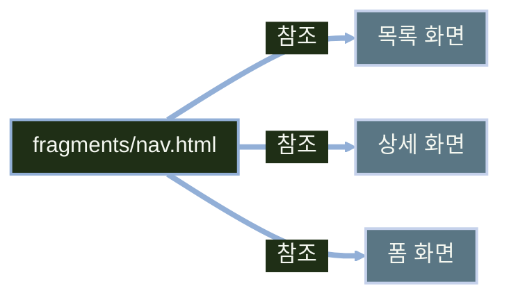
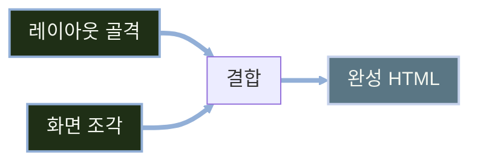

# 레이아웃과 프래그먼트

---
layout: default
---

# 학습 체크리스트 (1/2)

- [ ] 공통 화면 조각을 프래그먼트로 분리해야 하는 이유와 폴더 구성 규약 이해
- [ ] `th:fragment` 정의와 `~{경로 :: 이름}` 참조 문법 습득
- [ ] `th:replace`·`th:insert`·`th:remove`의 동작 차이 습득
- [ ] 파라미터를 받는 프래그먼트와 `th:block` 활용법 습득

---
layout: default
---

# 학습 체크리스트 (2/2)

- [ ] 순수 Fragment Expression 방식으로 레이아웃을 구성하는 방법 이해
- [ ] thymeleaf-layout-dialect의 `layout:decorate`·`layout:fragment` 구조 이해
- [ ] 공통 `head` 프래그먼트와 동적 title·메타 태그 구성 습득
- [ ] 정적 리소스 경로와 `@{...}` URL 표현식의 필요성 이해

---
layout: cover
class: text-center
---

# 프래그먼트로 화면 조각 재사용

---
layout: default
---

# 화면마다 반복되는 공통 조각

- 목록·상세·폼 화면은 각각 `<head>`, 네비게이션, 푸터를 담고 있음
- 공통 부분을 화면마다 복사해 두면 메뉴 하나만 바꿔도 모든 템플릿을 일일이 고쳐야 함
- 공통 조각을 한 곳에 정의하고 여러 템플릿에서 가져다 쓰면 수정 지점이 하나로 줄어듦

> **프래그먼트 (Fragment)**
>
> 여러 템플릿에서 이름으로 불러와 재사용할 수 있도록 이름 붙여 둔 HTML 조각

---
layout: default
---

# 복사 대신 참조로 조각을 공유하는 구조



---
layout: default
---

# 프래그먼트 사용에 필요한 의존성

- 프래그먼트 정의·참조는 Thymeleaf 표준 기능이며 별도 레이아웃 라이브러리가 필요하지 않음
- Spring Boot 애플리케이션에서는 `spring-boot-starter-thymeleaf`만 추가하면 바로 사용 가능
- 여러 화면에 걸친 레이아웃 상속용 서드파티인 `thymeleaf-layout-dialect`는 뒤에서 다룸

---
layout: default
---

# 역할별 템플릿 폴더 구성

```
templates/
  layout/     (전체 골격)
  fragments/  (head, nav, footer 같은 공통 조각)
  books/      (화면별 템플릿)
```

- 폴더 이름은 프레임워크의 필수 규칙이 아니라 프로젝트에서 정하는 관례
- 프래그먼트와 완성 화면을 역할별 폴더로 구분하면 경로 충돌을 줄이고 유지보수하기 쉬움

---
layout: default
---

# templates 경로가 렌더링되는 방식

- `templates/`는 정적 리소스처럼 브라우저가 바로 접근하는 공개 경로가 아님
- 컨트롤러가 반환한 뷰 이름을 서버가 찾아 렌더링하는 내부 경로
- 프래그먼트 전용 폴더를 분리하면 완성된 화면과 부품을 구분하기 쉬움

---
layout: default
---

# th:fragment로 조각 정의하기

```html
<!-- fragments/nav.html -->
<nav th:fragment="mainNav">
  <a th:href="@{/books}">도서 목록</a>
</nav>
```

---
layout: default
---

# 프래그먼트 참조 문법 정리

| 형태 | 의미 |
| :--- | :--- |
| `~{경로 :: 이름}` | 다른 템플릿에 정의된 프래그먼트 참조 |
| `~{:: 이름}` | 같은 템플릿 안의 프래그먼트 참조 |
| `~{경로 :: #선택자}` | 이름 대신 CSS 선택자로 영역 지정 |

- Spring Boot가 구성한 Thymeleaf 템플릿 리졸버는 기본 suffix인 `.html`을 템플릿 이름 뒤에 붙여 탐색
- 기본 설정에서는 `~{fragments/nav :: mainNav}`처럼 확장자를 생략하며, suffix 설정을 바꾸면 작성 규칙도 달라짐

---
layout: default
---

# th:insert·th:replace·th:remove 비교

| 속성 | 동작 | 비고 |
| :--- | :--- | :--- |
| `th:replace` | 호스트 태그 자체를 프래그먼트로 교체 | 불필요한 래퍼를 남기지 않을 때 적합 |
| `th:insert` | 호스트 태그는 남기고 안쪽에 프래그먼트 삽입 | 감싸는 태그가 필요할 때 |
| `th:remove` | 렌더링 시 태그를 제거 | `all`·`body`·`tag`·`all-but-first` 등 |

- `th:replace`와 `th:insert`를 혼동하여 태그가 불필요하게 2중 중첩되거나 의도한 마크업 구조가 깨져 화면 레이아웃이 붕괴하는 조작 실수가 많으므로 주의 요망

---
layout: default
---

# replace와 insert의 결과 차이

```html
<div th:replace="~{fragments/nav :: mainNav}"></div>
<div th:insert="~{fragments/nav :: mainNav}">여기 안쪽에 삽입됩니다</div>
```

---
layout: default
---

# th:remove 값별 삭제 범위

| 값 | 삭제 범위 |
| :--- | :--- |
| `all` | 태그와 자식 모두 삭제 |
| `body` | 자식만 삭제, 태그는 유지 |
| `tag` | 태그만 삭제, 자식은 상위로 |
| `all-but-first` | 첫 자식만 남기고 나머지 삭제 |
| `none` | 삭제하지 않음 |

---
layout: default
---

# 정적으로 열어볼 때만 필요한 더미 제거

- 디자이너가 작업한 시안용 마크업 등 정적 확인 용도로만 필요한 더미 요소에 `th:remove="all"` 선언을 생략하면 서버 동작 시 더미가 그대로 노출되는 실수가 생김
- `th:remove="all"`을 적절히 설정해야 서버가 렌더링할 때 더미를 제거하고 순수 데이터만 표출하며, 브라우저로 직접 HTML을 열었을 때만 더미가 정상 노출됨

> **비권장 속성 (Not Recommended)**
>
> `th:include`는 Thymeleaf 3.0부터 권장되지 않으며 `th:insert`나 `th:replace`로 대체함

---
layout: default
---

# 값을 외부에서 주입받는 프래그먼트 정의

```html
<!-- fragments/card.html -->
<div th:fragment="card(title, url)">
  <a th:href="${url}" th:text="${title}">제목</a>
</div>
```

---
layout: default
---

# 파라미터를 채워 프래그먼트 호출하기

```html
<div th:replace="~{fragments/card :: card('클린 코드', '/books/1')}"></div>
```

---
layout: default
---

# 이름 기반 인자로 프래그먼트 호출하기

- 위치 순서 대신 파라미터 이름을 지정해 값을 전달 가능
- 인자가 많아질수록 어떤 값이 어떤 파라미터인지 명확해짐

```html
<div th:replace="~{fragments/card :: card(title=${book.title}, url=@{/books/{id}(id=${book.id})})}"></div>
```

---
layout: default
---

# th:block으로 태그 없이 묶기

- 실제 HTML 태그로 렌더링되지 않는 논리 블록
- 반복·조건을 감쌀 때 불필요한 `<div>`를 만들지 않고 여러 요소를 그룹으로 다룸

---
layout: default
---

# th:block으로 반복 렌더링하기

```html
<th:block th:each="book : ${books}">
  <dt th:text="${book.title}">제목</dt>
  <dd th:text="${book.author}">저자</dd>
</th:block>
```

---
layout: default
---

# 브라우저로 바로 열어도 깨지지 않는 이유

> **내추럴 템플릿 (Natural Templates)**
>
> 서버에서 처리하지 않아도 HTML 파일을 정적 프로토타입으로 열어 화면의 기본 구조와 예시 내용을 확인할 수 있는 성질

- 브라우저는 `th:*` 속성을 실행하지 않고 기본 HTML 마크업과 예시 내용을 표시하므로 로컬에서 화면 구조를 확인할 수 있음
- 프래그먼트 조각 결합과 실제 서버 데이터 바인딩은 서버 사이드 엔진을 거쳐 렌더링될 때만 작동

---
layout: cover
class: text-center
---

# 레이아웃 구성 전략

---
layout: default
---

# 화면마다 반복되는 공통 마크업 문제

- 여러 화면이 공통 헤더·네비게이션·푸터를 공유하는 경우가 대부분
- 매 템플릿에 같은 마크업을 그대로 복사하면 변경 시 모든 파일을 함께 고쳐야 함
- Thymeleaf 진영에는 이 문제를 푸는 두 가지 접근법이 존재함
- 의존성 유무와 호출부 형태에서 두 방식이 갈림

---
layout: default
---

# 레이아웃 구현 두 방식 비교

| 방식 | 추가 의존성 | 특징 |
| :--- | :--- | :--- |
| 순수 Thymeleaf (Fragment Expression) | 없음 | 파라미터를 받는 프래그먼트로 레이아웃을 정의하고, 화면이 자기 조각을 인자로 넘김 |
| thymeleaf-layout-dialect | 있음 (`nz.net.ultraq.thymeleaf`) | `decorate`/`fragment`로 레이아웃 상속을 표현하고 `<head>`를 자동 병합 |

---
layout: default
---

# 레이아웃과 화면이 결합되는 흐름



---
layout: default
---

# Fragment Expression으로 레이아웃 정의하기

- 레이아웃 템플릿을 `title`, `content`처럼 파라미터를 받는 프래그먼트로 정의
- 각 화면은 렌더링될 때 자기 자신의 일부 요소를 프래그먼트 표현식으로 만듦
- 만들어진 조각을 레이아웃 프래그먼트의 인자로 그대로 넘김
- 별도 의존성 없이 Thymeleaf 표준 문법만으로 동작함

---
layout: default
---

# 파라미터를 받는 레이아웃 템플릿

```html
<!-- layout/base.html -->
<html th:fragment="layout(title, content)">
<head><title th:replace="${title}">기본 제목</title></head>
<body>
  <header>공통 헤더</header>
  <div th:replace="${content}">본문 자리</div>
</body>
</html>
```

- 레이아웃 템플릿 내에서 인자로 넘겨받은 프래그먼트 조각 객체를 변수식 `${content}`이 아닌 문자열 리터럴 `${'content'}` 형식으로 참조하는 실수가 자주 나타남
- 잘못된 리터럴 표기 시 조각 자체가 아닌 고정 텍스트로 오작동하여 화면이 깨지므로 수식 작성을 엄격히 준수해야 함
```

---
layout: default
---

# 화면이 자기 조각을 레이아웃에 전달

```html
<!-- books/list.html -->
<html th:replace="~{layout/base :: layout(~{::title}, ~{::main})}">
<head><title>도서 목록</title></head>
<body>
  <main><h1>도서 목록</h1></main>
</body>
</html>
```

---
layout: default
---

# 이름 없이 화면 조각을 잘라 넘기는 표현식

- `~{::title}`은 현재 화면 템플릿 안에 있는 `title` 요소를 가리킴
- 별도 이름을 붙이지 않고 화면의 일부를 그대로 잘라 레이아웃에 전달
- `::main`도 같은 방식으로 화면의 `main` 요소를 지칭함

> **프래그먼트 표현식 (Fragment Expression)**
>
> 템플릿 안의 특정 요소를 이름 없이 그 자리에서 잘라 참조하는 Thymeleaf 문법

---
layout: default
---

# 조각이 늘어날수록 길어지는 호출부

- 레이아웃에 넘겨야 할 조각이 늘어날수록 인자 목록이 함께 늘어남
- `layout(~{::a}, ~{::b}, ~{::c}, ...)`처럼 호출부가 점점 길어짐
- 조각 순서를 착각하면 엉뚱한 위치에 내용이 들어가는 실수로 이어짐

---
layout: default
---

# 레이아웃 상속을 위한 의존성 추가

- `nz.net.ultraq.thymeleaf:thymeleaf-layout-dialect` 의존성을 추가해 구현
- 최신 4.0.1 계열은 Java 17과 Thymeleaf 3.1 이상을 요구하며 Spring Boot 4 기준에 맞춰짐
- Spring Boot 3 프로젝트는 Boot가 관리하는 호환 버전을 사용하고, Boot 4에서는 4.x 계열을 사용
- Spring Boot가 관리하는 버전을 따르면 의존성에 버전을 직접 적지 않아도 됨
- 클래스패스에서 발견되면 Spring Boot가 자동 구성함

---
layout: default
---

# decorate와 fragment로 표현하는 상속 구조

- `layout:decorate`로 자식 페이지가 상속받을 부모 레이아웃을 지정
- `layout:fragment`로 부모 레이아웃 안에서 결합될 위치를 지정
- 순수 방식과 달리 `<head>` 영역을 자동으로 병합함
- `layout:title-pattern`으로 페이지 제목을 동적으로 조합할 수 있음

---
layout: default
---

# 자식 페이지의 decorate·fragment 선언

```html
<html xmlns:layout="http://www.ultraq.net.nz/thymeleaf/layout"
      layout:decorate="~{layout/base}">
<body>
  <main layout:fragment="content">페이지 내용</main>
</body>
</html>
```

---
layout: default
---

# 두 방식의 호출부 차이

| 구분 | 호출부 형태 | 조각이 늘어날 때 |
| :--- | :--- | :--- |
| 순수 Fragment Expression | `layout(~{::a}, ~{::b}, ...)` | 인자 목록이 계속 길어짐 |
| thymeleaf-layout-dialect | `layout:decorate` + `layout:fragment` | 각 영역에 이름만 붙이면 됨 |

---
layout: default
---

# 화면 규모와 요구사항에 따른 선택

- 화면 수가 적고 레이아웃 구조가 단순하면 순수 Fragment Expression으로 충분
- 별도 의존성이 없다는 점이 순수 방식의 가장 큰 장점
- `<head>` 자동 병합이나 다단계 상속이 필요하면 layout-dialect가 유리함
- layout-dialect는 조각이 늘어나도 호출부가 단순하게 유지됨

---
layout: default
---

# 선택 기준 정리

| 상황 | 권장 방식 |
| :--- | :--- |
| 화면 수가 적고 구조가 단순함 | 순수 Fragment Expression |
| `<head>` 공통 요소 자동 병합이 필요함 | thymeleaf-layout-dialect |
| 레이아웃 다단계 상속이 필요함 | thymeleaf-layout-dialect |
| 추가 의존성을 두지 않으려 함 | 순수 Fragment Expression |

---
layout: cover
class: text-center
---

# 공통 head와 정적 리소스

---
layout: default
---

# 화면마다 반복되는 메타 정보를 하나의 조각으로

- 문자셋, viewport, 공통 CSS처럼 화면마다 반복되는 메타 정보를 하나의 조각으로 묶음
- 화면별로 달라지는 제목과 추가 스크립트만 파라미터로 받아 끼워 넣음
- 레이아웃 프래그먼트와 함께 쓰면 페이지마다 head를 다시 작성할 필요가 없음

---
layout: default
---

# th:fragment로 선언하는 공통 head

```html
<head th:fragment="head(title, extraScripts)">
  <meta charset="UTF-8" />
  <meta name="viewport" content="width=device-width, initial-scale=1" />
  <link rel="stylesheet" th:href="@{/css/app.css}" />
  <title th:text="${title}">기본 제목</title>
  <th:block th:replace="${extraScripts}"></th:block>
</head>
```

- 추가 스크립트가 없는 화면은 호출할 때 빈 프래그먼트 `~{}`를 전달

---
layout: default
---

# 정적 문구는 템플릿에, 값만 th:text로 채움

- 정적 문구는 템플릿에 그대로 두고 화면마다 달라지는 값만 `th:text`로 채움
- `<meta>`의 `content`처럼 태그 속성에 데이터를 넣을 때는 `th:content` 사용
- 대응하는 전용 지정자가 없는 속성은 `th:attr`로 일반화해 지정 가능

---
layout: default
---

# Open Graph 태그에 도서 정보 채우기

```html
<meta property="og:title" th:content="${book.title}" />
<meta property="og:description" th:content="${book.summary}" />
```

---
layout: default
---

# 다국어 문구는 메시지 표현식으로 분리

- 다국어 문구는 정적 문자열 대신 `#{...}` 메시지 표현식으로 작성
- 언어별 프래그먼트를 복제하지 않고 `messages.properties`만 바꿔 대응 가능
- 화면 구조는 그대로 두고 문구 값만 언어에 따라 교체됨

---
layout: default
---

# 정적 리소스는 static 아래에 두면 그대로 서빙됨

- CSS·JS·이미지 같은 정적 파일은 `src/main/resources/static/` 아래에 두면 별도 설정 없이 서빙됨
- 정적 리소스를 매핑할 때 타임리프의 `@{...}` 표현식을 빠뜨리고 일반 문자열 `href="/css/app.css"`로 기입하면 컨텍스트 경로 변경 시 연동이 끊어지는 실수가 발생함
- 내부 리소스의 `href`·`src`에는 `@{...}` 사용을 권장하며, 컨텍스트 경로와 리소스 체인의 버전 URL을 반영할 수 있음
- 외부 사이트 연결용 절대 URL이나 `mailto:`·`tel:` 등은 타임리프 지정자 없이 일반 HTML 속성으로 편하게 작성 가능

---
layout: default
---

# 내부 리소스와 외부 URL의 작성법 대조

```html
<link th:href="@{/css/app.css}" rel="stylesheet" />
<a href="https://example.com">외부 링크</a>
```

---
layout: default
---

# 정적 파일과 템플릿의 렌더링 시점 차이

| 구분 | 위치 또는 작성법 | 렌더링 시점 |
| :--- | :--- | :--- |
| 정적 리소스 | `static/` 아래 파일 | 서버가 파일을 그대로 전달 |
| 템플릿 | `templates/` 아래 HTML | 요청마다 서버에서 렌더링 |
| 템플릿 안의 정적 마크업 | 디자인 확인용 기본값 텍스트 | 렌더링 시 `th:*` 값으로 대체됨 |

---
layout: default
---

# 브라우저 캐시 때문에 반영되지 않는 새 리소스

- 정적 파일이 바뀌었는데 브라우저 캐시 때문에 반영되지 않는 문제가 발생
- URL이 그대로면 캐시 정책에 따라 브라우저가 이전 파일을 계속 사용할 수 있음
- 콘텐츠 해시를 URL에 붙이는 리소스 체인 기능으로 해결

> **콘텐츠 해시 / 캐시 버스팅 (Content Hash / Cache Busting)**
>
> 파일 내용이 바뀌면 URL도 함께 바뀌게 하여 브라우저가 새 리소스를 다시 받도록 만드는 방식

---
layout: default
---

# 리소스 체인 설정으로 콘텐츠 해시 적용

```yaml
spring:
  web:
    resources:
      chain:
        strategy:
          content:
            enabled: true
            paths: "/**"
```

---
layout: default
---

# ResourceUrlEncodingFilter가 URL을 다시 써 줌

- Thymeleaf에서는 Spring Boot가 자동 구성한 `ResourceUrlEncodingFilter`가 렌더링 시점에 동작
- `th:href`·`th:src`의 내부 리소스 URL을 콘텐츠 해시가 포함된 URL로 다시 작성
- 템플릿 코드는 그대로 두어도 파일 내용이 바뀌면 해시 URL도 달라져 새 리소스를 받게 됨

---
layout: cover
class: text-center
---

# 실전 재활용과 JSP 비교

---
layout: default
---

# 반복되는 UI를 파라미터 프래그먼트로 추출하기

- 기존 CRUD 화면의 목록 페이지네이션, 성공 메시지 알림, 삭제 확인 폼 버튼처럼 여러 화면에 반복되는 UI를 후보로 삼음
- 이런 조각을 파라미터를 받는 프래그먼트로 추출하면 화면마다 중복 작성하지 않고 값만 바꿔 호출 가능
- 성공 메시지 알림은 `RedirectAttributes.addFlashAttribute("message", ...)`로 넘긴 값을 그대로 이어받아 표시하는 프래그먼트로 제작 가능

---
layout: default
---

# 성공 메시지 알림 프래그먼트 구현

```html
<div th:fragment="alert(message)" th:if="${message}" class="alert">
  <span th:text="${message}">알림</span>
</div>
```

---
layout: default
---

# 조건 판단을 프래그먼트 안으로 옮기기

- 프래그먼트 안에 `th:if`를 넣어 값이 있을 때만 출력되게 구성
- 호출부는 조건을 신경 쓰지 않고 `th:replace`만 하면 되도록 책임을 분리
- 조건 판단 책임을 조각 안으로 옮기면 호출부 코드가 단순하게 유지됨

---
layout: default
---

# 알림 프래그먼트 호출하기

```html
<div th:replace="~{fragments/alert :: alert(${message})}"></div>
```

---
layout: default
---

# JSP와 Thymeleaf의 조각 재사용 방식 비교 (1/2)

| 축 | JSP | Thymeleaf |
| :--- | :--- | :--- |
| 조각 포함 | `<jsp:include>` / `<%@ include %>` | `th:replace` |
| 레이아웃 상속 | Apache Tiles·SiteMesh 같은 별도 프레임워크 필요 | Thymeleaf 자체 기능 또는 layout-dialect |

---
layout: default
---

# JSP와 Thymeleaf의 조각 재사용 방식 비교 (2/2)

| 축 | JSP | Thymeleaf |
| :--- | :--- | :--- |
| 정적 열람 | 서버 실행 없이는 브라우저에서 바로 열 수 없음 | 내추럴 템플릿(Natural Templates) 성질을 통해 HTML 파일 그대로 열람 가능 |
| 실행 방식 | 서블릿으로 컴파일되어 실행 | 템플릿 엔진이 런타임에 파싱 |
| 표현식 | EL·JSTL | Thymeleaf 표준 표현식 |

---
layout: default
---

# 정적 포함과 동적 포함의 차이

- `<%@ include %>`는 JSP 변환 시점에 대상 파일의 내용을 소스에 합치는 정적 포함
- `<jsp:include>`는 런타임에 요청을 위임하는 동적 포함
- Thymeleaf의 `th:replace`도 렌더링 시점에 동작하지만, 별도 요청 위임 없이 같은 템플릿 처리 과정에서 조각을 치환함

---
layout: default
---

# Spring Boot에서 JSP를 권장하지 않는 이유

- Spring Boot는 실행 가능한 JAR로 내장 톰캣을 띄우는 방식을 기본으로 함
- 실행 가능한 JAR에서는 JSP가 지원되지 않으며, JSP를 사용하려면 일반적으로 WAR 패키징과 지원되는 서블릿 컨테이너 구성이 필요함
- Spring Boot 공식 문서도 내장 컨테이너 환경의 제약 때문에 가능하면 JSP를 피하도록 안내함

---
layout: default
---

# 학습 요약 (1/2)

- **프래그먼트로 화면 조각 재사용**:
  - 공통 조각을 `th:fragment`로 정의하고 `~{경로 :: 이름}`으로 참조해 수정 지점을 하나로 모으는 방식 습득
- **th:replace·th:insert·th:remove의 차이**:
  - 세 속성이 호출 태그와 프래그먼트 태그를 다루는 방식이 다르다는 점과 각각의 쓰임을 구분하는 방법 이해
- **레이아웃 구성 전략**:
  - 순수 Fragment Expression 방식과 thymeleaf-layout-dialect의 `layout:decorate`·`layout:fragment` 구조 이해

---
layout: default
---

# 학습 요약 (2/2)

- **공통 head와 메타 태그**:
  - 여러 화면이 공유하는 `head` 프래그먼트를 만들고 화면별 title·메타 태그를 동적으로 채우는 방법 습득
- **정적 리소스와 URL 표현식**:
  - `@{...}` 표현식으로 컨텍스트 경로가 반영된 정적 리소스 경로를 구성하는 방법 이해
- **JSP와의 비교**:
  - 조각 포함·레이아웃 상속·정적 열람·실행 방식에서 JSP와 Thymeleaf가 갈라지는 지점 이해
