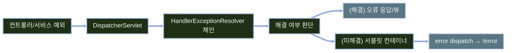

# 서버사이드 렌더링 예외 처리

---
layout: default
---

# 학습 체크리스트 (1/2)

- [ ] 예외를 컨트롤러 밖 공통 관심사로 분리해야 하는 이유 이해
- [ ] 예외 전파 흐름과 `HandlerExceptionResolver` 체인 동작 이해
- [ ] `/error`와 상태 코드별 커스텀 오류 페이지 구성 습득
- [ ] `spring.web.error.*` 오류 정보 노출 설정 이해

---
layout: default
---

# 학습 체크리스트 (2/2)

- [ ] 입력 검증(`BindingResult`)과 예외의 구분 기준 습득
- [ ] `@ExceptionHandler`·`@ResponseStatus` 사용법 습득
- [ ] `@ControllerAdvice` 전역 예외 처리와 우선순위 규칙 이해
- [ ] 처리되지 않은 예외의 로깅과 정보 노출 방지 원칙 습득

---
layout: cover
class: text-center
---

# Spring MVC 예외 처리 기본 원리

---
layout: default
---

# 컨트롤러 try-catch 중복과 Spring MVC 설계 원칙

- **개별 try-catch의 문제점**: 로깅·상태 코드 결정·오류 화면 선택이 컨트롤러마다 중복되어 일관성 저하
- **예외 처리의 관심사 분리**: 예외 처리를 비즈니스 로직에서 분리하여 컨트롤러는 정상 흐름에만 집중
- **일관된 처리 메커니즘**: `HandlerExceptionResolver` 및 컨테이너 error dispatch를 통해 전역적이고 일관된 처리 보장

---
layout: default
---

# 예외 처리 학습 범위 및 전제 조건

- **학습 대상**: Thymeleaf 기반 서버사이드 렌더링(SSR) 애플리케이션 예외 처리
- **별도 차시 대상**: `@RestControllerAdvice`, `ProblemDetail` 등 REST API 및 WebFlux/Security 예외 처리
- **기준 버전**: Spring Boot 4.1 기준 설정 (3.5 계열은 `server.error.*` 접두사 사용)

---
layout: default
---

# 컨트롤러부터 /error까지의 예외 전파 흐름



---
layout: default
---

# 예외 처리 파이프라인과 ExceptionResolver

| 구성 요소 / 반환값 | 역할 및 동작 방식 |
| :--- | :--- |
| **ExceptionResolver 체인** | 예외 발생 시 등록된 리졸버들이 순서대로 처리를 시도함 |
| **오류 뷰 `ModelAndView`** | 해당 오류 뷰를 렌더링하고 예외 처리를 정상 종료 |
| **빈 `ModelAndView`** | 예외는 해결했으나 별도 렌더링할 뷰가 없음 |
| **`null` 반환** | 예외를 해결하지 못하여 체인의 다음 리졸버로 이관 |
| **컨테이너 전파** | 모든 리졸버가 해결하지 못하면 서블릿 컨테이너로 예외 전파 |

---
layout: cover
class: text-center
---

# 기본 오류 페이지

---
layout: default
---

# Whitelabel Error Page 동작 방식과 한계

- **기본 폴백 제공**: 커스텀 오류 뷰가 전혀 없을 때 Spring Boot가 최소한의 오류 화면을 기본 생성
- **오류 정보 표기**: `/error`가 구성한 오류 데이터를 HTML 형식으로 단순 렌더링

> **Whitelabel Error Page**
>
> 커스텀 오류 뷰가 하나도 없을 때 Spring Boot가 기본으로 보여 주는 최소 오류 화면

- **운영 부적합성**: 브랜딩 및 사용자 안내가 부족하여 실제 운영 환경에서는 커스텀 뷰로 대체 필수

---
layout: default
---

# BasicErrorController와 Whitelabel 비활성화

- **`/error` 전담 컨트롤러**: `BasicErrorController`가 컨테이너의 error dispatch 요청을 받아 상태 코드별 템플릿 탐색
- **비활성화 목적**: 기본 오류 화면 대신 애플리케이션의 커스텀 오류 뷰 사용
- **주의사항**: 커스텀 뷰 없이 비활성화만 할 경우 컨테이너 기본 오류 화면이 직접 노출될 수 있음

---
layout: default
---

# Whitelabel 오류 화면 비활성화 설정

```yaml
spring:
  web:
    error:
      whitelabel:
        enabled: false
```

---
layout: default
---

# Spring Boot 오류 처리 설정 속성 및 프로파일 제어

| 속성 (`spring.web.error.*`) | 의미 | 기본값 |
| :--- | :--- | :--- |
| `path` | 컨테이너 error dispatch 타겟 경로 | `/error` |
| `include-message` | 예외 메시지 포함 여부 (`never`/`always`/`on-param`) | `never` |
| `include-stacktrace` | 스택트레이스 포함 여부 | `never` |

- **보안 원칙**: 내부 구현 정보 유출 방지를 위해 운영 환경은 기본값(`never`) 유지
- **개발 환경 제어**: local 프로파일에서만 `include-message: always` 등으로 변경하여 디버깅

---
layout: default
---

# 커스텀 오류 뷰 템플릿의 탐색 우선순위

| 탐색 순서 | 위치 및 파일명 규칙 | 특징 |
| :--- | :--- | :--- |
| 1 | `templates/error/404.html` | 정확한 상태 코드 템플릿 (동적 모델 사용 가능) |
| 2 | `static/error/404.html` | 정확한 상태 코드 정적 파일 |
| 3 | `templates/error/4xx.html` | 상태 코드 계열 템플릿 |
| 4 | `static/error/4xx.html` | 상태 코드 계열 정적 파일 |

- 위 파일이 없으면 이름이 `error`인 일반 오류 뷰, 이후 Whitelabel 뷰가 폴백으로 사용됨

---
layout: default
---

# HTTP 404 오류 페이지에서 기본 모델 사용

```html
<!-- templates/error/404.html -->
<div class="error-container">
    <h1 th:text="${status}">404</h1>
    <h2 th:text="${error}">Not Found</h2>
    <p th:text="${path}">/requested-path</p>
    <p th:if="${message}" th:text="${message}">상세 메시지</p>
</div>
```

---
layout: default
---

# /error가 제공하는 오류 모델 속성

- **적용 범위**: `BasicErrorController`의 `/error` 경로가 오류 뷰를 렌더링할 때 제공
- **기본 속성**: `timestamp`, `status`, `error` 등 기본 오류 정보 사용 가능
- **조건부 속성**: `path`, `message`, `trace` 등은 Boot 버전과 `spring.web.error.*` 설정에 따라 달라짐
- **주의사항**: `@ExceptionHandler`가 직접 반환한 뷰에는 위 속성이 자동 전달되지 않음

---
layout: default
---

# 오류 페이지 보안 원칙과 공통 레이아웃 적용

- **내부 정보 노출 방지**: 쿼리, 패키지 구조, 예외 스택트레이스는 화면이 아닌 서버 로그에만 기록
- **안내 문구만 사용자에게 전달**: 500 오류 시 "일시적인 시스템 오류가 발생했습니다" 형태 안내
- **공통 레이아웃 재사용**: 레이아웃 프래그먼트를 활용해 일반 페이지와 동일한 네비게이션/디자인 골격 유지
- **정적 리소스 404**: CSS/이미지 등의 정적 리소스 404는 컨테이너 기본 `/error` 위임 처리

---
layout: cover
class: text-center
---

# 검증 실패와 예외 구분

---
layout: default
---

# 입력값 검증(BindingResult)과 런타임 예외의 구분

- **입력 검증 실패 (`BindingResult`)**:
  - 필수값 누락, 형식 오류 등 사용자 입력 수정으로 즉시 해결 가능한 문제
  - 동일한 폼 뷰를 다시 렌더링하여 사용자 입력값을 유지한 채 수정 유도
- **런타임 예외 (Exception)**:
  - 존재하지 않는 ID 조회, DB 장애처럼 현재 요청을 정상 완료할 수 없는 상태
  - 예외를 발생시켜 상황에 맞는 오류 페이지(404, 500 등)로 전환
- **판단 기준**: 사용자 수정 가능성, 비즈니스 규칙 위반 여부, 요청 전체 실패 필요성을 함께 고려

---
layout: default
---

# 오류 상황별 처리 계층 및 사용자 화면

| 상황 | 처리 방식 | 사용자에게 보이는 화면 |
| :--- | :--- | :--- |
| 필수 입력 누락 / 형식 오류 | `BindingResult` | 입력값이 유지된 기존 폼 화면 재렌더링 |
| 존재하지 않는 ID 조회 | `Exception` | HTTP 404 오류 화면 |
| 중복 데이터 등록 | 폼 오류 또는 도메인 예외 | 수정 가능한 폼 또는 안내 화면 |
| 권한 없는 접근 / 서버 장애 | Security 처리 / `Exception` | HTTP 403 / 500 오류 화면 |

---
layout: default
---

# 컨트롤러 메서드 내 try-catch 처리 및 응답 방식

| 응답 선택 | 사용 상황 | 이유 |
| :--- | :--- | :--- |
| **뷰 이름 직접 반환** | 입력 폼 재제출 (입력값 보존) | `Model`에 기존 입력값 및 에러 메시지 보존 가능 |
| **`redirect:`** | 목록/상세 페이지로 이동 | 새로고침 시 동일 Form 재전송(PRG 패턴) 방지 |
| **`forward:`** | 내부 핸들러 위임 | 요청 속성을 유지한 채 내부 경로 전달 |

- 폼 복원처럼 해당 컨트롤러에서만 복구할 이유가 있을 때 제한적으로 `try-catch` 사용

---
layout: default
---

# 등록 실패 시 입력값을 유지한 폼 재반환

```java
@PostMapping("/books")
String create(@Valid BookForm form, BindingResult result, Model model) {
    if (result.hasErrors()) return "books/form";
    try { bookService.create(form); }
    catch (DuplicateIsbnException e) {
        model.addAttribute("errorMessage", "이미 등록된 ISBN입니다.");
        return "books/form";
    }
    return "redirect:/books";
}
```

---
layout: default
---

# 삭제 실패 시 RedirectAttributes 경고 메시지 전달

```java
@PostMapping("/books/{id}/delete")
String delete(@PathVariable Long id, RedirectAttributes ra) {
    try { bookService.delete(id); }
    catch (BookNotFoundException e) {
        ra.addFlashAttribute("message", "존재하지 않는 도서입니다.");
    }
    return "redirect:/books";
}
```

---
layout: default
---

# 컨트롤러 로컬 try-catch 방식의 구조적 한계

- **코드 중복**: 여러 컨트롤러 메서드마다 가동되는 동일한 `catch` 블록의 연속
- **강한 결합**: 컨트롤러가 서비스 계층의 세부 예외 목록을 모두 인지해야 함
- **가독성 저하**: 비즈니스 흐름 코드와 예외 처리/뷰 선택 공통 로직이 뒤섞임
- **유지보수성 저하**: 서비스 예외 변경 시 관련된 모든 컨트롤러 try-catch 수정 필요

---
layout: default
---

# 예외 처리 위치의 단계별 확장 구조


---
layout: cover
class: text-center
---

# 타입으로 예외 처리 분리하기

---
layout: default
---

# 컨트롤러 내 특정 예외를 가로채는 @ExceptionHandler

- **관심사 분리**: 컨트롤러 메서드는 정상 처리 로직만 남기고, 예외 처리는 지정 핸들러 메서드로 분리
- **자동 감지**: 해당 컨트롤러에서 지정한 타입의 예외 발생 시 `ExceptionHandlerExceptionResolver`가 감지하여 실행
- **스코프**: 기본적으로 어노테이션이 선언된 컨트롤러 클래스 내부 발생 예외에만 적용됨

---
layout: default
---

# @ExceptionHandler 메서드의 매개변수 및 반환 타입

- **주입 가능한 매개변수**:
  - 발생한 예외 객체 (`BookNotFoundException`, `Exception` 등)
  - `HttpServletRequest`, `HttpServletResponse`, `Model`, `HandlerMethod` 등
- **지원하는 반환 타입**:
  - 뷰 이름 문자열 (`"error/404"`)
  - `ModelAndView` 객체
  - `Model`을 파라미터로 받고 뷰 이름 문자열을 반환하는 형태

---
layout: default
---

# 다중 예외 처리와 예외 재전파(Rethrow)

- **다중 예외 묶음 처리**: 처리 정책이 같은 여러 예외 타입을 하나의 핸들러에 선언 가능
- **타입 매칭 규칙**: 동일 클래스 내 여러 핸들러 중 예외 상속 계층상 가장 구체적인 타입이 선택됨
- **예외 재전파 (Rethrow)**: 핸들러 내에서 `throw e;`로 다시 던지면 처리를 포기한 것으로 간주되어 다음 Resolver 체인으로 전달

---
layout: default
---

# 같은 정책을 적용할 여러 예외 타입 선언

```java
@ExceptionHandler({
    DuplicateIsbnException.class,
    IllegalArgumentException.class
})
String handleBadRequest(Exception e, Model model) {
    return "error/4xx";
}
```

---
layout: default
---

# @ExceptionHandler 404 오류 뷰 매핑

```java
@Controller
@RequestMapping("/books")
class BookController {

    @ExceptionHandler(BookNotFoundException.class)
    String handleNotFound(BookNotFoundException e, Model model) {
        model.addAttribute("message", e.getMessage());
        return "error/404";
    }
}
```

---
layout: default
---

# @ExceptionHandler 5xx 런타임 예외 매핑

```java
@Controller
@RequestMapping("/books")
class BookController {

    @ExceptionHandler(RuntimeException.class)
    String handleRuntime(RuntimeException e, HttpServletRequest req, Model model) {
        model.addAttribute("path", req.getRequestURI());
        return "error/5xx";
    }
}
```

---
layout: default
---

# 예외 클래스에 HTTP 상태 코드를 부여하는 @ResponseStatus

- **개념**: 도메인 예외 클래스 위에 `@ResponseStatus(HttpStatus.NOT_FOUND)` 선언
- **동작**: `ResponseStatusExceptionResolver`가 예외를 감지하여 지정된 HTTP 상태를 응답에 적용
- **후속 처리**: 실제 오류 응답 렌더링은 서블릿 컨테이너와 Spring Boot 구성에 따라 달라질 수 있음
- **인라인 사용**: 예외 클래스 작성이 번거로울 때 `ResponseStatusException` 객체 직접 생성 및 발생 가능

---
layout: default
---

# @ResponseStatus를 적용한 커스텀 도메인 예외 정의

```java
@ResponseStatus(HttpStatus.NOT_FOUND)
class BookNotFoundException extends RuntimeException {
    BookNotFoundException(Long id) {
        super("도서를 찾을 수 없습니다. id=" + id);
    }
}
```

---
layout: default
---

# 오류 뷰와 HTTP 상태 코드를 동시에 명시하는 방법

- **200 OK 응답 문제**: `@ExceptionHandler`에서 뷰 이름(문자열)만 반환하면 HTTP 상태 코드가 200 OK로 나가는 문제 발생
- **해결 방안**: `@ExceptionHandler` 메서드에 `@ResponseStatus`를 함께 선언하여 올바른 오류 상태 코드 명시

---
layout: default
---

# 404 상태와 오류 뷰 함께 반환

```java
@ExceptionHandler(BookNotFoundException.class)
@ResponseStatus(HttpStatus.NOT_FOUND)
String handleNotFound(BookNotFoundException e, Model model) {
    model.addAttribute("message", e.getMessage());
    return "error/404";
}
```

---
layout: cover
class: text-center
---

# 전역 예외 처리

---
layout: default
---

# 컨트롤러 로컬 핸들러의 한계와 @ControllerAdvice

- **로컬 핸들러 한계**: 컨트롤러별로 동일한 `@ExceptionHandler` 코드가 중복되고 전역 정책 변경이 어려움
- **`@ControllerAdvice` 정의**: 여러 컨트롤러에 공통 적용되는 전역 예외 처리 컴포넌트

> **컨트롤러 어드바이스 (@ControllerAdvice)**
>
> 여러 컨트롤러에 걸쳐 예외 처리·공통 모델 속성·바인딩 설정을 한곳에서 관리하는 전역 컴포넌트

---
layout: default
---

# SSR 환경에서의 @ControllerAdvice 활용 및 범위 제한

- **SSR vs REST API**:
  - SSR 뷰 렌더링 프로젝트: `@ControllerAdvice` 사용 (반환 문자열을 뷰 이름으로 해석)
  - REST API 프로젝트: `@RestControllerAdvice` 사용 (JSON 직렬화 응답)
- **적용 범위 제한 속성**: `basePackages`, `basePackageClasses`, `assignableTypes`, `annotations`
- **적용 예시**: `@ControllerAdvice(basePackages = "com.example.book")`

---
layout: default
---

# ControllerAdvice 적용 범위 지정과 단일 전역 구성

- **소규모 애플리케이션**: 범위를 제한하지 않는 단일 전역 `@ControllerAdvice`로 단순하게 구성 가능
- **모듈형 애플리케이션**: `basePackageClasses` 등으로 Advice의 책임 범위를 명시적으로 제한 가능
- **주의점**: 범주가 겹치는 Advice가 많아질수록 탐색 우선순위 관리의 복잡도 증가

---
layout: default
---

# 예외 핸들러 및 ControllerAdvice 선택 우선순위

| 구분 | 우선순위 규칙 |
| :--- | :--- |
| **로컬 vs 전역** | 컨트롤러 내부 로컬 `@ExceptionHandler`가 전역 Advice보다 항상 우선 |
| **Advice 간 순서** | `@Order(1)` 또는 `Ordered` 인터페이스로 지정 (숫자가 작을수록 우선) |
| **클래스 내 타입** | 상속 계층에서 발생한 예외 클래스와 가장 가까운(구체적인) 타입이 매칭 |

---
layout: default
---

# SSR 환경 전역 ExceptionHandler 설계 원칙

- **뷰 이름 반환**: 전역 핸들러는 JSON 응답이 아닌 HTML 뷰 템플릿 경로를 반환
- **정보 분리**: 사용자용 메시지와 디버깅용 서버 로그 기록을 엄격히 분리
- **도메인 예외 처리**: 복구 방식과 HTTP 상태가 명확한 예외부터 구체적인 타입으로 처리
- **최상위 폴백**: 일관된 오류 뷰와 중앙 로깅이 필요할 때만 `Exception` 핸들러 도입을 고려

---
layout: default
---

# 전역 ControllerAdvice 특정 예외 404 매핑

```java
@ControllerAdvice
class GlobalExceptionHandler {

    @ExceptionHandler(BookNotFoundException.class)
    @ResponseStatus(HttpStatus.NOT_FOUND)
    String handleNotFound(BookNotFoundException ex, Model model) {
        model.addAttribute("message", ex.getMessage());
        return "error/404";
    }
}
```

---
layout: default
---

# 중앙 로깅이 필요할 때 최상위 폴백 구성

```java
@ControllerAdvice
class GlobalExceptionHandler {
    @ExceptionHandler(Exception.class)
    @ResponseStatus(HttpStatus.INTERNAL_SERVER_ERROR)
    String handleUnexpected(Exception ex, HttpServletRequest req) {
        log.error("미처리 예외 발생: path={}", req.getRequestURI(), ex);
        return "error/5xx";
    }
}
```

---
layout: default
---

# 미처리 예외의 최종 전파 경로와 로깅 컨텍스트

- **폴백 작성 원칙**: 상세 예외 스택트레이스는 서버 로그로만 출력하고 사용자 뷰에는 일반 안내 메시지 출력
- **최종 방어선**: 전역 핸들러에서도 안 잡힌 예외는 컨테이너 error dispatch를 통해 `/error` 경로로 전파
- **안전한 로그 컨텍스트**: 요청 URI와 추적 ID를 우선 기록하고, 파라미터는 허용 목록과 마스킹을 적용

---
layout: default
---

# Spring MVC 계층별 예외 처리 전략 및 권장 아키텍처

| 처리 계층 | 주요 대상 | 권장 전략 |
| :--- | :--- | :--- |
| **`BindingResult`** | 커맨드 객체 입력값 | 검증 실패 시 입력 폼 재렌더링 |
| **`@ExceptionHandler`** | 로컬 컨트롤러 예외 | 특정 컨트롤러 전용 예외 처리 |
| **`@ControllerAdvice`** | 애플리케이션 전역 예외 | 도메인 예외의 전역 뷰 매핑 및 공통 로그 기록 |
| **`/error` 페이지** | 미처리 예외 | 컨테이너 수준의 최종 500/404 방어선 |

---
layout: default
---

# 학습 요약 (1/2)

- **예외 전파 흐름과 리졸버 체인**:
  - 컨트롤러에서 던진 예외가 여러 리졸버를 거쳐 처리되는 흐름 이해
- **기본 오류 페이지와 오류 정보 노출 설정**:
  - 기본 오류 화면 동작 방식과 노출 정보 범위를 제어하는 설정 이해
- **검증 실패와 예외의 구분**:
  - `BindingResult`로 다루는 입력 검증과 예외로 다루는 상황의 경계 습득

---
layout: default
---

# 학습 요약 (2/2)

- **@ExceptionHandler와 @ResponseStatus**:
  - 컨트롤러 단위로 예외를 잡아 상태 코드와 뷰를 함께 지정하는 방법 습득
- **@ControllerAdvice 전역 처리와 우선순위**:
  - 전역 advice 구성 방법과 로컬·advice·예외 타입 사이의 우선순위 규칙 이해
- **로깅과 마지막 방어선**:
  - 서버 로그와 사용자 화면 정보를 분리하고 `/error`를 최종 방어선으로 두는 설계 습득
