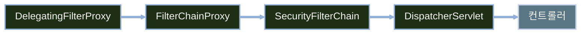
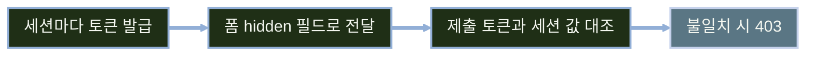

# Spring Security로 인증과 인가 적용하기

---
layout: default
---

# 학습 체크리스트 (1/2)

- [ ] 인증과 인가의 차이와 Spring Security 기본 동작 이해
- [ ] `SecurityFilterChain` 구조와 주요 보안 필터의 역할 파악
- [ ] `SecurityConfig`에서 경로별 인가 규칙을 선언하는 방법 습득
- [ ] 계정 정보를 `application.yml`로 외부화하고 인메모리 계정 구성

---
layout: default
---

# 학습 체크리스트 (2/2)

- [ ] 폼 로그인·세션·로그아웃 흐름과 세션 고정 방어 이해
- [ ] CSRF 공격 원리와 동기화 토큰 패턴 동작 파악
- [ ] Thymeleaf 폼에서 CSRF 토큰이 실리는 조건 확인
- [ ] 401·403의 의미를 구분해 인증·인가 실패를 처리하는 방법 습득

---
layout: default
---

# 인증과 인가

> **인증 (Authentication)**
>
> 요청을 보낸 사용자가 누구인지 확인하는 절차

> **인가 (Authorization)**
>
> 확인된 사용자가 이 자원에 접근할 권한이 있는지 판단하는 절차

- 순서 고정: 인증이 먼저 이루어지고, 그 결과를 바탕으로 인가 판단

---
layout: default
---

# 보안 로직을 직접 만들면 안 되는 이유

- **직접 구현의 위험**: 로그인 폼 처리·비밀번호 해시 비교·세션 고정 방어·CSRF 토큰 검증을 손수 작성하면 실수 하나가 전체 취약점으로 이어짐
- **검증된 절차 제공**: 프레임워크가 이미 검증된 인증·인가 절차를 표준으로 제공
- **선언적 역할 분담**: 애플리케이션은 "무엇을 허용하고 무엇을 차단할지"만 선언
- **관심사 분리**: 보안 메커니즘 구현과 비즈니스 정책 결정을 분리

---
layout: default
---

# 스타터 의존성 추가

```kotlin
implementation("org.springframework.boot:spring-boot-starter-security")
```

---
layout: default
---

# 의존성 추가만으로 적용되는 기본 동작

| 항목 | 기본 동작 |
| :--- | :--- |
| **경로 보호** | 애플리케이션 전 경로가 인증 요구 대상으로 전환 |
| **로그인 화면** | 기본 로그인 폼이 `/login`에 자동 생성 |
| **임시 계정** | 아이디 `user`, 무작위 비밀번호가 콘솔에 출력 |
| **로그아웃** | 기본 로그아웃 엔드포인트 `/logout` 제공 |
| **CSRF 방어** | 기본값으로 활성화 |

---
layout: default
---

# 안전한 기본값에서 출발하기

- **기본 원칙**: "일단 전부 막고 시작"하는 상태가 기본값
- **함부로 끄지 않기**: CSRF나 로그인 화면을 꺼서 익숙한 상태로 되돌리지 않음
- **최소 개방**: 필요한 경로만 최소한으로 열어서 사용
- **범위 제한**: 이번 차시는 세션 기반 SSR 전제, JWT·OAuth2·메서드 시큐리티는 별도 차시

---
layout: default
---

# 이번 차시 진행 순서


---
layout: default
---

# 요청이 컨트롤러에 닿기까지



---
layout: default
---

# 필터가 스프링 빈에게 위임되는 구조

- **보안 동작 구현 방식**: 서블릿 필터로 구현되어 요청/응답을 가로챔
- **컨테이너와의 연결점**: 서블릿 컨테이너가 아는 필터는 `DelegatingFilterProxy` 하나뿐
- **실제 처리 위임**: `FilterChainProxy`가 내부에서 여러 `SecurityFilterChain`을 관리
- **체인 선택 규칙**: 요청 경로에 매칭되는 첫 번째 체인이 해당 요청을 처리

---
layout: default
---

# 체인을 구성하는 주요 필터

| 필터 | 역할 |
| :--- | :--- |
| `SecurityContextHolderFilter` | 이전 인증 정보를 컨텍스트에 로드 |
| `CsrfFilter` | CSRF 토큰 검증 |
| `UsernamePasswordAuthenticationFilter` | 폼 로그인 자격 증명 인증 처리 |
| `ExceptionTranslationFilter` | 인증/인가 예외를 응답으로 변환 |
| `AuthorizationFilter` | 최종 접근 권한 판단 |

- 실제 순서는 버전·설정에 따라 다르므로 공식 문서 기준으로 확인

---
layout: default
---

# 인증 정보가 보관되는 자리

- **`Authentication`**: 누가 인증됐는지와 어떤 권한을 가졌는지 표현
- **보관 위치**: `SecurityContext`가 `Authentication`을 담아 보관
- **저장 방식**: `SecurityContextHolder`가 이를 ThreadLocal에 저장
- **조회 범위**: 같은 요청을 처리하는 동안이면 어디서든 조회 가능

---
layout: default
---

# 컨트롤러에서 현재 사용자 꺼내기

```java
@GetMapping("/me")
String me(@AuthenticationPrincipal UserDetails user, Model model) {
    model.addAttribute("username", user.getUsername());
    return "me";
}
// SecurityContextHolder 직접 접근보다 테스트하기 좋음
```

---
layout: default
---

# 인증을 나누어 맡는 구성 요소

| 구성 요소 | 역할 |
| :--- | :--- |
| `UserDetailsService` | 아이디로 사용자 조회 |
| `UserDetails` | 아이디·인코딩된 비밀번호·권한·계정 상태 표현 |
| `DaoAuthenticationProvider` | 조회된 정보로 비밀번호 대조 |
| `AuthenticationManager` | 인증 방식을 선택해 위임 |

- 대부분 자동 구성되어 직접 등록할 일 없음, 이번 차시는 `InMemoryUserDetailsManager` 사용

---
layout: default
---

# 비밀번호는 해시로 저장한다

- **평문 저장 금지**: 비밀번호는 단방향 해시로 변환해 저장
- **추상화 계층**: `PasswordEncoder`가 인코딩·검증 과정을 추상화
- **기본 구현**: `DelegatingPasswordEncoder`가 `{bcrypt}` 같은 접두사를 부착
- **알고리즘 전환 대응**: 접두사 덕분에 알고리즘을 바꿔도 기존 값 검증 가능
- 해시 특성과 `matches()` 세부 동작은 JPA 회원 차시에서 다룸

---
layout: default
---

# PasswordEncoder 빈 등록

```java
@Bean
PasswordEncoder passwordEncoder() {
    return PasswordEncoderFactories.createDelegatingPasswordEncoder();
}
// 애플리케이션 전체에 하나만 등록
```

---
layout: default
---

# SecurityConfig 뼈대와 필터 체인 빈 등록

```java
@Configuration
class SecurityConfig {

    @Bean
    SecurityFilterChain filterChain(HttpSecurity http) throws Exception {
        http.formLogin(Customizer.withDefaults())
            .logout(Customizer.withDefaults());
        return http.build();
    }
}
```

---
layout: default
---

# 설정 문법의 원칙

- **빈 등록 방식**: `@Bean`으로 `SecurityFilterChain`을 반환하는 방식만 사용
- **상속 제거**: `WebSecurityConfigurerAdapter` 상속 방식은 폐기되어 사용 불가
- **람다 DSL 전용**: `authorizeRequests()`·`antMatchers()`·`.and()` 체이닝은 폐기
- **가독성**: 설정 블록이 람다 안에서 들여쓰기로 분리되어 흐름 파악 용이

---
layout: default
---

# 경로별 인가 규칙 선언

```java
http.authorizeHttpRequests(auth -> auth
    .requestMatchers("/css/**", "/js/**", "/", "/login", "/error/**").permitAll()
    .requestMatchers(HttpMethod.GET, "/books").permitAll()
    .requestMatchers("/admin/**").hasRole("ADMIN")
    .anyRequest().authenticated()
);
```

---
layout: default
---

# 인가 규칙의 종류

| 규칙 | 의미 |
| :--- | :--- |
| `permitAll()` | 인증 여부와 무관하게 누구나 접근 허용 |
| `authenticated()` | 로그인한 사용자만 접근 허용 |
| `hasRole("ADMIN")` | 내부적으로 `ROLE_ADMIN` 권한 보유자만 허용 (접두사 직접 붙이지 않음) |
| `denyAll()` | 모든 접근을 무조건 차단 |

- `hasAnyRole`·`hasAuthority`도 존재하며, 세부 RBAC 설계는 JPA 회원 차시에서 다룸

---
layout: default
---

# 규칙은 위에서 아래로 평가된다

- **선언 순서대로 평가**: 등록된 규칙을 순차 검사하며 처음 매칭되는 규칙을 적용
- **구체적 경로 우선**: 좁은 범위의 경로 규칙을 넓은 범위보다 먼저 선언
- **anyRequest는 마지막**: `anyRequest()`는 반드시 체인의 가장 마지막에 위치
- **정적 리소스 우선 배치**: 정적 리소스 permitAll도 앞쪽에 선언해야 함

---
layout: default
---

# 순서를 잘못 둔 경우

```java
http.authorizeHttpRequests(auth -> auth
    .anyRequest().authenticated()          // 잘못된 순서
    .requestMatchers("/admin/**").hasRole("ADMIN")
);
```

---
layout: default
---

# 기본 프로퍼티로 임시 계정 만들기

```yaml
spring:
  security:
    user:
      name: admin
      password: ${ADMIN_PASSWORD}
      roles: ADMIN
```

---
layout: default
---

# 기본 프로퍼티의 한계

- **평문 취급**: 접두사 없는 값은 자동 해시되지 않고 `{noop}` 평문으로 간주
- **단일 계정**: 이 방식으로는 계정 하나만 등록 가능
- **자동 구성 후퇴**: 커스텀 `UserDetailsService` 빈 등록 시 자동 구성 물러남
- **용도 한정**: 학습·로컬 환경 확인용으로만 사용

---
layout: default
---

# 계정 값을 커스텀 프로퍼티로 옮기기

```yaml
app:
  security:
    admin:
      username: admin
      password: ${ADMIN_PASSWORD}
      role: ADMIN
```

---
layout: default
---

# 인메모리 계정 빈 직접 구성

```java
@Bean
UserDetailsService userDetailsService(
        @Value("${app.security.admin.username}") String name,
        @Value("${app.security.admin.password}") String password,
        PasswordEncoder encoder) {
    UserDetails admin = User.builder().username(name)
        .password(encoder.encode(password))
        .roles("ADMIN").build();
    return new InMemoryUserDetailsManager(admin);
}
```

---
layout: default
---

# 계정 정보를 다룰 때의 원칙

- **환경 변수 주입**: 비밀번호는 환경 변수로 주입하고 yml에 평문 커밋 금지
- **기본값 미지정**: 프로퍼티 기본값을 주지 않아 미설정 시 기동 즉시 실패하도록 구성
- **설정 묶음화**: 설정 항목이 늘어나면 `@ConfigurationProperties`로 묶어 관리
- **데모 API 금지**: `User.withDefaultPasswordEncoder()`는 데모 전용이므로 사용 금지

---
layout: default
---

# 폼 로그인 경로를 SecurityFilterChain에 지정

```java
http
    .formLogin(form -> form
        .loginPage("/login")
        .loginProcessingUrl("/login")
        .defaultSuccessUrl("/books")
        .failureUrl("/login?error")
        .permitAll()
    );
```

---
layout: default
---

# loginPage와 loginProcessingUrl이 나뉘는 이유

- **`loginPage`**: 로그인 폼을 보여줄 GET 경로
- **`loginProcessingUrl`**: 제출된 폼을 인증 처리하는 POST 경로
- **같은 값 사용 시**: GET은 폼 렌더링, POST는 인증 처리로 자동 구분
- **컨트롤러 필요**: `loginPage` 지정 시 해당 경로를 렌더링할 매핑 직접 작성 필수
- **`defaultSuccessUrl`**: 가로막힌 원래 요청이 있으면 그쪽 우선, 두 번째 인자 `true`면 항상 고정 이동

---
layout: default
---

# Thymeleaf 로그인 폼 템플릿

```html
<form th:action="@{/login}" method="post">
    <p th:if="${param.error}">아이디 또는 비밀번호가 올바르지 않습니다.</p>
    <input type="text" name="username" />
    <input type="password" name="password" />
    <button type="submit">로그인</button>
</form>
```

---
layout: default
---

# 실패 메시지는 하나로 통일한다

- **리다이렉트**: 인증 실패 시 `failureUrl`로 이동, `param.error`로 실패 여부 표시
- **로그아웃 표시**: 로그아웃 완료는 `param.logout`으로 별도 구분
- **원인 미구분**: "아이디 없음"과 "비밀번호 틀림"을 화면에서 구분하지 않음
- **이유**: 구분해서 노출하면 계정 열거(user enumeration) 공격에 악용 가능

---
layout: default
---

# 로그인 후 상태가 유지되는 방식

| 시점 | 동작 |
| :--- | :--- |
| 로그인 성공 | `SecurityContext`를 `HttpSession`에 저장하고 `JSESSIONID` 발급 |
| 이후 요청 | 브라우저가 보낸 쿠키로 세션 조회해 인증 상태 복원 |
| 로그아웃 | 세션 무효화 및 쿠키 삭제 |

---
layout: default
---

# 세션 고정 공격과 기본 방어

- **세션 고정 공격**: 로그인 전 세션 ID를 그대로 쓰면 공격자가 심어둔 세션을 가로챌 수 있음
- **기본 방어**: Spring Security는 인증 성공 시 세션 ID를 새로 발급
- **전략 조정**: `sessionManagement`로 세션 생성·고정 방지 전략 변경 가능
- **동시 세션 제한**: `maximumSessions(1)`로 계정당 활성 세션 수 제한

---
layout: default
---

# 세션과 로그아웃 설정

```java
http
    .sessionManagement(session -> session.maximumSessions(1))
    .logout(logout -> logout
        .logoutUrl("/logout")
        .logoutSuccessUrl("/login?logout")
        .invalidateHttpSession(true)
        .deleteCookies("JSESSIONID")
    );
```

---
layout: default
---

# 로그아웃은 POST로 보낸다

- **기본 제약**: `/logout`은 기본적으로 POST 요청만 수용
- **링크 실패 이유**: CSRF가 켜져 있어 `<a href="/logout">` 링크는 토큰이 없어 실패
- **올바른 방식**: `<form method="post">`로 로그아웃 요청 전송
- **참고**: 세션 방식은 서버가 상태를 보관, JWT 기반 무상태 인증은 별도 차시

---
layout: default
---

# CSRF가 성립하는 이유

- **자동 첨부**: 브라우저는 해당 도메인 요청이면 누가 시작했든 쿠키를 자동 첨부
- **탈취 불필요**: 공격자는 쿠키를 훔치거나 응답 내용을 읽을 필요 없음
- **로그인만으로 방어 불가**: 이미 로그인된 상태이기 때문에 오히려 요청이 성립
- **핵심 문제**: "누가 보냈나"는 확인되지만 "우리 화면에서 의도적으로 보냈나"는 확인 안 됨

---
layout: default
---

# 도서 삭제 요청이 위조되는 과정

| 단계 | 진행 |
| :--- | :--- |
| 1 | 정상 로그인 후 세션 쿠키 보관 |
| 2 | 같은 브라우저로 악성 사이트 방문 |
| 3 | 숨겨진 폼이 `/books/1/delete`로 자동 제출 |
| 4 | 브라우저가 세션 쿠키를 자동 첨부 |
| 5 | 서버가 정상 요청으로 오인해 삭제 처리 |

---
layout: default
---

# 동기화 토큰 패턴



---
layout: default
---

# CSRF 검사 대상과 원칙

| HTTP 메서드 | 검사 여부 |
| :--- | :--- |
| GET·HEAD·OPTIONS·TRACE | 검사 안 함 |
| POST·PUT·PATCH·DELETE | 검사함 |

- **원칙**: 상태 변경 요청은 반드시 POST 이상의 메서드로 작성
- **주의**: `SameSite=Lax` 쿠키 속성만으로는 충분한 방어가 아님
- **금지 사항**: 세션 기반 SSR에서 `csrf.disable()` 금지, 필요 시 `ignoringRequestMatchers("/api/**")`로 부분 예외

---
layout: default
---

# Thymeleaf 폼에 CSRF 토큰 자동 삽입

```html
<form th:action="@{/books/1/delete}" method="post">
    <input type="hidden"
           th:name="${_csrf.parameterName}"
           th:value="${_csrf.token}" />
    <button type="submit">삭제</button>
</form>
<!-- th:action이면 자동 삽입, 순수 action은 미삽입 → 403 -->
```

---
layout: default
---

# 두 갈래로 나뉘는 보안 예외

| 예외 | 위임 대상 |
| :--- | :--- |
| `AuthenticationException` (미인증) | `AuthenticationEntryPoint` |
| `AccessDeniedException` (권한 없음) | `AccessDeniedHandler` |

- **`ExceptionTranslationFilter`**: 필터 체인에서 잡힌 예외 종류를 판별해 위 둘 중 하나로 위임

---
layout: default
---

# 401과 403의 의미 차이

- **401 Unauthorized**: 당신이 누구인지 아직 모른다(인증 자체가 안 됨)
- **403 Forbidden**: 누구인지는 알지만 이 자원 접근이 허용되지 않는다
- **폼 로그인 SSR 기본 동작**: 401 대신 로그인 페이지로 리다이렉트
- **API 전용 체인**: `HttpStatusEntryPoint(HttpStatus.UNAUTHORIZED)`로 401 응답 반환

---
layout: default
---

# 진입점과 핸들러 직접 교체

```java
http.exceptionHandling(ex -> ex
    .authenticationEntryPoint(customEntryPoint)
    .accessDeniedHandler(customAccessDeniedHandler)
);
```

---
layout: default
---

# 기존 403 페이지를 그대로 쓰는 핸들러

```java
class SimpleAccessDeniedHandler implements AccessDeniedHandler {

    @Override
    public void handle(HttpServletRequest req, HttpServletResponse res,
                        AccessDeniedException ex) throws IOException {
        res.sendError(HttpServletResponse.SC_FORBIDDEN);
    }
}
```

---
layout: default
---

# 리다이렉트 루프라는 함정

- **루프 발생 조건**: 오류·로그인 페이지 자체가 인가 규칙에 걸리면 접근 거부 발생
- **악순환 구조**: 접근 거부 → 오류 페이지 이동 → 다시 거부 → 무한 반복
- **예방 규칙**: `/login`, `/error/**` 경로는 반드시 `permitAll` 처리
- **화면 재사용**: 403 차시에서 만든 상태 코드별 템플릿을 그대로 활용

---
layout: default
---

# @ControllerAdvice가 닿지 않는 곳

| 발생 시점 | 처리 가능 여부 |
| :--- | :--- |
| 필터 체인 (URL 인가 실패, CSRF 토큰 누락) | 처리 불가 — `AccessDeniedHandler` 담당 |
| 컨트롤러 메서드 호출 시점 (`@PreAuthorize`) | 처리 가능 |

- **경계선**: advice는 컨트롤러 호출 이후 계층에서만 동작

---
layout: default
---

# 화면에서의 권한 표현

- **Thymeleaf Security 확장**: `sec:authorize`, `sec:authentication` 태그 사용
- **메뉴 분기**: 로그인 상태와 권한에 따라 표시할 메뉴 항목 결정
- **UX일 뿐인 숨김**: 버튼을 화면에서 숨기는 것은 편의 제공이지 보안 조치가 아님
- **실질적 통제**: 접근 통제는 항상 `authorizeHttpRequests`의 서버 측 규칙이 담당

---
layout: default
---

# 설정 위치 한눈에 보기

| 항목 | 어디에 설정 |
| :--- | :--- |
| 경로별 인가 규칙 | `authorizeHttpRequests(...)` |
| 비밀번호 인코딩 | `PasswordEncoder` 빈 하나 |
| 계정 정보 외부화 | `application.yml` + 환경 변수 |
| 로그인·로그아웃 | `formLogin(...)`, `logout(...)` |
| 인증·인가 실패 분기 | `exceptionHandling(...)` |

---
layout: default
---

# 학습 요약 (1/2)

- **인증과 인가**: 누구인지 확인한 뒤, 그 결과로 접근 권한을 판단
- **필터 체인**: `SecurityFilterChain`의 보안 필터가 순서대로 요청을 검사
- **인가 규칙**: 구체적 경로를 먼저, `anyRequest()`는 반드시 마지막
- **계정 외부화**: 커스텀 프로퍼티 + 환경 변수, 비밀번호는 항상 인코딩

---
layout: default
---

# 학습 요약 (2/2)

- **폼 로그인**: 세션에 `SecurityContext`를 저장하고 `JSESSIONID`로 상태 유지
- **CSRF**: 세션 쿠키 자동 전송을 막는 별도 층, 끄지 않고 `th:action`으로 작성
- **실패 처리**: 401은 `AuthenticationEntryPoint`, 403은 `AccessDeniedHandler`
- **화면 분기**: `sec:` 네임스페이스는 UX 수단일 뿐 서버 인가 규칙을 대체하지 않음
