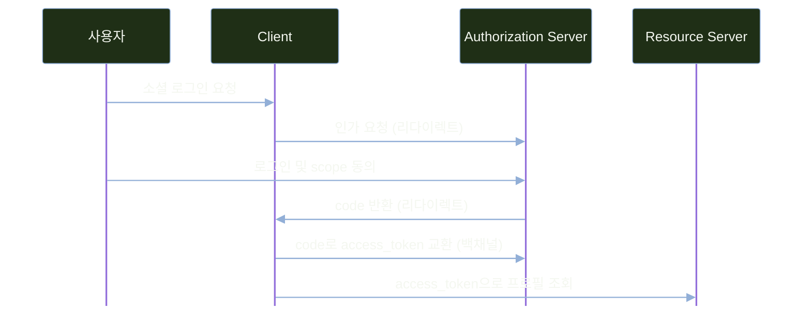

# OAuth2 소셜 로그인 연동

---
layout: default
---

# 학습 체크리스트 (1/2)

- [ ] 비밀번호를 넘기지 않고 권한만 위임하는 OAuth2의 취지 이해
- [ ] `Resource Owner`·`Client`·`Authorization Server`·`Resource Server` 역할 구분
- [ ] 인가 코드 그랜트(Authorization Code Grant) 단계와 `code`를 먼저 받는 이유 파악
- [ ] `oauth2Login` 설정과 프레임워크 기본 경로 규약 습득

---
layout: default
---

# 학습 체크리스트 (2/2)

- [ ] `registration`과 `provider` 설정의 역할 분리와 시크릿 관리 원칙 확인
- [ ] 제공자별 응답 구조 차이를 `OAuth2UserService`에서 정규화하는 방법 습득
- [ ] 폼·소셜 로그인을 하나의 principal 타입으로 통합하는 설계 이해
- [ ] `(provider, providerId)` 기반 계정 식별과 이메일 자동 통합의 위험 파악

---
layout: default
---

# 학습 범위

- **선행 조건**: DB 기반 회원 관리와 경로 단위 RBAC 완성
- **1. 원리 이해**: OAuth2의 역할 구성과 인가 코드 그랜트(Authorization Code Grant) 흐름
- **2. 클라이언트 구성**: `oauth2Login` 설정과 제공자 등록
- **3. 실제 연동**: 구글·카카오 사용자 정보를 회원 테이블에 연결

---
layout: default
---

# 전체 진행 순서


---
layout: cover
class: text-center
---

# OAuth2의 원리와 구성

---
layout: default
---

# 비밀번호를 통째로 넘기는 방식의 위험

- **자체 인증의 부담**: 해싱·유출 대비·무차별 대입 방어까지 전부 애플리케이션에서 담당
- **위임 시나리오**: 카카오 메일함 대행 기능을 아이디·비밀번호를 직접 받아 저장하는 방식으로 구현
- **전면 노출**: 클라이언트 서버가 침해되면 카카오 계정 전체 권한 유출 위험
- **세분화 불가**: "메일함 읽기만 허용" 같은 권한 범위 제한이 불가능
- **해지 불가**: 비밀번호를 바꾸는 것 외에 개별 연동만 취소할 방법이 없음

---
layout: default
---

# OAuth2의 해법

> **인가 위임 (OAuth2)**
>
> 비밀번호를 아예 넘기지 않고, 필요한 권한(scope)만 담긴 토큰을 대신 발급받는 표준

- **비밀번호 미노출**: 사용자는 카카오·구글 화면에서만 비밀번호 입력
- **제한된 노출**: 애플리케이션 서버가 침해되어도 유출되는 위험 범위는 제한된 권한의 토큰으로 국한
- **개별 해지**: 사용자가 카카오 계정 설정에서 연동만 따로 해지 가능

---
layout: default
---

# OAuth2의 네 가지 역할

| 역할 | 이 실습에서의 예 | 아는 것 / 모르는 것 |
| :--- | :--- | :--- |
| `Resource Owner` | 가입하려는 사용자 | 어떤 scope를 허용할지 동의 화면에서 직접 결정 |
| `Client` | 서비스 애플리케이션 (Spring Boot) | 비밀번호는 전혀 모름, 발급받은 토큰으로만 접근 |
| `Authorization Server` | 카카오·구글 인증 서버 | 사용자 인증·동의 처리, 가능한 경우 `Client`도 인증 |
| `Resource Server` | 카카오·구글 프로필 API | 로그인 과정은 모름, `access_token` 유효성만 확인 |

---
layout: default
---

# 인가 코드 그랜트(Authorization Code Grant) 흐름



---
layout: default
---

# 토큰 대신 code를 먼저 받는 이유

- **프런트채널의 한계**: 리다이렉트 URL은 브라우저 히스토리·서버 로그·`Referer` 헤더로 노출될 수 있음
- **돌아오는 값**: 브라우저에 전달되는 값은 `access_token`이 아니라 일회성 `code`뿐
- **백채널 교환**: 실제 토큰 교환은 브라우저를 거치지 않고 서버 간 직접 통신으로 수행
- **피해 최소화**: `code`가 노출되어도 토큰 자체가 유출되는 것보다 안전

---
layout: default
---

# client_secret과 PKCE의 역할

| 보안 장치 | 막는 위험 | 주 사용 대상 |
| :--- | :--- | :--- |
| `client_secret` | 위조 클라이언트의 토큰 요청 | 비밀을 보관할 수 있는 서버형 클라이언트 |
| PKCE `code_verifier` | 탈취한 인가 코드의 교환 | 모든 인가 코드 클라이언트에 권장 |

- 두 장치는 목적이 달라 함께 사용할 수 있으며, `client_secret`은 인가 코드 흐름 자체의 필수 요소가 아님

---
layout: default
---

# state로 막는 로그인 CSRF

- **동작 방식**: 인가 요청에 임의 문자열 `state`를 실어 보내고, 콜백에서 그대로 되돌려받아 대조
- **막는 공격**: 공격자가 미리 받아 둔 `code`를 사용자 브라우저에 주입하는 로그인 CSRF
- **불일치 시 거부**: 되돌아온 `state`가 저장된 값과 다르면 콜백을 거부
- **자동 처리**: Spring Security가 `oauth2Login` 구성만으로 생성·검증을 자동 처리

---
layout: default
---

# OAuth2 그랜트 타입 (Grant Type)

> **그랜트 타입 (Grant Type)**
>
> 클라이언트가 인가 서버로부터 액세스 토큰(Access Token)을 발급받는 승인 절차 및 권한 부여 방식

- **선택 기준**: 클라이언트의 유형(서버형/클라이언트형)과 보안 요구사항에 따라 결정
- **핵심 목적**: 부적격 클라이언트의 토큰 발급을 차단하고 최적의 인증 흐름을 제공
- **적용 대상**: 본 실습에서는 가장 표준적이고 안전한 `authorization_code` 방식 적용

---
layout: default
---

# 주요 그랜트 타입 비교

| 그랜트 타입 | 용도 | 현재 상태 |
| :--- | :--- | :--- |
| `authorization_code` | 사용자 개입 표준 로그인 (이 교안 사용) | 표준 (권장) |
| `client_credentials` | 서버 간 직접 인증 (비대면) | 표준 |
| `refresh_token` | 만료 토큰 재로그인 없이 갱신 | 표준 |
| `implicit` | SPA에 토큰 직접 반환 (보안 위험) | OAuth 2.1 초안에서 제외 |
| `password` (Resource Owner) | 클라이언트가 사용자 비밀번호 수령 | OAuth 2.1 초안에서 제외 |

- **2026년 8월 기준**: OAuth 2.1은 RFC가 아니라 IETF Internet-Draft 단계

---
layout: default
---

# OIDC(OpenID Connect)는 무엇이 다른가

> **오픈아이디 커넥트 (OpenID Connect, OIDC)**
>
> OAuth 2.0 프로토콜 상단에 사용자 신원 인증(Authentication) 계층을 추가한 표준 인증 프로토콜

- **역할 차이**: OAuth2는 인가(Authorization) 위임, OIDC는 신원 인증(Authentication)까지 담당
- **핵심 산출물**: `id_token`(JWT)을 추가로 발급받아 별도 API 호출 없이 사용자 신원 증명
- **이번 실습 범위**: `access_token`으로 프로필 API를 호출하는 순수 OAuth2 흐름을 사용

---
layout: default
---

# 꼭 필요한 scope만 요청하기

- **최소 권한 원칙**: 이메일·닉네임만 필요하면 그 이상 요청하지 않음
- **동의 포기율**: 권한 목록이 과도하면 동의 화면에서 이탈 증가
- **피해 범위**: 필요 이상의 scope로 발급된 토큰이 유출되면 피해 범위도 함께 증가
- **설계 시점 결정**: scope 선택은 코드를 작성하기 전, 설계 단계에서부터 최소화
---
layout: cover
class: text-center
---

# oauth2Login으로 클라이언트 구성하기

---
layout: default
---

# OAuth2 클라이언트 의존성 추가

```kotlin
dependencies {
    implementation("org.springframework.boot:spring-boot-starter-oauth2-client")
}
```

---
layout: default
---

# 프레임워크 기본 제공 경로

| 경로 | 역할 |
| :--- | :--- |
| `/oauth2/authorization/{registrationId}` | 인가 요청 시작점 |
| `/login/oauth2/code/{registrationId}` | 콜백 수신점 |

- **역할 분담**: 인가 요청·콜백·토큰 교환은 프레임워크가, 설정과 회원 연동은 개발자가 담당
- **registrationId 일치**: yml `registration` 아래 키 이름과 정확히 같아야 함
- **콘솔 등록값**: `{baseUrl}/login/oauth2/code/{registrationId}` 형태를 그대로 등록

---
layout: default
---

# 폼 로그인과 소셜 로그인 동시 구성

```java
http
    .formLogin(form -> form
        .loginPage("/login")
        .permitAll())
    .oauth2Login(oauth2 -> oauth2
        .loginPage("/login")
        .defaultSuccessUrl("/boards", true)
        .userInfoEndpoint(userInfo -> userInfo
            .userService(customOAuth2UserService)));
```

---
layout: default
---

# 로그인 화면 하나로 수렴하는 이유

- **동일 loginPage**: `formLogin`과 `oauth2Login`이 같은 `/login`을 가리킴
- **토큰 타입은 다르되**: `UsernamePasswordAuthenticationToken`과 `OAuth2AuthenticationToken` 모두 `Authentication` 구현체
- **인가 규칙 동일**: 이후 `@AuthenticationPrincipal`, `authorizeHttpRequests`는 경로 구분 없이 동작
- **연동 지점**: `userInfoEndpoint`의 `userService(...)`로 소셜 사용자를 DB와 연결

---
layout: default
---

# registration과 provider의 역할 분리

- **registration.\<id\>**: 서비스 애플리케이션이 특정 제공자와 맺는 클라이언트 자격 증명과 스코프
- **provider.\<id\>**: 해당 서비스가 제공하는 인가 서버 엔드포인트 정의
- **생략 가능 조건**: 내장 provider를 사용하면 `provider` 블록 자체가 필요 없음

---
layout: default
---

# registration 주요 속성

| 속성 | 의미 |
| :--- | :--- |
| `client-id` | 인가 서버에 등록한 클라이언트 식별자 |
| `client-secret` | 클라이언트 비밀 값(평문 커밋 금지) |
| `scope` | 요청할 권한 범위 목록 |
| `redirect-uri` | 콜백 URI 템플릿 |
| `client-authentication-method` | 토큰 엔드포인트 인증 방식 |
| `provider` | `provider.<id>` 블록 참조 키(내장 provider면 생략) |

---
layout: default
---

# 구글 클라이언트 등록 설정

```yaml
spring:
  security:
    oauth2:
      client:
        registration:
          google:
            client-id: ${GOOGLE_CLIENT_ID}
            client-secret: ${GOOGLE_CLIENT_SECRET}
            scope:
              - profile
              - email
```

---
layout: default
---

# 내장 제공자와 직접 명시해야 하는 제공자

- **내장 5종**: 최신 `CommonOAuth2Provider`에 구글·깃허브·페이스북·X·옥타가 포함
- **내장 시 생략**: `client-id`/`client-secret`만으로 동작
- **직접 명시 필요**: 카카오·네이버는 내장되지 않음
- **필수 4개 속성**: `authorization-uri`, `token-uri`, `user-info-uri`, `user-name-attribute`

---
layout: default
---

# client-secret 외부화 및 보안 관리

- **평문 커밋 금지**: yml에는 `${GOOGLE_CLIENT_SECRET}` 같은 환경 변수 플레이스홀더만 기입
- **값 분리 보관**: 로컬 환경 변수, 커밋 제외 `application-local.yml`, 배포 환경의 시크릿 매니저로 분리
- **유출 시 대응**: 파일 삭제로는 커밋 이력이 남으므로 보안 조치로 불충분
- **유일한 올바른 조치**: 인가 서버 콘솔에서 즉시 시크릿 재발급(회전) 후 재배포

---
layout: default
---

# UserDetails와 OAuth2User

| 구분 | `UserDetails` | `OAuth2User` |
| :--- | :--- | :--- |
| 출처 | 폼 로그인, DB 조회 | OAuth2 user-info 응답 |
| 식별자 표현 | `getUsername()` | `getName()` |
| 속성 접근 | 엔티티 필드 직접 접근 | `getAttributes()` |

---
layout: default
---

# principal 타입 이원화 문제

- **경로별 타입 차이**: 폼 로그인은 `CustomUserDetails`, 소셜 로그인은 `OAuth2User`
- **기존 코드 파손**: `@AuthenticationPrincipal CustomUserDetails user` 파라미터에 `null`이 전달됨
- **원인**: 로그인 경로에 따라 주입되는 principal 구현 타입 자체가 다름
- **해결 예고**: 다음 파트에서 통합 타입 `CustomOAuth2User`로 흡수
---
layout: cover
class: text-center
---

# Google·Kakao 연동 구현

---
layout: default
---

# 사전 작업: 인가 서버 콘솔 설정

| 구분 | Google Cloud Console | Kakao Developers |
| :--- | :--- | :--- |
| 클라이언트 ID | 자동 발급 `xxxx.apps.googleusercontent.com` | REST API 키를 사용 |
| 클라이언트 시크릿 | 자동 발급 | REST API 키에 기본 활성화, 값 확인 |
| 리디렉션 URI | `.../login/oauth2/code/google` | `.../login/oauth2/code/kakao` |
| 동의 항목 | 이메일, 프로필 | 닉네임(기본 제공), 이메일(비즈 앱 필요) |

---
layout: default
---

# 로컬 회원과 소셜 회원을 한 테이블에 담기

```java
enum AuthProvider {
    LOCAL, GOOGLE, KAKAO
}

// UserAccount에 추가되는 필드
private String password;   // 소셜 회원은 null 허용
private String email;
private AuthProvider provider = AuthProvider.LOCAL;
private String providerId;
```

---
layout: default
---

# 소셜 가입 회원을 만드는 팩토리

```java
static UserAccount registerSocial(
        AuthProvider provider, String providerId,
        String nickname, String email) {
    return UserAccount.builder()
            .uuid(UUID.randomUUID())
            .username(provider.name().toLowerCase() + "_" + providerId)
            .nickname(nickname).email(email)
            .provider(provider).providerId(providerId)
            .roles(EnumSet.of(Role.USER)).enabled(true)
            .build();
}
```

---
layout: default
---

# 소셜 회원의 비밀번호 관리 정책

- **nullable password**: `password` 컬럼의 `nullable = false`를 제거해 소셜 회원을 표현
- **DelegatingPasswordEncoder 예외**: null이거나 인코더 식별자 없는 값은 단순 불일치가 아니라 예외로 처리될 수 있음
- **임의 비밀번호 채우기 지양**: 더미 비밀번호로 폼 로그인을 방어하는 방식은 지양
- **경로 분리**: `findByUsernameAndProvider(username, LOCAL)`처럼 로컬 계정 전용 진입점을 둔다

---
layout: default
---

# 복합 식별자 (provider, providerId)

- **sub/id는 제공자 내부 전용**: 구글 `sub`, 카카오 `id`는 각자 안에서만 유일하며, 제공자 간 식별자가 충돌할 수 있음
- **복합 유니크 제약**: 진짜 식별자는 `(provider, providerId)` 조합
- **username은 접두사로 구분**: `"google_1234567890"`처럼 provider 접두사를 붙여 충돌을 원천 차단

---
layout: default
---

# 이메일 기반 자동 계정 통합 금지

- **account takeover 시나리오**: 인가 서버가 이메일 소유권을 검증하지 않으면, 공격자가 피해자 이메일을 자기 소셜 프로필에 등록하고 로그인해 기존 계정을 탈취할 수 있음
- **제공자별 별도 계정이 기본 원칙**: 이메일이 같아도 자동으로 연결하지 않음
- **통합은 명시적 플로우로만**: 이미 로그인된 상태에서 "계정 연동하기"로 본인 확인 후 연결

---
layout: default
---

# 카카오 클라이언트 등록 설정

```yaml
spring:
  security:
    oauth2:
      client:
        registration:
          kakao:
            client-id: ${KAKAO_CLIENT_ID}
            client-secret: ${KAKAO_CLIENT_SECRET}
            client-authentication-method: client_secret_post
            scope: [profile_nickname]
```

---
layout: default
---

# 카카오 인가 서버 엔드포인트 설정

```yaml
spring:
  security:
    oauth2:
      client:
        provider:
          kakao:
            authorization-uri: https://kauth.kakao.com/oauth/authorize
            token-uri: https://kauth.kakao.com/oauth/token
            user-info-uri: https://kapi.kakao.com/v2/user/me
            user-name-attribute: id
```

---
layout: default
---

# 카카오 설정 시 주의할 사항

- **client_secret_post**: 카카오 토큰 엔드포인트는 HTTP Basic 미지원, 기본값을 두면 `invalid_client`
- **user-name-attribute: id**: 카카오 응답 최상위 키가 `id`, `OAuth2User.getName()`이 반환할 값과 일치해야 함
- **profile_nickname만 요청**: 이메일 수령은 비즈 앱 검수가 필요해 우선 배제
- **구글 scope에 openid 미포함**: 포함 시 OIDC 흐름을 타므로, 카카오와 같은 처리 경로로 통일하기 위함

---
layout: default
---

# 제공자마다 다른 응답 구조

| 항목 | Google 응답 키 | Kakao 응답 키 |
| :--- | :--- | :--- |
| 고유 ID | `sub` | `id` |
| 닉네임 | `name` | `kakao_account.profile.nickname` |
| 이메일 | `email` | `kakao_account.email` |

---
layout: default
---

# 통합 Principal 타입 설계

```java
class CustomOAuth2User extends CustomUserDetails
        implements OAuth2User {
    private final Map<String, Object> attributes;

    CustomOAuth2User(UserAccount account, Map<String, Object> attrs) {
        super(account);
        this.attributes = attrs;
    }

    public Map<String, Object> getAttributes() { return attributes; }
    public String getName() { return String.valueOf(getId()); }
}
```

---
layout: default
---

# 기존 컨트롤러 호환성 유지 설계

- **다형성으로 동작**: `@AuthenticationPrincipal CustomUserDetails user`로 작성된 기존 컨트롤러가 `CustomOAuth2User`도 그대로 수용
- **getAuthorities 재구현 불필요**: 부모가 이미 권한 목록을 보관하고 있어 `OAuth2User` 요구사항을 충족
- **instanceof 분기의 단점**: 인증 방식이 추가될 때마다 분기 코드가 컨트롤러 전반에 확산
- **공통 인터페이스 분리의 단점**: 기존 사용처를 전부 새 타입으로 변경해야 하는 부담

---
layout: default
---

# 사용자 정보 응답 정규화

```java
OAuth2User oAuth2User = super.loadUser(userRequest);
String registrationId = userRequest.getClientRegistration()
        .getRegistrationId();
Map<String, Object> attrs = oAuth2User.getAttributes();

String providerId = switch (registrationId) {
    case "google" -> requiredString(attrs.get("sub"));
    case "kakao" -> requiredString(attrs.get("id"));
    default -> throw new OAuth2AuthenticationException(registrationId);
};
```

---
layout: default
---

# 회원 조회 및 자동 가입 처리

```java
UserAccount userAccount = userAccountRepository
        .findByProviderAndProviderId(provider, providerId)
        .map(existing -> {
            existing.updateFromSocial(nickname);
            return existing;
        })
        .orElseGet(() -> userAccountRepository.save(
                UserAccount.registerSocial(
                        provider, providerId, nickname, email)));
```

---
layout: default
---

# 자동 가입 처리 시 준수 원칙

- **providerId 없으면 인증 실패**: 계정 동일성의 기준이므로 없거나 비어 있으면 요청을 거부
- **닉네임 누락 시 기본 표시명**: 화면 표시값이므로 없으면 기본값으로 대체
- **dirty checking으로 save 불필요**: 기존 회원 갱신은 트랜잭션 종료 시 자동 반영
- **신규 회원은 언제나 Role.USER**: ADMIN 같은 민감 권한을 이 경로에서 부여 금지

---
layout: default
---

# 로그인 화면 접근 허용 설정

```java
http
    .authorizeHttpRequests(auth -> auth
        .requestMatchers("/", "/signup", "/login").permitAll()
        .anyRequest().authenticated())
    .oauth2Login(oauth2 -> oauth2
        .loginPage("/login")
        .defaultSuccessUrl("/boards", true)
        .userInfoEndpoint(userInfo -> userInfo
            .userService(customOAuth2UserService)));
```

---
layout: default
---

# OAuth2 필터 경로와 접근 규칙

- **로그인 화면은 공개**: 커스텀 GET `/login`은 익명 사용자가 열 수 있도록 허용
- **인가 요청 시작점**: `/oauth2/authorization/{registrationId}`는 OAuth2 전용 필터가 처리
- **콜백 수신점**: `/login/oauth2/code/{registrationId}`도 OAuth2 전용 필터가 처리
- **별도 permitAll 불필요**: 최신 공식 예제도 `anyRequest().authenticated()`와 함께 두 경로를 사용

---
layout: default
---

# 로그인 화면의 소셜 버튼

```html
<div sec:authorize="isAnonymous()">
  <form th:action="@{/login}" method="post">
    <input type="text" name="username" />
    <input type="password" name="password" />
    <button type="submit">로그인</button>
  </form>
  <a th:href="@{/oauth2/authorization/google}">Google로 로그인</a>
  <a th:href="@{/oauth2/authorization/kakao}">Kakao로 로그인</a>
</div>
```

---
layout: default
---

# 자주 마주치는 오류 (1/2)

| 오류 | 원인 | 조치 |
| :--- | :--- | :--- |
| `redirect_uri_mismatch` | 콘솔 등록 URI와 실제 요청 URI 불일치 | 콘솔 URI를 콜백 URI와 정확히 맞춤 |
| `KOE006` | 카카오 콘솔에 Redirect URI 미등록 | Redirect URI 등록 메뉴에서 콜백 URI 추가 |
| `KOE205` | scope 미설정 또는 OIDC 비활성 상태에서 `openid` 요청 | scope 활성화 또는 `openid` 제외 |

---
layout: default
---

# 자주 마주치는 오류 (2/2)

| 오류 | 원인 | 조치 |
| :--- | :--- | :--- |
| `invalid_client` | client-secret 불일치 또는 인증 방식 불일치 | `client_secret_post` 지정 여부·시크릿 값 확인 |
| `missing_user_name_attribute` | provider 블록에 `user-name-attribute` 미지정 | `provider.kakao`에 `user-name-attribute: id` 추가 |
| 이메일 미수령(`null`) | 카카오는 이메일 제공에 사전 검증 필요 | 이메일 수집 배제 또는 추가 입력 페이지 유도 |
---
layout: default
---

# 소셜 로그인 책임 분담 정리

| 항목 | 어디에 구현 | 왜 필요한가 |
| :--- | :--- | :--- |
| 인가 코드 그랜트 | 프레임워크가 수행 | 토큰을 브라우저에 노출하지 않고 백채널에서 교환 |
| 클라이언트 등록 | `application.yml` | 자격 증명과 엔드포인트를 코드 밖으로 외부화 |
| 응답 속성 파싱 | `CustomOAuth2UserService` | 제공자별 JSON 구조 차이를 한곳에서 흡수 |
| 통합 principal | `CustomOAuth2User` | 폼·소셜 로그인이 같은 타입으로 주입 |
| 소셜 계정 식별 | `(provider, providerId)` 유니크 | 제공자 간 ID 충돌과 계정 탈취 위험 차단 |

---
layout: default
---

# 학습 요약 (1/2)

- **OAuth2의 목적**: 사용자 비밀번호를 공유하지 않고, 동의한 `scope` 범위의 접근 권한을 애플리케이션에 위임
- **역할의 분리**: 사용자는 권한을 승인하고, 인가 서버는 코드를 발급하며, 클라이언트는 토큰으로 리소스 서버에 접근
- **인가 코드 흐름**: 브라우저에는 일회성 `code`만 전달하고, 액세스 토큰은 서버 간 백채널에서 교환
- **Spring Security의 역할**: `oauth2Login`이 인가 요청, `state` 검증, 콜백 처리와 토큰 교환을 담당

---
layout: default
---

# 학습 요약 (2/2)

- **제공자 설정**: `registration`에는 클라이언트 자격과 scope를, `provider`에는 엔드포인트와 사용자 식별 속성을 정의
- **사용자 정규화**: 제공자마다 다른 응답을 `OAuth2UserService`에서 해석해 하나의 principal 타입으로 변환
- **계정 식별**: 이메일이 아니라 `(provider, providerId)`를 기준으로 저장하고, 계정 연결은 본인 확인을 거쳐 명시적으로 수행
- **운영 보안**: 리디렉션 URI를 정확히 일치시키고, client secret은 외부화하며 유출 시 즉시 회전
