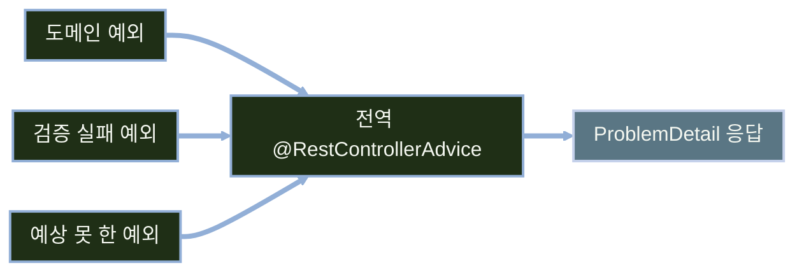

# REST API 예외 처리와 문서화

---
layout: default
---

# 학습 체크리스트 (1/2)

- [ ] SSR 예외 처리와 REST 예외 처리의 차이, 상태 코드가 계약이 되는 이유 이해
- [ ] `@ControllerAdvice`와 `@RestControllerAdvice`의 반환값 해석 차이 파악
- [ ] RFC 9457과 `ProblemDetail`의 표준 필드·확장 필드 사용법 습득
- [ ] `spring.mvc.problemdetails.enabled`가 커버하는 범위와 한계 파악

---
layout: default
---

# 학습 체크리스트 (2/2)

- [ ] 도메인 예외 설계 방식별 장단점과 선택 기준 파악
- [ ] `ResponseEntityExceptionHandler`를 확장한 전역 핸들러 구성 습득
- [ ] 오류 본문의 내부 정보 노출 차단과 상관관계 추적 방식 이해
- [ ] `@ApiResponse`로 실패 계약을 Swagger 명세에 노출하는 방법 습득

---
layout: default
---

# 학습 범위

- **선행 조건**: REST API 기초와 Swagger UI(springdoc-openapi) 세팅 완료
- **1. 예외 처리 전환**: SSR과 다른 REST 예외 처리의 출발점
- **2. 응답 표준화**: RFC 9457과 `ProblemDetail`
- **3. 전역 핸들러**: 도메인 예외 설계와 `@RestControllerAdvice`
- **4. 계약과 문서화**: 오류 응답 보안, Swagger 예외 명세

---
layout: default
---

# 전체 진행 순서


---
layout: cover
class: text-center
---

# REST 예외 처리의 출발점
---
layout: default
---

# SSR 예외 처리와 무엇이 달라지는가

- **SSR**: 예외를 HTML 오류 화면(뷰 이름)으로 반환
- **REST**: 화면이 없어 기계가 파싱하는 오류 본문을 반환
- **클라이언트**: 프런트엔드, 다른 서버, 모바일 앱
- **핵심 변화**: 반환값이 뷰 이름에서 응답 본문으로 전환
- **환경**: Spring Boot 4.1 (Spring Framework 7)

---
layout: default
---

# SSR과 REST의 오류 응답 비교

| 구분 | SSR | REST API |
| :--- | :--- | :--- |
| 응답 형태 | 오류 HTML 화면 | JSON 오류 본문 |
| 수신자 | 사람 | 기계 |
| 상태 코드의 비중 | 화면이 맞으면 관대 | 계약 그 자체 |
| 다음 동작 결정 | 사용자가 판단 | 클라이언트 코드가 분기 |

- REST에서는 상태 코드 하나가 클라이언트 로직의 분기 기준이 됨

---
layout: default
---

# 상태 코드가 곧 계약이다

- **분기 기준**: 클라이언트는 본문 파싱 전 상태 코드만으로 재시도·로그인 이동·오류 노출 결정
- **불일치의 위험**: 상태 코드가 실제 상황과 어긋나면 클라이언트 로직 전체 오작동
- **최악의 사례**: 오류인데 200을 반환하는 경우
- **읽는 주체**: 상태 코드는 사람이 아니라 코드가 읽는 값

---
layout: default
---

# 예외가 오류 응답이 되기까지


---
layout: default
---

# 예외 해석 체계는 SSR과 동일하다

- **동일한 체인**: `HandlerExceptionResolver`(`ExceptionHandlerExceptionResolver`, `ResponseStatusExceptionResolver`, `DefaultHandlerExceptionResolver`)
- **동일한 규칙**: `@ExceptionHandler` 우선순위 규칙도 SSR 차시와 동일
- **달라지는 것**: 반환값의 해석 방식 하나
- **핵심 차이**: 뷰 이름 대신 응답 본문

---
layout: default
---

# @ControllerAdvice와 @RestControllerAdvice

| 항목 | `@ControllerAdvice` | `@RestControllerAdvice` |
| :--- | :--- | :--- |
| 내부 구성 | `@ControllerAdvice` | `@ControllerAdvice` + `@ResponseBody` |
| 반환 문자열 | 뷰 이름 | 본문 문자열 |
| 반환 객체 | 뷰 모델 | `HttpMessageConverter`가 JSON 직렬화 |
| 주 사용처 | Thymeleaf SSR | REST API |

- 두 애노테이션 모두 예외 처리 로직은 동일하게 작성

---
layout: default
---

# 두 advice를 한 프로젝트에서 나눠 쓰기

- **혼용 가능**: SSR 화면과 REST API를 함께 제공하는 경우
- **범위 분리**: `basePackages`, `assignableTypes`로 적용 범위 지정
- **오적용 위험**: `@RestControllerAdvice`를 SSR 컨트롤러에 걸면 오류 화면 대신 JSON 문자열이 브라우저에 그대로 노출
- **원칙**: 컨트롤러 성격에 맞는 advice를 명시적으로 분리
---
layout: cover
class: text-center
---

# ProblemDetail로 응답 표준화
---
layout: default
---

# 오류 응답이 제각각일 때

- **자유도**: `@RestControllerAdvice`로 어떤 JSON이든 만들 수 있음
- **구조 불일치**: 엔드포인트마다 필드 이름·구조가 다르면 클라이언트가 파싱 코드를 따로 작성
- **공통 처리 불가**: 프런트엔드에서 공통 에러 핸들링을 만들기 어려움
- **온보딩 비용**: 신규 합류자가 매번 응답 구조를 재확인해야 함

---
layout: default
---

# 흩어진 오류 스키마

```json
{ "error": "게시글이 없습니다" }

{ "message": "not found", "code": 404 }
```

---
layout: default
---

# RFC 9457 Problem Details

> **문제 상세 (Problem Details)**
>
> HTTP 오류 응답의 필드 구조와 미디어 타입(`application/problem+json`)을 정의한 표준

- **대체 관계**: 이전 표준 RFC 7807을 대체
- **Spring 지원**: `org.springframework.http.ProblemDetail` 타입으로 지원

---
layout: default
---

# ProblemDetail의 표준 필드

| 필드 | 의미 |
| :--- | :--- |
| type | 문제 유형 식별 URI, 생략 시 `about:blank` |
| title | 짧은 사람이 읽는 요약 |
| status | HTTP 상태 코드 |
| detail | 이번 요청에 한정된 설명 |
| instance | 문제가 발생한 요청 URI |

---
layout: default
---

# 반환값이 곧 상태 코드가 되는 규칙

- **상태 반영**: `@ExceptionHandler`가 `ProblemDetail`을 반환하면 객체의 `status`가 실제 HTTP 상태 코드가 됨
- **미디어 타입**: 응답 미디어 타입은 `application/problem+json` 우선
- **경로 자동 채움**: `instance`를 지정하지 않으면 Spring이 현재 요청 경로를 채움

---
layout: default
---

# 게시글 없음 문제를 표현하는 ProblemDetail

```java
ProblemDetail problem = ProblemDetail.forStatusAndDetail(
        HttpStatus.NOT_FOUND, "게시글을 찾을 수 없습니다. id=" + boardId);
problem.setType(URI.create("https://api.example.com/problems/board-not-found"));
problem.setTitle("Board Not Found");
problem.setProperty("boardId", boardId);
```

---
layout: default
---

# type과 title을 정하는 기준

- **확장 필드**: `setProperty(name, value)`로 추가, JSON 최상위에 표준 필드와 나란히 직렬화
- **기본값 권고**: `about:blank`이면 `title`은 상태 문구(`Not Found`) 권고
- **고유 URI**: 애플리케이션 고유 문제 유형은 문서화된 고유 URI를 `type`으로
- **분기 기준**: 클라이언트는 번역될 수 있는 `title`·`detail`이 아니라 `type`으로 분기

---
layout: default
---

# 표준 예외를 ProblemDetail로 돌리는 설정

```yaml
spring:
  mvc:
    problemdetails:
      enabled: true
```

---
layout: default
---

# 설정 하나로 커버되는 범위

- **자동 구성**: Boot가 `ResponseEntityExceptionHandler`를 자동 구성
- **표준 예외 처리**: `HttpRequestMethodNotSupportedException`, `HttpMediaTypeNotSupportedException`, `MethodArgumentNotValidException`, `NoResourceFoundException` 등 MVC 표준 예외를 별도 핸들러 없이 처리
- **끄면**: `BasicErrorController`의 `/error` 응답(timestamp·status·error·path) 형식
- **한계**: `BoardNotFoundException` 같은 도메인 예외는 커버되지 않아 전역 핸들러가 필요
---
layout: cover
class: text-center
---

# 도메인 예외와 전역 핸들러
---
layout: default
---

# 예외에 상태 코드를 붙일 것인가

- **선택지**: 커스텀 예외에 상태 코드를 결합할지, 예외는 모르게 두고 전역 핸들러에서 매핑할지
- **이어지는 흐름**: SSR 차시의 `@ResponseStatus`·`ResponseStatusException`이 그대로 이어짐
- **새 선택지**: `ErrorResponseException`이 `ProblemDetail` 기반 대안으로 추가됨

---
layout: default
---

# 도메인 예외 설계 방식 비교

| 방식 | 장점 | 단점 |
| :--- | :--- | :--- |
| 커스텀 예외 + `@ResponseStatus` | 예외만 보면 상태를 앎 | 상황별 다른 상태 코드 유연성 부족 |
| 커스텀 예외 + 전역 핸들러 매핑 | 상태 결정이 한 곳에 모임, 문맥별 응답 가능 | 예외만 봐선 상태를 모름 |
| `ResponseStatusException` | 클래스 없이 즉석 상태 코드 | 도메인 의미가 문자열에만 남아 타입 분기 불가 |
| `ErrorResponseException` | 예외가 ProblemDetail을 들고 다녀 핸들러 없이도 표준 응답 | 도메인과 웹 계층 경계가 흐려짐 |

---
layout: default
---

# 이번 교안이 택한 기준

- **순수성**: 도메인 예외 타입은 순수하게 도메인 실패만 표현
- **집중**: 상태 코드 매핑은 전역 `@RestControllerAdvice` 한 곳에 집중
- **재사용성**: 예외 클래스가 HTTP를 몰라 서비스 계층에서 재사용하기 쉬움
- **유지보수**: 상태 코드 정책 변경 시 핸들러 하나만 수정

---
layout: default
---

# 상태 코드를 모르는 도메인 예외

```java
class BoardNotFoundException extends RuntimeException {
    BoardNotFoundException(Long id) {
        super("게시글을 찾을 수 없습니다. id=" + id);
    }
}
```

---
layout: default
---

# 예외가 모이는 한 지점



---
layout: default
---

# ResponseEntityExceptionHandler를 상속하는 이유

- **안전한 재정의**: 내장 MVC 예외 응답을 바꿀 때는 `@ExceptionHandler` 추가보다 protected 메서드 재정의가 안전
- **기본 우선순위**: `spring.mvc.problemdetails.enabled=true`가 만든 advice의 order는 0
- **충돌 위험**: 우선순위를 모른 채 섞으면 작성한 검증 핸들러가 호출되지 않음
- **과도한 폴백**: 높은 우선순위의 `Exception` 폴백이 405·415까지 500으로 바꿔버림

---
layout: default
---

# 전역 핸들러의 뼈대와 도메인 예외 매핑

```java
@RestControllerAdvice
class GlobalExceptionHandler extends ResponseEntityExceptionHandler {

    @ExceptionHandler(BoardNotFoundException.class)
    ProblemDetail handleBoardNotFound(BoardNotFoundException ex) {
        ProblemDetail problem = ProblemDetail.forStatusAndDetail(
                HttpStatus.NOT_FOUND, ex.getMessage());
        problem.setTitle("Board Not Found");
        return problem;
    }
}
```

---
layout: default
---

# 검증 실패 필드를 담는 확장 타입

```java
record FieldErrorItem(String field, String message) {
}
```

---
layout: default
---

# 검증 실패 응답에 필드 목록 싣기

```java
@Override
protected ResponseEntity<Object> handleMethodArgumentNotValid(
        MethodArgumentNotValidException ex, HttpHeaders headers,
        HttpStatusCode status, WebRequest request) {
    ProblemDetail problem = createProblemDetail(
            ex, status, "요청 값이 유효하지 않습니다.", null, null, request);
    problem.setProperty("errors", toFieldErrors(ex));
    return handleExceptionInternal(ex, problem, headers, status, request);
}
```

---
layout: default
---

# 마지막 방어선이 되는 폴백 핸들러

```java
@ExceptionHandler(Exception.class)
ProblemDetail handleUnexpected(Exception ex, HttpServletRequest request) {
    log.error("처리되지 않은 예외: path={}", request.getRequestURI(), ex);
    return ProblemDetail.forStatusAndDetail(
            HttpStatus.INTERNAL_SERVER_ERROR,
            "일시적인 오류가 발생했습니다. 잠시 후 다시 시도해 주세요.");
}
```

---
layout: default
---

# 400 안에서도 원인은 갈린다

- **필드 검증**: `@NotBlank`·`@Size` 위반은 `errors` 배열 포함
- **파싱 실패**: 깨진 JSON·타입 불일치는 필드 검증으로 위장 말고 일반 detail로
- **추가 케이스**: `HandlerMethodValidationException`도 발생 가능해 테스트 포함
- **보안 예외**: 401·403은 필터 체인에서 발생해 advice 미도달, `AuthenticationEntryPoint`·`AccessDeniedHandler`로 계약 유지
---
layout: cover
class: text-center
---

# 오류 응답 계약과 보안
---
layout: default
---

# 리소스를 찾지 못했을 때의 응답

```json
{
    "type": "https://api.example.com/problems/board-not-found",
    "title": "Board Not Found",
    "status": 404,
    "detail": "게시글을 찾을 수 없습니다. id=999",
    "instance": "/api/boards/999"
}
```

---
layout: default
---

# 검증에 실패했을 때의 응답

```json
{
    "title": "Validation Failed",
    "status": 400,
    "detail": "요청 값이 유효하지 않습니다.",
    "instance": "/api/boards",
    "errors": [
        { "field": "title", "message": "제목은 비워둘 수 없습니다." }
    ]
}
```

---
layout: default
---

# 오류 본문에 새면 안 되는 정보

- **SQL 노출 금지**: SQL 구문·쿼리 자체를 응답에 담지 않는다
- **경로 노출 금지**: `com.example.board.repository...` 같은 패키지 전체 경로 비공개
- **버전 노출 금지**: 라이브러리·프레임워크 버전 정보 비공개
- **공격 표면 축소**: 위 정보는 공격자가 취약점 탐색 범위를 좁히는 단서가 됨

---
layout: default
---

# 계정 열거를 막는 인증 실패 문구

> **계정 열거 (Account Enumeration)**
>
> 응답 차이만으로 어떤 아이디가 실제 가입되어 있는지 확인하는 공격

- **원인 구분 금지**: "아이디 없음"과 "비밀번호 틀림"을 구분하면 가입 여부가 드러남
- **문구 통일**: 인증 실패는 원인과 무관하게 "아이디 또는 비밀번호가 올바르지 않습니다"로 통일

---
layout: default
---

# Boot 4의 오류 노출 기본값

| 설정 | 기본값 | 의미 |
| :--- | :--- | :--- |
| `spring.web.error.include-message` | `never` | 예외 메시지 노출 여부 |
| `spring.web.error.include-stacktrace` | `never` | 스택트레이스 노출 여부 |
| `spring.web.error.include-binding-errors` | `never` | 바인딩 오류 상세 노출 여부 |

- **안전 우선**: 기본값을 가장 안전한 쪽에 두고 필요할 때 개발 프로파일에서만 상향
- **별도 처리 필요**: 직접 만든 `ProblemDetail`에는 이 설정이 적용되지 않아 별도로 안전하게 작성 (Boot 3의 `server.error.*`와 혼동 주의)

---
layout: default
---

# 로그와 응답을 잇는 상관관계 식별자

> **상관관계 식별자 (Correlation ID)**
>
> 하나의 요청을 처리하는 동안의 모든 로그를 묶어 추적하기 위해 요청마다 부여하는 고유 값

- **추적 어려움**: 같은 시간대 요청이 몰리면 어떤 로그가 어떤 요청인지 찾기 어려움
- **응답에 반영**: 확장 필드(`traceId`)나 응답 헤더로 되돌려 주면 장애 신고 시 로그를 즉시 조회
- **instance와 구분**: `instance`는 요청 URI를 나타내므로 추적 ID로 덮어쓰지 않음

---
layout: default
---

# 식별자를 심는 위치

- **생성 시점**: 필터·인터셉터에서 요청 시작 시 식별자 생성
- **로깅 컨텍스트**: MDC 등 로깅 컨텍스트에 저장해 이후 모든 로그에 자동 포함
- **범위 안내**: 세부 구현은 로깅·모니터링 차시에서 별도로 다룸
---
layout: cover
class: text-center
---

# 예외 계약 문서화와 검증
---
layout: default
---

# 성공만 적힌 명세의 한계

- **편중된 자동 생성**: 자동 생성 명세는 주로 성공 응답 스키마만 채움
- **직접 확인의 비용**: 클라이언트 개발자는 어떤 실패가 오는지 알 수 없어 직접 호출해 확인
- **동등한 계약**: 실패 계약도 성공과 동등한 API 계약
- **형식 재사용**: `ProblemDetail`로 형식을 통일했다면 명세에도 그대로 노출 가능

---
layout: default
---

# 실패 응답을 명세에 노출하는 방법

- **속성 지정**: `@ApiResponse`의 `content` 속성으로 실패 스키마 지정
- **미디어 타입 명시**: 실제 응답과 같은 `application/problem+json`으로 명시
- **예측 가능성**: 명세만 보고 실패 상황과 응답 구조를 예측할 수 있게 함

---
layout: default
---

# 조회 API의 성공·실패 응답 명세

```java
@Operation(summary = "게시글 상세 조회")
@ApiResponses({
        @ApiResponse(responseCode = "200", description = "조회 성공",
                content = @Content(schema = @Schema(implementation = BoardResponse.class))),
        @ApiResponse(responseCode = "404", description = "게시글 없음",
                content = @Content(mediaType = MediaType.APPLICATION_PROBLEM_JSON_VALUE,
                        schema = @Schema(implementation = ProblemDetail.class)))
})
```

---
layout: default
---

# 확장 필드까지 드러내는 검증 실패 스키마

```java
@ApiResponse(responseCode = "400", description = "요청 값 검증 실패",
        content = @Content(mediaType = MediaType.APPLICATION_PROBLEM_JSON_VALUE,
                schema = @Schema(implementation = ValidationProblemResponse.class)))
```

---
layout: default
---

# ProblemDetail.class만으로 부족한 이유

- **누락되는 확장 필드**: 기본 `ProblemDetail.class`만 지정하면 확장 필드 `errors`가 명세에 나타나지 않음
- **별도 문서 DTO**: 검증 실패용 문서 DTO(`ValidationProblemResponse`)나 명시적 schema·example을 별도로 둠
- **공통 응답 재사용**: 공통 400·401·403·500은 `@ApiResponse(ref = "#/components/responses/...")`로 재사용해 중복 제거

---
layout: default
---

# 예외 계약은 코드가 아니라 HTTP로 검증한다

| 검증 항목 | 기대 결과 |
| :--- | :--- |
| 없는 게시글 조회 | 404 + `application/problem+json`, `type`·`status`·`instance` 일치 |
| 빈 제목 등록 | 400 + `errors[*].field`·`errors[*].message` 포함 |
| 깨진 JSON | 400, 내부 Jackson 메시지 미노출 |
| 지원하지 않는 메서드·본문 형식 | 405 + `Allow` 헤더 / 415 유지 |
| 예상 못 한 예외 | 500, 스택트레이스·SQL·클래스명 미포함 |

---
layout: default
---

# 명세 자체를 회귀 검증하기

- **HTTP 계약 고정**: `MockMvc` 통합 테스트로 실제 HTTP 계약을 고정
- **인가 상태 검증**: 미인증 401 + `WWW-Authenticate`, 권한 부족은 정책에 따라 403 또는 404
- **문서 diff**: 생성된 OpenAPI 문서를 CI에서 이전 버전과 diff해 확장 필드·상태 코드 누락 감지

---
layout: default
---

# REST 예외 처리 전략 정리

| 계층 | 언제 쓰는가 |
| :--- | :--- |
| `spring.mvc.problemdetails.enabled` | 커스터마이징 없이 내장 예외를 표준 형식으로 |
| `ResponseEntityExceptionHandler` 확장 | 내장 예외의 상태·헤더는 보존하며 본문만 일관되게 확장 |
| 도메인 예외 + `@RestControllerAdvice` | 프로젝트 정의 실패를 일관된 ProblemDetail로 매핑 |
| 컨트롤러 로컬 `@ExceptionHandler` | 그 컨트롤러만의 특수 예외 |
| `Exception` 폴백 | 예상 못 한 예외를 500과 일반 문구로 통일 |
---
layout: default
---

# 학습 요약 (1/2)

- **응답 대상 전환**: 오류는 화면이 아니라 클라이언트가 파싱할 본문으로 반환
- **상태 코드**: 클라이언트 분기의 기준이므로 실제 상황과 반드시 일치
- **표준 형식**: RFC 9457 `ProblemDetail`로 오류 스키마를 하나로 고정
- **확장 필드**: `setProperty`로 검증 오류 등 도메인 정보를 표준 필드와 함께 전달

---
layout: default
---

# 학습 요약 (2/2)

- **예외 설계**: 도메인 예외는 순수하게 두고 상태 코드 매핑은 전역 advice 한 곳에
- **핸들러 구성**: `ResponseEntityExceptionHandler` 확장으로 내장 예외의 상태·헤더 보존
- **정보 보호**: SQL·패키지 경로·스택트레이스를 응답에서 배제하고 폴백은 일반 문구로
- **문서화**: `@ApiResponse`에 `application/problem+json` 스키마를 명시해 실패 계약 노출
