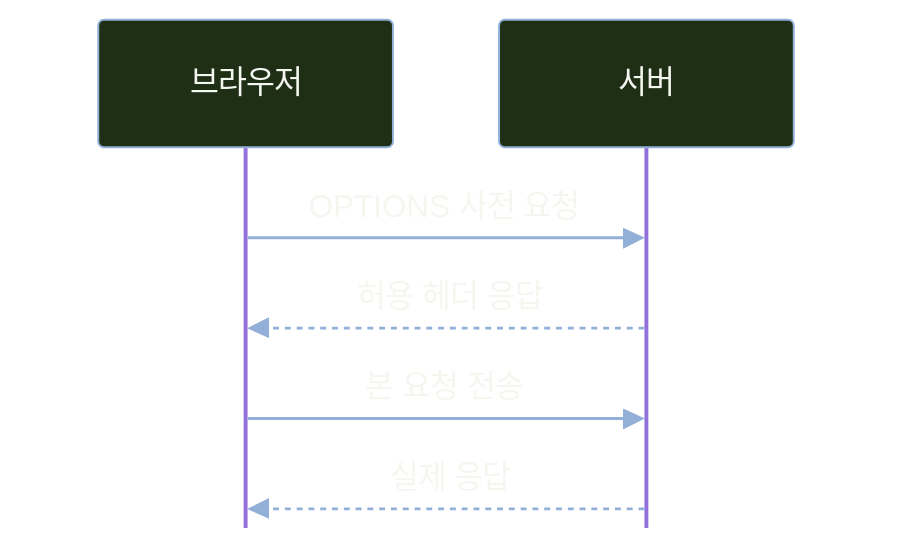
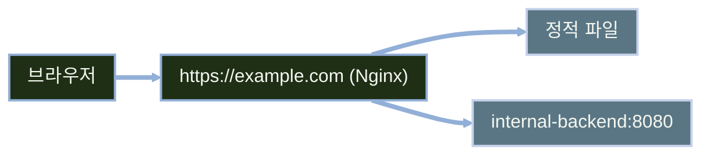

# CSR 연동과 CORS

---
layout: default
---

# 학습 체크리스트 (1/2)

- [ ] SSR에서 CSR로 렌더링 책임이 옮겨지며 생기는 구조 변화 이해
- [ ] 브라우저에 노출된 출처 구성이 CORS 필요성을 결정한다는 점 파악
- [ ] 출처(Origin)의 세 요소와 동일 출처 정책이 막는 범위 이해
- [ ] 단순 요청과 사전 요청(preflight)이 갈리는 기준 습득

---
layout: default
---

# 학습 체크리스트 (2/2)

- [ ] 주요 CORS 응답 헤더의 역할과 실무 설정 기준 파악
- [ ] 브라우저 개입 여부로 CORS가 필요한 상황을 가려내는 기준 습득
- [ ] `WebMvcConfigurer`와 `application.yml`로 허용 출처를 외부화하는 방법 습득
- [ ] `fetch`로 CRUD를 호출하고 CORS 오류를 진단하는 순서 파악

---
layout: default
---

# 학습 범위

- **선행 조건**: REST API 설계와 `ProblemDetail` 전역 예외 처리까지 완성
- **1. 구조 변화**: SSR에서 CSR로, 그리고 배포 형태의 분리
- **2. 브라우저 규칙**: 출처와 동일 출처 정책, CORS의 동작 방식
- **3. 서버 설정**: Spring Boot의 CORS 허용 설정 방법
- **4. 연동과 진단**: `fetch` 호출과 CORS 트러블슈팅

---
layout: default
---

# 전체 진행 순서


---
layout: cover
class: text-center
---

# 렌더링 구조와 배포 형태
---
layout: default
---

# SSR: 서버 측 렌더링 동작 방식

- **처리 흐름**: 컨트롤러가 `Model`을 채우면 템플릿 엔진이 데이터+HTML을 결합
- **응답**: 브라우저는 이미 완성된 HTML 문서를 받음
- **화면 갱신**: 전통적 SSR은 링크 이동·폼 제출 시 새 HTML 문서로 이동
- **특성**: 콘텐츠가 담긴 HTML을 보내 초기 표시·검색엔진 수집에 유리할 수 있음
- **예시**: 지금까지 다룬 Thymeleaf 게시판이 이 방식

---
layout: default
---

# CSR: 클라이언트 측 렌더링 동작 방식

- **최초 응답**: 전형적인 SPA는 앱 셸 HTML과 JS 번들을 먼저 전달
- **데이터 수신**: 이후 브라우저 JS가 `fetch`로 JSON을 따로 요청
- **DOM 구성**: 전달받은 JSON 데이터로 브라우저가 DOM을 직접 구성
- **주의점**: 클라이언트에서만 데이터를 채우면 초기 표시·SEO를 별도로 최적화해야 함
- **실무 활용**: Thymeleaf 화면에 일부 비동기(fetch) 갱신을 조합하는 혼합 방식도 활용

---
layout: default
---

# SSR과 CSR 비교

| 구분 | SSR | CSR |
| :--- | :--- | :--- |
| 최초 응답 본문 | 완성된 HTML | 전형적 SPA는 앱 셸 HTML + JS 번들 |
| 화면 갱신 단위 | 보통 새 HTML 문서로 이동 | JS가 필요한 UI만 갱신 가능 |
| 서버 책임 | 요청마다 HTML 생성 | API 제공, 브라우저가 UI 구성 |
| 배포 단위 | 단일 서버 통합 배포 | 프런트엔드·백엔드 분리 배포 가능 |

---
layout: default
---

# 모노리식 배포와 분리 배포

| 구분 | 모노리식 배포 | 분리 배포 |
| :--- | :--- | :--- |
| 출처 동일 여부 | 보통 동일 출처 | 구성에 따라 동일·교차 출처 |
| CORS 필요 여부 | 동일 출처면 불필요 | 브라우저가 교차 출처 API를 호출할 때 필요 |
| 독립 배포 | 전체 앱 재배포 필요 | 프런트엔드/백엔드 개별 배포 |
| 운영 복잡도 | 낮음 | 도메인·인증서·CORS 관리 지점 증가 |

- 모노리식: 정적 리소스를 `src/main/resources/static`에 함께 배치
- 분리 배포: 프런트는 Netlify·Vercel, 백엔드는 Render 등 별도 서버

---
layout: default
---

# 배포 아키텍처와 CORS의 관계

- **핵심 개념**: CORS 필요 여부는 브라우저에 보이는 프런트·API 출처로 결정됨
- **분리 배포**: 리버스 프록시·BFF로 단일 출처를 유지하면 CORS가 필요하지 않을 수 있음
- **소규모 시스템**: 배포 관리 지점이 적은 모노리식 구조가 효율적일 수 있음
- **주의사항**: CORS는 오류 발생 후 급히 조치하는 임시방편 설정이 아님
- **결론**: 아키텍처 설계 단계부터 CORS 반영 여부를 미리 고려해야 함

---
layout: default
---

# 핵심 용어 정리

> **CSR (Client-Side Rendering)**
>
> 브라우저의 JS가 데이터를 받아 화면 DOM을 직접 구성하는 렌더링 방식

> **BFF (Backend For Frontend)**
>
> 특정 클라이언트 화면에 맞춰 여러 백엔드 API를 조합·중개하는 전용 서버

---
layout: cover
class: text-center
---

# 출처와 동일 출처 정책
---
layout: default
---

# 출처(Origin)를 이루는 세 요소

- **스킴(Scheme)**: `http`, `https` 등 프로토콜
- **호스트(Host)**: `localhost`, `api.example.com` 같은 도메인
- **포트(Port)**: `8080`, `443` 등 생략 시 프로토콜 기본값 적용
- **동일 출처 조건**: 스킴·호스트·포트 셋 다 같아야 동일 출처
- **무관한 요소**: 경로(`/api/boards`)와 쿼리스트링은 판단에 영향 없음

---
layout: default
---

# 동일 출처(Same-Origin) 판정 기준

기준: `http://localhost:8080`

| 비교 대상 URL | 판정 | 이유 |
| :--- | :--- | :--- |
| `http://localhost:8080/api/boards` | 동일 | 경로 차이는 무관 |
| `https://localhost:8080` | 다름 | 스킴 차이 |
| `http://127.0.0.1:8080` | 다름 | 호스트 문자열 불일치 |
| `http://localhost:5500` | 다름 | 포트 차이 |
| `http://api.localhost:8080` | 다름 | 서브도메인 차이로 호스트 불일치 |

---
layout: default
---

# 동일 출처 정책(SOP)의 보안 목적

- **위협 모델**: 악성 사이트에서 사용자 권한으로 다른 출처 API 호출 시도
- **자격 증명 전송**: 쿠키는 SameSite·도메인·`credentials` 등 조건에 따라 포함
- **핵심 방어**: 스크립트가 다른 출처 응답 본문을 읽지 못하게 차단
- **출처 격리 원칙**: 서로 다른 출처의 페이지 및 스크립트는 상호 미신뢰가 기본값
- **결과**: 허용되지 않은 스크립트가 교차 출처 응답 데이터를 읽지 못하게 함

---
layout: default
---

# SOP의 차단 범위와 적용 기준

| 구분 | 동작 | 차단 여부 |
| :--- | :--- | :--- |
| ``, `<script>`, `<link>` | 교차 출처 리소스 로드 | 허용 |
| `<form>` 제출 | 교차 출처로 전송 | 허용 |
| `fetch`/`XHR` | 단순 교차 출처 요청 전송 | 먼저 전송 후 응답 읽기 판단 |
| `fetch`/`XHR` | 비단순 교차 출처 요청 | preflight 성공 후 본 요청 전송 |
| `fetch`/`XHR` | 응답 본문을 스크립트가 읽기 | 응답 읽기 차단 |

- SOP/CORS는 요청 유형에 따라 응답 읽기 또는 본 요청 전송을 제한함

---
layout: default
---

# 요청 성공과 CORS 브라우저 차단

- **서버는 처리할 수 있음**: 단순 요청은 CORS 허용 여부 확인 전에 서버까지 도달
- **브라우저 제어**: 서버 응답을 스크립트에 전달하는 단계에서 브라우저가 차단
- **현상 대조**: 서버 로그에는 200 OK가 기록되나, 브라우저 콘솔에는 CORS 오류 표시
- **적용 주체**: SOP는 브라우저 내부 보안 정책 (서버 간 통신과 무관)
- **예외 범위**: Postman, curl, 서버 간 API 호출에는 SOP 미적용

---
layout: default
---

# 핵심 용어 정리

> **출처 (Origin)**
>
> 스킴·호스트·포트 세 가지 조합으로 정의되는 리소스의 출처 단위

> **동일 출처 정책 (Same-Origin Policy)**
>
> 다른 출처의 응답을 스크립트가 마음대로 읽지 못하게 막는 브라우저 내장 정책

---
layout: cover
class: text-center
---

# CORS 동작 원리
---
layout: default
---

# CORS: 서버 측 교차 출처 허용 메커니즘

- **핵심 개념**: 브라우저의 SOP 제약을 서버 응답 헤더로 명시 허용하는 메커니즘
- **허용 주체**: 요청을 수신하는 서버가 허용할 출처(Origin)를 지정
- **브라우저 판단**: 서버의 CORS 응답 헤더를 확인 후 스크립트에 접근 권한 부여
- **주의사항**: 로그인/권한 검사 등 서버의 인증·인가 기능을 대체하지 않음
- 다중 출처 동적 허용 시 캐시 오염 방지를 위해 `Vary: Origin` 헤더 유지 필요

---
layout: default
---

# 단순 요청(Simple Request)의 성립 조건

- **HTTP 메서드**: `GET`, `HEAD`, `POST` 중 하나
- **수동 요청 헤더**: `Accept`, `Accept-Language`, `Content-Language`, `Content-Type`, 단일 범위 `Range`만 사용
- **Content-Type 값**: `application/x-www-form-urlencoded`, `multipart/form-data`, `text/plain` 중 하나

---
layout: default
---

# REST API 호출 시 Preflight가 발생되는 이유

- **JSON 미지원**: `application/json`은 단순 요청의 Content-Type 허용 조건에 미포함
- **JSON 데이터 전송**: 교차 출처에서 `Content-Type: application/json`을 지정하면 Preflight 트리거
- **비단순 메서드**: `PUT`, `DELETE` 등은 메서드 자체로 Preflight 대상

---
layout: default
---

# Preflight 요청 처리 흐름



---
layout: default
---

# Preflight 요청 헤더 구조

```http
OPTIONS /api/boards HTTP/1.1
Host: api.example.com
Origin: https://example-front.github.io
Access-Control-Request-Method: POST
Access-Control-Request-Headers: content-type
```

---
layout: default
---

# Preflight 응답 헤더 구조

```http
HTTP/1.1 204 No Content
Access-Control-Allow-Origin: https://example-front.github.io
Access-Control-Allow-Methods: GET, POST, PUT, PATCH, DELETE
Access-Control-Allow-Headers: content-type
Access-Control-Max-Age: 3600
```

---
layout: default
---

# 주요 CORS 응답 헤더

| 헤더 | 의미 | 실무 주의점 |
| :--- | :--- | :--- |
| Allow-Origin | 응답을 읽을 수 있는 출처 | 운영은 `*` 대신 구체적 출처 지정 |
| Allow-Methods | 허용하는 HTTP 메서드 | 실제 사용하는 메서드만 나열 |
| Allow-Headers | 허용하는 요청 헤더 | JSON 전송엔 Content-Type 필수 |
| Expose-Headers | JS가 읽을 수 있는 응답 헤더 | Location, X-Total-Count 등 명시 |
| Max-Age | preflight 캐시 유지 시간(초) | 브라우저별 내부 상한이 있어 설정값보다 짧을 수 있음 |

---
layout: default
---

# 쿠키 기반 교차 출처 요청

- **클라이언트**: `fetch`에 `credentials: 'include'`를 명시
- **서버**: 구체적 `Allow-Origin`과 `Allow-Credentials: true`로 응답
- **와일드카드 금지**: 자격 증명 요청에서는 `Allow-Origin: *` 사용 불가
- **별도 정책**: 브라우저의 서드파티 쿠키 정책은 CORS 허용과 별개로 적용
- **CSRF 주의**: CORS는 응답 읽기를 제어할 뿐 CSRF 방어를 대체하지 않음

---
layout: default
---

# 핵심 용어 정리

> **사전 요청 (Preflight)**
>
> 비단순 요청 전에 브라우저가 OPTIONS로 먼저 보내 허용 여부를 확인하는 절차

> **단순 요청 (Simple Request)**
>
> 메서드·헤더·본문 조건을 만족해 사전 확인 없이 바로 전송되는 요청

---
layout: cover
class: text-center
---

# CORS 적용 필요성 판단하기
---
layout: default
---

# 통신 주체별 CORS 적용 조건

| 시나리오 | 브라우저 개입 | CORS 필요 | 대표 상황 |
| :--- | :--- | :--- | :--- |
| 서버 → 서버 | 없음 | 불필요 | 백엔드가 외부 API를 직접 호출 |
| 동일 출처 정적 리소스 | 있음 | 불필요 | 같은 도메인의 HTML·JS·CSS 요청 |
| 다른 출처 서버 | 있음 | 서버의 CORS 허용 필요 | 브라우저 JS가 다른 출처 API 응답을 읽음 |

- CORS는 **브라우저가 개입하는 교차 출처 요청**에서만 적용됨
- 서버 간 직접 통신은 SOP 및 CORS 제약을 받지 않음

---
layout: default
---

# 백엔드 프록시(Proxy)를 통한 회피 전략

- **서버 간 통신**: `RestClient` 등을 활용하면 SOP/CORS 제약 없이 호출 가능
- **외부 API 우회**: 외부 서비스가 CORS를 지원하지 않을 때 백엔드 프록시 활용
- **보안 강화**: API 키 등 인증 정보를 클라이언트에 노출하지 않고 서버에서 관리
- **데이터 정제**: 클라이언트에 필요한 필드만 가공하여 전달 가능

---
layout: default
---

# Spring RestClient를 활용한 외부 API 우회

```java
RestClient client = RestClient.create();

WeatherResponse result = client.get()
    .uri("https://api.weather.example.com/today")
    .retrieve()
    .body(WeatherResponse.class);
```

---
layout: default
---

# 리버스 프록시(Reverse Proxy)를 통한 출처 단일화



---
layout: default
---

# 개발 및 운영 환경별 출처(Origin) 구성

| 환경 | 프런트 출처 | 백엔드 출처 | 필요한 조치 |
| :--- | :--- | :--- | :--- |
| 로컬 개발 | `127.0.0.1:5500` | `localhost:8080` | 두 표기 모두 등록·접속 주소 통일 |
| 개발 서버 프록시 | `localhost:5173` | (같은 출처) | proxy 설정으로 CORS 불필요 |
| 모노리식 배포 | static 폴더 | (같은 출처) | 상대 경로 호출 |
| 서브도메인 분리 | `app.example.com` | `api.example.com` | 운영 허용 출처 등록 |
| 타사 분리 배포 | `<user>.github.io` | `<app>.onrender.com` | 배포 도메인을 운영 프로파일에 등록 |

- `localhost`와 `127.0.0.1`은 동일 IP 머신이라도 문자열이 달라 교차 출처로 판정됨

---
layout: default
---

# 핵심 용어 정리

> **리버스 프록시 (Reverse Proxy)**
>
> 여러 서버를 하나의 출처로 감싸 클라이언트에게 단일 진입점처럼 보이게 하는 중개 서버

> **상대 경로 요청 (Relative Path Request)**
>
> `fetch('/api/boards')`처럼 도메인을 생략해 현재 출처를 그대로 따라가는 요청 방식

---
layout: cover
class: text-center
---

# Spring Boot CORS 설정 방법
---
layout: default
---

# Spring Boot에서 CORS를 적용하는 3가지 방식

| 방식 | 적용 범위 | 주의점 |
| :--- | :--- | :--- |
| `@CrossOrigin` | 메서드·클래스 단위 | 설정 분산 시 유지보수 및 허용 범위 파악 어려움 |
| `WebMvcConfigurer#addCorsMappings` | 애플리케이션 전역 | 전역 CORS 정책을 한곳에서 통합 관리 |
| `CorsFilter` 빈 | 서블릿 필터 단계 | Security보다 먼저 처리하도록 순서 통합 필요 |

- 세 방식을 병행할 수 있으나, 관리 효율을 위해 일관된 단일 방식 채택 권장

---
layout: default
---

# 실무 권장 CORS 설정 전략

- **전역 설정 통합**: Security 미사용 시 `WebMvcConfigurer`로 중앙 관리
- **Security 연동**: `http.cors(...)`로 MVC 설정을 사용하거나 `CorsConfigurationSource` 제공
- **설정 외부화**: 허용 출처는 `application.yml`에서 프로파일별로 분리
- **예외적 처리**: 특정 컨트롤러/엔드포인트에만 `@CrossOrigin` 제한적 적용
- **분산 방지**: 애노테이션 남용 시 출처 허용 범위 파악이 어려움
- **불변성 유지**: `record` 및 생성자 주입으로 불변 프로퍼티 구조 설계

---
layout: default
---

# 프로파일(Profile)별 허용 출처 분리 설정

```yaml
app:
  cors:
    allowed-origins: [ "http://localhost:5500" ]
---
spring.config.activate.on-profile: local
app:
  cors:
    allowed-origins: [ "http://localhost:5500", "http://127.0.0.1:5500" ]
---
spring.config.activate.on-profile: prod
app:
  cors:
    allowed-origins: [ "https://example-front.github.io" ]
```

---
layout: default
---

# record 기반 CORS 프로퍼티 클래스

```java
// record이므로 Lombok 없이 불변 보장
@ConfigurationProperties("app.cors")
record CorsProperties(List<String> allowedOrigins) {
}
```

---
layout: default
---

# WebMvcConfigurer 기반 WebConfig 구현

```java
@Configuration(proxyBeanMethods = false)
@EnableConfigurationProperties(CorsProperties.class)
@RequiredArgsConstructor
class WebConfig implements WebMvcConfigurer {

    private final CorsProperties corsProperties; // 생성자 주입
}
```

---
layout: default
---

# addCorsMappings를 이용한 글로벌 CORS 설정

```java
@Override
public void addCorsMappings(CorsRegistry registry) {
    registry.addMapping("/api/**")
            .allowedOrigins(corsProperties.allowedOrigins().toArray(String[]::new))
            .allowedMethods("GET", "POST", "PUT", "PATCH", "DELETE")
            .allowedHeaders("Content-Type", "Authorization")
            .exposedHeaders("Location")
            .maxAge(3600);
}
```

---
layout: default
---

# allowedOrigins 및 allowedOriginPatterns 비교

- **정확한 매칭**: 지정한 출처 문자열과 정확히 일치할 때만 허용
- **패턴 매칭**: 와일드카드를 활용한 동적 출처 매칭 허용
- **보안 주의**: `https://*` 등 지나치게 포괄적인 패턴은 보안에 취약
- **권장 사항**: 서브도메인 등 최소한의 단위로 패턴 범위 제한
- **헤더 최소화**: 서비스에 필요한 헤더(예: `Content-Type`)만 엄격히 지정

---
layout: default
---

# @CrossOrigin을 이용한 특정 엔드포인트 정책 추가

```java
@CrossOrigin(origins = "https://partner.example.com")
@GetMapping("/api/boards/export")
List<BoardResponse> export() {
    return boardService.getAll();
}
```

---
layout: default
---

# 핵심 용어 정리

> **프로파일 (Profile)**
>
> 환경(local, prod 등)에 따라 다른 설정값을 활성화하는 스프링의 구성 단위

> **설정 외부화 (Externalized Configuration)**
>
> 코드에 값을 하드코딩하지 않고 `application.yml` 등 외부 파일에서 읽어오는 방식

---
layout: cover
class: text-center
---

# fetch 연동 및 CORS 트러블슈팅
---
layout: default
---

# GET 요청: fetch를 이용한 목록 조회

```javascript
const API_BASE = 'http://localhost:8080'
// 같은 출처면 '', 다른 출처면 전체 URL

async function listBoards() {
  const response = await fetch(`${API_BASE}/api/boards`)
  if (!response.ok) throw new Error(`HTTP ${response.status}`)
  return response.json()
}
```

---
layout: default
---

# POST 요청: fetch를 이용한 데이터 생성

```javascript
async function createBoard(data) {
  const response = await fetch(`${API_BASE}/api/boards`, {
    method: 'POST',
    headers: { 'Content-Type': 'application/json' },
    body: JSON.stringify(data)
  })
  if (!response.ok) throw new Error(`HTTP ${response.status}`)
  return { location: response.headers.get('Location'),
    body: await response.json() }
}
```

---
layout: default
---

# PUT 요청: fetch를 이용한 데이터 수정

```javascript
async function updateBoard(id, data) {
  const response = await fetch(`${API_BASE}/api/boards/${id}`, {
    method: 'PUT',
    headers: { 'Content-Type': 'application/json' },
    body: JSON.stringify(data)
  })
  if (!response.ok) throw new Error(`HTTP ${response.status}`)
  return response.json()
}
```

---
layout: default
---

# DELETE 요청: fetch를 이용한 데이터 삭제

```javascript
async function deleteBoard(id) {
  const response = await fetch(`${API_BASE}/api/boards/${id}`, {
    method: 'DELETE'
  })
  if (!response.ok) throw new Error(`HTTP ${response.status}`)
}
```

---
layout: default
---

# CRUD 메서드별 Preflight 발생 기준

| 동작 | 메서드·경로 | 성공 코드 | preflight |
| :--- | :--- | :--- | :--- |
| 목록 조회 | GET /api/boards | 200 | 보통 없음* |
| 등록 | POST /api/boards | 201 | JSON이면 발생 |
| 수정 | PUT /api/boards/{id} | 200 | 발생 |
| 삭제 | DELETE /api/boards/{id} | 204 | 발생 |

\* `Authorization` 같은 비허용 요청 헤더를 추가하면 GET도 preflight 발생

---
layout: default
---

# 응답 헤더의 Location이 null로 조회되는 원인

- **서버 정상 응답**: 201 Created 응답 시 Location 헤더에 자원 경로 포함
- **브라우저 보안 제약**: 교차 출처 환경에서는 JS가 기본 응답 헤더만 조회 가능
- **서버 설정 필요**: `Access-Control-Expose-Headers: Location`을 명시해야 JS에서 읽기 가능
- **주요 문제 현상**: 서버에서 헤더를 전송해도 프런트엔드에서는 null로 반환됨

---
layout: default
---

# 대표적인 CORS 오류 원인과 해결 방법

| 증상 | 원인 | 조치 |
| :--- | :--- | :--- |
| Allow-Origin 헤더 없음 | 설정 없음·경로 패턴 불일치 | addMapping 경로를 API 경로에 맞춤 |
| OPTIONS 응답이 4xx | Security·인증 필터가 먼저 거부 | `http.cors(...)` 또는 선행 `CorsFilter` 구성 |
| 로컬은 되는데 운영만 실패 | prod 프로파일에 출처 누락 | 스킴·포트까지 정확히 추가 |
| 특정 헤더를 JS가 못 읽음 | Expose-Headers 누락 | Location 등 명시 |
| Allow-Origin이 두 번 들어감 | CorsFilter·WebMvcConfigurer 중복 | 처리 지점을 한쪽으로 통일 |

---
layout: default
---

# CORS 오류 단계별 진단 순서

- **1단계**: 네트워크 탭에서 `OPTIONS` 발생 여부와 상태 코드 확인
- **2단계**: `OPTIONS`와 본 요청의 `Access-Control-*` 응답 헤더를 기대값과 대조
- **3단계**: `curl`로 서버 단독 응답을 재현해 브라우저 변수 배제
- **4단계**: 서버 로그로 요청이 실제로 도달했는지 확인
- **5단계**: 경로 패턴·활성 프로파일·필터 순서 등 설정 적용 범위 점검

---
layout: default
---

# curl을 이용한 Preflight 요청 테스트

```bash
curl -i -X OPTIONS http://localhost:8080/api/boards \
  -H "Origin: http://localhost:5173" \
  -H "Access-Control-Request-Method: POST" \
  -H "Access-Control-Request-Headers: Content-Type"
```

---
layout: default
---

# 핵심 용어 정리

> **Preflight 캐시 (Access-Control-Max-Age)**
>
> 브라우저가 OPTIONS 응답을 저장해 같은 요청의 재확인을 건너뛰게 하는 유효시간(초)

> **응답 헤더 노출 (Access-Control-Expose-Headers)**
>
> 교차 출처 응답에서 JS가 추가로 읽을 헤더 목록을 서버가 지정하는 설정

---
layout: default
---

# 학습 요약 (1/2)

- **구조 변화**: CSR에서는 브라우저 JS가 API를 호출해 UI를 구성
- **출처가 결정**: 분리 배포여도 프록시로 동일 출처를 만들면 CORS 불필요
- **출처**: 스킴·호스트·포트 셋 중 하나만 달라도 다른 출처
- **SOP**: 브라우저가 교차 출처 응답을 스크립트에 넘기지 않는 정책

---
layout: default
---

# 학습 요약 (2/2)

- **CORS**: 요청받는 서버가 응답 헤더로 교차 출처를 허용하는 절차
- **preflight**: 교차 출처 JSON 요청·비단순 메서드는 `OPTIONS` 확인 후 본 요청
- **설정 위치**: MVC 또는 Security 연동 지점에서 중앙 관리하고 출처는 외부화
- **진단 순서**: 네트워크 탭 → 응답 헤더 → `curl` 재현 → 서버 로그 → 적용 범위

---
layout: cover
class: text-center
---

# 예상 질문과 답변
---
layout: default
---

# Q&A: CORS 설정 적용 및 처리 방식

- **Q. 전역 설정과 `@CrossOrigin`을 함께 써도 되나요?**
- A. 됩니다. 다만 정책이 흩어져 허용 범위 파악이 어려워지므로, 예외 정책이 꼭 필요한 엔드포인트에만 제한합니다.
- **Q. `OPTIONS` 요청을 받는 핸들러를 직접 만들어야 하나요?**
- A. 아닙니다. 설정이 매칭되면 프레임워크가 처리합니다. 4xx면 CORS 경로와 Security·필터 순서를 확인합니다.

---
layout: default
---

# Q&A: Preflight 성능 영향과 최적화

- **Q. 요청마다 `OPTIONS`가 한 번씩 더 나가나요?**
- A. `Access-Control-Max-Age` 캐시가 유효한 동안은 생략되며, 브라우저마다 상한이 있어 큰 값은 잘려 적용됩니다.
- **Q. 지연을 더 줄이려면 무엇을 봐야 하나요?**
- A. 별도 헤더 없는 `GET`은 대개 단순 요청입니다. 프록시로 동일 출처를 만들면 CORS preflight가 사라집니다.

---
layout: default
---

# Q&A: CORS 허용 범위와 보안 고려사항

- **Q. 모든 출처를 허용하면 문제가 해결되나요?**
- A. 오류만 가려질 뿐입니다. CORS는 브라우저만 지키는 규칙이라 인증·인가를 대신하지 못합니다.
- **Q. 개발 중 브라우저 보안 기능을 끄는 방식은 어떤가요?**
- A. 운영에서 같은 오류가 그대로 재현됩니다. 원인은 서버 설정과 배포 구조에서 해결해야 합니다.
