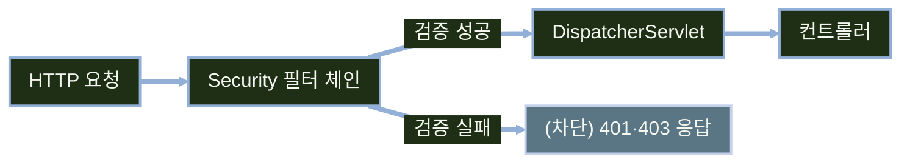
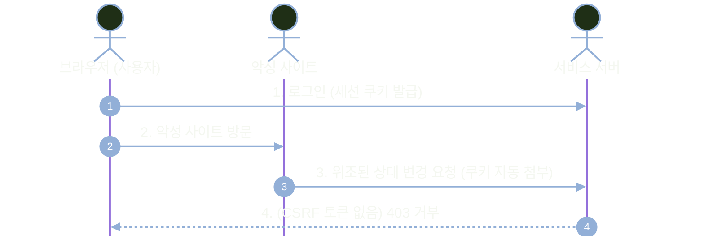
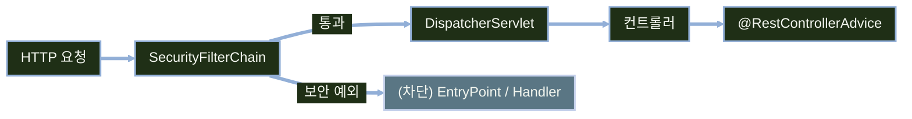

# Spring Security와 REST API 인증·인가

---
layout: default
---

# 학습 체크리스트 (1/2)

- [ ] Spring Security 도입 시 요청 처리 위치의 변화를 설명할 수 있다.
- [ ] 세션 없는 HTTP Basic 무상태 구조를 이해하고 설정할 수 있다.
- [ ] SecurityFilterChain으로 경로별 보안 정책을 선언할 수 있다.
- [ ] 보안 규칙 매칭 순서(First-Match) 원리를 파악할 수 있다.

---
layout: default
---

# 학습 체크리스트 (2/2)

- [ ] Swagger UI에서 Authorize 버튼을 통한 인증 연동 절차를 습득한다.
- [ ] CSRF와 CORS를 켜고 끄는 기술적 기준을 판단할 수 있다.
- [ ] 401과 403의 발생 지점과 예외 처리기(EntryPoint / Handler)를 구분할 수 있다.
- [ ] ProblemDetail 표준을 적용하여 보안 오류 응답 형식을 통일할 수 있다.

---
layout: default
---

# 학습 범위와 선수 조건

- **선행 연계**: 421(REST 설계)·421-2(ProblemDetail)·422(CORS) 규약을 기반으로 확장
- **4대 학습 축**: 필터 체인 정책 선언, Swagger 연동, CSRF·CORS 제어, 401·403 형식 통일
- **실습 환경 기준**: Spring Boot 4.0, Spring Security 7, Java 17 환경을 기준으로 실습
- **보안 최소 골격**: 세션 없는 HTTP Basic 무상태 구조를 구축하여 API 보안 뼈대 확립

---
layout: default
---

# 전체 진행 순서


---
layout: default
---

# Security 의존성 추가 시 기본 동작 변화

- **모든 경로 인증 요구**: 별도 설정이 없으면 모든 HTTP 요청에 대해 로그인 자격 증명 요구
- **자동 보안 구성**: 기본 폼 로그인 화면과 HTTP Basic 인증 필터가 자동으로 등록
- **콘솔 임시 비밀번호**: 서버 기동 시 `Using generated security password`로 임시 키 출력
- **문서 도구 접근 차단**: 설정 전까지 Swagger UI 및 API 스펙 경로도 401/리다이렉트 발생

---
layout: default
---

# 요청이 컨트롤러에 닿기까지



---
layout: cover
class: text-center
---

# SecurityFilterChain 정책 선언
---
layout: default
---

# SecurityFilterChain 빈을 통한 선언형 보안

- **선언형 보안 구성**: `@Configuration` 클래스에 `SecurityFilterChain` 빈을 등록하여 보안 통제
- **HttpSecurity DSL**: 메서드 체이닝 방식으로 경로별 인가 규칙 및 보안 기능을 명확히 기술
- **중앙 집중 관리**: URL 패턴 매칭, 세션 생성 정책, 예외 처리기를 단일 위치에서 선언
- **기존 방식 대체**: XML 설정이나 스프링 인터셉터 대신 필터 수준에서 선제적 방어 수행

---
layout: default
---

# 보안 설정 클래스 기본 골격

```java
@Configuration
public class SecurityConfig {

    @Bean
    public SecurityFilterChain filterChain(HttpSecurity http) throws Exception {
        return http
            .build(); // 기본 보안 필터 체인 구성
    }
}
```

---
layout: default
---

# 경로별 접근 규칙 선언

```java
http.authorizeHttpRequests(auth -> auth
    .requestMatchers("/swagger-ui/**", "/v3/api-docs/**").permitAll()
    .requestMatchers(HttpMethod.GET, "/api/boards/**").permitAll()
    .requestMatchers(HttpMethod.DELETE, "/api/boards/**").hasRole("ADMIN")
    .requestMatchers("/api/admin/**").hasRole("ADMIN")
    .anyRequest().authenticated()
);
```

---
layout: default
---

# 무상태 세션과 Basic 인증 구성

```java
http
    .csrf(AbstractHttpConfigurer::disable)
    .sessionManagement(sm -> sm
        .sessionCreationPolicy(SessionCreationPolicy.STATELESS))
    .httpBasic(Customizer.withDefaults())
    .formLogin(AbstractHttpConfigurer::disable);
```

---
layout: default
---

# 접근 규칙의 선두 일치(First-Match) 원리

- **First-Match 원칙**: `authorizeHttpRequests`에 선언된 규칙은 상단부터 순차적으로 평가
- **최초 일치 규칙 채택**: 요청 경로에 처음 매칭된 룰이 적용되며, 이후 하위 규칙은 전면 무시
- **배치 우선순위**: 구체적인 세부 경로(`permitAll`, `hasRole`)를 반드시 상단에 선언
- **anyRequest는 최하단**: `anyRequest().authenticated()`가 상단에 오면 하위 공개 경로도 401 차단

---
layout: default
---

# 실습 엔드포인트별 인가 정책

| 요청 경로 | HTTP 메서드 | 허용 수준 | 설정 이유 |
| :--- | :--- | :--- | :--- |
| `/swagger-ui/**`, `/v3/api-docs/**` | ALL | `permitAll()` | 개발 및 API 문서 조회를 위한 전면 개방 |
| `/api/boards/**` | GET | `permitAll()` | 비회원 누구나 게시글 목록/상세 조회 허용 |
| `/api/boards/**` | DELETE | `hasRole("ADMIN")` | 게시글 삭제는 관리자 권한만 허용 |
| `/api/admin/**` | ALL | `hasRole("ADMIN")` | 관리자 전용 기능 보안 격리 |

---
layout: default
---

# HTTP Basic 인증의 특성과 유의사항

- **자격 증명 전달 방식**: `Authorization: Basic <Base64>` 형태로 매 요청마다 헤더 전송
- **암호화 부재**: Base64는 단순 인코딩이므로 네트워크 도청 방지를 위해 반드시 HTTPS 환경 필수
- **세션 미사용**: 무상태(`STATELESS`) 환경에서는 서버 메모리에 세션을 남기지 않고 헤더 검증
- **운영 환경 확장**: 실제 운영 API에서는 정적 비밀번호 전송 대신 토큰 기반(JWT) 인증(424차시)으로 전환

---
layout: default
---

# 핵심 용어 정리

> **보안 필터 체인 (SecurityFilterChain)**
>
> 들어오는 HTTP 요청에 적용할 보안 필터들의 순서와 적용 규칙을 묶어둔 체인 객체

> **HTTP 기본 인증 (HTTP Basic)**
>
> HTTP 요청 헤더에 사용자명과 비밀번호를 Base64로 인코딩하여 전송하는 가장 단순한 표준 인증 방식

---
layout: cover
class: text-center
---

# Swagger UI와 함께 쓰기
---
layout: default
---

# 보안 적용에 따른 Swagger UI 접근 제한

- **문서 경로 기본 차단**: 보안 의존성 추가 시 `/swagger-ui/**`, `/v3/api-docs/**`도 인증 대상에 포함
- **인증 실패 발생**: 명시적으로 허용하지 않으면 401 오류 또는 로그인 페이지 리다이렉트 발생
- **개발 환경 permitAll**: 개발 및 검증 편의를 위해 문서 및 리소스 경로를 명시적으로 허용 선언
- **운영 노출 범위 판단**: 실제 운영 배포 시에는 프로파일 설정으로 문서를 닫거나 사내망으로 격리

---
layout: default
---

# HTTP Basic 보안 스킴 선언

```java
@Configuration
@SecurityScheme(
    name = "basicAuth",
    type = SecuritySchemeType.HTTP,
    scheme = "basic"
)
public class OpenApiConfig { }
```

---
layout: default
---

# 보호 엔드포인트에 보안 요구사항 명시

```java
@DeleteMapping("/api/boards/{id}")
@SecurityRequirement(name = "basicAuth")
public ResponseEntity<Void> deleteBoard(@PathVariable Long id) {
    boardService.delete(id);
    return ResponseEntity.noContent().build();
}
```

---
layout: default
---

# Swagger UI Authorize 인증 동작 원리

- **문서상 스킴 활성화**: `@SecurityScheme`이 선언되면 Swagger UI 상단에 `Authorize` 버튼 노출
- **자격 증명 보관**: 사용자명과 비밀번호를 입력하면 브라우저 메모리에 인증 정보를 임시 보관
- **헤더 자동 첨부**: 이후 Swagger UI에서 실행하는 모든 API 요청에 `Authorization: Basic ...` 첨부
- **권한별 검증 용이**: 별도의 프론트엔드 로그인 구현 없이 USER/ADMIN 권한별 동작 즉시 확인

---
layout: cover
class: text-center
---

# CSRF와 CORS 다루기
---
layout: default
---

# CSRF 공격 개념과 동작 원리

- **공격 원리**: 사용자가 로그인한 상태에서 악성 사이트 방문 시, 브라우저의 쿠키 자동 전송 악용
- **의도치 않은 상태 변경**: 사용자의 권한을 도용하여 계좌 이체, 비밀번호 변경 등 악성 요청 전송
- **기본 방어 활성화**: Spring Security는 기본적으로 CSRF 방어를 켜고 검증 토큰 요구
- **API 차단 주의**: 토큰 없는 `POST`, `PUT`, `DELETE` 요청은 서버에서 `403 Forbidden` 거부

---
layout: default
---

# CSRF 공격 흐름과 방어 시퀀스



---
layout: default
---

# 애플리케이션 유형별 CSRF 적용 기준

| 애플리케이션 형태 | 인증 정보 전달 방식 | CSRF 설정 권장 | 설정 이유 |
| :--- | :--- | :--- | :--- |
| **서버 렌더링 (SSR / MVC)** | 세션 쿠키 자동 전송 | **활성화 (기본값)** | 폼 전송 시 `_csrf` 토큰을 함께 전송하여 위조 방어 |
| **REST API (SPA / 모바일)** | `Authorization` 헤더 전송 | **비활성화 (disable)** | 브라우저가 헤더를 자동 첨부하지 않으므로 CSRF 안전 |

- SSR 환경에서는 Thymeleaf `th:action` 사용 시 CSRF 히든 필드가 폼에 자동 주입됩니다.

---
layout: default
---

# REST API 무상태 환경의 CSRF 비활성화

```java
http
    .csrf(AbstractHttpConfigurer::disable)
    .sessionManagement(sm -> sm
        .sessionCreationPolicy(SessionCreationPolicy.STATELESS));
```

---
layout: default
---

# Security 필터 계층에서 CORS를 처리해야 하는 이유

- **필터 선행 실행**: Security 필터는 `DispatcherServlet`보다 앞서 동작하므로 CORS 사전 처리가 필수
- **Preflight 차단 방지**: 사전 요청(`OPTIONS`)이 인증 필터에 걸리면 `401/403` 에러로 통신 중단
- **이중 관리 방지**: MVC 레벨 CORS 설정과 중복 등록하지 않고 Security 필터 체인으로 일원화
- **인증 헤더 허용**: 클라이언트가 자격 증명을 보낼 수 있도록 `Authorization` 헤더 허용 필수

---
layout: default
---

# SecurityFilterChain에 CORS 연동 활성화

```java
http
    .cors(Customizer.withDefaults()) // CorsConfigurationSource 빈 자동 연동
    .csrf(AbstractHttpConfigurer::disable)
    .sessionManagement(sm -> sm
        .sessionCreationPolicy(SessionCreationPolicy.STATELESS));
```

---
layout: default
---

# CORS 허용 정책 빈(Bean) 등록

```java
@Bean
public CorsConfigurationSource corsConfigurationSource(CorsProperties props) {
    CorsConfiguration config = new CorsConfiguration();
    config.setAllowedOrigins(props.getAllowedOrigins());
    config.setAllowedMethods(List.of("GET", "POST", "PUT", "DELETE", "OPTIONS"));
    config.setAllowedHeaders(List.of("Authorization", "Content-Type"));
    UrlBasedCorsConfigurationSource source = new UrlBasedCorsConfigurationSource();
    source.registerCorsConfiguration("/**", config);
    return source;
}
```

---
layout: default
---

# 허용 출처 외부화 설정

```yaml
app:
  cors:
    allowed-origins:
      - "http://127.0.0.1:5500"
      - "https://service.example.com"
```

---
layout: default
---

# 핵심 용어 정리

> **사이트 간 요청 위조 (CSRF)**
>
> 사용자가 로그인한 브라우저의 쿠키 자동 전송 메커니즘을 이용해 사용자가 원치 않는 악의적 명령을 서버로 전송하는 공격

> **사전 요청 (Preflight)**
>
> 브라우저가 본 요청을 보내기 전 OPTIONS 메서드를 통해 대상 서버가 해당 출처와 헤더를 허용하는지 사전 확인하는 절차

---
layout: cover
class: text-center
---

# 401과 403을 계약으로 다루기
---
layout: default
---

# 401(인증 실패)과 403(인가 실패)의 구분

- **401 Unauthorized**: 인증되지 않은 요청 (자격 증명이 없거나 잘못되어 신원 파악 불가)
- **403 Forbidden**: 인가되지 않은 요청 (신원은 확인되었으나 해당 자원에 접근할 권한 부재)
- **명칭의 함정**: 401의 명칭은 'Unauthorized'이나 실제 HTTP 표준의 의미는 'Unauthenticated'
- **분기 파탄 방지**: 두 코드가 뒤바뀌면 프론트엔드가 로그인 팝업과 권한 경고를 올바르게 분기 불가

---
layout: default
---

# 상태 코드가 클라이언트 동작을 결정한다

| 응답 상태 코드 | 핵심 원인 | 클라이언트가 취해야 할 후속 동작 |
| :--- | :--- | :--- |
| **`401 Unauthorized`** | 로그인 미수행, 토큰/비밀번호 만료 | 로그인 화면 이동 또는 토큰 재발급 요청 |
| **`403 Forbidden`** | 일반 사용자가 관리자 전용 기능 호출 | "접근 권한이 없습니다" 안내 알림 출력 |

- CSRF 토큰 누락이나 검증 실패도 인가 거부로 취급되어 `403 Forbidden`으로 응답됩니다.

---
layout: default
---

# 보안 예외와 전담 처리기의 대응 관계

| 발생 상황 | Security 내부 발생 예외 | 전담 응답 처리 인터페이스 |
| :--- | :--- | :--- |
| **인증 실패 (401)** | `AuthenticationException` 계열 | `AuthenticationEntryPoint` |
| **인가 거부 (403)** | `AccessDeniedException` 계열 | `AccessDeniedHandler` |

- 필터 체인에서 발생한 보안 예외는 서블릿에 진입하기 전 위 두 처리기가 가로채어 응답을 작성합니다.

---
layout: default
---

# 보안 예외가 ControllerAdvice에 도달하지 않는 이유



---
layout: default
---

# SecurityFilterChain에 커스텀 예외 처리기 등록

```java
http.exceptionHandling(ex -> ex
    .authenticationEntryPoint(customAuthEntryPoint)
    .accessDeniedHandler(customAccessDeniedHandler)
);
http.httpBasic(basic -> basic
    .authenticationEntryPoint(customAuthEntryPoint)
);
```

---
layout: default
---

# 401 미인증 오류를 ProblemDetail로 응답

```java
public void commence(HttpServletRequest req, HttpServletResponse res,
                     AuthenticationException ex) throws IOException {
    ProblemDetail problem = ProblemDetail.forStatusAndDetail(
        HttpStatus.UNAUTHORIZED, "인증이 필요한 자원입니다.");
    problem.setInstance(URI.create(req.getRequestURI()));
    res.setStatus(HttpServletResponse.SC_UNAUTHORIZED);
    res.setHeader("WWW-Authenticate", "Basic realm=\"API\"");
    res.setContentType("application/problem+json;charset=UTF-8");
    objectMapper.writeValue(res.getWriter(), problem);
}
```

---
layout: default
---

# 403 인가 거부를 ProblemDetail로 응답

```java
@Override
public void handle(HttpServletRequest req, HttpServletResponse res,
                   AccessDeniedException ex) throws IOException {
    ProblemDetail problem = ProblemDetail.forStatusAndDetail(
        HttpStatus.FORBIDDEN, "해당 자원에 접근할 권한이 없습니다.");
    problem.setInstance(URI.create(req.getRequestURI()));
    res.setStatus(HttpServletResponse.SC_FORBIDDEN);
    res.setContentType("application/problem+json;charset=UTF-8");
    objectMapper.writeValue(res.getWriter(), problem);
}
```

---
layout: default
---

# 미인증 요청의 ProblemDetail 응답 본문

```json
{
  "type": "about:blank",
  "title": "Unauthorized",
  "status": 401,
  "detail": "인증이 필요한 자원입니다.",
  "instance": "/api/boards/1"
}
```

---
layout: default
---

# 핵심 용어 정리

> **인증 진입점 (AuthenticationEntryPoint)**
>
> 인증되지 않은 사용자가 보호된 리소스에 접근했을 때 적절한 인증 챌린지나 401 에러를 작성하는 시작점

> **접근 거부 처리기 (AccessDeniedHandler)**
>
> 신원은 확인되었으나 해당 자원에 접근할 권한이 없는 사용자에게 403 Forbidden 에러 응답을 작성하는 핸들러

---
layout: cover
class: text-center
---

# Swagger UI 검증과 트러블슈팅
---
layout: default
---

# 권한별 응답 확인 시나리오

| 호출 시나리오 | 전달 자격 증명 | 기대 상태 코드 | 검증 확인 포인트 |
| :--- | :--- | :--- | :--- |
| `GET /api/boards` | 미전달 (익명) | `200 OK` | 공개 엔드포인트 정상 조회 확인 |
| `DELETE /api/boards/1` | 미전달 (익명) | `401 Unauthorized` | `WWW-Authenticate` 및 401 ProblemDetail |
| `DELETE /api/boards/1` | `swagger` (USER) | `403 Forbidden` | 권한 부족에 따른 403 ProblemDetail |
| `DELETE /api/boards/1` | `swagger-admin` (ADMIN) | `204 No Content` | 관리자 권한 정상 삭제 확인 |

---
layout: default
---

# OpenAPI 문서에 401·403 응답 명시

```java
@Operation(summary = "게시글 삭제")
@ApiResponses({
    @ApiResponse(responseCode = "204", description = "삭제 성공"),
    @ApiResponse(responseCode = "401", description = "인증 실패",
        content = @Content(schema = @Schema(implementation = ProblemDetail.class))),
    @ApiResponse(responseCode = "403", description = "권한 부족",
        content = @Content(schema = @Schema(implementation = ProblemDetail.class)))
})
@DeleteMapping("/api/boards/{id}")
public ResponseEntity<Void> deleteBoard(@PathVariable Long id) { ... }
```

---
layout: default
---

# 보안 연동 시 자주 발생하는 문제와 해결 방안

| 발생 증상 | 주요 원인 | 해결 방안 |
| :--- | :--- | :--- |
| Swagger UI 접근 시 401 발생 | 문서 경로 `permitAll()` 선언 누락 | `/swagger-ui/**`, `/v3/api-docs/**` 허용 |
| 상태 변경(POST/DELETE)만 403 거부 | REST API 환경에서 CSRF 활성화 | `http.csrf(AbstractHttpConfigurer::disable)` |
| CORS Preflight(`OPTIONS`) 401 | Security 체인 앞단 CORS 미연결 | `http.cors(Customizer.withDefaults())` 적용 |
| permitAll 경로인데 401 차단 | `anyRequest()`가 상단에 배치됨 | First-Match 규칙에 따라 세부 경로 상단 배치 |

---
layout: default
---

# 보안 트러블슈팅 단계별 진단 순서

- **1단계: Authorize 상태 확인**: Swagger UI 우상단 자격 증명 주입 여부 및 오타 확인
- **2단계: 응답 코드와 본문 점검**: 401(인증 문제)인지 403(인가/CSRF 문제)인지 정확히 구별
- **3단계: 규칙 매칭 순서 점검**: `authorizeHttpRequests` 상단에 포괄적 규칙이 있는지 검사
- **4단계: 터미널 직접 요청 검증**: 브라우저 캐시를 배제하고 순수 HTTP 요청 헤더 검증
- **5단계: 필터 체인 디버깅**: `logging.level.org.springframework.security=DEBUG`로 필터 로그 추적

---
layout: default
---

# 학습 요약 (1/2)

- **필터 처리 위치**: Security 필터는 `DispatcherServlet` 앞단에서 동작하여 인증·인가를 선제 수행
- **인증과 인가 분리**: 신원을 확인하는 인증과 자원 접근 권한을 검사하는 인가를 명확히 구분
- **선언형 보안 정책**: `SecurityFilterChain` 빈에서 선언하며 위에서부터 첫 일치(First-Match) 규칙 적용
- **Swagger 연동 검증**: 문서 경로를 허용하고 HTTP Basic 스킴을 선언하여 UI 상에서 즉시 검증

---
layout: default
---

# 학습 요약 (2/2)

- **CSRF·CORS 정책**: 무상태 REST API는 CSRF를 끄고 CORS는 Security 필터 단계에서 최우선 처리
- **401과 403의 책임 분리**: 인증 실패(401)는 EntryPoint가, 권한 부족(403)은 AccessDeniedHandler가 전담
- **ProblemDetail 표준 통일**: 보안 필터 예외도 RFC 9457 규격의 일관된 JSON 에러 응답으로 변환하여 반환
- **다음 차시 예고**: 424차시에서는 세션 방식을 넘어 토큰 기반 무상태 인증을 위한 JWT 필터를 결합

---
layout: cover
class: text-center
---

# 예상 질문과 답변
---
layout: default
---

# Q&A: 설정과 규칙 매칭

- **Q. 경로 규칙 순서를 변경했더니 공개 API에서 401이 발생합니다.**
- A. Security는 위에서부터 첫 번째로 일치한 규칙을 즉시 적용합니다. `anyRequest()` 등 포괄적인 규칙보다 구체적인 `permitAll()` 경로를 항상 위에 배치해야 합니다.

- **Q. 보안 설정을 여러 개의 SecurityFilterChain 빈으로 분리할 수 있나요?**
- A. 가능합니다. `securityMatcher()`로 적용 대상 URL 패턴을 나누고, `@Order` 어노테이션으로 체인 간의 평가 우선순위를 명시적으로 지정합니다.

---
layout: default
---

# Q&A: 예외 처리와 보안

- **Q. @RestControllerAdvice에 AccessDeniedException 핸들러를 등록하면 필터 예외도 잡히나요?**
- A. 잡히지 않습니다. 컨트롤러 내부나 메서드 보안(`@PreAuthorize`)에서 발생한 예외만 도달하며, Security 필터 단계에서 발생한 거부는 AccessDeniedHandler가 전담합니다.

- **Q. 401 응답 본문에 '아이디 없음'이나 '비밀번호 불일치' 같은 구체적 사유를 담아도 되나요?**
- A. 권장하지 않습니다. 계정 존재 여부나 구체적인 실패 원인을 노출하면 사용자 열거 공격(Username Enumeration)에 취약해지므로 일반화된 메시지를 제공해야 합니다.

---
layout: default
---

# Q&A: 성능과 통신 오버헤드

- **Q. 모든 HTTP 요청마다 필터 체인이 실행되면 서버 성능에 부담이 되지 않나요?**
- A. URL 패턴 매칭 자체는 극히 가벼운 연산입니다. 실제 비용은 비밀번호 해시 검증(BCrypt) 및 DB 사용자 조회에서 발생하므로, 토큰 캐싱이나 무상태 검증을 활용합니다.

- **Q. 매 요청마다 HTTP Basic 인증 헤더를 검증하면 인코더 연산이 반복되나요?**
- A. 맞습니다. Basic 인증은 요청마다 자격 증명을 검증하므로, 실제 운영 REST API에서는 서명 검증만 수행하는 JWT 기반 무상태 인증(424차시)을 주로 채택합니다.

---
layout: default
---

# Q&A: 운영 배포와 환경 분리

- **Q. 실습의 개발용 임시 계정 방식은 실제 운영 환경에서 어떻게 전환하나요?**
- A. DB 사용자 엔티티와 연동하여 인증을 처리하고, 비밀번호는 단방향 해시 암호화(BCrypt)를 적용하여 저장·검증합니다.

- **Q. Swagger UI 문서를 운영 환경에서도 항상 permitAll()로 열어두어야 하나요?**
- A. 아닙니다. Spring 프로파일(`prod`)에 따라 Swagger 경로를 비활성화하거나, 관리자 권한(`hasRole('ADMIN')`) 또는 사내망(IP 제한) 뒤로 격리하는 것이 안전합니다.
