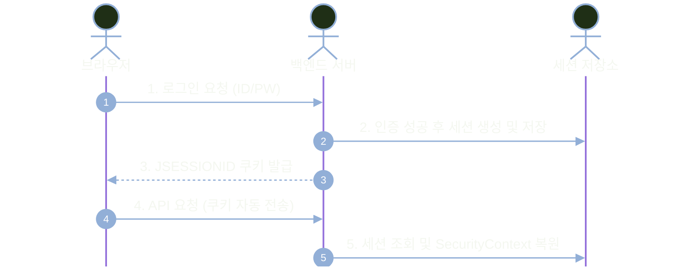
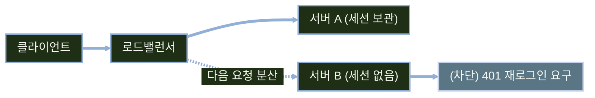

# JWT 기반 무상태 인증

---
layout: default
---

# 학습 체크리스트 (1/2)

- [ ] 세션 인증과 JWT 무상태 인증의 차이점을 설명할 수 있다.
- [ ] JWT의 3단계 구조와 표준 및 커스텀 클레임을 이해한다.
- [ ] 설정 외부화와 시크릿 키 관리 원칙을 적용할 수 있다.
- [ ] JJWT 라이브러리로 토큰 발급 및 검증 유틸을 구현한다.

---
layout: default
---

# 학습 체크리스트 (2/2)

- [ ] 로그인 엔드포인트에서 사용자 인증 후 토큰을 발급할 수 있다.
- [ ] OncePerRequestFilter 기반 인증 필터를 체인에 결합한다.
- [ ] 401 ProblemDetail 표준 응답 및 Swagger Bearer 검증을 수행한다.
- [ ] 헤더 전송 방식과 토큰 저장 위치의 차이를 판단할 수 있다.

---
layout: default
---

# 학습 범위와 선수 조건

- **선수 지식**: Spring Security 기본 필터 체인 구조와 ProblemDetail 기반 예외 처리
- **3대 학습 축**: 세션 한계 극복, JJWT 기반 토큰 발급·검증, 보안 필터 체인 무상태 결합
- **실습 환경 기준**: Spring Boot 4.1, Spring Security 7.1, Java 17, JJWT 0.13.0
- **다루지 않는 범위**: Refresh Token 로테이션 및 브라우저 취약점(XSS·CSRF) 복합 방어 전략

---
layout: default
---

# 전체 진행 순서


---
layout: cover
class: text-center
---

# 세션 인증의 한계

---
layout: default
---

# 세션 인증 동작 흐름



---
layout: default
---

# 세션 처리 단계별 역할

| 처리 순서 | 주체 | 수행 작업 | 세부 내용 |
| :--- | :--- | :--- | :--- |
| **1단계** | 클라이언트 | 로그인 요청 | 아이디와 비밀번호를 서버로 전송 |
| **2단계** | 백엔드 서버 | 세션 생성 및 보관 | 인증 결과를 포함한 `SecurityContext`를 서버 세션에 저장 |
| **3단계** | 백엔드 서버 | 쿠키 헤더 발행 | 식별자인 `JSESSIONID`를 `Set-Cookie`로 전달 |
| **4단계** | 클라이언트 / 서버 | 요청 및 신원 복원 | 쿠키 자동 첨부 및 세션 조회로 보안 컨텍스트 복원 |

---
layout: default
---

# 서버 중심의 세션 상태 관리 모델

- **쿠키의 본질**: `JSESSIONID`는 서버 측 저장소에 보관된 세션을 찾기 위한 식별자
- **상태의 위치**: 실제 로그인 사용자 정보와 권한 데이터는 서버 측 세션 저장소에 상주
- **즉시 무효화**: 서버에서 세션을 삭제하면 다음 요청 시 즉각적인 로그아웃 강제 가능
- **저장소 의존성**: 모든 인가 요청마다 세션 저장소를 매번 조회해야 하는 의존성 발생

---
layout: default
---

# 스케일 아웃 시 세션이 깨지는 지점



---
layout: default
---

# 세션 확장 문제의 해결책

| 해결책 | 동작 방식 | 주요 한계 |
| :--- | :--- | :--- |
| **스티키 세션** | 동일 사용자를 항상 같은 서버로 라우팅 | 특정 서버 부하 집중 및 서버 장애 시 세션 유실 |
| **세션 클러스터링** | 모든 서버 간에 세션 데이터를 복제 동기화 | 서버 대수가 증가할수록 네트워크 복제 오버헤드 급증 |
| **외부 저장소 (Redis)** | Redis 등 공용 캐시 서버에 세션 중앙 집중 | Redis 장애 시 전체 로그인 마비 및 I/O 비용 발생 |
| **무상태 JWT** | 인증 상태를 토큰에 담아 클라이언트가 관리 | 토큰 자체의 즉각적인 무효화(강제 로그아웃) 곤란 |

---
layout: cover
class: text-center
---

# JWT의 구조와 원리

---
layout: default
---

# 세션 vs JWT 비교

| 비교 항목 | 세션 기반 인증 | JWT 기반 무상태 인증 |
| :--- | :--- | :--- |
| **상태 저장 위치** | 서버 메모리 또는 공용 세션 저장소 | 클라이언트 보관 (메모리·저장소·쿠키 등) |
| **서버 확장성** | 스케일 아웃 시 세션 동기화 필요 | 모든 서버가 독립적으로 토큰 즉시 검증 |
| **전달 및 검증 비용** | 쿠키 자동 전송 / 매 요청 저장소 I/O | `Bearer` 헤더 전송 / 서명 연산(I/O 없음) |
| **로그아웃 및 무효화** | 서버 세션 삭제로 즉각 무효화 가능 | 만료 전까지 유효(블랙리스트 별도 필요) |

---
layout: default
---

# 세션과 JWT의 본질적 차이

- **핵심 명제**: 세션은 서버가 기억하고, JWT는 클라이언트가 들고 다니되 서명으로 위조를 막음
- **무상태(Stateless)**: 서버는 클라이언트의 로그인 세션을 영속 저장소에 유지하지 않음
- **자체 포함(Self-Contained)**: 토큰 자체에 사용자 식별자, 권한 목록, 만료 시간이 모두 포함
- **분산 검증과 인가**: 어떤 서버에서도 토큰을 검증해 인증을 복원하고 동일한 규칙으로 인가 판단

---
layout: default
---

# JWT의 3부분 구조


---
layout: default
---

# 구성 요소별 역할

| 구성 요소 | 담기는 주요 내용 | 실제 예시 |
| :--- | :--- | :--- |
| **Header (헤더)** | 토큰 유형(`typ`) 및 서명 알고리즘(`alg`) | `{"alg": "HS256", "typ": "JWT"}` |
| **Payload (내용)** | 사용자 식별자, 권한, 발행/만료 시간 (클레임) | `{"sub": "user1", "roles": "ROLE_USER"}` |
| **Signature (서명)** | 헤더와 페이로드를 시크릿 키로 서명한 값 | `HMACSHA256(Base64Url(H)+"."+Base64Url(P), Key)` |

---
layout: default
---

# Base64URL 디코딩 페이로드 구조

```json
{
  "sub": "swagger",
  "roles": "ROLE_USER",
  "iat": 1708000000,
  "exp": 1708001800
}
```

- 점(`.`)으로 구분된 Header, Payload, Signature 중 Base64URL로 인코딩된 본문 데이터입니다.

---
layout: default
---

# 주요 클레임 정리

| 클레임 키 | 표준 명칭 | 의미 및 용도 | 비고 |
| :--- | :--- | :--- | :--- |
| **`sub`** | Subject | 토큰의 주체(사용자 로그인 ID 또는 식별 키) | RFC 7519 등록 클레임 |
| **`iat`** | Issued At | 토큰 발급 일시 (Unix 타임스탬프 초 단위) | 발행 시점 증명 |
| **`exp`** | Expiration Time | 토큰 만료 일시 (Unix 타임스탬프 초 단위) | 만료 후 검증 시 자동 예외 |
| **`roles`** | Custom Claim | 사용자의 접근 권한 목록 (`ROLE_USER` 등) | 서비스 커스텀 정의 |

---
layout: default
---

# JWT 보안 설계와 만료 정책

- **Base64URL 노출 전제**: 누구나 디코딩 가능하므로 비밀번호 등 민감정보는 절대 페이로드 격리
- **알고리즘 선택 기준**: 서명·검증 주체 분리 및 공개키 배포 필요 여부에 따라 HS256/RS256 결정
- **만료 시간(`exp`) 필수**: 토큰 탈취 피해를 최소화하기 위해 30분 내외의 짧은 수명 설정 권장
- **권한 동기화 지연**: 토큰 발급 후 DB 권한이 바뀌어도 만료 전까지는 이전 권한이 유지되는 한계

---
layout: default
---

# 서명이 신뢰를 보장하는 원리


---
layout: default
---

# 핵심 용어 정리

> **클레임 (Claim)**
>
> JWT의 Payload에 담기는 한 쌍의 키(Key)와 값(Value) 정보 단위

> **무상태 (Stateless)**
>
> 서버가 세션을 유지하지 않고 매 요청의 토큰 서명·만료 유효성을 검증해 인증을 복원하는 방식

---
layout: cover
class: text-center
---

# 토큰 발급 구현

---
layout: default
---

# JJWT 의존성 추가

```groovy
dependencies {
    implementation 'io.jsonwebtoken:jjwt-api:0.13.0'
    runtimeOnly 'io.jsonwebtoken:jjwt-impl:0.13.0'
    runtimeOnly 'io.jsonwebtoken:jjwt-jackson:0.13.0'
}
```

---
layout: default
---

# 3개 모듈의 역할 분담

| 모듈 명칭 | 스코프 | 주요 역할 및 제공 기능 |
| :--- | :--- | :--- |
| **`jjwt-api`** | `implementation` | 토큰 생성 및 파싱에 필요한 핵심 인터페이스 제공 |
| **`jjwt-impl`** | `runtimeOnly` | JJWT 라이브러리의 실제 내부 구현체 제공 |
| **`jjwt-jackson`** | `runtimeOnly` | Jackson 라이브러리를 활용한 JSON 직렬화/역직렬화 엔진 |

---
layout: default
---

# 비밀 키와 만료 시간 외부화

```yaml
app:
  jwt:
    secret: ${JWT_SECRET}
    access-token-validity: 30m
```

---
layout: default
---

# 시크릿 키 생성과 관리 원칙

- **기본값 미지정**: `application.yml`에 하드코딩 기본값을 두지 않아 환경변수 누락 시 기동 차단
- **충분한 키 길이**: HS256 알고리즘은 Base64 디코딩 후 256비트(32바이트) 이상 필수 요구
- **WeakKeyException 방어**: 시크릿 키 길이가 부족할 경우 JJWT 라이브러리가 예외를 던지며 기동 중단
- **안전한 키 생성**: `openssl rand -base64 32` 명령어로 생성된 난수를 환경변수에 주입하고 Git 커밋 금지

---
layout: default
---

# 설정 값 바인딩

```java
@ConfigurationProperties(prefix = "app.jwt")
public record JwtProperties(
    String secret,
    Duration accessTokenValidity
) {}
```

- `@EnableConfigurationProperties(JwtProperties.class)`를 설정 클래스에 선언해 활성화합니다.

---
layout: default
---

# Jwts.builder를 통한 토큰 생성

```java
public String createAccessToken(String subject, String roles) {
    Date now = new Date();
    Date validity = new Date(now.getTime() + properties.accessTokenValidity().toMillis());
    return Jwts.builder()
        .subject(subject)
        .claim("roles", roles)
        .issuedAt(now)
        .expiration(validity)
        .signWith(secretKey)
        .compact();
}
```

---
layout: default
---

# Jwts.parser를 통한 서명 검증 및 클레임 추출

```java
public Claims parseClaims(String token) {
    return Jwts.parser()
        .verifyWith(secretKey)
        .build()
        .parseSignedClaims(token)
        .getPayload();
}
```

- JJWT 0.12+ 버전부터 `parserBuilder()` 대신 `Jwts.parser()` Fluent API를 사용합니다.

---
layout: default
---

# 검증 실패 예외와 처리 방침

| 예외 종류 | 발생 원인 | 처리 방침 |
| :--- | :--- | :--- |
| **`ExpiredJwtException`** | 토큰의 `exp` 유효 시간이 지난 경우 | 보안 컨텍스트 비우고 다음 필터 진행 |
| **`JwtException` (위조/손상)** | 서명 불일치, 구조 파손, 디코딩 오류 | 보안 컨텍스트 비우고 다음 필터 진행 |
| **`IllegalArgumentException`** | 토큰 문자열이 null이거나 빈 문자열인 경우 | 보안 컨텍스트 비우고 다음 필터 진행 |

- 예외 원문이나 토큰 문자열은 외부 응답 및 클라이언트에 노출하지 않고 일관된 401로 수렴합니다.

---
layout: default
---

# AuthenticationManager 빈 등록

```java
@Configuration
public class SecurityConfig {

    @Bean
    public AuthenticationManager authenticationManager(
            AuthenticationConfiguration config) throws Exception {
        return config.getAuthenticationManager();
    }
}
```

---
layout: default
---

# 로그인 요청·응답 DTO 선언

```java
public record LoginRequest(
    @NotBlank String username,
    @NotBlank String password
) {}

public record TokenResponse(
    String accessToken,
    String tokenType,
    long expiresIn
) {}
```

---
layout: default
---

# AuthController 로그인 구현

```java
@PostMapping("/api/auth/login")
public ResponseEntity<TokenResponse> login(@Valid @RequestBody LoginRequest req) {
    var authReq = new UsernamePasswordAuthenticationToken(req.username(), req.password());
    Authentication auth = authenticationManager.authenticate(authReq);
    String roles = auth.getAuthorities().stream()
        .map(GrantedAuthority::getAuthority)
        .collect(Collectors.joining(","));
    String token = jwtTokenProvider.createAccessToken(auth.getName(), roles);
    long expiresIn = jwtProperties.accessTokenValidity().toSeconds();
    return ResponseEntity.ok(new TokenResponse(token, "Bearer", expiresIn));
}
```

---
layout: default
---

# 로그인 실패를 401로 변환

```java
@RestControllerAdvice
public class AuthExceptionHandler {

    @ExceptionHandler(BadCredentialsException.class)
    public ProblemDetail handleBadCredentials(BadCredentialsException ex, HttpServletRequest req) {
        ProblemDetail problem = ProblemDetail.forStatusAndDetail(
            HttpStatus.UNAUTHORIZED, "아이디 또는 비밀번호가 일치하지 않습니다.");
        problem.setInstance(URI.create(req.getRequestURI()));
        return problem;
    }
}
```

---
layout: default
---

# 로그인 엔드포인트 설계 주의점

- **`permitAll()` 필수**: `/api/auth/login`은 인증되지 않은 사용자가 호출하므로 보안 체인에서 개방
- **OAuth 2.0 응답 관례**: 토큰 사용 방식을 명시하기 위해 `tokenType: "Bearer"` 표준 응답 필드 제공
- **HTTPS 환경 강제**: 로그인 요청 시 평문 비밀번호가 전송되므로 전송 구간 암호화 필수 적용
- **단일 실패 메시지**: 계정 부재와 비밀번호 불일치를 동일한 메시지로 처리하여 계정 열거 공격 방어

---
layout: cover
class: text-center
---

# 인증 필터와 체인 통합

---
layout: default
---

# 인증 필터가 놓이는 위치


---
layout: default
---

# 요청당 단일 실행(OncePerRequestFilter) 보장

- **중복 실행 방지**: 서블릿 포워드(forward)나 인클루드(include) 발생 시 기본 디스패치 중복 방지
- **단일 요청 처리**: 동일 HTTP 요청 생명주기 내에서 인증 필터 로직이 안정적으로 1회 수행
- **보안 컨텍스트 전담**: 유효한 토큰일 경우 `SecurityContextHolder`를 채워주는 단일 책임 수행
- **인가 판단 위임**: 필터 내부에서 차단하지 않고 실제 접근 허용 여부는 뒤따르는 인가 필터에 위임

---
layout: default
---

# 필터 처리 단계

| 단계 | 처리 과정 | 세부 동작 |
| :--- | :--- | :--- |
| **1. 헤더 추출** | `Authorization` 헤더 확인 | 헤더 부재 또는 `Bearer ` 접두사가 없으면 체인 통과 |
| **2. 토큰 파싱** | `JwtTokenProvider` 검증 | 서명 및 유효 시간 검증 후 `Claims` 페이로드 획득 |
| **3. 권한 복원** | `roles` 클레임 변환 | 쉼표 구분 권한 문자열을 `GrantedAuthority` 목록으로 생성 |
| **4. 컨텍스트 설정** | `SecurityContext` 주입 | 인증 객체를 생성하여 `SecurityContextHolder`에 저장 |

---
layout: default
---

# Bearer 토큰 추출 및 사전 검증

```java
@Override
protected void doFilterInternal(HttpServletRequest request, HttpServletResponse response,
                                FilterChain filterChain) throws ServletException, IOException {
    String header = request.getHeader("Authorization");
    if (header == null || !header.startsWith("Bearer ")) {
        filterChain.doFilter(request, response);
        return;
    }
    String token = header.substring(7);
    authenticateWithToken(token);
    filterChain.doFilter(request, response);
}
```

---
layout: default
---

# 클레임 기반 SecurityContext 인증 객체 주입

```java
private void authenticateWithToken(String token) {
    try {
        Claims claims = tokenProvider.parseClaims(token);
        List<SimpleGrantedAuthority> auths = Arrays.stream(
                claims.get("roles", String.class).split(","))
            .filter(r -> !r.isBlank()).map(SimpleGrantedAuthority::new).toList();
        var auth = new UsernamePasswordAuthenticationToken(claims.getSubject(), null, auths);
        SecurityContextHolder.getContext().setAuthentication(auth);
    } catch (JwtException | IllegalArgumentException e) {
        SecurityContextHolder.clearContext();
    }
}
```

---
layout: default
---

# SecurityFilterChain에 필터 등록

```java
@Bean
public SecurityFilterChain filterChain(HttpSecurity http, JwtAuthenticationFilter jwtFilter) throws Exception {
    return http
        .cors(Customizer.withDefaults()).csrf(AbstractHttpConfigurer::disable)
        .sessionManagement(sm -> sm.sessionCreationPolicy(SessionCreationPolicy.STATELESS))
        .authorizeHttpRequests(auth -> auth
            .requestMatchers("/api/auth/login", "/swagger-ui/**", "/v3/api-docs/**").permitAll()
            .requestMatchers(HttpMethod.GET, "/api/boards/**").permitAll()
            .requestMatchers(HttpMethod.DELETE, "/api/boards/**").hasRole("ADMIN")
            .anyRequest().authenticated())
        .addFilterAfter(jwtFilter, LogoutFilter.class).build();
}
```

---
layout: default
---

# 체인 구성 변경 요약

| 비교 항목 | 기본 HTTP Basic 방식 | 커스텀 JWT 무상태 방식 |
| :--- | :--- | :--- |
| **인증 방식** | `httpBasic(withDefaults())` | 커스텀 `JwtAuthenticationFilter` 적용 |
| **세션 정책** | `STATELESS` (무상태) | `STATELESS` (무상태 유지) |
| **허용 경로** | Swagger 및 공개 게시판 경로 | 로그인 경로(`/api/auth/login`) 추가 허용 |
| **필터 등록** | 기본 제공 HTTP Basic 필터 | `LogoutFilter` 뒤에 JWT 필터 명시적 배치 |

---
layout: cover
class: text-center
---

# 검증과 운영 판단

---
layout: default
---

# Bearer 챌린지를 적용한 401 EntryPoint 구성

```java
@Override
public void commence(HttpServletRequest req, HttpServletResponse res,
                     AuthenticationException ex) throws IOException {
    ProblemDetail problem = ProblemDetail.forStatusAndDetail(
        HttpStatus.UNAUTHORIZED, "인증이 필요한 자원입니다.");
    problem.setInstance(URI.create(req.getRequestURI()));
    res.setStatus(HttpServletResponse.SC_UNAUTHORIZED);
    res.setHeader("WWW-Authenticate", "Bearer realm=\"api\"");
    res.setContentType("application/problem+json;charset=UTF-8");
    objectMapper.writeValue(res.getWriter(), problem);
}
```

---
layout: default
---

# OpenAPI SecurityScheme 선언과 Bearer 연동

```java
@Configuration
@SecurityScheme(
    name = "bearerAuth",
    type = SecuritySchemeType.HTTP,
    scheme = "bearer",
    bearerFormat = "JWT"
)
public class OpenApiConfig { }
```

- 엔드포인트 메서드에 `@SecurityRequirement(name = "bearerAuth")`를 적용해 문서화합니다.

---
layout: default
---

# 권한별 검증 시나리오 (1/2)

| 호출 시나리오 | 요청 헤더 (토큰 상태) | 기대 상태 코드 | 검증 확인 포인트 |
| :--- | :--- | :--- | :--- |
| `POST /api/auth/login` | 올바른 로그인 ID/PW | `200 OK` | `accessToken` 및 `Bearer` 타입 수신 |
| `DELETE /api/boards/1` | 토큰 헤더 미전달 (익명) | `401 Unauthorized` | `WWW-Authenticate: Bearer` 및 401 응답 |
| `DELETE /api/boards/1` | 만료/위조된 토큰 전달 | `401 Unauthorized` | 컨텍스트 비움 후 EntryPoint 401 응답 |

---
layout: default
---

# 권한별 검증 시나리오 (2/2)

| 호출 시나리오 | 요청 헤더 (토큰 상태) | 기대 상태 코드 | 검증 확인 포인트 |
| :--- | :--- | :--- | :--- |
| `DELETE /api/boards/1` | `swagger` (ROLE_USER) | `403 Forbidden` | 권한 부족에 따른 403 ProblemDetail |
| `DELETE /api/boards/1` | `swagger-admin` (ADMIN) | `204 No Content` | 관리자 권한 정상 삭제 처리 |

---
layout: default
---

# CLI 환경에서의 토큰 발급 및 인가 호출 검증

```bash
TOKEN=$(curl -s -X POST http://localhost:8080/api/auth/login \
  -H "Content-Type: application/json" \
  -d '{"username":"swagger-admin","password":"password"}' | jq -r .accessToken)

curl -i -X DELETE http://localhost:8080/api/boards/1 \
  -H "Authorization: Bearer $TOKEN"
```

- 터미널에서 로그인 후 발급된 토큰 변수를 Authorization 헤더에 실어 호출합니다.

---
layout: default
---

# 헤더 방식 vs 쿠키 방식

| 전송 방식 | 핵심 특징 | 주요 보안 검토 사항 |
| :--- | :--- | :--- |
| **`Authorization` 헤더** | 클라이언트가 직접 헤더를 조립하여 전송 | 웹 저장소 보관 시 출력 인코딩·CSP 등 XSS 방어 필수 |
| **`HttpOnly` 쿠키** | 브라우저가 매 요청마다 쿠키를 자동 첨부 | JS 직접 접근은 차단되나 CSRF 방어 대책 필수 |

- 아키텍처 환경과 프론트엔드 클라이언트(모바일/웹) 유형에 맞춰 단일 방식을 일관되게 적용합니다.

---
layout: default
---

# 자주 발생하는 문제와 해결 방안

| 발생 증상 | 주요 원인 | 해결 방안 |
| :--- | :--- | :--- |
| 올바른 토큰인데 401 지속 | `Authorization` 헤더 공백 누락(`Bearer<토큰>`) | `Bearer ` 뒤에 반드시 한 칸 공백 확인 |
| Swagger 요청만 401 오류 | Authorize 입력창에 `Bearer ` 접두사 중복 입력 | 순수 JWT 토큰 문자열만 붙여넣기 |
| 서버 기동 시 `WeakKeyException` | 시크릿 키 길이가 256비트(32바이트) 미만 | `openssl rand -base64 32`로 충분한 키 생성 |
| ADMIN 토큰인데 403 Forbidden | `ROLE_` 접두사 누락(`ADMIN` vs `ROLE_ADMIN`) | 토큰 클레임 및 인가 규칙의 접두사 통일 |

---
layout: default
---

# 학습 요약 (1/2)

- **세션 vs JWT**: 세션은 서버 저장소에 의존하고 JWT는 서명 기반 무상태로 분산 확장에 최적화
- **토큰의 구조**: Base64URL로 인코딩된 Header, Payload와 위·변조를 방지하는 Signature 3단 구성
- **설정 및 시크릿 키**: `app.jwt` 프로퍼티로 외부화하고 32바이트 이상의 안전한 키를 환경변수로 관리
- **JJWT 유틸 구현**: `Jwts.builder()`와 `Jwts.parser()` Fluent API를 활용해 발급 및 검증 로직 작성

---
layout: default
---

# 학습 요약 (2/2)

- **로그인 및 필터 체인**: `AuthenticationManager`로 검증 후 토큰을 발급하고 필터에서 인증 복원
- **표준 계약 일원화**: 401 ProblemDetail 및 `WWW-Authenticate: Bearer`로 보안 오류 응답 규격화
- **도구 및 스킴 연동**: OpenAPI `@SecurityScheme` 연동으로 Swagger UI 상에서 간편한 토큰 검증 수행
- **학습 완료 체크**: JWT의 무상태 인증 메커니즘을 이해하고 API 보안 필터 체인에 성공적으로 통합

---
layout: cover
class: text-center
---

# 예상 질문과 답변

---
layout: default
---

# Q&A: 구현 (1)

- **Q. 필터를 addFilterAfter 대신 addFilterBefore로 등록해도 되나요?**
- A. 가능합니다. `UsernamePasswordAuthenticationFilter` 앞단(`addFilterBefore`)에 두는 구성도 흔히 쓰이며, 핵심은 `AuthorizationFilter`보다 앞서 실행되어 `SecurityContext`를 채우는 것입니다.

- **Q. 토큰이 없을 때 필터에서 바로 401을 던지면 안 되나요?**
- A. 안 됩니다. 토큰이 없는 요청이라도 `/api/auth/login`이나 Swagger 같은 `permitAll()` 공개 경로일 수 있으므로, 필터는 그냥 넘기고 인가 필터 및 EntryPoint가 401을 처리해야 합니다.

---
layout: default
---

# Q&A: 구현 (2)

- **Q. roles를 쉼표 문자열 대신 리스트 클레임으로 담아도 되나요?**
- A. 가능합니다. `List<String>` 형태로 클레임에 담고 파싱 시 리스트로 역직렬화할 수 있으며, 서비스 내부 표준 규약에 맞춰 일관성 있게 구성하면 됩니다.

- **Q. 무상태 인증에서 로그아웃은 어떻게 구현하나요?**
- A. 클라이언트의 토큰 삭제가 기본이며, 즉시 무효화가 필요할 경우 짧은 Access Token 만료 시간 적용, Redis 기반 토큰 블랙리스트 운영, Refresh Token 회수 방식을 병행합니다.

---
layout: default
---

# Q&A: 성능

- **Q. 매 요청 서명 검증이 세션 조회보다 빠른가요?**
- A. 애플리케이션 내부의 HMAC 검증은 일반적으로 원격 Redis 조회보다 빠를 수 있지만, 실제 성능은 세션 저장 위치와 시스템 구성에 따라 달라집니다.

- **Q. 토큰에 클레임을 많이 담으면 어떤 비용이 생기나요?**
- A. 토큰 문자열이 커져 매 HTTP 요청마다 대역폭 낭비가 발생하고, 웹 서버의 HTTP 요청 헤더 크기 제한(기본 8KB)을 초과할 위험이 있으므로 최소 정보만 담아야 합니다.

---
layout: default
---

# Q&A: 실무

- **Q. 시크릿 키가 외부에 노출되면 어떻게 조치해야 하나요?**
- A. 즉시 환경변수의 시크릿 키를 새로운 32바이트 난수로 교체하여 서버를 재기동합니다. 기존 발급된 모든 토큰은 즉각 서명 불일치로 무효화 처리됩니다.

- **Q. Access Token 만료 시간은 실무에서 어떻게 정하나요?**
- A. 보안과 사용자 경험의 트레이드오프를 고려하여 보통 15분~30분 내외로 짧게 설정하고, 백그라운드에서 Refresh Token을 이용해 조용히 재발급(Silent Refresh)하도록 설계합니다.
