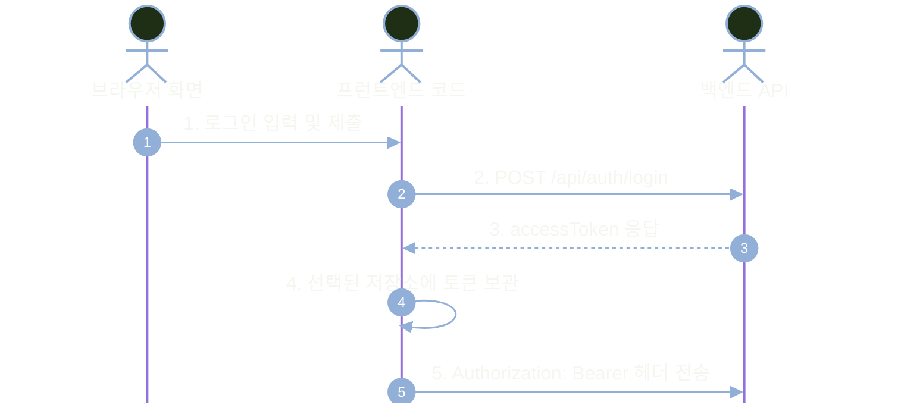
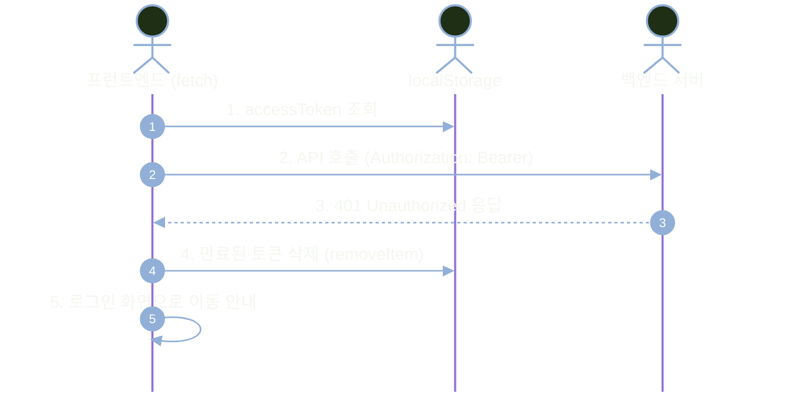
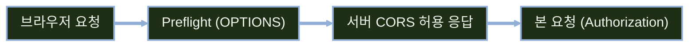

# JWT 토큰 저장 전략과 XSS 방어

---
layout: default
---

# 학습 체크리스트 (1/2)

- [ ] 토큰 저장 위치(메모리·저장소·쿠키)와 전송 방식의 차이를 구분할 수 있다.
- [ ] 브라우저 저장소별 특성과 보안 위험을 비교할 수 있다.
- [ ] XSS의 동작 원리와 토큰 탈취 경로를 이해한다.
- [ ] 안전한 출력 원칙(textContent·이스케이프)과 CSP의 역할을 적용할 수 있다.

---
layout: default
---

# 학습 체크리스트 (2/2)

- [ ] HttpOnly 쿠키의 방어 범위와 한계를 판단할 수 있다.
- [ ] Swagger UI에서 Bearer 토큰 연동 및 실습 편의 설정을 구성한다.
- [ ] fetch 기반 공통 클라이언트 함수로 인증 API를 호출할 수 있다.
- [ ] 401·403 상태 코드 분기와 클라이언트 로그아웃을 처리할 수 있다.

---
layout: default
---

# 학습 범위와 선수 조건

- **선수 지식**: JWT 발급·검증 원리와 Spring Security 필터 체인 무상태 구성
- **핵심 질문**: 발급받은 Access Token을 클라이언트 어디에 안전하게 보관할 것인가
- **실습 환경 기준**: Bearer 헤더 전송 방식과 실습용 약식 localStorage 보관
- **다루지 않는 범위**: 쿠키 인증 체인 전면 구현, Refresh Token 회전 및 BFF 서버 구축

---
layout: default
---

# 전체 진행 순서


---
layout: cover
class: text-center
---

# 저장과 전송의 분리

---
layout: default
---

# 저장 위치와 전송 방식의 분리

- **개념의 독립성**: `Authorization: Bearer` 헤더는 전송 방식이며 저장 위치와는 독립적 결정
- **저장 위치 후보**: 브라우저 메모리 변수, Web Storage(localStorage 등), 쿠키 등이 존재
- **조합의 제약**: `HttpOnly` 쿠키는 JS로 읽을 수 없어 Bearer 헤더에 실어 보낼 수 없음
- **HTTPS 필수 전제**: 전송 방식과 저장 위치 선택과 무관하게 전송 구간 암호화는 기본 전제

---
layout: default
---

# 토큰 수신 이후의 클라이언트 흐름



---
layout: default
---

# 브라우저 토큰 저장 후보 비교

| 저장 위치 | 유지 기간 및 특성 | 주요 보안 위험 및 한계 |
| :--- | :--- | :--- |
| **메모리 변수** | 새로고침 시 소멸, 저장소 잔존 없음 | 실행 중 XSS 공격자가 사용자 권한으로 요청 가능 |
| **localStorage** | 명시적 삭제 전까지 영구 보관 | XSS 발생 시 악성 스크립트가 토큰을 직접 탈취 |
| **sessionStorage** | 현재 탭 닫을 때까지 유지 | localStorage와 동일하게 XSS 직접 탈취에 노출 |
| **HttpOnly 쿠키** | 브라우저가 매 요청 자동 전송 | 스크립트 탈취는 막으나 CSRF 및 요청 위조 대응 필요 |

---
layout: default
---

# 실습의 약식 선택과 실무 권장 아키텍처

- **실습의 약식 방편**: 새로고침 후에도 편리하게 API를 검증하기 위해 localStorage 활용
- **실무 권장 (메모리)**: 전역 상태(Zustand·Redux)나 서버 상태(TanStack Query)로 메모리 보관
- **실무 권장 (쿠키·BFF)**: 새로고침 유지가 필요하면 HttpOnly 쿠키 기반 갱신 또는 BFF 아키텍처 도입
- **방식의 일관성**: 선택한 저장소 전략에 따라 클라이언트 통신과 보안 설계를 일관되게 적용

---
layout: default
---

# 핵심 용어 정리

> **웹 스토리지 (Web Storage)**
>
> 브라우저가 키-값 쌍으로 데이터를 영구 또는 세션 단위로 보관하는 클라이언트 측 저장소 API
>
> **프런트엔드 전담 백엔드 (BFF)**
>
> 프런트엔드와 백엔드 사이에 위치하여 세션과 토큰 변환을 전담하고 브라우저에서 토큰을 격리하는 중간 서버

---
layout: cover
class: text-center
---

# XSS와 출력 안전성

---
layout: default
---

# XSS 공격의 개념과 주요 유입 경로

- **공격 개념**: 검증되지 않은 외부 입력이 HTML·자바스크립트로 해석되어 브라우저에서 실행되는 취약점
- **주요 유입 지점**: 게시판 본문, 댓글, URL 쿼리 파라미터, 동적 DOM 조작 코드 등
- **출력 처리의 핵심**: 악성 스크립트가 실행되는 근본 원인은 잘못된 HTML 렌더링 방식에 기인
- **저장소의 무력화**: XSS가 발생하면 localStorage는 물론 메모리 상의 데이터도 탈취 위험에 직면

---
layout: default
---

# 취약한 DOM 조작과 직접 삽입

```javascript
// 외부 입력값이 HTML 태그로 해석되어 스크립트가 즉시 실행되는 위험한 패턴
commentBox.innerHTML = userComment;
```

- 사용자 입력에 `<script>`나 `onload` 이벤트 핸들러가 포함될 경우 즉시 XSS가 발생합니다.

---
layout: default
---

# XSS를 통한 토큰 탈취 메커니즘


---
layout: default
---

# XSS와 CSRF의 공격 특성 비교

| 구분 | 사이트 간 스크립팅 (XSS) | 사이트 간 요청 위조 (CSRF) |
| :--- | :--- | :--- |
| **실행 위치** | 취약점이 존재하는 **현재 사이트 내부** | 사용자를 유인한 **외부 악성 사이트** |
| **악용 대상** | 브라우저 내 스크립트 실행 권한 및 저장소 | 브라우저의 인증 쿠키 자동 첨부 메커니즘 |
| **주요 방어** | 출력 컨텍스트 인코딩, CSP, 새니타이저 | `SameSite` 쿠키 설정, CSRF 검증 토큰 |

---
layout: default
---

# 안전한 텍스트 렌더링: textContent

```javascript
// 입력값을 단순 텍스트로 취급하여 HTML 태그 실행을 원천 차단하는 안전한 패턴
commentBox.textContent = userComment;
```

- 브라우저가 특수문자를 문자열로 안전하게 처리하므로 악성 스크립트가 실행되지 않습니다.

---
layout: default
---

# 템플릿 엔진의 이스케이프 정책

```html
<!-- 안전: 특수문자를 &lt;, &gt; 등으로 자동 이스케이프 -->
<p th:text="${userComment}">댓글 내용</p>

<!-- 위험: HTML 태그를 그대로 출력하므로 XSS에 직접 노출 (사용 금지) -->
<p th:utext="${userComment}">댓글 내용</p>
```

- 서버 사이드 렌더링 환경에서는 검증되지 않은 원본 HTML 출력(`th:utext`)을 금지해야 합니다.

---
layout: default
---

# 제한적 HTML 허용과 콘텐츠 보안 정책

- **HTML 새니타이저**: 서식 있는 텍스트 허용 시 DOMPurify 등 검증된 라이브러리 필수 사용
- **정규식 처리 금지**: 정규식 기반 태그 제거는 우회 패턴이 많아 보안상 취약하므로 지양
- **CSP 보조 방어**: 브라우저에서 실행 가능한 스크립트 출처를 제한하는 심층 방어 체계 구축
- **Report-Only 검증**: 운영 적용 전 `Report-Only` 모드로 기존 기능 깨짐을 먼저 확인 후 적용

---
layout: default
---

# HttpOnly 쿠키의 방어 범위와 한계

| 공격 유형 | 방어 성공 여부 | 동작 메커니즘 및 설명 |
| :--- | :--- | :--- |
| **JS 토큰 값 조회** | **방어 성공** | `document.cookie` 접근이 차단되어 토큰 값 직접 유출 불가 |
| **XSS 기반 API 호출** | **방어 불가** | 악성 스크립트가 사용자를 대신해 fetch 호출 시 쿠키 자동 전송 |
| **CSRF 요청 위조** | **별도 방어 필요** | 외부 사이트 유도 공격에 취약하므로 `SameSite` 설정 필수 |

---
layout: default
---

# 쿠키 기반 인증 채택 시 고려사항

- **쿠키 보안 속성**: `HttpOnly`, `Secure`, `SameSite=Lax/Strict`를 반드시 동시에 지정
- **CSRF 방어 체계**: 브라우저 자동 전송 특성을 막기 위해 CSRF 토큰 발급 및 검증 결합 필수
- **도메인 정책 통제**: 프런트엔드와 백엔드 간 도메인이 다를 경우 쿠키 전송 제약 검토 필요
- **체계적 구성 전환**: 헤더 방식 코드의 단순 변경이 아닌 로그인·필터·로그아웃을 일체형으로 설계

---
layout: default
---

# 핵심 용어 정리

> **사이트 간 스크립팅 (XSS)**
>
> 공격자가 웹 페이지에 악성 스크립트를 삽입하여 사용자의 브라우저에서 실행되도록 만드는 공격
>
> **콘텐츠 보안 정책 (CSP)**
>
> 신뢰할 수 있는 스크립트 출처를 선언하여 허용되지 않은 인라인 코드나 외부 스크립트 실행을 막는 보안 헤더

---
layout: cover
class: text-center
---

# 클라이언트 연동 실습

---
layout: default
---

# OpenAPI SecurityScheme 선언과 Bearer 연동

```java
@Configuration
@SecurityScheme(
    name = "bearerAuth",
    type = SecuritySchemeType.HTTP,
    scheme = "bearer",
    bearerFormat = "JWT",
    description = "로그인 후 발급받은 Access Token을 Bearer 접두사 없이 입력하세요."
)
public class OpenApiConfig { }
```

- Swagger UI 상단에 `Authorize` 팝업을 활성화하고 토큰 입력 안내를 제공합니다.

---
layout: default
---

# Swagger UI를 통한 토큰 주입 절차

| 단계 | 조작 과정 | 핵심 확인 포인트 |
| :--- | :--- | :--- |
| **1단계** | 로그인 API 호출 | `POST /api/auth/login`을 실행하여 응답 JSON 수신 |
| **2단계** | accessToken 복사 | 발급된 `accessToken` 문자열 값만 클립보드에 복사 |
| **3단계** | Authorize 팝업 입력 | **`Bearer ` 접두사 없이** 순수 토큰 문자열만 붙여넣기 |
| **4단계** | 보호된 API 호출 | Swagger UI가 요청 헤더에 `Authorization: Bearer <토큰>` 첨부 |

- 입력란에 `Bearer `를 중복 입력하면 `Bearer Bearer eyJ...`가 되어 401 오류가 발생합니다.

---
layout: default
---

# 개발 환경 인증 상태 유지 설정

```yaml
springdoc:
  swagger-ui:
    persist-authorization: true
```

- Swagger UI 새로고침 시에도 인증 토큰을 브라우저에 유지시키는 개발 실습 편의용 설정입니다.

---
layout: default
---

# fetch 기반 인증 요청 및 오류 처리 흐름



---
layout: default
---

# API 상수 정의 및 ProblemDetail 파서

```javascript
const API_BASE = "http://localhost:8080";
const TOKEN_KEY = "accessToken";

async function readProblem(response, fallbackMessage) {
  try {
    const data = await response.json();
    return data.detail || fallbackMessage;
  } catch {
    return fallbackMessage;
  }
}
```

- 서버의 ProblemDetail 응답에서 `detail` 오류 메시지를 안전하게 추출합니다.

---
layout: default
---

# 사용자 로그인 및 토큰 보관 처리

```javascript
async function login(username, password) {
  const res = await fetch(`${API_BASE}/api/auth/login`, {
    method: "POST",
    headers: { "Content-Type": "application/json" },
    body: JSON.stringify({ username, password })
  });
  if (!res.ok) throw new Error(await readProblem(res, "로그인에 실패했습니다."));
  const data = await res.json();
  localStorage.setItem(TOKEN_KEY, data.accessToken);
}
```

- 실습 편의상 localStorage를 사용하며, 실무에서는 메모리 전역 상태 보관을 권장합니다.

---
layout: default
---

# 인증 요청 공통 함수: Headers 구성

```javascript
async function createAuthHeaders(customHeaders = {}) {
  const headers = new Headers(customHeaders);
  const token = localStorage.getItem(TOKEN_KEY);
  if (token) {
    headers.set("Authorization", `Bearer ${token}`);
  }
  return headers;
}
```

- 모든 보호된 API 호출 시 Bearer 헤더 주입 로직을 단일 함수로 일원화합니다.

---
layout: default
---

# 인증 요청 공통 함수: 상태 코드 분기

```javascript
async function authorizedFetch(path, options = {}) {
  const headers = await createAuthHeaders(options.headers);
  const res = await fetch(`${API_BASE}${path}`, { ...options, headers });
  if (res.status === 401) {
    localStorage.removeItem(TOKEN_KEY);
    throw new Error(await readProblem(res, "인증이 만료되었습니다."));
  }
  if (res.status === 403) throw new Error(await readProblem(res, "접근 권한 부족"));
  if (!res.ok) throw new Error(await readProblem(res, "요청 실패"));
  return res;
}
```

- 401(인증 만료 시 토큰 삭제)과 403(권한 부족 시 토큰 유지)을 명확히 분기 처리합니다.

---
layout: default
---

# 401과 403 상태 코드별 클라이언트 대응

| HTTP 상태 코드 | 의미 및 원인 | 클라이언트 필수 후속 동작 |
| :--- | :--- | :--- |
| **`401 Unauthorized`** | 토큰 부재, 서명 위조 또는 유효 시간 만료 | 저장된 토큰 삭제 후 로그인 화면으로 전환 유도 |
| **`403 Forbidden`** | 신원은 유효하나 리소스 접근 권한 부족 | 토큰을 유지한 채 "권한 부족" 안내 메시지 표출 |

- 403 발생 시 토큰을 삭제하면 사용자가 불필요하게 다시 로그인해야 하는 혼란이 발생합니다.

---
layout: default
---

# 클라이언트 로그아웃과 토큰 무효화 한계

```javascript
function logout() {
  localStorage.removeItem(TOKEN_KEY);
}
```

- 클라이언트 토큰 삭제는 브라우저 저장소 비우기일 뿐이며, 이미 유출된 JWT 자체를 무효화하지는 못합니다.

---
layout: cover
class: text-center
---

# CORS와 트러블슈팅

---
layout: default
---

# 교차 출처 요청과 Preflight 검증 흐름



---
layout: default
---

# 서버 측 CORS 허용 정책 구성

```java
CorsConfiguration config = new CorsConfiguration();
config.setAllowedOrigins(List.of("http://localhost:5173"));
config.setAllowedMethods(List.of("GET", "POST", "PUT", "DELETE", "OPTIONS"));
config.setAllowedHeaders(List.of("Authorization", "Content-Type"));
```

- Bearer 헤더 전송을 위해 백엔드 CORS 정책에 `Authorization` 헤더 허용이 반드시 포함되어야 합니다.

---
layout: default
---

# Bearer 헤더 방식의 자격 증명 설정

- **쿠키 미전송 구조**: 헤더 방식 통신은 브라우저의 자동 쿠키 첨부 메커니즘을 사용하지 않음
- **allowCredentials 불필요**: 서버의 `setAllowCredentials(true)` 설정이 불필요하며 보안 노출 최소화
- **credentials include 불필요**: 클라이언트 fetch 호출 시 `credentials: 'include'` 옵션 생략 가능
- **쿠키 전환 시 요구**: 만약 쿠키 기반 인증으로 전환할 경우에는 양쪽 모두 필수 활성화 필요

---
layout: default
---

# 토큰 연동 시 자주 발생하는 문제 (1/2)

| 발생 증상 | 주요 원인 | 점검 및 해결 방안 |
| :--- | :--- | :--- |
| **로그인 후에도 계속 401** | `Authorization` 헤더 공백 누락 또는 오타 | `Bearer ` 뒤 공백 및 토큰 값 형식 확인 |
| **Swagger 호출 시 401 오류** | Authorize 입력창에 `Bearer ` 접두사 중복 입력 | 접두사를 제외한 순수 토큰 값만 입력 |

---
layout: default
---

# 토큰 연동 시 자주 발생하는 문제 (2/2)

| 발생 증상 | 주요 원인 | 점검 및 해결 방안 |
| :--- | :--- | :--- |
| **교차 출처 호출 시 CORS 차단** | 서버 CORS 정책에 `Authorization` 미허용 | `setAllowedHeaders`에 인증 헤더 추가 |
| **로그아웃 후 복사된 토큰 동작** | JWT 무상태 특성상 만료 전까지 서명 유효 | 정상 동작이며 단기 수명 및 블랙리스트로 관리 |

---
layout: default
---

# 클라이언트 보안 진단 순서

- **1단계: 네트워크 탭 점검**: 브라우저 F12 개발자 도구에서 요청 헤더와 응답 상태 코드(401/403) 확인
- **2단계: 헤더 포맷 검사**: `Authorization: Bearer <토큰>` 문자열의 띄어쓰기 및 접두사 정확성 검토
- **3단계: 저장소 토큰 점검**: 로그인 성공 후 `TOKEN_KEY`가 의도한 저장소에 올바르게 쓰였는지 확인
- **4단계: 토큰 노출 방지**: 실제 토큰 문자열을 콘솔에 출력하거나 외부 디코더 사이트에 붙여넣지 않음

---
layout: default
---

# 학습 요약 (1/2)

- **저장과 전송의 분리**: `Bearer` 헤더는 전송 방식이며, 실습의 약식 localStorage와 실무의 메모리 보관을 구분
- **저장소별 보안 특성**: 메모리는 안전하나 휘발성, Web Storage는 XSS 취약, HttpOnly는 JS 접근 차단
- **XSS와 출력 안전성**: 사용자 입력은 `textContent` 및 이스케이프 처리하며, 검증된 새니타이저 사용
- **심층 방어 체계**: CSP는 스크립트 출처를 제한하는 보조 방어선이며 출력 인코딩을 대체하지 못함

---
layout: default
---

# 학습 요약 (2/2)

- **Swagger UI 연동**: Bearer 스킴을 선언하고 `persist-authorization`으로 개발 편의성을 향상
- **공통 클라이언트 함수**: `authorizedFetch`로 헤더를 주입하고 401(토큰 삭제)과 403(안내)을 분기 처리
- **CORS 헤더 허용**: 교차 출처 통신 시 `Authorization` 헤더를 허용하며, 헤더 방식은 자격 증명 옵션 불필요
- **로그아웃의 한계**: 클라이언트 저장소 삭제는 로컬 비우기이며, 실무에서는 짧은 토큰 수명으로 통제

---
layout: cover
class: text-center
---

# 예상 질문과 답변

---
layout: default
---

# Q&A: 구현 (1)

- **Q. 메모리 변수에만 토큰을 두면 새로고침 시 로그인이 풀리는데 어떻게 하나요?**
- A. 실무에서는 HttpOnly 쿠키 기반의 Refresh Token을 이용한 자동 재발급(Silent Refresh)이나 BFF 아키텍처를 도입해 상태를 복원하며, 취약한 localStorage 방치는 지양합니다.

- **Q. 403을 받았을 때도 토큰을 지우면 안 되나요?**
- A. 안 됩니다. 403은 인증 자체는 성공했으나 권한이 부족한 상태이므로, 토큰을 지우면 불필요한 재로그인을 유발하여 사용자 경험을 해치게 됩니다.

---
layout: default
---

# Q&A: 구현 (2)

- **Q. authorizedFetch 같은 공통 함수를 왜 따로 두나요?**
- A. 헤더 주입, 상태 코드별 분기, 에러 메시지 파싱 로직을 한곳에 모아 관리하고, 향후 저장소나 인증 전략이 변경될 때의 코드 수정 범위를 최소화하기 위함입니다.

- **Q. innerHTML을 꼭 써야 하는 서식 편집기 화면은 어떻게 하나요?**
- A. DOMPurify 같은 검증된 HTML 새니타이저로 위험 태그를 걸러낸 후 출력해야 하며, 허용 태그를 최소화하고 정규식 자체 구현은 절대 피해야 합니다.

---
layout: default
---

# Q&A: 성능

- **Q. 매 요청마다 localStorage를 읽는 비용은 문제가 되나요?**
- A. 동기 I/O이지만 데이터 크기가 작아 체감 성능 영향은 미미합니다. 다만 잦은 렌더링 루프 내 반복 호출은 피하고 메모리 상태와 동기화하는 것을 권장합니다.

- **Q. CSP를 적용하면 페이지 로딩이 느려지나요?**
- A. 브라우저의 정책 파싱 비용은 무시할 수 있는 수준입니다. 성능보다는 인라인 스크립트 차단으로 인한 화면 동작 실패를 방지하기 위해 Report-Only로 사전 검증하는 것이 중요합니다.

---
layout: default
---

# Q&A: 실무

- **Q. 실무 SPA에서는 결국 어떤 조합을 가장 많이 쓰나요?**
- A. 단기 Access Token은 메모리 상태로 유지하고, 재발급용 Refresh Token은 HttpOnly·Secure 쿠키로 보관하거나, 규모가 큰 엔터프라이즈 환경에서는 BFF를 도입합니다.

- **Q. XSS를 단 하나의 보안 조치로 완전히 막을 수 있나요?**
- A. 불가능합니다. 출력 컨텍스트에 맞는 인코딩을 기본으로 하고, 새니타이저, CSP, 짧은 만료 시간 설정을 결합한 다층 심층 방어(Defense in Depth) 전략을 갖춰야 합니다.
