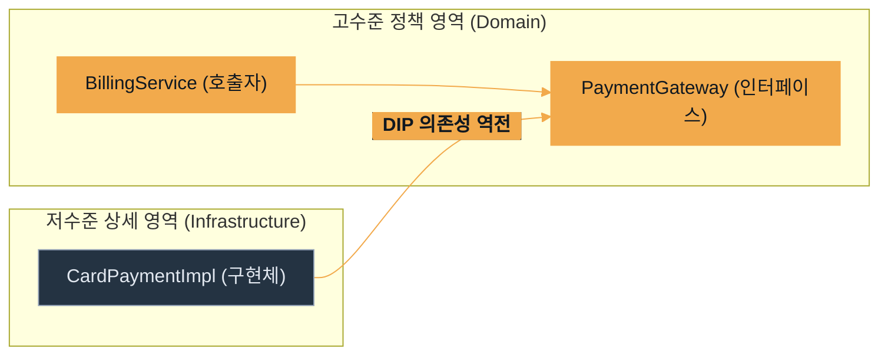

# Java OOP 구현

---
layout: default
---

# 학습 체크리스트

- [ ] **SOLID 5대 설계 원칙**의 세부 개념과 코드 수준의 리팩토링 기법 숙지
- [ ] **싱글톤 패턴**의 구현 및 결함, 그리고 스프링 컨테이너를 통한 극복 방안 이해
- [ ] **JDK LTS 버전별** 핵심 릴리즈 로드맵과 런타임 최적화 스펙 파악
- [ ] 본 과정의 실습 환경 기준인 **JDK 17** 수준의 핵심 API (enum, Record, HttpClient, 텍스트 블록) 실무 활용력 확보

---
layout: cover
class: text-center
---

# SOLID (객체 지향 설계의 5대 원칙)

---
layout: default
class: text-sm-slide
---

# SOLID 설계 원칙 개요

<div class="text-sm mt-2">

| 약어 | 설계 원칙 | 핵심 키워드 | 목적 |
| :--- | :--- | :--- | :--- |
| **SRP** | 단일 책임 원칙 | 변경의 이유, 단일 책임 | 응집도 향상, 변경 전파 제어 |
| **OCP** | 개방-폐쇄 원칙 | 확장에 개방, 수정에 폐쇄 | 코드 수정 없는 기능 확장 |
| **LSP** | 리스코프 치환 원칙 | 상위 타입 대체 가능성 | 올바른 상속 계층과 다형성 보장 |
| **ISP** | 인터페이스 분리 원칙 | 클라이언트별 인터페이스 세분화 | 불필요한 의존성 연결 제거 |
| **DIP** | 의존역전 원칙 | 추상화 의존, 구현체 의존 금지 | 느슨한 결합도 구현 |

</div>

---
layout: default
---

# 단일 책임 원칙

> **단일 책임 원칙 (Single Responsibility Principle - SRP)**
>
> 하나의 클래스는 단 하나의 변경 이유(책임)만을 가져야 함
- **원인과 결과**: 클래스가 다중 책임을 지닐 경우, 특정 책임의 요구사항 변경이 무관한 다른 기능의 오작동 및 컴파일 에러를 유발
- **해결 방안**: 책임을 기준으로 클래스를 분할하여 변경 전파 범위를 최소화하고 높은 응집도를 확보
- **현실적 비유**: 다용도 아웃도어 칼보다 회칼, 빵 칼처럼 전문화된 도구들이 각각 관리 및 고장 시 유지관리가 훨씬 쉬운 것과 같음

---
layout: default
---

## 위반 구조 (다중 책임)

```java
public class UserProcessor {
    // 회원 정보 처리와 메일 발송 책임을 동시에 소유
    public void registerUser(User user) { /* 등록 로직 */ }
    public void sendEmail(String msg) { /* 발송 로직 */ }
}
```

---
layout: default
---

## 준수 구조 (책임 분리)

```java
public class UserRepository {
    public void save(User user) { /* 등록 전용 */ }
}

public class EmailService {
    public void send(String msg) { /* 발송 전용 */ }
}
```

---
layout: default
---

# 개방-폐쇄 원칙

> **개방-폐쇄 원칙 (Open-Closed Principle - OCP)**
>
> 소프트웨어 엔티티(클래스, 모듈 등)는 확장에는 열려 있어야 하고, 변경에는 닫혀 있어야 함
- **원인과 결과**: 요구사항이 추가될 때마다 기존 호출부나 구현부 코드를 수정해야 한다면 시스템의 취약성이 급격히 증가함
- **해결 방안**: 다형성과 인터페이스를 기반으로 추상적 사양을 선언하고, 실제 확장은 이를 구현한 신규 클래스로 수행
- **현실적 비유**: 벽면 콘센트 배선 (기존 코드)을 뜯지 않고 다양한 플러그 (새 확장 기능)를 꽂아 다양한 전기기기를 동작시키는 것과 같음

---
layout: default
---

## 준수 설계 (인터페이스 확장)

```java
public interface Payment {
    void pay(int amount);
}

public class CardPayment implements Payment {
    public void pay(int amount) { /* 카드 결제 */ }
}
// 신규 결제 수단 추가 시 기존 Payment 호출 코드는 수정 불요
```

---
layout: default
---

# 리스코프 치환 원칙

> **리스코프 치환 원칙 (Liskov Substitution Principle - LSP)**
>
> 하위 타입의 객체는 프로그램의 논리적 계약을 깨뜨리지 않고 언제나 상위 타입의 객체와 상호 대체 가능해야 함
- **상속의 규칙**: 자식 클래스는 부모 클래스의 명세와 행위 규격 (사전 조건, 사후 조건)을 왜곡하지 않아야 다형성이 안전하게 작동함
- **위반 사례**: 부모가 "양수만 반환"하기로 약속한 메서드인데, 자식 클래스에서 "음수를 반환"하도록 무단 재정의하여 계약을 깨뜨리는 상황
- **현실적 비유**: 규격화된 A4 용지 서랍에 정확히 맞아 들어가는 A4 전용 용지 대신, 규격을 어기고 가로 폭이 더 넓은 불규칙한 종이를 넣어 오작동을 내는 것과 같음

---
layout: default
---

# 인터페이스 분리 원칙

> **인터페이스 분리 원칙 (Interface Segregation Principle - ISP)**
>
> 클라이언트는 자신이 사용하지 않는 메서드에 의존하도록 강제되지 않아야 함
- **원인과 결과**: 하나의 거대한 다목적 인터페이스는 이를 구현하는 하위 구체 클래스들에게 의미 없는 빈 메서드 구현을 강제함
- **해결 방안**: 기능적 응집도를 지닌 소형 인터페이스들로 잘게 분할하고, 구체 클래스가 필요한 인터페이스들만 다중 구현하도록 유도
- **현실적 비유**: 팩스 기능이 없는 소형 프린터가 '인쇄/스캔/팩스/복사' 기능이 모두 합쳐진 통합 인터페이스 때문에 억지로 빈 팩스 메서드를 들고 있어야 하는 낭비를 막는 것

---
layout: default
---

## 위반 구조 (거대 인터페이스)

```java
public interface MultiPrinter {
    void print();
    void fax(); // 팩스 기능이 없는 프린터도 이를 구현해야 함
}
```

---
layout: default
---

## 준수 구조 (인터페이스 분할)

```java
public interface Printer { void print(); }
public interface FaxSender { void fax(); }

public class BasicPrinter implements Printer {
    public void print() { /* 출력만 전담 */ }
}
```

---
layout: default
---

# 의존역전 원칙

> **의존역전 원칙 (Dependency Inversion Principle - DIP)**
>
> 고수준 모듈은 저수준 모듈의 구체 구현에 의존해서는 안 되며, 양쪽 모두 추상화(인터페이스)에 의존해야 함
- **원인과 결과**: 상위 정책 클래스가 하부의 구체 클래스를 직접 의존 (`new`)하면, 하부 기술 변경 시 상위 코드가 통째로 수정되어야 함
- **해결 방안**: 중간에 인터페이스를 두어 의존성을 역전시킴으로써 모듈 간의 결합도를 느슨하게 통제
- **현실적 비유**: 자동차 차축 설계가 특정 제조사 타이어 규격에 종속되지 않고, 중간에 '표준 휠 규격 (인터페이스)'을 두고 바퀴를 교체하는 것과 같음

---
layout: default
---

# 의존성 흐름 시각화



---
layout: cover
class: text-center
---

# 싱글톤 (Singleton) 패턴

---
layout: default
---

## private 생성자와 static 인스턴스 반환

```java
public class CacheManager {
    private static final CacheManager INSTANCE = new CacheManager();
    private CacheManager() {} // 외부 인스턴스 생성 차단
    public static CacheManager getInstance() {
        return INSTANCE;
    }
}
```

---
layout: default
---

# 싱글톤 패턴의 개념과 필요성

- **정의**: JVM 런타임 내부에서 특정 클래스의 인스턴스를 단 하나만 생성 및 보존하도록 제약하는 디자인 패턴
- **사용 목적**: 시스템 전역에서 상태를 공유하거나 인스턴스 생성 비용이 무거운 공유 자원(Connection Pool, 설정 관리자)을 안전하게 통제
- **구현 방식**: `private` 생성자를 통한 외부 new 호출 완전 차단, `static` 메서드를 통한 전역 단일 진입점 제공

---
layout: default
---

# 싱글톤 패턴의 아키텍처적 결함

- **결합도 상승**: 클래스가 특정 static 구현 객체에 강하게 종속되어 SOLID의 **DIP 원칙**을 직접적으로 위배
- **테스트 제약**: 상태가 전역적으로 유지되므로 매 단위 테스트(Unit Test) 시 정적 필드 초기화가 어렵고 Mocking 대입이 불가
- **유연성 결여**: 상속이나 다형성 활용이 원천 배제되어 객체지향 설계의 본질적 이점을 상실

---
layout: default
---

# 싱글톤 레지스트리 (Spring Container)

- **스프링의 보완**: 스프링 프레임워크는 자바 코드 수준의 부자연스러운 static 싱글톤 구조를 걷어내고 컨테이너 수준에서 빈(Bean) 수명 제어
- **POJO 유지**: 일반적인 자바 클래스(POJO) 형태로 객체를 선언하고, 수명 주기를 **싱글톤 레지스트리**를 통해 싱글톤으로 안전하게 관리
- **유연한 주입**: 의존성 주입(DI)을 활용해 싱글톤 라이프사이클을 유지하면서도 인터페이스 의존 (DIP) 및 Mock 테스트를 원활히 지원

---
layout: default
---

# 디자인 패턴 추천 학습 경로

- **Refactoring Guru** (디자인 패턴 개념 및 구현 가이드):
  - [Refactoring Guru 디자인 패턴](https://refactoring.guru/ko/design-patterns)
- **Patterns Dev** (모던 자바스크립트 및 공통 아키텍처 패턴):
  - [Design Pattern 소개](https://patterns-dev-kr.github.io/design-patterns/introduction/)

---
layout: cover
class: text-center
---

# JDK LTS 로드맵

---
layout: default
---

# JDK LTS 주요 변경 사양 요약

| 버전 | 출시 형태 | 주요 패러다임 변화 및 도입 핵심 기능 |
| :--- | :--- | :--- |
| **JDK 8** | LTS | 람다식(Lambda), 스트림 API(Stream), 디폴트 메서드 |
| **JDK 11** | LTS | HTTP/2 지원 HttpClient 표준화, 로컬 변수 타입 추론 `var` |
| **JDK 17** | LTS (실습 기준) | Text Block 정식 도입, 불변 데이터 객체 Record 정식 도입 |
| **JDK 21** | LTS | Virtual Thread 경량 동시성 모델, Record 패턴 매칭 |
| **JDK 25** | LTS | 메모리 제어 고성능 모델, 차세대 비동기 프로그래밍 모델 예정 |

---
layout: default
---

# JDK 8 & 11 주요 변경 사양

- **JDK 8 (함수형 전면 도입)**:
  - 람다식 및 스트림 API를 통해 선언형/함수형 프로그래밍 스타일을 언어 차원에서 완성
  - 인터페이스에 구현을 담을 수 있는 `default` 메서드를 제공하여 라이브러리 하위 호환성 확보
- **JDK 11 (실무 생산성 강화)**:
  - 새로운 표준 HTTP 클라이언트인 `HttpClient`를 내장하여 외부 의존성 제거
  - 로컬 변수 선언 시 타입 추론 키워드인 `var` 지원 범위 확대

---
layout: default
---

# JDK 17 & 21 주요 변경 사양

- **JDK 17 (본 과정 실습 기준 버전)**:
  - 가독성을 획기적으로 개선한 `Text Block` 탑재
  - Lombok 없이 불변 DTO를 설계할 수 있는 `Record` 클래스 정식 도입
- **JDK 21 (경량 동시성 혁신)**:
  - OS 스레드 매핑 부담을 소거하여 대규모 동시 요청을 처리하는 가상 스레드 (`Virtual Thread`) 도입
  - Record 구조를 분해하여 간결하게 조건 분기하는 패턴 매칭 적용
- **JDK 25 (향후 전망)**:
  - 메모리 고효율 하드웨어 최적화 및 비동기 처리 극대화 스펙 탑재 예정

---
layout: cover
class: text-center
---

# 실무 핵심 Java 문법 및 API (JDK 17 기준)

---
layout: default
---

## 필드와 생성자를 지닌 enum 선언

```java
public enum Role {
    ADMIN("관리자"), USER("사용자");
    private final String description;
    Role(String desc) { this.description = desc; }
    public String getDescription() { return description; }
}
```

---
layout: default
---

# enum : 열거형 클래스

- **개념**: 단순 정수나 문자열 상수의 나열 방식을 극복하고, 개별 상수를 독립된 객체 인스턴스로 취급하는 문법
- **타입 안정성 보장**: 지정된 enum 타입 외의 다른 값 전달을 컴파일 시점에 완벽히 차단
- **풍부한 속성**: 필드와 생성자, 비즈니스 메서드를 자유롭게 탑재할 수 있어 상수와 관련된 비즈니스 로직을 열거형 내부에 캡슐화 가능

---
layout: default
---

# enum : JS/TS 진영과의 매핑 비교

- **JS/TS의 한계**: JavaScript는 표준 enum이 없고, TypeScript의 `enum`은 트리 셰이킹 (Tree-shaking) 시 사용되지 않는 코드도 번들에 잔존하는 한계 발생
- **TS의 대안**: 실무에서는 이를 피하기 위해 `const Role = { ADMIN: 'ADMIN' } as const` 형태의 객체 상수를 선언해 활용함
- **Java의 우위**: 단순 문자열 상수를 넘어 필드와 비즈니스 메서드를 클래스처럼 완전하게 탑재한 독립형 인스턴스 객체로 동작하여 구조적 우위 확보

---
layout: default
---

## DTO 설계를 위한 record 선언

```java
public record UserDto(Long id, String name) {
    // Getter, equals, hashCode, toString 자동 생성
}
```

---
layout: default
---

# Record : 불변 데이터 객체

- **개념**: 데이터를 전송하고 보관하기 위한 목적으로 설계된 JDK 15/17+ 정식 스펙의 불변 (Immutable) 데이터 모델
- **상태의 불변성**: 선언된 모든 필드는 묵시적으로 `private final` 처리되어 한 번 대입된 값을 바꿀 수 없음
- **보일러플레이트 제거**: Lombok 같은 서드파티 라이브러리 의존 없이 클래스 선언 한 줄로 필수 메서드(Getter, 생성자 등) 자동 탑재

---
layout: default
---

# Record : JS/TS 진영과의 매핑 비교

- **JS/TS의 방식**: 객체의 불변성을 유지하기 위해 `Object.freeze()`를 호출하거나, TypeScript에서 `readonly` 지시어를 타입 속성에 수동 부여
- **Lombok 대비**: 자바 레코드는 롬복 (`@Value`, `@Getter` 등)이 제공하던 보일러플레이트 제거 역할을 JDK 표준 명세 수준으로 안전하게 대체
- **Java의 장점**: 언어 레벨에서 생성자, Getter, `equals`, `hashCode`, `toString`을 네이티브하게 보장하며 데이터 클래스의 격을 확립

---
layout: default
---

## HttpClient를 활용한 GET 요청 전송

```java
HttpClient client = HttpClient.newHttpClient();
HttpRequest request = HttpRequest.newBuilder()
    .uri(URI.create("https://api.example.com"))
    .build();
HttpResponse<String> response = 
    client.send(request, BodyHandlers.ofString());
```

---
layout: default
---

# HttpClient API

- **도입 취지**: JDK 11부터 기본 탑재된 현대적 표준 HTTP 통신 모듈로, 기존의 무겁고 노후화된 `HttpURLConnection`을 전면 대체
- **비차단 비동기 지원**: 동기 처리뿐만 아니라 `sendAsync()` 메서드를 통한 리액티브 형태의 비동기 네트워크 통신을 유연하게 제어
- **HTTP/2 표준 지원**: HTTP/1.1 외에도 대용량 전송 효율을 향상하는 HTTP/2 및 WebSocket 표준 사양을 완벽히 수용

---
layout: default
---

# HttpClient : JS/TS 진영과의 매핑 비교

- **JS/TS의 방식**: 브라우저 표준 `fetch` API 혹은 Node.js/브라우저 통합용 외부 라이브러리인 `axios`를 주로 활용
- **Java의 발전**: 과거 Apache HttpClient 등 무거운 서드파티 라이브러리 종속성에서 벗어나 언어 내장 표준 API로 통일
- **구조적 차이**: JS는 Promise 기반의 `async/await` 흐름을 사용하며, Java 11의 `HttpClient` 역시 비동기 리액티브 스트림 기반 `sendAsync` 지원

---
layout: default
---

## 텍스트 블록을 활용한 JSON 포맷팅

```java
String json = """
    {
      "id": %d,
      "name": "%s"
    }
    """.formatted(1, "Java");
```

---
layout: default
---

# 텍스트 블록 (Text Block)

- **개념**: 세 개의 쌍따옴표 (`"""`)를 여닫는 구분자로 삼아 다중 행 문자열을 소스코드 내에 직관적으로 적재하는 문법 도구
- **이스케이프 소거**: JSON, SQL, HTML 등의 포맷 문자열을 작성할 때 빈번히 사용되던 역슬래시 이스케이프 (`\"`, `\n`)를 완전히 제거
- **들여쓰기 자동 정렬**: 닫는 세 개의 쌍따옴표 정렬 위치를 바탕으로 소스코드 가독성을 해치지 않으면서 공백 깊이를 자동으로 계산하여 출력
- **동적 포맷팅 지원**: String 클래스의 `formatted()` 인스턴스 메서드를 결합해 텍스트 블록 내부의 서식자에 동적 데이터를 대입

---
layout: default
---

# 텍스트 블록 서식자 규칙

> **서식자 (Format Specifier)**
>
> 문자열 포맷팅 시 동적으로 삽입되는 데이터의 타입과 출력 규격을 지정하는 특수 지시어

- **정수 (`%d`) & 실수 (`%f`)**: 수치형 데이터 전용 지시어. 실수 대입 시 소수점 아래 자릿수를 제한하려면 `%.2f` 형태로 지정하여 정밀도 제어 가능. JSON 변환 시 따옴표 없이 `"id": %d, "ratio": %f` 형태로 작성
- **문자열 (`%s`)**: 문자열 데이터 전용 지시어. JSON 문법 스펙 준수를 위해 반드시 쌍따옴표로 감싼 `"name": "%s"` 형태로 작성해야 정상 파싱 가능
- **논리형 (`%b`)**: 참/거짓(`true`/`false`) 데이터 전용 지시어. 수치형과 마찬가지로 JSON 매핑 시 따옴표 없이 `"active": %b` 형태로 작성

---
layout: default
---

# Text Block : JS/TS 진영과의 매핑 비교

- **JS/TS의 템플릿 리터럴**: 백틱 (\` \`)을 사용하는 JavaScript의 **템플릿 리터럴** (Template Literal) 기능과 매우 유사한 포맷 방식
- **공통점**: 이스케이프 문자나 문자열 접합 연산자(`+`) 없이 개행 및 구조화된 JSON, SQL, HTML 문자열을 소스코드 내에 날것 그대로 배치 가능
- **차이점**: JS 템플릿 리터럴은 `${variable}`을 통한 변수 바인딩을 기본 지원하나, Java Text Block은 `formatted()` 등의 별도 메서드 호출을 요구함
